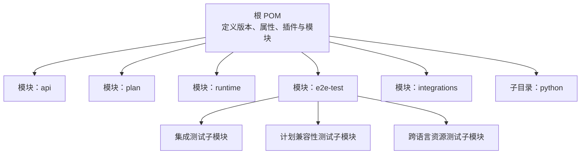
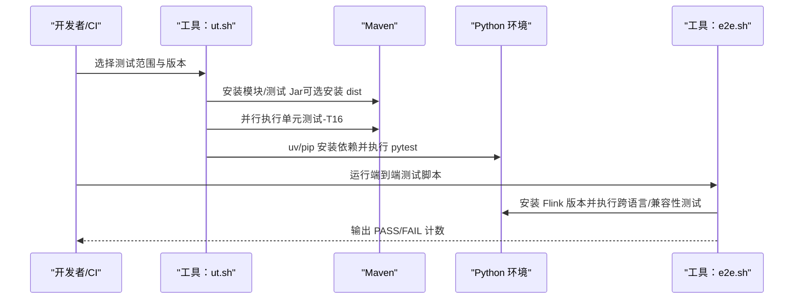
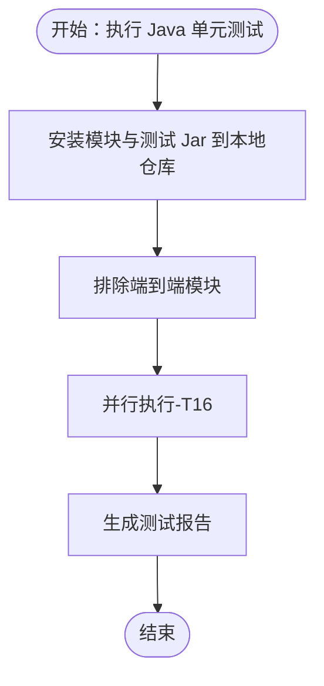
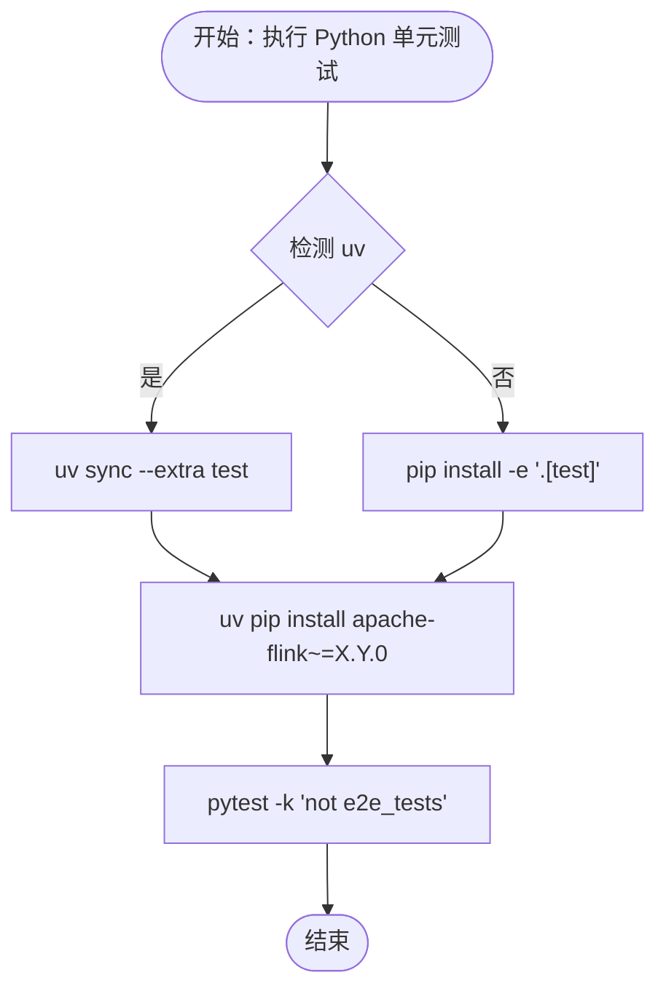
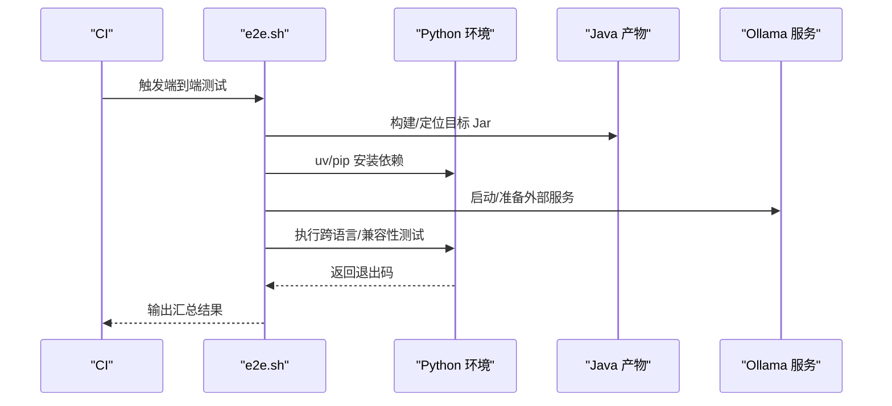
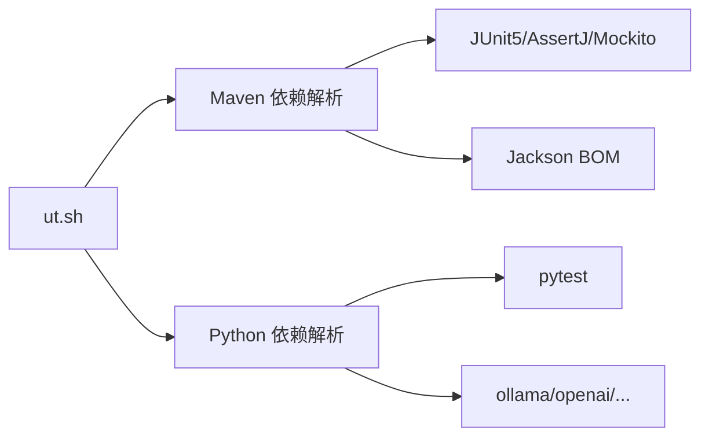

# 测试自动化

<cite>
**本文引用的文件**
- [根 POM（pom.xml）](file://pom.xml)
- [构建脚本（tools/build.sh）](file://tools/build.sh)
- [单元与端到端测试总控（tools/ut.sh）](file://tools/ut.sh)
- [端到端测试脚本（tools/e2e.sh）](file://tools/e2e.sh)
- [Ollama 启动脚本（tools/start_ollama_server.sh）](file://tools/start_ollama_server.sh)
- [API 模块 POM（api/pom.xml）](file://api/pom.xml)
- [运行时模块 POM（runtime/pom.xml）](file://runtime/pom.xml)
- [端到端测试聚合 POM（e2e-test/pom.xml）](file://e2e-test/pom.xml)
- [Python 项目配置（python/pyproject.toml）](file://python/pyproject.toml)
- [Java 单测样例（api/src/test/java/.../ReActAgentTest.java）](file://api/src/test/java/org/apache/flink/agents/api/agents/ReActAgentTest.java)
- [Java 集成单测样例（e2e-test/.../integration/test/ReActAgentTest.java）](file://e2e-test/flink-agents-end-to-end-tests-integration/src/test/java/org/apache/flink/agents/integration/test/ReActAgentTest.java)
- [Python 单测样例（python/flink_agents/api/tests/test_decorators.py）](file://python/flink_agents/api/tests/test_decorators.py)
- [Python 端到端样例（python/flink_agents/e2e_tests/.../react_agent_test.py）](file://python/flink_agents/e2e_tests/e2e_tests_integration/react_agent_test.py)
- [端到端日志配置（e2e-test/.../resources/log4j2-test.properties）](file://e2e-test/flink-agents-end-to-end-tests-integration/src/test/resources/log4j2-test.properties)
- [计划兼容性测试脚本（e2e-test/test-scripts/test_agent_plan_compatibility.sh）](file://e2e-test/test-scripts/test_agent_plan_compatibility.sh)
</cite>

## 目录
1. [引言](#引言)
2. [项目结构](#项目结构)
3. [核心组件](#核心组件)
4. [架构总览](#架构总览)
5. [详细组件分析](#详细组件分析)
6. [依赖关系分析](#依赖关系分析)
7. [性能考量](#性能考量)
8. [故障排除指南](#故障排除指南)
9. [结论](#结论)
10. [附录](#附录)

## 引言
本指南面向 DevOps 工程师与测试工程师，系统化介绍 Apache Flink Agents 的测试自动化实践，覆盖持续集成与自动化测试配置、构建脚本使用、测试流程自动化、单元测试与端到端测试策略、测试报告与覆盖率、测试环境管理（含 Docker 外部服务）、测试优化与最佳实践、以及故障排除与监控方法。文档基于仓库现有工具链与测试结构，提供可落地的实施建议。

## 项目结构
项目采用多模块 Maven 聚合结构，核心模块包括：
- api：Java API 与注解、事件、资源、提示词等
- plan：代理计划序列化/反序列化与跨语言兼容性
- runtime：运行时实现、异步执行、内存对象、度量指标等
- e2e-test：端到端测试聚合与各场景子模块
- integrations：第三方模型与向量库等集成
- python：Python 包与测试、端到端用例、工具链

图表来源
- [根 POM（pom.xml）](file://pom.xml#L58-L67)
- [端到端测试聚合 POM（e2e-test/pom.xml）](file://e2e-test/pom.xml#L31-L35)

章节来源
- [根 POM（pom.xml）](file://pom.xml#L58-L67)
- [端到端测试聚合 POM（e2e-test/pom.xml）](file://e2e-test/pom.xml#L31-L35)

## 核心组件
- 构建与测试总控：tools/ut.sh 统一编排 Java/Python 单元与端到端测试，支持多 Flink 版本矩阵。
- 端到端测试：tools/e2e.sh 驱动跨语言与计划兼容性测试，自动准备临时目录与依赖。
- 构建脚本：tools/build.sh 支持 Java/Python 分离构建，并将 Java 产物复制到 Python 可用位置。
- 测试环境：Ollama 启动脚本与集成测试中对本地 LLM 的依赖，确保测试可重复。
- 日志与输出：端到端测试使用专用 log4j2 配置，避免 CI 日志过载。

章节来源
- [单元与端到端测试总控（tools/ut.sh）](file://tools/ut.sh#L122-L196)
- [端到端测试脚本（tools/e2e.sh）](file://tools/e2e.sh#L20-L86)
- [构建脚本（tools/build.sh）](file://tools/build.sh#L42-L86)
- [Ollama 启动脚本（tools/start_ollama_server.sh）](file://tools/start_ollama_server.sh#L19-L28)
- [端到端日志配置（e2e-test/.../resources/log4j2-test.properties）](file://e2e-test/flink-agents-end-to-end-tests-integration/src/test/resources/log4j2-test.properties#L19-L29)

## 架构总览
下图展示测试自动化在 CI 中的总体流程：通过统一入口脚本选择测试范围与版本，分别驱动 Java 与 Python 测试套件；端到端测试通过独立脚本或 Maven Profile 执行；外部服务（如 Ollama）按需准备。

图表来源
- [单元与端到端测试总控（tools/ut.sh）](file://tools/ut.sh#L122-L196)
- [端到端测试脚本（tools/e2e.sh）](file://tools/e2e.sh#L147-L154)
- [Python 项目配置（python/pyproject.toml）](file://python/pyproject.toml#L86-L88)

## 详细组件分析

### 单元测试自动化（Java）
- 并行执行：通过 Maven Surefire 插件参数启用并行，提升吞吐。
- 本地仓库预热：先 test-compile 生成测试 Jar 并 install 到本地仓库，保证模块间依赖稳定。
- 排除项：默认排除端到端模块，聚焦纯单元测试。
- 断言与异常：使用 JUnit5、AssertJ、Mockito，结合注解与工具类进行断言与模拟。

图表来源
- [单元与端到端测试总控（tools/ut.sh）](file://tools/ut.sh#L161-L175)
- [根 POM（pom.xml）](file://pom.xml#L307-L315)

章节来源
- [单元与端到端测试总控（tools/ut.sh）](file://tools/ut.sh#L122-L196)
- [根 POM（pom.xml）](file://pom.xml#L307-L315)

### 单元测试自动化（Python）
- 依赖管理：优先使用 uv（若存在），否则回退到 pip + pyproject.toml 可选组。
- 运行策略：默认过滤掉标记为 e2e 的测试；端到端测试单独入口。
- 版本矩阵：按指定 Flink 版本安装 apache-flink~=version.0 并执行。

图表来源
- [单元与端到端测试总控（tools/ut.sh）](file://tools/ut.sh#L198-L284)
- [Python 项目配置（python/pyproject.toml）](file://python/pyproject.toml#L86-L88)

章节来源
- [单元与端到端测试总控（tools/ut.sh）](file://tools/ut.sh#L198-L284)
- [Python 项目配置（python/pyproject.toml）](file://python/pyproject.toml#L86-L88)

### 端到端测试自动化（Java/Python）
- 端到端入口：tools/e2e.sh 自动构建 Java 产物、准备 Python 环境、设置 JVM 参数，依次执行跨语言与计划兼容性测试。
- 资源准备：通过 Ollama 启动脚本或集成测试中的工具函数拉取模型，确保外部服务可用。
- 结果汇总：统计 PASS/FAIL 数量，便于 CI 报告。

图表来源
- [端到端测试脚本（tools/e2e.sh）](file://tools/e2e.sh#L90-L165)
- [Ollama 启动脚本（tools/start_ollama_server.sh）](file://tools/start_ollama_server.sh#L23-L27)
- [计划兼容性测试脚本（e2e-test/test-scripts/test_agent_plan_compatibility.sh）](file://e2e-test/test-scripts/test_agent_plan_compatibility.sh#L36-L77)

章节来源
- [端到端测试脚本（tools/e2e.sh）](file://tools/e2e.sh#L90-L165)
- [Ollama 启动脚本（tools/start_ollama_server.sh）](file://tools/start_ollama_server.sh#L19-L28)
- [计划兼容性测试脚本（e2e-test/test-scripts/test_agent_plan_compatibility.sh）](file://e2e-test/test-scripts/test_agent_plan_compatibility.sh#L36-L77)

### 测试报告与覆盖率
- 单元测试报告：Maven Surefire 默认生成 XML 报告；pytest 可配合 junitxml 或其他插件生成报告。
- 覆盖率：建议在 Java 使用 JaCoCo，在 Python 使用 coverage.py 或 pytest-cov，结合 CI 平台（如 GitHub Actions/Jenkins）收集与可视化。
- 建议：在工具链中增加覆盖率收集步骤，并将报告上传至 CI 平台的覆盖率页面。

[本节为通用实践建议，不直接分析具体文件]

### 测试环境管理（Docker 与外部服务）
- 外部服务：Ollama 通过安装脚本或集成测试工具函数准备；也可在 CI 中使用 Docker Compose 启动服务并暴露端口。
- Docker 方案：为不同测试场景准备独立容器（如 Ollama、向量库等），通过环境变量注入连接信息。
- 本地开发：使用脚本一键拉起服务，减少环境差异导致的失败。

章节来源
- [Ollama 启动脚本（tools/start_ollama_server.sh）](file://tools/start_ollama_server.sh#L19-L28)
- [Java 集成单测样例（e2e-test/.../integration/test/ReActAgentTest.java）](file://e2e-test/flink-agents-end-to-end-tests-integration/src/test/java/org/apache/flink/agents/integration/test/ReActAgentTest.java#L71-L75)

### 测试优化与最佳实践
- 并行执行：Java 使用 -T16 并行；Python 使用 pytest-xdist 控制并发。
- 缓存与复用：缓存 Maven/uv 依赖与下载产物；在 CI 中复用已构建的 dist 模块。
- 选择性执行：根据变更范围仅运行受影响模块或测试集。
- 超时与重试：为外部服务调用设置合理超时与重试策略，避免偶发失败影响整体质量门禁。

章节来源
- [单元与端到端测试总控（tools/ut.sh）](file://tools/ut.sh#L173-L174)
- [Java 集成单测样例（e2e-test/.../integration/test/ReActAgentTest.java）](file://e2e-test/flink-agents-end-to-end-tests-integration/src/test/java/org/apache/flink/agents/integration/test/ReActAgentTest.java#L113-L114)

### 测试故障排除与监控
- 日志级别：端到端测试使用 OFF 级别控制日志量，必要时在本地调试改为 INFO。
- 失败定位：检查外部服务是否可用（如 Ollama），确认模型已拉取；核对资源注册与参数配置。
- 性能瓶颈：关注网络请求、模型加载与序列化开销；对大体量输入分批处理或降采样。

章节来源
- [端到端日志配置（e2e-test/.../resources/log4j2-test.properties）](file://e2e-test/flink-agents-end-to-end-tests-integration/src/test/resources/log4j2-test.properties#L19-L29)
- [Java 集成单测样例（e2e-test/.../integration/test/ReActAgentTest.java）](file://e2e-test/flink-agents-end-to-end-tests-integration/src/test/java/org/apache/flink/agents/integration/test/ReActAgentTest.java#L71-L75)

## 依赖关系分析
- Java 依赖：JUnit5、AssertJ、Mockito、ByteBuddy；Jackson BOM 管理版本。
- Python 依赖：pytest、pydantic、ollama、openai、chromadb 等；通过可选组与 uv/workspace 支持。
- 运行时依赖：Flink 核心、测试工具、Kafka 客户端、Log4j2/SLF4J。

图表来源
- [根 POM（pom.xml）](file://pom.xml#L82-L107)
- [Python 项目配置（python/pyproject.toml）](file://python/pyproject.toml#L44-L59)
- [单元与端到端测试总控（tools/ut.sh）](file://tools/ut.sh#L212-L250)

章节来源
- [根 POM（pom.xml）](file://pom.xml#L82-L107)
- [Python 项目配置（python/pyproject.toml）](file://python/pyproject.toml#L44-L59)
- [单元与端到端测试总控（tools/ut.sh）](file://tools/ut.sh#L212-L250)

## 性能考量
- 并行度：Java 使用 -T16；Python 使用 pytest-xdist 控制并发进程数。
- 依赖缓存：Maven 与 uv 的缓存目录在 CI 中持久化，减少重复下载。
- 测试粒度：优先小而快的单元测试，端到端测试聚焦关键路径与跨语言交互。

[本节为通用指导，不直接分析具体文件]

## 故障排除指南
- Java 测试失败：检查模块安装与测试 Jar 是否成功；确认并行参数与 JVM 开放参数。
- Python 测试失败：确认 uv/pip 依赖安装；检查 Flink 版本匹配；过滤 e2e 标记。
- 端到端失败：验证外部服务可用性与模型拉取；核对资源注册与参数；查看日志级别。
- 并发问题：调整并行度或隔离不稳定测试；引入重试与超时。

章节来源
- [单元与端到端测试总控（tools/ut.sh）](file://tools/ut.sh#L173-L175)
- [端到端测试脚本（tools/e2e.sh）](file://tools/e2e.sh#L147-L154)
- [端到端日志配置（e2e-test/.../resources/log4j2-test.properties）](file://e2e-test/flink-agents-end-to-end-tests-integration/src/test/resources/log4j2-test.properties#L19-L29)

## 结论
通过统一的工具链与清晰的模块边界，本项目实现了 Java 与 Python 测试的自动化闭环。建议在 CI 中集成覆盖率与报告收集，并结合 Docker 与外部服务自动启动能力，进一步提升稳定性与可重复性。针对跨语言与计划兼容性场景，建议持续完善测试脚本与资源准备流程，确保回归测试的高效与可靠。

## 附录
- 快速命令参考
  - 全量测试：tools/ut.sh
  - 仅 Java：tools/ut.sh --java
  - 仅 Python：tools/ut.sh --python
  - 端到端：tools/e2e.sh
  - 构建：tools/build.sh（Java/Python 可分离）

[本节为操作指引，不直接分析具体文件]