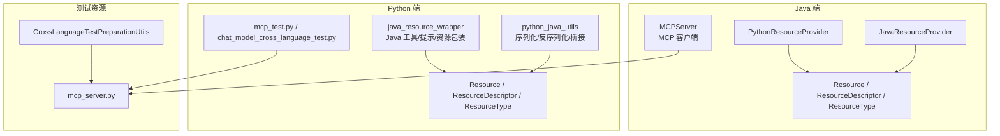
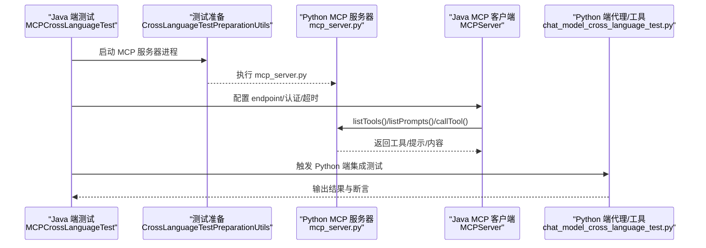
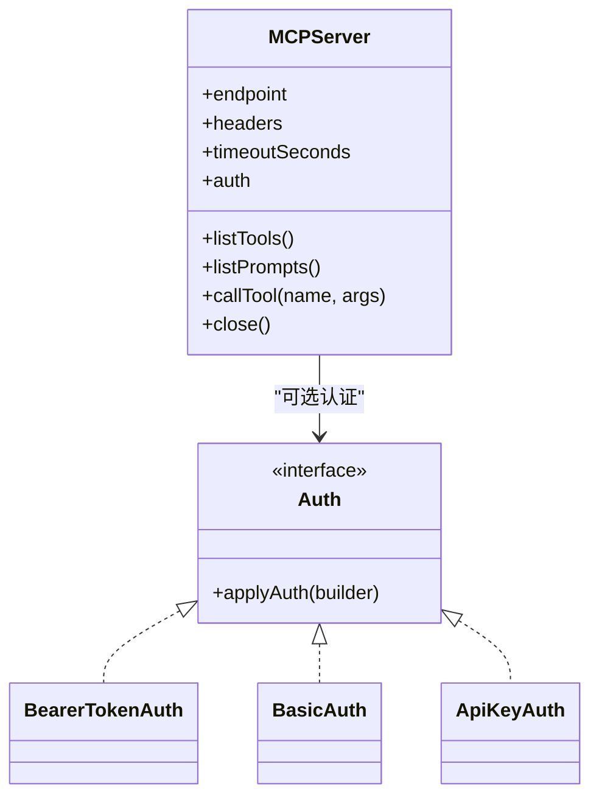
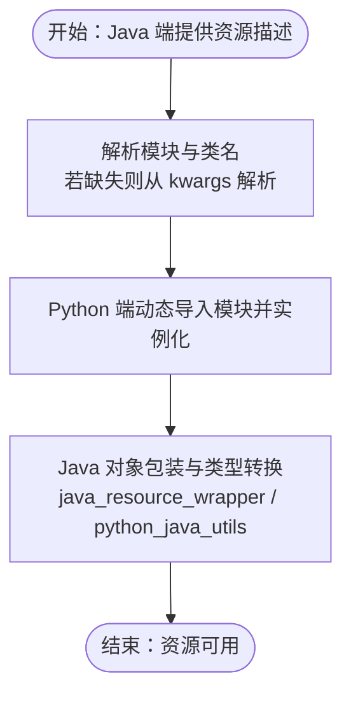
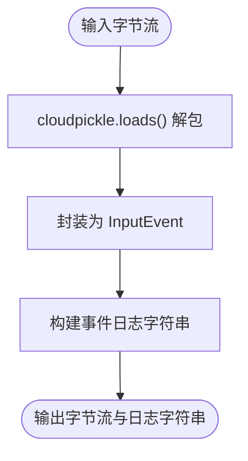
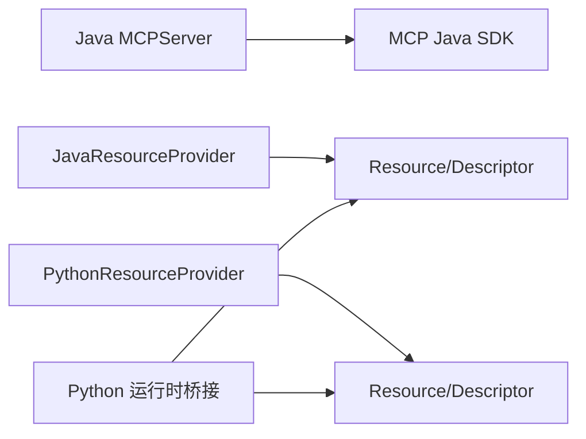

# 跨语言测试

<cite>
**本文引用的文件**
- [MCPServer.java](file://integrations/mcp/src/main/java/org/apache/flink/agents/integrations/mcp/MCPServer.java)
- [MCPCrossLanguageTest.java](file://e2e-test/flink-agents-end-to-end-tests-resource-cross-language/src/test/java/org/apache/flink/agents/resource/test/MCPCrossLanguageTest.java)
- [CrossLanguageTestPreparationUtils.java](file://e2e-test/flink-agents-end-to-end-tests-resource-cross-language/src/test/java/org/apache/flink/agents/resource/test/CrossLanguageTestPreparationUtils.java)
- [mcp_server.py](file://e2e-test/flink-agents-end-to-end-tests-resource-cross-language/src/test/resources/mcp_server.py)
- [PythonResourceProvider.java](file://plan/src/main/java/org/apache/flink/agents/plan/resourceprovider/PythonResourceProvider.java)
- [JavaResourceProvider.java](file://plan/src/main/java/org/apache/flink/agents/plan/resourceprovider/JavaResourceProvider.java)
- [resource.py](file://python/flink_agents/api/resource.py)
- [java_resource_wrapper.py](file://python/flink_agents/runtime/java/java_resource_wrapper.py)
- [python_java_utils.py](file://python/flink_agents/runtime/python_java_utils.py)
- [ChatModelCrossLanguageTest.java](file://e2e-test/flink-agents-end-to-end-tests-resource-cross-language/src/test/java/org/apache/flink/agents/resource/test/ChatModelCrossLanguageTest.java)
- [chat_model_cross_language_test.py](file://python/flink_agents/e2e_tests/e2e_tests_resource_cross_language/chat_model_cross_language_test.py)
- [mcp_test.py](file://python/flink_agents/integrations/mcp/tests/test_mcp.py)
</cite>

## 目录
1. [引言](#引言)
2. [项目结构](#项目结构)
3. [核心组件](#核心组件)
4. [架构总览](#架构总览)
5. [详细组件分析](#详细组件分析)
6. [依赖关系分析](#依赖关系分析)
7. [性能考量](#性能考量)
8. [故障排查指南](#故障排查指南)
9. [结论](#结论)
10. [附录](#附录)

## 引言
本指南面向开发者，系统化地讲解 Apache Flink Agents 的跨语言测试实践，重点覆盖 Java 与 Python 之间的互操作测试策略与实现细节，包括：
- 资源跨语言测试的设计与执行流程
- MCP 协议的跨语言测试方法（含认证机制与协议兼容性）
- Python 端测试用例编写与测试工具使用
- 测试环境配置与准备（Python 环境、资源提供者）
- 跨语言通信的测试方法（数据序列化与反序列化验证）
- 测试结果对比与验证策略、跨语言性能测试思路
- 调试与问题排查技巧

## 项目结构
围绕跨语言测试的关键模块与文件如下：
- Java 端 MCP 客户端与资源提供者：MCPServer、JavaResourceProvider、PythonResourceProvider
- 资源类型与描述：Resource、ResourceDescriptor、ResourceType
- Python 端运行时桥接：java_resource_wrapper、python_java_utils
- 端到端测试：MCPCrossLanguageTest、ChatModelCrossLanguageTest 及其对应的 Python 端测试
- 测试资源：mcp_server.py（MCP 测试服务器）

**图示来源**
- [MCPServer.java](file://integrations/mcp/src/main/java/org/apache/flink/agents/integrations/mcp/MCPServer.java#L78-L438)
- [JavaResourceProvider.java](file://plan/src/main/java/org/apache/flink/agents/plan/resourceprovider/JavaResourceProvider.java#L29-L57)
- [PythonResourceProvider.java](file://plan/src/main/java/org/apache/flink/agents/plan/resourceprovider/PythonResourceProvider.java#L47-L149)
- [resource.py](file://python/flink_agents/api/resource.py#L29-L318)
- [java_resource_wrapper.py](file://python/flink_agents/runtime/java/java_resource_wrapper.py#L29-L80)
- [python_java_utils.py](file://python/flink_agents/runtime/python_java_utils.py#L48-L284)
- [mcp_server.py](file://e2e-test/flink-agents-end-to-end-tests-resource-cross-language/src/test/resources/mcp_server.py#L19-L51)
- [CrossLanguageTestPreparationUtils.java](file://e2e-test/flink-agents-end-to-end-tests-resource-cross-language/src/test/java/org/apache/flink/agents/resource/test/CrossLanguageTestPreparationUtils.java#L27-L81)

**章节来源**
- [MCPServer.java](file://integrations/mcp/src/main/java/org/apache/flink/agents/integrations/mcp/MCPServer.java#L78-L438)
- [PythonResourceProvider.java](file://plan/src/main/java/org/apache/flink/agents/plan/resourceprovider/PythonResourceProvider.java#L47-L149)
- [JavaResourceProvider.java](file://plan/src/main/java/org/apache/flink/agents/plan/resourceprovider/JavaResourceProvider.java#L29-L57)
- [resource.py](file://python/flink_agents/api/resource.py#L29-L318)
- [java_resource_wrapper.py](file://python/flink_agents/runtime/java/java_resource_wrapper.py#L29-L80)
- [python_java_utils.py](file://python/flink_agents/runtime/python_java_utils.py#L48-L284)
- [mcp_server.py](file://e2e-test/flink-agents-end-to-end-tests-resource-cross-language/src/test/resources/mcp_server.py#L19-L51)
- [CrossLanguageTestPreparationUtils.java](file://e2e-test/flink-agents-end-to-end-tests-resource-cross-language/src/test/java/org/apache/flink/agents/resource/test/CrossLanguageTestPreparationUtils.java#L27-L81)

## 核心组件
- Java 端 MCPServer：封装 MCP 客户端，支持 HTTP/SSE 传输、认证（Bearer/Basic/API Key）、工具与提示发现、调用与内容提取。
- 资源提供者：JavaResourceProvider 与 PythonResourceProvider 分别用于在运行期从 Java/Python 初始化资源对象。
- 资源模型：Resource、ResourceDescriptor、ResourceType 统一跨语言资源元数据与实例化参数。
- Python 运行时桥接：java_resource_wrapper 提供 Java 工具/提示/资源的 Python 包装；python_java_utils 提供序列化/反序列化与类型转换。

**章节来源**
- [MCPServer.java](file://integrations/mcp/src/main/java/org/apache/flink/agents/integrations/mcp/MCPServer.java#L78-L438)
- [JavaResourceProvider.java](file://plan/src/main/java/org/apache/flink/agents/plan/resourceprovider/JavaResourceProvider.java#L29-L57)
- [PythonResourceProvider.java](file://plan/src/main/java/org/apache/flink/agents/plan/resourceprovider/PythonResourceProvider.java#L47-L149)
- [resource.py](file://python/flink_agents/api/resource.py#L29-L318)
- [java_resource_wrapper.py](file://python/flink_agents/runtime/java/java_resource_wrapper.py#L29-L80)
- [python_java_utils.py](file://python/flink_agents/runtime/python_java_utils.py#L48-L284)

## 架构总览
下图展示 Java 与 Python 在跨语言测试中的交互路径：Java 端通过资源提供者创建 Python 资源或直接调用 MCP 服务，Python 端通过运行时桥接与序列化工具与 Java 互通。

**图示来源**
- [MCPCrossLanguageTest.java](file://e2e-test/flink-agents-end-to-end-tests-resource-cross-language/src/test/java/org/apache/flink/agents/resource/test/MCPCrossLanguageTest.java#L34-L86)
- [CrossLanguageTestPreparationUtils.java](file://e2e-test/flink-agents-end-to-end-tests-resource-cross-language/src/test/java/org/apache/flink/agents/resource/test/CrossLanguageTestPreparationUtils.java#L49-L79)
- [mcp_server.py](file://e2e-test/flink-agents-end-to-end-tests-resource-cross-language/src/test/resources/mcp_server.py#L19-L51)
- [MCPServer.java](file://integrations/mcp/src/main/java/org/apache/flink/agents/integrations/mcp/MCPServer.java#L265-L335)
- [chat_model_cross_language_test.py](file://python/flink_agents/e2e_tests/e2e_tests_resource_cross_language/chat_model_cross_language_test.py#L50-L104)

## 详细组件分析

### MCP 协议跨语言测试
- 认证机制：Java 端通过 Auth 接口实现多种认证（Bearer/Basic/API Key），Python 端通过 OAuth 客户端提供器进行 OAuth 流程演示与序列化验证。
- 协议兼容性：Java 端使用官方 MCP Java SDK 的同步客户端与流式 HTTP 传输，确保与标准 MCP 服务兼容。
- 测试流程：Java 端启动 MCP 服务器进程，随后通过 MCPServer 发现工具与提示、调用工具并校验返回内容；Python 端同样启动本地 MCP 服务器进行等价验证。

**图示来源**
- [MCPServer.java](file://integrations/mcp/src/main/java/org/apache/flink/agents/integrations/mcp/MCPServer.java#L78-L438)

**章节来源**
- [MCPServer.java](file://integrations/mcp/src/main/java/org/apache/flink/agents/integrations/mcp/MCPServer.java#L213-L240)
- [MCPServer.java](file://integrations/mcp/src/main/java/org/apache/flink/agents/integrations/mcp/MCPServer.java#L265-L335)
- [mcp_test.py](file://python/flink_agents/integrations/mcp/tests/test_mcp.py#L93-L122)

### 资源跨语言测试（Java → Python）
- 资源提供者映射：Java 端通过 PythonResourceProvider 将资源元数据传递给 Python 端，由 Python 端动态导入类并实例化。
- 类型与模块解析：当未显式提供模块/类名时，从 kwargs 中解析“模块.类名”格式，确保跨语言资源创建的一致性。
- 运行时桥接：Python 端通过 java_resource_wrapper 与 python_java_utils 实现 Java 对象到 Python 的包装与类型转换。

**图示来源**
- [PythonResourceProvider.java](file://plan/src/main/java/org/apache/flink/agents/plan/resourceprovider/PythonResourceProvider.java#L77-L126)
- [java_resource_wrapper.py](file://python/flink_agents/runtime/java/java_resource_wrapper.py#L29-L80)
- [python_java_utils.py](file://python/flink_agents/runtime/python_java_utils.py#L104-L151)

**章节来源**
- [PythonResourceProvider.java](file://plan/src/main/java/org/apache/flink/agents/plan/resourceprovider/PythonResourceProvider.java#L77-L126)
- [java_resource_wrapper.py](file://python/flink_agents/runtime/java/java_resource_wrapper.py#L29-L80)
- [python_java_utils.py](file://python/flink_agents/runtime/python_java_utils.py#L104-L151)

### 跨语言通信与序列化/反序列化
- 序列化策略：Python 端使用 cloudpickle 进行事件与对象的序列化/反序列化，保证复杂对象在跨语言边界上的正确传递。
- 消息与文档转换：提供 ChatMessage、Document、VectorStoreQuery 等对象在 Java 与 Python 间的双向转换函数。
- 输入事件包装：将字节流包装为 InputEvent 并序列化为 JSON 字符串，便于日志与事件记录。

**图示来源**
- [python_java_utils.py](file://python/flink_agents/runtime/python_java_utils.py#L48-L77)

**章节来源**
- [python_java_utils.py](file://python/flink_agents/runtime/python_java_utils.py#L48-L77)
- [python_java_utils.py](file://python/flink_agents/runtime/python_java_utils.py#L174-L227)

### Python 端测试实现与工具
- MCP 测试：启动本地 MCP 服务器进程，验证工具与提示的发现、格式化与调用。
- 聊天模型跨语言测试：通过 PyFlink DataStream 读取输入文件，应用代理后写入文件，断言输出中包含预期关键词。
- 资源准备：通过环境变量与脚本拉起 Ollama 模型，确保测试依赖可用。

**章节来源**
- [mcp_test.py](file://python/flink_agents/integrations/mcp/tests/test_mcp.py#L32-L57)
- [chat_model_cross_language_test.py](file://python/flink_agents/e2e_tests/e2e_tests_resource_cross_language/chat_model_cross_language_test.py#L50-L104)

## 依赖关系分析
- Java 端依赖 MCP Java SDK 进行 HTTP/SSE 通信，并通过 Auth 接口扩展认证能力。
- Python 端依赖 mcp.server.fastmcp 提供测试服务器，同时使用 pydantic 进行模型序列化。
- 资源提供者在 Java 与 Python 之间建立契约，确保资源类型与初始化参数一致。

**图示来源**
- [MCPServer.java](file://integrations/mcp/src/main/java/org/apache/flink/agents/integrations/mcp/MCPServer.java#L265-L335)
- [JavaResourceProvider.java](file://plan/src/main/java/org/apache/flink/agents/plan/resourceprovider/JavaResourceProvider.java#L29-L57)
- [PythonResourceProvider.java](file://plan/src/main/java/org/apache/flink/agents/plan/resourceprovider/PythonResourceProvider.java#L47-L149)
- [java_resource_wrapper.py](file://python/flink_agents/runtime/java/java_resource_wrapper.py#L29-L80)

**章节来源**
- [MCPServer.java](file://integrations/mcp/src/main/java/org/apache/flink/agents/integrations/mcp/MCPServer.java#L265-L335)
- [JavaResourceProvider.java](file://plan/src/main/java/org/apache/flink/agents/plan/resourceprovider/JavaResourceProvider.java#L29-L57)
- [PythonResourceProvider.java](file://plan/src/main/java/org/apache/flink/agents/plan/resourceprovider/PythonResourceProvider.java#L47-L149)
- [java_resource_wrapper.py](file://python/flink_agents/runtime/java/java_resource_wrapper.py#L29-L80)

## 性能考量
- 传输与超时：合理设置 MCP 请求超时，避免长尾阻塞；对工具调用与提示获取进行并发控制。
- 序列化成本：cloudpickle 在复杂对象上开销较大，建议仅在必要时使用，尽量传递简单结构或进行分层序列化。
- 资源复用：MCP 客户端单实例复用，减少连接与握手开销。
- 测试并行：在本地测试中可适度提升并行度，但需注意外部依赖（如 Ollama）的并发限制。

## 故障排查指南
- MCP 服务器启动失败
  - 检查 Python 环境与依赖安装，确认 mcp.server.fastmcp 可用。
  - 查看 CrossLanguageTestPreparationUtils 的日志输出，定位启动异常。
- 认证失败
  - 确认 Auth 配置（Bearer/Basic/API Key）与服务端一致。
  - 在 Python 端检查 OAuth 客户端信息与回调处理。
- 工具/提示不可见
  - 校验 endpoint 与网络连通性，确认服务端已注册相应工具与提示。
- 结果不匹配
  - 使用严格断言（如包含关系、数值范围）；必要时开启事件日志以比对中间状态。
- 序列化异常
  - 检查 cloudpickle 版本与对象可序列化性；避免传递不可 picklable 的对象。

**章节来源**
- [CrossLanguageTestPreparationUtils.java](file://e2e-test/flink-agents-end-to-end-tests-resource-cross-language/src/test/java/org/apache/flink/agents/resource/test/CrossLanguageTestPreparationUtils.java#L49-L79)
- [mcp_test.py](file://python/flink_agents/integrations/mcp/tests/test_mcp.py#L84-L92)
- [MCPServer.java](file://integrations/mcp/src/main/java/org/apache/flink/agents/integrations/mcp/MCPServer.java#L242-L258)

## 结论
通过统一的资源提供者与运行时桥接，Apache Flink Agents 实现了 Java 与 Python 在资源与协议层面的深度互操作。结合严格的测试流程与工具链，可以高效验证跨语言功能、认证与协议兼容性，并在出现异常时快速定位问题。建议在持续集成中引入资源准备脚本与最小化依赖的测试服务器，以提升稳定性与可重复性。

## 附录

### 测试环境配置与准备
- Python 环境
  - 安装 mcp.server.fastmcp 与 pydantic，确保测试服务器可用。
  - 设置 PYTHONPATH，使 Python 端能够导入本地模块。
- 外部依赖
  - Ollama 模型拉取：通过 CrossLanguageTestPreparationUtils 或脚本拉起所需模型。
- 端到端测试入口
  - Java 端：MCPCrossLanguageTest、ChatModelCrossLanguageTest
  - Python 端：chat_model_cross_language_test.py、mcp_test.py

**章节来源**
- [CrossLanguageTestPreparationUtils.java](file://e2e-test/flink-agents-end-to-end-tests-resource-cross-language/src/test/java/org/apache/flink/agents/resource/test/CrossLanguageTestPreparationUtils.java#L31-L47)
- [chat_model_cross_language_test.py](file://python/flink_agents/e2e_tests/e2e_tests_resource_cross_language/chat_model_cross_language_test.py#L43-L48)
- [mcp_server.py](file://e2e-test/flink-agents-end-to-end-tests-resource-cross-language/src/test/resources/mcp_server.py#L19-L51)