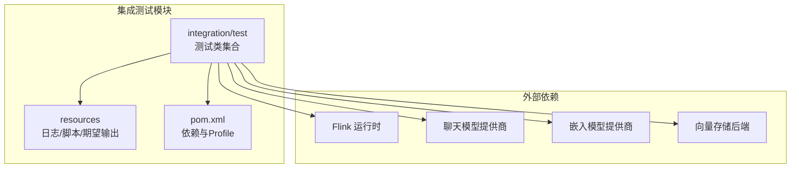
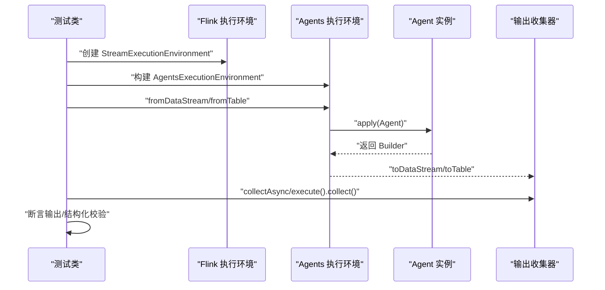
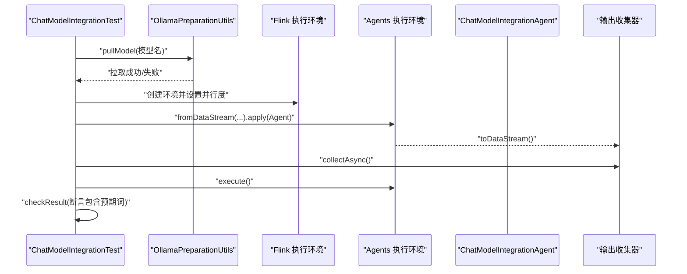
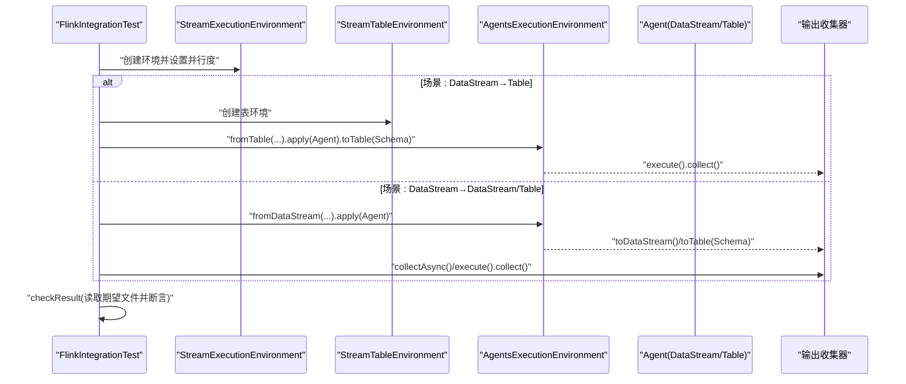
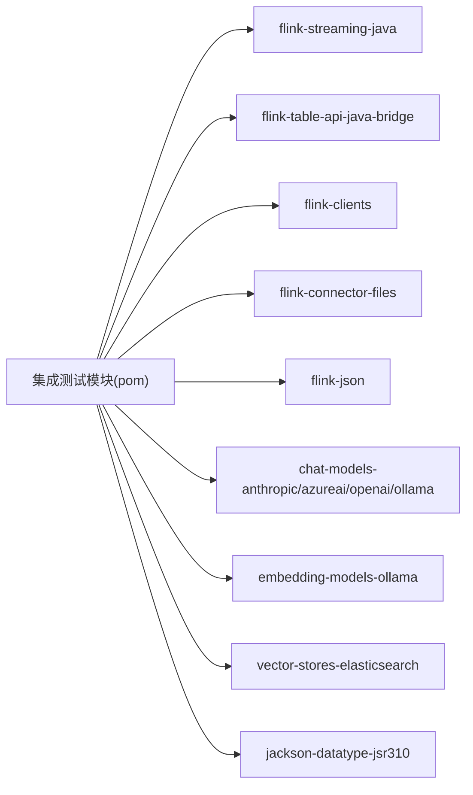

# 集成测试

<cite>
**本文引用的文件**
- [AsyncExecutionTest.java](file://e2e-test/flink-agents-end-to-end-tests-integration/src/test/java/org/apache/flink/agents/integration/test/AsyncExecutionTest.java)
- [ChatModelIntegrationTest.java](file://e2e-test/flink-agents-end-to-end-tests-integration/src/test/java/org/apache/flink/agents/integration/test/ChatModelIntegrationTest.java)
- [EmbeddingIntegrationTest.java](file://e2e-test/flink-agents-end-to-end-tests-integration/src/test/java/org/apache/flink/agents/integration/test/EmbeddingIntegrationTest.java)
- [FlinkIntegrationTest.java](file://e2e-test/flink-agents-end-to-end-tests-integration/src/test/java/org/apache/flink/agents/integration/test/FlinkIntegrationTest.java)
- [VectorStoreIntegrationTest.java](file://e2e-test/flink-agents-end-to-end-tests-integration/src/test/java/org/apache/flink/agents/integration/test/VectorStoreIntegrationTest.java)
- [MemoryObjectTest.java](file://e2e-test/flink-agents-end-to-end-tests-integration/src/test/java/org/apache/flink/agents/integration/test/MemoryObjectTest.java)
- [VectorStoreLongTermMemoryTest.java](file://e2e-test/flink-agents-end-to-end-tests-integration/src/test/java/org/apache/flink/agents/integration/test/VectorStoreLongTermMemoryTest.java)
- [OllamaPreparationUtils.java](file://e2e-test/flink-agents-end-to-end-tests-integration/src/test/java/org/apache/flink/agents/integration/test/OllamaPreparationUtils.java)
- [ollama_pull_model.sh（集成测试）](file://e2e-test/flink-agents-end-to-end-tests-integration/src/test/resources/ollama_pull_model.sh)
- [log4j2-test.properties](file://e2e-test/flink-agents-end-to-end-tests-integration/src/test/resources/log4j2-test.properties)
- [pom.xml（集成测试模块）](file://e2e-test/flink-agents-end-to-end-tests-integration/pom.xml)
- [test_agent_plan_compatibility.sh](file://e2e-test/test-scripts/test_agent_plan_compatibility.sh)
- [e2e.sh](file://tools/e2e.sh)
- [ollama_pull_model.sh（Python）](file://python/flink_agents/e2e_tests/scripts/ollama_pull_model.sh)
</cite>

## 目录
1. [引言](#引言)
2. [项目结构](#项目结构)
3. [核心组件](#核心组件)
4. [架构总览](#架构总览)
5. [详细组件分析](#详细组件分析)
6. [依赖关系分析](#依赖关系分析)
7. [性能与压力测试](#性能与压力测试)
8. [故障排查指南](#故障排查指南)
9. [结论](#结论)
10. [附录](#附录)

## 引言
本指南面向 QA 工程师与高级开发者，系统化地介绍 Apache Flink Agents 的端到端集成测试设计与实践，覆盖以下主题：
- 聊天模型集成测试：多提供商（Anthropic、Azure、Ollama、OpenAI）与本地模型拉取流程
- 嵌入模型集成测试：嵌入生成与相似度检索
- Flink 集成测试：从 DataStream 到 DataStream/Table 的转换与一致性校验
- 向量存储集成测试：Elasticsearch 后端语义检索
- 内存对象与长期记忆测试：键隔离、复杂数据结构存取与压缩
- 异步执行测试：durableExecuteAsync、durableExecute 与 JDK 21 Continuation 并行性验证
- 测试环境搭建与配置：外部服务模拟与真实环境连接
- 测试数据准备与管理：测试用例设计与生成策略
- 结果验证与断言策略：基于期望输出与结构化断言
- 性能与压力测试：吞吐与延迟评估建议

## 项目结构
集成测试位于 e2e-test 模块中，采用按功能分层的组织方式：
- 测试类集中于 integration/test 下，分别对应不同能力域
- 资源文件（日志、期望输出、脚本）位于 resources 下
- 通过 Maven Profile 支持不同 Flink 版本与 JDK 21+ Continuation



图表来源
- [pom.xml（集成测试模块）](file://e2e-test/flink-agents-end-to-end-tests-integration/pom.xml#L41-L112)

章节来源
- [pom.xml（集成测试模块）](file://e2e-test/flink-agents-end-to-end-tests-integration/pom.xml#L31-L161)

## 核心组件
- 异步执行测试：验证 durableExecuteAsync/durableExecute 在单键与多键场景下的正确性与并行性
- 聊天模型集成测试：参数化测试不同提供商，结合 Ollama 模型拉取工具
- 嵌入模型集成测试：嵌入生成与相似度检索的结构化断言
- Flink 集成测试：DataStream/Table 双通道转换与离线期望文件比对
- 向量存储集成测试：Elasticsearch 语义检索断言
- 内存对象测试：键隔离与复杂数据结构存取
- 长期记忆测试：Elasticsearch 后端的压缩与检索
- 环境准备工具：Ollama 模型拉取脚本与日志配置

章节来源
- [AsyncExecutionTest.java](file://e2e-test/flink-agents-end-to-end-tests-integration/src/test/java/org/apache/flink/agents/integration/test/AsyncExecutionTest.java#L36-L391)
- [ChatModelIntegrationTest.java](file://e2e-test/flink-agents-end-to-end-tests-integration/src/test/java/org/apache/flink/agents/integration/test/ChatModelIntegrationTest.java#L43-L127)
- [EmbeddingIntegrationTest.java](file://e2e-test/flink-agents-end-to-end-tests-integration/src/test/java/org/apache/flink/agents/integration/test/EmbeddingIntegrationTest.java#L40-L110)
- [FlinkIntegrationTest.java](file://e2e-test/flink-agents-end-to-end-tests-integration/src/test/java/org/apache/flink/agents/integration/test/FlinkIntegrationTest.java#L54-L205)
- [VectorStoreIntegrationTest.java](file://e2e-test/flink-agents-end-to-end-tests-integration/src/test/java/org/apache/flink/agents/integration/test/VectorStoreIntegrationTest.java#L48-L122)
- [MemoryObjectTest.java](file://e2e-test/flink-agents-end-to-end-tests-integration/src/test/java/org/apache/flink/agents/integration/test/MemoryObjectTest.java#L32-L71)
- [VectorStoreLongTermMemoryTest.java](file://e2e-test/flink-agents-end-to-end-tests-integration/src/test/java/org/apache/flink/agents/integration/test/VectorStoreLongTermMemoryTest.java#L74-L331)

## 架构总览
下图展示端到端测试在 Flink 执行环境中的典型调用链路与断言策略。



图表来源
- [FlinkIntegrationTest.java](file://e2e-test/flink-agents-end-to-end-tests-integration/src/test/java/org/apache/flink/agents/integration/test/FlinkIntegrationTest.java#L68-L146)
- [ChatModelIntegrationTest.java](file://e2e-test/flink-agents-end-to-end-tests-integration/src/test/java/org/apache/flink/agents/integration/test/ChatModelIntegrationTest.java#L55-L102)
- [EmbeddingIntegrationTest.java](file://e2e-test/flink-agents-end-to-end-tests-integration/src/test/java/org/apache/flink/agents/integration/test/EmbeddingIntegrationTest.java#L50-L97)
- [VectorStoreIntegrationTest.java](file://e2e-test/flink-agents-end-to-end-tests-integration/src/test/java/org/apache/flink/agents/integration/test/VectorStoreIntegrationTest.java#L50-L82)

## 详细组件分析

### 异步执行测试
- 设计理念：验证 durableExecuteAsync 的幂等与可恢复性；对比 durableExecute 的同步行为；在 JDK 21+ 上验证 Continuation 并行性
- 关键点：
  - 单键简单异步：校验结果包含“异步处理”“内存检查”等标记
  - 多步骤链式异步：校验三步均完成
  - 多键高并发：校验 5×3=15 条输出
  - 并行性检测：解析时间戳区间重叠数，JDK 21+ 应出现重叠，否则应无重叠
  - 同步执行对比：durableExecute 的结果需包含特定前缀
- 并发与状态管理：
  - 使用固定并行度或提升并行度以触发 Operator 内部并发
  - 通过键选择器确保不同键独立执行，避免跨键干扰
- 断言策略：
  - 数量断言：输出条目数
  - 内容断言：包含特定关键字
  - 时间区间断言：JDK 21+ 重叠对数阈值

```mermaid
flowchart TD
Start(["开始"]) --> BuildEnv["创建 Flink/Agents 执行环境"]
BuildEnv --> BuildDS["构造输入 DataStream"]
BuildDS --> ApplyAgent["应用异步 Agent"]
ApplyAgent --> Collect["collectAsync 收集输出"]
Collect --> Execute["执行 execute()"]
Execute --> Parse["解析输出时间戳区间"]
Parse --> Check{"JDK 版本与支持?"}
Check --> |是(JDK>=21且支持Continuation)| Overlap["统计重叠对数并断言"]
Check --> |否| NoOverlap["断言无重叠"]
Overlap --> Assert["断言通过"]
NoOverlap --> Assert
Assert --> End(["结束"])
```

图表来源
- [AsyncExecutionTest.java](file://e2e-test/flink-agents-end-to-end-tests-integration/src/test/java/org/apache/flink/agents/integration/test/AsyncExecutionTest.java#L219-L334)

章节来源
- [AsyncExecutionTest.java](file://e2e-test/flink-agents-end-to-end-tests-integration/src/test/java/org/apache/flink/agents/integration/test/AsyncExecutionTest.java#L44-L391)

### 聊天模型集成测试
- 设计理念：参数化测试多提供商（Anthropic/Azure/Ollama/OpenAI），在真实或本地环境中进行对话与工具调用
- 关键点：
  - 环境准备：Ollama 模型拉取工具，失败则跳过该提供商
  - 输入构造：使用温度提示触发不同工具调用
  - 输出断言：校验响应中包含预期数值或空字符串
- 测试数据策略：
  - 使用固定提示集合，覆盖温度换算、BMI 计算与随机数请求
  - 以提示本身作为键，保证每个提示独立处理
- 并发与状态：
  - 单并行度执行，确保输出顺序稳定，便于断言



图表来源
- [ChatModelIntegrationTest.java](file://e2e-test/flink-agents-end-to-end-tests-integration/src/test/java/org/apache/flink/agents/integration/test/ChatModelIntegrationTest.java#L55-L102)
- [OllamaPreparationUtils.java](file://e2e-test/flink-agents-end-to-end-tests-integration/src/test/java/org/apache/flink/agents/integration/test/OllamaPreparationUtils.java#L30-L46)

章节来源
- [ChatModelIntegrationTest.java](file://e2e-test/flink-agents-end-to-end-tests-integration/src/test/java/org/apache/flink/agents/integration/test/ChatModelIntegrationTest.java#L43-L127)
- [OllamaPreparationUtils.java](file://e2e-test/flink-agents-end-to-end-tests-integration/src/test/java/org/apache/flink/agents/integration/test/OllamaPreparationUtils.java#L27-L47)
- [ollama_pull_model.sh（集成测试）](file://e2e-test/flink-agents-end-to-end-tests-integration/src/test/resources/ollama_pull_model.sh#L30-L46)

### 嵌入模型集成测试
- 设计理念：验证嵌入生成与相似度检索，输出为结构化 Map，包含 test_status 等字段
- 关键点：
  - 参数化提供商（当前为 Ollama）
  - 输入构造：嵌入生成、相似度查询、Top-K 返回等多样化提示
  - 断言策略：逐条断言 test_status 为 PASSED，确保每条处理通过
- 数据管理：
  - 使用固定提示集合，便于复现与回归

章节来源
- [EmbeddingIntegrationTest.java](file://e2e-test/flink-agents-end-to-end-tests-integration/src/test/java/org/apache/flink/agents/integration/test/EmbeddingIntegrationTest.java#L40-L110)

### Flink 集成测试
- 设计理念：演示从 DataStream 到 DataStream/Table 的转换，并通过离线期望文件进行一致性校验
- 关键点：
  - 三种场景：DataStream→DataStream、DataStream→Table、Table→Table
  - 键选择器用于按 Row 字段提取键
  - 输出收集：DataStream 使用 collectAsync，Table 使用 execute().collect()
  - 断言策略：读取期望文件，排序后逐行比对
- 表 API 集成：使用 StreamTableEnvironment，定义 Schema 并输出 Table



图表来源
- [FlinkIntegrationTest.java](file://e2e-test/flink-agents-end-to-end-tests-integration/src/test/java/org/apache/flink/agents/integration/test/FlinkIntegrationTest.java#L68-L182)

章节来源
- [FlinkIntegrationTest.java](file://e2e-test/flink-agents-end-to-end-tests-integration/src/test/java/org/apache/flink/agents/integration/test/FlinkIntegrationTest.java#L54-L205)

### 向量存储集成测试
- 设计理念：针对 Elasticsearch 后端进行语义检索断言，验证检索计数、预览与可选 ID
- 关键点：
  - 环境变量驱动：ES_HOST、ES_INDEX、ES_VECTOR_FIELD 等
  - 断言策略：输出为 Map，断言 test_status、retrieved_count≥1、first_doc_preview 非空
- 并发与隔离：
  - 单并行度执行，确保输出稳定

章节来源
- [VectorStoreIntegrationTest.java](file://e2e-test/flink-agents-end-to-end-tests-integration/src/test/java/org/apache/flink/agents/integration/test/VectorStoreIntegrationTest.java#L48-L122)

### 内存对象测试
- 设计理念：在完整 Flink 环境中测试 MemoryObject 的存取与键隔离
- 关键点：
  - 使用不同键（1、2、3）验证内存隔离
  - 输出断言包含“全部断言通过”的标识
- 并发与状态：
  - 单并行度，键选择器直接使用整数

章节来源
- [MemoryObjectTest.java](file://e2e-test/flink-agents-end-to-end-tests-integration/src/test/java/org/apache/flink/agents/integration/test/MemoryObjectTest.java#L32-L71)

### 长期记忆测试（向量存储后端）
- 设计理念：以 Elasticsearch 为后端的长期记忆（VectorStoreLongTermMemory）进行增删改查与压缩测试
- 关键点：
  - Mock RunnerContext 注入资源（聊天/嵌入模型连接与 Setup、Elasticsearch）
  - 准备阶段：创建 MemorySet，写入 10 条消息
  - 检索测试：按关键词搜索，断言命中第 5 条
  - 压缩测试：按配置合并，断言条目数量与压缩标记
  - 端到端：在真实 Flink 作业中使用 LTM，断言异步压缩后的集合大小
- 注意：测试默认禁用，需手动启用并准备 Elasticsearch 集群

章节来源
- [VectorStoreLongTermMemoryTest.java](file://e2e-test/flink-agents-end-to-end-tests-integration/src/test/java/org/apache/flink/agents/integration/test/VectorStoreLongTermMemoryTest.java#L74-L331)

## 依赖关系分析
- 测试模块依赖：
  - Flink 运行时与 Table API 桥接
  - 各集成插件（聊天/嵌入/向量存储）
  - Jackson 日期类型支持
- Profile 与版本：
  - 通过 Maven Profile 切换 Flink 版本与 JDK 21+ Continuation 支持
  - JDK 21+ Profile 为 Continuation API 添加必要 JVM 参数



图表来源
- [pom.xml（集成测试模块）](file://e2e-test/flink-agents-end-to-end-tests-integration/pom.xml#L41-L112)

章节来源
- [pom.xml（集成测试模块）](file://e2e-test/flink-agents-end-to-end-tests-integration/pom.xml#L114-L161)

## 性能与压力测试
- 异步并行性验证：通过时间戳区间重叠对数判断 JDK 21+ Continuation 是否生效
- 吞吐与延迟：
  - 使用更大规模输入（如多键高并发场景）测量端到端延迟
  - 对比 durableExecute 与 durableExecuteAsync 的吞吐差异
- 资源消耗：
  - 观察外部服务（Ollama/Elasticsearch）的 CPU/内存占用
  - 控制并行度与批大小以平衡吞吐与稳定性

[本节为通用指导，不直接分析具体文件]

## 故障排查指南
- 日志级别：
  - 测试日志默认关闭，可在需要时临时调整日志级别以便定位问题
- 环境变量与凭据：
  - 聊天/嵌入模型测试需设置提供商 API Key 或本地 Ollama 环境
  - 向量存储测试需设置 ES_HOST、ES_INDEX、ES_VECTOR_FIELD 等
- 模型拉取失败：
  - Ollama 拉取脚本超时会跳过对应测试，确认网络与本地服务可用性
- 并行性未生效：
  - 确认 JDK 版本与 Continuation 支持状态，检查 JVM 参数是否正确传递
- 输出不一致：
  - Flink Table 场景使用期望文件比对，注意排序与列宽配置

章节来源
- [log4j2-test.properties](file://e2e-test/flink-agents-end-to-end-tests-integration/src/test/resources/log4j2-test.properties#L19-L29)
- [ChatModelIntegrationTest.java](file://e2e-test/flink-agents-end-to-end-tests-integration/src/test/java/org/apache/flink/agents/integration/test/ChatModelIntegrationTest.java#L55-L62)
- [VectorStoreIntegrationTest.java](file://e2e-test/flink-agents-end-to-end-tests-integration/src/test/java/org/apache/flink/agents/integration/test/VectorStoreIntegrationTest.java#L50-L62)
- [AsyncExecutionTest.java](file://e2e-test/flink-agents-end-to-end-tests-integration/src/test/java/org/apache/flink/agents/integration/test/AsyncExecutionTest.java#L220-L227)

## 结论
本指南提供了 Apache Flink Agents 集成测试的系统化实践路径，涵盖异步执行、聊天/嵌入模型、Flink API 集成、向量存储与长期记忆等关键领域。通过参数化测试、期望文件比对与结构化断言，能够有效保障跨提供商与跨版本的稳定性。建议在持续集成中结合 JDK 21+ 并行性验证与外部服务可用性检查，形成稳健的回归与冒烟测试体系。

[本节为总结性内容，不直接分析具体文件]

## 附录

### 测试环境搭建与配置
- 安装与构建：
  - 使用统一脚本构建工程，确保 Python 环境与依赖就绪
- 运行入口：
  - 使用 e2e.sh 统一运行跨语言与兼容性测试
- 模型与外部服务：
  - Ollama 模型拉取脚本位于集成测试与 Python 子目录
  - Elasticsearch 需手动部署并关闭安全校验（按测试注释说明）

章节来源
- [e2e.sh](file://tools/e2e.sh#L90-L166)
- [ollama_pull_model.sh（集成测试）](file://e2e-test/flink-agents-end-to-end-tests-integration/src/test/resources/ollama_pull_model.sh#L1-L20)
- [ollama_pull_model.sh（Python）](file://python/flink_agents/e2e_tests/scripts/ollama_pull_model.sh#L1-L21)

### 测试数据准备与管理
- 固定提示集合：用于聊天/嵌入测试，覆盖多种工具调用与检索场景
- 期望文件：Flink Table 场景通过离线文件比对，确保输出一致性
- 生成策略：Agent 计划兼容性测试脚本自动生成 JSON 并在 Java/Python 间互转

章节来源
- [FlinkIntegrationTest.java](file://e2e-test/flink-agents-end-to-end-tests-integration/src/test/java/org/apache/flink/agents/integration/test/FlinkIntegrationTest.java#L184-L203)
- [test_agent_plan_compatibility.sh](file://e2e-test/test-scripts/test_agent_plan_compatibility.sh#L36-L77)

### 内存对象与长期记忆实现要点
- 键隔离：不同键之间内存相互独立，验证时使用多个键
- 复杂数据结构：MemoryObject 支持复杂对象存取，断言包含“全部断言通过”
- 压缩与检索：长期记忆支持按配置合并与检索，断言压缩标记与命中条目

章节来源
- [MemoryObjectTest.java](file://e2e-test/flink-agents-end-to-end-tests-integration/src/test/java/org/apache/flink/agents/integration/test/MemoryObjectTest.java#L34-L71)
- [VectorStoreLongTermMemoryTest.java](file://e2e-test/flink-agents-end-to-end-tests-integration/src/test/java/org/apache/flink/agents/integration/test/VectorStoreLongTermMemoryTest.java#L178-L254)