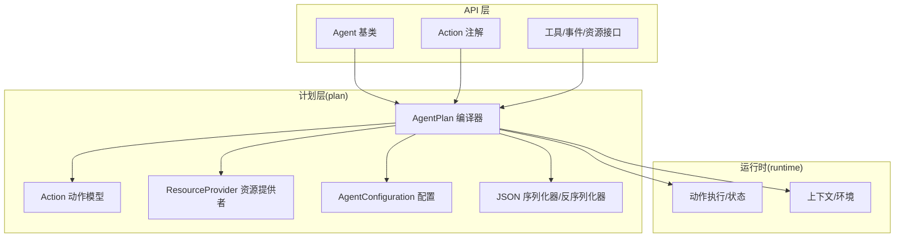
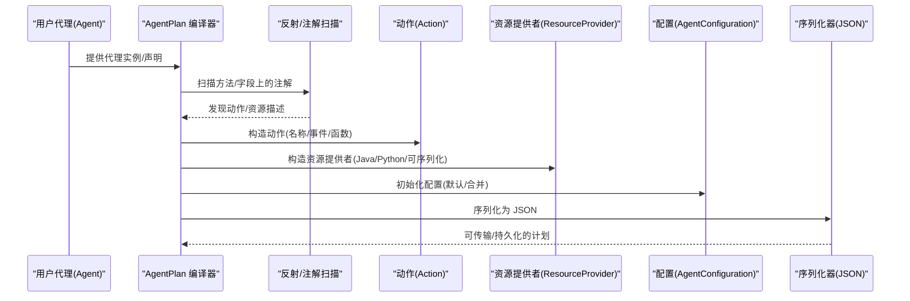
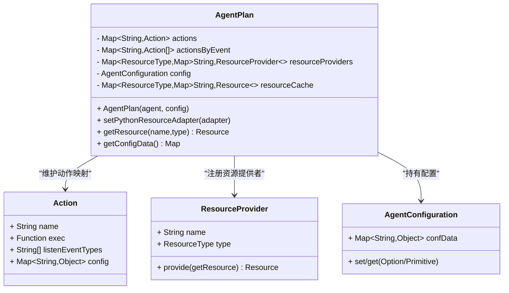
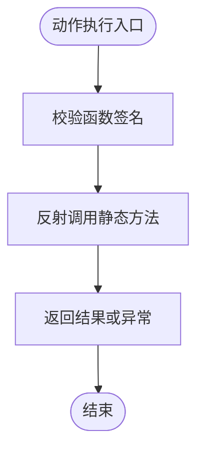
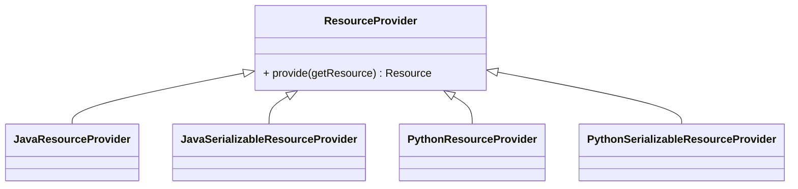
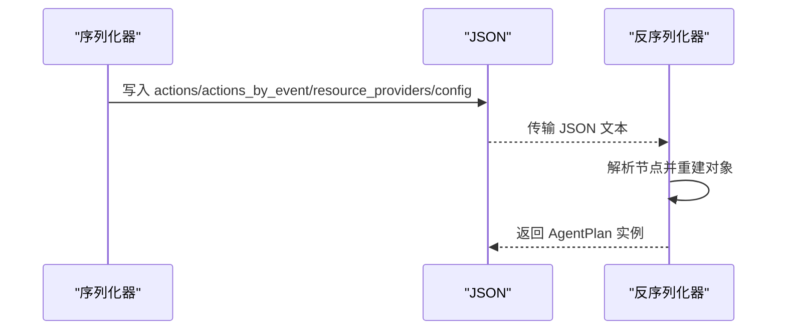
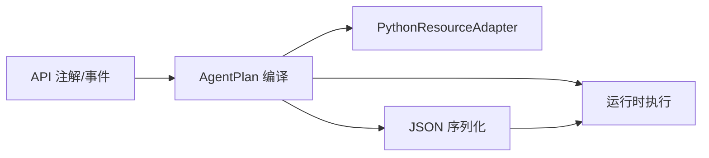

# 代理计划编译

<cite>
**本文引用的文件**
- [AgentPlan.java](file://plan/src/main/java/org/apache/flink/agents/plan/AgentPlan.java)
- [AgentConfiguration.java](file://plan/src/main/java/org/apache/flink/agents/plan/AgentConfiguration.java)
- [Action.java](file://plan/src/main/java/org/apache/flink/agents/plan/actions/Action.java)
- [ResourceProvider.java](file://plan/src/main/java/org/apache/flink/agents/plan/resourceprovider/ResourceProvider.java)
- [AgentPlanJsonSerializer.java](file://plan/src/main/java/org/apache/flink/agents/plan/serializer/AgentPlanJsonSerializer.java)
- [AgentPlanJsonDeserializer.java](file://plan/src/main/java/org/apache/flink/agents/plan/serializer/AgentPlanJsonDeserializer.java)
- [FunctionTool.java](file://plan/src/main/java/org/apache/flink/agents/plan/tools/FunctionTool.java)
- [JavaFunction.java](file://plan/src/main/java/org/apache/flink/agents/plan/JavaFunction.java)
- [Action 注解](file://api/src/main/java/org/apache/flink/agents/api/annotation/Action.java)
- [Agent 构建器接口](file://api/src/main/java/org/apache/flink/agents/api/AgentBuilder.java)
- [Agent 基类](file://api/src/main/java/org/apache/flink/agents/api/agents/Agent.java)
- [AgentPlanTest.java](file://plan/src/test/java/org/apache/flink/agents/plan/AgentPlanTest.java)
- [CreateJavaAgentPlanFromJson.java](file://plan/src/test/java/org/apache/flink/agents/plan/compatibility/CreateJavaAgentPlanFromJson.java)
- [README.md](file://README.md)
</cite>

## 目录
1. [简介](#简介)
2. [项目结构](#项目结构)
3. [核心组件](#核心组件)
4. [架构总览](#架构总览)
5. [详细组件分析](#详细组件分析)
6. [依赖分析](#依赖分析)
7. [性能考虑](#性能考虑)
8. [故障排查指南](#故障排查指南)
9. [结论](#结论)
10. [附录：使用示例与最佳实践](#附录使用示例与最佳实践)

## 简介
本文件面向 Apache Flink Agents 的“代理计划编译”子系统，系统性阐述从用户定义的代理类到可执行代理计划（AgentPlan）的完整编译流程。内容覆盖注解扫描机制、反射处理、动作提取算法、动作映射与事件触发关系、资源提供者注册与配置管理、序列化/反序列化以实现跨语言兼容与分布式部署、代理配置选项的处理与合并策略，并提供性能优化与内存管理建议、常见编译错误诊断与解决方案。

## 项目结构
- 计划模块（plan）负责将用户代理编译为可序列化的 AgentPlan，包含动作、资源提供者、配置与序列化器等。
- API 模块提供注解、事件、工具、资源等基础能力，供计划模块在编译期扫描与解析。
- 运行时模块负责在 Flink 环境中执行 AgentPlan，包括动作状态、异步执行、日志与度量等。

**图表来源**
- [AgentPlan.java](file://plan/src/main/java/org/apache/flink/agents/plan/AgentPlan.java#L132-L141)
- [Action 注解](file://api/src/main/java/org/apache/flink/agents/api/annotation/Action.java#L28-L53)
- [Agent 构建器接口](file://api/src/main/java/org/apache/flink/agents/api/AgentBuilder.java#L29-L76)

**章节来源**
- [AgentPlan.java](file://plan/src/main/java/org/apache/flink/agents/plan/AgentPlan.java#L132-L141)
- [Agent 构建器接口](file://api/src/main/java/org/apache/flink/agents/api/AgentBuilder.java#L29-L76)

## 核心组件
- AgentPlan：编译后的代理计划，包含动作映射、事件触发关系、资源提供者注册表、配置数据与缓存；支持序列化/反序列化与 Python 资源适配。
- Action：动作模型，封装名称、监听事件类型列表与可执行函数签名校验。
- ResourceProvider：资源提供者抽象，承载资源元数据并在运行时创建资源实例。
- AgentConfiguration：键值配置存储与类型安全读取，支持默认值与扁平化配置。
- 序列化器：基于 Jackson 的 JSON 序列化/反序列化，保证跨语言兼容与分布式传输。

**章节来源**
- [AgentPlan.java](file://plan/src/main/java/org/apache/flink/agents/plan/AgentPlan.java#L78-L123)
- [Action.java](file://plan/src/main/java/org/apache/flink/agents/plan/actions/Action.java#L41-L62)
- [ResourceProvider.java](file://plan/src/main/java/org/apache/flink/agents/plan/resourceprovider/ResourceProvider.java#L30-L74)
- [AgentConfiguration.java](file://plan/src/main/java/org/apache/flink/agents/plan/AgentConfiguration.java#L28-L80)
- [AgentPlanJsonSerializer.java](file://plan/src/main/java/org/apache/flink/agents/plan/serializer/AgentPlanJsonSerializer.java#L32-L127)
- [AgentPlanJsonDeserializer.java](file://plan/src/main/java/org/apache/flink/agents/plan/serializer/AgentPlanJsonDeserializer.java#L43-L137)

## 架构总览
下图展示了从用户代理到可执行代理计划的关键路径：注解扫描、反射解析、动作与资源提取、事件触发映射、资源缓存与配置注入，以及序列化/反序列化支撑的跨语言与分布式部署。

**图表来源**
- [AgentPlan.java](file://plan/src/main/java/org/apache/flink/agents/plan/AgentPlan.java#L334-L360)
- [AgentPlan.java](file://plan/src/main/java/org/apache/flink/agents/plan/AgentPlan.java#L454-L598)
- [AgentPlanJsonSerializer.java](file://plan/src/main/java/org/apache/flink/agents/plan/serializer/AgentPlanJsonSerializer.java#L38-L127)

## 详细组件分析

### 组件一：AgentPlan 编译器
- 注解扫描与动作提取
  - 扫描代理类的被 @Action 标注的方法，收集监听事件类型，构造 JavaFunction 并生成 Action，填充动作映射与事件触发映射。
  - 支持通过代理声明 API 动态添加动作与配置。
- 资源提供者提取
  - 字段级：@Tool/@ChatModelSetup 等注解的资源，要求为可序列化资源，使用 JavaSerializableResourceProvider 包装。
  - 方法级：静态工厂返回 ResourceDescriptor 或 SerializableResource 的资源，自动识别 Java/Python 实现并包装。
  - MCP 服务器：根据 Java 版本选择 Java 或 Python 实现，自动发现工具与提示词并注入缓存。
- 资源获取与缓存
  - 通过 getResource(name, type) 获取资源，优先命中缓存；若为 Python 资源且未设置适配器则抛出异常。
  - setPythonResourceAdapter 将适配器注入 Python 资源提供者，并预取工具与提示词到缓存。
- 配置管理
  - 内部持有 AgentConfiguration，支持默认值与类型转换读取。
- 序列化/反序列化
  - 自定义 Jackson 序列化器将动作、事件映射、资源提供者与配置写入 JSON；反序列化器按结构重建对象。

**图表来源**
- [AgentPlan.java](file://plan/src/main/java/org/apache/flink/agents/plan/AgentPlan.java#L78-L123)
- [Action.java](file://plan/src/main/java/org/apache/flink/agents/plan/actions/Action.java#L41-L83)
- [ResourceProvider.java](file://plan/src/main/java/org/apache/flink/agents/plan/resourceprovider/ResourceProvider.java#L30-L74)
- [AgentConfiguration.java](file://plan/src/main/java/org/apache/flink/agents/plan/AgentConfiguration.java#L28-L80)

**章节来源**
- [AgentPlan.java](file://plan/src/main/java/org/apache/flink/agents/plan/AgentPlan.java#L132-L141)
- [AgentPlan.java](file://plan/src/main/java/org/apache/flink/agents/plan/AgentPlan.java#L334-L360)
- [AgentPlan.java](file://plan/src/main/java/org/apache/flink/agents/plan/AgentPlan.java#L454-L598)
- [AgentPlan.java](file://plan/src/main/java/org/apache/flink/agents/plan/AgentPlan.java#L231-L264)

### 组件二：动作模型与函数执行
- Action
  - 名称、监听事件类型列表、可选配置。
  - 执行函数需满足签名校验（事件参数与 RunnerContext）。
- JavaFunction
  - 表示 Java 函数，序列化保存限定名、方法名与参数类型，运行时延迟解析 Method 并调用。
  - 提供签名检查，确保编译期与运行期参数匹配。

**图表来源**
- [Action.java](file://plan/src/main/java/org/apache/flink/agents/plan/actions/Action.java#L61-L62)
- [JavaFunction.java](file://plan/src/main/java/org/apache/flink/agents/plan/JavaFunction.java#L110-L126)

**章节来源**
- [Action.java](file://plan/src/main/java/org/apache/flink/agents/plan/actions/Action.java#L41-L83)
- [JavaFunction.java](file://plan/src/main/java/org/apache/flink/agents/plan/JavaFunction.java#L28-L127)

### 组件三：资源提供者与跨语言适配
- ResourceProvider 抽象
  - 维护资源名称与类型，提供 provide(getResource) 创建资源实例。
- Java/Python/可序列化资源
  - JavaResourceProvider/JavaSerializableResourceProvider：基于 ResourceDescriptor 或可序列化资源。
  - PythonResourceProvider/PythonSerializableResourceProvider：通过 PythonResourceAdapter 与 Python 端交互。
- MCP 服务器
  - 根据 Java 版本自动选择 Java 或 Python 实现；Java 17+ 使用 Java MCP，否则使用 Python MCP。
  - 自动列出工具与提示词并注入缓存，便于后续动作直接使用。

**图表来源**
- [ResourceProvider.java](file://plan/src/main/java/org/apache/flink/agents/plan/resourceprovider/ResourceProvider.java#L30-L74)
- [AgentPlan.java](file://plan/src/main/java/org/apache/flink/agents/plan/AgentPlan.java#L531-L558)

**章节来源**
- [ResourceProvider.java](file://plan/src/main/java/org/apache/flink/agents/plan/resourceprovider/ResourceProvider.java#L30-L74)
- [AgentPlan.java](file://plan/src/main/java/org/apache/flink/agents/plan/AgentPlan.java#L531-L558)

### 组件四：序列化与跨语言兼容
- 序列化器
  - 将 actions、actions_by_event、resource_providers、config/conf_data 写入 JSON。
- 反序列化器
  - 读取 JSON 并重建 Action、ResourceProvider 与 AgentConfiguration。
- 兼容性验证
  - 测试用例验证从 Python 生成的 AgentPlan JSON 在 Java 端可正确反序列化并保持动作、事件映射与资源提供者一致。

**图表来源**
- [AgentPlanJsonSerializer.java](file://plan/src/main/java/org/apache/flink/agents/plan/serializer/AgentPlanJsonSerializer.java#L38-L127)
- [AgentPlanJsonDeserializer.java](file://plan/src/main/java/org/apache/flink/agents/plan/serializer/AgentPlanJsonDeserializer.java#L49-L137)
- [CreateJavaAgentPlanFromJson.java](file://plan/src/test/java/org/apache/flink/agents/plan/compatibility/CreateJavaAgentPlanFromJson.java#L51-L211)

**章节来源**
- [AgentPlanJsonSerializer.java](file://plan/src/main/java/org/apache/flink/agents/plan/serializer/AgentPlanJsonSerializer.java#L32-L127)
- [AgentPlanJsonDeserializer.java](file://plan/src/main/java/org/apache/flink/agents/plan/serializer/AgentPlanJsonDeserializer.java#L43-L137)
- [CreateJavaAgentPlanFromJson.java](file://plan/src/test/java/org/apache/flink/agents/plan/compatibility/CreateJavaAgentPlanFromJson.java#L42-L211)

### 组件五：工具与参数绑定
- FunctionTool
  - 将静态方法包装为可执行工具，自动生成参数 Schema，支持 ToolParam 注解与默认值/必填校验。
  - 通过 JavaFunction 执行，返回 ToolResponse。

**章节来源**
- [FunctionTool.java](file://plan/src/main/java/org/apache/flink/agents/plan/tools/FunctionTool.java#L45-L141)

## 依赖分析
- 编译期依赖
  - API 注解与事件类型驱动计划构建；反射用于方法/字段扫描与签名校验。
- 运行期依赖
  - AgentPlan 作为可序列化载体，配合运行时 Operator/OperatorFactory 执行动作、维护状态与事件日志。
- 跨语言依赖
  - PythonResourceAdapter 作为桥接，使 Java 端可调用 Python 资源；MCP 服务器在 Java 17+ 与 Python 间切换。

**图表来源**
- [AgentPlan.java](file://plan/src/main/java/org/apache/flink/agents/plan/AgentPlan.java#L143-L197)
- [AgentPlanJsonSerializer.java](file://plan/src/main/java/org/apache/flink/agents/plan/serializer/AgentPlanJsonSerializer.java#L38-L127)

**章节来源**
- [AgentPlan.java](file://plan/src/main/java/org/apache/flink/agents/plan/AgentPlan.java#L143-L197)
- [AgentPlanJsonSerializer.java](file://plan/src/main/java/org/apache/flink/agents/plan/serializer/AgentPlanJsonSerializer.java#L38-L127)

## 性能考虑
- 反射与延迟解析
  - JavaFunction 在首次调用时解析 Method，避免编译期强耦合；建议在高并发场景复用 AgentPlan 实例以减少重复反射开销。
- 资源缓存
  - AgentPlan 内置资源缓存，避免重复创建昂贵资源；注意在关闭时调用 close 清理资源句柄。
- 序列化体积
  - JSON 序列化包含动作、事件映射与资源提供者元数据；对于大型工具集或向量库，建议仅注册必要资源，控制序列化大小。
- 并发与线程安全
  - 资源提供者与动作映射在编译后只读；运行时通过并发容器访问，避免锁竞争。

[本节为通用性能建议，不直接分析具体文件]

## 故障排查指南
- 资源未找到
  - 症状：调用 getResource 抛出资源不存在异常。
  - 排查：确认资源已在代理中声明或通过代理声明 API 注册；检查资源类型与名称是否一致。
- Python 资源适配器缺失
  - 症状：获取 Python 资源时报错，提示未设置适配器。
  - 排查：调用 setPythonResourceAdapter 注入适配器；确保 Python 端可用。
- 动作签名不匹配
  - 症状：Action 构造或执行阶段抛出签名不匹配异常。
  - 排查：确保动作方法签名符合要求（事件参数与 RunnerContext），并与 JavaFunction 参数类型一致。
- 配置类型转换失败
  - 症状：读取配置时报类型转换异常。
  - 排查：确认配置键对应的值类型与期望类型一致，或提供默认值；必要时使用统一的 ConfigOption。

**章节来源**
- [AgentPlanTest.java](file://plan/src/test/java/org/apache/flink/agents/plan/AgentPlanTest.java#L374-L386)
- [AgentPlanTest.java](file://plan/src/test/java/org/apache/flink/agents/plan/AgentPlanTest.java#L466-L476)
- [Action.java](file://plan/src/main/java/org/apache/flink/agents/plan/actions/Action.java#L61-L62)
- [AgentConfiguration.java](file://plan/src/main/java/org/apache/flink/agents/plan/AgentConfiguration.java#L150-L158)

## 结论
代理计划编译系统通过注解扫描与反射解析，将用户代理转化为可序列化、可跨语言、可分布式部署的 AgentPlan。其核心在于：
- 明确的动作映射与事件触发关系；
- 灵活的资源提供者注册与缓存；
- 完整的配置管理与类型安全读取；
- 健壮的序列化/反序列化以保障跨语言一致性。

该设计既满足本地开发与测试，也支持大规模流式计算环境下的稳定执行。

[本节为总结性内容，不直接分析具体文件]

## 附录：使用示例与最佳实践
- 正确使用代理编译功能
  - 使用 @Action 标注动作方法，指定监听事件类型；通过代理声明 API 动态添加动作与配置。
  - 在代理中声明可序列化资源（@Tool/@ChatModelSetup），或提供静态工厂返回 ResourceDescriptor/SerializableResource。
  - 对于 MCP 服务器，根据 Java 版本自动选择 Java 或 Python 实现；在 Java 17+ 下可直接使用 Java MCP。
- 配置选项处理
  - 使用 AgentConfiguration 设置键值配置；通过 ConfigOption 提供默认值与类型转换。
  - 合并自定义配置与默认值，确保运行时读取安全。
- 性能优化与内存管理
  - 复用 AgentPlan 实例，减少反射解析次数；及时调用 close 清理资源。
  - 控制序列化体积，仅注册必要资源；对大型资源采用延迟初始化策略。
- 常见编译错误与解决
  - 资源未找到：检查资源声明与名称；确认资源类型匹配。
  - Python 资源适配器缺失：在 Java 端设置适配器；确保 Python 环境可用。
  - 动作签名不匹配：核对方法签名与参数类型；确保与 RunnerContext 一致。
  - 配置类型转换失败：提供默认值或修正配置值类型。

**章节来源**
- [Agent 构建器接口](file://api/src/main/java/org/apache/flink/agents/api/AgentBuilder.java#L29-L76)
- [AgentPlanTest.java](file://plan/src/test/java/org/apache/flink/agents/plan/AgentPlanTest.java#L247-L305)
- [AgentPlanTest.java](file://plan/src/test/java/org/apache/flink/agents/plan/AgentPlanTest.java#L388-L446)
- [AgentPlanTest.java](file://plan/src/test/java/org/apache/flink/agents/plan/AgentPlanTest.java#L448-L480)
- [README.md](file://README.md#L1-L44)