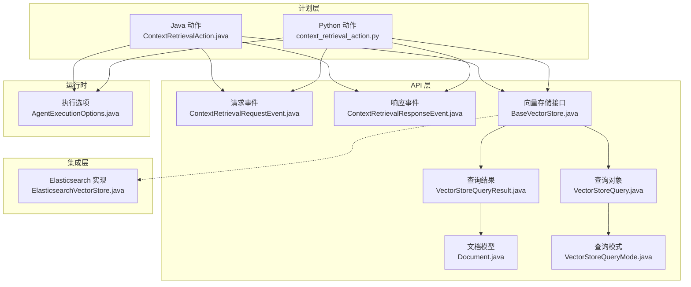
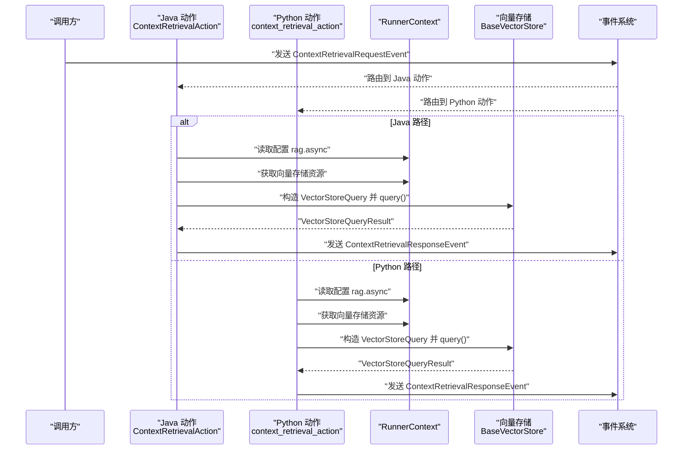
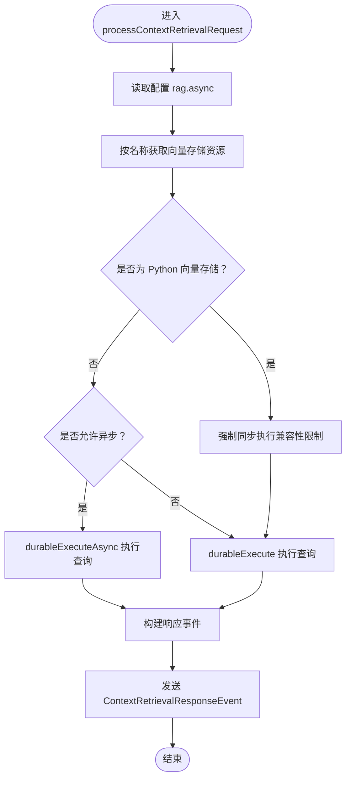
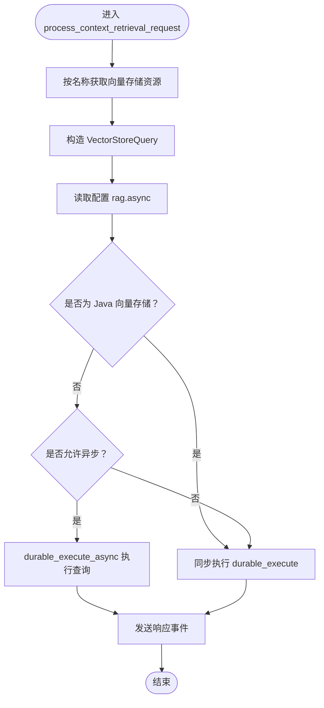
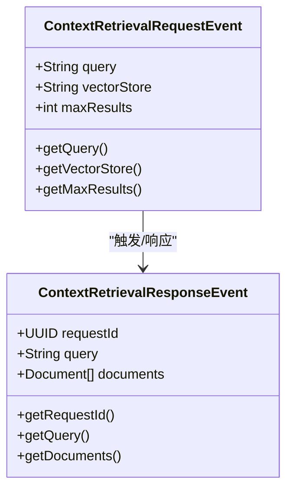
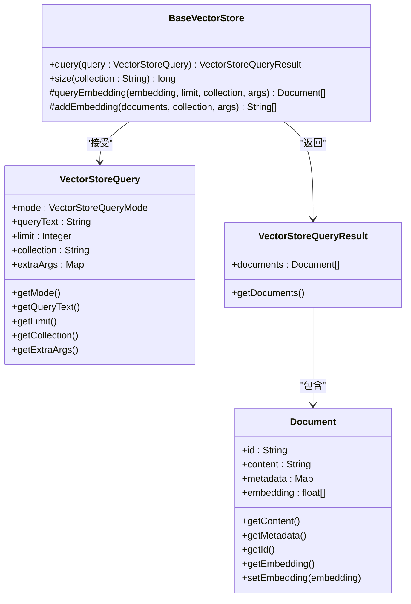
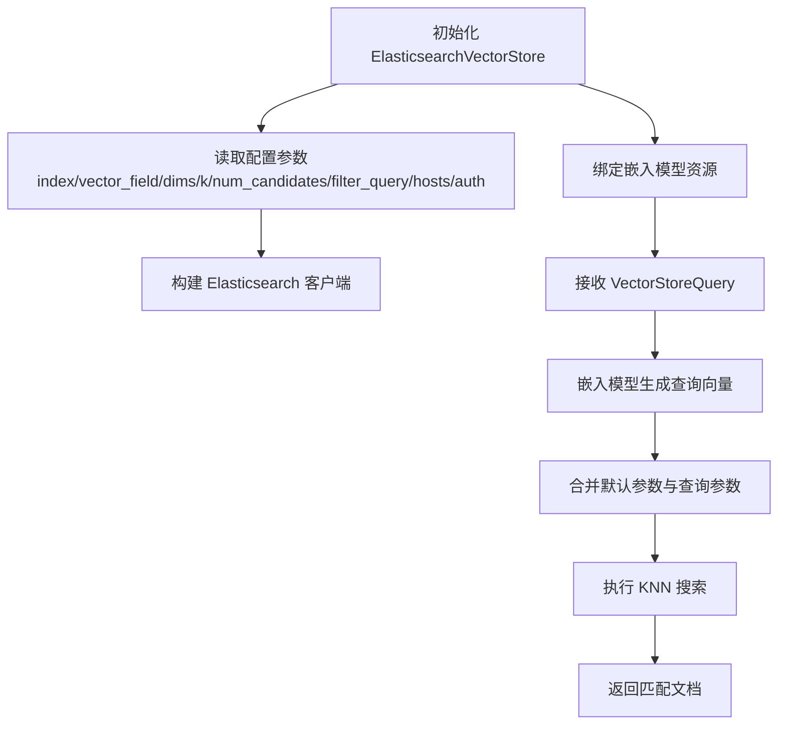
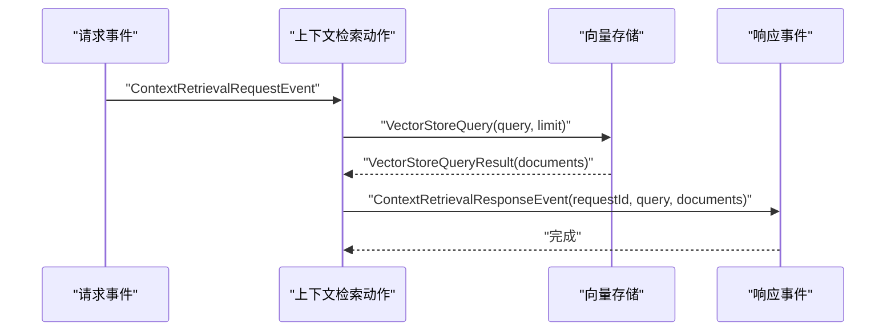
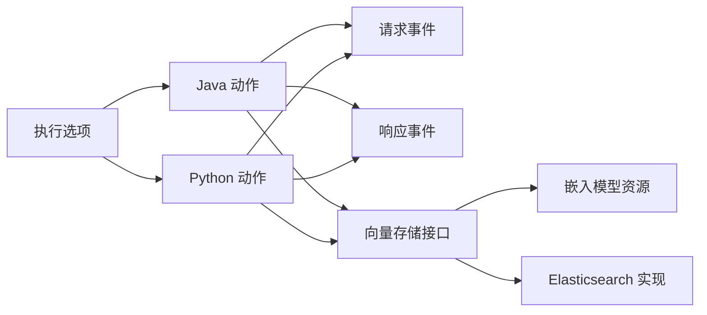

# 上下文检索动作

<cite>
**本文引用的文件**
- [ContextRetrievalAction.java](file://plan/src/main/java/org/apache/flink/agents/plan/actions/ContextRetrievalAction.java)
- [context_retrieval_action.py](file://python/flink_agents/plan/actions/context_retrieval_action.py)
- [ContextRetrievalRequestEvent.java](file://api/src/main/java/org/apache/flink/agents/api/event/ContextRetrievalRequestEvent.java)
- [ContextRetrievalResponseEvent.java](file://api/src/main/java/org/apache/flink/agents/api/event/ContextRetrievalResponseEvent.java)
- [BaseVectorStore.java](file://api/src/main/java/org/apache/flink/agents/api/vectorstores/BaseVectorStore.java)
- [VectorStoreQuery.java](file://api/src/main/java/org/apache/flink/agents/api/vectorstores/VectorStoreQuery.java)
- [VectorStoreQueryResult.java](file://api/src/main/java/org/apache/flink/agents/api/vectorstores/VectorStoreQueryResult.java)
- [Document.java](file://api/src/main/java/org/apache/flink/agents/api/vectorstores/Document.java)
- [VectorStoreQueryMode.java](file://api/src/main/java/org/apache/flink/agents/api/vectorstores/VectorStoreQueryMode.java)
- [ElasticsearchVectorStore.java](file://integrations/vector-stores/elasticsearch/src/main/java/org/apache/flink/agents/integrations/vectorstores/elasticsearch/ElasticsearchVectorStore.java)
- [AgentExecutionOptions.java](file://api/src/main/java/org/apache/flink/agents/api/agents/AgentExecutionOptions.java)
- [VectorStoreIntegrationAgent.java](file://e2e-test/flink-agents-end-to-end-tests-integration/src/test/java/org/apache/flink/agents/integration/test/VectorStoreIntegrationAgent.java)
- [VectorStoreCrossLanguageAgent.java](file://e2e-test/flink-agents-end-to-end-tests-resource-cross-language/src/test/java/org/apache/flink/agents/resource/test/VectorStoreCrossLanguageAgent.java)
</cite>

## 目录
1. [简介](#简介)
2. [项目结构](#项目结构)
3. [核心组件](#核心组件)
4. [架构总览](#架构总览)
5. [详细组件分析](#详细组件分析)
6. [依赖关系分析](#依赖关系分析)
7. [性能考虑](#性能考虑)
8. [故障排查指南](#故障排查指南)
9. [结论](#结论)
10. [附录](#附录)

## 简介
本文件面向 Apache Flink Agents 的“上下文检索动作”（ContextRetrievalAction），系统化阐述其工作原理、配置参数、与向量存储系统的集成方式、执行流程、多模态支持现状、使用示例、性能优化策略以及错误处理与异常恢复机制。该动作负责接收上下文检索请求事件，通过指定的向量存储资源执行查询，返回匹配的文档列表，并以响应事件的形式回传给下游。

## 项目结构
围绕上下文检索动作的关键代码分布在以下模块：
- 计划层（plan）：定义内置动作及其注册方式，Java 与 Python 双实现并行。
- API 层（api）：事件模型、向量存储接口与数据模型。
- 运行时（runtime）：执行环境与事件分发（此处用于理解整体运行框架）。
- 集成层（integrations）：具体向量存储实现（如 Elasticsearch）。
- 端到端测试（e2e-test）：验证检索流程与结果输出。

图表来源
- [ContextRetrievalAction.java](file://plan/src/main/java/org/apache/flink/agents/plan/actions/ContextRetrievalAction.java#L39-L100)
- [context_retrieval_action.py](file://python/flink_agents/plan/actions/context_retrieval_action.py#L35-L68)
- [ContextRetrievalRequestEvent.java](file://api/src/main/java/org/apache/flink/agents/api/event/ContextRetrievalRequestEvent.java#L24-L70)
- [ContextRetrievalResponseEvent.java](file://api/src/main/java/org/apache/flink/agents/api/event/ContextRetrievalResponseEvent.java#L28-L65)
- [BaseVectorStore.java](file://api/src/main/java/org/apache/flink/agents/api/vectorstores/BaseVectorStore.java#L38-L173)
- [VectorStoreQuery.java](file://api/src/main/java/org/apache/flink/agents/api/vectorstores/VectorStoreQuery.java#L33-L110)
- [VectorStoreQueryResult.java](file://api/src/main/java/org/apache/flink/agents/api/vectorstores/VectorStoreQueryResult.java#L29-L47)
- [Document.java](file://api/src/main/java/org/apache/flink/agents/api/vectorstores/Document.java#L34-L111)
- [VectorStoreQueryMode.java](file://api/src/main/java/org/apache/flink/agents/api/vectorstores/VectorStoreQueryMode.java#L28-L61)
- [ElasticsearchVectorStore.java](file://integrations/vector-stores/elasticsearch/src/main/java/org/apache/flink/agents/integrations/vectorstores/elasticsearch/ElasticsearchVectorStore.java#L118-L200)
- [AgentExecutionOptions.java](file://api/src/main/java/org/apache/flink/agents/api/agents/AgentExecutionOptions.java#L30-L47)

章节来源
- [ContextRetrievalAction.java](file://plan/src/main/java/org/apache/flink/agents/plan/actions/ContextRetrievalAction.java#L1-L101)
- [context_retrieval_action.py](file://python/flink_agents/plan/actions/context_retrieval_action.py#L1-L68)

## 核心组件
- 上下文检索动作（Java/Python）：负责解析请求事件、选择向量存储资源、构造查询对象、执行查询并发送响应事件。
- 请求/响应事件：承载查询文本、向量存储名称、最大返回数等信息。
- 向量存储接口：统一的查询入口，内部完成嵌入生成与相似度检索。
- 查询对象与结果：封装查询模式、限制、集合名与额外参数，以及返回的文档列表。
- 文档模型：包含内容、元数据、可选嵌入向量等字段。
- 执行选项：控制是否异步执行 RAG 流程及线程池大小等。

章节来源
- [ContextRetrievalAction.java](file://plan/src/main/java/org/apache/flink/agents/plan/actions/ContextRetrievalAction.java#L39-L100)
- [context_retrieval_action.py](file://python/flink_agents/plan/actions/context_retrieval_action.py#L35-L68)
- [ContextRetrievalRequestEvent.java](file://api/src/main/java/org/apache/flink/agents/api/event/ContextRetrievalRequestEvent.java#L24-L70)
- [ContextRetrievalResponseEvent.java](file://api/src/main/java/org/apache/flink/agents/api/event/ContextRetrievalResponseEvent.java#L28-L65)
- [BaseVectorStore.java](file://api/src/main/java/org/apache/flink/agents/api/vectorstores/BaseVectorStore.java#L97-L112)
- [VectorStoreQuery.java](file://api/src/main/java/org/apache/flink/agents/api/vectorstores/VectorStoreQuery.java#L46-L109)
- [VectorStoreQueryResult.java](file://api/src/main/java/org/apache/flink/agents/api/vectorstores/VectorStoreQueryResult.java#L29-L47)
- [Document.java](file://api/src/main/java/org/apache/flink/agents/api/vectorstores/Document.java#L34-L111)
- [VectorStoreQueryMode.java](file://api/src/main/java/org/apache/flink/agents/api/vectorstores/VectorStoreQueryMode.java#L28-L61)
- [AgentExecutionOptions.java](file://api/src/main/java/org/apache/flink/agents/api/agents/AgentExecutionOptions.java#L30-L47)

## 架构总览
上下文检索动作在运行时中以“动作”的形式被调度，监听特定请求事件类型，解析事件后调用向量存储资源进行查询，最终将结果封装为响应事件发送出去。异步执行由配置项控制，并对某些向量存储实现做了兼容性限制。

图表来源
- [ContextRetrievalAction.java](file://plan/src/main/java/org/apache/flink/agents/plan/actions/ContextRetrievalAction.java#L49-L99)
- [context_retrieval_action.py](file://python/flink_agents/plan/actions/context_retrieval_action.py#L35-L58)
- [ContextRetrievalRequestEvent.java](file://api/src/main/java/org/apache/flink/agents/api/event/ContextRetrievalRequestEvent.java#L24-L70)
- [ContextRetrievalResponseEvent.java](file://api/src/main/java/org/apache/flink/agents/api/event/ContextRetrievalResponseEvent.java#L28-L65)
- [BaseVectorStore.java](file://api/src/main/java/org/apache/flink/agents/api/vectorstores/BaseVectorStore.java#L97-L112)

## 详细组件分析

### 上下文检索动作（Java）
- 注册与监听：通过静态工厂方法注册名为“context_retrieval_action”的动作，监听请求事件类型。
- 处理逻辑：
  - 读取配置项 rag.async 决定是否异步执行。
  - 获取向量存储资源（按名称与类型）。
  - 对 Python 向量存储实现做兼容性限制（异步暂不支持）。
  - 构造查询对象（查询文本、最大结果数）。
  - 执行查询并发送响应事件（携带文档列表）。

图表来源
- [ContextRetrievalAction.java](file://plan/src/main/java/org/apache/flink/agents/plan/actions/ContextRetrievalAction.java#L49-L99)

章节来源
- [ContextRetrievalAction.java](file://plan/src/main/java/org/apache/flink/agents/plan/actions/ContextRetrievalAction.java#L39-L100)

### 上下文检索动作（Python）
- 注册与监听：定义常量动作对象，监听请求事件类型。
- 处理逻辑：
  - 获取向量存储资源。
  - 构造查询对象（查询文本、最大结果数）。
  - 读取配置项 rag.async，并对 Java 向量存储实现做兼容性限制。
  - 异步或同步执行查询，发送响应事件。

图表来源
- [context_retrieval_action.py](file://python/flink_agents/plan/actions/context_retrieval_action.py#L35-L58)

章节来源
- [context_retrieval_action.py](file://python/flink_agents/plan/actions/context_retrieval_action.py#L35-L68)

### 事件模型
- 请求事件：包含查询文本、向量存储名称、最大结果数；默认最大结果数为 3。
- 响应事件：包含请求 ID、查询文本、返回的文档列表。

图表来源
- [ContextRetrievalRequestEvent.java](file://api/src/main/java/org/apache/flink/agents/api/event/ContextRetrievalRequestEvent.java#L24-L70)
- [ContextRetrievalResponseEvent.java](file://api/src/main/java/org/apache/flink/agents/api/event/ContextRetrievalResponseEvent.java#L28-L65)

章节来源
- [ContextRetrievalRequestEvent.java](file://api/src/main/java/org/apache/flink/agents/api/event/ContextRetrievalRequestEvent.java#L24-L70)
- [ContextRetrievalResponseEvent.java](file://api/src/main/java/org/apache/flink/agents/api/event/ContextRetrievalResponseEvent.java#L28-L65)

### 向量存储与查询机制
- 接口职责：统一的查询入口，内部通过嵌入模型将查询文本转换为向量，再结合存储特定参数执行检索。
- 查询对象：封装查询模式（当前仅语义）、查询文本、返回上限、集合名与额外参数。
- 结果对象：封装匹配的文档列表。
- 文档模型：包含内容、元数据与可选嵌入向量。

图表来源
- [BaseVectorStore.java](file://api/src/main/java/org/apache/flink/agents/api/vectorstores/BaseVectorStore.java#L97-L112)
- [VectorStoreQuery.java](file://api/src/main/java/org/apache/flink/agents/api/vectorstores/VectorStoreQuery.java#L33-L110)
- [VectorStoreQueryResult.java](file://api/src/main/java/org/apache/flink/agents/api/vectorstores/VectorStoreQueryResult.java#L29-L47)
- [Document.java](file://api/src/main/java/org/apache/flink/agents/api/vectorstores/Document.java#L34-L111)

章节来源
- [BaseVectorStore.java](file://api/src/main/java/org/apache/flink/agents/api/vectorstores/BaseVectorStore.java#L97-L112)
- [VectorStoreQuery.java](file://api/src/main/java/org/apache/flink/agents/api/vectorstores/VectorStoreQuery.java#L46-L109)
- [VectorStoreQueryResult.java](file://api/src/main/java/org/apache/flink/agents/api/vectorstores/VectorStoreQueryResult.java#L29-L47)
- [Document.java](file://api/src/main/java/org/apache/flink/agents/api/vectorstores/Document.java#L34-L111)

### 与向量存储系统集成（以 Elasticsearch 为例）
- 配置要点：索引名、向量字段名、维度、默认 k 值、候选集大小、过滤查询、主机地址与认证参数等。
- 检索流程：基于嵌入模型生成查询向量，结合存储默认参数与查询额外参数，执行近似最近邻搜索，返回匹配文档。

图表来源
- [ElasticsearchVectorStore.java](file://integrations/vector-stores/elasticsearch/src/main/java/org/apache/flink/agents/integrations/vectorstores/elasticsearch/ElasticsearchVectorStore.java#L118-L200)
- [BaseVectorStore.java](file://api/src/main/java/org/apache/flink/agents/api/vectorstores/BaseVectorStore.java#L97-L112)

章节来源
- [ElasticsearchVectorStore.java](file://integrations/vector-stores/elasticsearch/src/main/java/org/apache/flink/agents/integrations/vectorstores/elasticsearch/ElasticsearchVectorStore.java#L118-L200)
- [BaseVectorStore.java](file://api/src/main/java/org/apache/flink/agents/api/vectorstores/BaseVectorStore.java#L97-L112)

### 执行流程（从查询处理到上下文生成）
- 输入：请求事件包含查询文本、向量存储名称、最大结果数。
- 处理：动作根据配置决定同步/异步执行；向量存储生成查询向量并执行检索。
- 输出：响应事件包含请求 ID、查询文本与文档列表，供后续步骤（如提示词组装）使用。

图表来源
- [ContextRetrievalAction.java](file://plan/src/main/java/org/apache/flink/agents/plan/actions/ContextRetrievalAction.java#L67-L98)
- [context_retrieval_action.py](file://python/flink_agents/plan/actions/context_retrieval_action.py#L40-L58)
- [VectorStoreQuery.java](file://api/src/main/java/org/apache/flink/agents/api/vectorstores/VectorStoreQuery.java#L46-L109)
- [VectorStoreQueryResult.java](file://api/src/main/java/org/apache/flink/agents/api/vectorstores/VectorStoreQueryResult.java#L29-L47)

章节来源
- [ContextRetrievalAction.java](file://plan/src/main/java/org/apache/flink/agents/plan/actions/ContextRetrievalAction.java#L49-L99)
- [context_retrieval_action.py](file://python/flink_agents/plan/actions/context_retrieval_action.py#L35-L58)

### 多模态数据处理
- 当前实现聚焦于文本嵌入与语义相似度检索。文档模型支持嵌入字段，但未在检索动作中直接暴露阈值或相关性评分的显式参数。
- 若需扩展至多模态（如图像/音频），可在嵌入模型侧增加对应能力，并在向量存储实现中调整索引与检索参数。

章节来源
- [Document.java](file://api/src/main/java/org/apache/flink/agents/api/vectorstores/Document.java#L45-L78)
- [BaseVectorStore.java](file://api/src/main/java/org/apache/flink/agents/api/vectorstores/BaseVectorStore.java#L97-L112)

### 使用示例（基于端到端测试）
- 场景一：跨语言向量存储集成测试中，先初始化向量存储、写入/删除/获取文档，随后发送上下文检索请求事件，最后在响应事件中校验返回文档数量与内容预览。
- 场景二：集成测试中，通过嵌入模型连接与设置，准备嵌入资源，再进行检索与结果断言。

章节来源
- [VectorStoreCrossLanguageAgent.java](file://e2e-test/flink-agents-end-to-end-tests-resource-cross-language/src/test/java/org/apache/flink/agents/resource/test/VectorStoreCrossLanguageAgent.java#L155-L231)
- [VectorStoreIntegrationAgent.java](file://e2e-test/flink-agents-end-to-end-tests-integration/src/test/java/org/apache/flink/agents/integration/test/VectorStoreIntegrationAgent.java#L39-L67)

## 依赖关系分析
- 动作依赖事件模型与向量存储接口；向量存储接口依赖嵌入模型资源。
- 执行选项控制异步行为；对 Python 向量存储实现有兼容性限制。
- 具体向量存储实现（如 Elasticsearch）提供存储级参数（如 k、候选集、过滤器等）。

图表来源
- [ContextRetrievalAction.java](file://plan/src/main/java/org/apache/flink/agents/plan/actions/ContextRetrievalAction.java#L52-L65)
- [context_retrieval_action.py](file://python/flink_agents/plan/actions/context_retrieval_action.py#L42-L45)
- [BaseVectorStore.java](file://api/src/main/java/org/apache/flink/agents/api/vectorstores/BaseVectorStore.java#L97-L112)
- [ElasticsearchVectorStore.java](file://integrations/vector-stores/elasticsearch/src/main/java/org/apache/flink/agents/integrations/vectorstores/elasticsearch/ElasticsearchVectorStore.java#L118-L200)
- [AgentExecutionOptions.java](file://api/src/main/java/org/apache/flink/agents/api/agents/AgentExecutionOptions.java#L45-L47)

章节来源
- [ContextRetrievalAction.java](file://plan/src/main/java/org/apache/flink/agents/plan/actions/ContextRetrievalAction.java#L52-L65)
- [context_retrieval_action.py](file://python/flink_agents/plan/actions/context_retrieval_action.py#L42-L45)
- [BaseVectorStore.java](file://api/src/main/java/org/apache/flink/agents/api/vectorstores/BaseVectorStore.java#L97-L112)
- [ElasticsearchVectorStore.java](file://integrations/vector-stores/elasticsearch/src/main/java/org/apache/flink/agents/integrations/vectorstores/elasticsearch/ElasticsearchVectorStore.java#L118-L200)
- [AgentExecutionOptions.java](file://api/src/main/java/org/apache/flink/agents/api/agents/AgentExecutionOptions.java#L45-L47)

## 性能考虑
- 异步执行：通过配置项启用异步 RAG，减少阻塞；对 Python 向量存储实现存在兼容性限制。
- 线程池：可通过配置项设置异步线程数量，平衡吞吐与延迟。
- 存储参数：在向量存储实现中合理设置 k 值与候选集大小，有助于提升检索效率与质量。
- 缓存策略：可结合外部缓存（如查询结果缓存）降低重复检索开销（需在上层业务中实现）。

章节来源
- [AgentExecutionOptions.java](file://api/src/main/java/org/apache/flink/agents/api/agents/AgentExecutionOptions.java#L30-L47)
- [ContextRetrievalAction.java](file://plan/src/main/java/org/apache/flink/agents/plan/actions/ContextRetrievalAction.java#L52-L65)
- [context_retrieval_action.py](file://python/flink_agents/plan/actions/context_retrieval_action.py#L42-L45)
- [ElasticsearchVectorStore.java](file://integrations/vector-stores/elasticsearch/src/main/java/org/apache/flink/agents/integrations/vectorstores/elasticsearch/ElasticsearchVectorStore.java#L194-L199)

## 故障排查指南
- 事件类型不匹配：确认监听的事件类型与实际发送的一致。
- 资源未找到：检查向量存储资源名称与类型是否正确。
- 异步执行异常：若使用 Python 向量存储，请确保禁用 rag.async 或切换到 Java 实现。
- 结果为空：核对查询文本、集合名与存储参数；检查嵌入模型可用性与维度一致性。
- 端到端验证：参考端到端测试中的断言逻辑，逐项比对返回文档数量、预览与 ID。

章节来源
- [ContextRetrievalRequestEvent.java](file://api/src/main/java/org/apache/flink/agents/api/event/ContextRetrievalRequestEvent.java#L24-L70)
- [ContextRetrievalResponseEvent.java](file://api/src/main/java/org/apache/flink/agents/api/event/ContextRetrievalResponseEvent.java#L28-L65)
- [VectorStoreCrossLanguageAgent.java](file://e2e-test/flink-agents-end-to-end-tests-resource-cross-language/src/test/java/org/apache/flink/agents/resource/test/VectorStoreCrossLanguageAgent.java#L175-L231)
- [VectorStoreIntegrationAgent.java](file://e2e-test/flink-agents-end-to-end-tests-integration/src/test/java/org/apache/flink/agents/integration/test/VectorStoreIntegrationAgent.java#L129-L155)

## 结论
上下文检索动作提供了统一的语义检索入口，通过事件驱动与资源抽象，实现了与多种向量存储的解耦集成。其核心在于：清晰的事件契约、可插拔的向量存储接口、可配置的异步执行策略，以及在端到端测试中的可验证性。未来可在相似度阈值、相关性评分与多模态支持方面进一步扩展。

## 附录

### 配置参数与含义
- 向量存储名称：用于在运行时按名称解析向量存储资源。
- 查询文本：作为语义检索的输入文本。
- 最大结果数：限制返回的文档数量。
- 相似度阈值：当前未在检索动作中直接暴露，可在向量存储实现或上层业务中自行过滤。
- 返回文档数量：由最大结果数与实际检索结果共同决定。

章节来源
- [ContextRetrievalRequestEvent.java](file://api/src/main/java/org/apache/flink/agents/api/event/ContextRetrievalRequestEvent.java#L26-L54)
- [VectorStoreQuery.java](file://api/src/main/java/org/apache/flink/agents/api/vectorstores/VectorStoreQuery.java#L46-L109)
- [VectorStoreQueryMode.java](file://api/src/main/java/org/apache/flink/agents/api/vectorstores/VectorStoreQueryMode.java#L28-L61)