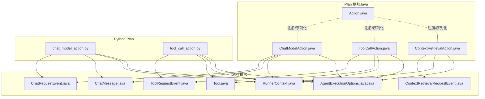
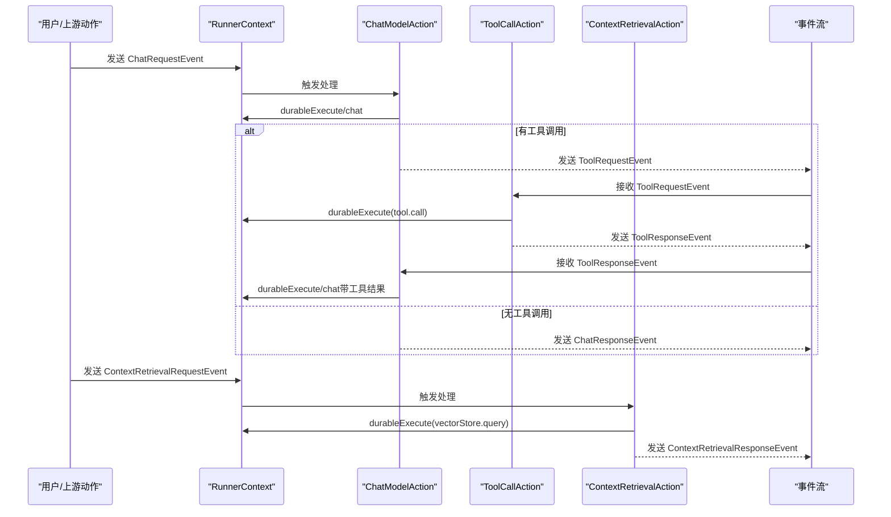
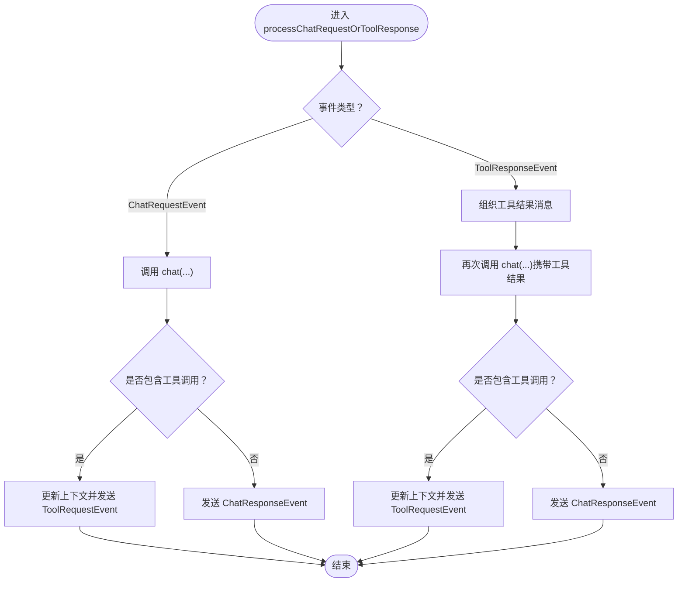
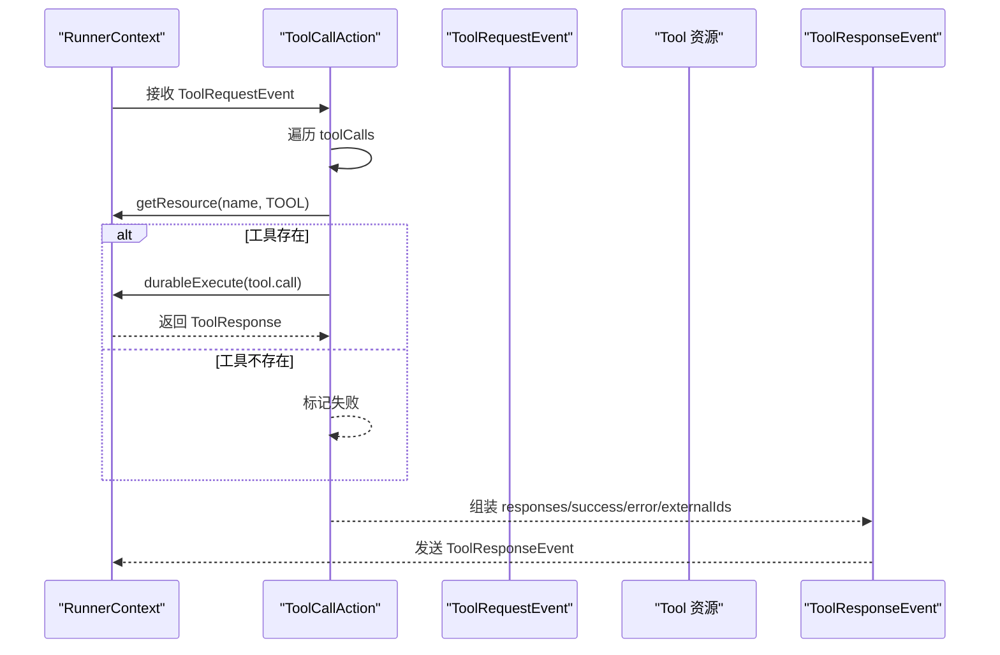
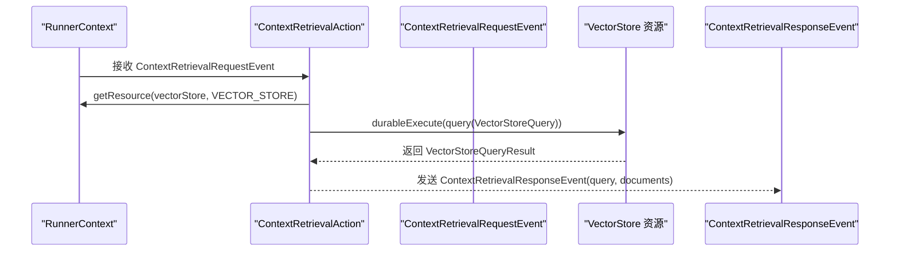
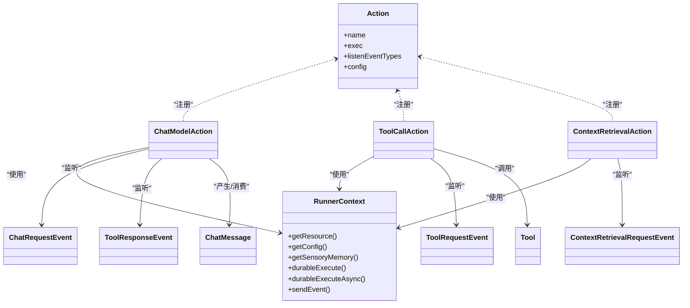

# 内置动作类型

<cite>
**本文引用的文件**
- [ChatModelAction.java](file://plan/src/main/java/org/apache/flink/agents/plan/actions/ChatModelAction.java)
- [ToolCallAction.java](file://plan/src/main/java/org/apache/flink/agents/plan/actions/ToolCallAction.java)
- [ContextRetrievalAction.java](file://plan/src/main/java/org/apache/flink/agents/plan/actions/ContextRetrievalAction.java)
- [Action.java](file://plan/src/main/java/org/apache/flink/agents/plan/actions/Action.java)
- [ChatRequestEvent.java](file://api/src/main/java/org/apache/flink/agents/api/event/ChatRequestEvent.java)
- [ToolRequestEvent.java](file://api/src/main/java/org/apache/flink/agents/api/event/ToolRequestEvent.java)
- [ContextRetrievalRequestEvent.java](file://api/src/main/java/org/apache/flink/agents/api/event/ContextRetrievalRequestEvent.java)
- [ChatMessage.java](file://api/src/main/java/org/apache/flink/agents/api/chat/messages/ChatMessage.java)
- [Tool.java](file://api/src/main/java/org/apache/flink/agents/api/tools/Tool.java)
- [AgentExecutionOptions.java（Java）](file://api/src/main/java/org/apache/flink/agents/api/agents/AgentExecutionOptions.java)
- [RunnerContext.java](file://api/src/main/java/org/apache/flink/agents/api/context/RunnerContext.java)
- [chat_model_action.py（Python 实现）](file://python/flink_agents/plan/actions/chat_model_action.py)
- [tool_call_action.py（Python 实现）](file://python/flink_agents/plan/actions/tool_call_action.py)
- [CreateJavaAgentPlanFromJson.java](file://plan/src/test/java/org/apache/flink/agents/plan/compatibility/CreateJavaAgentPlanFromJson.java)
- [react_agent.py（Python ReAct 示例）](file://python/flink_agents/api/agents/react_agent.py)
- [chat_model_integration_agent.py（Java 集成示例）](file://python/flink_agents/e2e_tests/e2e_tests_integration/chat_model_integration_agent.py)
- [vector_store_cross_language_agent.py（向量检索示例）](file://python/flink_agents/e2e_tests/e2e_tests_resource_cross_language/vector_store_cross_language_agent.py)
</cite>

## 目录
1. [简介](#简介)
2. [项目结构](#项目结构)
3. [核心组件](#核心组件)
4. [架构总览](#架构总览)
5. [详细组件分析](#详细组件分析)
6. [依赖关系分析](#依赖关系分析)
7. [性能考虑](#性能考虑)
8. [故障排查指南](#故障排查指南)
9. [结论](#结论)
10. [附录：使用示例与最佳实践](#附录使用示例与最佳实践)

## 简介
本文件系统性梳理 Apache Flink Agents 的三种内置动作类型：ChatModelAction、ToolCallAction、ContextRetrievalAction。内容覆盖：
- 功能特性与处理流程
- 参数配置与输入输出格式
- 消息与事件模型
- 错误处理策略
- 与代理计划的集成方式（动作注册、事件监听）
- 性能优化建议与最佳实践

## 项目结构
内置动作位于 plan 模块的 actions 包中，分别封装了聊天模型调用、工具调用与上下文检索的完整流程；同时在 Python 端提供了等价实现，便于跨语言运行。

图表来源
- [Action.java](file://plan/src/main/java/org/apache/flink/agents/plan/actions/Action.java#L41-L100)
- [ChatModelAction.java](file://plan/src/main/java/org/apache/flink/agents/plan/actions/ChatModelAction.java#L51-L352)
- [ToolCallAction.java](file://plan/src/main/java/org/apache/flink/agents/plan/actions/ToolCallAction.java#L35-L113)
- [ContextRetrievalAction.java](file://plan/src/main/java/org/apache/flink/agents/plan/actions/ContextRetrievalAction.java#L36-L101)
- [ChatRequestEvent.java](file://api/src/main/java/org/apache/flink/agents/api/event/ChatRequestEvent.java#L28-L58)
- [ToolRequestEvent.java](file://api/src/main/java/org/apache/flink/agents/api/event/ToolRequestEvent.java#L26-L63)
- [ContextRetrievalRequestEvent.java](file://api/src/main/java/org/apache/flink/agents/api/event/ContextRetrievalRequestEvent.java#L23-L70)
- [ChatMessage.java](file://api/src/main/java/org/apache/flink/agents/api/chat/messages/ChatMessage.java#L29-L158)
- [Tool.java](file://api/src/main/java/org/apache/flink/agents/api/tools/Tool.java#L26-L70)
- [RunnerContext.java](file://api/src/main/java/org/apache/flink/agents/api/context/RunnerContext.java#L29-L138)
- [AgentExecutionOptions.java（Java）](file://api/src/main/java/org/apache/flink/agents/api/agents/AgentExecutionOptions.java#L23-L48)
- [chat_model_action.py（Python 实现）](file://python/flink_agents/plan/actions/chat_model_action.py#L285-L310)
- [tool_call_action.py（Python 实现）](file://python/flink_agents/plan/actions/tool_call_action.py#L59-L66)

章节来源
- [Action.java](file://plan/src/main/java/org/apache/flink/agents/plan/actions/Action.java#L41-L100)
- [ChatModelAction.java](file://plan/src/main/java/org/apache/flink/agents/plan/actions/ChatModelAction.java#L51-L352)
- [ToolCallAction.java](file://plan/src/main/java/org/apache/flink/agents/plan/actions/ToolCallAction.java#L35-L113)
- [ContextRetrievalAction.java](file://plan/src/main/java/org/apache/flink/agents/plan/actions/ContextRetrievalAction.java#L36-L101)

## 核心组件
- Action：内置动作的统一表示，包含名称、可执行函数、监听事件类型以及可选配置。用于代理计划的序列化与注册。
- ChatModelAction：处理聊天请求与工具调用反馈，支持结构化输出与重试策略。
- ToolCallAction：接收工具调用请求，按名称解析资源并执行，返回工具响应事件。
- ContextRetrievalAction：根据查询与向量库配置执行检索，返回文档列表。

章节来源
- [Action.java](file://plan/src/main/java/org/apache/flink/agents/plan/actions/Action.java#L41-L100)
- [ChatModelAction.java](file://plan/src/main/java/org/apache/flink/agents/plan/actions/ChatModelAction.java#L51-L352)
- [ToolCallAction.java](file://plan/src/main/java/org/apache/flink/agents/plan/actions/ToolCallAction.java#L35-L113)
- [ContextRetrievalAction.java](file://plan/src/main/java/org/apache/flink/agents/plan/actions/ContextRetrievalAction.java#L36-L101)

## 架构总览
内置动作通过 RunnerContext 获取资源、内存与配置，并以事件驱动的方式串联聊天、工具与检索流程。

图表来源
- [ChatModelAction.java](file://plan/src/main/java/org/apache/flink/agents/plan/actions/ChatModelAction.java#L181-L277)
- [ToolCallAction.java](file://plan/src/main/java/org/apache/flink/agents/plan/actions/ToolCallAction.java#L47-L111)
- [ContextRetrievalAction.java](file://plan/src/main/java/org/apache/flink/agents/plan/actions/ContextRetrievalAction.java#L49-L99)
- [ChatRequestEvent.java](file://api/src/main/java/org/apache/flink/agents/api/event/ChatRequestEvent.java#L28-L58)
- [ToolRequestEvent.java](file://api/src/main/java/org/apache/flink/agents/api/event/ToolRequestEvent.java#L26-L63)
- [ContextRetrievalRequestEvent.java](file://api/src/main/java/org/apache/flink/agents/api/event/ContextRetrievalRequestEvent.java#L23-L70)

## 详细组件分析

### ChatModelAction（聊天模型动作）
- 监听事件：ChatRequestEvent、ToolResponseEvent
- 主要职责
  - 调用聊天模型资源，生成 ChatMessage 响应
  - 若响应包含工具调用，则发送 ToolRequestEvent 并保存上下文
  - 若无工具调用且提供输出模式，则将文本转为结构化输出
  - 支持异步执行与重试策略
- 关键数据结构
  - ChatMessage：角色、内容、工具调用列表、额外参数
  - ChatRequestEvent：模型名、消息列表、可选输出模式
- 上下文管理
  - 使用 SensoryMemory 存储“初始请求 ID → 对话上下文”的映射
  - 记录 ToolRequestEvent 的上下文（初始请求 ID、模型名、输出模式）
- 结构化输出
  - 支持 Java 类型或 OutputSchema（RowTypeInfo）两种模式
  - 将解析后的结构化对象放入 ChatMessage 的 extraArgs 中

图表来源
- [ChatModelAction.java](file://plan/src/main/java/org/apache/flink/agents/plan/actions/ChatModelAction.java#L181-L350)
- [ChatMessage.java](file://api/src/main/java/org/apache/flink/agents/api/chat/messages/ChatMessage.java#L29-L158)
- [ChatRequestEvent.java](file://api/src/main/java/org/apache/flink/agents/api/event/ChatRequestEvent.java#L28-L58)

章节来源
- [ChatModelAction.java](file://plan/src/main/java/org/apache/flink/agents/plan/actions/ChatModelAction.java#L51-L352)
- [ChatMessage.java](file://api/src/main/java/org/apache/flink/agents/api/chat/messages/ChatMessage.java#L29-L158)
- [ChatRequestEvent.java](file://api/src/main/java/org/apache/flink/agents/api/event/ChatRequestEvent.java#L28-L58)

### ToolCallAction（工具调用动作）
- 监听事件：ToolRequestEvent
- 处理流程
  - 解析每个工具调用（id、函数名、参数）
  - 从 RunnerContext 获取对应 Tool 资源
  - 执行 Tool.call(ToolParameters(args))，收集成功/失败状态与结果
  - 发送 ToolResponseEvent（包含 responses、success、error、externalIds）
- 异步与重试
  - 受配置项控制，支持异步执行
  - 执行异常会被捕获并记录到 error 字段

图表来源
- [ToolCallAction.java](file://plan/src/main/java/org/apache/flink/agents/plan/actions/ToolCallAction.java#L47-L111)
- [ToolRequestEvent.java](file://api/src/main/java/org/apache/flink/agents/api/event/ToolRequestEvent.java#L26-L63)
- [Tool.java](file://api/src/main/java/org/apache/flink/agents/api/tools/Tool.java#L26-L70)

章节来源
- [ToolCallAction.java](file://plan/src/main/java/org/apache/flink/agents/plan/actions/ToolCallAction.java#L35-L113)
- [ToolRequestEvent.java](file://api/src/main/java/org/apache/flink/agents/api/event/ToolRequestEvent.java#L26-L63)
- [Tool.java](file://api/src/main/java/org/apache/flink/agents/api/tools/Tool.java#L26-L70)

### ContextRetrievalAction（上下文检索动作）
- 监听事件：ContextRetrievalRequestEvent
- 处理流程
  - 从 RunnerContext 获取指定向量库资源
  - 构造 VectorStoreQuery（query、maxResults），执行查询
  - 发送 ContextRetrievalResponseEvent（包含原始查询与检索到的文档列表）
- 异步与兼容性
  - 受配置项控制，支持异步执行
  - 对 Python 向量库暂不支持异步执行的限制已在代码中标注

图表来源
- [ContextRetrievalAction.java](file://plan/src/main/java/org/apache/flink/agents/plan/actions/ContextRetrievalAction.java#L49-L99)
- [ContextRetrievalRequestEvent.java](file://api/src/main/java/org/apache/flink/agents/api/event/ContextRetrievalRequestEvent.java#L23-L70)

章节来源
- [ContextRetrievalAction.java](file://plan/src/main/java/org/apache/flink/agents/plan/actions/ContextRetrievalAction.java#L36-L101)
- [ContextRetrievalRequestEvent.java](file://api/src/main/java/org/apache/flink/agents/api/event/ContextRetrievalRequestEvent.java#L23-L70)

## 依赖关系分析
- 动作注册与序列化
  - Action 统一承载动作元信息，支持 JSON 序列化/反序列化，便于跨语言计划交换
  - 内置动作在 Java 侧通过静态工厂方法注册，在 Python 侧通过 Action 构造器注册
- 事件与资源
  - ChatModelAction 依赖 ChatRequestEvent、ToolRequestEvent、ToolResponseEvent、ChatMessage
  - ToolCallAction 依赖 ToolRequestEvent、Tool、ToolResponse
  - ContextRetrievalAction 依赖 ContextRetrievalRequestEvent、VectorStore 资源
- 执行与配置
  - RunnerContext 提供资源获取、内存访问、配置读取、事件发送与持久化执行能力
  - AgentExecutionOptions 控制错误处理策略、最大重试次数、异步开关（聊天/工具/检索）

图表来源
- [Action.java](file://plan/src/main/java/org/apache/flink/agents/plan/actions/Action.java#L41-L100)
- [ChatModelAction.java](file://plan/src/main/java/org/apache/flink/agents/plan/actions/ChatModelAction.java#L51-L352)
- [ToolCallAction.java](file://plan/src/main/java/org/apache/flink/agents/plan/actions/ToolCallAction.java#L35-L113)
- [ContextRetrievalAction.java](file://plan/src/main/java/org/apache/flink/agents/plan/actions/ContextRetrievalAction.java#L36-L101)
- [RunnerContext.java](file://api/src/main/java/org/apache/flink/agents/api/context/RunnerContext.java#L29-L138)
- [ChatRequestEvent.java](file://api/src/main/java/org/apache/flink/agents/api/event/ChatRequestEvent.java#L28-L58)
- [ToolRequestEvent.java](file://api/src/main/java/org/apache/flink/agents/api/event/ToolRequestEvent.java#L26-L63)
- [ContextRetrievalRequestEvent.java](file://api/src/main/java/org/apache/flink/agents/api/event/ContextRetrievalRequestEvent.java#L23-L70)
- [ChatMessage.java](file://api/src/main/java/org/apache/flink/agents/api/chat/messages/ChatMessage.java#L29-L158)
- [Tool.java](file://api/src/main/java/org/apache/flink/agents/api/tools/Tool.java#L26-L70)

章节来源
- [Action.java](file://plan/src/main/java/org/apache/flink/agents/plan/actions/Action.java#L41-L100)
- [CreateJavaAgentPlanFromJson.java](file://plan/src/test/java/org/apache/flink/agents/plan/compatibility/CreateJavaAgentPlanFromJson.java#L85-L142)

## 性能考虑
- 异步执行
  - 聊天、工具调用、RAG 均可通过配置开启异步执行，减少阻塞
  - 注意：Java 端对 Python 资源类型的异步支持有限制，需遵循实现注释
- 重试策略
  - 可配置最大重试次数与错误处理策略（忽略/失败/重试），避免瞬时异常导致任务失败
- 线程池与并发
  - 异步线程数可根据 CPU 核数动态调整，平衡吞吐与延迟
- 结构化输出
  - 在无工具调用时再进行结构化解析，避免不必要的反序列化开销

章节来源
- [AgentExecutionOptions.java（Java）](file://api/src/main/java/org/apache/flink/agents/api/agents/AgentExecutionOptions.java#L23-L48)
- [ChatModelAction.java](file://plan/src/main/java/org/apache/flink/agents/plan/actions/ChatModelAction.java#L198-L277)
- [ToolCallAction.java](file://plan/src/main/java/org/apache/flink/agents/plan/actions/ToolCallAction.java#L47-L111)
- [ContextRetrievalAction.java](file://plan/src/main/java/org/apache/flink/agents/plan/actions/ContextRetrievalAction.java#L49-L99)

## 故障排查指南
- 错误处理策略
  - IGNORE：忽略异常，直接返回
  - FAIL：抛出异常，中断当前步骤
  - RETRY：按最大重试次数自动重试
- 常见问题定位
  - 工具不存在：ToolCallAction 会记录失败原因并返回错误信息
  - 聊天模型异常：检查模型资源可用性与网络连通性；查看日志中的输入消息快照
  - 向量库异常：确认向量库资源名称与查询参数正确
- 日志与指标
  - RunnerContext 提供指标组接口，可用于采集动作耗时与吞吐

章节来源
- [ChatModelAction.java](file://plan/src/main/java/org/apache/flink/agents/plan/actions/ChatModelAction.java#L206-L270)
- [ToolCallAction.java](file://plan/src/main/java/org/apache/flink/agents/plan/actions/ToolCallAction.java#L65-L107)
- [RunnerContext.java](file://api/src/main/java/org/apache/flink/agents/api/context/RunnerContext.java#L67-L80)

## 结论
内置动作通过统一的事件驱动与资源抽象，实现了聊天、工具与检索的高内聚、低耦合流程。配合可配置的异步与重试策略，能够在复杂场景下保持稳定与高性能。建议在生产环境中结合业务特征合理设置异步线程数与重试策略，并充分利用结构化输出与上下文记忆提升交互质量。

## 附录：使用示例与最佳实践

### 集成与注册（Java）
- 使用 Action 工厂方法注册内置动作，并将其绑定到目标事件类型
- 通过 AgentPlan 的 actions 映射与 actionsByEvent 查询表完成动作注册与事件路由

章节来源
- [Action.java](file://plan/src/main/java/org/apache/flink/agents/plan/actions/Action.java#L41-L100)
- [CreateJavaAgentPlanFromJson.java](file://plan/src/test/java/org/apache/flink/agents/plan/compatibility/CreateJavaAgentPlanFromJson.java#L85-L142)

### 集成与注册（Python）
- Python 端通过 Action 构造器注册等价动作，监听相同事件类型
- 与 Java 端保持一致的事件契约与资源命名

章节来源
- [chat_model_action.py（Python 实现）](file://python/flink_agents/plan/actions/chat_model_action.py#L302-L310)
- [tool_call_action.py（Python 实现）](file://python/flink_agents/plan/actions/tool_call_action.py#L61-L66)

### 场景示例
- 聊天与工具调用（Java）
  - 用户输入触发 ChatRequestEvent，ChatModelAction 调用模型并根据是否包含工具调用决定后续流程
  - 工具执行完成后回传 ToolResponseEvent，ChatModelAction 再次调用模型汇总结果
- 向量检索（Python）
  - 用户输入触发 ContextRetrievalRequestEvent，ContextRetrievalAction 查询向量库并返回文档列表
- ReAct 示例（Python）
  - 使用 ReactAgent 生成 ChatRequestEvent，并在收到 ChatResponseEvent 后输出结构化结果

章节来源
- [chat_model_integration_agent.py（Java 集成示例）](file://python/flink_agents/e2e_tests/e2e_tests_integration/chat_model_integration_agent.py#L164-L190)
- [vector_store_cross_language_agent.py（向量检索示例）](file://python/flink_agents/e2e_tests/e2e_tests_resource_cross_language/vector_store_cross_language_agent.py#L178-L200)
- [react_agent.py（Python ReAct 示例）](file://python/flink_agents/api/agents/react_agent.py#L190-L211)

### 最佳实践
- 明确区分“聊天动作”“工具动作”“检索动作”的职责边界，避免在一个动作中混杂过多逻辑
- 对外部资源调用统一采用 durableExecute/durableExecuteAsync，确保作业恢复一致性
- 使用 SensoryMemory 管理短期上下文，避免跨作业共享敏感状态
- 在需要结构化输出时，优先使用 OutputSchema 或 Pydantic 模型，保证结果稳定性
- 对 Python 资源类型的异步执行保持谨慎，必要时关闭异步以规避兼容性问题