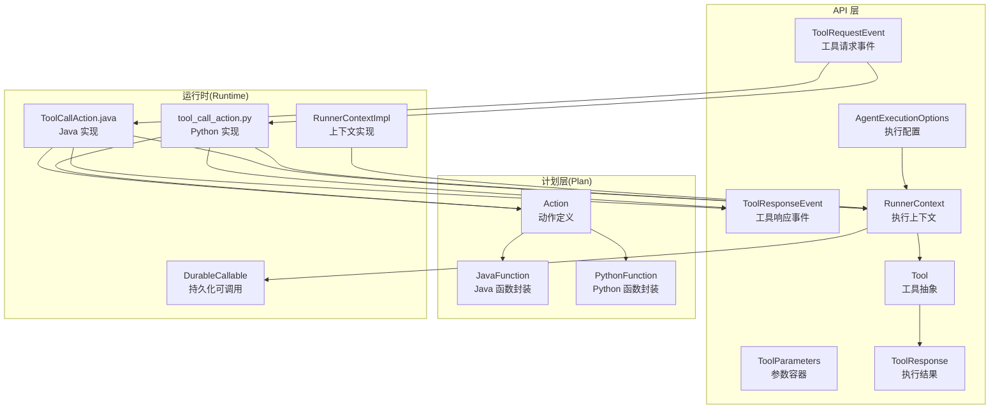
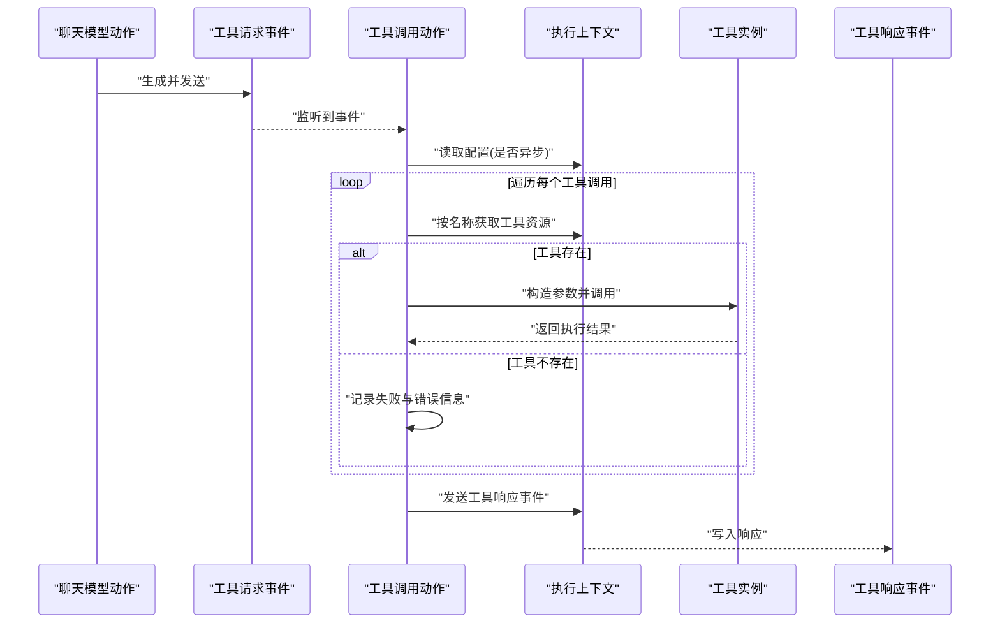
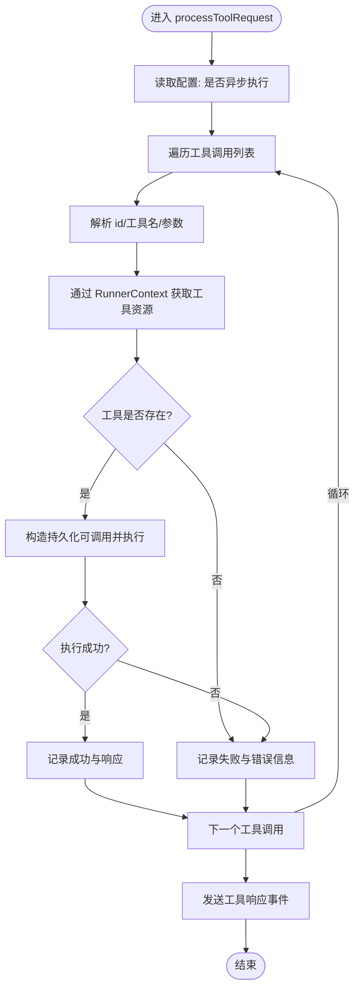
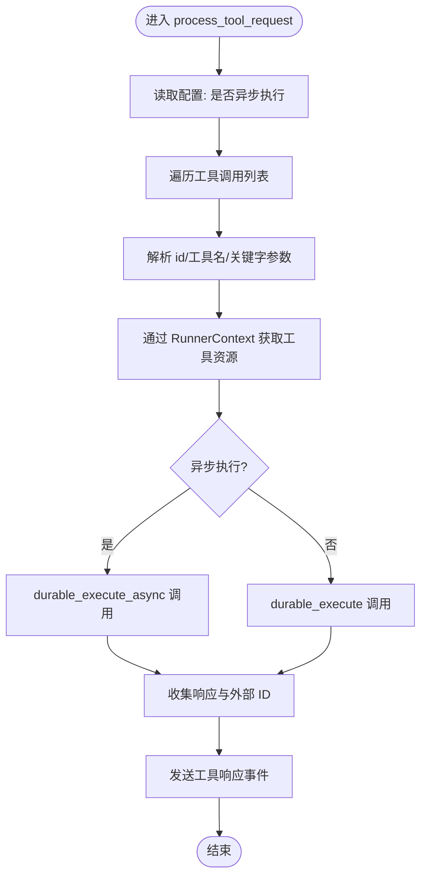
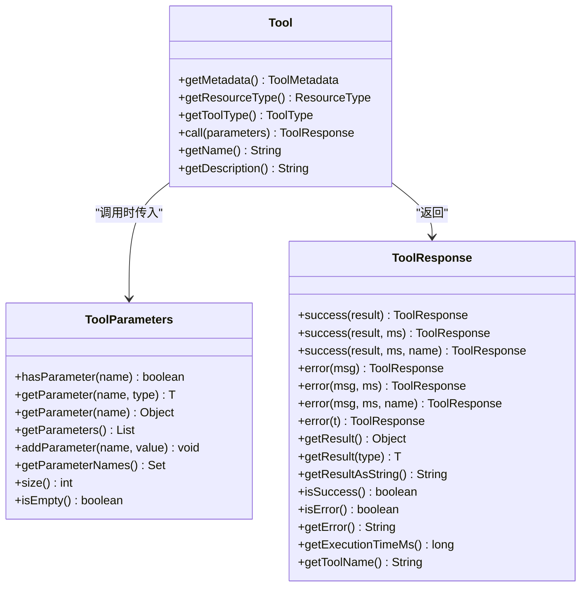
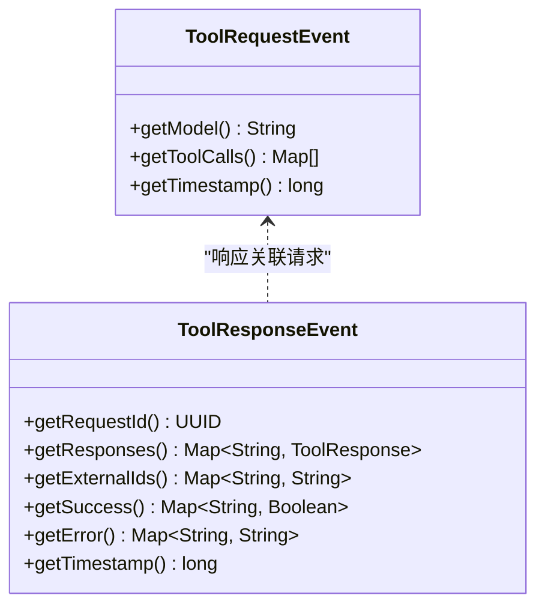
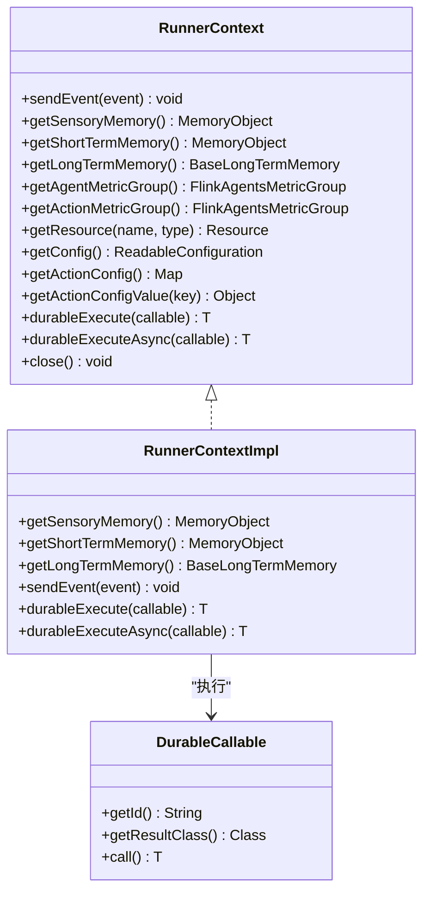
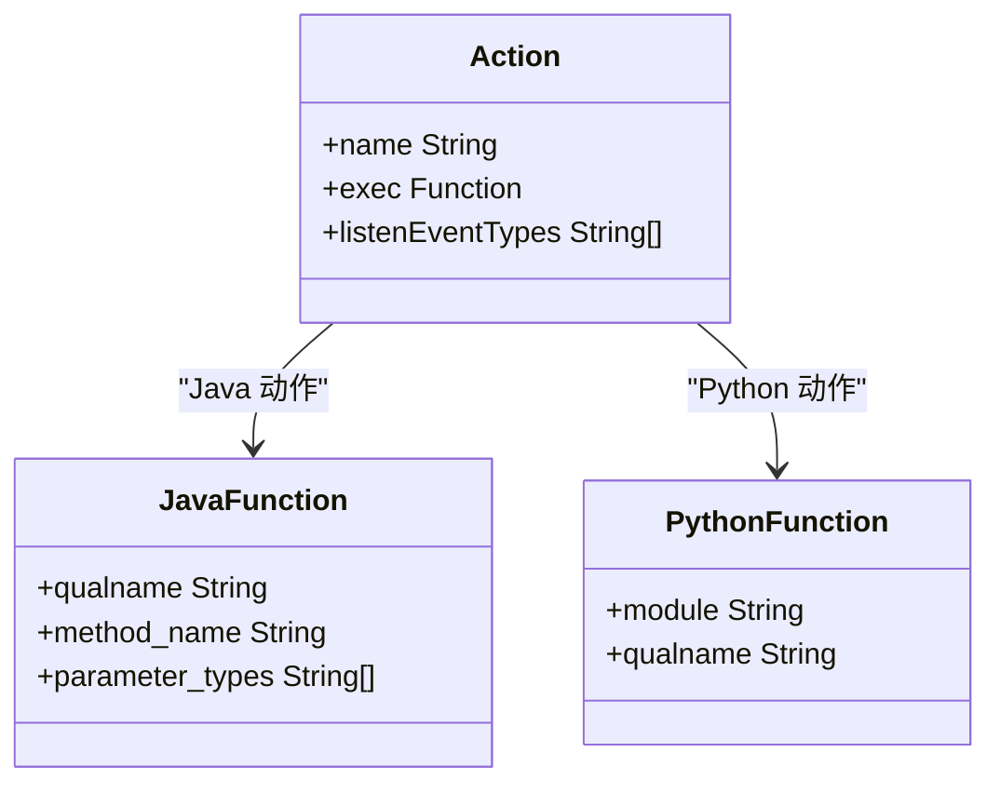
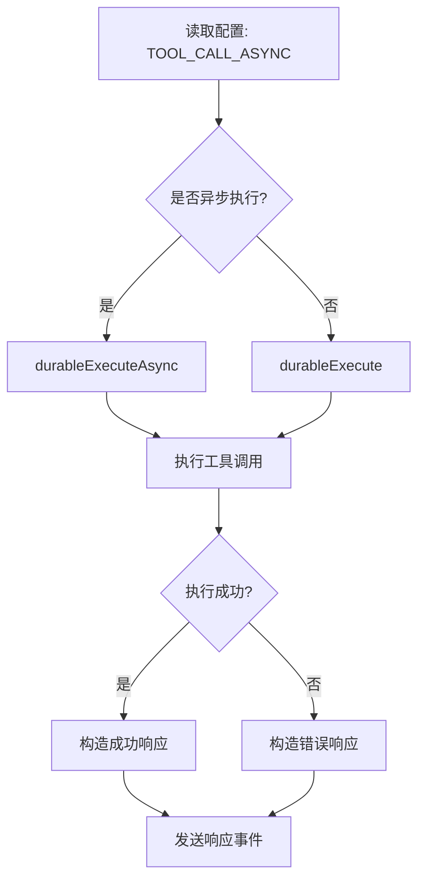
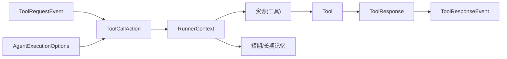

# 工具调用动作

<cite>
**本文引用的文件**
- [ToolCallAction.java](file://plan/src/main/java/org/apache/flink/agents/plan/actions/ToolCallAction.java)
- [tool_call_action.py](file://python/flink_agents/plan/actions/tool_call_action.py)
- [ToolRequestEvent.java](file://api/src/main/java/org/apache/flink/agents/api/event/ToolRequestEvent.java)
- [ToolResponseEvent.java](file://api/src/main/java/org/apache/flink/agents/api/event/ToolResponseEvent.java)
- [Tool.java](file://api/src/main/java/org/apache/flink/agents/api/tools/Tool.java)
- [ToolParameters.java](file://api/src/main/java/org/apache/flink/agents/api/tools/ToolParameters.java)
- [ToolResponse.java](file://api/src/main/java/org/apache/flink/agents/api/tools/ToolResponse.java)
- [RunnerContext.java](file://api/src/main/java/org/apache/flink/agents/api/context/RunnerContext.java)
- [AgentExecutionOptions.java](file://api/src/main/java/org/apache/flink/agents/api/agents/AgentExecutionOptions.java)
- [Action.java](file://plan/src/main/java/org/apache/flink/agents/plan/actions/Action.java)
- [JavaFunction.java](file://plan/src/main/java/org/apache/flink/agents/plan/JavaFunction.java)
- [PythonFunction.java](file://python/flink_agents/plan/actions/action.py)
- [DurableCallable.java](file://api/src/main/java/org/apache/flink/agents/api/context/DurableCallable.java)
- [ChatModelAction.java](file://plan/src/main/java/org/apache/flink/agents/plan/actions/ChatModelAction.java)
- [ActionExecutionOperatorTest.java](file://runtime/src/test/java/org/apache/flink/agents/runtime/operator/ActionExecutionOperatorTest.java)
- [RunnerContextImpl.java](file://runtime/src/main/java/org/apache/flink/agents/runtime/context/RunnerContextImpl.java)
- [MemoryRef.java](file://api/src/main/java/org/apache/flink/agents/api/context/MemoryRef.java)
- [AgentPlanDeclareToolMethodTest.java](file://plan/src/test/java/org/apache/flink/agents/plan/AgentPlanDeclareToolMethodTest.java)
- [AgentPlanDeclareToolFieldTest.java](file://plan/src/test/java/org/apache/flink/agents/plan/AgentPlanDeclareToolFieldTest.java)
- [action_java_function.json](file://plan/src/test/resources/actions/action_java_function.json)
- [action_python_function.json](file://plan/src/test/resources/actions/action_python_function.json)
</cite>

## 目录
1. [简介](#简介)
2. [项目结构](#项目结构)
3. [核心组件](#核心组件)
4. [架构总览](#架构总览)
5. [详细组件分析](#详细组件分析)
6. [依赖关系分析](#依赖关系分析)
7. [性能考量](#性能考量)
8. [故障排查指南](#故障排查指南)
9. [结论](#结论)
10. [附录](#附录)

## 简介
本文件面向 Apache Flink Agents 的“工具调用动作”（ToolCallAction），系统性阐述其设计原理、实现机制与运行流程。内容涵盖工具发现、参数传递与结果处理、配置选项、与工具注册系统的集成、与内存系统的交互、使用示例、错误处理与重试策略，以及性能优化建议。目标是帮助读者在不深入源码的前提下理解并正确使用该能力。

## 项目结构
工具调用动作由 Java 与 Python 双端实现，分别对应运行时的 Java 动作与 Python 动作。二者均监听工具请求事件，解析请求中的工具调用列表，通过 RunnerContext 获取工具资源并执行，最终发送工具响应事件。

图示来源
- [ToolCallAction.java](file://plan/src/main/java/org/apache/flink/agents/plan/actions/ToolCallAction.java#L35-L112)
- [tool_call_action.py](file://python/flink_agents/plan/actions/tool_call_action.py#L29-L65)
- [ToolRequestEvent.java](file://api/src/main/java/org/apache/flink/agents/api/event/ToolRequestEvent.java#L26-L62)
- [ToolResponseEvent.java](file://api/src/main/java/org/apache/flink/agents/api/event/ToolResponseEvent.java#L27-L94)
- [Tool.java](file://api/src/main/java/org/apache/flink/agents/api/tools/Tool.java#L26-L70)
- [ToolParameters.java](file://api/src/main/java/org/apache/flink/agents/api/tools/ToolParameters.java#L28-L123)
- [ToolResponse.java](file://api/src/main/java/org/apache/flink/agents/api/tools/ToolResponse.java#L23-L184)
- [RunnerContext.java](file://api/src/main/java/org/apache/flink/agents/api/context/RunnerContext.java#L29-L138)
- [AgentExecutionOptions.java](file://api/src/main/java/org/apache/flink/agents/api/agents/AgentExecutionOptions.java#L23-L47)
- [Action.java](file://plan/src/main/java/org/apache/flink/agents/plan/actions/Action.java)
- [JavaFunction.java](file://plan/src/main/java/org/apache/flink/agents/plan/JavaFunction.java)
- [PythonFunction.java](file://python/flink_agents/plan/actions/action.py)
- [DurableCallable.java](file://api/src/main/java/org/apache/flink/agents/api/context/DurableCallable.java)
- [RunnerContextImpl.java](file://runtime/src/main/java/org/apache/flink/agents/runtime/context/RunnerContextImpl.java#L60-L88)

章节来源
- [ToolCallAction.java](file://plan/src/main/java/org/apache/flink/agents/plan/actions/ToolCallAction.java#L35-L112)
- [tool_call_action.py](file://python/flink_agents/plan/actions/tool_call_action.py#L29-L65)

## 核心组件
- 工具请求事件：承载模型标识、工具调用列表与时间戳，用于触发工具调用动作。
- 工具响应事件：承载请求 ID、各工具调用的执行结果、成功标记、错误信息与外部 ID 映射。
- 工具抽象与参数：工具接口定义元数据与调用入口；参数容器支持类型安全与常见类型转换。
- 执行上下文：提供资源获取、内存访问、度量组、配置读取与持久化执行能力。
- 动作定义：统一的动作封装，绑定监听事件类型与执行函数（Java 或 Python）。
- 配置选项：控制工具调用是否异步执行等行为。

章节来源
- [ToolRequestEvent.java](file://api/src/main/java/org/apache/flink/agents/api/event/ToolRequestEvent.java#L26-L62)
- [ToolResponseEvent.java](file://api/src/main/java/org/apache/flink/agents/api/event/ToolResponseEvent.java#L27-L94)
- [Tool.java](file://api/src/main/java/org/apache/flink/agents/api/tools/Tool.java#L26-L70)
- [ToolParameters.java](file://api/src/main/java/org/apache/flink/agents/api/tools/ToolParameters.java#L28-L123)
- [ToolResponse.java](file://api/src/main/java/org/apache/flink/agents/api/tools/ToolResponse.java#L23-L184)
- [RunnerContext.java](file://api/src/main/java/org/apache/flink/agents/api/context/RunnerContext.java#L29-L138)
- [Action.java](file://plan/src/main/java/org/apache/flink/agents/plan/actions/Action.java)
- [AgentExecutionOptions.java](file://api/src/main/java/org/apache/flink/agents/api/agents/AgentExecutionOptions.java#L23-L47)

## 架构总览
工具调用动作的执行链路如下：聊天模型动作或上游逻辑产生工具请求事件；工具调用动作监听该事件，逐条解析工具调用，通过 RunnerContext 获取工具资源并执行；根据配置选择同步或异步执行；收集每个工具调用的结果、成功标记与错误信息，并发送工具响应事件。

图示来源
- [ToolCallAction.java](file://plan/src/main/java/org/apache/flink/agents/plan/actions/ToolCallAction.java#L48-L111)
- [tool_call_action.py](file://python/flink_agents/plan/actions/tool_call_action.py#L29-L58)
- [ToolRequestEvent.java](file://api/src/main/java/org/apache/flink/agents/api/event/ToolRequestEvent.java#L26-L62)
- [ToolResponseEvent.java](file://api/src/main/java/org/apache/flink/agents/api/event/ToolResponseEvent.java#L27-L94)
- [RunnerContext.java](file://api/src/main/java/org/apache/flink/agents/api/context/RunnerContext.java#L89-L133)

## 详细组件分析

### 工具调用动作（Java）
- 动作注册：通过工厂方法创建动作，指定动作名、执行函数与监听事件类型。
- 请求处理：读取配置决定是否异步执行；遍历工具调用列表，解析 id、工具名与参数；尝试通过 RunnerContext 获取工具资源；构造持久化可调用对象执行工具调用；汇总成功标记、错误信息与响应；发送工具响应事件。
- 异常处理：工具不存在或执行异常时，构造错误响应并记录错误消息；最终统一发送响应事件。

图示来源
- [ToolCallAction.java](file://plan/src/main/java/org/apache/flink/agents/plan/actions/ToolCallAction.java#L37-L111)
- [RunnerContext.java](file://api/src/main/java/org/apache/flink/agents/api/context/RunnerContext.java#L89-L133)
- [DurableCallable.java](file://api/src/main/java/org/apache/flink/agents/api/context/DurableCallable.java)

章节来源
- [ToolCallAction.java](file://plan/src/main/java/org/apache/flink/agents/plan/actions/ToolCallAction.java#L37-L111)

### 工具调用动作（Python）
- 动作注册：定义 Python 函数作为执行器，注册为动作并声明监听工具请求事件类型。
- 请求处理：读取配置决定是否异步执行；遍历工具调用列表，解析 id、工具名与关键字参数；通过 RunnerContext 获取工具资源；调用工具的 call 方法；收集响应与外部 ID 并发送工具响应事件。

图示来源
- [tool_call_action.py](file://python/flink_agents/plan/actions/tool_call_action.py#L29-L65)
- [RunnerContext.java](file://api/src/main/java/org/apache/flink/agents/api/context/RunnerContext.java#L112-L133)

章节来源
- [tool_call_action.py](file://python/flink_agents/plan/actions/tool_call_action.py#L29-L65)

### 工具与参数
- 工具抽象：提供元数据、资源类型、工具类型与调用入口；工具名称与描述来自元数据。
- 参数容器：支持参数存在性检查、类型安全获取与常见类型转换；提供原始值获取与参数集合视图。
- 结果封装：成功与错误两种响应，支持带执行耗时与工具名的构造；提供类型安全的结果读取与字符串化。

图示来源
- [Tool.java](file://api/src/main/java/org/apache/flink/agents/api/tools/Tool.java#L26-L70)
- [ToolParameters.java](file://api/src/main/java/org/apache/flink/agents/api/tools/ToolParameters.java#L28-L123)
- [ToolResponse.java](file://api/src/main/java/org/apache/flink/agents/api/tools/ToolResponse.java#L23-L184)

章节来源
- [Tool.java](file://api/src/main/java/org/apache/flink/agents/api/tools/Tool.java#L26-L70)
- [ToolParameters.java](file://api/src/main/java/org/apache/flink/agents/api/tools/ToolParameters.java#L28-L123)
- [ToolResponse.java](file://api/src/main/java/org/apache/flink/agents/api/tools/ToolResponse.java#L23-L184)

### 事件模型
- 工具请求事件：包含模型标识、工具调用列表与时间戳。
- 工具响应事件：包含请求 ID、响应映射、成功标记、错误信息与外部 ID 映射。

图示来源
- [ToolRequestEvent.java](file://api/src/main/java/org/apache/flink/agents/api/event/ToolRequestEvent.java#L26-L62)
- [ToolResponseEvent.java](file://api/src/main/java/org/apache/flink/agents/api/event/ToolResponseEvent.java#L27-L94)

章节来源
- [ToolRequestEvent.java](file://api/src/main/java/org/apache/flink/agents/api/event/ToolRequestEvent.java#L26-L62)
- [ToolResponseEvent.java](file://api/src/main/java/org/apache/flink/agents/api/event/ToolResponseEvent.java#L27-L94)

### 执行上下文与持久化执行
- 上下文职责：发送事件、访问短期/长期记忆、获取度量组、读取配置、获取资源、执行持久化同步/异步任务。
- 持久化可调用：在作业恢复时可重放，结果缓存以避免重复执行；在 JDK 21+ 使用协程续体实现异步挂起与恢复。
- 上下文实现：维护短期与感官记忆存储、更新队列与缓存，保证执行一致性。

图示来源
- [RunnerContext.java](file://api/src/main/java/org/apache/flink/agents/api/context/RunnerContext.java#L29-L138)
- [DurableCallable.java](file://api/src/main/java/org/apache/flink/agents/api/context/DurableCallable.java)
- [RunnerContextImpl.java](file://runtime/src/main/java/org/apache/flink/agents/runtime/context/RunnerContextImpl.java#L60-L88)

章节来源
- [RunnerContext.java](file://api/src/main/java/org/apache/flink/agents/api/context/RunnerContext.java#L29-L138)
- [RunnerContextImpl.java](file://runtime/src/main/java/org/apache/flink/agents/runtime/context/RunnerContextImpl.java#L60-L88)

### 动作定义与函数封装
- 动作：统一的动作定义，声明动作名、执行函数与监听事件类型。
- Java 函数封装：将静态方法包装为可序列化的 JavaFunction。
- Python 函数封装：将 Python 可调用对象包装为 PythonFunction。

图示来源
- [Action.java](file://plan/src/main/java/org/apache/flink/agents/plan/actions/Action.java)
- [JavaFunction.java](file://plan/src/main/java/org/apache/flink/agents/plan/JavaFunction.java)
- [PythonFunction.java](file://python/flink_agents/plan/actions/action.py)

章节来源
- [Action.java](file://plan/src/main/java/org/apache/flink/agents/plan/actions/Action.java)
- [JavaFunction.java](file://plan/src/main/java/org/apache/flink/agents/plan/JavaFunction.java)
- [PythonFunction.java](file://python/flink_agents/plan/actions/action.py)

### 配置选项与重试策略
- 工具调用异步开关：控制工具调用是否采用异步持久化执行。
- 错误处理策略与重试：聊天模型动作展示了统一的重试与忽略策略，工具调用动作遵循类似的错误处理原则（捕获异常并生成错误响应）。

图示来源
- [AgentExecutionOptions.java](file://api/src/main/java/org/apache/flink/agents/api/agents/AgentExecutionOptions.java#L42-L43)
- [ToolCallAction.java](file://plan/src/main/java/org/apache/flink/agents/plan/actions/ToolCallAction.java#L49-L99)
- [tool_call_action.py](file://python/flink_agents/plan/actions/tool_call_action.py#L31-L51)
- [ChatModelAction.java](file://plan/src/main/java/org/apache/flink/agents/plan/actions/ChatModelAction.java#L236-L270)

章节来源
- [AgentExecutionOptions.java](file://api/src/main/java/org/apache/flink/agents/api/agents/AgentExecutionOptions.java#L42-L43)
- [ChatModelAction.java](file://plan/src/main/java/org/apache/flink/agents/plan/actions/ChatModelAction.java#L236-L270)

## 依赖关系分析
- 动作与事件：工具调用动作监听工具请求事件，发送工具响应事件。
- 工具注册系统：通过 RunnerContext 的资源获取接口按名称与类型检索工具实例。
- 内存系统：通过 RunnerContext 访问短期/长期记忆，用于状态管理与上下文传递。
- 执行环境：Java 与 Python 双端实现共享同一事件契约与配置约定。

图示来源
- [ToolCallAction.java](file://plan/src/main/java/org/apache/flink/agents/plan/actions/ToolCallAction.java#L48-L111)
- [tool_call_action.py](file://python/flink_agents/plan/actions/tool_call_action.py#L29-L65)
- [RunnerContext.java](file://api/src/main/java/org/apache/flink/agents/api/context/RunnerContext.java#L89-L133)
- [AgentExecutionOptions.java](file://api/src/main/java/org/apache/flink/agents/api/agents/AgentExecutionOptions.java#L42-L43)

章节来源
- [ToolCallAction.java](file://plan/src/main/java/org/apache/flink/agents/plan/actions/ToolCallAction.java#L48-L111)
- [tool_call_action.py](file://python/flink_agents/plan/actions/tool_call_action.py#L29-L65)
- [RunnerContext.java](file://api/src/main/java/org/apache/flink/agents/api/context/RunnerContext.java#L89-L133)

## 性能考量
- 异步执行：通过配置开启工具调用异步执行，减少阻塞，提升吞吐；在 JDK 21+ 利用协程续体实现高效挂起与恢复。
- 持久化执行：利用持久化可调用确保作业恢复时不重复执行已完成的工作。
- 类型转换与参数校验：在工具参数容器中进行常见类型转换与存在性检查，减少工具内部重复校验开销。
- 度量与日志：通过度量组与日志记录执行耗时与错误，便于性能分析与问题定位。

章节来源
- [AgentExecutionOptions.java](file://api/src/main/java/org/apache/flink/agents/api/agents/AgentExecutionOptions.java#L33-L43)
- [RunnerContext.java](file://api/src/main/java/org/apache/flink/agents/api/context/RunnerContext.java#L122-L133)
- [ToolParameters.java](file://api/src/main/java/org/apache/flink/agents/api/tools/ToolParameters.java#L92-L116)

## 故障排查指南
- 工具不存在：当通过名称无法获取工具资源时，动作会记录失败与错误信息，并发送错误响应事件。
- 工具执行异常：捕获异常并构造错误响应，保留原始错误消息以便诊断。
- 异常重试：聊天模型动作展示了统一的重试与忽略策略，工具调用动作遵循类似的错误处理原则。
- 恢复一致性：持久化可调用在作业恢复时不会重复执行，确保一致性。

章节来源
- [ToolCallAction.java](file://plan/src/main/java/org/apache/flink/agents/plan/actions/ToolCallAction.java#L65-L107)
- [tool_call_action.py](file://python/flink_agents/plan/actions/tool_call_action.py#L43-L53)
- [ChatModelAction.java](file://plan/src/main/java/org/apache/flink/agents/plan/actions/ChatModelAction.java#L236-L270)
- [ActionExecutionOperatorTest.java](file://runtime/src/test/java/org/apache/flink/agents/runtime/operator/ActionExecutionOperatorTest.java#L1383-L1390)

## 结论
工具调用动作通过统一的事件契约与配置约定，实现了跨语言（Java/Python）的一致工具调用体验。它在工具发现、参数传递、结果处理、错误处理与持久化执行方面提供了清晰的边界与扩展点，能够满足复杂场景下的工具编排需求。

## 附录

### 使用示例与参数配置
- Java 动作定义示例：参考动作 JSON 描述，声明执行函数与监听事件类型。
- Python 动作定义示例：参考动作 JSON 描述，声明 Python 可调用与监听事件类型。
- 工具调用示例：通过工具请求事件携带工具调用列表，动作解析后逐一执行并返回工具响应事件。

章节来源
- [action_java_function.json](file://plan/src/test/resources/actions/action_java_function.json#L1-L10)
- [action_python_function.json](file://plan/src/test/resources/actions/action_python_function.json#L1-L9)
- [ToolRequestEvent.java](file://api/src/main/java/org/apache/flink/agents/api/event/ToolRequestEvent.java#L26-L62)
- [ToolResponseEvent.java](file://api/src/main/java/org/apache/flink/agents/api/event/ToolResponseEvent.java#L27-L94)

### 工具元数据与参数验证
- 元数据与输入模式：工具元数据包含名称、描述与输入模式；参数容器支持类型安全与常见类型转换。
- 测试用例：演示了工具元数据的序列化、参数转换与错误处理。

章节来源
- [Tool.java](file://api/src/main/java/org/apache/flink/agents/api/tools/Tool.java#L38-L63)
- [ToolParameters.java](file://api/src/main/java/org/apache/flink/agents/api/tools/ToolParameters.java#L46-L116)
- [AgentPlanDeclareToolMethodTest.java](file://plan/src/test/java/org/apache/flink/agents/plan/AgentPlanDeclareToolMethodTest.java#L107-L225)
- [AgentPlanDeclareToolFieldTest.java](file://plan/src/test/java/org/apache/flink/agents/plan/AgentPlanDeclareToolFieldTest.java#L148-L203)