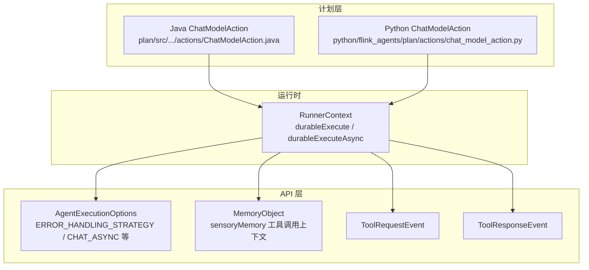
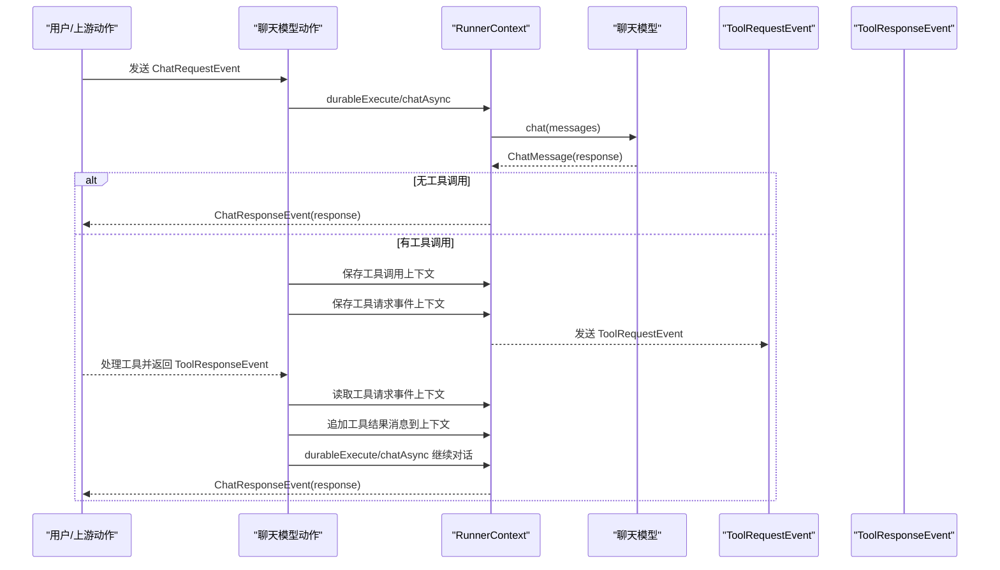
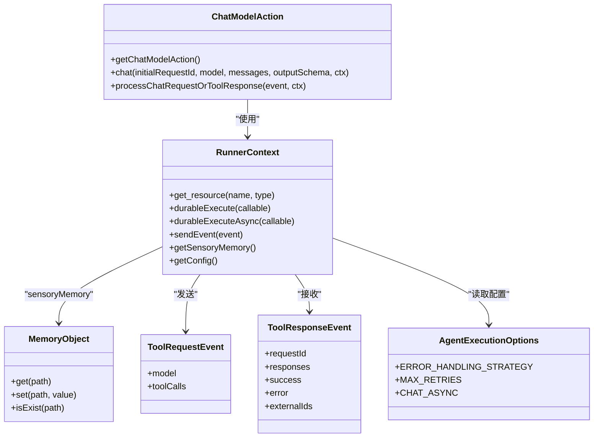

# 聊天模型动作

<cite>
**本文引用的文件**
- [ChatModelAction.java](file://plan/src/main/java/org/apache/flink/agents/plan/actions/ChatModelAction.java)
- [chat_model_action.py](file://python/flink_agents/plan/actions/chat_model_action.py)
- [AgentExecutionOptions.java](file://api/src/main/java/org/apache/flink/agents/api/agents/AgentExecutionOptions.java)
- [MemoryObject.java](file://api/src/main/java/org/apache/flink/agents/api/context/MemoryObject.java)
- [ToolRequestEvent.java](file://api/src/main/java/org/apache/flink/agents/api/event/ToolRequestEvent.java)
- [ToolResponseEvent.java](file://api/src/main/java/org/apache/flink/agents/api/event/ToolResponseEvent.java)
- [ChatModelIntegrationTest.java](file://e2e-test/flink-agents-end-to-end-tests-integration/src/test/java/org/apache/flink/agents/integration/test/ChatModelIntegrationTest.java)
- [AgentPlanDeclareChatModelTest.java](file://plan/src/test/java/org/apache/flink/agents/plan/AgentPlanDeclareChatModelTest.java)
- [react_agent.py](file://python/flink_agents/api/agents/react_agent.py)
- [ReActAgent.java](file://api/src/main/java/org/apache/flink/agents/api/agents/ReActAgent.java)
</cite>

## 目录
1. [简介](#简介)
2. [项目结构](#项目结构)
3. [核心组件](#核心组件)
4. [架构总览](#架构总览)
5. [组件详解](#组件详解)
6. [依赖关系分析](#依赖关系分析)
7. [性能考量](#性能考量)
8. [故障排查指南](#故障排查指南)
9. [结论](#结论)
10. [附录：使用示例与最佳实践](#附录使用示例与最佳实践)

## 简介
本文件面向 Apache Flink Agents 的“聊天模型动作”（ChatModelAction），系统性阐述其在聊天请求处理、工具调用检测与响应生成、结构化输出生成、内存系统交互与请求ID管理等方面的实现机制，并提供配置参数说明、使用示例与性能优化建议。目标读者既包括需要快速上手的使用者，也包括希望深入理解实现细节的工程师。

## 项目结构
聊天模型动作由 Java 与 Python 两套实现构成，分别位于：
- Java 计划层：plan/src/main/java/.../actions/ChatModelAction.java
- Python 计划层：python/flink_agents/plan/actions/chat_model_action.py

两者均通过 RunnerContext 获取资源、发送事件、持久化执行与错误处理策略，并共享相同的事件契约（ChatRequestEvent、ToolRequestEvent、ToolResponseEvent、ChatResponseEvent）。

图表来源
- [ChatModelAction.java](file://plan/src/main/java/org/apache/flink/agents/plan/actions/ChatModelAction.java#L63-L71)
- [chat_model_action.py](file://python/flink_agents/plan/actions/chat_model_action.py#L302-L310)
- [AgentExecutionOptions.java](file://api/src/main/java/org/apache/flink/agents/api/agents/AgentExecutionOptions.java#L24-L47)
- [MemoryObject.java](file://api/src/main/java/org/apache/flink/agents/api/context/MemoryObject.java#L29-L131)
- [ToolRequestEvent.java](file://api/src/main/java/org/apache/flink/agents/api/event/ToolRequestEvent.java#L27-L44)
- [ToolResponseEvent.java](file://api/src/main/java/org/apache/flink/agents/api/event/ToolResponseEvent.java#L28-L76)

章节来源
- [ChatModelAction.java](file://plan/src/main/java/org/apache/flink/agents/plan/actions/ChatModelAction.java#L1-L352)
- [chat_model_action.py](file://python/flink_agents/plan/actions/chat_model_action.py#L1-L310)

## 核心组件
- 聊天模型动作（Java/Python 双实现）
  - 监听 ChatRequestEvent 与 ToolResponseEvent
  - 调用聊天模型并处理工具调用链路
  - 生成结构化输出（当配置了输出模式且无工具调用时）
- 内存系统（MemoryObject）
  - 存储工具调用上下文（按初始请求ID分组）
  - 存储工具请求事件上下文（映射 ToolRequestEvent 到初始请求ID、模型名、输出模式）
- 错误处理与重试策略
  - 通过 AgentExecutionOptions 配置错误处理策略与最大重试次数
  - 支持同步/异步聊天调用（Java 中对 Python 模型有特殊限制）

章节来源
- [ChatModelAction.java](file://plan/src/main/java/org/apache/flink/agents/plan/actions/ChatModelAction.java#L51-L71)
- [chat_model_action.py](file://python/flink_agents/plan/actions/chat_model_action.py#L302-L310)
- [MemoryObject.java](file://api/src/main/java/org/apache/flink/agents/api/context/MemoryObject.java#L29-L131)
- [AgentExecutionOptions.java](file://api/src/main/java/org/apache/flink/agents/api/agents/AgentExecutionOptions.java#L24-L47)

## 架构总览
聊天模型动作的控制流分为两条主线：
- 主线一：从 ChatRequestEvent 开始，调用聊天模型；若无工具调用则直接返回 ChatResponseEvent；若有工具调用，则生成 ToolRequestEvent 并保存上下文，等待后续 ToolResponseEvent 回馈后再继续对话。
- 主线二：收到 ToolResponseEvent 后，读取上下文，构造工具结果消息，追加到工具调用上下文中，再次调用聊天模型，直至无工具调用为止。

图表来源
- [ChatModelAction.java](file://plan/src/main/java/org/apache/flink/agents/plan/actions/ChatModelAction.java#L191-L277)
- [chat_model_action.py](file://python/flink_agents/plan/actions/chat_model_action.py#L164-L234)
- [ToolRequestEvent.java](file://api/src/main/java/org/apache/flink/agents/api/event/ToolRequestEvent.java#L27-L44)
- [ToolResponseEvent.java](file://api/src/main/java/org/apache/flink/agents/api/event/ToolResponseEvent.java#L28-L76)

## 组件详解

### 聊天模型动作（Java 实现）
- 动作注册
  - 通过 Action 包装 JavaFunction，监听 ChatRequestEvent 与 ToolResponseEvent
- 工具调用上下文管理
  - 使用 MemoryObject 的 sensoreMemory 存储 Map<initialRequestId, List<ChatMessage>>
  - 支持初始化、追加消息、覆盖更新
- 工具请求事件上下文
  - 存储 ToolRequestEvent.id -> {initialRequestId, model, outputSchema}
  - 用于 ToolResponseEvent 回馈后恢复初始请求上下文
- 工具调用处理
  - 若响应包含工具调用：更新上下文、生成 ToolRequestEvent、发送事件并保存上下文
- 结构化输出生成
  - 当 outputSchema 非空且响应无工具调用时，将字符串内容反序列化为指定类型（类或 RowTypeInfo），并写入 ChatMessage 的 extraArgs 中
- 错误处理与重试
  - 依据 AgentExecutionOptions 的策略进行 IGNORE/RETRY/FAIL
  - 支持同步与异步执行（Java 对 Python 模型有异步限制）

章节来源
- [ChatModelAction.java](file://plan/src/main/java/org/apache/flink/agents/plan/actions/ChatModelAction.java#L63-L71)
- [ChatModelAction.java](file://plan/src/main/java/org/apache/flink/agents/plan/actions/ChatModelAction.java#L74-L130)
- [ChatModelAction.java](file://plan/src/main/java/org/apache/flink/agents/plan/actions/ChatModelAction.java#L132-L156)
- [ChatModelAction.java](file://plan/src/main/java/org/apache/flink/agents/plan/actions/ChatModelAction.java#L158-L179)
- [ChatModelAction.java](file://plan/src/main/java/org/apache/flink/agents/plan/actions/ChatModelAction.java#L191-L277)
- [ChatModelAction.java](file://plan/src/main/java/org/apache/flink/agents/plan/actions/ChatModelAction.java#L279-L350)

### 聊天模型动作（Python 实现）
- 功能等价于 Java 实现，差异点：
  - 异步 chat 调用（durable_execute_async），并记录 token 指标
  - 对 Pydantic BaseModel 与 RowTypeInfo 的结构化输出生成
  - 使用 _TOOL_CALL_CONTEXT 与 _TOOL_REQUEST_EVENT_CONTEXT 作为键名
- 工具调用上下文与请求事件上下文的读写逻辑一致

章节来源
- [chat_model_action.py](file://python/flink_agents/plan/actions/chat_model_action.py#L57-L111)
- [chat_model_action.py](file://python/flink_agents/plan/actions/chat_model_action.py#L114-L142)
- [chat_model_action.py](file://python/flink_agents/plan/actions/chat_model_action.py#L144-L161)
- [chat_model_action.py](file://python/flink_agents/plan/actions/chat_model_action.py#L164-L234)
- [chat_model_action.py](file://python/flink_agents/plan/actions/chat_model_action.py#L248-L282)
- [chat_model_action.py](file://python/flink_agents/plan/actions/chat_model_action.py#L285-L309)

### 内存系统与请求ID管理
- 工具调用上下文
  - 键：initialRequestId（UUID）
  - 值：该请求的完整消息历史（含工具调用响应）
- 工具请求事件上下文
  - 键：ToolRequestEvent.id（UUID）
  - 值：{initialRequestId, model, outputSchema}
- 请求ID管理
  - 初始请求ID与工具请求ID分离，确保多轮工具调用的上下文可恢复

章节来源
- [ChatModelAction.java](file://plan/src/main/java/org/apache/flink/agents/plan/actions/ChatModelAction.java#L55-L57)
- [ChatModelAction.java](file://plan/src/main/java/org/apache/flink/agents/plan/actions/ChatModelAction.java#L100-L130)
- [chat_model_action.py](file://python/flink_agents/plan/actions/chat_model_action.py#L48-L49)
- [chat_model_action.py](file://python/flink_agents/plan/actions/chat_model_action.py#L88-L111)

### 结构化输出生成
- 类型支持
  - Java：类类型（Class）或 OutputSchema（内部持有 RowTypeInfo）
  - Python：Pydantic BaseModel 或 RowTypeInfo
- 解析与转换
  - 将响应字符串解析为 Map/对象
  - Java：逐字段填充 Row
  - Python：Pydantic 校验或 Row 构造
- 安全性
  - 仅在无工具调用时生成结构化输出
  - 不支持的 schema 类型会抛出异常

章节来源
- [ChatModelAction.java](file://plan/src/main/java/org/apache/flink/agents/plan/actions/ChatModelAction.java#L158-L179)
- [chat_model_action.py](file://python/flink_agents/plan/actions/chat_model_action.py#L144-L161)

### 错误处理与重试策略
- 策略
  - FAIL：默认，失败即抛出异常
  - RETRY：根据 MAX_RETRIES 重试
  - IGNORE：忽略错误并返回
- 异步限制
  - Java 中对 Python 聊天模型不支持异步执行（存在已知问题链接）

章节来源
- [AgentExecutionOptions.java](file://api/src/main/java/org/apache/flink/agents/api/agents/AgentExecutionOptions.java#L24-L47)
- [ChatModelAction.java](file://plan/src/main/java/org/apache/flink/agents/plan/actions/ChatModelAction.java#L206-L214)
- [chat_model_action.py](file://python/flink_agents/plan/actions/chat_model_action.py#L181-L184)

## 依赖关系分析

图表来源
- [ChatModelAction.java](file://plan/src/main/java/org/apache/flink/agents/plan/actions/ChatModelAction.java#L63-L71)
- [AgentExecutionOptions.java](file://api/src/main/java/org/apache/flink/agents/api/agents/AgentExecutionOptions.java#L24-L47)
- [MemoryObject.java](file://api/src/main/java/org/apache/flink/agents/api/context/MemoryObject.java#L29-L131)
- [ToolRequestEvent.java](file://api/src/main/java/org/apache/flink/agents/api/event/ToolRequestEvent.java#L27-L44)
- [ToolResponseEvent.java](file://api/src/main/java/org/apache/flink/agents/api/event/ToolResponseEvent.java#L28-L76)

## 性能考量
- 异步执行
  - 在支持的模型上启用 chat.async 可提升吞吐；Java 对 Python 模型有异步限制
- 重试策略
  - 合理设置 MAX_RETRIES 与 ERROR_HANDLING_STRATEGY，避免过度重试导致延迟放大
- 上下文写放大
  - 当前实现以整表写入工具调用上下文，可能带来读写放大；建议在内存能力增强后改为按请求ID直接存取
- 结构化输出
  - 仅在无工具调用时生成，减少不必要的解析开销

章节来源
- [chat_model_action.py](file://python/flink_agents/plan/actions/chat_model_action.py#L68-L74)
- [AgentExecutionOptions.java](file://api/src/main/java/org/apache/flink/agents/api/agents/AgentExecutionOptions.java#L39-L41)

## 故障排查指南
- 常见问题
  - 工具调用未触发：检查响应是否包含工具调用；确认 ToolRequestEvent 是否被下游动作正确消费并回发 ToolResponseEvent
  - 结构化输出失败：确认 outputSchema 类型与响应格式匹配；仅在无工具调用时生成
  - 异常重试过多：调整 MAX_RETRIES 与策略；必要时切换 IGNORE
  - Java 模型异步异常：当前 Java 对 Python 模型不支持异步，需禁用 chat.async
- 排查步骤
  - 查看 RunnerContext 日志与事件流转
  - 核对 MemoryObject 中工具调用上下文是否正确更新
  - 验证 ToolRequestEvent/ToolResponseEvent 字段完整性

章节来源
- [ChatModelAction.java](file://plan/src/main/java/org/apache/flink/agents/plan/actions/ChatModelAction.java#L206-L214)
- [chat_model_action.py](file://python/flink_agents/plan/actions/chat_model_action.py#L181-L184)
- [chat_model_action.py](file://python/flink_agents/plan/actions/chat_model_action.py#L204-L220)

## 结论
聊天模型动作提供了完整的聊天与工具调用闭环：从请求到响应、从工具调用到结果回传，均通过事件与内存上下文实现解耦与可恢复。结合结构化输出与可配置的错误处理策略，能够满足复杂业务场景下的稳定与高性能需求。未来可在内存能力增强后进一步优化工具调用上下文的读写路径，降低写放大风险。

## 附录：使用示例与最佳实践

### 配置参数说明
- 错误处理策略（AgentExecutionOptions.ERROR_HANDLING_STRATEGY）
  - FAIL：默认，失败即抛出异常
  - RETRY：根据 MAX_RETRIES 重试
  - IGNORE：忽略错误并返回
- 最大重试次数（AgentExecutionOptions.MAX_RETRIES）
- 聊天异步开关（AgentExecutionOptions.CHAT_ASYNC）
- 工具调用异步开关（AgentExecutionOptions.TOOL_CALL_ASYNC）
- RAG 异步开关（AgentExecutionOptions.RAG_ASYNC）

章节来源
- [AgentExecutionOptions.java](file://api/src/main/java/org/apache/flink/agents/api/agents/AgentExecutionOptions.java#L24-L47)

### 场景示例与调用方法
- 基础聊天（无工具调用）
  - 发送 ChatRequestEvent，等待 ChatResponseEvent
- 工具调用聊天
  - 发送 ChatRequestEvent，收到 ToolRequestEvent 后执行工具，回发 ToolResponseEvent，动作自动继续对话直到无工具调用
- 结构化输出
  - 在 ChatRequestEvent 中提供 output_schema（Java：OutputSchema；Python：RowTypeInfo 或 Pydantic BaseModel），在无工具调用时生成结构化输出

章节来源
- [ChatModelIntegrationTest.java](file://e2e-test/flink-agents-end-to-end-tests-integration/src/test/java/org/apache/flink/agents/integration/test/ChatModelIntegrationTest.java#L55-L102)
- [AgentPlanDeclareChatModelTest.java](file://plan/src/test/java/org/apache/flink/agents/plan/AgentPlanDeclareChatModelTest.java#L73-L89)
- [react_agent.py](file://python/flink_agents/api/agents/react_agent.py#L190-L211)
- [ReActAgent.java](file://api/src/main/java/org/apache/flink/agents/api/agents/ReActAgent.java#L164-L181)

### 与内存系统的交互要点
- 工具调用上下文键：_TOOL_CALL_CONTEXT
- 工具请求事件上下文键：_TOOL_REQUEST_EVENT_CONTEXT
- 请求ID管理：初始请求ID与工具请求ID分离，确保多轮工具调用可恢复

章节来源
- [ChatModelAction.java](file://plan/src/main/java/org/apache/flink/agents/plan/actions/ChatModelAction.java#L55-L57)
- [chat_model_action.py](file://python/flink_agents/plan/actions/chat_model_action.py#L48-L49)

### 性能优化建议
- 合理开启 chat.async（注意 Java 对 Python 模型的限制）
- 控制 MAX_RETRIES，避免频繁重试
- 减少不必要的结构化输出生成（仅在无工具调用时）
- 未来优化工具调用上下文存储方式，降低写放大

章节来源
- [chat_model_action.py](file://python/flink_agents/plan/actions/chat_model_action.py#L68-L74)
- [AgentExecutionOptions.java](file://api/src/main/java/org/apache/flink/agents/api/agents/AgentExecutionOptions.java#L39-L41)