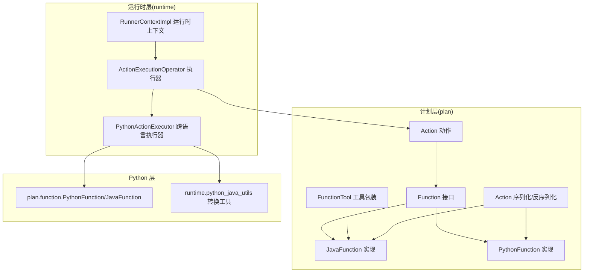
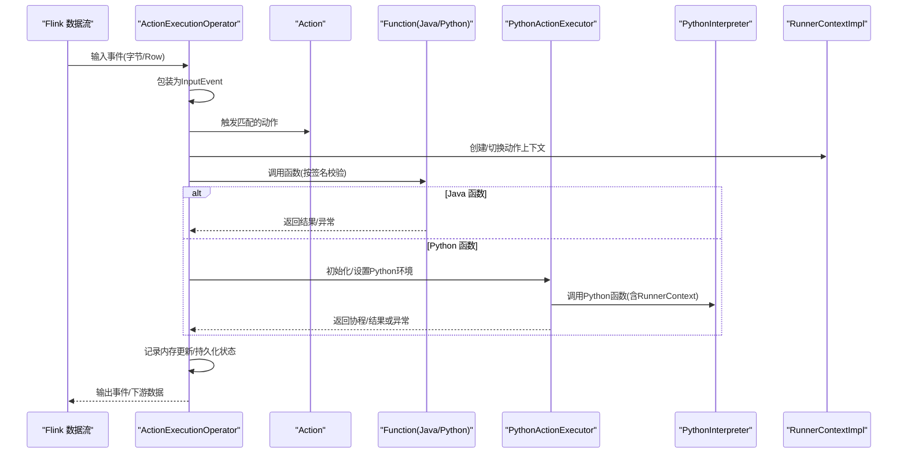
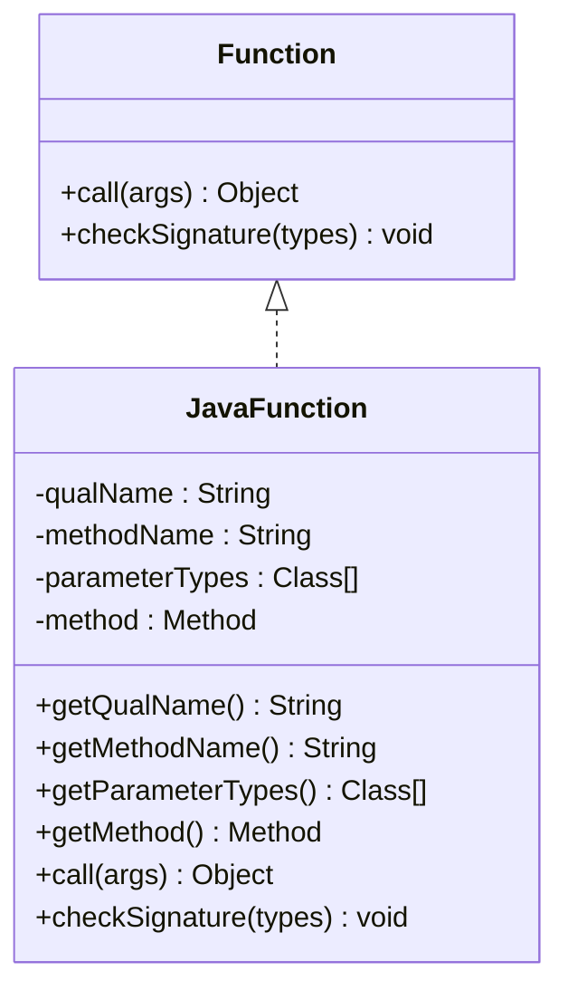
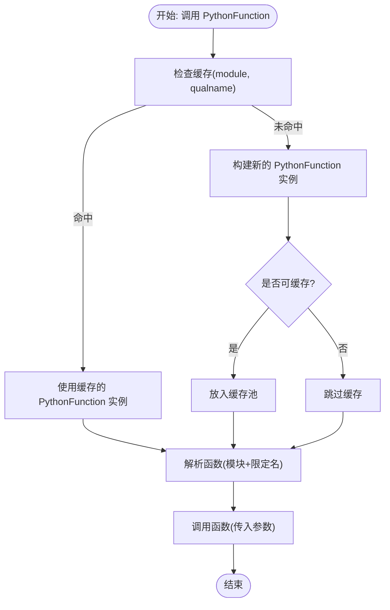
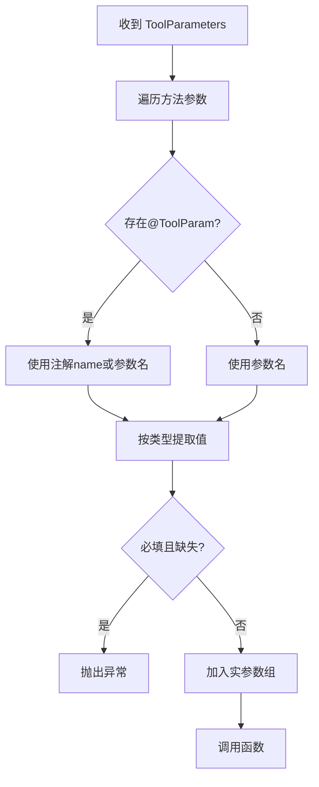
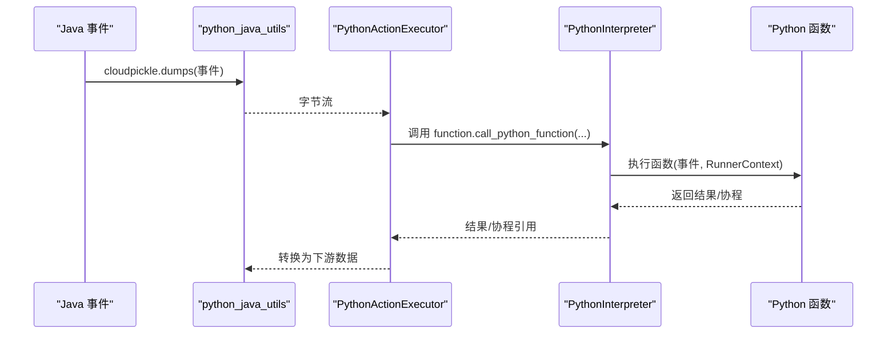
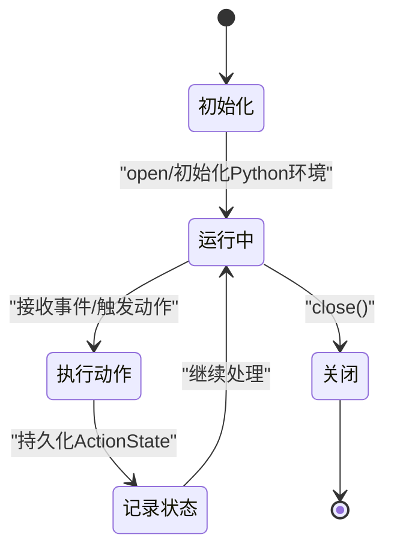
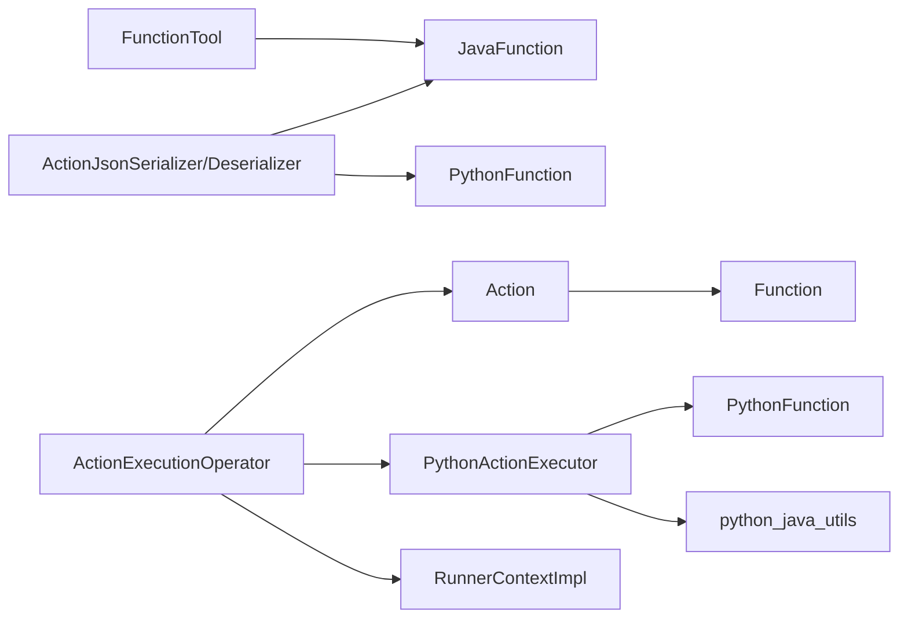

# 函数动作实现

<cite>
**本文引用的文件列表**
- [Function.java](file://plan/src/main/java/org/apache/flink/agents/plan/Function.java)
- [JavaFunction.java](file://plan/src/main/java/org/apache/flink/agents/plan/JavaFunction.java)
- [PythonFunction.java](file://plan/src/main/java/org/apache/flink/agents/plan/PythonFunction.java)
- [Action.java](file://plan/src/main/java/org/apache/flink/agents/plan/actions/Action.java)
- [FunctionTool.java](file://plan/src/main/java/org/apache/flink/agents/plan/tools/FunctionTool.java)
- [ActionExecutionOperator.java](file://runtime/src/main/java/org/apache/flink/agents/runtime/operator/ActionExecutionOperator.java)
- [PythonActionExecutor.java](file://runtime/src/main/java/org/apache/flink/agents/runtime/python/utils/PythonActionExecutor.java)
- [ActionJsonSerializer.java](file://plan/src/main/java/org/apache/flink/agents/plan/serializer/ActionJsonSerializer.java)
- [ActionJsonDeserializer.java](file://plan/src/main/java/org/apache/flink/agents/plan/serializer/ActionJsonDeserializer.java)
- [RunnerContextImpl.java](file://runtime/src/main/java/org/apache/flink/agents/runtime/context/RunnerContextImpl.java)
- [python/flink_agents/plan/function.py](file://python/flink_agents/plan/function.py)
- [python/flink_agents/runtime/python_java_utils.py](file://python/flink_agents/runtime/python_java_utils.py)
- [TestFunction.java](file://plan/src/test/java/org/apache/flink/agents/plan/TestFunction.java)
- [python/flink_agents/plan/tests/test_function.py](file://python/flink_agents/plan/tests/test_function.py)
</cite>

## 目录
1. [简介](#简介)
2. [项目结构](#项目结构)
3. [核心组件](#核心组件)
4. [架构总览](#架构总览)
5. [详细组件分析](#详细组件分析)
6. [依赖关系分析](#依赖关系分析)
7. [性能考量](#性能考量)
8. [故障排查指南](#故障排查指南)
9. [结论](#结论)
10. [附录：开发与测试示例](#附录开发与测试示例)

## 简介
本文件面向 Apache Flink Agents 的“函数动作”实现，系统性阐述 JavaFunction 与 PythonFunction 的设计差异与实现机制，涵盖函数签名验证、参数类型检查、返回值处理；跨语言函数调用的桥接机制（Java-Python 互操作、数据序列化与异常传播）；函数动作的生命周期管理（加载、缓存策略、资源清理）；函数参数的动态绑定（事件对象注入、运行时上下文传递、配置参数解析）；以及开发示例、调试与测试方法、性能监控与优化建议。目标是帮助开发者在 Flink 流式计算中以统一的“动作-函数”模型实现跨语言的可组合、可恢复、可观测的动作执行。

## 项目结构
- 计划层（plan）：定义动作、函数、序列化器等计划期构件，负责将用户定义的动作与函数描述序列化/反序列化，并在运行期由运行时层调度执行。
- 运行时层（runtime）：在 Flink Runtime 中执行动作，负责事件分发、动作任务调度、Python 环境初始化、跨语言桥接、状态持久化与恢复、度量指标等。
- Python 层（python/flink_agents）：提供 Python 端的函数描述、调用入口、跨语言对象转换、资源适配器、运行时上下文桥接等。

图表来源
- [Function.java](file://plan/src/main/java/org/apache/flink/agents/plan/Function.java#L20-L28)
- [JavaFunction.java](file://plan/src/main/java/org/apache/flink/agents/plan/JavaFunction.java#L28-L128)
- [PythonFunction.java](file://plan/src/main/java/org/apache/flink/agents/plan/PythonFunction.java#L25-L77)
- [Action.java](file://plan/src/main/java/org/apache/flink/agents/plan/actions/Action.java#L43-L100)
- [FunctionTool.java](file://plan/src/main/java/org/apache/flink/agents/plan/tools/FunctionTool.java#L47-L142)
- [ActionExecutionOperator.java](file://runtime/src/main/java/org/apache/flink/agents/runtime/operator/ActionExecutionOperator.java#L118-L735)
- [PythonActionExecutor.java](file://runtime/src/main/java/org/apache/flink/agents/runtime/python/utils/PythonActionExecutor.java#L36-L211)
- [ActionJsonSerializer.java](file://plan/src/main/java/org/apache/flink/agents/plan/serializer/ActionJsonSerializer.java#L35-L155)
- [ActionJsonDeserializer.java](file://plan/src/main/java/org/apache/flink/agents/plan/serializer/ActionJsonDeserializer.java#L45-L182)
- [RunnerContextImpl.java](file://runtime/src/main/java/org/apache/flink/agents/runtime/context/RunnerContextImpl.java#L60-L590)
- [python/flink_agents/plan/function.py](file://python/flink_agents/plan/function.py#L104-L371)
- [python/flink_agents/runtime/python_java_utils.py](file://python/flink_agents/runtime/python_java_utils.py#L48-L284)

章节来源
- [Function.java](file://plan/src/main/java/org/apache/flink/agents/plan/Function.java#L20-L28)
- [Action.java](file://plan/src/main/java/org/apache/flink/agents/plan/actions/Action.java#L43-L100)
- [ActionExecutionOperator.java](file://runtime/src/main/java/org/apache/flink/agents/runtime/operator/ActionExecutionOperator.java#L118-L735)

## 核心组件
- Function 接口：统一的函数抽象，定义 call 与 checkSignature 两个核心能力。
- JavaFunction：对静态 Java 方法的描述与调用，支持反射加载、签名校验、参数类型匹配。
- PythonFunction：对 Python 可调用对象的描述与调用，支持延迟加载、签名检查、选择性缓存。
- Action：动作实体，封装名称、执行函数、监听事件类型、可选配置，并在构造时强制校验函数签名。
- FunctionTool：将注解或反射得到的静态方法包装为工具，负责参数映射与调用。
- ActionExecutionOperator：Flink 运行时动作执行器，负责事件接收、动作触发、任务队列、Python 环境初始化、状态持久化与恢复。
- PythonActionExecutor：Python 端执行器，负责将 Java 对象转换为 Python 对象、调用 Python 函数、处理协程/生成器、异常传播。
- RunnerContextImpl：运行时上下文，提供内存、资源、配置、持久化、DurableCallable 支持。
- 序列化器：ActionJsonSerializer/Deserializer 负责 JavaFunction/PythonFunction 的序列化与反序列化。

章节来源
- [Function.java](file://plan/src/main/java/org/apache/flink/agents/plan/Function.java#L20-L28)
- [JavaFunction.java](file://plan/src/main/java/org/apache/flink/agents/plan/JavaFunction.java#L28-L128)
- [PythonFunction.java](file://plan/src/main/java/org/apache/flink/agents/plan/PythonFunction.java#L25-L77)
- [Action.java](file://plan/src/main/java/org/apache/flink/agents/plan/actions/Action.java#L43-L100)
- [FunctionTool.java](file://plan/src/main/java/org/apache/flink/agents/plan/tools/FunctionTool.java#L47-L142)
- [ActionExecutionOperator.java](file://runtime/src/main/java/org/apache/flink/agents/runtime/operator/ActionExecutionOperator.java#L118-L735)
- [PythonActionExecutor.java](file://runtime/src/main/java/org/apache/flink/agents/runtime/python/utils/PythonActionExecutor.java#L36-L211)
- [RunnerContextImpl.java](file://runtime/src/main/java/org/apache/flink/agents/runtime/context/RunnerContextImpl.java#L60-L590)
- [ActionJsonSerializer.java](file://plan/src/main/java/org/apache/flink/agents/plan/serializer/ActionJsonSerializer.java#L35-L155)
- [ActionJsonDeserializer.java](file://plan/src/main/java/org/apache/flink/agents/plan/serializer/ActionJsonDeserializer.java#L45-L182)

## 架构总览
下图展示了从事件输入到动作执行、跨语言调用与结果回传的关键流程。

图表来源
- [ActionExecutionOperator.java](file://runtime/src/main/java/org/apache/flink/agents/runtime/operator/ActionExecutionOperator.java#L344-L602)
- [PythonActionExecutor.java](file://runtime/src/main/java/org/apache/flink/agents/runtime/python/utils/PythonActionExecutor.java#L123-L149)
- [RunnerContextImpl.java](file://runtime/src/main/java/org/apache/flink/agents/runtime/context/RunnerContextImpl.java#L127-L133)

## 详细组件分析

### JavaFunction 设计与实现
- 设计要点
  - 使用类名+方法名+参数类型三元组标识函数，支持通过类名反射加载 Method 或直接传入 Method。
  - 提供 checkSignature：按参数个数与类型兼容性进行严格校验（子类兼容）。
  - 提供 call：通过反射调用静态方法，参数由外部传入。
- 参数类型检查
  - 严格比较参数数量与类型兼容性；使用 isAssignableFrom 支持父类类型。
- 返回值处理
  - 直接返回反射调用结果；异常向上抛出，由上层捕获并记录。
- 生命周期
  - 构造时可缓存 Method；首次调用时惰性加载，避免重复反射开销。

图表来源
- [Function.java](file://plan/src/main/java/org/apache/flink/agents/plan/Function.java#L20-L28)
- [JavaFunction.java](file://plan/src/main/java/org/apache/flink/agents/plan/JavaFunction.java#L28-L128)

章节来源
- [JavaFunction.java](file://plan/src/main/java/org/apache/flink/agents/plan/JavaFunction.java#L44-L126)
- [TestFunction.java](file://plan/src/test/java/org/apache/flink/agents/plan/TestFunction.java#L29-L120)

### PythonFunction 设计与实现
- 设计要点
  - 通过模块名与限定名描述 Python 可调用对象，延迟加载实际函数。
  - 提供 check_signature：基于 inspect.signature 与类型注解进行匹配，支持泛型与字符串注解回退。
  - 提供 call：直接调用已解析的函数；内部通过全局缓存池选择性复用可缓存函数实例。
- 缓存策略
  - 全局字典缓存 (module, qualname) -> PythonFunction，仅缓存“纯函数”（非闭包、非生成器、无可变默认参数等）。
  - 缓存键一致性保证多次调用复用同一实例，降低导入与解析成本。
- 异常处理
  - 调用失败时抛出异常，由上层捕获并记录；协程/生成器通过专用 awaitable 驱动接口处理。
- 与运行时交互
  - 通过 PythonActionExecutor 在 Pemja 环境中执行，将 Java 事件/上下文转换为 Python 对象。

图表来源
- [python/flink_agents/plan/function.py](file://python/flink_agents/plan/function.py#L286-L320)
- [python/flink_agents/plan/function.py](file://python/flink_agents/plan/function.py#L167-L237)

章节来源
- [PythonFunction.java](file://plan/src/main/java/org/apache/flink/agents/plan/PythonFunction.java#L25-L77)
- [python/flink_agents/plan/function.py](file://python/flink_agents/plan/function.py#L116-L371)
- [python/flink_agents/plan/tests/test_function.py](file://python/flink_agents/plan/tests/test_function.py#L174-L394)

### 函数签名验证与参数绑定
- Java 签名验证
  - Action 构造时强制要求函数签名必须为 (Event, RunnerContext)。
  - JavaFunction.checkSignature 按参数个数与类型兼容性校验。
- Python 签名验证
  - PythonFunction.check_signature 基于类型注解与 get_type_hints 解析，支持泛型与字符串注解回退。
- 参数绑定
  - FunctionTool.call 将 ToolParameters 按名称与类型映射到方法参数，支持 @ToolParam 注解的名称覆盖、必填校验与默认值。
  - RunnerContextImpl 提供内存、资源、配置访问，作为第二参数注入。

图表来源
- [FunctionTool.java](file://plan/src/main/java/org/apache/flink/agents/plan/tools/FunctionTool.java#L104-L136)
- [RunnerContextImpl.java](file://runtime/src/main/java/org/apache/flink/agents/runtime/context/RunnerContextImpl.java#L127-L133)

章节来源
- [Action.java](file://plan/src/main/java/org/apache/flink/agents/plan/actions/Action.java#L61-L62)
- [FunctionTool.java](file://plan/src/main/java/org/apache/flink/agents/plan/tools/FunctionTool.java#L58-L97)
- [TestFunction.java](file://plan/src/test/java/org/apache/flink/agents/plan/TestFunction.java#L54-L96)
- [python/flink_agents/plan/tests/test_function.py](file://python/flink_agents/plan/tests/test_function.py#L44-L94)

### 跨语言函数调用桥接机制
- Java -> Python
  - ActionExecutionOperator 在检测到 Python 动作或资源时初始化 Python 环境与 PythonActionExecutor。
  - PythonActionExecutor.open 执行必要的 Python 导入与 RunnerContext 创建。
  - PythonActionExecutor.executePythonFunction 将 Java 事件与 RunnerContext 转换为 Python 对象后调用 Python 函数。
- Python -> Java
  - python_java_utils 提供 cloudpickle 序列化/反序列化、事件包装、资源适配器桥接、消息/文档/查询对象转换等。
- 数据序列化
  - Java 侧事件通过 cloudpickle 序列化为字节，再由 Python 侧反序列化为 InputEvent；输出事件通过 get_output_from_output_event 提取。
- 异常传播
  - PythonActionExecutor.executePythonFunction 捕获异常并包装为 PythonActionExecutionException，由上层捕获并记录；协程异常通过 call_python_awaitable 统一处理。

图表来源
- [PythonActionExecutor.java](file://runtime/src/main/java/org/apache/flink/agents/runtime/python/utils/PythonActionExecutor.java#L123-L149)
- [python/flink_agents/runtime/python_java_utils.py](file://python/flink_agents/runtime/python_java_utils.py#L48-L77)
- [python/flink_agents/plan/function.py](file://python/flink_agents/plan/function.py#L265-L299)

章节来源
- [ActionExecutionOperator.java](file://runtime/src/main/java/org/apache/flink/agents/runtime/operator/ActionExecutionOperator.java#L612-L688)
- [PythonActionExecutor.java](file://runtime/src/main/java/org/apache/flink/agents/runtime/python/utils/PythonActionExecutor.java#L93-L111)
- [python/flink_agents/runtime/python_java_utils.py](file://python/flink_agents/runtime/python_java_utils.py#L48-L77)

### 函数动作生命周期管理
- 加载
  - Java：Action 构造时通过 JavaFunction.getMethod 惰性加载 Method；Python：ActionExecutionOperator 初始化 Python 环境与执行器。
- 缓存策略
  - Java：Method 缓存于 JavaFunction 实例字段，减少反射开销。
  - Python：全局 _PYTHON_FUNCTION_CACHE 按 (module, qualname) 复用可缓存函数实例。
- 资源清理
  - ActionExecutionOperator.close 关闭 PythonActionExecutor、PythonInterpreter、PythonEnvironmentManager、事件日志、状态存储与度量组。
  - RunnerContextImpl.close 关闭长短期记忆与 AgentPlan 资源。
- 恢复与持久化
  - ActionStateStore 记录动作状态与调用结果；DurableExecutionContext 支持细粒度恢复，避免重复执行。

图表来源
- [ActionExecutionOperator.java](file://runtime/src/main/java/org/apache/flink/agents/runtime/operator/ActionExecutionOperator.java#L247-L329)
- [ActionExecutionOperator.java](file://runtime/src/main/java/org/apache/flink/agents/runtime/operator/ActionExecutionOperator.java#L703-L734)
- [RunnerContextImpl.java](file://runtime/src/main/java/org/apache/flink/agents/runtime/context/RunnerContextImpl.java#L392-L403)

章节来源
- [ActionExecutionOperator.java](file://runtime/src/main/java/org/apache/flink/agents/runtime/operator/ActionExecutionOperator.java#L247-L734)
- [RunnerContextImpl.java](file://runtime/src/main/java/org/apache/flink/agents/runtime/context/RunnerContextImpl.java#L392-L590)

### 函数参数动态绑定机制
- 事件对象注入
  - FunctionTool 将 ToolParameters 映射为方法参数，第一参数为 Event 类型，第二参数为 RunnerContext 类型。
- 运行时上下文传递
  - RunnerContextImpl 提供内存、资源、配置、持久化与 DurableCallable 能力；ActionExecutionOperator 在执行前切换动作上下文。
- 配置参数解析
  - ActionJsonSerializer/Deserializer 支持 Java/Python 两种配置格式；Java 配置序列化为带 @class 的对象，Python 配置原样保留。

章节来源
- [FunctionTool.java](file://plan/src/main/java/org/apache/flink/agents/plan/tools/FunctionTool.java#L104-L136)
- [Action.java](file://plan/src/main/java/org/apache/flink/agents/plan/actions/Action.java#L61-L62)
- [ActionJsonSerializer.java](file://plan/src/main/java/org/apache/flink/agents/plan/serializer/ActionJsonSerializer.java#L74-L122)
- [ActionJsonDeserializer.java](file://plan/src/main/java/org/apache/flink/agents/plan/serializer/ActionJsonDeserializer.java#L75-L96)

### 开发示例与最佳实践
- 自定义 Java 函数动作
  - 定义静态方法，确保签名满足 (Event, RunnerContext)；使用 FunctionTool.fromStaticMethod 包装为工具；在 AgentPlan 中声明动作。
- 自定义 Python 函数动作
  - 定义可调用对象（纯函数优先），通过 PythonFunction.from_callable 描述；在 AgentPlan 中声明动作。
- 参数与配置
  - 使用 @ToolParam 注解控制参数名称、必填与默认值；在 Action.config 中传入 Java/Python 配置。
- 调试与测试
  - 单元测试参考 TestFunction.java 与 python/flink_agents/plan/tests/test_function.py，覆盖签名校验、参数映射、缓存行为等。

章节来源
- [FunctionTool.java](file://plan/src/main/java/org/apache/flink/agents/plan/tools/FunctionTool.java#L58-L97)
- [TestFunction.java](file://plan/src/test/java/org/apache/flink/agents/plan/TestFunction.java#L29-L135)
- [python/flink_agents/plan/tests/test_function.py](file://python/flink_agents/plan/tests/test_function.py#L44-L394)

## 依赖关系分析
- 计划层依赖
  - Action 依赖 Function 接口；FunctionTool 依赖 JavaFunction；序列化器依赖 JavaFunction/PythonFunction。
- 运行时依赖
  - ActionExecutionOperator 依赖 Action、Function、PythonActionExecutor、RunnerContextImpl；PythonActionExecutor 依赖 PythonInterpreter、RunnerContextImpl。
- Python 层依赖
  - PythonFunction 依赖 inspect、pydantic；python_java_utils 依赖 cloudpickle、Flink API 类型。

图表来源
- [Action.java](file://plan/src/main/java/org/apache/flink/agents/plan/actions/Action.java#L43-L100)
- [FunctionTool.java](file://plan/src/main/java/org/apache/flink/agents/plan/tools/FunctionTool.java#L47-L142)
- [ActionJsonSerializer.java](file://plan/src/main/java/org/apache/flink/agents/plan/serializer/ActionJsonSerializer.java#L35-L155)
- [ActionJsonDeserializer.java](file://plan/src/main/java/org/apache/flink/agents/plan/serializer/ActionJsonDeserializer.java#L45-L182)
- [ActionExecutionOperator.java](file://runtime/src/main/java/org/apache/flink/agents/runtime/operator/ActionExecutionOperator.java#L118-L735)
- [PythonActionExecutor.java](file://runtime/src/main/java/org/apache/flink/agents/runtime/python/utils/PythonActionExecutor.java#L36-L211)
- [python/flink_agents/runtime/python_java_utils.py](file://python/flink_agents/runtime/python_java_utils.py#L48-L284)

章节来源
- [ActionExecutionOperator.java](file://runtime/src/main/java/org/apache/flink/agents/runtime/operator/ActionExecutionOperator.java#L118-L735)
- [PythonActionExecutor.java](file://runtime/src/main/java/org/apache/flink/agents/runtime/python/utils/PythonActionExecutor.java#L36-L211)

## 性能考量
- 反射与延迟加载
  - JavaFunction 缓存 Method；PythonFunction 缓存可缓存函数实例，减少重复导入与解析。
- 序列化与传输
  - 使用 cloudpickle 高效序列化复杂对象；仅在必要时进行跨语言转换。
- 异步与协程
  - PythonActionExecutor 通过 awaitable 驱动协程/生成器，避免阻塞；注意避免 asyncio 事件循环错误。
- 内存与状态
  - RunnerContextImpl 提供短/长期记忆与持久化；ActionStateStore 支持恢复标记与状态重建，减少重复执行。

[本节为通用指导，不直接分析具体文件]

## 故障排查指南
- 签名不匹配
  - Java：检查 JavaFunction.checkSignature 抛出的参数个数或类型不兼容错误。
  - Python：检查 PythonFunction.check_signature 的注解与期望类型不一致。
- 参数缺失或类型错误
  - FunctionTool.call 会在必填参数缺失时抛错；确认 ToolParam 注解与 ToolParameters 键名一致。
- Python 环境问题
  - ActionExecutionOperator.initPythonEnvironment 失败时检查依赖信息与环境变量；PythonActionExecutor.open 失败时检查导入语句。
- 异常传播
  - PythonActionExecutor.PythonActionExecutionException 包装底层异常；查看异常栈定位问题。

章节来源
- [TestFunction.java](file://plan/src/test/java/org/apache/flink/agents/plan/TestFunction.java#L75-L96)
- [python/flink_agents/plan/tests/test_function.py](file://python/flink_agents/plan/tests/test_function.py#L54-L94)
- [ActionExecutionOperator.java](file://runtime/src/main/java/org/apache/flink/agents/runtime/operator/ActionExecutionOperator.java#L612-L661)
- [PythonActionExecutor.java](file://runtime/src/main/java/org/apache/flink/agents/runtime/python/utils/PythonActionExecutor.java#L145-L148)

## 结论
本文系统梳理了 Apache Flink Agents 的函数动作实现，对比了 JavaFunction 与 PythonFunction 的设计差异，阐明了跨语言桥接、参数绑定、生命周期管理与性能优化策略。通过统一的 Function 抽象与 Action 执行器，实现了在 Flink 流式环境中以动作为中心的跨语言函数执行模型，具备良好的扩展性与可维护性。

[本节为总结性内容，不直接分析具体文件]

## 附录：开发与测试示例

### 开发示例：自定义 Java 函数动作
- 步骤
  - 定义静态方法，签名满足 (Event, RunnerContext)。
  - 使用 FunctionTool.fromStaticMethod 包装为工具。
  - 在 AgentPlan 中声明动作，指定监听事件类型与可选配置。
- 参考路径
  - [FunctionTool.java](file://plan/src/main/java/org/apache/flink/agents/plan/tools/FunctionTool.java#L58-L97)
  - [Action.java](file://plan/src/main/java/org/apache/flink/agents/plan/actions/Action.java#L61-L62)

章节来源
- [FunctionTool.java](file://plan/src/main/java/org/apache/flink/agents/plan/tools/FunctionTool.java#L58-L97)
- [Action.java](file://plan/src/main/java/org/apache/flink/agents/plan/actions/Action.java#L61-L62)

### 开发示例：自定义 Python 函数动作
- 步骤
  - 定义可调用对象（优先纯函数），通过 PythonFunction.from_callable 描述。
  - 在 AgentPlan 中声明动作，配置 Python 端参数。
- 参考路径
  - [python/flink_agents/plan/function.py](file://python/flink_agents/plan/function.py#L146-L166)
  - [ActionJsonSerializer.java](file://plan/src/main/java/org/apache/flink/agents/plan/serializer/ActionJsonSerializer.java#L127-L137)

章节来源
- [python/flink_agents/plan/function.py](file://python/flink_agents/plan/function.py#L146-L166)
- [ActionJsonSerializer.java](file://plan/src/main/java/org/apache/flink/agents/plan/serializer/ActionJsonSerializer.java#L127-L137)

### 调试与测试方法
- 单元测试
  - Java：参考 TestFunction.java，覆盖签名校验、参数映射、序列化等。
  - Python：参考 python/flink_agents/plan/tests/test_function.py，覆盖签名检查、缓存行为、序列化/反序列化。
- 集成测试
  - 在运行时层通过 ActionExecutionOperator 验证事件流转、动作触发、Python 环境初始化与异常传播。
- 性能监控
  - 使用 RunnerContextImpl 的度量组与 ActionExecutionOperator 的内置指标观察吞吐与延迟。

章节来源
- [TestFunction.java](file://plan/src/test/java/org/apache/flink/agents/plan/TestFunction.java#L34-L135)
- [python/flink_agents/plan/tests/test_function.py](file://python/flink_agents/plan/tests/test_function.py#L174-L394)
- [ActionExecutionOperator.java](file://runtime/src/main/java/org/apache/flink/agents/runtime/operator/ActionExecutionOperator.java#L266-L267)