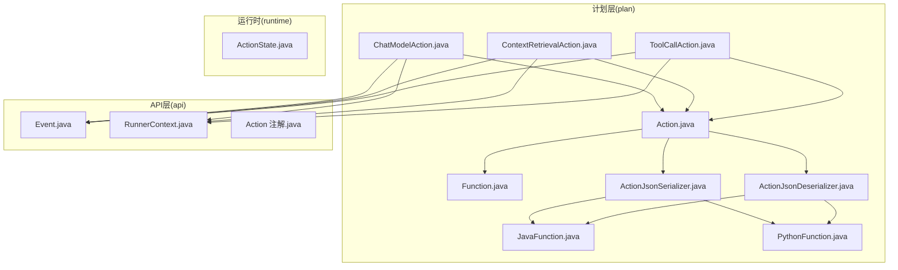
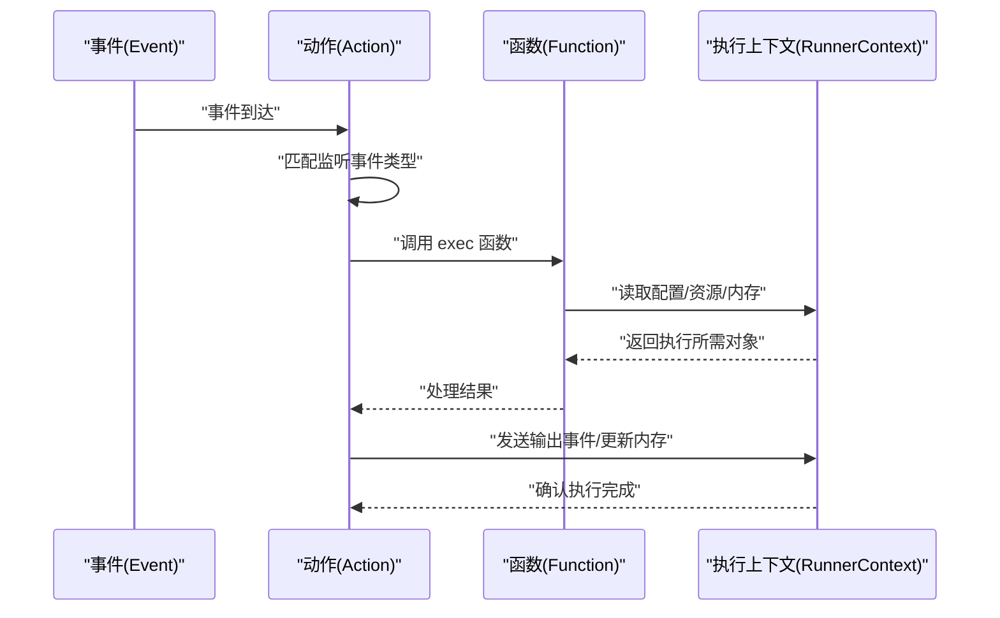
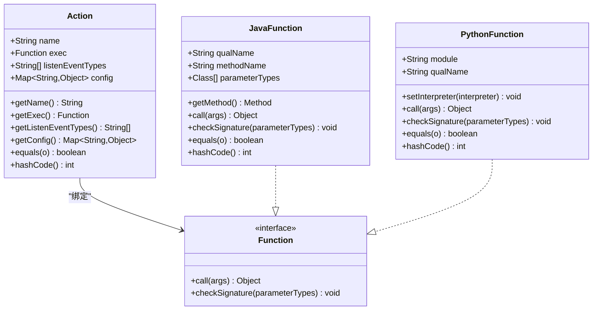
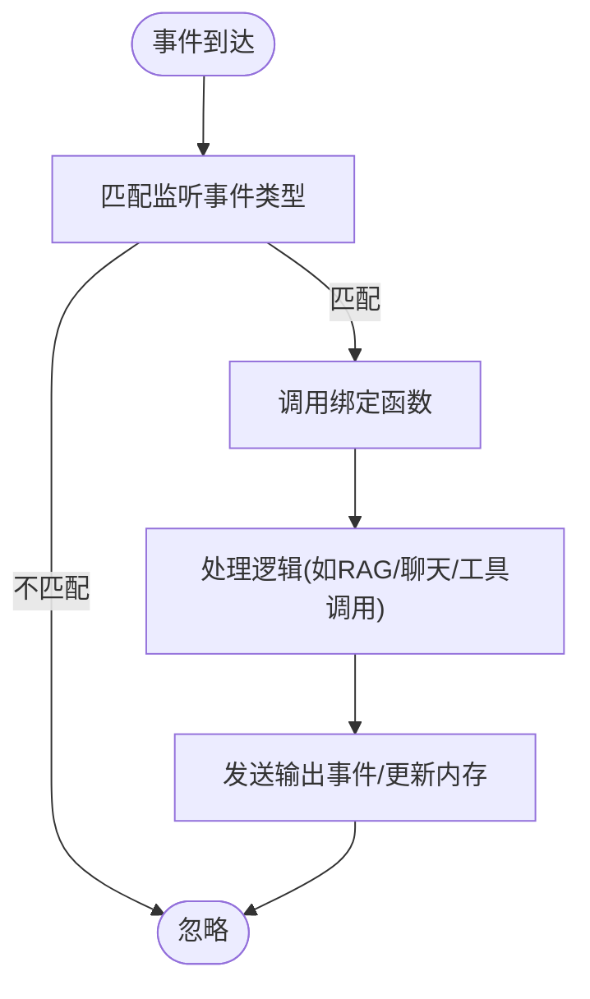
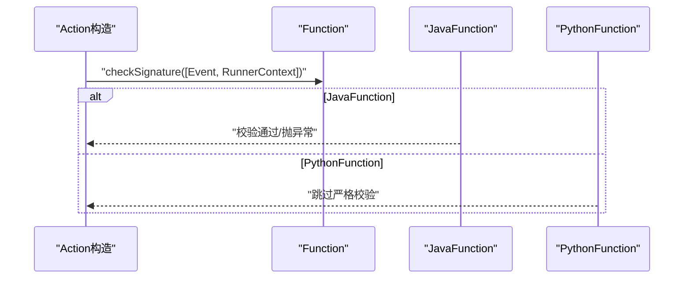
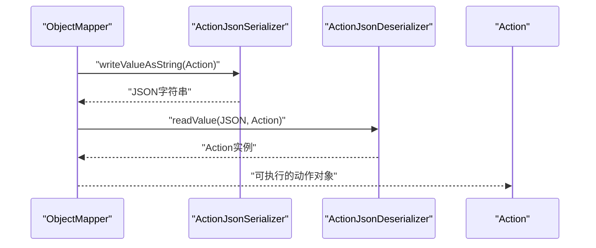
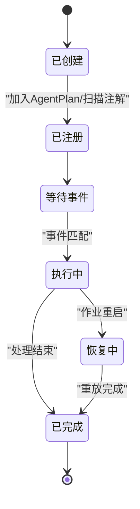
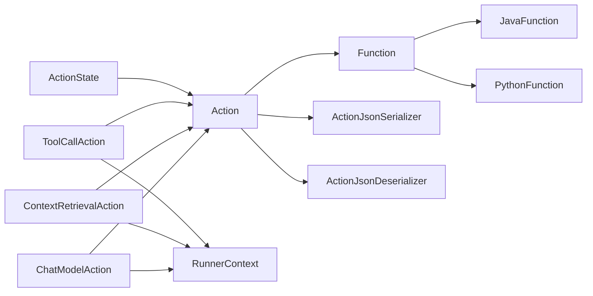

# 动作基础概念

<cite>
**本文引用的文件**
- [Action.java](file://plan/src/main/java/org/apache/flink/agents/plan/actions/Action.java)
- [Action.java（注解）](file://api/src/main/java/org/apache/flink/agents/api/annotation/Action.java)
- [ActionJsonSerializer.java](file://plan/src/main/java/org/apache/flink/agents/plan/serializer/ActionJsonSerializer.java)
- [ActionJsonDeserializer.java](file://plan/src/main/java/org/apache/flink/agents/plan/serializer/ActionJsonDeserializer.java)
- [ActionState.java](file://runtime/src/main/java/org/apache/flink/agents/runtime/actionstate/ActionState.java)
- [Function.java](file://plan/src/main/java/org/apache/flink/agents/plan/Function.java)
- [JavaFunction.java](file://plan/src/main/java/org/apache/flink/agents/plan/JavaFunction.java)
- [PythonFunction.java](file://plan/src/main/java/org/apache/flink/agents/plan/PythonFunction.java)
- [Event.java](file://api/src/main/java/org/apache/flink/agents/api/Event.java)
- [RunnerContext.java](file://api/src/main/java/org/apache/flink/agents/api/context/RunnerContext.java)
- [ChatModelAction.java](file://plan/src/main/java/org/apache/flink/agents/plan/actions/ChatModelAction.java)
- [ContextRetrievalAction.java](file://plan/src/main/java/org/apache/flink/agents/plan/actions/ContextRetrievalAction.java)
- [ToolCallAction.java](file://plan/src/main/java/org/apache/flink/agents/plan/actions/ToolCallAction.java)
- [ActionJsonSerializerTest.java](file://plan/src/test/java/org/apache/flink/agents/plan/serializer/ActionJsonSerializerTest.java)
- [ActionJsonDeserializerTest.java](file://plan/src/test/java/org/apache/flink/agents/plan/serializer/ActionJsonDeserializerTest.java)
</cite>

## 目录
1. [简介](#简介)
2. [项目结构](#项目结构)
3. [核心组件](#核心组件)
4. [架构总览](#架构总览)
5. [详细组件分析](#详细组件分析)
6. [依赖关系分析](#依赖关系分析)
7. [性能考量](#性能考量)
8. [故障排查指南](#故障排查指南)
9. [结论](#结论)
10. [附录](#附录)

## 简介
本文件围绕 Apache Flink Agents 的“动作”（Action）基础概念进行系统化技术说明，涵盖动作的命名机制、事件监听配置、函数执行绑定、生命周期管理、配置参数系统、与事件系统的集成、序列化与反序列化机制、跨语言传输协议、以及相等性与哈希计算规则。目标是帮助读者从设计原理到运行时行为全面理解动作模型。

## 项目结构
动作系统主要分布在以下模块：
- 计划层（plan）：定义动作、函数、序列化器、内置动作实现
- 运行时（runtime）：动作状态持久化、执行上下文、操作符与恢复机制
- API 层（api）：事件基类、RunnerContext 接口、注解等

**图表来源**
- [Action.java](file://plan/src/main/java/org/apache/flink/agents/plan/actions/Action.java#L41-L43)
- [Function.java](file://plan/src/main/java/org/apache/flink/agents/plan/Function.java#L21-L27)
- [JavaFunction.java](file://plan/src/main/java/org/apache/flink/agents/plan/JavaFunction.java#L28-L52)
- [PythonFunction.java](file://plan/src/main/java/org/apache/flink/agents/plan/PythonFunction.java#L25-L36)
- [ActionJsonSerializer.java](file://plan/src/main/java/org/apache/flink/agents/plan/serializer/ActionJsonSerializer.java#L35-L42)
- [ActionJsonDeserializer.java](file://plan/src/main/java/org/apache/flink/agents/plan/serializer/ActionJsonDeserializer.java#L45-L49)
- [ChatModelAction.java](file://plan/src/main/java/org/apache/flink/agents/plan/actions/ChatModelAction.java#L52-L71)
- [ContextRetrievalAction.java](file://plan/src/main/java/org/apache/flink/agents/plan/actions/ContextRetrievalAction.java#L37-L47)
- [ToolCallAction.java](file://plan/src/main/java/org/apache/flink/agents/plan/actions/ToolCallAction.java#L36-L45)
- [ActionState.java](file://runtime/src/main/java/org/apache/flink/agents/runtime/actionstate/ActionState.java#L28-L50)
- [Event.java](file://api/src/main/java/org/apache/flink/agents/api/Event.java#L30-L46)
- [RunnerContext.java](file://api/src/main/java/org/apache/flink/agents/api/context/RunnerContext.java#L33-L137)
- [Action.java（注解）](file://api/src/main/java/org/apache/flink/agents/api/annotation/Action.java#L43-L53)

**章节来源**
- [Action.java](file://plan/src/main/java/org/apache/flink/agents/plan/actions/Action.java#L35-L100)
- [Action.java（注解）](file://api/src/main/java/org/apache/flink/agents/api/annotation/Action.java#L28-L54)

## 核心组件
- 动作 Action：封装名称、监听事件类型列表、执行函数、可选配置；负责将事件与函数绑定，并在匹配时触发执行。
- 函数 Function 及其实现：JavaFunction、PythonFunction，统一抽象函数调用与签名检查。
- 序列化器 ActionJsonSerializer/ActionJsonDeserializer：支持 JavaFunction 与 PythonFunction 的跨语言序列化与反序列化。
- RunnerContext：动作执行上下文，提供发送事件、内存访问、资源获取、度量与持久化执行能力。
- 内置动作：ChatModelAction、ContextRetrievalAction、ToolCallAction，演示动作的实际使用模式。

**章节来源**
- [Action.java](file://plan/src/main/java/org/apache/flink/agents/plan/actions/Action.java#L41-L83)
- [Function.java](file://plan/src/main/java/org/apache/flink/agents/plan/Function.java#L21-L27)
- [JavaFunction.java](file://plan/src/main/java/org/apache/flink/agents/plan/JavaFunction.java#L28-L127)
- [PythonFunction.java](file://plan/src/main/java/org/apache/flink/agents/plan/PythonFunction.java#L25-L77)
- [ActionJsonSerializer.java](file://plan/src/main/java/org/apache/flink/agents/plan/serializer/ActionJsonSerializer.java#L35-L155)
- [ActionJsonDeserializer.java](file://plan/src/main/java/org/apache/flink/agents/plan/serializer/ActionJsonDeserializer.java#L45-L182)
- [RunnerContext.java](file://api/src/main/java/org/apache/flink/agents/api/context/RunnerContext.java#L33-L137)
- [ChatModelAction.java](file://plan/src/main/java/org/apache/flink/agents/plan/actions/ChatModelAction.java#L52-L352)
- [ContextRetrievalAction.java](file://plan/src/main/java/org/apache/flink/agents/plan/actions/ContextRetrievalAction.java#L37-L101)
- [ToolCallAction.java](file://plan/src/main/java/org/apache/flink/agents/plan/actions/ToolCallAction.java#L36-L113)

## 架构总览
动作系统以“事件驱动 + 函数执行”的方式工作：事件到达后，由动作根据监听类型匹配，随后通过 RunnerContext 调用绑定的函数完成处理。序列化器确保动作定义可在不同语言间传输与恢复。

**图表来源**
- [Action.java](file://plan/src/main/java/org/apache/flink/agents/plan/actions/Action.java#L61-L62)
- [Function.java](file://plan/src/main/java/org/apache/flink/agents/plan/Function.java#L22-L26)
- [RunnerContext.java](file://api/src/main/java/org/apache/flink/agents/api/context/RunnerContext.java#L39-L133)
- [Event.java](file://api/src/main/java/org/apache/flink/agents/api/Event.java#L30-L74)

## 详细组件分析

### 动作 Action 设计与生命周期
- 命名机制：每个动作有唯一名称，用于标识与日志追踪。
- 事件监听配置：通过字符串化的事件类型列表声明监听范围，支持多事件类型。
- 函数执行绑定：exec 字段绑定具体函数，构造时会校验函数签名是否接受 (Event, RunnerContext)。
- 生命周期管理：
  - 创建：构造函数完成字段初始化与签名检查。
  - 注册：通常由计划层或注解扫描生成，或直接在 AgentPlan 中声明。
  - 执行：事件到达时，匹配监听类型后调用 exec。
  - 持久化与恢复：运行时使用 ActionState 记录中间状态，支持恢复与重放。
- 配置参数系统：可选 Map<String,Object> config，序列化时区分 java 与 python 两类配置写入策略。

**图表来源**
- [Action.java](file://plan/src/main/java/org/apache/flink/agents/plan/actions/Action.java#L41-L98)
- [Function.java](file://plan/src/main/java/org/apache/flink/agents/plan/Function.java#L21-L27)
- [JavaFunction.java](file://plan/src/main/java/org/apache/flink/agents/plan/JavaFunction.java#L28-L127)
- [PythonFunction.java](file://plan/src/main/java/org/apache/flink/agents/plan/PythonFunction.java#L25-L77)

**章节来源**
- [Action.java](file://plan/src/main/java/org/apache/flink/agents/plan/actions/Action.java#L51-L66)
- [Action.java](file://plan/src/main/java/org/apache/flink/agents/plan/actions/Action.java#L85-L98)
- [Action.java（注解）](file://api/src/main/java/org/apache/flink/agents/api/annotation/Action.java#L43-L53)

### 事件监听与触发条件
- 事件类型匹配：动作持有事件类型字符串列表，事件到达时按类型匹配。
- 触发条件：当事件类名出现在监听列表中即触发对应动作。
- 内置动作示例：
  - ChatModelAction：监听 ChatRequestEvent 与 ToolResponseEvent，处理对话与工具调用链路。
  - ContextRetrievalAction：监听 ContextRetrievalRequestEvent，执行向量检索并回传响应事件。
  - ToolCallAction：监听 ToolRequestEvent，调用工具资源并回传 ToolResponseEvent。

**图表来源**
- [ChatModelAction.java](file://plan/src/main/java/org/apache/flink/agents/plan/actions/ChatModelAction.java#L340-L350)
- [ContextRetrievalAction.java](file://plan/src/main/java/org/apache/flink/agents/plan/actions/ContextRetrievalAction.java#L49-L99)
- [ToolCallAction.java](file://plan/src/main/java/org/apache/flink/agents/plan/actions/ToolCallAction.java#L48-L111)

**章节来源**
- [ChatModelAction.java](file://plan/src/main/java/org/apache/flink/agents/plan/actions/ChatModelAction.java#L63-L71)
- [ContextRetrievalAction.java](file://plan/src/main/java/org/apache/flink/agents/plan/actions/ContextRetrievalAction.java#L39-L47)
- [ToolCallAction.java](file://plan/src/main/java/org/apache/flink/agents/plan/actions/ToolCallAction.java#L37-L45)

### 函数执行绑定与签名检查
- JavaFunction：通过限定名与方法名定位静态方法，支持参数类型校验与反射调用。
- PythonFunction：通过模块与限定名在 Python 解释器中调用，当前不强制参数类型检查。
- 签名检查：Action 构造时要求 exec 符合 (Event, RunnerContext) 签名，避免运行期错误。

**图表来源**
- [Action.java](file://plan/src/main/java/org/apache/flink/agents/plan/actions/Action.java#L61-L62)
- [JavaFunction.java](file://plan/src/main/java/org/apache/flink/agents/plan/JavaFunction.java#L110-L126)
- [PythonFunction.java](file://plan/src/main/java/org/apache/flink/agents/plan/PythonFunction.java#L52-L53)

**章节来源**
- [JavaFunction.java](file://plan/src/main/java/org/apache/flink/agents/plan/JavaFunction.java#L54-L81)
- [PythonFunction.java](file://plan/src/main/java/org/apache/flink/agents/plan/PythonFunction.java#L33-L48)

### 配置参数系统
- 可选配置：Action 支持 Map<String,Object> config，用于传递动作参数。
- 序列化策略：
  - java 类型：写入时附加 @class 与 value 字段，反序列化时按 @class 恢复对象类型。
  - python 类型：原样写入/读取，保持跨语言一致性。
- 使用场景：内置动作常通过配置控制异步策略、输出模式、重试策略等。

**章节来源**
- [Action.java](file://plan/src/main/java/org/apache/flink/agents/plan/actions/Action.java#L48-L50)
- [ActionJsonSerializer.java](file://plan/src/main/java/org/apache/flink/agents/plan/serializer/ActionJsonSerializer.java#L74-L122)
- [ActionJsonDeserializer.java](file://plan/src/main/java/org/apache/flink/agents/plan/serializer/ActionJsonDeserializer.java#L75-L88)

### 序列化与反序列化机制
- 自定义序列化器：ActionJsonSerializer 将 Action 序列化为 JSON，包含 name、exec、listen_event_types、config。
- 函数类型识别：通过 exec.func_type 区分 JavaFunction 与 PythonFunction。
- 反序列化：ActionJsonDeserializer 依据 exec.func_type 与 config.config_type 重建函数与配置。
- 测试验证：单元测试覆盖 Java/Python 函数、多事件类型、空事件列表、配置 round-trip 等场景。

**图表来源**
- [ActionJsonSerializer.java](file://plan/src/main/java/org/apache/flink/agents/plan/serializer/ActionJsonSerializer.java#L44-L125)
- [ActionJsonDeserializer.java](file://plan/src/main/java/org/apache/flink/agents/plan/serializer/ActionJsonDeserializer.java#L52-L96)

**章节来源**
- [ActionJsonSerializerTest.java](file://plan/src/test/java/org/apache/flink/agents/plan/serializer/ActionJsonSerializerTest.java#L43-L237)
- [ActionJsonDeserializerTest.java](file://plan/src/test/java/org/apache/flink/agents/plan/serializer/ActionJsonDeserializerTest.java#L38-L107)

### 跨语言环境中的传输协议
- 协议要点：
  - exec.func_type 标识函数类型（JavaFunction/PythonFunction）。
  - JavaFunction：包含 qualname、method_name、parameter_types；parameter_types 通过类名字符串传递，反序列化时通过上下文类加载器解析。
  - PythonFunction：包含 module、qualname；通过 PythonInterpreter.invoke 调用。
  - config.config_type 标识配置类型（java/python），java 配置写入 @class/value，python 配置原样传输。
- 兼容性：序列化器/反序列化器分别处理两类函数与配置，保证 Java/Python 侧一致的传输语义。

**章节来源**
- [ActionJsonSerializer.java](file://plan/src/main/java/org/apache/flink/agents/plan/serializer/ActionJsonSerializer.java#L54-L153)
- [ActionJsonDeserializer.java](file://plan/src/main/java/org/apache/flink/agents/plan/serializer/ActionJsonDeserializer.java#L58-L129)

### 动作生命周期管理
- 创建：Action 构造时完成字段初始化与函数签名检查。
- 注册：通过计划层或注解扫描生成；内置动作通过工厂方法返回预设 Action。
- 执行：事件到达后匹配监听类型，调用 exec 完成处理；可通过 RunnerContext 发送事件、访问内存与资源。
- 持久化与恢复：运行时使用 ActionState 记录任务事件、内存更新、输出事件、调用结果与完成标记，支持细粒度恢复。

**图表来源**
- [ActionState.java](file://runtime/src/main/java/org/apache/flink/agents/runtime/actionstate/ActionState.java#L28-L180)

**章节来源**
- [ActionState.java](file://runtime/src/main/java/org/apache/flink/agents/runtime/actionstate/ActionState.java#L52-L78)
- [ActionState.java](file://runtime/src/main/java/org/apache/flink/agents/runtime/actionstate/ActionState.java#L177-L180)

### 相等性与哈希计算
- 相等性规则：Action 的 equals 仅基于 name、exec、listenEventTypes 三要素。
- 哈希规则：Action 的 hashCode 基于上述三要素组合计算。
- 影响：在集合去重、映射键值等场景需确保三要素一致，否则可能导致重复或查找失败。

**章节来源**
- [Action.java](file://plan/src/main/java/org/apache/flink/agents/plan/actions/Action.java#L85-L98)

### 动作实例化与基本使用
- 通过 JavaFunction 绑定静态方法，指定事件类型列表，创建 Action。
- 在 RunnerContext 中，动作可访问配置、资源、内存与指标，并通过 sendEvent 发送输出事件。
- 示例参考：
  - ChatModelAction：监听聊天请求与工具响应，处理对话与工具调用链路。
  - ContextRetrievalAction：监听检索请求，执行向量查询并回传文档。
  - ToolCallAction：监听工具请求，调用工具资源并回传响应。

**章节来源**
- [ChatModelAction.java](file://plan/src/main/java/org/apache/flink/agents/plan/actions/ChatModelAction.java#L63-L71)
- [ContextRetrievalAction.java](file://plan/src/main/java/org/apache/flink/agents/plan/actions/ContextRetrievalAction.java#L39-L47)
- [ToolCallAction.java](file://plan/src/main/java/org/apache/flink/agents/plan/actions/ToolCallAction.java#L37-L45)
- [RunnerContext.java](file://api/src/main/java/org/apache/flink/agents/api/context/RunnerContext.java#L39-L133)

## 依赖关系分析
- Action 依赖 Function 抽象，支持 JavaFunction 与 PythonFunction 两种实现。
- 序列化器依赖 JavaFunction/PythonFunction 的字段结构，确保跨语言传输。
- 内置动作依赖 RunnerContext 提供的资源、内存与度量能力。
- ActionState 作为运行时状态载体，被持久化存储并在恢复时使用。

**图表来源**
- [Action.java](file://plan/src/main/java/org/apache/flink/agents/plan/actions/Action.java#L41-L43)
- [ActionJsonSerializer.java](file://plan/src/main/java/org/apache/flink/agents/plan/serializer/ActionJsonSerializer.java#L35-L42)
- [ActionJsonDeserializer.java](file://plan/src/main/java/org/apache/flink/agents/plan/serializer/ActionJsonDeserializer.java#L45-L49)
- [ChatModelAction.java](file://plan/src/main/java/org/apache/flink/agents/plan/actions/ChatModelAction.java#L52-L71)
- [ContextRetrievalAction.java](file://plan/src/main/java/org/apache/flink/agents/plan/actions/ContextRetrievalAction.java#L37-L47)
- [ToolCallAction.java](file://plan/src/main/java/org/apache/flink/agents/plan/actions/ToolCallAction.java#L36-L45)
- [ActionState.java](file://runtime/src/main/java/org/apache/flink/agents/runtime/actionstate/ActionState.java#L28-L50)

**章节来源**
- [Action.java](file://plan/src/main/java/org/apache/flink/agents/plan/actions/Action.java#L41-L98)
- [ActionState.java](file://runtime/src/main/java/org/apache/flink/agents/runtime/actionstate/ActionState.java#L182-L214)

## 性能考量
- 异步执行：RunnerContext 提供 durableExecute 与 durableExecuteAsync，内置动作在配置允许时采用异步提升吞吐。
- 度量与指标：RunnerContext 提供共享与独立指标组，便于观测动作性能。
- 恢复开销：ActionState 记录调用结果与完成标记，有助于跳过已完成步骤，减少重复执行。

[本节为通用指导，无需特定文件引用]

## 故障排查指南
- 函数签名不匹配：Action 构造时会检查 exec 签名，若不符合 (Event, RunnerContext) 将抛出异常。
- 不支持的函数类型：序列化器仅支持 JavaFunction 与 PythonFunction，其他类型会抛出异常。
- 配置类型错误：config.config_type 必须为 "java" 或 "python"，否则反序列化失败。
- 事件类型无效：反序列化时若事件类型无法解析，将抛出运行时异常。

**章节来源**
- [Action.java](file://plan/src/main/java/org/apache/flink/agents/plan/actions/Action.java#L61-L62)
- [ActionJsonSerializer.java](file://plan/src/main/java/org/apache/flink/agents/plan/serializer/ActionJsonSerializer.java#L60-L63)
- [ActionJsonDeserializer.java](file://plan/src/main/java/org/apache/flink/agents/plan/serializer/ActionJsonDeserializer.java#L66-L67)
- [ActionJsonDeserializer.java](file://plan/src/main/java/org/apache/flink/agents/plan/serializer/ActionJsonDeserializer.java#L116-L118)
- [ActionJsonDeserializerTest.java](file://plan/src/test/java/org/apache/flink/agents/plan/serializer/ActionJsonDeserializerTest.java#L80-L107)

## 结论
动作 Action 是 Flink Agents 的核心执行单元，通过清晰的命名、事件监听与函数绑定，实现了事件驱动的可扩展处理框架。配合序列化器与运行时状态管理，动作在跨语言环境中具备良好的可移植性与恢复能力。内置动作展示了典型业务场景的实现模式，开发者可据此快速构建自定义动作处理器。

[本节为总结性内容，无需特定文件引用]

## 附录
- 关键接口与类路径参考：
  - [Action.java](file://plan/src/main/java/org/apache/flink/agents/plan/actions/Action.java#L41-L98)
  - [Function.java](file://plan/src/main/java/org/apache/flink/agents/plan/Function.java#L21-L27)
  - [JavaFunction.java](file://plan/src/main/java/org/apache/flink/agents/plan/JavaFunction.java#L28-L127)
  - [PythonFunction.java](file://plan/src/main/java/org/apache/flink/agents/plan/PythonFunction.java#L25-L77)
  - [ActionJsonSerializer.java](file://plan/src/main/java/org/apache/flink/agents/plan/serializer/ActionJsonSerializer.java#L35-L155)
  - [ActionJsonDeserializer.java](file://plan/src/main/java/org/apache/flink/agents/plan/serializer/ActionJsonDeserializer.java#L45-L182)
  - [RunnerContext.java](file://api/src/main/java/org/apache/flink/agents/api/context/RunnerContext.java#L33-L137)
  - [Event.java](file://api/src/main/java/org/apache/flink/agents/api/Event.java#L30-L89)
  - [ActionState.java](file://runtime/src/main/java/org/apache/flink/agents/runtime/actionstate/ActionState.java#L28-L234)
  - [ChatModelAction.java](file://plan/src/main/java/org/apache/flink/agents/plan/actions/ChatModelAction.java#L52-L352)
  - [ContextRetrievalAction.java](file://plan/src/main/java/org/apache/flink/agents/plan/actions/ContextRetrievalAction.java#L37-L101)
  - [ToolCallAction.java](file://plan/src/main/java/org/apache/flink/agents/plan/actions/ToolCallAction.java#L36-L113)
  - [ActionJsonSerializerTest.java](file://plan/src/test/java/org/apache/flink/agents/plan/serializer/ActionJsonSerializerTest.java#L43-L237)
  - [ActionJsonDeserializerTest.java](file://plan/src/test/java/org/apache/flink/agents/plan/serializer/ActionJsonDeserializerTest.java#L38-L107)