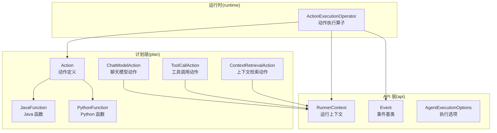
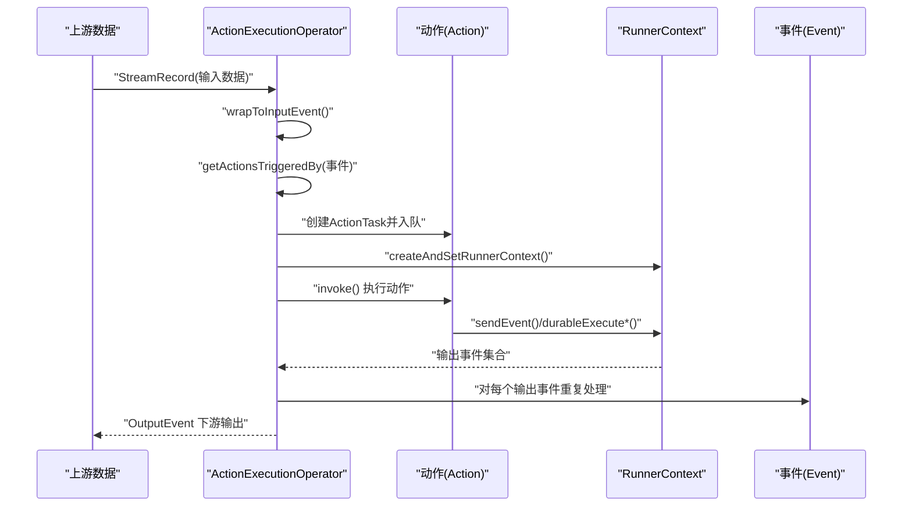
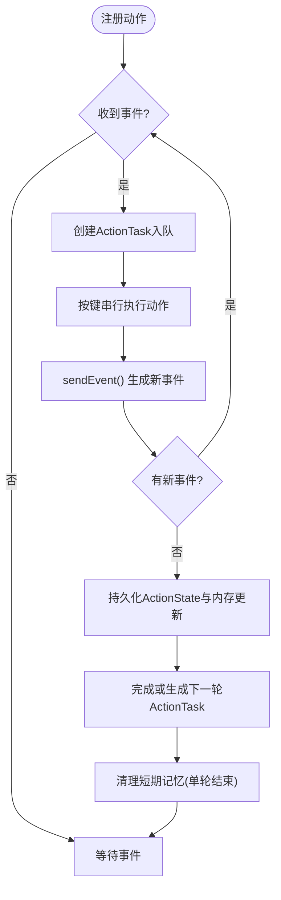
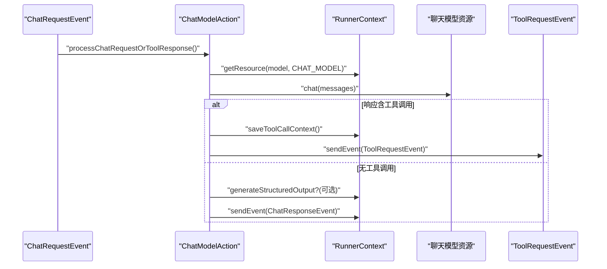
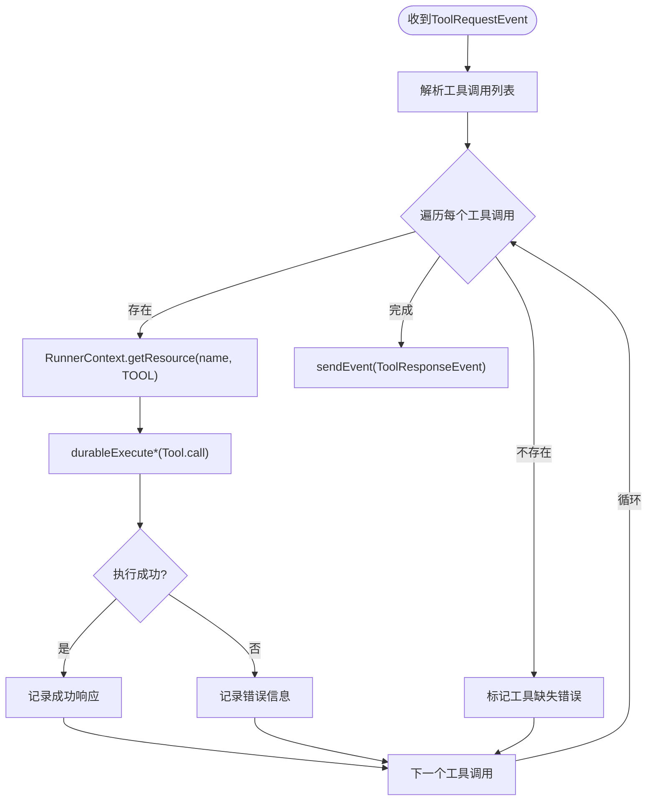
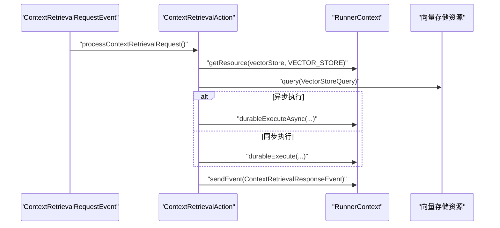
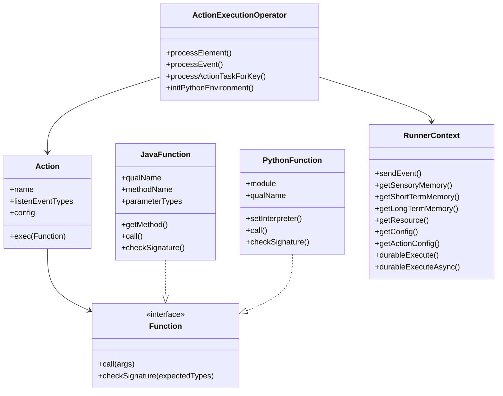

# 动作系统

<cite>
**本文引用的文件**   
- [Action.java](file://plan/src/main/java/org/apache/flink/agents/plan/actions/Action.java)
- [ChatModelAction.java](file://plan/src/main/java/org/apache/flink/agents/plan/actions/ChatModelAction.java)
- [ToolCallAction.java](file://plan/src/main/java/org/apache/flink/agents/plan/actions/ToolCallAction.java)
- [ContextRetrievalAction.java](file://plan/src/main/java/org/apache/flink/agents/plan/actions/ContextRetrievalAction.java)
- [JavaFunction.java](file://plan/src/main/java/org/apache/flink/agents/plan/JavaFunction.java)
- [PythonFunction.java](file://plan/src/main/java/org/apache/flink/agents/plan/PythonFunction.java)
- [Function.java](file://plan/src/main/java/org/apache/flink/agents/plan/Function.java)
- [Event.java](file://api/src/main/java/org/apache/flink/agents/api/Event.java)
- [RunnerContext.java](file://api/src/main/java/org/apache/flink/agents/api/context/RunnerContext.java)
- [AgentExecutionOptions.java](file://api/src/main/java/org/apache/flink/agents/api/agents/AgentExecutionOptions.java)
- [ActionExecutionOperator.java](file://runtime/src/main/java/org/apache/flink/agents/runtime/operator/ActionExecutionOperator.java)
- [action_java_function.json](file://plan/src/test/resources/actions/action_java_function.json)
- [action_python_function.json](file://plan/src/test/resources/actions/action_python_function.json)
- [agent_plan.json](file://plan/src/test/resources/agent_plans/agent_plan.json)
</cite>

## 目录
1. [简介](#简介)
2. [项目结构](#项目结构)
3. [核心组件](#核心组件)
4. [架构总览](#架构总览)
5. [详细组件分析](#详细组件分析)
6. [依赖关系分析](#依赖关系分析)
7. [性能考量与优化](#性能考量与优化)
8. [故障排查指南](#故障排查指南)
9. [结论](#结论)
10. [附录：示例与高级配置](#附录示例与高级配置)

## 简介
本文件面向 Apache Flink Agents 的“动作系统”，系统性阐述动作的基本概念、生命周期、配置管理与执行机制；深入解析内置动作类型：聊天模型动作（ChatModelAction）、工具调用动作（ToolCallAction）与上下文检索动作（ContextRetrievalAction）的功能特性、参数配置与使用场景；对比 JavaFunction 与 PythonFunction 的实现差异与选型策略；给出自定义动作的开发流程、参数校验与异常处理建议；说明事件驱动机制（事件类型匹配、触发条件与执行顺序控制）；最后提供性能优化技巧与最佳实践，并通过 JSON 示例展示常见用法与高级配置。

## 项目结构
动作系统位于 plan 模块中以“计划”形式描述动作与函数，运行时由 runtime 模块中的 ActionExecutionOperator 驱动执行。API 层提供事件、上下文与资源抽象；内置动作封装在 plan/actions 下；函数抽象在 plan/plan 下；运行时操作子负责状态恢复、异步执行与跨语言桥接。

图示来源
- [Action.java](file://plan/src/main/java/org/apache/flink/agents/plan/actions/Action.java#L41-L98)
- [JavaFunction.java](file://plan/src/main/java/org/apache/flink/agents/plan/JavaFunction.java#L28-L127)
- [PythonFunction.java](file://plan/src/main/java/org/apache/flink/agents/plan/PythonFunction.java#L25-L76)
- [ChatModelAction.java](file://plan/src/main/java/org/apache/flink/agents/plan/actions/ChatModelAction.java#L52-L351)
- [ToolCallAction.java](file://plan/src/main/java/org/apache/flink/agents/plan/actions/ToolCallAction.java#L36-L112)
- [ContextRetrievalAction.java](file://plan/src/main/java/org/apache/flink/agents/plan/actions/ContextRetrievalAction.java#L37-L100)
- [Event.java](file://api/src/main/java/org/apache/flink/agents/api/Event.java#L30-L89)
- [RunnerContext.java](file://api/src/main/java/org/apache/flink/agents/api/context/RunnerContext.java#L33-L137)
- [AgentExecutionOptions.java](file://api/src/main/java/org/apache/flink/agents/api/agents/AgentExecutionOptions.java#L23-L47)
- [ActionExecutionOperator.java](file://runtime/src/main/java/org/apache/flink/agents/runtime/operator/ActionExecutionOperator.java#L118-L800)

章节来源
- [Action.java](file://plan/src/main/java/org/apache/flink/agents/plan/actions/Action.java#L41-L98)
- [ActionExecutionOperator.java](file://runtime/src/main/java/org/apache/flink/agents/runtime/operator/ActionExecutionOperator.java#L118-L800)

## 核心组件
- 动作 Action：封装动作名称、监听事件类型列表、可选配置以及执行函数（Function）。构造时会校验函数签名是否符合期望的参数类型数组。
- 函数 Function：统一的函数抽象，支持 JavaFunction 与 PythonFunction 两种实现。
- JavaFunction：序列化为 JSON 时包含限定类名、方法名与参数类型数组；运行时通过反射调用静态方法。
- PythonFunction：通过 Python 解释器桥接调用指定模块中的函数；需在运行时注入 PythonInterpreter。
- RunnerContext：动作执行期间的上下文，提供发送事件、访问短期/长期记忆、获取资源、读取配置、同步/异步持久化执行等能力。
- AgentExecutionOptions：全局执行选项，如错误处理策略、最大重试次数、异步线程数、各类异步开关（聊天、工具调用、RAG）。

章节来源
- [Action.java](file://plan/src/main/java/org/apache/flink/agents/plan/actions/Action.java#L41-L98)
- [Function.java](file://plan/src/main/java/org/apache/flink/agents/plan/Function.java#L21-L27)
- [JavaFunction.java](file://plan/src/main/java/org/apache/flink/agents/plan/JavaFunction.java#L28-L127)
- [PythonFunction.java](file://plan/src/main/java/org/apache/flink/agents/plan/PythonFunction.java#L25-L76)
- [RunnerContext.java](file://api/src/main/java/org/apache/flink/agents/api/context/RunnerContext.java#L33-L137)
- [AgentExecutionOptions.java](file://api/src/main/java/org/apache/flink/agents/api/agents/AgentExecutionOptions.java#L23-L47)

## 架构总览
动作系统采用“事件驱动 + 动作执行”的流水线式架构。输入数据被包装为 InputEvent 后进入 ActionExecutionOperator；该算子根据事件类型匹配到一个或多个动作，将动作封装为 ActionTask 并入队；随后按键分区串行调度执行，动作通过 RunnerContext 发送新的事件，形成事件-动作的递归处理，直至产生 OutputEvent 输出下游。

图示来源
- [ActionExecutionOperator.java](file://runtime/src/main/java/org/apache/flink/agents/runtime/operator/ActionExecutionOperator.java#L344-L602)
- [Event.java](file://api/src/main/java/org/apache/flink/agents/api/Event.java#L30-L89)
- [RunnerContext.java](file://api/src/main/java/org/apache/flink/agents/api/context/RunnerContext.java#L39-L133)

## 详细组件分析

### 动作 Action 与生命周期
- 定义：动作由名称、监听事件类型列表、可选配置与执行函数组成。构造时通过 Function.checkSignature 校验函数签名，确保参数类型兼容。
- 生命周期：
  - 注册阶段：在 AgentPlan 中声明动作及其事件映射。
  - 触发阶段：收到匹配事件后，算子创建 ActionTask 并排队。
  - 执行阶段：按键分区串行执行，动作通过 RunnerContext 发送新事件或持久化结果。
  - 恢复阶段：基于 ActionState 与内存更新进行幂等重放。
  - 清理阶段：单次输入事件完成后清理短期记忆，等待下一个输入事件。

章节来源
- [Action.java](file://plan/src/main/java/org/apache/flink/agents/plan/actions/Action.java#L41-L98)
- [ActionExecutionOperator.java](file://runtime/src/main/java/org/apache/flink/agents/runtime/operator/ActionExecutionOperator.java#L439-L602)

### 内置动作一：聊天模型动作 ChatModelAction
- 职责：处理聊天请求与工具调用响应，支持结构化输出与工具调用编排。
- 关键行为：
  - 监听 ChatRequestEvent 与 ToolResponseEvent。
  - 调用聊天模型资源，支持同步/异步执行（受限于资源类型与配置）。
  - 若响应含工具调用，则保存上下文并发送 ToolRequestEvent；否则直接发送 ChatResponseEvent。
  - 支持结构化输出（基于输出模式生成 Row 或反序列化对象），仅在无工具调用时应用。
  - 错误处理：支持 IGNORE/RETRY/FAIL 策略与重试次数配置。
- 参数与配置：
  - 初始请求 ID、模型名称、消息列表、可选输出模式（类或 OutputSchema）。
  - 全局异步开关与错误处理策略来自 RunnerContext 配置。

图示来源
- [ChatModelAction.java](file://plan/src/main/java/org/apache/flink/agents/plan/actions/ChatModelAction.java#L63-L351)
- [RunnerContext.java](file://api/src/main/java/org/apache/flink/agents/api/context/RunnerContext.java#L89-L133)

章节来源
- [ChatModelAction.java](file://plan/src/main/java/org/apache/flink/agents/plan/actions/ChatModelAction.java#L52-L351)
- [AgentExecutionOptions.java](file://api/src/main/java/org/apache/flink/agents/api/agents/AgentExecutionOptions.java#L24-L47)

### 内置动作二：工具调用动作 ToolCallAction
- 职责：接收 ToolRequestEvent，按工具调用清单逐一调用已注册工具，聚合结果并回发 ToolResponseEvent。
- 关键行为：
  - 从事件提取工具调用列表，逐个解析 id、函数名与参数。
  - 通过 RunnerContext 获取对应工具资源，执行 DurableCallable。
  - 异步/同步执行取决于配置开关。
  - 统计成功/失败与错误信息，回发 ToolResponseEvent。

图示来源
- [ToolCallAction.java](file://plan/src/main/java/org/apache/flink/agents/plan/actions/ToolCallAction.java#L37-L112)
- [RunnerContext.java](file://api/src/main/java/org/apache/flink/agents/api/context/RunnerContext.java#L89-L133)

章节来源
- [ToolCallAction.java](file://plan/src/main/java/org/apache/flink/agents/plan/actions/ToolCallAction.java#L36-L112)
- [AgentExecutionOptions.java](file://api/src/main/java/org/apache/flink/agents/api/agents/AgentExecutionOptions.java#L42-L43)

### 内置动作三：上下文检索动作 ContextRetrievalAction
- 职责：处理上下文检索请求，查询向量存储并返回文档集合。
- 关键行为：
  - 监听 ContextRetrievalRequestEvent，解析查询与最大结果数。
  - 通过 RunnerContext 获取向量存储资源，执行查询。
  - 支持异步执行（受限于资源类型与配置）。
  - 回发 ContextRetrievalResponseEvent。

图示来源
- [ContextRetrievalAction.java](file://plan/src/main/java/org/apache/flink/agents/plan/actions/ContextRetrievalAction.java#L39-L100)
- [RunnerContext.java](file://api/src/main/java/org/apache/flink/agents/api/context/RunnerContext.java#L89-L133)

章节来源
- [ContextRetrievalAction.java](file://plan/src/main/java/org/apache/flink/agents/plan/actions/ContextRetrievalAction.java#L37-L100)
- [AgentExecutionOptions.java](file://api/src/main/java/org/apache/flink/agents/api/agents/AgentExecutionOptions.java#L45-L46)

### JavaFunction 与 PythonFunction 的实现差异与选型
- JavaFunction
  - 通过限定类名+方法名+参数类型数组标识，运行时反射调用静态方法。
  - 序列化/反序列化友好，签名检查严格。
  - 适合纯 Java 实现的动作与工具。
- PythonFunction
  - 通过模块名+限定名调用 Python 函数，需在运行时注入 PythonInterpreter。
  - 当前不支持签名检查（占位实现），需自行保证参数类型匹配。
  - 适合需要 Python 生态集成的场景（如特定向量库、嵌入模型等）。
- 选型策略
  - 优先使用 JavaFunction 以获得更好的类型安全与性能。
  - 仅当资源或工具无法用 Java 实现时选用 PythonFunction，并确保运行时环境准备充分。

章节来源
- [JavaFunction.java](file://plan/src/main/java/org/apache/flink/agents/plan/JavaFunction.java#L28-L127)
- [PythonFunction.java](file://plan/src/main/java/org/apache/flink/agents/plan/PythonFunction.java#L25-L76)
- [ActionExecutionOperator.java](file://runtime/src/main/java/org/apache/flink/agents/runtime/operator/ActionExecutionOperator.java#L612-L688)

### 自定义动作开发流程
- 设计动作
  - 明确监听事件类型与职责边界。
  - 编写静态处理方法，签名要求：第一个参数为 Event 或其子类，第二个为 RunnerContext。
- 实现函数
  - 使用 JavaFunction 包装静态方法，确保参数类型数组与签名一致。
  - 或使用 PythonFunction 指定模块与函数名（注意运行时可用性）。
- 注册动作
  - 在 AgentPlan 中声明动作名称、监听事件类型列表与执行函数。
  - 可选地添加动作级配置项。
- 参数校验与异常处理
  - 在动作方法内部对输入参数进行校验。
  - 对外部资源调用捕获异常，必要时回发错误事件或记录日志。
- 测试与验证
  - 使用 JSON 描述动作并反序列化验证签名与字段完整性。
  - 结合端到端测试验证事件流转与输出。

章节来源
- [Action.java](file://plan/src/main/java/org/apache/flink/agents/plan/actions/Action.java#L51-L66)
- [JavaFunction.java](file://plan/src/main/java/org/apache/flink/agents/plan/JavaFunction.java#L110-L126)
- [action_java_function.json](file://plan/src/test/resources/actions/action_java_function.json#L1-L10)
- [action_python_function.json](file://plan/src/test/resources/actions/action_python_function.json#L1-L9)
- [agent_plan.json](file://plan/src/test/resources/agent_plans/agent_plan.json#L1-L47)

## 依赖关系分析
- 动作与函数
  - Action 持有 Function（JavaFunction/PythonFunction），并在构造时校验签名。
- 动作与上下文
  - 动作通过 RunnerContext 访问资源、内存与配置，发送事件并进行持久化执行。
- 运行时算子
  - ActionExecutionOperator 负责事件分发、动作任务调度、状态恢复与内存持久化。
- 事件类型
  - ChatModelAction 监听聊天请求与工具响应事件；ToolCallAction 监听工具请求事件；ContextRetrievalAction 监听上下文检索请求事件。

图示来源
- [Action.java](file://plan/src/main/java/org/apache/flink/agents/plan/actions/Action.java#L41-L98)
- [Function.java](file://plan/src/main/java/org/apache/flink/agents/plan/Function.java#L21-L27)
- [JavaFunction.java](file://plan/src/main/java/org/apache/flink/agents/plan/JavaFunction.java#L28-L127)
- [PythonFunction.java](file://plan/src/main/java/org/apache/flink/agents/plan/PythonFunction.java#L25-L76)
- [RunnerContext.java](file://api/src/main/java/org/apache/flink/agents/api/context/RunnerContext.java#L33-L137)
- [ActionExecutionOperator.java](file://runtime/src/main/java/org/apache/flink/agents/runtime/operator/ActionExecutionOperator.java#L118-L800)

章节来源
- [Action.java](file://plan/src/main/java/org/apache/flink/agents/plan/actions/Action.java#L41-L98)
- [Function.java](file://plan/src/main/java/org/apache/flink/agents/plan/Function.java#L21-L27)
- [RunnerContext.java](file://api/src/main/java/org/apache/flink/agents/api/context/RunnerContext.java#L33-L137)
- [ActionExecutionOperator.java](file://runtime/src/main/java/org/apache/flink/agents/runtime/operator/ActionExecutionOperator.java#L118-L800)

## 性能考量与优化
- 异步执行
  - 通过 AgentExecutionOptions 开关启用聊天、工具调用与 RAG 的异步执行，减少阻塞。
  - JavaFunction/PythonFunction 的异步执行由 RunnerContext.durableExecuteAsync 提供，JDK 21+ 使用 Continuation 机制。
- 错误处理与重试
  - 使用错误处理策略与最大重试次数，避免瞬时失败导致整体失败。
- 资源与内存
  - 合理使用短期/长期记忆，避免在 DurableCallable 中访问内存与发送事件。
  - 单轮结束后自动清理短期记忆，降低状态膨胀。
- 并行度与分区
  - 按键分区串行执行动作，保证一致性；可通过调整并行度与键分布平衡吞吐与延迟。
- Python 环境初始化
  - 仅在存在 Python 动作或资源时初始化 Python 环境，减少启动开销。

章节来源
- [AgentExecutionOptions.java](file://api/src/main/java/org/apache/flink/agents/api/agents/AgentExecutionOptions.java#L24-L47)
- [RunnerContext.java](file://api/src/main/java/org/apache/flink/agents/api/context/RunnerContext.java#L120-L133)
- [ActionExecutionOperator.java](file://runtime/src/main/java/org/apache/flink/agents/runtime/operator/ActionExecutionOperator.java#L314-L329)
- [ChatModelAction.java](file://plan/src/main/java/org/apache/flink/agents/plan/actions/ChatModelAction.java#L201-L270)
- [ToolCallAction.java](file://plan/src/main/java/org/apache/flink/agents/plan/actions/ToolCallAction.java#L49-L111)
- [ContextRetrievalAction.java](file://plan/src/main/java/org/apache/flink/agents/plan/actions/ContextRetrievalAction.java#L52-L99)

## 故障排查指南
- 动作未触发
  - 检查动作监听事件类型是否与输入事件完全匹配（含包名）。
  - 确认 AgentPlan 中 actions_by_event 映射正确。
- 函数签名不匹配
  - JavaFunction 的参数类型数组必须与实际方法签名一致，否则构造 Action 时会抛出非法参数异常。
- Python 函数不可用
  - 确保 Python 环境已初始化且 PythonInterpreter 已注入。
  - 检查模块与函数名拼写，确认运行时可导入。
- 异步执行异常
  - 查看 ActionExecutionOperator 的异常处理与日志，确认 Continuation/线程池配置。
- 资源获取失败
  - 检查资源名称与类型是否正确，确认资源提供者已注册。
- 结构化输出失败
  - 确认输出模式类型与 JSON 字符串格式一致，避免类型不匹配。

章节来源
- [JavaFunction.java](file://plan/src/main/java/org/apache/flink/agents/plan/JavaFunction.java#L110-L126)
- [ActionExecutionOperator.java](file://runtime/src/main/java/org/apache/flink/agents/runtime/operator/ActionExecutionOperator.java#L612-L688)
- [ChatModelAction.java](file://plan/src/main/java/org/apache/flink/agents/plan/actions/ChatModelAction.java#L159-L179)

## 结论
动作系统以事件驱动为核心，通过明确的动作定义、严格的函数签名校验与强大的运行时执行框架，实现了从聊天模型、工具调用到上下文检索的完整链路。结合异步执行、错误处理与跨语言资源桥接，既保证了易用性也兼顾了性能与可靠性。建议在生产环境中优先使用 JavaFunction 与合理的异步策略，并通过完善的测试与监控保障稳定性。

## 附录：示例与高级配置
- 动作 JSON 示例（JavaFunction）
  - 示例路径：[action_java_function.json](file://plan/src/test/resources/actions/action_java_function.json#L1-L10)
  - 说明：定义动作名称、执行函数类型为 JavaFunction、限定类名、方法名与参数类型数组。
- 动作 JSON 示例（PythonFunction）
  - 示例路径：[action_python_function.json](file://plan/src/test/resources/actions/action_python_function.json#L1-L9)
  - 说明：定义动作名称、执行函数类型为 PythonFunction、模块与函数名。
- AgentPlan 示例（动作与事件映射）
  - 示例路径：[agent_plan.json](file://plan/src/test/resources/agent_plans/agent_plan.json#L1-L47)
  - 说明：包含两个动作与 actions_by_event 映射，以及顶层配置块。

章节来源
- [action_java_function.json](file://plan/src/test/resources/actions/action_java_function.json#L1-L10)
- [action_python_function.json](file://plan/src/test/resources/actions/action_python_function.json#L1-L9)
- [agent_plan.json](file://plan/src/test/resources/agent_plans/agent_plan.json#L1-L47)