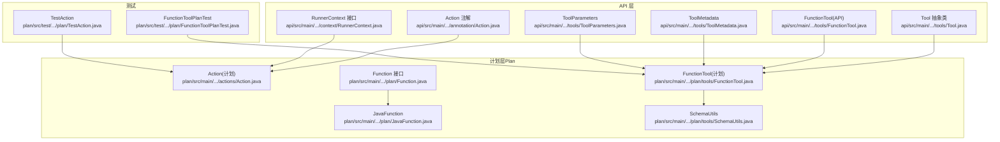
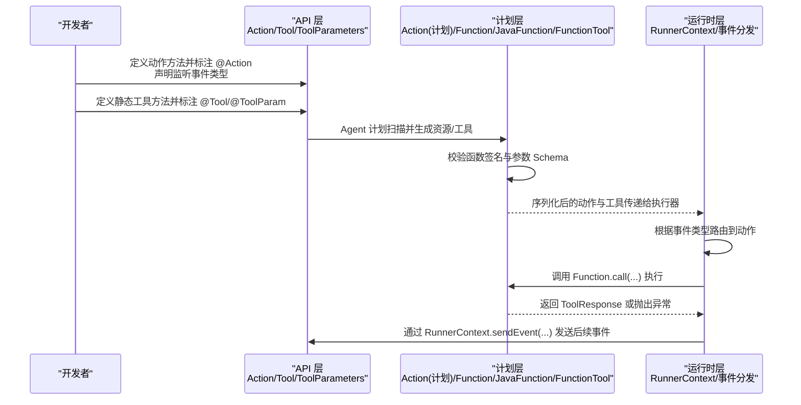
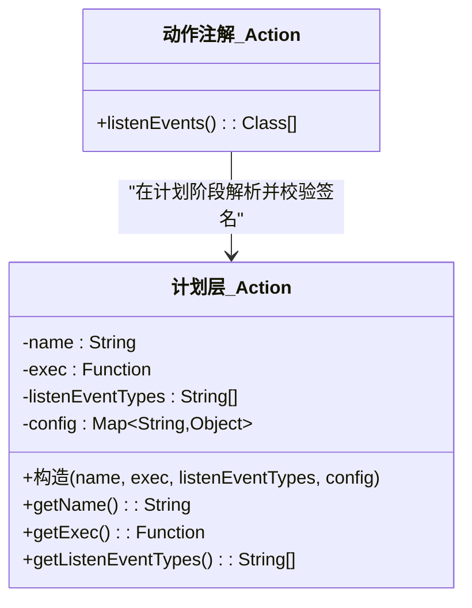
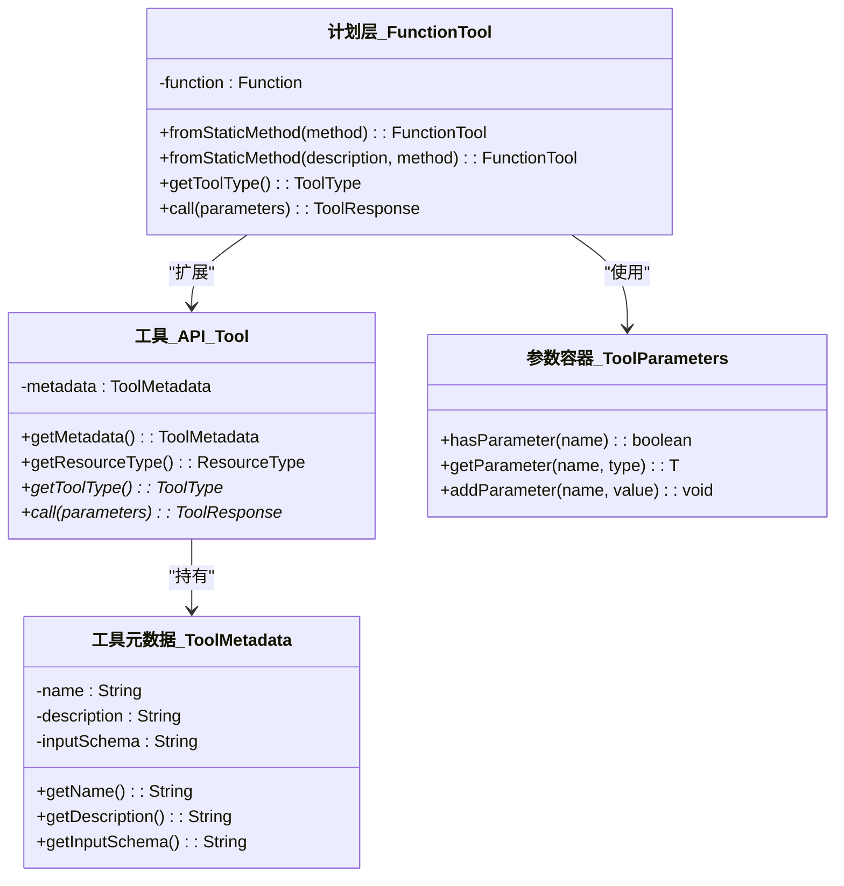
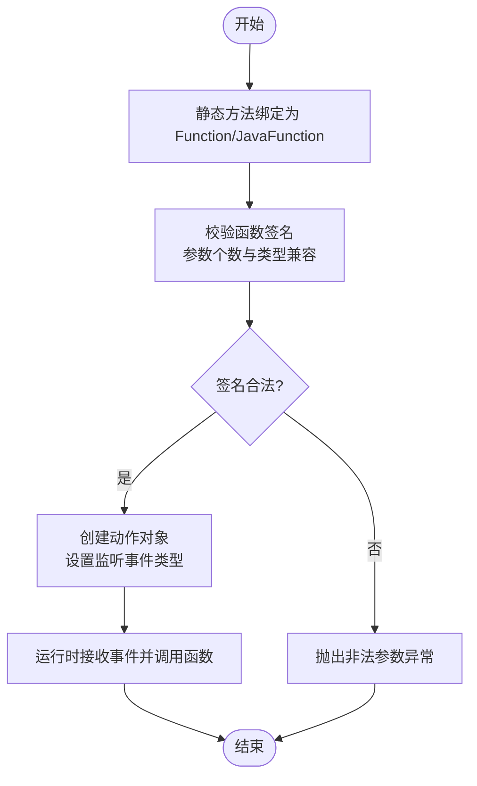
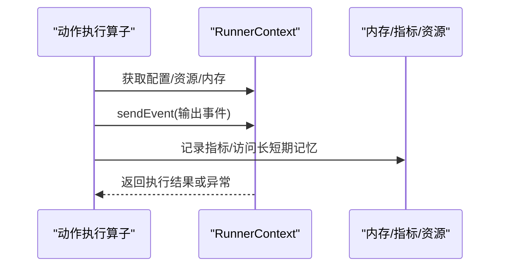
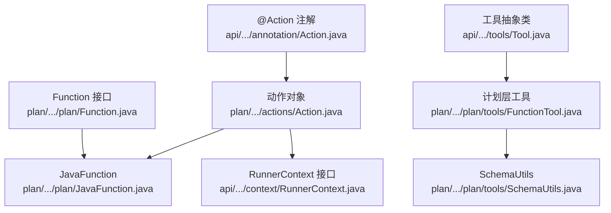

# 自定义动作开发

<cite>
**本文引用的文件**
- [Action.java](file://api/src/main/java/org/apache/flink/agents/api/annotation/Action.java)
- [Tool.java](file://api/src/main/java/org/apache/flink/agents/api/tools/Tool.java)
- [FunctionTool.java（API）](file://api/src/main/java/org/apache/flink/agents/api/tools/FunctionTool.java)
- [ToolMetadata.java](file://api/src/main/java/org/apache/flink/agents/api/tools/ToolMetadata.java)
- [ToolParameters.java](file://api/src/main/java/org/apache/flink/agents/api/tools/ToolParameters.java)
- [RunnerContext.java](file://api/src/main/java/org/apache/flink/agents/api/context/RunnerContext.java)
- [Action.java（计划层）](file://plan/src/main/java/org/apache/flink/agents/plan/actions/Action.java)
- [Function.java](file://plan/src/main/java/org/apache/flink/agents/plan/Function.java)
- [JavaFunction.java](file://plan/src/main/java/org/apache/flink/agents/plan/JavaFunction.java)
- [FunctionTool.java（计划层）](file://plan/src/main/java/org/apache/flink/agents/plan/tools/FunctionTool.java)
- [SchemaUtils.java](file://plan/src/main/java/org/apache/flink/agents/plan/tools/SchemaUtils.java)
- [TestAction.java](file://plan/src/test/java/org/apache/flink/agents/plan/TestAction.java)
- [FunctionToolPlanTest.java](file://plan/src/test/java/org/apache/flink/agents/plan/FunctionToolPlanTest.java)
</cite>

## 目录
1. [简介](#简介)
2. [项目结构](#项目结构)
3. [核心组件](#核心组件)
4. [架构总览](#架构总览)
5. [详细组件分析](#详细组件分析)
6. [依赖关系分析](#依赖关系分析)
7. [性能考量](#性能考量)
8. [故障排查指南](#故障排查指南)
9. [结论](#结论)
10. [附录：开发示例与最佳实践](#附录开发示例与最佳实践)

## 简介
本指南面向希望在 Apache Flink Agents 中开发“自定义动作”的工程师，系统讲解从需求分析到实现、注册、签名验证、事件监听、函数绑定、测试与部署的全流程。文档重点覆盖以下主题：
- 动作接口与注解：如何通过注解标记动作方法并声明监听事件类型
- 函数绑定与签名验证：如何将静态方法绑定为工具，并进行参数类型与返回值约束校验
- 注册与集成：如何通过 Agent 计划模块完成资源扫描、工具封装与执行
- 测试策略：单元测试、集成测试与参数转换测试
- 版本与兼容：向后兼容与迁移策略
- 最佳实践：代码组织、错误处理与性能优化

## 项目结构
Flink Agents 将“动作”相关能力分为三层：
- API 层：定义注解、工具抽象类、参数容器、上下文接口等用户直接使用的 API
- 计划层（Plan）：负责将 API 层对象序列化/反序列化、生成工具元数据、执行函数签名校验与绑定
- 运行时层（Runtime）：负责在 Flink 作业中调度动作、事件分发、状态持久化与度量

下图展示了与“自定义动作”开发最相关的模块与文件：

图表来源
- [Action.java（API）](file://api/src/main/java/org/apache/flink/agents/api/annotation/Action.java#L28-L53)
- [Action.java（计划层）](file://plan/src/main/java/org/apache/flink/agents/plan/actions/Action.java#L35-L100)
- [Tool.java（API）](file://api/src/main/java/org/apache/flink/agents/api/tools/Tool.java#L26-L70)
- [FunctionTool.java（API）](file://api/src/main/java/org/apache/flink/agents/api/tools/FunctionTool.java#L26-L43)
- [ToolMetadata.java](file://api/src/main/java/org/apache/flink/agents/api/tools/ToolMetadata.java#L27-L89)
- [ToolParameters.java](file://api/src/main/java/org/apache/flink/agents/api/tools/ToolParameters.java#L28-L123)
- [RunnerContext.java](file://api/src/main/java/org/apache/flink/agents/api/context/RunnerContext.java#L29-L138)
- [Function.java](file://plan/src/main/java/org/apache/flink/agents/plan/Function.java#L20-L28)
- [JavaFunction.java](file://plan/src/main/java/org/apache/flink/agents/plan/JavaFunction.java#L27-L128)
- [FunctionTool.java（计划层）](file://plan/src/main/java/org/apache/flink/agents/plan/tools/FunctionTool.java#L40-L142)
- [SchemaUtils.java](file://plan/src/main/java/org/apache/flink/agents/plan/tools/SchemaUtils.java#L34-L97)
- [TestAction.java](file://plan/src/test/java/org/apache/flink/agents/plan/TestAction.java#L28-L58)
- [FunctionToolPlanTest.java](file://plan/src/test/java/org/apache/flink/agents/plan/FunctionToolPlanTest.java#L42-L125)

章节来源
- [Action.java（API）](file://api/src/main/java/org/apache/flink/agents/api/annotation/Action.java#L28-L53)
- [Action.java（计划层）](file://plan/src/main/java/org/apache/flink/agents/plan/actions/Action.java#L35-L100)
- [Tool.java（API）](file://api/src/main/java/org/apache/flink/agents/api/tools/Tool.java#L26-L70)
- [FunctionTool.java（API）](file://api/src/main/java/org/apache/flink/agents/api/tools/FunctionTool.java#L26-L43)
- [ToolMetadata.java](file://api/src/main/java/org/apache/flink/agents/api/tools/ToolMetadata.java#L27-L89)
- [ToolParameters.java](file://api/src/main/java/org/apache/flink/agents/api/tools/ToolParameters.java#L28-L123)
- [RunnerContext.java](file://api/src/main/java/org/apache/flink/agents/api/context/RunnerContext.java#L29-L138)
- [Function.java](file://plan/src/main/java/org/apache/flink/agents/plan/Function.java#L20-L28)
- [JavaFunction.java](file://plan/src/main/java/org/apache/flink/agents/plan/JavaFunction.java#L27-L128)
- [FunctionTool.java（计划层）](file://plan/src/main/java/org/apache/flink/agents/plan/tools/FunctionTool.java#L40-L142)
- [SchemaUtils.java](file://plan/src/main/java/org/apache/flink/agents/plan/tools/SchemaUtils.java#L34-L97)
- [TestAction.java](file://plan/src/test/java/org/apache/flink/agents/plan/TestAction.java#L28-L58)
- [FunctionToolPlanTest.java](file://plan/src/test/java/org/apache/flink/agents/plan/FunctionToolPlanTest.java#L42-L125)

## 核心组件
- 动作注解与事件监听
  - 使用注解标记方法为动作，并声明其监听的事件类型数组
  - 运行时根据事件类型路由到对应动作
- 工具抽象与工具元数据
  - 工具抽象类提供统一的调用入口与元数据访问
  - 元数据包含名称、描述与输入参数的 JSON Schema
- 参数容器与类型转换
  - 提供类型安全的参数读取与常见类型转换逻辑
- 执行上下文
  - 提供发送事件、内存访问、指标组、资源获取、配置读取与持久化执行等能力
- 函数绑定与签名验证
  - 将静态方法包装为可执行函数
  - 在计划层对函数签名进行严格校验，确保与动作期望一致

章节来源
- [Action.java（API）](file://api/src/main/java/org/apache/flink/agents/api/annotation/Action.java#L28-L53)
- [Tool.java（API）](file://api/src/main/java/org/apache/flink/agents/api/tools/Tool.java#L26-L70)
- [ToolMetadata.java](file://api/src/main/java/org/apache/flink/agents/api/tools/ToolMetadata.java#L27-L89)
- [ToolParameters.java](file://api/src/main/java/org/apache/flink/agents/api/tools/ToolParameters.java#L28-L123)
- [RunnerContext.java](file://api/src/main/java/org/apache/flink/agents/api/context/RunnerContext.java#L29-L138)
- [Function.java](file://plan/src/main/java/org/apache/flink/agents/plan/Function.java#L20-L28)
- [JavaFunction.java](file://plan/src/main/java/org/apache/flink/agents/plan/JavaFunction.java#L27-L128)

## 架构总览
下图展示了“自定义动作”的端到端执行路径：从动作方法被标注，到计划层生成动作与工具，再到运行时执行与事件分发。

图表来源
- [Action.java（API）](file://api/src/main/java/org/apache/flink/agents/api/annotation/Action.java#L28-L53)
- [Action.java（计划层）](file://plan/src/main/java/org/apache/flink/agents/plan/actions/Action.java#L35-L100)
- [Function.java](file://plan/src/main/java/org/apache/flink/agents/plan/Function.java#L20-L28)
- [JavaFunction.java](file://plan/src/main/java/org/apache/flink/agents/plan/JavaFunction.java#L27-L128)
- [FunctionTool.java（计划层）](file://plan/src/main/java/org/apache/flink/agents/plan/tools/FunctionTool.java#L40-L142)
- [RunnerContext.java](file://api/src/main/java/org/apache/flink/agents/api/context/RunnerContext.java#L29-L138)

## 详细组件分析

### 动作接口与事件监听
- 动作注解用于标记方法为动作，并声明监听的事件类型数组
- 计划层的动作对象会校验绑定的函数签名是否满足固定参数类型顺序与数量要求
- 运行时根据事件类型匹配到具体动作并执行

图表来源
- [Action.java（API）](file://api/src/main/java/org/apache/flink/agents/api/annotation/Action.java#L28-L53)
- [Action.java（计划层）](file://plan/src/main/java/org/apache/flink/agents/plan/actions/Action.java#L35-L100)

章节来源
- [Action.java（API）](file://api/src/main/java/org/apache/flink/agents/api/annotation/Action.java#L28-L53)
- [Action.java（计划层）](file://plan/src/main/java/org/apache/flink/agents/plan/actions/Action.java#L35-L100)
- [TestAction.java](file://plan/src/test/java/org/apache/flink/agents/plan/TestAction.java#L34-L56)

### 工具抽象与工具元数据
- 工具抽象类提供统一的调用入口与元数据访问
- 工具元数据包含名称、描述与输入参数的 JSON Schema
- 计划层支持从静态方法生成工具，并自动推导参数 Schema

图表来源
- [Tool.java（API）](file://api/src/main/java/org/apache/flink/agents/api/tools/Tool.java#L26-L70)
- [ToolMetadata.java](file://api/src/main/java/org/apache/flink/agents/api/tools/ToolMetadata.java#L27-L89)
- [FunctionTool.java（计划层）](file://plan/src/main/java/org/apache/flink/agents/plan/tools/FunctionTool.java#L40-L142)
- [ToolParameters.java](file://api/src/main/java/org/apache/flink/agents/api/tools/ToolParameters.java#L28-L123)

章节来源
- [Tool.java（API）](file://api/src/main/java/org/apache/flink/agents/api/tools/Tool.java#L26-L70)
- [ToolMetadata.java](file://api/src/main/java/org/apache/flink/agents/api/tools/ToolMetadata.java#L27-L89)
- [FunctionTool.java（计划层）](file://plan/src/main/java/org/apache/flink/agents/plan/tools/FunctionTool.java#L40-L142)
- [SchemaUtils.java](file://plan/src/main/java/org/apache/flink/agents/plan/tools/SchemaUtils.java#L34-L97)
- [FunctionToolPlanTest.java](file://plan/src/test/java/org/apache/flink/agents/plan/FunctionToolPlanTest.java#L42-L125)

### 函数绑定与签名验证
- 静态方法通过计划层工具封装为可执行函数
- 计划层对函数签名进行严格校验，确保参数个数与类型兼容
- 动作对象在构造时再次校验函数签名以匹配事件与上下文参数

图表来源
- [JavaFunction.java](file://plan/src/main/java/org/apache/flink/agents/plan/JavaFunction.java#L110-L126)
- [Action.java（计划层）](file://plan/src/main/java/org/apache/flink/agents/plan/actions/Action.java#L61-L62)
- [TestAction.java](file://plan/src/test/java/org/apache/flink/agents/plan/TestAction.java#L46-L56)

章节来源
- [JavaFunction.java](file://plan/src/main/java/org/apache/flink/agents/plan/JavaFunction.java#L110-L126)
- [Action.java（计划层）](file://plan/src/main/java/org/apache/flink/agents/plan/actions/Action.java#L61-L62)
- [TestAction.java](file://plan/src/test/java/org/apache/flink/agents/plan/TestAction.java#L34-L56)

### 执行上下文与事件分发
- 执行上下文提供发送事件、内存访问、指标组、资源获取、配置读取与持久化执行等能力
- 动作方法签名需满足固定参数类型顺序与数量要求，以便运行时正确注入事件与上下文

图表来源
- [RunnerContext.java](file://api/src/main/java/org/apache/flink/agents/api/context/RunnerContext.java#L29-L138)

章节来源
- [RunnerContext.java](file://api/src/main/java/org/apache/flink/agents/api/context/RunnerContext.java#L29-L138)

## 依赖关系分析
- API 层与计划层的耦合点主要体现在：
  - 动作注解与计划层动作对象的签名校验
  - 工具抽象类与计划层工具实现之间的元数据与参数映射
  - 函数接口与 JavaFunction 实现之间的绑定与反射调用
- 运行时层通过 RunnerContext 统一访问资源与内存，避免直接依赖 API 层细节

图表来源
- [Action.java（API）](file://api/src/main/java/org/apache/flink/agents/api/annotation/Action.java#L28-L53)
- [Action.java（计划层）](file://plan/src/main/java/org/apache/flink/agents/plan/actions/Action.java#L35-L100)
- [Tool.java（API）](file://api/src/main/java/org/apache/flink/agents/api/tools/Tool.java#L26-L70)
- [FunctionTool.java（计划层）](file://plan/src/main/java/org/apache/flink/agents/plan/tools/FunctionTool.java#L40-L142)
- [Function.java](file://plan/src/main/java/org/apache/flink/agents/plan/Function.java#L20-L28)
- [JavaFunction.java](file://plan/src/main/java/org/apache/flink/agents/plan/JavaFunction.java#L27-L128)
- [SchemaUtils.java](file://plan/src/main/java/org/apache/flink/agents/plan/tools/SchemaUtils.java#L34-L97)
- [RunnerContext.java](file://api/src/main/java/org/apache/flink/agents/api/context/RunnerContext.java#L29-L138)

章节来源
- [Action.java（API）](file://api/src/main/java/org/apache/flink/agents/api/annotation/Action.java#L28-L53)
- [Action.java（计划层）](file://plan/src/main/java/org/apache/flink/agents/plan/actions/Action.java#L35-L100)
- [Tool.java（API）](file://api/src/main/java/org/apache/flink/agents/api/tools/Tool.java#L26-L70)
- [FunctionTool.java（计划层）](file://plan/src/main/java/org/apache/flink/agents/plan/tools/FunctionTool.java#L40-L142)
- [Function.java](file://plan/src/main/java/org/apache/flink/agents/plan/Function.java#L20-L28)
- [JavaFunction.java](file://plan/src/main/java/org/apache/flink/agents/plan/JavaFunction.java#L27-L128)
- [SchemaUtils.java](file://plan/src/main/java/org/apache/flink/agents/plan/tools/SchemaUtils.java#L34-L97)
- [RunnerContext.java](file://api/src/main/java/org/apache/flink/agents/api/context/RunnerContext.java#L29-L138)

## 性能考量
- 反射调用成本：JavaFunction 在首次调用时通过反射解析 Method 并缓存，后续调用避免重复反射开销
- 参数映射与类型转换：参数容器提供常见类型转换，尽量减少装箱拆箱与字符串转换次数
- 异步持久化执行：RunnerContext 支持异步持久化执行，降低阻塞时间；JDK 21+ 使用 Continuation 提升吞吐
- 事件路由与序列化：动作与工具采用 JSON 序列化/反序列化，注意 Schema 复杂度与字段数量，避免过深嵌套

## 故障排查指南
- 动作签名不匹配
  - 现象：创建动作时报参数个数或类型不匹配
  - 原因：函数签名未满足固定参数类型顺序与数量要求
  - 处理：核对函数签名与计划层校验逻辑，确保参数类型兼容
  - 参考
    - [JavaFunction.java](file://plan/src/main/java/org/apache/flink/agents/plan/JavaFunction.java#L110-L126)
    - [Action.java（计划层）](file://plan/src/main/java/org/apache/flink/agents/plan/actions/Action.java#L61-L62)
    - [TestAction.java](file://plan/src/test/java/org/apache/flink/agents/plan/TestAction.java#L46-L56)
- 工具参数缺失或类型不匹配
  - 现象：工具调用返回错误或抛出异常
  - 原因：缺少必填参数或类型转换失败
  - 处理：检查 @ToolParam 的 required 与默认值、参数名映射与类型转换
  - 参考
    - [FunctionTool.java（计划层）](file://plan/src/main/java/org/apache/flink/agents/plan/tools/FunctionTool.java#L104-L136)
    - [ToolParameters.java](file://api/src/main/java/org/apache/flink/agents/api/tools/ToolParameters.java#L92-L116)
    - [FunctionToolPlanTest.java](file://plan/src/test/java/org/apache/flink/agents/plan/FunctionToolPlanTest.java#L88-L123)
- 事件监听未触发
  - 现象：动作方法未被执行
  - 原因：监听事件类型不匹配或动作未正确注册
  - 处理：确认 @Action 的 listenEvents 与实际事件类型一致
  - 参考
    - [Action.java（API）](file://api/src/main/java/org/apache/flink/agents/api/annotation/Action.java#L28-L53)

章节来源
- [JavaFunction.java](file://plan/src/main/java/org/apache/flink/agents/plan/JavaFunction.java#L110-L126)
- [Action.java（计划层）](file://plan/src/main/java/org/apache/flink/agents/plan/actions/Action.java#L61-L62)
- [TestAction.java](file://plan/src/test/java/org/apache/flink/agents/plan/TestAction.java#L46-L56)
- [FunctionTool.java（计划层）](file://plan/src/main/java/org/apache/flink/agents/plan/tools/FunctionTool.java#L104-L136)
- [ToolParameters.java](file://api/src/main/java/org/apache/flink/agents/api/tools/ToolParameters.java#L92-L116)
- [FunctionToolPlanTest.java](file://plan/src/test/java/org/apache/flink/agents/plan/FunctionToolPlanTest.java#L88-L123)
- [Action.java（API）](file://api/src/main/java/org/apache/flink/agents/api/annotation/Action.java#L28-L53)

## 结论
通过注解驱动的动作模型与严格的函数签名校验，Flink Agents 为自定义动作提供了清晰、可测试且可扩展的开发框架。结合工具元数据与参数容器，开发者可以快速构建类型安全、易于维护的动作与工具，并在运行时获得稳定的事件路由与执行体验。

## 附录：开发示例与最佳实践

### 开发示例：从需求到部署的全流程
- 需求分析
  - 明确动作职责：如“根据输入事件计算数值并发送结果事件”
  - 明确监听事件类型：如 InputEvent
  - 明确工具方法：如静态计算器工具，支持加减乘除与参数校验
- 设计与实现
  - 定义动作方法并标注 @Action，声明监听事件类型
  - 定义静态工具方法并标注 @Tool 与 @ToolParam，生成输入 Schema
  - 在 Agent 中通过计划层工具封装方法，生成工具实例
- 验证与测试
  - 单元测试：验证动作签名与工具参数映射
  - 集成测试：验证事件路由与工具执行
  - 参数转换测试：验证类型转换与错误处理
- 部署与运维
  - 将 Agent 与动作打包为可序列化的 AgentPlan
  - 在运行时通过 RunnerContext 发送事件与访问资源
- 参考
  - [Action.java（API）](file://api/src/main/java/org/apache/flink/agents/api/annotation/Action.java#L28-L53)
  - [FunctionToolPlanTest.java](file://plan/src/test/java/org/apache/flink/agents/plan/FunctionToolPlanTest.java#L42-L125)
  - [TestAction.java](file://plan/src/test/java/org/apache/flink/agents/plan/TestAction.java#L34-L56)

### 测试策略
- 单元测试
  - 动作签名验证：确保函数签名与动作期望一致
  - 工具参数映射：验证 @ToolParam 名称映射与必填参数校验
- 集成测试
  - 事件路由：验证监听事件类型与动作执行
  - 工具执行：验证工具返回值与异常传播
- 参数转换测试
  - 类型转换：验证字符串到数值类型的转换
  - 错误处理：验证缺失参数与非法参数的处理
- 参考
  - [TestAction.java](file://plan/src/test/java/org/apache/flink/agents/plan/TestAction.java#L34-L56)
  - [FunctionToolPlanTest.java](file://plan/src/test/java/org/apache/flink/agents/plan/FunctionToolPlanTest.java#L88-L123)
  - [ToolParameters.java](file://api/src/main/java/org/apache/flink/agents/api/tools/ToolParameters.java#L92-L116)

### 版本管理与兼容性
- 向后兼容
  - 保持函数签名稳定，新增参数使用默认值并标记为可选
  - 工具元数据 Schema 保持兼容，避免破坏已有工具调用
- 迁移策略
  - 逐步替换旧签名，提供过渡期的兼容适配器
  - 在计划层保留历史签名的兼容解析逻辑
- 参考
  - [JavaFunction.java](file://plan/src/main/java/org/apache/flink/agents/plan/JavaFunction.java#L110-L126)
  - [ToolMetadata.java](file://api/src/main/java/org/apache/flink/agents/api/tools/ToolMetadata.java#L27-L89)

### 最佳实践
- 代码组织
  - 将动作方法集中于 Agent 子类，按功能域划分静态工具方法
  - 使用 @ToolParam 清晰表达参数语义与默认值
- 错误处理
  - 在工具方法内部显式抛出业务异常，由计划层封装为 ToolResponse
  - 对缺失参数与类型不匹配进行明确提示
- 性能优化
  - 避免在动作中进行重型 I/O 操作，必要时使用 RunnerContext 的异步持久化执行
  - 控制工具 Schema 的复杂度，减少序列化与反序列化开销
- 参考
  - [RunnerContext.java](file://api/src/main/java/org/apache/flink/agents/api/context/RunnerContext.java#L112-L133)
  - [FunctionTool.java（计划层）](file://plan/src/main/java/org/apache/flink/agents/plan/tools/FunctionTool.java#L104-L136)