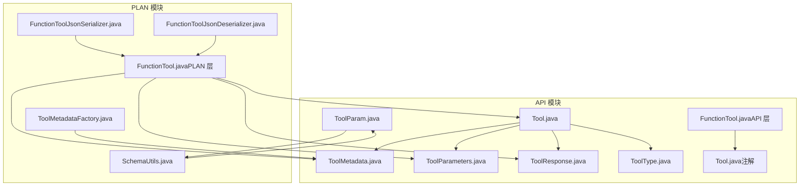
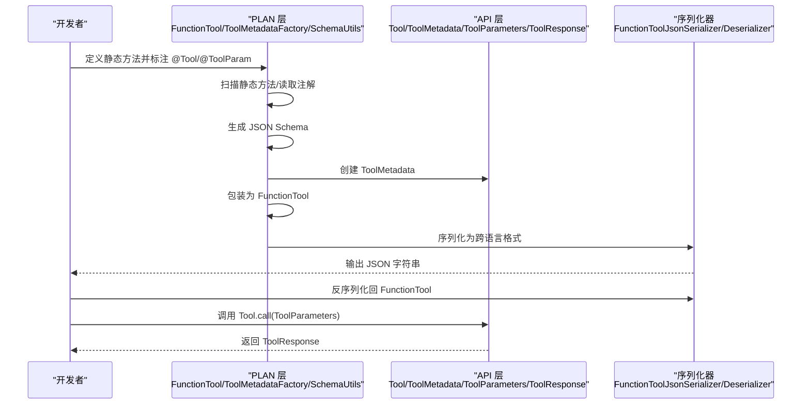
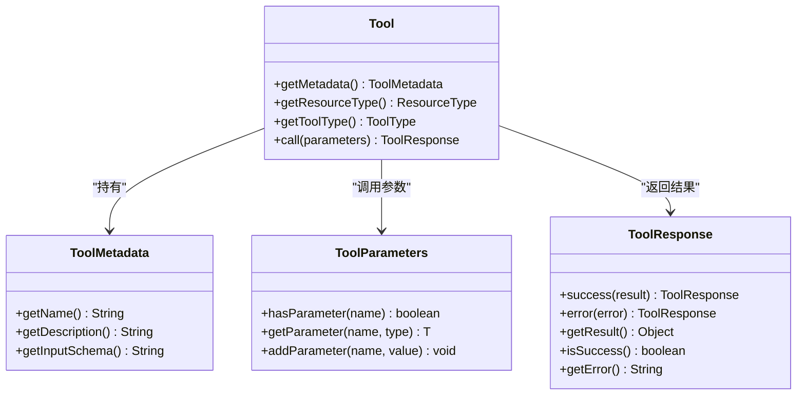
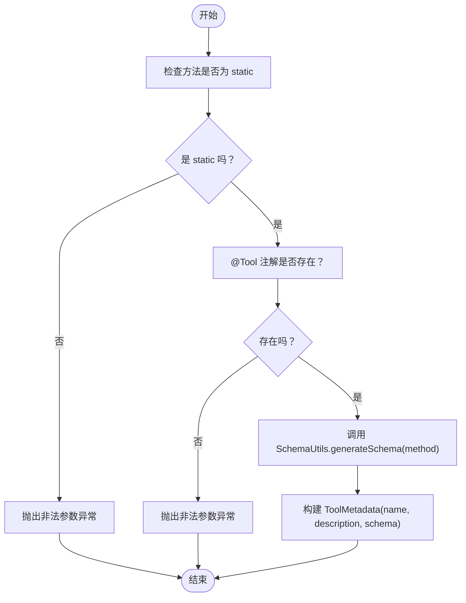
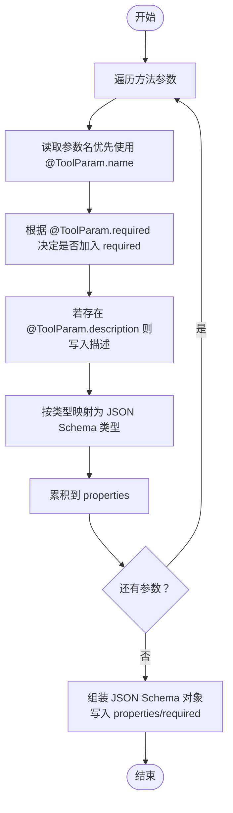
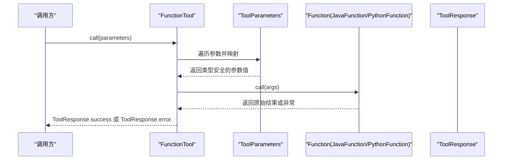
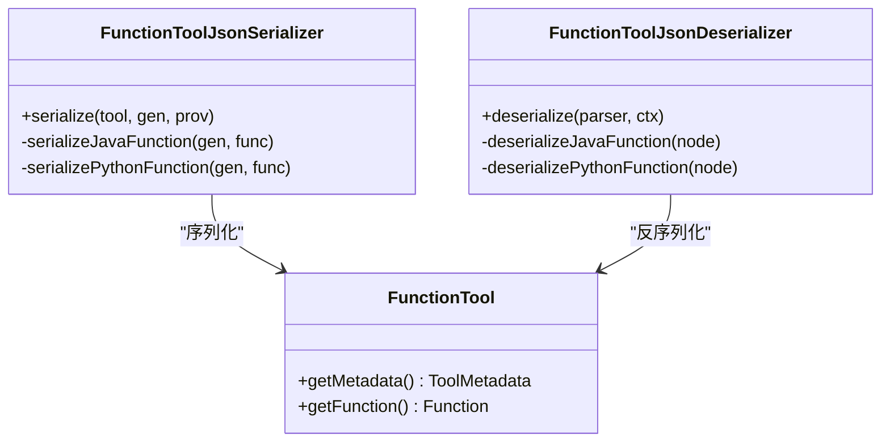
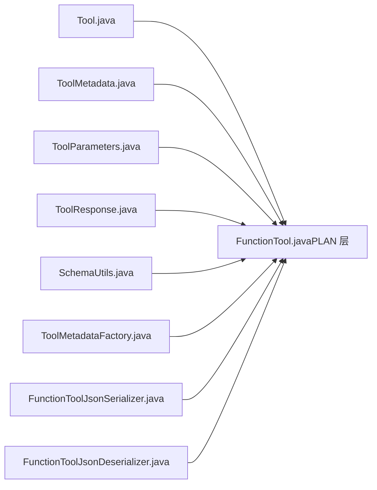

# 工具系统

<cite>
**本文引用的文件**
- [FunctionTool.java](file://plan/src/main/java/org/apache/flink/agents/plan/tools/FunctionTool.java)
- [ToolMetadataFactory.java](file://plan/src/main/java/org/apache/flink/agents/plan/tools/ToolMetadataFactory.java)
- [SchemaUtils.java](file://plan/src/main/java/org/apache/flink/agents/plan/tools/SchemaUtils.java)
- [FunctionToolJsonSerializer.java](file://plan/src/main/java/org/apache/flink/agents/plan/tools/serializer/FunctionToolJsonSerializer.java)
- [FunctionToolJsonDeserializer.java](file://plan/src/main/java/org/apache/flink/agents/plan/tools/serializer/FunctionToolJsonDeserializer.java)
- [FunctionToolTest.java](file://plan/src/test/java/org/apache/flink/agents/plan/tools/FunctionToolTest.java)
- [SchemaUtilsTest.java](file://plan/src/test/java/org/apache/flink/agents/plan/tools/SchemaUtilsTest.java)
- [Tool.java](file://api/src/main/java/org/apache/flink/agents/api/tools/Tool.java)
- [FunctionTool.java（API 层）](file://api/src/main/java/org/apache/flink/agents/api/tools/FunctionTool.java)
- [ToolMetadata.java](file://api/src/main/java/org/apache/flink/agents/api/tools/ToolMetadata.java)
- [ToolParameters.java](file://api/src/main/java/org/apache/flink/agents/api/tools/ToolParameters.java)
- [ToolResponse.java](file://api/src/main/java/org/apache/flink/agents/api/tools/ToolResponse.java)
- [ToolType.java](file://api/src/main/java/org/apache/flink/agents/api/tools/ToolType.java)
- [Tool.java（注解）](file://api/src/main/java/org/apache/flink/agents/api/annotation/Tool.java)
- [ToolParam.java](file://api/src/main/java/org/apache/flink/agents/api/annotation/ToolParam.java)
</cite>

## 目录
1. [简介](#简介)
2. [项目结构](#项目结构)
3. [核心组件](#核心组件)
4. [架构总览](#架构总览)
5. [组件详解](#组件详解)
6. [依赖关系分析](#依赖关系分析)
7. [性能与可扩展性](#性能与可扩展性)
8. [故障排查指南](#故障排查指南)
9. [结论](#结论)
10. [附录：开发与使用指南](#附录开发与使用指南)

## 简介
本文件面向 Apache Flink Agents 的“工具系统”，系统性阐述函数工具的设计理念与实现机制，覆盖以下主题：
- 工具元数据提取：通过注解与反射生成工具元数据
- 参数类型推断与输入校验：基于方法签名与注解生成 JSON Schema，并进行类型转换
- 返回值处理：统一的成功/失败响应模型
- 序列化机制：跨语言（Java/Python）传递工具定义
- 注册与发现：静态方法扫描、动态加载与版本兼容
- 自定义工具开发：接口实现、参数校验与错误处理最佳实践
- 性能优化与调试技巧：参数映射、类型转换与序列化开销控制

## 项目结构
工具系统主要分布在两个模块：
- API 模块：定义工具抽象、元数据、参数容器、响应模型与注解
- PLAN 模块：实现工具的元数据工厂、Schema 生成、函数工具包装与序列化器

图表来源
- [Tool.java](file://api/src/main/java/org/apache/flink/agents/api/tools/Tool.java#L30-L68)
- [FunctionTool.java（PLAN 层）](file://plan/src/main/java/org/apache/flink/agents/plan/tools/FunctionTool.java#L47-L141)
- [ToolMetadataFactory.java](file://plan/src/main/java/org/apache/flink/agents/plan/tools/ToolMetadataFactory.java#L34-L52)
- [SchemaUtils.java](file://plan/src/main/java/org/apache/flink/agents/plan/tools/SchemaUtils.java#L34-L96)
- [FunctionToolJsonSerializer.java](file://plan/src/main/java/org/apache/flink/agents/plan/tools/serializer/FunctionToolJsonSerializer.java#L34-L90)
- [FunctionToolJsonDeserializer.java](file://plan/src/main/java/org/apache/flink/agents/plan/tools/serializer/FunctionToolJsonDeserializer.java#L38-L99)

章节来源
- [Tool.java](file://api/src/main/java/org/apache/flink/agents/api/tools/Tool.java#L30-L68)
- [FunctionTool.java（PLAN 层）](file://plan/src/main/java/org/apache/flink/agents/plan/tools/FunctionTool.java#L47-L141)
- [ToolMetadataFactory.java](file://plan/src/main/java/org/apache/flink/agents/plan/tools/ToolMetadataFactory.java#L34-L52)
- [SchemaUtils.java](file://plan/src/main/java/org/apache/flink/agents/plan/tools/SchemaUtils.java#L34-L96)
- [FunctionToolJsonSerializer.java](file://plan/src/main/java/org/apache/flink/agents/plan/tools/serializer/FunctionToolJsonSerializer.java#L34-L90)
- [FunctionToolJsonDeserializer.java](file://plan/src/main/java/org/apache/flink/agents/plan/tools/serializer/FunctionToolJsonDeserializer.java#L38-L99)

## 核心组件
- 工具抽象与类型
  - 抽象基类：Tool，定义元数据持有、资源类型、工具类型枚举与调用接口
  - 工具类型：ToolType 提供内置模型工具、函数工具、远程函数、MCP 四种类型
- 元数据与参数
  - ToolMetadata：封装名称、描述与输入 JSON Schema
  - ToolParameters：类型安全的参数容器，支持字符串到基本类型的自动转换
  - ToolResponse：统一的成功/失败响应模型，包含结果、错误信息与执行时长
- 函数工具与元数据工厂
  - FunctionTool（PLAN 层）：PLAN 层对静态方法的封装，负责参数映射、调用与异常转响应
  - ToolMetadataFactory：从静态方法生成 ToolMetadata（含 Schema）
  - SchemaUtils：从方法签名与参数注解生成 JSON Schema
- 序列化与反序列化
  - FunctionToolJsonSerializer/Deserializer：将 FunctionTool 及其函数体序列化为跨语言可识别格式

章节来源
- [Tool.java](file://api/src/main/java/org/apache/flink/agents/api/tools/Tool.java#L30-L68)
- [ToolType.java](file://api/src/main/java/org/apache/flink/agents/api/tools/ToolType.java#L22-L58)
- [ToolMetadata.java](file://api/src/main/java/org/apache/flink/agents/api/tools/ToolMetadata.java#L32-L88)
- [ToolParameters.java](file://api/src/main/java/org/apache/flink/agents/api/tools/ToolParameters.java#L28-L122)
- [ToolResponse.java](file://api/src/main/java/org/apache/flink/agents/api/tools/ToolResponse.java#L27-L183)
- [FunctionTool.java（PLAN 层）](file://plan/src/main/java/org/apache/flink/agents/plan/tools/FunctionTool.java#L47-L141)
- [ToolMetadataFactory.java](file://plan/src/main/java/org/apache/flink/agents/plan/tools/ToolMetadataFactory.java#L34-L52)
- [SchemaUtils.java](file://plan/src/main/java/org/apache/flink/agents/plan/tools/SchemaUtils.java#L34-L96)
- [FunctionToolJsonSerializer.java](file://plan/src/main/java/org/apache/flink/agents/plan/tools/serializer/FunctionToolJsonSerializer.java#L34-L90)
- [FunctionToolJsonDeserializer.java](file://plan/src/main/java/org/apache/flink/agents/plan/tools/serializer/FunctionToolJsonDeserializer.java#L38-L99)

## 架构总览
工具系统围绕“元数据驱动 + 类型安全 + 跨语言序列化”展开。PLAN 层负责从用户静态方法中抽取元数据与 Schema，并将方法包装为可执行工具；API 层提供通用的工具抽象与响应模型；序列化器保证工具定义在 Java 与 Python 之间的稳定传递。

图表来源
- [FunctionTool.java（PLAN 层）](file://plan/src/main/java/org/apache/flink/agents/plan/tools/FunctionTool.java#L57-L97)
- [ToolMetadataFactory.java](file://plan/src/main/java/org/apache/flink/agents/plan/tools/ToolMetadataFactory.java#L36-L52)
- [SchemaUtils.java](file://plan/src/main/java/org/apache/flink/agents/plan/tools/SchemaUtils.java#L36-L77)
- [FunctionToolJsonSerializer.java](file://plan/src/main/java/org/apache/flink/agents/plan/tools/serializer/FunctionToolJsonSerializer.java#L42-L63)
- [FunctionToolJsonDeserializer.java](file://plan/src/main/java/org/apache/flink/agents/plan/tools/serializer/FunctionToolJsonDeserializer.java#L44-L65)
- [Tool.java](file://api/src/main/java/org/apache/flink/agents/api/tools/Tool.java#L52-L53)
- [ToolParameters.java](file://api/src/main/java/org/apache/flink/agents/api/tools/ToolParameters.java#L47-L61)
- [ToolResponse.java](file://api/src/main/java/org/apache/flink/agents/api/tools/ToolResponse.java#L44-L101)

## 组件详解

### 工具抽象与类型体系
- Tool 抽象类持有 ToolMetadata，提供资源类型标识与工具类型枚举
- ToolType 支持四种工具类型，便于运行时路由与协议适配
- ToolResponse 提供成功/错误两类响应，支持结果类型转换与执行时长统计

图表来源
- [Tool.java](file://api/src/main/java/org/apache/flink/agents/api/tools/Tool.java#L30-L68)
- [ToolMetadata.java](file://api/src/main/java/org/apache/flink/agents/api/tools/ToolMetadata.java#L32-L88)
- [ToolParameters.java](file://api/src/main/java/org/apache/flink/agents/api/tools/ToolParameters.java#L28-L122)
- [ToolResponse.java](file://api/src/main/java/org/apache/flink/agents/api/tools/ToolResponse.java#L27-L183)

章节来源
- [Tool.java](file://api/src/main/java/org/apache/flink/agents/api/tools/Tool.java#L30-L68)
- [ToolType.java](file://api/src/main/java/org/apache/flink/agents/api/tools/ToolType.java#L22-L58)
- [ToolMetadata.java](file://api/src/main/java/org/apache/flink/agents/api/tools/ToolMetadata.java#L32-L88)
- [ToolParameters.java](file://api/src/main/java/org/apache/flink/agents/api/tools/ToolParameters.java#L28-L122)
- [ToolResponse.java](file://api/src/main/java/org/apache/flink/agents/api/tools/ToolResponse.java#L27-L183)

### ToolMetadataFactory：元数据生成算法
- 输入：静态方法（必须为 static，且被 @Tool 标注）
- 输出：ToolMetadata（name/description/inputSchema）
- 关键步骤：
  - 校验方法修饰符与注解存在性
  - 使用 SchemaUtils 生成 JSON Schema
  - 组装 ToolMetadata 并返回

图表来源
- [ToolMetadataFactory.java](file://plan/src/main/java/org/apache/flink/agents/plan/tools/ToolMetadataFactory.java#L36-L52)
- [SchemaUtils.java](file://plan/src/main/java/org/apache/flink/agents/plan/tools/SchemaUtils.java#L36-L77)

章节来源
- [ToolMetadataFactory.java](file://plan/src/main/java/org/apache/flink/agents/plan/tools/ToolMetadataFactory.java#L34-L52)
- [SchemaUtils.java](file://plan/src/main/java/org/apache/flink/agents/plan/tools/SchemaUtils.java#L34-L96)

### SchemaUtils：JSON Schema 生成与类型推断
- 输入：java.lang.reflect.Method
- 输出：JSON Schema 字符串（对象类型，包含 properties 与 required）
- 类型映射规则：
  - String → string
  - int/Integer → integer
  - double/Double → number
  - boolean/Boolean → boolean
  - 其他 → object
- 参数注解处理：
  - ToolParam.name 覆盖参数名
  - ToolParam.required 决定 required 列表
  - ToolParam.description 注入参数描述
- 复杂对象参数默认映射为 object 类型，便于跨语言传输

图表来源
- [SchemaUtils.java](file://plan/src/main/java/org/apache/flink/agents/plan/tools/SchemaUtils.java#L36-L96)
- [ToolParam.java](file://api/src/main/java/org/apache/flink/agents/api/annotation/ToolParam.java#L32-L63)

章节来源
- [SchemaUtils.java](file://plan/src/main/java/org/apache/flink/agents/plan/tools/SchemaUtils.java#L34-L96)
- [ToolParam.java](file://api/src/main/java/org/apache/flink/agents/api/annotation/ToolParam.java#L32-L63)

### FunctionTool：参数映射、调用与错误处理
- 仅支持 static 方法；否则抛出非法参数异常
- 从 ToolMetadata 与 Function（JavaFunction/PythonFunction）构造
- 调用流程：
  - 解析 ToolParameters，按参数名与类型映射
  - 若参数带 @ToolParam 且未提供值：
    - required=true 且无 defaultValue，则抛出缺失参数异常
    - 否则按类型尝试转换或保留 null
  - 调用底层 Function.call(args)，返回 ToolResponse.success 或 ToolResponse.error

图表来源
- [FunctionTool.java（PLAN 层）](file://plan/src/main/java/org/apache/flink/agents/plan/tools/FunctionTool.java#L104-L136)
- [ToolParameters.java](file://api/src/main/java/org/apache/flink/agents/api/tools/ToolParameters.java#L47-L61)
- [ToolResponse.java](file://api/src/main/java/org/apache/flink/agents/api/tools/ToolResponse.java#L44-L101)

章节来源
- [FunctionTool.java（PLAN 层）](file://plan/src/main/java/org/apache/flink/agents/plan/tools/FunctionTool.java#L57-L141)
- [ToolParameters.java](file://api/src/main/java/org/apache/flink/agents/api/tools/ToolParameters.java#L28-L122)
- [ToolResponse.java](file://api/src/main/java/org/apache/flink/agents/api/tools/ToolResponse.java#L27-L183)

### 序列化机制：跨语言传递工具定义
- 序列化目标：FunctionTool（包含 ToolMetadata 与 Function）
- 支持两种函数类型：
  - JavaFunction：记录类全名、方法名与参数类型数组（字符串形式）
  - PythonFunction：记录模块名与限定名
- 反序列化时根据 func_type 选择对应构造路径，并通过上下文类加载器恢复参数类型

图表来源
- [FunctionToolJsonSerializer.java](file://plan/src/main/java/org/apache/flink/agents/plan/tools/serializer/FunctionToolJsonSerializer.java#L34-L90)
- [FunctionToolJsonDeserializer.java](file://plan/src/main/java/org/apache/flink/agents/plan/tools/serializer/FunctionToolJsonDeserializer.java#L38-L99)
- [FunctionTool.java（PLAN 层）](file://plan/src/main/java/org/apache/flink/agents/plan/tools/FunctionTool.java#L47-L141)

章节来源
- [FunctionToolJsonSerializer.java](file://plan/src/main/java/org/apache/flink/agents/plan/tools/serializer/FunctionToolJsonSerializer.java#L34-L90)
- [FunctionToolJsonDeserializer.java](file://plan/src/main/java/org/apache/flink/agents/plan/tools/serializer/FunctionToolJsonDeserializer.java#L38-L99)
- [FunctionTool.java（PLAN 层）](file://plan/src/main/java/org/apache/flink/agents/plan/tools/FunctionTool.java#L47-L141)

### 注册与发现流程：动态加载与依赖注入
- 方法级注解：@Tool 标注静态方法，ToolMetadataFactory 用于从该方法生成 ToolMetadata
- 字段级注解：@Tool 标注字段，由上层计划模块扫描并创建资源提供者
- 动态加载：反序列化时通过上下文类加载器恢复 Java 参数类型
- 版本管理：工具类型与函数类型以稳定字符串标识，便于跨版本兼容

章节来源
- [Tool.java（注解）](file://api/src/main/java/org/apache/flink/agents/api/annotation/Tool.java#L26-L42)
- [ToolMetadataFactory.java](file://plan/src/main/java/org/apache/flink/agents/plan/tools/ToolMetadataFactory.java#L36-L52)
- [FunctionToolJsonDeserializer.java](file://plan/src/main/java/org/apache/flink/agents/plan/tools/serializer/FunctionToolJsonDeserializer.java#L73-L98)

## 依赖关系分析
- PLAN 层对 API 层的依赖：FunctionTool 依赖 Tool/ToolMetadata/ToolParameters/ToolResponse；ToolMetadataFactory/SchemaUtils 依赖注解与 API 元数据模型
- 序列化器对 PLAN 层的依赖：FunctionToolJsonSerializer/Deserializer 依赖 FunctionTool、JavaFunction、PythonFunction
- 测试覆盖：单元测试验证元数据与工具的序列化一致性、Schema 生成正确性与参数类型转换行为

图表来源
- [Tool.java](file://api/src/main/java/org/apache/flink/agents/api/tools/Tool.java#L30-L68)
- [ToolMetadata.java](file://api/src/main/java/org/apache/flink/agents/api/tools/ToolMetadata.java#L32-L88)
- [ToolParameters.java](file://api/src/main/java/org/apache/flink/agents/api/tools/ToolParameters.java#L28-L122)
- [ToolResponse.java](file://api/src/main/java/org/apache/flink/agents/api/tools/ToolResponse.java#L27-L183)
- [SchemaUtils.java](file://plan/src/main/java/org/apache/flink/agents/plan/tools/SchemaUtils.java#L34-L96)
- [ToolMetadataFactory.java](file://plan/src/main/java/org/apache/flink/agents/plan/tools/ToolMetadataFactory.java#L34-L52)
- [FunctionTool.java（PLAN 层）](file://plan/src/main/java/org/apache/flink/agents/plan/tools/FunctionTool.java#L47-L141)
- [FunctionToolJsonSerializer.java](file://plan/src/main/java/org/apache/flink/agents/plan/tools/serializer/FunctionToolJsonSerializer.java#L34-L90)
- [FunctionToolJsonDeserializer.java](file://plan/src/main/java/org/apache/flink/agents/plan/tools/serializer/FunctionToolJsonDeserializer.java#L38-L99)

章节来源
- [FunctionToolTest.java](file://plan/src/test/java/org/apache/flink/agents/plan/tools/FunctionToolTest.java#L52-L81)
- [SchemaUtilsTest.java](file://plan/src/test/java/org/apache/flink/agents/plan/tools/SchemaUtilsTest.java#L53-L117)

## 性能与可扩展性
- 参数映射与类型转换
  - ToolParameters 的类型转换仅覆盖常用基本类型，避免复杂转换带来的开销
  - 建议在工具方法中尽量使用明确的基本类型，减少字符串到类型的隐式转换
- 序列化与反序列化
  - 序列化器采用最小必要字段（metadata/function），避免冗余
  - 反序列化时通过上下文类加载器恢复参数类型，建议在受控环境中使用
- Schema 生成
  - 仅扫描方法参数与注解，复杂度与参数数量线性相关
  - 对于大型工具集，建议缓存已生成的 Schema，避免重复反射
- 扩展点
  - 新增工具类型：在 ToolType 中添加枚举值，并在序列化器中扩展分支
  - 新增函数类型：在序列化器中新增分支并在反序列化器中实现构造逻辑

[本节为通用指导，不直接分析具体文件]

## 故障排查指南
- 常见异常与定位
  - 非 static 方法：FunctionTool 构造时会抛出非法参数异常，确认方法是否为 static
  - 缺失必需参数：当参数带 @ToolParam(required=true) 且未提供值时抛出异常，检查调用侧参数传入
  - 类型转换失败：ToolParameters 不支持的类型转换会抛出非法参数异常，检查参数类型与字符串表示
  - 反序列化失败：FunctionToolJsonDeserializer 在参数类型无法加载或构造失败时抛出异常，检查类路径与参数类型字符串
- 单元测试参考
  - 元数据与工具序列化一致性：FunctionToolTest
  - Schema 生成正确性：SchemaUtilsTest
- 调试建议
  - 打印 ToolMetadata.inputSchema 与实际调用参数，核对 required 与类型
  - 使用 ToolResponse.isSuccess()/getError() 快速判断工具执行状态
  - 在反序列化前后对比 FunctionTool.getMetadata()/getFunction()，确保跨语言传递一致

章节来源
- [FunctionTool.java（PLAN 层）](file://plan/src/main/java/org/apache/flink/agents/plan/tools/FunctionTool.java#L104-L136)
- [ToolParameters.java](file://api/src/main/java/org/apache/flink/agents/api/tools/ToolParameters.java#L93-L116)
- [FunctionToolJsonDeserializer.java](file://plan/src/main/java/org/apache/flink/agents/plan/tools/serializer/FunctionToolJsonDeserializer.java#L73-L98)
- [FunctionToolTest.java](file://plan/src/test/java/org/apache/flink/agents/plan/tools/FunctionToolTest.java#L52-L81)
- [SchemaUtilsTest.java](file://plan/src/test/java/org/apache/flink/agents/plan/tools/SchemaUtilsTest.java#L53-L117)

## 结论
工具系统通过“注解 + 反射 + JSON Schema + 序列化”的组合，实现了从静态方法到可执行工具的自动化封装，并提供了跨语言传递能力。其设计强调：
- 明确的元数据与 Schema 驱动
- 类型安全的参数容器与响应模型
- 可扩展的工具类型与函数类型支持
- 简洁稳定的序列化协议

[本节为总结性内容，不直接分析具体文件]

## 附录：开发与使用指南

### 自定义工具开发步骤
- 步骤一：编写静态方法并标注 @Tool 与 @ToolParam
  - 示例参考：[FunctionToolTest.java](file://plan/src/test/java/org/apache/flink/agents/plan/tools/FunctionToolTest.java#L32-L50)
- 步骤二：生成元数据与 Schema
  - 使用 ToolMetadataFactory.fromStaticMethod 生成 ToolMetadata
  - 使用 SchemaUtils.generateSchema 获取 inputSchema
  - 参考：[ToolMetadataFactory.java](file://plan/src/main/java/org/apache/flink/agents/plan/tools/ToolMetadataFactory.java#L36-L52)、[SchemaUtils.java](file://plan/src/main/java/org/apache/flink/agents/plan/tools/SchemaUtils.java#L36-L77)
- 步骤三：封装为 FunctionTool 并序列化
  - 参考：[FunctionTool.java（PLAN 层）](file://plan/src/main/java/org/apache/flink/agents/plan/tools/FunctionTool.java#L57-L97)、[FunctionToolJsonSerializer.java](file://plan/src/main/java/org/apache/flink/agents/plan/tools/serializer/FunctionToolJsonSerializer.java#L42-L63)
- 步骤四：在运行时调用
  - 构造 ToolParameters，调用 Tool.call，处理 ToolResponse
  - 参考：[ToolParameters.java](file://api/src/main/java/org/apache/flink/agents/api/tools/ToolParameters.java#L47-L61)、[ToolResponse.java](file://api/src/main/java/org/apache/flink/agents/api/tools/ToolResponse.java#L44-L101)

### 参数验证与错误处理策略
- 必填参数：通过 @ToolParam(required=true) 标注，未提供时抛出缺失参数异常
- 默认值：可通过 @ToolParam(defaultValue=...) 提供，避免 required 校验
- 类型转换：ToolParameters 仅支持常见基本类型转换，复杂类型需显式传入匹配类型
- 异常捕获：FunctionTool 将异常转换为 ToolResponse.error，便于上层统一处理

章节来源
- [ToolParam.java](file://api/src/main/java/org/apache/flink/agents/api/annotation/ToolParam.java#L32-L63)
- [FunctionTool.java（PLAN 层）](file://plan/src/main/java/org/apache/flink/agents/plan/tools/FunctionTool.java#L104-L136)
- [ToolParameters.java](file://api/src/main/java/org/apache/flink/agents/api/tools/ToolParameters.java#L93-L116)
- [ToolResponse.java](file://api/src/main/java/org/apache/flink/agents/api/tools/ToolResponse.java#L85-L101)

### 使用示例（路径指引）
- 简单算术工具（含 Schema 生成与序列化）
  - 定义与元数据生成：[FunctionToolTest.java](file://plan/src/test/java/org/apache/flink/agents/plan/tools/FunctionToolTest.java#L32-L50)
  - 元数据与工具序列化测试：[FunctionToolTest.java](file://plan/src/test/java/org/apache/flink/agents/plan/tools/FunctionToolTest.java#L52-L81)
- 参数类型与 Schema 行为验证
  - 基础类型与必填项：[SchemaUtilsTest.java](file://plan/src/test/java/org/apache/flink/agents/plan/tools/SchemaUtilsTest.java#L53-L96)
  - 自定义对象参数：[SchemaUtilsTest.java](file://plan/src/test/java/org/apache/flink/agents/plan/tools/SchemaUtilsTest.java#L98-L117)