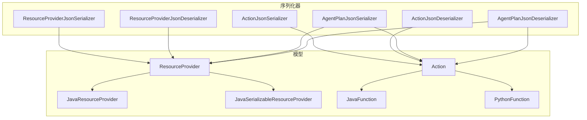
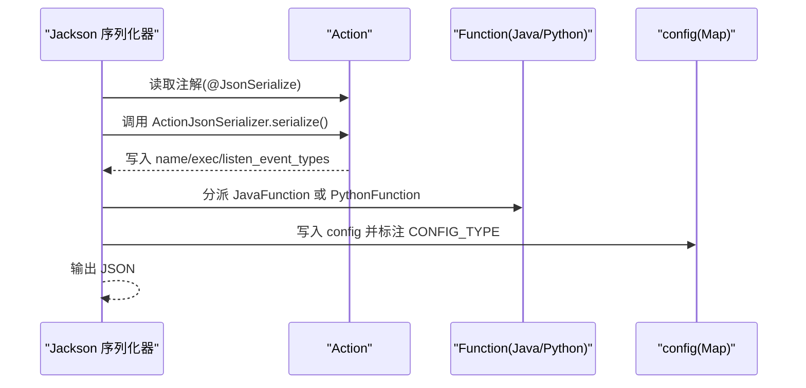
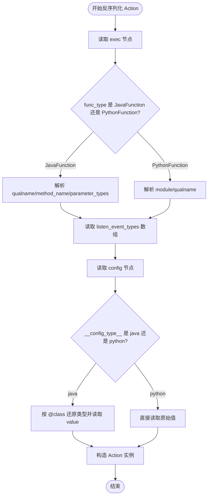
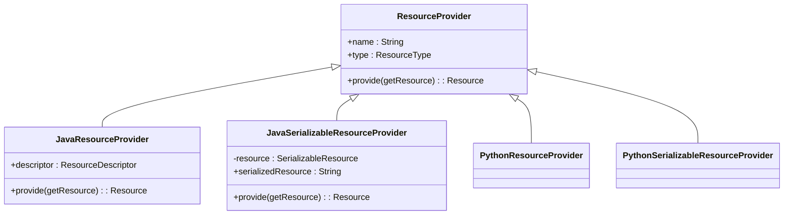
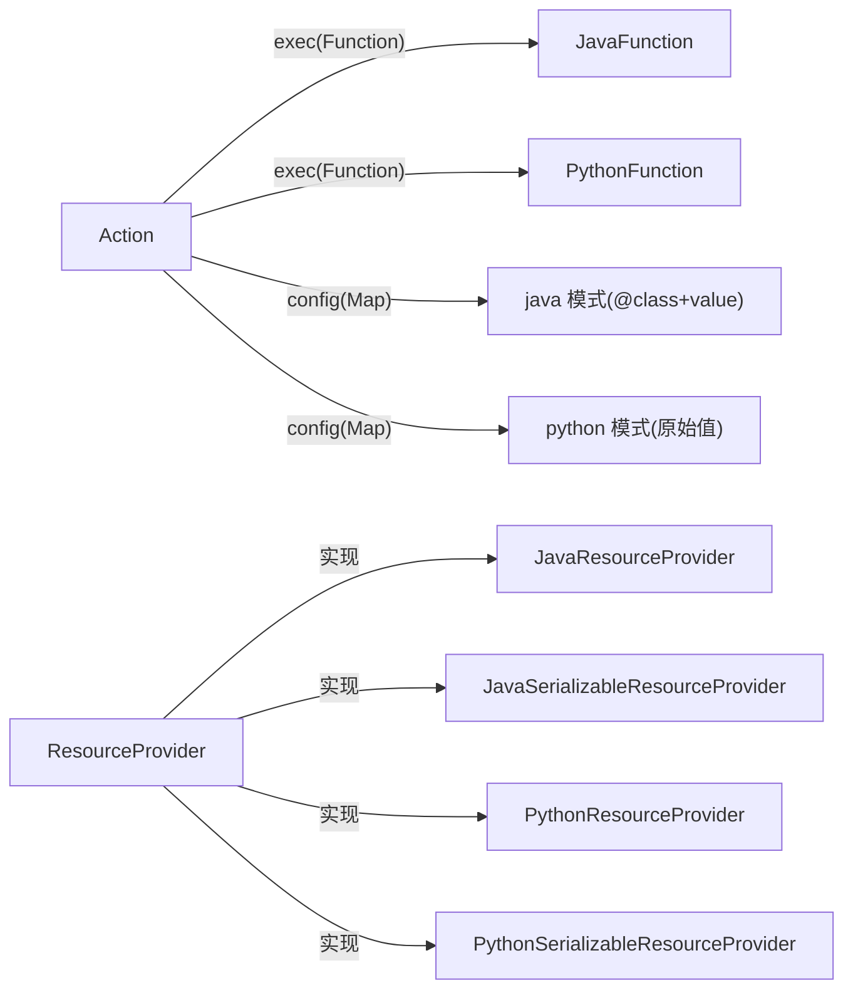

# 序列化系统

<cite>
**本文引用的文件**
- [ActionJsonSerializer.java](file://plan/src/main/java/org/apache/flink/agents/plan/serializer/ActionJsonSerializer.java)
- [ActionJsonDeserializer.java](file://plan/src/main/java/org/apache/flink/agents/plan/serializer/ActionJsonDeserializer.java)
- [ResourceProviderJsonSerializer.java](file://plan/src/main/java/org/apache/flink/agents/plan/serializer/ResourceProviderJsonSerializer.java)
- [ResourceProviderJsonDeserializer.java](file://plan/src/main/java/org/apache/flink/agents/plan/serializer/ResourceProviderJsonDeserializer.java)
- [JsonUtils.java](file://plan/src/main/java/org/apache/flink/agents/plan/utils/JsonUtils.java)
- [Action.java](file://plan/src/main/java/org/apache/flink/agents/plan/actions/Action.java)
- [ResourceProvider.java](file://plan/src/main/java/org/apache/flink/agents/plan/resourceprovider/ResourceProvider.java)
- [JavaResourceProvider.java](file://plan/src/main/java/org/apache/flink/agents/plan/resourceprovider/JavaResourceProvider.java)
- [JavaSerializableResourceProvider.java](file://plan/src/main/java/org/apache/flink/agents/plan/resourceprovider/JavaSerializableResourceProvider.java)
- [JavaFunction.java](file://plan/src/main/java/org/apache/flink/agents/plan/JavaFunction.java)
- [PythonFunction.java](file://plan/src/main/java/org/apache/flink/agents/plan/PythonFunction.java)
- [AgentPlanJsonSerializer.java](file://plan/src/main/java/org/apache/flink/agents/plan/serializer/AgentPlanJsonSerializer.java)
- [AgentPlanJsonDeserializer.java](file://plan/src/main/java/org/apache/flink/agents/plan/serializer/AgentPlanJsonDeserializer.java)
- [action_java_function.json](file://plan/src/test/resources/actions/action_java_function.json)
- [action_python_function.json](file://plan/src/test/resources/actions/action_python_function.json)
- [python_resource_provider.json](file://plan/src/test/resources/resource_providers/python_resource_provider.json)
- [python_serializable_resource_provider.json](file://plan/src/test/resources/resource_providers/python_serializable_resource_provider.json)
</cite>

## 目录
1. [简介](#简介)
2. [项目结构](#项目结构)
3. [核心组件](#核心组件)
4. [架构总览](#架构总览)
5. [组件详解](#组件详解)
6. [依赖关系分析](#依赖关系分析)
7. [性能考量](#性能考量)
8. [故障排查指南](#故障排查指南)
9. [结论](#结论)
10. [附录：使用示例与扩展指南](#附录使用示例与扩展指南)

## 简介
本文件面向 Apache Flink Agents 的序列化系统，聚焦跨语言（Java 与 Python）场景下的序列化设计与实现。内容涵盖：
- 动作 Action 的 JSON 序列化与反序列化，包括 Java/Python 函数执行体的编码与类型信息保留
- 动作配置的序列化格式与版本兼容性处理
- 资源提供者 ResourceProvider 的特殊处理逻辑（状态管理与延迟初始化）
- JsonUtils 工具类的通用辅助能力（类型安全转换与错误处理）
- 性能优化策略（对象池、缓存与内存优化）
- 扩展指南（自定义序列化器与第三方库集成）
- 使用示例与常见问题诊断

## 项目结构
序列化系统主要位于 plan 模块的 serializer 与 resourceprovider 包中，并通过 Jackson 注解与自定义序列化器实现跨语言对象的稳定持久化。

图表来源
- [ActionJsonSerializer.java](file://plan/src/main/java/org/apache/flink/agents/plan/serializer/ActionJsonSerializer.java#L35-L155)
- [ActionJsonDeserializer.java](file://plan/src/main/java/org/apache/flink/agents/plan/serializer/ActionJsonDeserializer.java#L45-L182)
- [ResourceProviderJsonSerializer.java](file://plan/src/main/java/org/apache/flink/agents/plan/serializer/ResourceProviderJsonSerializer.java#L36-L122)
- [ResourceProviderJsonDeserializer.java](file://plan/src/main/java/org/apache/flink/agents/plan/serializer/ResourceProviderJsonDeserializer.java#L43-L125)
- [AgentPlanJsonSerializer.java](file://plan/src/main/java/org/apache/flink/agents/plan/serializer/AgentPlanJsonSerializer.java#L32-L129)
- [AgentPlanJsonDeserializer.java](file://plan/src/main/java/org/apache/flink/agents/plan/serializer/AgentPlanJsonDeserializer.java#L43-L139)
- [Action.java](file://plan/src/main/java/org/apache/flink/agents/plan/actions/Action.java#L41-L43)
- [ResourceProvider.java](file://plan/src/main/java/org/apache/flink/agents/plan/resourceprovider/ResourceProvider.java#L36-L37)
- [JavaResourceProvider.java](file://plan/src/main/java/org/apache/flink/agents/plan/resourceprovider/JavaResourceProvider.java#L29-L57)
- [JavaSerializableResourceProvider.java](file://plan/src/main/java/org/apache/flink/agents/plan/resourceprovider/JavaSerializableResourceProvider.java#L36-L96)
- [JavaFunction.java](file://plan/src/main/java/org/apache/flink/agents/plan/JavaFunction.java#L28-L128)
- [PythonFunction.java](file://plan/src/main/java/org/apache/flink/agents/plan/PythonFunction.java#L25-L77)

章节来源
- [ActionJsonSerializer.java](file://plan/src/main/java/org/apache/flink/agents/plan/serializer/ActionJsonSerializer.java#L35-L155)
- [ActionJsonDeserializer.java](file://plan/src/main/java/org/apache/flink/agents/plan/serializer/ActionJsonDeserializer.java#L45-L182)
- [ResourceProviderJsonSerializer.java](file://plan/src/main/java/org/apache/flink/agents/plan/serializer/ResourceProviderJsonSerializer.java#L36-L122)
- [ResourceProviderJsonDeserializer.java](file://plan/src/main/java/org/apache/flink/agents/plan/serializer/ResourceProviderJsonDeserializer.java#L43-L125)
- [AgentPlanJsonSerializer.java](file://plan/src/main/java/org/apache/flink/agents/plan/serializer/AgentPlanJsonSerializer.java#L32-L129)
- [AgentPlanJsonDeserializer.java](file://plan/src/main/java/org/apache/flink/agents/plan/serializer/AgentPlanJsonDeserializer.java#L43-L139)

## 核心组件
- ActionJsonSerializer/ActionJsonDeserializer：负责 Action 的序列化与反序列化，支持 JavaFunction 与 PythonFunction 的区分与编码；同时处理动作配置的“类型标记”以实现 Java/Python 配置的兼容。
- ResourceProviderJsonSerializer/ResourceProviderJsonDeserializer：负责 ResourceProvider 及其子类的序列化与反序列化，包含 Python 与 Java 资源提供者的差异化字段与延迟初始化策略。
- JsonUtils：提供通用的 JSON 可序列化检查工具，便于在运行前验证对象可被 Jackson 正确序列化。
- AgentPlanJsonSerializer/AgentPlanJsonDeserializer：负责 AgentPlan 的整体序列化与反序列化，协调 Action、事件触发映射与资源提供者集合。

章节来源
- [Action.java](file://plan/src/main/java/org/apache/flink/agents/plan/actions/Action.java#L41-L43)
- [ResourceProvider.java](file://plan/src/main/java/org/apache/flink/agents/plan/resourceprovider/ResourceProvider.java#L36-L37)
- [JsonUtils.java](file://plan/src/main/java/org/apache/flink/agents/plan/utils/JsonUtils.java#L25-L35)
- [AgentPlanJsonSerializer.java](file://plan/src/main/java/org/apache/flink/agents/plan/serializer/AgentPlanJsonSerializer.java#L32-L129)
- [AgentPlanJsonDeserializer.java](file://plan/src/main/java/org/apache/flink/agents/plan/serializer/AgentPlanJsonDeserializer.java#L43-L139)

## 架构总览
跨语言序列化通过 Jackson 注解绑定自定义序列化器，结合统一的“类型标记”字段实现多态反序列化。Action 与 ResourceProvider 均通过注解声明其序列化器，确保在 Java 与 Python 之间保持一致的 JSON 结构与语义。

图表来源
- [ActionJsonSerializer.java](file://plan/src/main/java/org/apache/flink/agents/plan/serializer/ActionJsonSerializer.java#L44-L125)
- [Action.java](file://plan/src/main/java/org/apache/flink/agents/plan/actions/Action.java#L41-L43)

## 组件详解

### Action 序列化与反序列化
- 序列化要点
  - 动作名称、监听事件类型数组直接写出
  - 执行体根据类型写入“函数类型标记”，JavaFunction 写入限定名、方法名与参数类型全名数组；PythonFunction 写入模块与限定名
  - 动作配置支持两种模式：
    - Java 模式：为每个键值对写入包含“@class”与“value”的对象，以便反序列化时按类型还原
    - Python 模式：直接写出原始值，不做额外包装
  - 配置中通过“__config_type__”标记当前模式，默认为“java”
- 反序列化要点
  - 依据“func_type”判断 JavaFunction 或 PythonFunction，并解析对应字段
  - 解析监听事件类型数组
  - 根据“__config_type__”选择 Java 或 Python 配置解析路径
  - Java 配置通过“@class”定位具体类型并还原值对象
  - 异常统一包装为运行时异常，便于上层捕获

图表来源
- [ActionJsonDeserializer.java](file://plan/src/main/java/org/apache/flink/agents/plan/serializer/ActionJsonDeserializer.java#L51-L96)
- [ActionJsonDeserializer.java](file://plan/src/main/java/org/apache/flink/agents/plan/serializer/ActionJsonDeserializer.java#L131-L180)

章节来源
- [ActionJsonSerializer.java](file://plan/src/main/java/org/apache/flink/agents/plan/serializer/ActionJsonSerializer.java#L44-L125)
- [ActionJsonDeserializer.java](file://plan/src/main/java/org/apache/flink/agents/plan/serializer/ActionJsonDeserializer.java#L51-L96)
- [ActionJsonDeserializer.java](file://plan/src/main/java/org/apache/flink/agents/plan/serializer/ActionJsonDeserializer.java#L131-L180)
- [Action.java](file://plan/src/main/java/org/apache/flink/agents/plan/actions/Action.java#L41-L43)

### ResourceProvider 序列化与反序列化
- 序列化要点
  - 通过“__resource_provider_type__”字段标识具体实现类型，便于反序列化分派
  - JavaResourceProvider：写出 name、type、descriptor
  - JavaSerializableResourceProvider：写出 name、type、module、clazz、serializedResource
  - PythonResourceProvider：写出 name、type、descriptor
  - PythonSerializableResourceProvider：写出 name、type、module、clazz、serialized（对象字典）
- 反序列化要点
  - 依据“__resource_provider_type__”选择对应构造器
  - Java/Python 资源提供者分别从 descriptor 或 serialized 字段恢复元数据
  - JavaSerializableResourceProvider 在首次调用 provide 时进行延迟反序列化，避免启动时的类加载与实例化开销

图表来源
- [ResourceProvider.java](file://plan/src/main/java/org/apache/flink/agents/plan/resourceprovider/ResourceProvider.java#L36-L76)
- [JavaResourceProvider.java](file://plan/src/main/java/org/apache/flink/agents/plan/resourceprovider/JavaResourceProvider.java#L29-L57)
- [JavaSerializableResourceProvider.java](file://plan/src/main/java/org/apache/flink/agents/plan/resourceprovider/JavaSerializableResourceProvider.java#L36-L96)
- [ResourceProviderJsonSerializer.java](file://plan/src/main/java/org/apache/flink/agents/plan/serializer/ResourceProviderJsonSerializer.java#L67-L120)
- [ResourceProviderJsonDeserializer.java](file://plan/src/main/java/org/apache/flink/agents/plan/serializer/ResourceProviderJsonDeserializer.java#L74-L123)

章节来源
- [ResourceProviderJsonSerializer.java](file://plan/src/main/java/org/apache/flink/agents/plan/serializer/ResourceProviderJsonSerializer.java#L41-L120)
- [ResourceProviderJsonDeserializer.java](file://plan/src/main/java/org/apache/flink/agents/plan/serializer/ResourceProviderJsonDeserializer.java#L50-L123)
- [JavaSerializableResourceProvider.java](file://plan/src/main/java/org/apache/flink/agents/plan/resourceprovider/JavaSerializableResourceProvider.java#L80-L94)

### JsonUtils 工具类
- 提供 checkSerializable 方法，用于在运行前验证对象是否可被 Jackson 序列化，便于提前发现不可序列化或非稳定字段导致的问题
- 作为通用辅助，减少序列化失败带来的调试成本

章节来源
- [JsonUtils.java](file://plan/src/main/java/org/apache/flink/agents/plan/utils/JsonUtils.java#L25-L35)

### AgentPlan 序列化与反序列化
- AgentPlanJsonSerializer 将 Action 映射、事件到 Action 的映射、资源提供者集合与配置数据统一序列化为 JSON
- AgentPlanJsonDeserializer 逆向构建 Action、事件映射与资源提供者，并恢复 AgentConfiguration

章节来源
- [AgentPlanJsonSerializer.java](file://plan/src/main/java/org/apache/flink/agents/plan/serializer/AgentPlanJsonSerializer.java#L38-L127)
- [AgentPlanJsonDeserializer.java](file://plan/src/main/java/org/apache/flink/agents/plan/serializer/AgentPlanJsonDeserializer.java#L49-L137)

## 依赖关系分析
- Action 与 ResourceProvider 通过 Jackson 注解绑定各自的序列化器，形成稳定的跨语言契约
- JavaFunction 与 PythonFunction 作为 Action 的执行体，分别在序列化时写出不同字段并在反序列化时按类型重建
- JavaSerializableResourceProvider 采用延迟初始化策略，在首次调用 provide 时才进行反序列化，降低启动时的类加载与内存占用

图表来源
- [Action.java](file://plan/src/main/java/org/apache/flink/agents/plan/actions/Action.java#L41-L43)
- [JavaFunction.java](file://plan/src/main/java/org/apache/flink/agents/plan/JavaFunction.java#L28-L128)
- [PythonFunction.java](file://plan/src/main/java/org/apache/flink/agents/plan/PythonFunction.java#L25-L77)
- [ResourceProvider.java](file://plan/src/main/java/org/apache/flink/agents/plan/resourceprovider/ResourceProvider.java#L36-L76)

## 性能考量
- 对象池与缓存
  - JavaFunction 与 JavaSerializableResourceProvider 在首次使用时缓存反射结果（如 Method），避免重复反射查找
  - ResourceProviderJsonSerializer/Deserializer 复用 ObjectMapper 实例，减少对象创建开销
- 内存优化
  - JavaSerializableResourceProvider 仅保存序列化的字符串表示，在首次需要时再反序列化，降低启动时内存峰值
  - Action 的 config 在 Java 模式下按需写入“@class”与“value”，避免冗余元信息
- I/O 与线程上下文
  - 类型解析与资源加载使用当前线程上下文类加载器，确保在不同运行环境中正确解析类路径

章节来源
- [JavaFunction.java](file://plan/src/main/java/org/apache/flink/agents/plan/JavaFunction.java#L74-L81)
- [JavaSerializableResourceProvider.java](file://plan/src/main/java/org/apache/flink/agents/plan/resourceprovider/JavaSerializableResourceProvider.java#L80-L94)
- [ResourceProviderJsonDeserializer.java](file://plan/src/main/java/org/apache/flink/agents/plan/serializer/ResourceProviderJsonDeserializer.java#L44-L44)

## 故障排查指南
- 常见错误与定位
  - 缺失“__config_type__”或“__resource_provider_type__”：反序列化器会抛出明确的 IO 异常，提示缺少类型标记
  - 不支持的函数类型或资源提供者类型：抛出非法参数异常，检查序列化输出中的类型标记是否匹配
  - Java 参数类型无法解析：反序列化时通过类加载器解析参数类型，若失败抛出 IO 异常，检查类路径与依赖
  - Java 配置类型还原失败：检查“@class”字段对应的类是否存在且可访问
- 调试建议
  - 使用 JsonUtils.checkSerializable 提前验证对象可序列化
  - 对照测试资源文件，核对字段命名与结构一致性
  - 在本地环境复现最小样例，逐步缩小问题范围

章节来源
- [ActionJsonDeserializer.java](file://plan/src/main/java/org/apache/flink/agents/plan/serializer/ActionJsonDeserializer.java#L58-L67)
- [ResourceProviderJsonDeserializer.java](file://plan/src/main/java/org/apache/flink/agents/plan/serializer/ResourceProviderJsonDeserializer.java#L55-L71)
- [JsonUtils.java](file://plan/src/main/java/org/apache/flink/agents/plan/utils/JsonUtils.java#L30-L33)

## 结论
该序列化系统通过统一的类型标记与 Jackson 注解，实现了 Java 与 Python 对象在跨语言场景下的稳定持久化。Action 与 ResourceProvider 的序列化器针对不同语言特性进行了专门处理，既保证了类型信息的完整保留，又兼顾了性能与可维护性。配合 JsonUtils 的预检能力与完善的错误处理，系统在复杂运行环境下具备良好的鲁棒性与可观测性。

## 附录：使用示例与扩展指南

### 使用示例
- Java 函数动作序列化示例
  - 参考资源文件：[action_java_function.json](file://plan/src/test/resources/actions/action_java_function.json)
  - 关键字段：name、exec.func_type=JavaFunction、exec.qualname、exec.method_name、exec.parameter_types、listen_event_types
- Python 函数动作序列化示例
  - 参考资源文件：[action_python_function.json](file://plan/src/test/resources/actions/action_python_function.json)
  - 关键字段：name、exec.func_type=PythonFunction、exec.module、exec.qualname、listen_event_types
- Python 资源提供者序列化示例
  - 参考资源文件：[python_resource_provider.json](file://plan/src/test/resources/resource_providers/python_resource_provider.json)
  - 关键字段：name、type、descriptor、__resource_provider_type__
- Python 可序列化资源提供者序列化示例
  - 参考资源文件：[python_serializable_resource_provider.json](file://plan/src/test/resources/resource_providers/python_serializable_resource_provider.json)
  - 关键字段：name、type、module、clazz、serialized、__resource_provider_type__

章节来源
- [action_java_function.json](file://plan/src/test/resources/actions/action_java_function.json#L1-L10)
- [action_python_function.json](file://plan/src/test/resources/actions/action_python_function.json#L1-L9)
- [python_resource_provider.json](file://plan/src/test/resources/resource_providers/python_resource_provider.json#L1-L13)
- [python_serializable_resource_provider.json](file://plan/src/test/resources/resource_providers/python_serializable_resource_provider.json#L1-L39)

### 扩展指南
- 自定义序列化器
  - 继承 StdSerializer/StdDeserializer 并在目标类上添加 @JsonSerialize/@JsonDeserialize 注解
  - 在序列化方法中显式写出“类型标记”字段，确保反序列化可正确分派
  - 在反序列化方法中优先读取类型标记，再按分支解析其余字段
- 第三方库集成
  - 若引入新的函数或资源类型，需在序列化器中补充相应的字段写出与读取逻辑
  - 对于需要延迟初始化的对象，建议采用惰性反序列化策略，减少启动时开销
- 版本兼容性
  - 通过“__config_type__”或“__resource_provider_type__”等标记字段实现向后兼容
  - 新增字段时保持默认值与可选性，避免破坏旧版本解析