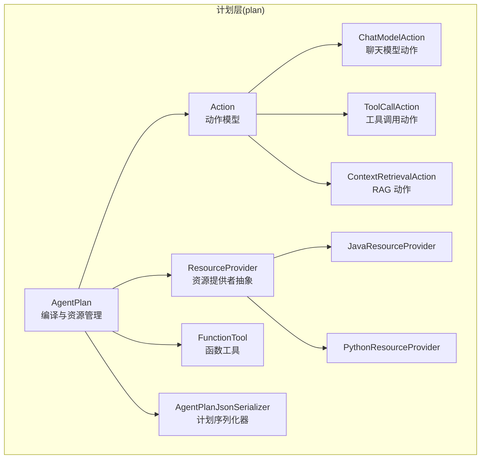
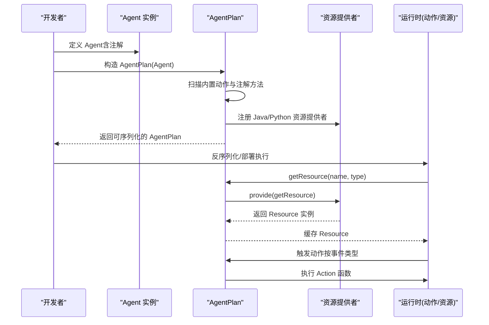
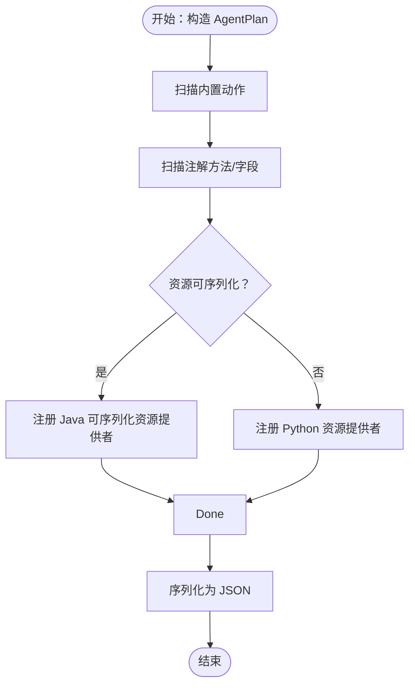
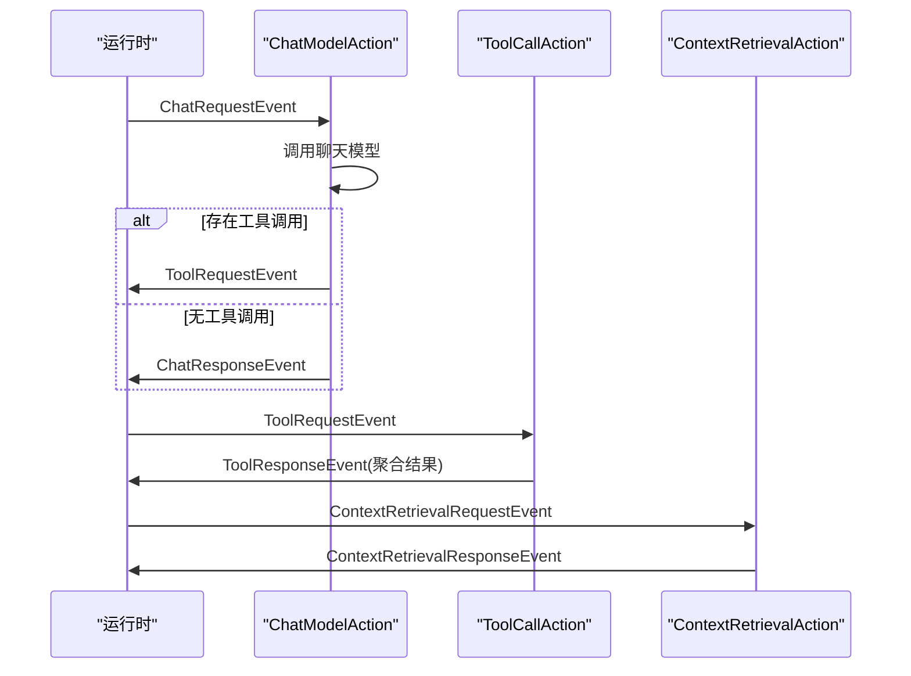
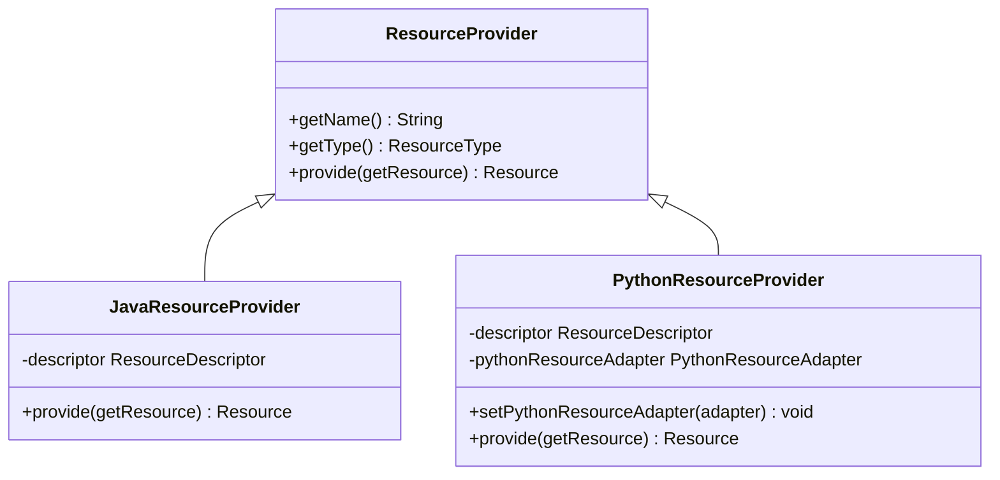
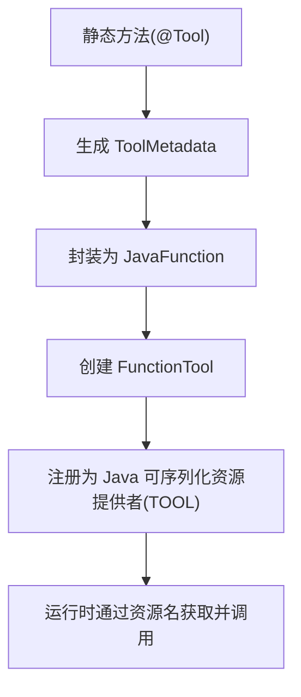
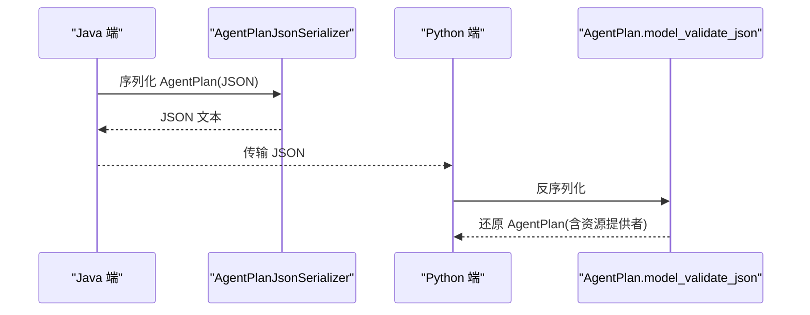
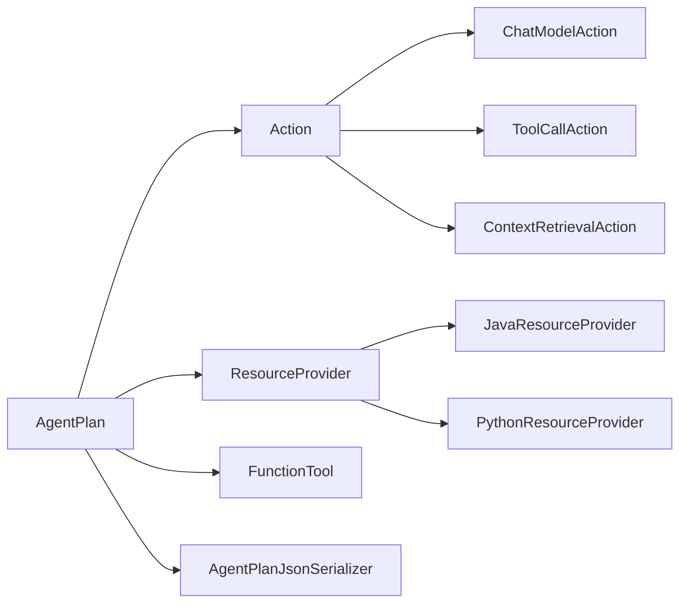

# 计划层

<cite>
**本文引用的文件**   
- [AgentPlan.java](file://plan/src/main/java/org/apache/flink/agents/plan/AgentPlan.java)
- [Action.java](file://plan/src/main/java/org/apache/flink/agents/plan/actions/Action.java)
- [ChatModelAction.java](file://plan/src/main/java/org/apache/flink/agents/plan/actions/ChatModelAction.java)
- [ToolCallAction.java](file://plan/src/main/java/org/apache/flink/agents/plan/actions/ToolCallAction.java)
- [ContextRetrievalAction.java](file://plan/src/main/java/org/apache/flink/agents/plan/actions/ContextRetrievalAction.java)
- [ResourceProvider.java](file://plan/src/main/java/org/apache/flink/agents/plan/resourceprovider/ResourceProvider.java)
- [JavaResourceProvider.java](file://plan/src/main/java/org/apache/flink/agents/plan/resourceprovider/JavaResourceProvider.java)
- [PythonResourceProvider.java](file://plan/src/main/java/org/apache/flink/agents/plan/resourceprovider/PythonResourceProvider.java)
- [FunctionTool.java](file://plan/src/main/java/org/apache/flink/agents/plan/tools/FunctionTool.java)
- [AgentPlanJsonSerializer.java](file://plan/src/main/java/org/apache/flink/agents/plan/serializer/AgentPlanJsonSerializer.java)
- [agent_plan.json](file://plan/src/test/resources/agent_plans/agent_plan.json)
- [action_java_function.json](file://plan/src/test/resources/actions/action_java_function.json)
- [python_resource_provider.json](file://plan/src/test/resources/resource_providers/python_resource_provider.json)
- [AgentPlanTest.java](file://plan/src/test/java/org/apache/flink/agents/plan/AgentPlanTest.java)
- [AgentPlanDeclareToolMethodTest.java](file://plan/src/test/java/org/apache/flink/agents/plan/AgentPlanDeclareToolMethodTest.java)
- [create_python_agent_plan_from_json.py](file://python/flink_agents/plan/tests/compatibility/create_python_agent_plan_from_json.py)
</cite>

## 目录
1. [简介](#简介)
2. [项目结构](#项目结构)
3. [核心组件](#核心组件)
4. [架构总览](#架构总览)
5. [详细组件分析](#详细组件分析)
6. [依赖关系分析](#依赖关系分析)
7. [性能考虑](#性能考虑)
8. [故障排查指南](#故障排查指南)
9. [结论](#结论)
10. [附录](#附录)

## 简介
本章节面向 Apache Flink Agents 的“计划层”，系统性阐述从源代码到可执行计划的编译过程与运行时行为，重点覆盖以下方面：
- 计划编译：如何从用户定义的 Agent 类扫描注解、提取动作与资源提供者，生成可序列化的 AgentPlan。
- 动作系统：内置动作类型（ChatModelAction、ToolCallAction、ContextRetrievalAction）的行为、配置与执行路径。
- 资源提供者模式：Java 与 Python 资源提供者的差异、选择策略与跨语言集成。
- 函数工具：工具元数据、参数校验与返回值处理，以及注册与序列化机制。
- 序列化与反序列化：跨语言兼容的 JSON 结构与双向兼容性保障。
- 最佳实践与性能优化：编译期与运行期的优化建议。
- 示例与排错：基于测试资源与示例脚本的实操指引。

## 项目结构
计划层位于模块 plan 中，核心文件组织如下：
- plan/AgentPlan.java：计划编译入口，负责扫描 Agent、构建动作映射、资源提供者注册与缓存。
- plan/actions/*：内置动作实现，封装事件监听与执行逻辑。
- plan/resourceprovider/*：资源提供者抽象与实现，支持 Java 与 Python。
- plan/tools/*：函数工具与工具元数据工厂、序列化器。
- plan/serializer/*：计划与资源提供者的 JSON 序列化器。
- plan/src/test/resources/*：用于验证序列化/反序列化与跨语言兼容性的样例 JSON。
- python/flink_agents/plan/tests/compatibility/*：Python 端对 Java 生成的计划进行反序列化的示例脚本。

**图表来源**
- [AgentPlan.java](file://plan/src/main/java/org/apache/flink/agents/plan/AgentPlan.java#L132-L141)
- [Action.java](file://plan/src/main/java/org/apache/flink/agents/plan/actions/Action.java#L41-L43)
- [ChatModelAction.java](file://plan/src/main/java/org/apache/flink/agents/plan/actions/ChatModelAction.java#L51-L71)
- [ToolCallAction.java](file://plan/src/main/java/org/apache/flink/agents/plan/actions/ToolCallAction.java#L35-L45)
- [ContextRetrievalAction.java](file://plan/src/main/java/org/apache/flink/agents/plan/actions/ContextRetrievalAction.java#L36-L47)
- [ResourceProvider.java](file://plan/src/main/java/org/apache/flink/agents/plan/resourceprovider/ResourceProvider.java#L30-L38)
- [JavaResourceProvider.java](file://plan/src/main/java/org/apache/flink/agents/plan/resourceprovider/JavaResourceProvider.java#L28-L35)
- [PythonResourceProvider.java](file://plan/src/main/java/org/apache/flink/agents/plan/resourceprovider/PythonResourceProvider.java#L41-L66)
- [FunctionTool.java](file://plan/src/main/java/org/apache/flink/agents/plan/tools/FunctionTool.java#L40-L47)
- [AgentPlanJsonSerializer.java](file://plan/src/main/java/org/apache/flink/agents/plan/serializer/AgentPlanJsonSerializer.java#L32-L37)

**章节来源**
- [AgentPlan.java](file://plan/src/main/java/org/apache/flink/agents/plan/AgentPlan.java#L132-L141)
- [AgentPlanJsonSerializer.java](file://plan/src/main/java/org/apache/flink/agents/plan/serializer/AgentPlanJsonSerializer.java#L38-L127)

## 核心组件
- AgentPlan：编译入口与运行时计划载体，负责：
  - 扫描 Agent 的注解，构建动作映射与事件触发表。
  - 注册资源提供者（Java/Python），并维护资源实例缓存。
  - 提供资源获取与关闭能力，支持跨语言 MCP 服务器的动态发现与缓存。
- Action：动作模型，封装名称、执行函数、监听事件类型与可选配置。
- 内置动作：
  - ChatModelAction：处理聊天请求与工具调用反馈，支持结构化输出与重试策略。
  - ToolCallAction：解析工具调用，异步/同步执行 Tool 并回传 ToolResponseEvent。
  - ContextRetrievalAction：向向量库查询上下文，支持异步 RAG。
- 资源提供者：
  - ResourceProvider 抽象，统一资源创建契约。
  - JavaResourceProvider：通过反射加载 Java 资源类并构造实例。
  - PythonResourceProvider：通过 PythonResourceAdapter 初始化 Python 资源，并映射到对应 Java 资源包装类。
- 函数工具 FunctionTool：将静态方法包装为工具，自动生成元数据与参数校验，返回 ToolResponse。
- 序列化器：AgentPlanJsonSerializer 将计划结构化为 JSON，保证跨语言一致性。

**章节来源**
- [AgentPlan.java](file://plan/src/main/java/org/apache/flink/agents/plan/AgentPlan.java#L132-L141)
- [Action.java](file://plan/src/main/java/org/apache/flink/agents/plan/actions/Action.java#L41-L43)
- [ChatModelAction.java](file://plan/src/main/java/org/apache/flink/agents/plan/actions/ChatModelAction.java#L51-L71)
- [ToolCallAction.java](file://plan/src/main/java/org/apache/flink/agents/plan/actions/ToolCallAction.java#L35-L45)
- [ContextRetrievalAction.java](file://plan/src/main/java/org/apache/flink/agents/plan/actions/ContextRetrievalAction.java#L36-L47)
- [ResourceProvider.java](file://plan/src/main/java/org/apache/flink/agents/plan/resourceprovider/ResourceProvider.java#L30-L38)
- [JavaResourceProvider.java](file://plan/src/main/java/org/apache/flink/agents/plan/resourceprovider/JavaResourceProvider.java#L28-L35)
- [PythonResourceProvider.java](file://plan/src/main/java/org/apache/flink/agents/plan/resourceprovider/PythonResourceProvider.java#L41-L66)
- [FunctionTool.java](file://plan/src/main/java/org/apache/flink/agents/plan/tools/FunctionTool.java#L40-L47)
- [AgentPlanJsonSerializer.java](file://plan/src/main/java/org/apache/flink/agents/plan/serializer/AgentPlanJsonSerializer.java#L38-L127)

## 架构总览
下图展示从 Agent 到可执行计划的编译流程，以及运行时的动作触发与资源获取路径：

**图表来源**
- [AgentPlan.java](file://plan/src/main/java/org/apache/flink/agents/plan/AgentPlan.java#L132-L141)
- [AgentPlan.java](file://plan/src/main/java/org/apache/flink/agents/plan/AgentPlan.java#L231-L264)
- [ResourceProvider.java](file://plan/src/main/java/org/apache/flink/agents/plan/resourceprovider/ResourceProvider.java#L66-L74)

## 详细组件分析

### 计划编译与序列化
- 编译入口
  - 通过构造函数接收 Agent 实例，扫描内置动作与注解方法，填充动作映射与事件触发表。
  - 支持从 Agent.getResources 映射注册资源提供者。
- 资源提供者注册
  - 对于静态方法或字段上的注解（如 @Tool、@Prompt、@ChatModelSetup 等），根据是否为可序列化资源选择 Java 或 Python 提供者。
  - 对于 MCP 服务器，依据 Java 版本自动选择 Java 或 Python 实现；同时支持在 Java 环境中注入 PythonResourceAdapter，以发现远端工具与提示词并缓存。
- 序列化
  - 使用 AgentPlanJsonSerializer 将 actions、actions_by_event、resource_providers、config 等结构写入 JSON。
  - 资源提供者序列化区分 Java/Python 类型，便于 Python 端反序列化还原。

**图表来源**
- [AgentPlan.java](file://plan/src/main/java/org/apache/flink/agents/plan/AgentPlan.java#L334-L360)
- [AgentPlan.java](file://plan/src/main/java/org/apache/flink/agents/plan/AgentPlan.java#L507-L560)
- [AgentPlanJsonSerializer.java](file://plan/src/main/java/org/apache/flink/agents/plan/serializer/AgentPlanJsonSerializer.java#L38-L127)

**章节来源**
- [AgentPlan.java](file://plan/src/main/java/org/apache/flink/agents/plan/AgentPlan.java#L132-L141)
- [AgentPlan.java](file://plan/src/main/java/org/apache/flink/agents/plan/AgentPlan.java#L334-L360)
- [AgentPlan.java](file://plan/src/main/java/org/apache/flink/agents/plan/AgentPlan.java#L507-L560)
- [AgentPlanJsonSerializer.java](file://plan/src/main/java/org/apache/flink/agents/plan/serializer/AgentPlanJsonSerializer.java#L38-L127)

### 动作系统设计与实现
- Action 模型
  - 封装动作名称、执行函数、监听事件类型与可选配置；构造时校验函数签名。
- 内置动作
  - ChatModelAction
    - 监听 ChatRequestEvent 与 ToolResponseEvent。
    - 支持异步聊天（除 Python 聊天模型外）、重试策略与结构化输出。
    - 工具调用时保存上下文并在 ToolResponseEvent 回馈后继续对话。
  - ToolCallAction
    - 解析 ToolRequestEvent 中的工具调用列表，按名称从资源中心获取 Tool 并执行。
    - 支持异步工具调用，聚合成功/失败结果并发送 ToolResponseEvent。
  - ContextRetrievalAction
    - 从向量库查询上下文，支持异步 RAG。
    - 发送 ContextRetrievalResponseEvent。

**图表来源**
- [ChatModelAction.java](file://plan/src/main/java/org/apache/flink/agents/plan/actions/ChatModelAction.java#L191-L277)
- [ToolCallAction.java](file://plan/src/main/java/org/apache/flink/agents/plan/actions/ToolCallAction.java#L47-L111)
- [ContextRetrievalAction.java](file://plan/src/main/java/org/apache/flink/agents/plan/actions/ContextRetrievalAction.java#L49-L99)

**章节来源**
- [Action.java](file://plan/src/main/java/org/apache/flink/agents/plan/actions/Action.java#L41-L43)
- [ChatModelAction.java](file://plan/src/main/java/org/apache/flink/agents/plan/actions/ChatModelAction.java#L51-L71)
- [ChatModelAction.java](file://plan/src/main/java/org/apache/flink/agents/plan/actions/ChatModelAction.java#L191-L277)
- [ToolCallAction.java](file://plan/src/main/java/org/apache/flink/agents/plan/actions/ToolCallAction.java#L35-L45)
- [ToolCallAction.java](file://plan/src/main/java/org/apache/flink/agents/plan/actions/ToolCallAction.java#L47-L111)
- [ContextRetrievalAction.java](file://plan/src/main/java/org/apache/flink/agents/plan/actions/ContextRetrievalAction.java#L36-L47)
- [ContextRetrievalAction.java](file://plan/src/main/java/org/apache/flink/agents/plan/actions/ContextRetrievalAction.java#L49-L99)

### 资源提供者模式
- 抽象与职责
  - ResourceProvider：统一资源创建契约，提供 name、type 与 provide 方法。
- Java 资源提供者
  - JavaResourceProvider：通过 ResourceDescriptor 指定的类名与构造参数，使用反射加载并实例化资源。
- Python 资源提供者
  - PythonResourceProvider：通过 PythonResourceAdapter 初始化 Python 资源，映射到对应的 Java 包装类（如聊天模型、嵌入模型、向量库、MCP 服务器等）。
  - 在 Java 环境中设置 PythonResourceAdapter 后，可自动发现并缓存来自 Python MCP 服务器的工具与提示词。
- 选择策略
  - 若资源实现类为 Python 包装类，则使用 PythonResourceProvider；否则使用 JavaResourceProvider。
  - 对于 MCP 服务器，若 Java 版本不满足要求则强制使用 Python 实现。

**图表来源**
- [ResourceProvider.java](file://plan/src/main/java/org/apache/flink/agents/plan/resourceprovider/ResourceProvider.java#L30-L38)
- [JavaResourceProvider.java](file://plan/src/main/java/org/apache/flink/agents/plan/resourceprovider/JavaResourceProvider.java#L28-L35)
- [PythonResourceProvider.java](file://plan/src/main/java/org/apache/flink/agents/plan/resourceprovider/PythonResourceProvider.java#L41-L66)
- [PythonResourceProvider.java](file://plan/src/main/java/org/apache/flink/agents/plan/resourceprovider/PythonResourceProvider.java#L76-L126)

**章节来源**
- [ResourceProvider.java](file://plan/src/main/java/org/apache/flink/agents/plan/resourceprovider/ResourceProvider.java#L30-L38)
- [JavaResourceProvider.java](file://plan/src/main/java/org/apache/flink/agents/plan/resourceprovider/JavaResourceProvider.java#L28-L35)
- [PythonResourceProvider.java](file://plan/src/main/java/org/apache/flink/agents/plan/resourceprovider/PythonResourceProvider.java#L41-L66)
- [PythonResourceProvider.java](file://plan/src/main/java/org/apache/flink/agents/plan/resourceprovider/PythonResourceProvider.java#L76-L126)
- [AgentPlan.java](file://plan/src/main/java/org/apache/flink/agents/plan/AgentPlan.java#L143-L197)

### 函数工具开发与注册
- 元数据生成
  - 通过 ToolMetadataFactory.fromStaticMethod 从静态方法生成工具元数据（名称、描述、参数 Schema）。
- 参数验证与调用
  - FunctionTool.call 基于方法参数名与类型映射 ToolParameters，支持 @ToolParam 的名称覆盖、必填与默认值校验。
  - 返回 ToolResponse.success 或 ToolResponse.error。
- 注册机制
  - 静态方法标注 @Tool 时，由 AgentPlan.extractTool 自动注册为 Java 可序列化资源提供者（TOOL 类型）。
  - 测试验证了序列化后的工具仍可被正确调用并返回预期结果。

**图表来源**
- [FunctionTool.java](file://plan/src/main/java/org/apache/flink/agents/plan/tools/FunctionTool.java#L57-L97)
- [FunctionTool.java](file://plan/src/main/java/org/apache/flink/agents/plan/tools/FunctionTool.java#L99-L136)
- [AgentPlan.java](file://plan/src/main/java/org/apache/flink/agents/plan/AgentPlan.java#L390-L405)

**章节来源**
- [FunctionTool.java](file://plan/src/main/java/org/apache/flink/agents/plan/tools/FunctionTool.java#L40-L47)
- [FunctionTool.java](file://plan/src/main/java/org/apache/flink/agents/plan/tools/FunctionTool.java#L57-L97)
- [FunctionTool.java](file://plan/src/main/java/org/apache/flink/agents/plan/tools/FunctionTool.java#L99-L136)
- [AgentPlan.java](file://plan/src/main/java/org/apache/flink/agents/plan/AgentPlan.java#L390-L405)
- [AgentPlanDeclareToolMethodTest.java](file://plan/src/test/java/org/apache/flink/agents/plan/AgentPlanDeclareToolMethodTest.java#L227-L244)

### 序列化与反序列化机制
- Java 端
  - AgentPlanJsonSerializer 将动作、事件映射、资源提供者与配置写入 JSON。
  - 资源提供者类型通过 __resource_provider_type__ 字段区分 Java/Python。
- Python 端
  - AgentPlan.model_validate_json 在反序列化时根据 __resource_provider_type__ 将字典还原为对应 Provider 实例。
  - 示例脚本 create_python_agent_plan_from_json.py 展示了从 Java 生成的 JSON 还原为 Python AgentPlan 并断言动作与参数类型。
- 跨语言兼容性
  - 动作执行函数使用 JavaFunction（包含类全名、方法名、参数类型），Python 端可据此定位并调用。

**图表来源**
- [AgentPlanJsonSerializer.java](file://plan/src/main/java/org/apache/flink/agents/plan/serializer/AgentPlanJsonSerializer.java#L38-L127)
- [agent_plan.json](file://plan/src/test/resources/agent_plans/agent_plan.json#L1-L47)
- [action_java_function.json](file://plan/src/test/resources/actions/action_java_function.json#L1-L10)
- [python_resource_provider.json](file://plan/src/test/resources/resource_providers/python_resource_provider.json#L1-L13)
- [create_python_agent_plan_from_json.py](file://python/flink_agents/plan/tests/compatibility/create_python_agent_plan_from_json.py#L27-L81)

**章节来源**
- [AgentPlanJsonSerializer.java](file://plan/src/main/java/org/apache/flink/agents/plan/serializer/AgentPlanJsonSerializer.java#L38-L127)
- [agent_plan.json](file://plan/src/test/resources/agent_plans/agent_plan.json#L1-L47)
- [action_java_function.json](file://plan/src/test/resources/actions/action_java_function.json#L1-L10)
- [python_resource_provider.json](file://plan/src/test/resources/resource_providers/python_resource_provider.json#L1-L13)
- [create_python_agent_plan_from_json.py](file://python/flink_agents/plan/tests/compatibility/create_python_agent_plan_from_json.py#L27-L81)

## 依赖关系分析
- 组件耦合
  - AgentPlan 与 Action、内置动作强关联；与资源提供者弱耦合（通过接口）。
  - 资源提供者与具体资源实现解耦，支持 Java/Python 双栈。
- 外部依赖
  - Jackson 用于 JSON 序列化/反序列化。
  - 反射用于资源类加载与构造。
  - Python 环境通过 PythonResourceAdapter 与 pemja.core.object.PyObject 协作。

**图表来源**
- [AgentPlan.java](file://plan/src/main/java/org/apache/flink/agents/plan/AgentPlan.java#L132-L141)
- [Action.java](file://plan/src/main/java/org/apache/flink/agents/plan/actions/Action.java#L41-L43)
- [ResourceProvider.java](file://plan/src/main/java/org/apache/flink/agents/plan/resourceprovider/ResourceProvider.java#L30-L38)

**章节来源**
- [AgentPlan.java](file://plan/src/main/java/org/apache/flink/agents/plan/AgentPlan.java#L132-L141)
- [Action.java](file://plan/src/main/java/org/apache/flink/agents/plan/actions/Action.java#L41-L43)
- [ResourceProvider.java](file://plan/src/main/java/org/apache/flink/agents/plan/resourceprovider/ResourceProvider.java#L30-L38)

## 性能考虑
- 资源缓存
  - AgentPlan 内置资源缓存 Map，避免重复创建资源实例，降低延迟与 GC 压力。
- 异步执行
  - 聊天模型与工具调用、RAG 查询均支持异步执行，结合持久化可提升吞吐。
- 序列化开销
  - 计划序列化仅在编译阶段发生；运行时通过已缓存资源与动作映射执行，减少反射与 IO。
- 跨语言桥接
  - PythonResourceAdapter 一次性初始化，后续复用；MCP 服务器工具/提示词在 Java 环境中预缓存，避免重复拉取。

**章节来源**
- [AgentPlan.java](file://plan/src/main/java/org/apache/flink/agents/plan/AgentPlan.java#L92-L93)
- [AgentPlan.java](file://plan/src/main/java/org/apache/flink/agents/plan/AgentPlan.java#L231-L264)
- [ChatModelAction.java](file://plan/src/main/java/org/apache/flink/agents/plan/actions/ChatModelAction.java#L201-L204)
- [ToolCallAction.java](file://plan/src/main/java/org/apache/flink/agents/plan/actions/ToolCallAction.java#L48-L49)
- [ContextRetrievalAction.java](file://plan/src/main/java/org/apache/flink/agents/plan/actions/ContextRetrievalAction.java#L52-L65)

## 故障排查指南
- 资源未找到
  - 症状：getResource 抛出资源不存在异常。
  - 排查：确认资源名称与类型匹配；检查资源提供者注册是否正确；对于 Python 资源，确认已设置 PythonResourceAdapter。
- 资源类型不支持
  - 症状：PythonResourceProvider 抛出不支持的资源类型。
  - 排查：确认 ResourceType 是否在映射表中；检查资源实现类是否为受支持的 Python 包装类。
- 工具参数缺失
  - 症状：FunctionTool.call 抛出缺少必填参数异常。
  - 排查：核对 @ToolParam 的名称与默认值；确保 ToolParameters 中包含对应键值。
- 序列化/反序列化不一致
  - 症状：跨语言计划无法还原或动作签名不匹配。
  - 排查：核对 JavaFunction 的类全名、方法名与参数类型；确认 Python 端 __resource_provider_type__ 字段正确。

**章节来源**
- [AgentPlan.java](file://plan/src/main/java/org/apache/flink/agents/plan/AgentPlan.java#L238-L241)
- [PythonResourceProvider.java](file://plan/src/main/java/org/apache/flink/agents/plan/resourceprovider/PythonResourceProvider.java#L82-L84)
- [FunctionTool.java](file://plan/src/main/java/org/apache/flink/agents/plan/tools/FunctionTool.java#L121-L127)
- [AgentPlanJsonSerializer.java](file://plan/src/main/java/org/apache/flink/agents/plan/serializer/AgentPlanJsonSerializer.java#L38-L127)

## 结论
计划层通过“注解扫描 + 资源提供者 + 动作映射”的方式，将用户定义的 Agent 编译为可序列化、可跨语言执行的 AgentPlan。内置动作覆盖聊天、工具调用与 RAG 场景，资源提供者模式支持 Java 与 Python 双栈无缝协作。配合完善的序列化与缓存机制，可在生产环境中实现高性能与高可靠。

## 附录
- 示例与测试参考
  - Java 端动作与计划样例：[agent_plan.json](file://plan/src/test/resources/agent_plans/agent_plan.json#L1-L47)
  - Java 端动作函数样例：[action_java_function.json](file://plan/src/test/resources/actions/action_java_function.json#L1-L10)
  - Python 端资源提供者样例：[python_resource_provider.json](file://plan/src/test/resources/resource_providers/python_resource_provider.json#L1-L13)
  - Python 端反序列化示例脚本：[create_python_agent_plan_from_json.py](file://python/flink_agents/plan/tests/compatibility/create_python_agent_plan_from_json.py#L27-L81)
- 关键测试用例
  - 计划序列化/反序列化与工具调用：[AgentPlanDeclareToolMethodTest.java](file://plan/src/test/java/org/apache/flink/agents/plan/AgentPlanDeclareToolMethodTest.java#L227-L244)
  - 计划初始化与资源提供者注册：[AgentPlanTest.java](file://plan/src/test/java/org/apache/flink/agents/plan/AgentPlanTest.java#L322-L335)