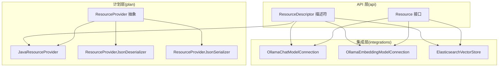
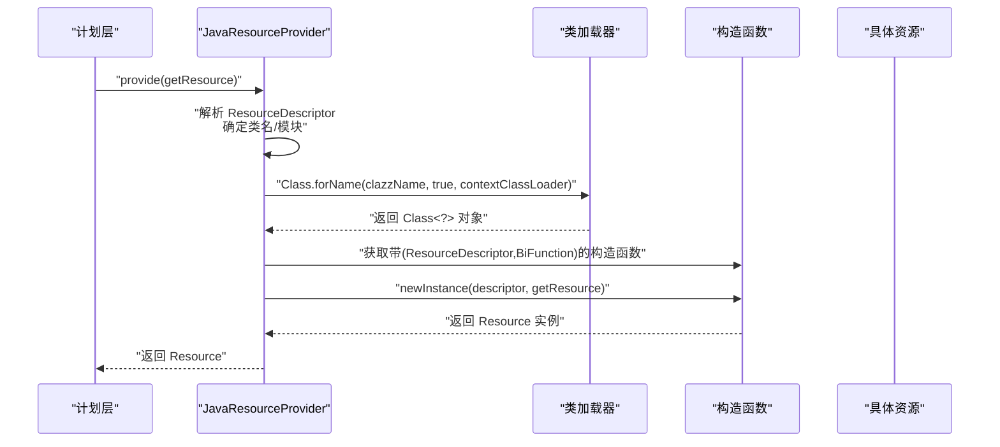
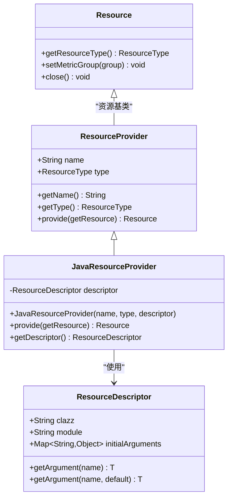
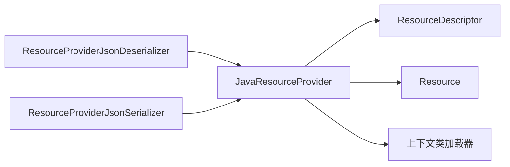

# Java 资源提供者

<cite>
**本文引用的文件**
- [JavaResourceProvider.java](file://plan/src/main/java/org/apache/flink/agents/plan/resourceprovider/JavaResourceProvider.java)
- [ResourceProvider.java](file://plan/src/main/java/org/apache/flink/agents/plan/resourceprovider/ResourceProvider.java)
- [ResourceDescriptor.java](file://api/src/main/java/org/apache/flink/agents/api/resource/ResourceDescriptor.java)
- [Resource.java](file://api/src/main/java/org/apache/flink/agents/api/resource/Resource.java)
- [ResourceProviderJsonDeserializer.java](file://plan/src/main/java/org/apache/flink/agents/plan/serializer/ResourceProviderJsonDeserializer.java)
- [ResourceProviderJsonSerializer.java](file://plan/src/main/java/org/apache/flink/agents/plan/serializer/ResourceProviderJsonSerializer.java)
- [OllamaChatModelConnection.java](file://integrations/chat-models/ollama/src/main/java/org/apache/flink/agents/integrations/chatmodels/ollama/OllamaChatModelConnection.java)
- [OllamaEmbeddingModelConnection.java](file://integrations/embedding-models/ollama/src/main/java/org/apache/flink/agents/integrations/embeddingmodels/ollama/OllamaEmbeddingModelConnection.java)
- [ElasticsearchVectorStore.java](file://integrations/vector-stores/elasticsearch/src/main/java/org/apache/flink/agents/integrations/vectorstores/elasticsearch/ElasticsearchVectorStore.java)
</cite>

## 目录
1. [简介](#简介)
2. [项目结构](#项目结构)
3. [核心组件](#核心组件)
4. [架构总览](#架构总览)
5. [组件详解](#组件详解)
6. [依赖关系分析](#依赖关系分析)
7. [性能考量](#性能考量)
8. [故障排查指南](#故障排查指南)
9. [结论](#结论)
10. [附录：使用示例与最佳实践](#附录使用示例与最佳实践)

## 简介
本文件面向 Apache Flink Agents 的 Java 资源提供者（JavaResourceProvider），系统性阐述其设计目标、实现机制与运行时集成方式。重点覆盖以下方面：
- 设计目的：在 Java 环境中通过资源描述符与反射机制，直接创建并管理各类资源对象（如聊天模型、嵌入模型、向量存储等）。
- 构造函数参数与配置选项：资源类名、模块路径、初始参数映射，以及跨语言兼容策略。
- provide() 方法实现：类加载器选择、构造函数解析与调用、异常处理与错误传播。
- 与 Java 反射系统的集成：泛型类型处理、方法参数绑定、资源生命周期管理。
- 资源缓存与重用：单例化与序列化资源提供者的对比，以及性能优化建议。
- 使用示例：如何声明与创建聊天模型、嵌入模型与向量存储等资源。
- 故障排查：类加载失败、构造函数不匹配、参数缺失等常见问题的诊断与解决。

## 项目结构
围绕 Java 资源提供者的关键文件分布如下：
- plan 模块中的资源提供者与序列化器：负责资源元数据的序列化/反序列化与运行时实例化。
- api 模块中的资源抽象与描述符：定义资源接口、资源类型与资源描述符的数据结构。
- integrations 模块中的具体资源实现：如 Ollama 聊天模型、嵌入模型与 Elasticsearch 向量存储。

图表来源
- [ResourceProvider.java](file://plan/src/main/java/org/apache/flink/agents/plan/resourceprovider/ResourceProvider.java#L30-L76)
- [JavaResourceProvider.java](file://plan/src/main/java/org/apache/flink/agents/plan/resourceprovider/JavaResourceProvider.java#L28-L57)
- [ResourceProviderJsonDeserializer.java](file://plan/src/main/java/org/apache/flink/agents/plan/serializer/ResourceProviderJsonDeserializer.java#L39-L125)
- [ResourceProviderJsonSerializer.java](file://plan/src/main/java/org/apache/flink/agents/plan/serializer/ResourceProviderJsonSerializer.java#L32-L122)
- [Resource.java](file://api/src/main/java/org/apache/flink/agents/api/resource/Resource.java#L25-L71)
- [ResourceDescriptor.java](file://api/src/main/java/org/apache/flink/agents/api/resource/ResourceDescriptor.java#L28-L144)
- [OllamaChatModelConnection.java](file://integrations/chat-models/ollama/src/main/java/org/apache/flink/agents/integrations/chatmodels/ollama/OllamaChatModelConnection.java#L40-L100)
- [OllamaEmbeddingModelConnection.java](file://integrations/embedding-models/ollama/src/main/java/org/apache/flink/agents/integrations/embeddingmodels/ollama/OllamaEmbeddingModelConnection.java#L34-L54)
- [ElasticsearchVectorStore.java](file://integrations/vector-stores/elasticsearch/src/main/java/org/apache/flink/agents/integrations/vectorstores/elasticsearch/ElasticsearchVectorStore.java#L118-L250)

章节来源
- [JavaResourceProvider.java](file://plan/src/main/java/org/apache/flink/agents/plan/resourceprovider/JavaResourceProvider.java#L28-L57)
- [ResourceProvider.java](file://plan/src/main/java/org/apache/flink/agents/plan/resourceprovider/ResourceProvider.java#L30-L76)
- [ResourceDescriptor.java](file://api/src/main/java/org/apache/flink/agents/api/resource/ResourceDescriptor.java#L28-L144)
- [Resource.java](file://api/src/main/java/org/apache/flink/agents/api/resource/Resource.java#L25-L71)

## 核心组件
- ResourceProvider 抽象类：定义资源提供者的通用行为，包括名称、类型与运行时实例化接口。
- JavaResourceProvider：针对 Java 资源的实现，基于 ResourceDescriptor 与反射机制创建具体资源实例。
- ResourceDescriptor：承载资源类名、模块路径与初始参数，支持跨语言资源声明。
- Resource：所有资源的基类，提供资源类型、度量组绑定与关闭接口。
- 序列化器：ResourceProviderJsonSerializer/Deserializer 支持资源提供者的 JSON 序列化与反序列化，确保跨进程/跨语言传递。

章节来源
- [ResourceProvider.java](file://plan/src/main/java/org/apache/flink/agents/plan/resourceprovider/ResourceProvider.java#L30-L76)
- [JavaResourceProvider.java](file://plan/src/main/java/org/apache/flink/agents/plan/resourceprovider/JavaResourceProvider.java#L28-L57)
- [ResourceDescriptor.java](file://api/src/main/java/org/apache/flink/agents/api/resource/ResourceDescriptor.java#L28-L144)
- [Resource.java](file://api/src/main/java/org/apache/flink/agents/api/resource/Resource.java#L25-L71)
- [ResourceProviderJsonSerializer.java](file://plan/src/main/java/org/apache/flink/agents/plan/serializer/ResourceProviderJsonSerializer.java#L32-L122)
- [ResourceProviderJsonDeserializer.java](file://plan/src/main/java/org/apache/flink/agents/plan/serializer/ResourceProviderJsonDeserializer.java#L39-L125)

## 架构总览
Java 资源提供者通过“描述符 + 反射”的方式，在运行时动态加载并实例化资源。其关键流程如下：
- 运行前：通过 ResourceDescriptor 指定资源类名或模块+类名，并传入初始参数。
- 运行时：JavaResourceProvider 使用当前线程上下文类加载器加载目标类，按固定签名构造资源实例。
- 资源实例：接收 ResourceDescriptor 与资源解析函数，用于在执行阶段获取其他资源（如工具、嵌入模型等）。

图表来源
- [JavaResourceProvider.java](file://plan/src/main/java/org/apache/flink/agents/plan/resourceprovider/JavaResourceProvider.java#L37-L51)
- [ResourceDescriptor.java](file://api/src/main/java/org/apache/flink/agents/api/resource/ResourceDescriptor.java#L28-L144)
- [Resource.java](file://api/src/main/java/org/apache/flink/agents/api/resource/Resource.java#L25-L71)

## 组件详解

### JavaResourceProvider 设计与实现
- 设计目的
  - 在 Java 环境中，通过统一的 ResourceDescriptor 与反射机制，创建并管理各类资源对象，屏蔽资源实现细节。
  - 支持跨语言资源声明（Java 资源时模块为空；Python 资源时模块非空，类名由初始参数指定）。
- 关键字段与构造函数
  - 字段：ResourceDescriptor descriptor。
  - 构造函数：接收 name、type 与 descriptor，委托父类初始化名称与类型。
- provide() 方法实现
  - 类名解析：若模块为空，则直接使用 clazz；否则从 initialArguments 中取出 java_clazz 作为类名。
  - 类加载：使用 Thread.currentThread().getContextClassLoader() 加载类。
  - 构造函数解析：查找带 (ResourceDescriptor, BiFunction) 的构造函数。
  - 实例化：以 (descriptor, getResource) 调用构造函数，返回 Resource。
  - 异常处理：抛出 Exception，便于上层统一捕获与记录。
- 访问器：getDescriptor() 返回内部 ResourceDescriptor。

图表来源
- [ResourceProvider.java](file://plan/src/main/java/org/apache/flink/agents/plan/resourceprovider/ResourceProvider.java#L30-L76)
- [JavaResourceProvider.java](file://plan/src/main/java/org/apache/flink/agents/plan/resourceprovider/JavaResourceProvider.java#L28-L57)
- [ResourceDescriptor.java](file://api/src/main/java/org/apache/flink/agents/api/resource/ResourceDescriptor.java#L28-L144)
- [Resource.java](file://api/src/main/java/org/apache/flink/agents/api/resource/Resource.java#L25-L71)

章节来源
- [JavaResourceProvider.java](file://plan/src/main/java/org/apache/flink/agents/plan/resourceprovider/JavaResourceProvider.java#L28-L57)

### ResourceDescriptor：资源描述符
- 字段
  - clazz：资源类名（Java 资源为完整类名；Python 资源为简单类名，需配合 module）。
  - module：Python 模块路径（Java 资源通常为空）。
  - initialArguments：初始参数映射，供资源构造函数读取。
- 工厂与构建
  - 提供 Builder.newBuilder(clazz) 快速构建。
  - 提供 getArgument(name) 与带默认值的重载，便于安全读取参数。
- 跨语言兼容
  - 当 module 非空时，类名由 initialArguments 中的 java_clazz 指定，实现 Java 侧声明 Python 资源。

章节来源
- [ResourceDescriptor.java](file://api/src/main/java/org/apache/flink/agents/api/resource/ResourceDescriptor.java#L28-L144)

### Resource：资源基类
- 职责
  - 定义资源类型、度量组绑定与关闭接口。
  - 构造函数接收 ResourceDescriptor 与 getResource 函数，用于在资源内部解析其他资源。
- 生命周期
  - close() 默认空实现，子类可覆盖释放外部资源（如连接、句柄等）。

章节来源
- [Resource.java](file://api/src/main/java/org/apache/flink/agents/api/resource/Resource.java#L25-L71)

### 序列化与反序列化
- ResourceProviderJsonSerializer
  - 根据具体实现类型写入 __resource_provider_type__ 标记，并输出对应字段。
  - JavaResourceProvider 输出 name、type、descriptor 与标记。
- ResourceProviderJsonDeserializer
  - 依据 __resource_provider_type__ 识别类型并反序列化。
  - JavaResourceProvider 从 JSON 重建 ResourceDescriptor 并实例化。

章节来源
- [ResourceProviderJsonSerializer.java](file://plan/src/main/java/org/apache/flink/agents/plan/serializer/ResourceProviderJsonSerializer.java#L32-L122)
- [ResourceProviderJsonDeserializer.java](file://plan/src/main/java/org/apache/flink/agents/plan/serializer/ResourceProviderJsonDeserializer.java#L39-L125)

### 具体资源实现（示例）
- 聊天模型（OllamaChatModelConnection）
  - 构造函数签名：(ResourceDescriptor, BiFunction)，读取 endpoint、requestTimeout 等参数。
  - 通过工具转换、消息映射与 Ollama API 交互，生成对话结果并记录 Token 指标。
- 嵌入模型（OllamaEmbeddingModelConnection）
  - 构造函数签名：(ResourceDescriptor, BiFunction)，读取 host、model 等参数。
  - 调用 Ollama API 生成文本嵌入，返回 float[] 或列表。
- 向量存储（ElasticsearchVectorStore）
  - 构造函数签名：(ResourceDescriptor, BiFunction)，解析 index、vector_field、dims、k、num_candidates、filter_query 等。
  - 通过 ElasticsearchClient 执行索引创建、文档检索/删除、KNN 查询与批量写入。

章节来源
- [OllamaChatModelConnection.java](file://integrations/chat-models/ollama/src/main/java/org/apache/flink/agents/integrations/chatmodels/ollama/OllamaChatModelConnection.java#L40-L100)
- [OllamaEmbeddingModelConnection.java](file://integrations/embedding-models/ollama/src/main/java/org/apache/flink/agents/integrations/embeddingmodels/ollama/OllamaEmbeddingModelConnection.java#L34-L54)
- [ElasticsearchVectorStore.java](file://integrations/vector-stores/elasticsearch/src/main/java/org/apache/flink/agents/integrations/vectorstores/elasticsearch/ElasticsearchVectorStore.java#L118-L250)

## 依赖关系分析
- JavaResourceProvider 依赖
  - ResourceDescriptor：提供类名、模块与初始参数。
  - Resource：作为构造函数返回值，承载资源类型与生命周期。
  - 类加载器：使用上下文类加载器加载目标类。
- 反序列化链路
  - JSON 中的 __resource_provider_type__ 决定具体实现类型，反序列化后交由 JavaResourceProvider 的构造函数完成实例化。
- 资源间依赖
  - 资源构造函数接收 getResource 函数，可在运行时解析其他资源（如嵌入模型、工具等）。

图表来源
- [JavaResourceProvider.java](file://plan/src/main/java/org/apache/flink/agents/plan/resourceprovider/JavaResourceProvider.java#L37-L51)
- [ResourceDescriptor.java](file://api/src/main/java/org/apache/flink/agents/api/resource/ResourceDescriptor.java#L28-L144)
- [Resource.java](file://api/src/main/java/org/apache/flink/agents/api/resource/Resource.java#L25-L71)
- [ResourceProviderJsonDeserializer.java](file://plan/src/main/java/org/apache/flink/agents/plan/serializer/ResourceProviderJsonDeserializer.java#L39-L125)
- [ResourceProviderJsonSerializer.java](file://plan/src/main/java/org/apache/flink/agents/plan/serializer/ResourceProviderJsonSerializer.java#L32-L122)

章节来源
- [JavaResourceProvider.java](file://plan/src/main/java/org/apache/flink/agents/plan/resourceprovider/JavaResourceProvider.java#L37-L51)
- [ResourceProviderJsonDeserializer.java](file://plan/src/main/java/org/apache/flink/agents/plan/serializer/ResourceProviderJsonDeserializer.java#L39-L125)
- [ResourceProviderJsonSerializer.java](file://plan/src/main/java/org/apache/flink/agents/plan/serializer/ResourceProviderJsonSerializer.java#L32-L122)

## 性能考量
- 类加载器选择
  - 使用上下文类加载器可确保在复杂部署环境下正确加载目标类，但需保证类路径一致与隔离。
- 构造函数调用
  - 固定签名的构造函数避免了反射调用的不确定性，提升稳定性与可预测性。
- 资源缓存与重用
  - JavaResourceProvider 本身不内置缓存；如需重用资源，建议在资源内部维护单例或在上层进行缓存管理。
  - 对于可序列化的资源，可考虑使用 JavaSerializableResourceProvider 将资源序列化后复用，减少重复实例化成本。
- 参数访问
  - 通过 ResourceDescriptor 的 getArgument(name) 与默认值重载，避免空指针与类型转换异常，提高健壮性。

[本节为通用性能建议，无需列出章节来源]

## 故障排查指南
- 类加载失败
  - 症状：抛出 ClassNotFoundException 或 NoClassDefFoundError。
  - 排查要点：确认模块为空且 clazz 为完整类名；或模块非空时，initialArguments 中包含 java_clazz；检查上下文类加载器是否包含所需类。
- 构造函数不匹配
  - 症状：NoSuchMethodError 或 InstantiationException。
  - 排查要点：确保资源类提供带 (ResourceDescriptor, BiFunction) 的构造函数；检查签名与可见性。
- 初始参数缺失
  - 症状：运行时抛出非法参数异常或空指针。
  - 排查要点：在资源构造函数中对必需参数进行校验并提供合理默认值；使用 ResourceDescriptor.getArgument(name, default)。
- 反序列化失败
  - 症状：JSON 反序列化异常或类型不匹配。
  - 排查要点：确认 JSON 包含 __resource_provider_type__ 且值与实现类名一致；检查 ResourceDescriptor 字段完整性。

章节来源
- [JavaResourceProvider.java](file://plan/src/main/java/org/apache/flink/agents/plan/resourceprovider/JavaResourceProvider.java#L37-L51)
- [ResourceDescriptor.java](file://api/src/main/java/org/apache/flink/agents/api/resource/ResourceDescriptor.java#L88-L98)
- [ResourceProviderJsonDeserializer.java](file://plan/src/main/java/org/apache/flink/agents/plan/serializer/ResourceProviderJsonDeserializer.java#L50-L72)

## 结论
JavaResourceProvider 通过“描述符 + 反射”的轻量机制，实现了在 Java 环境中对各类资源的统一创建与管理。其设计强调：
- 明确的构造函数契约（ResourceDescriptor, BiFunction），简化资源生命周期与依赖解析；
- 与 ResourceDescriptor 的深度集成，支持跨语言资源声明；
- 与序列化器的配合，保障资源提供者在计划与运行时的一致性。

在实际工程中，建议：
- 严格遵循构造函数签名，确保资源可被正确实例化；
- 在资源内部妥善处理参数校验与默认值，提升鲁棒性；
- 对于高成本资源，结合上层缓存或序列化方案实现重用，降低启动与运行开销。

[本节为总结性内容，无需列出章节来源]

## 附录：使用示例与最佳实践
- 声明聊天模型资源（Java 侧）
  - 使用 ResourceDescriptor.Builder.newBuilder(完整类名) 添加 endpoint、requestTimeout 等参数，然后在 Agent 中通过注解或配置声明该资源。
  - 运行时由 JavaResourceProvider 基于 ResourceDescriptor 反射创建 OllamaChatModelConnection 实例。
- 声明嵌入模型资源
  - 通过 ResourceDescriptor 指定 host、model 等参数，运行时创建 OllamaEmbeddingModelConnection 实例。
- 声明向量存储资源
  - 通过 ResourceDescriptor 指定 index、vector_field、dims、k、num_candidates、filter_query 等参数，运行时创建 ElasticsearchVectorStore 实例。
- 资源间依赖解析
  - 在资源构造函数中使用 getResource(name, type) 获取其他资源（如工具、嵌入模型），实现松耦合的资源组合。

章节来源
- [OllamaChatModelConnection.java](file://integrations/chat-models/ollama/src/main/java/org/apache/flink/agents/integrations/chatmodels/ollama/OllamaChatModelConnection.java#L40-L100)
- [OllamaEmbeddingModelConnection.java](file://integrations/embedding-models/ollama/src/main/java/org/apache/flink/agents/integrations/embeddingmodels/ollama/OllamaEmbeddingModelConnection.java#L34-L54)
- [ElasticsearchVectorStore.java](file://integrations/vector-stores/elasticsearch/src/main/java/org/apache/flink/agents/integrations/vectorstores/elasticsearch/ElasticsearchVectorStore.java#L118-L250)
- [ResourceDescriptor.java](file://api/src/main/java/org/apache/flink/agents/api/resource/ResourceDescriptor.java#L121-L142)