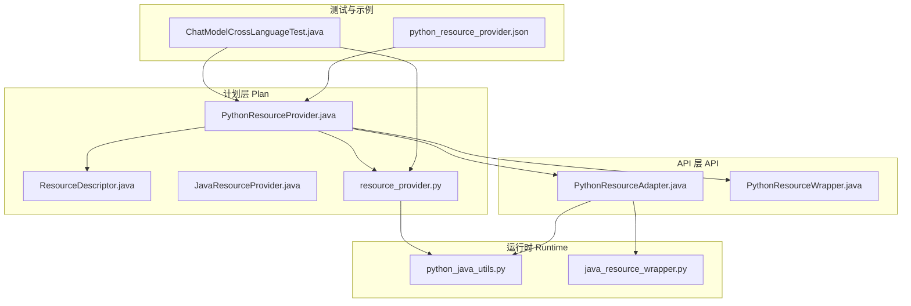
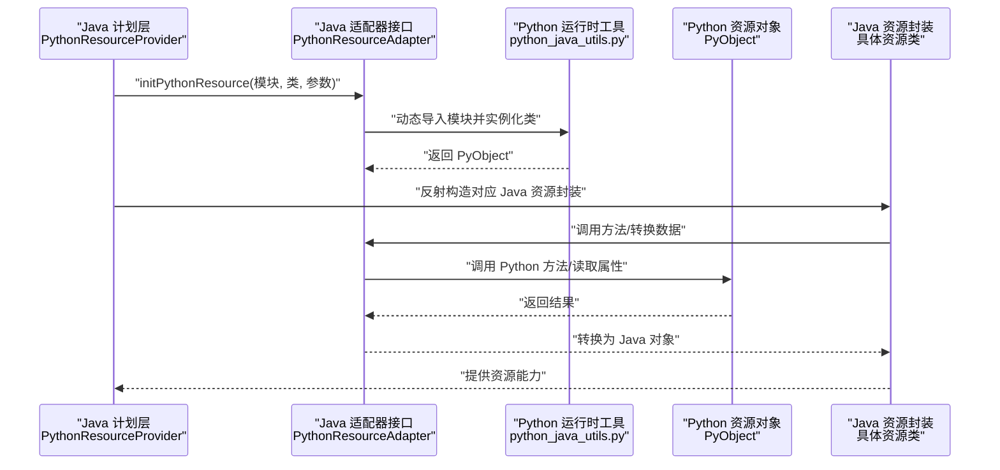
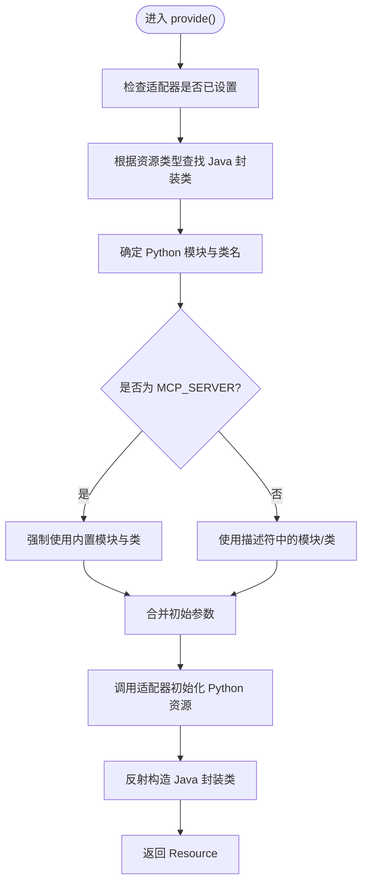
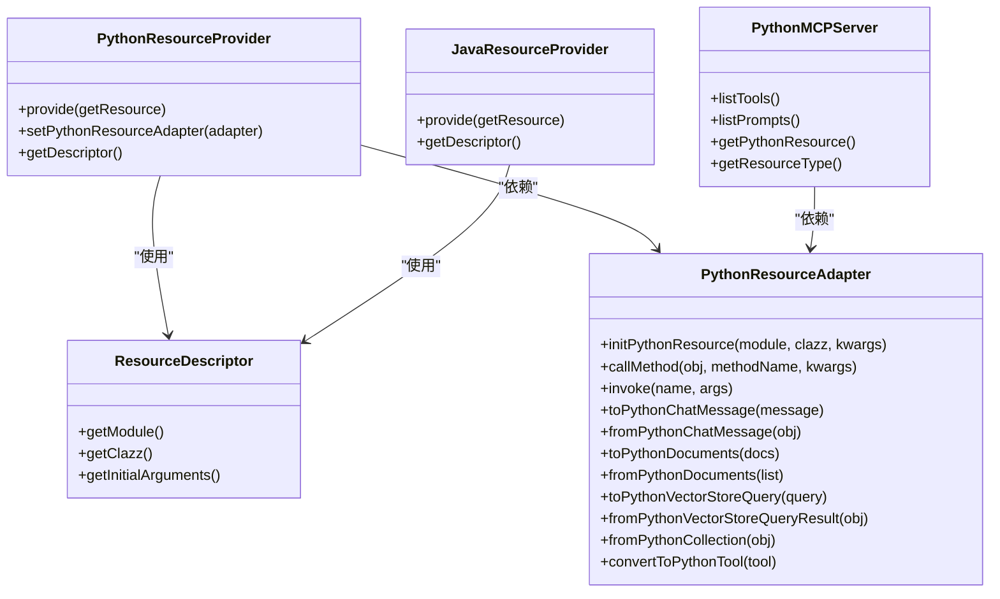

# Python 资源提供者

<cite>
**本文引用的文件**
- [PythonResourceProvider.java](file://plan/src/main/java/org/apache/flink/agents/plan/resourceprovider/PythonResourceProvider.java)
- [PythonResourceAdapter.java](file://api/src/main/java/org/apache/flink/agents/api/resource/python/PythonResourceAdapter.java)
- [PythonResourceWrapper.java](file://api/src/main/java/org/apache/flink/agents/api/resource/python/PythonResourceWrapper.java)
- [ResourceDescriptor.java](file://api/src/main/java/org/apache/flink/agents/api/resource/ResourceDescriptor.java)
- [PythonMCPServer.java](file://plan/src/main/java/org/apache/flink/agents/plan/resource/python/PythonMCPServer.java)
- [python_java_utils.py](file://python/flink_agents/runtime/python_java_utils.py)
- [java_resource_wrapper.py](file://python/flink_agents/runtime/java/java_resource_wrapper.py)
- [resource_provider.py](file://python/flink_agents/plan/resource_provider.py)
- [JavaResourceProvider.java](file://plan/src/main/java/org/apache/flink/agents/plan/resourceprovider/JavaResourceProvider.java)
- [python_resource_provider.json](file://plan/src/test/resources/resource_providers/python_resource_provider.json)
- [ChatModelCrossLanguageTest.java](file://e2e-test/flink-agents-end-to-end-tests-resource-cross-language/src/test/java/org/apache/flink/agents/resource/test/ChatModelCrossLanguageTest.java)
- [java_chat_model.py](file://python/flink_agents/api/chat_models/java_chat_model.py)
- [java_embedding_model.py](file://python/flink_agents/api/embedding_models/java_embedding_model.py)
</cite>

## 目录
1. [简介](#简介)
2. [项目结构](#项目结构)
3. [核心组件](#核心组件)
4. [架构总览](#架构总览)
5. [组件详解](#组件详解)
6. [依赖关系分析](#依赖关系分析)
7. [性能考量](#性能考量)
8. [故障排查指南](#故障排查指南)
9. [结论](#结论)
10. [附录：使用示例与最佳实践](#附录使用示例与最佳实践)

## 简介
本文件面向 Apache Flink Agents 的 Python 资源提供者（PythonResourceProvider），系统性阐述其设计原理、跨语言资源管理机制、初始化流程、provide() 实现细节、数据转换与序列化、生命周期管理，以及在实际场景中的使用方法与调试优化建议。重点覆盖 Java 与 Python 环境之间的资源桥接、通信协议与适配器模式，帮助读者快速理解并正确使用 Python 资源提供者。

## 项目结构
围绕 Python 资源提供者的关键目录与文件如下：
- 计划层（Plan）：定义资源提供者与描述符，负责从 JSON/配置中解析资源元信息并在运行时创建资源实例。
- API 层（API）：定义资源接口、适配器与包装器，统一 Java 与 Python 的交互契约。
- 运行时（Runtime）：提供 Python 侧的工具函数与 Java 侧的资源包装器，支撑跨语言数据转换与方法调用。
- 示例与测试：端到端测试与资源声明样例，验证跨语言资源的可用性。

图表来源
- [PythonResourceProvider.java](file://plan/src/main/java/org/apache/flink/agents/plan/resourceprovider/PythonResourceProvider.java#L47-L126)
- [ResourceDescriptor.java](file://api/src/main/java/org/apache/flink/agents/api/resource/ResourceDescriptor.java#L29-L88)
- [PythonResourceAdapter.java](file://api/src/main/java/org/apache/flink/agents/api/resource/python/PythonResourceAdapter.java#L37-L140)
- [PythonResourceWrapper.java](file://api/src/main/java/org/apache/flink/agents/api/resource/python/PythonResourceWrapper.java#L24-L32)
- [resource_provider.py](file://python/flink_agents/plan/resource_provider.py#L79-L118)
- [python_java_utils.py](file://python/flink_agents/runtime/python_java_utils.py#L78-L102)
- [java_resource_wrapper.py](file://python/flink_agents/runtime/java/java_resource_wrapper.py#L69-L79)
- [ChatModelCrossLanguageTest.java](file://e2e-test/flink-agents-end-to-end-tests-resource-cross-language/src/test/java/org/apache/flink/agents/resource/test/ChatModelCrossLanguageTest.java#L48-L82)
- [python_resource_provider.json](file://plan/src/test/resources/resource_providers/python_resource_provider.json#L1-L13)

章节来源
- [PythonResourceProvider.java](file://plan/src/main/java/org/apache/flink/agents/plan/resourceprovider/PythonResourceProvider.java#L41-L126)
- [resource_provider.py](file://python/flink_agents/plan/resource_provider.py#L79-L118)

## 核心组件
- PythonResourceProvider：计划层的资源提供者，负责根据 ResourceDescriptor 描述的模块、类名与初始化参数，在运行时通过适配器创建对应的 Python 资源对象，并映射到 Java 侧的资源类型。
- PythonResourceAdapter：Java 与 Python 之间的适配器接口，提供资源检索、Python 对象初始化、消息与文档等对象的双向转换、方法调用与通用调用入口。
- PythonResourceWrapper：统一暴露底层 Python 资源对象的接口，便于上层直接访问或调试。
- ResourceDescriptor：资源描述符，承载目标类名、模块路径与初始参数，支持跨平台兼容（Java/Python）。
- PythonMCPServer：针对 MCP 服务器的 Python 资源封装，通过适配器列出工具与提示词。
- 运行时工具：python_java_utils.py 提供动态创建资源、Java 对象到 Python 对象的转换、事件包装与序列化等；java_resource_wrapper.py 提供 Java 侧资源适配器的 Python 包装。

章节来源
- [PythonResourceProvider.java](file://plan/src/main/java/org/apache/flink/agents/plan/resourceprovider/PythonResourceProvider.java#L47-L126)
- [PythonResourceAdapter.java](file://api/src/main/java/org/apache/flink/agents/api/resource/python/PythonResourceAdapter.java#L37-L140)
- [PythonResourceWrapper.java](file://api/src/main/java/org/apache/flink/agents/api/resource/python/PythonResourceWrapper.java#L24-L32)
- [ResourceDescriptor.java](file://api/src/main/java/org/apache/flink/agents/api/resource/ResourceDescriptor.java#L29-L88)
- [PythonMCPServer.java](file://plan/src/main/java/org/apache/flink/agents/plan/resource/python/PythonMCPServer.java#L32-L91)
- [python_java_utils.py](file://python/flink_agents/runtime/python_java_utils.py#L78-L102)
- [java_resource_wrapper.py](file://python/flink_agents/runtime/java/java_resource_wrapper.py#L69-L79)

## 架构总览
下图展示了 Python 资源提供者在跨语言环境中的整体交互：Java 计划层通过 PythonResourceProvider 解析 ResourceDescriptor，借助 PythonResourceAdapter 初始化 Python 资源；同时，运行时工具在 Python 侧完成对象创建与数据转换，Java 侧通过 pemja 访问 Python 对象并进行方法调用。

图表来源
- [PythonResourceProvider.java](file://plan/src/main/java/org/apache/flink/agents/plan/resourceprovider/PythonResourceProvider.java#L76-L126)
- [PythonResourceAdapter.java](file://api/src/main/java/org/apache/flink/agents/api/resource/python/PythonResourceAdapter.java#L37-L140)
- [python_java_utils.py](file://python/flink_agents/runtime/python_java_utils.py#L78-L102)

## 组件详解

### 设计原理与跨语言资源管理机制
- 资源桥接：Java 计划层通过 ResourceDescriptor 指定 Python 模块与类名，PythonResourceProvider 在运行时调用 PythonResourceAdapter 完成资源实例化，随后以 Java 封装类的形式对外提供能力。
- 适配器模式：PythonResourceAdapter 抽象了 Java 与 Python 之间的互操作细节，包括对象初始化、方法调用、数据转换（消息、文档、查询、集合等）。
- 统一接口：PythonResourceWrapper 为 Java 封装类提供统一的底层 Python 对象访问能力，便于调试与扩展。

章节来源
- [PythonResourceProvider.java](file://plan/src/main/java/org/apache/flink/agents/plan/resourceprovider/PythonResourceProvider.java#L47-L75)
- [PythonResourceAdapter.java](file://api/src/main/java/org/apache/flink/agents/api/resource/python/PythonResourceAdapter.java#L37-L140)
- [PythonResourceWrapper.java](file://api/src/main/java/org/apache/flink/agents/api/resource/python/PythonResourceWrapper.java#L24-L32)

### 初始化流程与 provide() 实现机制
- 元信息解析：从 ResourceDescriptor 获取模块、类名与初始化参数；若类型为 MCP_SERVER，则强制使用内置模块与类名。
- 资源实例化：通过 PythonResourceAdapter.initPythonResource 动态导入模块并实例化 Python 类，得到 PyObject。
- Java 封装：根据资源类型映射到对应的 Java 资源类（如聊天模型、嵌入模型、向量库、MCP 服务器），通过反射构造并注入适配器与描述符。
- 返回资源：最终返回 Java 侧可直接使用的 Resource 实例。

图表来源
- [PythonResourceProvider.java](file://plan/src/main/java/org/apache/flink/agents/plan/resourceprovider/PythonResourceProvider.java#L76-L126)

章节来源
- [PythonResourceProvider.java](file://plan/src/main/java/org/apache/flink/agents/plan/resourceprovider/PythonResourceProvider.java#L76-L126)

### 数据转换与序列化处理
- 消息与文档：提供 ChatMessage 与 Document 的双向转换，确保角色、内容、工具调用与额外参数在 Java 与 Python 之间保持一致。
- 查询与结果：VectorStoreQuery 与 VectorStoreQueryResult 的转换，保证查询模式、文本、限制与集合名称等字段正确映射。
- 集合与工具：Java 与 Python 的集合与工具对象转换，支持工具元数据与远程函数类型识别。
- 序列化：使用 cloudpickle 对事件与对象进行序列化/反序列化，确保跨语言传输的数据完整性。
- 通用调用：callMethod 与 invoke 提供统一的方法调用入口，支持关键字参数传递与异常处理。

章节来源
- [PythonResourceAdapter.java](file://api/src/main/java/org/apache/flink/agents/api/resource/python/PythonResourceAdapter.java#L37-L140)
- [python_java_utils.py](file://python/flink_agents/runtime/python_java_utils.py#L174-L284)

### 生命周期管理与错误恢复
- 进程启动：通过 PythonResourceAdapter.initPythonResource 动态导入模块并实例化资源，避免硬编码依赖。
- 资源清理：Java 封装类可持有底层 Python 对象引用，必要时由上层在关闭阶段触发清理逻辑（例如 JavaPrompt 的 close）。
- 错误恢复：提供明确的异常信息（如不支持的资源类型、无效的类名格式、适配器未设置等），便于定位问题。
- 资源检索：通过 Java 侧的 JavaGetResourceWrapper 与 Python 侧的 get_resource_function，实现跨语言资源按名称与类型的检索。

章节来源
- [PythonResourceProvider.java](file://plan/src/main/java/org/apache/flink/agents/plan/resourceprovider/PythonResourceProvider.java#L82-L100)
- [java_resource_wrapper.py](file://python/flink_agents/runtime/java/java_resource_wrapper.py#L69-L79)
- [python_java_utils.py](file://python/flink_agents/runtime/python_java_utils.py#L93-L102)

### Python 资源与 Java 对象之间的数据转换与状态同步
- 消息与工具调用：标准化工具调用 ID 的字符串化，确保不同系统间的兼容性。
- 文档嵌入：在 Java 与 Python 之间同步文档的嵌入向量，注意类型转换（如列表与元组）。
- 查询与结果：将 Java 的查询模式枚举映射到 Python，再将查询结果还原为 Java 对象，保持语义一致。
- Prompt 与工具：Java Prompt 与 Tool 在 Python 侧被包装为可识别的对象，便于在 Python 环境中使用。

章节来源
- [python_java_utils.py](file://python/flink_agents/runtime/python_java_utils.py#L153-L173)
- [python_java_utils.py](file://python/flink_agents/runtime/python_java_utils.py#L209-L250)
- [java_resource_wrapper.py](file://python/flink_agents/runtime/java/java_resource_wrapper.py#L43-L68)

### 使用示例：创建 Python 资源
以下示例展示如何声明与使用 Python 资源（聊天模型、嵌入模型、MCP 服务器与自定义工具）。示例基于测试与资源声明样例文件：

- 声明 Python 资源提供者（JSON）
  - 参考路径：[python_resource_provider.json](file://plan/src/test/resources/resource_providers/python_resource_provider.json#L1-L13)
  - 关键字段：name、type、descriptor.target_module、descriptor.target_clazz、descriptor.arguments、__resource_provider_type__

- 端到端跨语言聊天模型测试
  - 参考路径：[ChatModelCrossLanguageTest.java](file://e2e-test/flink-agents-end-to-end-tests-resource-cross-language/src/test/java/org/apache/flink/agents/resource/test/ChatModelCrossLanguageTest.java#L48-L82)
  - 流程要点：构建执行环境、输入提示、应用代理、收集输出并断言结果。

- Java 资源装饰器与包装
  - 参考路径：[java_chat_model.py](file://python/flink_agents/api/chat_models/java_chat_model.py#L25-L47)
  - 参考路径：[java_embedding_model.py](file://python/flink_agents/api/embedding_models/java_embedding_model.py#L25-L48)
  - 作用：标记 Java 资源并在 Python 侧生成对应的包装类，实现跨语言桥接。

章节来源
- [python_resource_provider.json](file://plan/src/test/resources/resource_providers/python_resource_provider.json#L1-L13)
- [ChatModelCrossLanguageTest.java](file://e2e-test/flink-agents-end-to-end-tests-resource-cross-language/src/test/java/org/apache/flink/agents/resource/test/ChatModelCrossLanguageTest.java#L48-L82)
- [java_chat_model.py](file://python/flink_agents/api/chat_models/java_chat_model.py#L25-L47)
- [java_embedding_model.py](file://python/flink_agents/api/embedding_models/java_embedding_model.py#L25-L48)

## 依赖关系分析
- Java 计划层依赖 PythonResourceProvider 与 ResourceDescriptor，后者承载模块、类与参数。
- PythonResourceAdapter 是 Java 与 Python 的关键桥梁，提供资源初始化、方法调用与数据转换。
- Python 运行时工具负责动态导入与对象创建，Java 包装器负责将 Java 资源适配为 Python 可识别对象。
- Java 封装类（如 PythonMCPServer）通过适配器访问底层 Python 对象，实现功能扩展。

图表来源
- [PythonResourceProvider.java](file://plan/src/main/java/org/apache/flink/agents/plan/resourceprovider/PythonResourceProvider.java#L47-L126)
- [ResourceDescriptor.java](file://api/src/main/java/org/apache/flink/agents/api/resource/ResourceDescriptor.java#L29-L88)
- [PythonResourceAdapter.java](file://api/src/main/java/org/apache/flink/agents/api/resource/python/PythonResourceAdapter.java#L37-L140)
- [PythonMCPServer.java](file://plan/src/main/java/org/apache/flink/agents/plan/resource/python/PythonMCPServer.java#L32-L91)
- [JavaResourceProvider.java](file://plan/src/main/java/org/apache/flink/agents/plan/resourceprovider/JavaResourceProvider.java#L29-L51)

章节来源
- [PythonResourceProvider.java](file://plan/src/main/java/org/apache/flink/agents/plan/resourceprovider/PythonResourceProvider.java#L47-L126)
- [JavaResourceProvider.java](file://plan/src/main/java/org/apache/flink/agents/plan/resourceprovider/JavaResourceProvider.java#L29-L51)

## 性能考量
- 减少反射开销：在可能的情况下缓存资源类构造器与方法句柄，避免重复反射。
- 批量数据转换：对批量文档与查询进行分批处理，降低序列化与网络传输成本。
- 合理使用适配器：尽量将频繁调用的方法封装为一次调用，减少跨语言调用次数。
- 资源复用：在 Agent 生命周期内复用已创建的 Python 资源，避免重复初始化。
- 异步执行：结合异步执行环境，提升 I/O 密集型任务（如模型推理、向量库查询）的吞吐。

## 故障排查指南
- 适配器未设置：抛出状态异常，需在运行时注入 PythonResourceAdapter。
- 不支持的资源类型：当资源类型不在映射表中时会抛出异常，确认类型是否受支持。
- 类名格式错误：当模块与类名格式非法时抛出异常，确保遵循“模块.类名”的规范。
- MCP 服务器初始化：MCP_SERVER 类型强制使用内置模块与类，避免传入错误的模块/类名。
- 跨语言数据转换失败：检查消息角色、工具调用 ID、文档嵌入等字段的映射一致性。
- Java 资源适配器缺失：JavaResourceProvider 需要设置 Java 资源适配器，否则无法创建 Java 资源。

章节来源
- [PythonResourceProvider.java](file://plan/src/main/java/org/apache/flink/agents/plan/resourceprovider/PythonResourceProvider.java#L76-L126)
- [PythonResourceAdapter.java](file://api/src/main/java/org/apache/flink/agents/api/resource/python/PythonResourceAdapter.java#L37-L140)
- [JavaResourceProvider.java](file://plan/src/main/java/org/apache/flink/agents/plan/resourceprovider/JavaResourceProvider.java#L37-L51)

## 结论
PythonResourceProvider 通过适配器与描述符，实现了 Java 与 Python 环境之间的无缝资源桥接。其设计强调可扩展性与跨语言一致性，配合运行时工具与封装类，能够高效地创建与管理聊天模型、嵌入模型、向量库与 MCP 服务器等资源。遵循本文提供的初始化流程、数据转换规则与性能优化建议，可显著提升系统的稳定性与可维护性。

## 附录：使用示例与最佳实践
- 声明资源提供者
  - 参考路径：[python_resource_provider.json](file://plan/src/test/resources/resource_providers/python_resource_provider.json#L1-L13)
  - 关键点：确保 target_module 与 target_clazz 正确，arguments 中包含必要的初始化参数。
- 端到端测试
  - 参考路径：[ChatModelCrossLanguageTest.java](file://e2e-test/flink-agents-end-to-end-tests-resource-cross-language/src/test/java/org/apache/flink/agents/resource/test/ChatModelCrossLanguageTest.java#L48-L82)
  - 关键点：准备外部服务（如 Ollama）、构建 AgentsExecutionEnvironment、应用代理并收集输出。
- Java 资源桥接
  - 参考路径：[java_chat_model.py](file://python/flink_agents/api/chat_models/java_chat_model.py#L25-L47)
  - 参考路径：[java_embedding_model.py](file://python/flink_agents/api/embedding_models/java_embedding_model.py#L25-L48)
  - 关键点：使用 @java_resource 装饰器标记 Java 资源，Python 侧自动生成包装类。
- 最佳实践
  - 明确资源类型与模块路径，避免运行时解析失败。
  - 在资源初始化前注入适配器，确保初始化链路完整。
  - 对批量数据进行分批处理，减少序列化与网络往返。
  - 使用统一的错误处理与日志记录，便于定位跨语言问题。