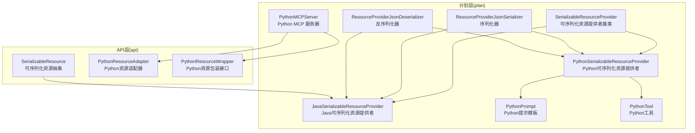
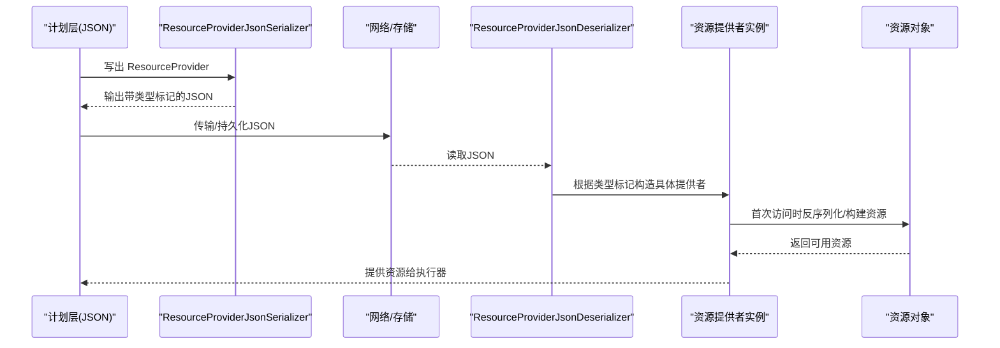
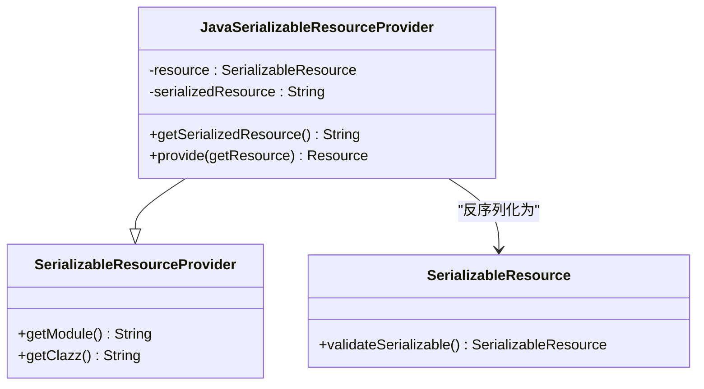
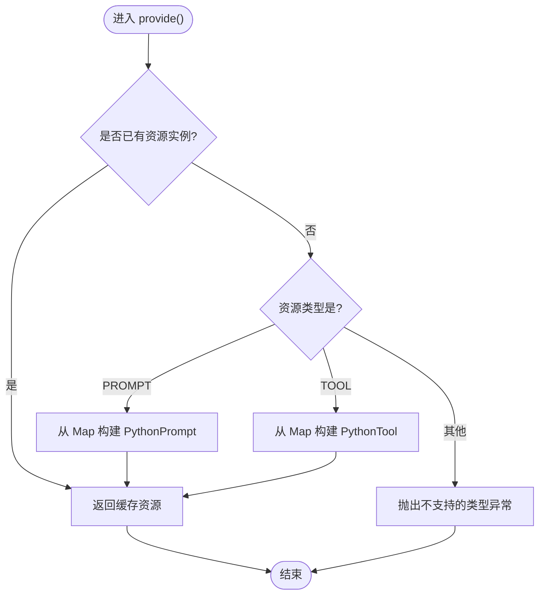
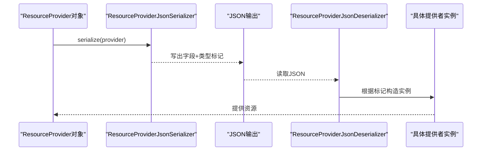
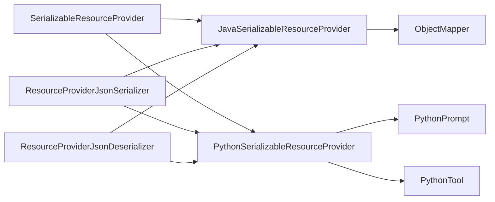

# 可序列化资源提供者

<cite>
**本文引用的文件**
- [SerializableResourceProvider.java](file://plan/src/main/java/org/apache/flink/agents/plan/resourceprovider/SerializableResourceProvider.java)
- [JavaSerializableResourceProvider.java](file://plan/src/main/java/org/apache/flink/agents/plan/resourceprovider/JavaSerializableResourceProvider.java)
- [PythonSerializableResourceProvider.java](file://plan/src/main/java/org/apache/flink/agents/plan/resourceprovider/PythonSerializableResourceProvider.java)
- [SerializableResource.java](file://api/src/main/java/org/apache/flink/agents/api/resource/SerializableResource.java)
- [ResourceProviderJsonSerializer.java](file://plan/src/main/java/org/apache/flink/agents/plan/serializer/ResourceProviderJsonSerializer.java)
- [ResourceProviderJsonDeserializer.java](file://plan/src/main/java/org/apache/flink/agents/plan/serializer/ResourceProviderJsonDeserializer.java)
- [PythonResourceAdapter.java](file://api/src/main/java/org/apache/flink/agents/api/resource/python/PythonResourceAdapter.java)
- [PythonResourceWrapper.java](file://api/src/main/java/org/apache/flink/agents/api/resource/python/PythonResourceWrapper.java)
- [PythonPrompt.java](file://plan/src/main/java/org/apache/flink/agents/plan/resource/python/PythonPrompt.java)
- [PythonTool.java](file://plan/src/main/java/org/apache/flink/agents/plan/resource/python/PythonTool.java)
- [PythonMCPServer.java](file://plan/src/main/java/org/apache/flink/agents/plan/resource/python/PythonMCPServer.java)
- [ResourceProviderSerializerTest.java](file://plan/src/test/java/org/apache/flink/agents/plan/serializer/ResourceProviderSerializerTest.java)
- [python_serializable_resource_provider.json](file://plan/src/test/resources/resource_providers/python_serializable_resource_provider.json)
- [python_resource_provider.json](file://plan/src/test/resources/resource_providers/python_resource_provider.json)
</cite>

## 目录
1. [引言](#引言)
2. [项目结构](#项目结构)
3. [核心组件](#核心组件)
4. [架构总览](#架构总览)
5. [组件详解](#组件详解)
6. [依赖关系分析](#依赖关系分析)
7. [性能与优化](#性能与优化)
8. [故障排查指南](#故障排查指南)
9. [结论](#结论)
10. [附录：使用示例与最佳实践](#附录使用示例与最佳实践)

## 引言
本技术文档围绕 Apache Flink Agents 的“可序列化资源提供者”体系展开，系统阐述 SerializableResourceProvider 的设计思想、应用场景与实现细节，重点对比 Java 与 Python 资源提供者的差异，解析序列化与反序列化机制、跨语言兼容性与网络传输优化，并给出分布式部署下的状态持久化、版本兼容性管理与故障恢复策略。文档同时提供可直接定位到源码路径的图示与示例，帮助读者快速理解与落地。

## 项目结构
可序列化资源提供者位于 plan 模块的 resourceprovider 包中，配合 api 模块的资源抽象与序列化器模块完成跨语言资源的描述、序列化与反序列化。关键文件分布如下：
- plan/resourceprovider：Java/Python 可序列化资源提供者与基类
- plan/serializer：资源提供者的 Jackson 自定义序列化/反序列化器
- api/resource：资源抽象（含可序列化资源基类）
- plan/resource/python：Python 端资源封装与桥接工具
- 测试资源：JSON 示例与序列化测试

图表来源
- [SerializableResourceProvider.java](file://plan/src/main/java/org/apache/flink/agents/plan/resourceprovider/SerializableResourceProvider.java#L30-L59)
- [JavaSerializableResourceProvider.java](file://plan/src/main/java/org/apache/flink/agents/plan/resourceprovider/JavaSerializableResourceProvider.java#L36-L95)
- [PythonSerializableResourceProvider.java](file://plan/src/main/java/org/apache/flink/agents/plan/resourceprovider/PythonSerializableResourceProvider.java#L37-L109)
- [ResourceProviderJsonSerializer.java](file://plan/src/main/java/org/apache/flink/agents/plan/serializer/ResourceProviderJsonSerializer.java#L36-L121)
- [ResourceProviderJsonDeserializer.java](file://plan/src/main/java/org/apache/flink/agents/plan/serializer/ResourceProviderJsonDeserializer.java#L43-L124)
- [PythonPrompt.java](file://plan/src/main/java/org/apache/flink/agents/plan/resource/python/PythonPrompt.java#L32-L87)
- [PythonTool.java](file://plan/src/main/java/org/apache/flink/agents/plan/resource/python/PythonTool.java#L34-L94)
- [PythonMCPServer.java](file://plan/src/main/java/org/apache/flink/agents/plan/resource/python/PythonMCPServer.java#L32-L91)
- [SerializableResource.java](file://api/src/main/java/org/apache/flink/agents/api/resource/SerializableResource.java#L30-L49)
- [PythonResourceAdapter.java](file://api/src/main/java/org/apache/flink/agents/api/resource/python/PythonResourceAdapter.java#L37-L140)
- [PythonResourceWrapper.java](file://api/src/main/java/org/apache/flink/agents/api/resource/python/PythonResourceWrapper.java#L24-L32)

章节来源
- [SerializableResourceProvider.java](file://plan/src/main/java/org/apache/flink/agents/plan/resourceprovider/SerializableResourceProvider.java#L30-L59)
- [ResourceProviderJsonSerializer.java](file://plan/src/main/java/org/apache/flink/agents/plan/serializer/ResourceProviderJsonSerializer.java#L36-L121)
- [ResourceProviderJsonDeserializer.java](file://plan/src/main/java/org/apache/flink/agents/plan/serializer/ResourceProviderJsonDeserializer.java#L43-L124)

## 核心组件
- 可序列化资源提供者基类：用于标识资源提供者负责提供可序列化资源，支撑分布式执行时的跨进程序列化/反序列化。
- Java 可序列化资源提供者：以 JSON 字符串形式携带 Java 实现的可序列化资源，运行时按需反序列化为对象。
- Python 可序列化资源提供者：以 Map 形式携带 Python 资源的序列化数据，按类型分支反序列化为 PythonPrompt 或 PythonTool。
- 序列化器/反序列化器：基于 Jackson 的自定义实现，统一写出/读入资源提供者的字段与类型标记。
- 可序列化资源抽象：确保资源具备 JSON 可序列化能力，并提供验证方法。
- Python 资源适配器与包装接口：桥接 Java 与 Python 对象，支持方法调用与数据转换。

章节来源
- [SerializableResourceProvider.java](file://plan/src/main/java/org/apache/flink/agents/plan/resourceprovider/SerializableResourceProvider.java#L30-L59)
- [JavaSerializableResourceProvider.java](file://plan/src/main/java/org/apache/flink/agents/plan/resourceprovider/JavaSerializableResourceProvider.java#L36-L95)
- [PythonSerializableResourceProvider.java](file://plan/src/main/java/org/apache/flink/agents/plan/resourceprovider/PythonSerializableResourceProvider.java#L37-L109)
- [SerializableResource.java](file://api/src/main/java/org/apache/flink/agents/api/resource/SerializableResource.java#L30-L49)
- [PythonResourceAdapter.java](file://api/src/main/java/org/apache/flink/agents/api/resource/python/PythonResourceAdapter.java#L37-L140)
- [PythonResourceWrapper.java](file://api/src/main/java/org/apache/flink/agents/api/resource/python/PythonResourceWrapper.java#L24-L32)

## 架构总览
下图展示了资源提供者在序列化、网络传输与反序列化重建中的整体交互：

图表来源
- [ResourceProviderJsonSerializer.java](file://plan/src/main/java/org/apache/flink/agents/plan/serializer/ResourceProviderJsonSerializer.java#L42-L65)
- [ResourceProviderJsonDeserializer.java](file://plan/src/main/java/org/apache/flink/agents/plan/serializer/ResourceProviderJsonDeserializer.java#L51-L72)
- [JavaSerializableResourceProvider.java](file://plan/src/main/java/org/apache/flink/agents/plan/resourceprovider/JavaSerializableResourceProvider.java#L80-L94)
- [PythonSerializableResourceProvider.java](file://plan/src/main/java/org/apache/flink/agents/plan/resourceprovider/PythonSerializableResourceProvider.java#L70-L84)

## 组件详解

### 可序列化资源提供者基类（SerializableResourceProvider）
- 设计目的：作为 Java 与 Python 可序列化资源提供者的共同父类，统一模块名、类名等元数据字段，便于序列化器识别与反序列化时按类型分支处理。
- 关键字段：模块名 module、类名 clazz；通过 getter 暴露，供序列化器写入与反序列化器读取。
- 适用场景：当资源本身或其描述可被序列化为 JSON 字符串或 Map 时，使用该基类派生的提供者进行跨进程/跨语言传递。

章节来源
- [SerializableResourceProvider.java](file://plan/src/main/java/org/apache/flink/agents/plan/resourceprovider/SerializableResourceProvider.java#L30-L59)

### Java 可序列化资源提供者（JavaSerializableResourceProvider）
- 序列化格式：以 JSON 字符串形式保存资源对象，使用 Jackson ObjectMapper 进行序列化与反序列化。
- 初始化方式：支持直接传入已序列化的字符串，或传入资源对象与序列化字符串，便于缓存与复用。
- 反序列化策略：首次访问 provide() 时，按 clazz 与当前线程上下文类加载器动态加载类并反序列化为资源对象。
- 性能要点：避免重复序列化；在提供者构造阶段完成序列化，减少运行时开销。

图表来源
- [JavaSerializableResourceProvider.java](file://plan/src/main/java/org/apache/flink/agents/plan/resourceprovider/JavaSerializableResourceProvider.java#L36-L95)
- [SerializableResourceProvider.java](file://plan/src/main/java/org/apache/flink/agents/plan/resourceprovider/SerializableResourceProvider.java#L30-L59)
- [SerializableResource.java](file://api/src/main/java/org/apache/flink/agents/api/resource/SerializableResource.java#L30-L49)

章节来源
- [JavaSerializableResourceProvider.java](file://plan/src/main/java/org/apache/flink/agents/plan/resourceprovider/JavaSerializableResourceProvider.java#L36-L95)
- [SerializableResource.java](file://api/src/main/java/org/apache/flink/agents/api/resource/SerializableResource.java#L30-L49)

### Python 可序列化资源提供者（PythonSerializableResourceProvider）
- 序列化格式：以 Map<String,Object> 形式保存资源的序列化数据，包含模块、类名与序列化字段。
- 类型分支：根据资源类型（如 PROMPT、TOOL）在 provide() 中调用对应的 fromSerializedMap 工厂方法重建资源。
- 兼容性：通过类型标记与字段校验保证跨语言一致性；不支持的类型会抛出异常，便于早期发现配置错误。
- 性能要点：序列化数据以 Map 存储，避免额外的类加载与反射成本；仅在首次访问时进行重建。

图表来源
- [PythonSerializableResourceProvider.java](file://plan/src/main/java/org/apache/flink/agents/plan/resourceprovider/PythonSerializableResourceProvider.java#L70-L84)
- [PythonPrompt.java](file://plan/src/main/java/org/apache/flink/agents/plan/resource/python/PythonPrompt.java#L41-L70)
- [PythonTool.java](file://plan/src/main/java/org/apache/flink/agents/plan/resource/python/PythonTool.java#L40-L83)

章节来源
- [PythonSerializableResourceProvider.java](file://plan/src/main/java/org/apache/flink/agents/plan/resourceprovider/PythonSerializableResourceProvider.java#L37-L109)
- [PythonPrompt.java](file://plan/src/main/java/org/apache/flink/agents/plan/resource/python/PythonPrompt.java#L32-L87)
- [PythonTool.java](file://plan/src/main/java/org/apache/flink/agents/plan/resource/python/PythonTool.java#L34-L94)

### 序列化与反序列化机制
- 序列化器：根据提供者类型写出 name、type、module、clazz、serialized 或 descriptor 等字段，并写入类型标记字段，确保反序列化器可正确识别。
- 反序列化器：读取类型标记，构造对应的具体提供者实例；对 Java 提供者读取 serializedResource，对 Python 提供者读取 serialized Map。
- 版本标记：通过类型标记字段隔离不同提供者类型，避免误读；建议在资源提供者字段变更时同步更新序列化器/反序列化器与测试用例。

图表来源
- [ResourceProviderJsonSerializer.java](file://plan/src/main/java/org/apache/flink/agents/plan/serializer/ResourceProviderJsonSerializer.java#L42-L65)
- [ResourceProviderJsonDeserializer.java](file://plan/src/main/java/org/apache/flink/agents/plan/serializer/ResourceProviderJsonDeserializer.java#L51-L72)

章节来源
- [ResourceProviderJsonSerializer.java](file://plan/src/main/java/org/apache/flink/agents/plan/serializer/ResourceProviderJsonSerializer.java#L36-L121)
- [ResourceProviderJsonDeserializer.java](file://plan/src/main/java/org/apache/flink/agents/plan/serializer/ResourceProviderJsonDeserializer.java#L43-L124)

### 跨语言资源桥接
- Python 资源适配器：提供资源检索、Python 对象初始化、消息/文档/查询等双向转换以及方法调用能力。
- Python 资源包装接口：统一暴露底层 Python 对象，便于上层统一处理。
- PythonPrompt/PythonTool：从序列化 Map 重建提示模板与工具元数据，确保跨语言一致的输入参数与行为。

章节来源
- [PythonResourceAdapter.java](file://api/src/main/java/org/apache/flink/agents/api/resource/python/PythonResourceAdapter.java#L37-L140)
- [PythonResourceWrapper.java](file://api/src/main/java/org/apache/flink/agents/api/resource/python/PythonResourceWrapper.java#L24-L32)
- [PythonPrompt.java](file://plan/src/main/java/org/apache/flink/agents/plan/resource/python/PythonPrompt.java#L32-L87)
- [PythonTool.java](file://plan/src/main/java/org/apache/flink/agents/plan/resource/python/PythonTool.java#L34-L94)

## 依赖关系分析
- 继承与组合：Java/Python 可序列化提供者均继承自可序列化资源提供者基类；前者依赖 Jackson ObjectMapper，后者依赖 PythonPrompt/PythonTool 的工厂方法。
- 序列化器耦合：序列化器与反序列化器强依赖类型标记字段，确保跨语言/跨进程安全读写。
- 运行时依赖：Java 提供者在首次访问时通过上下文类加载器加载目标类；Python 提供者依赖资源类型分支与 Map 结构。

图表来源
- [SerializableResourceProvider.java](file://plan/src/main/java/org/apache/flink/agents/plan/resourceprovider/SerializableResourceProvider.java#L30-L59)
- [JavaSerializableResourceProvider.java](file://plan/src/main/java/org/apache/flink/agents/plan/resourceprovider/JavaSerializableResourceProvider.java#L36-L95)
- [PythonSerializableResourceProvider.java](file://plan/src/main/java/org/apache/flink/agents/plan/resourceprovider/PythonSerializableResourceProvider.java#L37-L109)
- [ResourceProviderJsonSerializer.java](file://plan/src/main/java/org/apache/flink/agents/plan/serializer/ResourceProviderJsonSerializer.java#L36-L121)
- [ResourceProviderJsonDeserializer.java](file://plan/src/main/java/org/apache/flink/agents/plan/serializer/ResourceProviderJsonDeserializer.java#L43-L124)

章节来源
- [ResourceProviderJsonSerializer.java](file://plan/src/main/java/org/apache/flink/agents/plan/serializer/ResourceProviderJsonSerializer.java#L36-L121)
- [ResourceProviderJsonDeserializer.java](file://plan/src/main/java/org/apache/flink/agents/plan/serializer/ResourceProviderJsonDeserializer.java#L43-L124)

## 性能与优化
- 序列化时机：在提供者构造阶段完成序列化，避免运行时重复序列化开销。
- 反序列化缓存：Java 提供者内部缓存反序列化后的资源对象；Python 提供者在首次访问时重建并缓存。
- 类加载优化：Java 提供者使用当前线程上下文类加载器加载目标类，确保在框架类加载环境下正确解析。
- JSON 大小控制：优先序列化必要字段，避免冗余数据；对复杂结构采用 Map/JSON 字符串组合，平衡可读性与体积。
- 并发访问：提供者实例在首次访问时进行一次性反序列化，后续并发访问直接返回缓存对象，降低锁竞争。

## 故障排查指南
- 缺失类型标记：反序列化器要求 JSON 包含类型标记字段，缺失会导致解析失败。
- 不支持的资源类型：Python 提供者仅支持特定类型（如 PROMPT、TOOL），其他类型会抛出异常。
- 反序列化失败：Java 提供者在按类名加载类时若类不存在或不可见，会触发异常；检查模块名与类名是否正确。
- 资源不可序列化：可序列化资源抽象提供验证方法，若资源无法 JSON 序列化会抛出非法参数异常。
- 测试验证：参考测试用例与 JSON 资源文件，核对字段与类型标记是否一致。

章节来源
- [ResourceProviderJsonDeserializer.java](file://plan/src/main/java/org/apache/flink/agents/plan/serializer/ResourceProviderJsonDeserializer.java#L56-L71)
- [PythonSerializableResourceProvider.java](file://plan/src/main/java/org/apache/flink/agents/plan/resourceprovider/PythonSerializableResourceProvider.java#L78-L82)
- [JavaSerializableResourceProvider.java](file://plan/src/main/java/org/apache/flink/agents/plan/resourceprovider/JavaSerializableResourceProvider.java#L83-L92)
- [SerializableResource.java](file://api/src/main/java/org/apache/flink/agents/api/resource/SerializableResource.java#L40-L48)
- [ResourceProviderSerializerTest.java](file://plan/src/test/java/org/apache/flink/agents/plan/serializer/ResourceProviderSerializerTest.java#L58-L86)
- [python_serializable_resource_provider.json](file://plan/src/test/resources/resource_providers/python_serializable_resource_provider.json#L1-L39)
- [python_resource_provider.json](file://plan/src/test/resources/resource_providers/python_resource_provider.json#L1-L13)

## 结论
可序列化资源提供者体系通过统一的基类与类型标记，实现了 Java 与 Python 资源在计划层的标准化描述与跨语言传递。Java 提供者侧重 JSON 字符串的高效序列化与类加载，Python 提供者侧重 Map 结构的灵活表达与类型分支重建。配合自定义 Jackson 序列化器/反序列化器，系统在分布式执行环境中实现了资源状态的持久化、远程传输与反序列化重建。通过严格的字段校验与测试用例，保障了跨语言一致性与可维护性。

## 附录：使用示例与最佳实践
- 自定义 Java 可序列化资源：确保资源实现可序列化并在构造提供者前进行验证；在提供者中缓存序列化字符串，首次访问时反序列化。
- 自定义 Python 可序列化资源：将资源序列化为 Map，包含必要的元数据与函数描述；在 provide() 中按类型分支调用工厂方法重建。
- 序列化测试：参考测试用例与 JSON 资源文件，确保写出/读入字段与类型标记一致。
- 版本兼容：新增字段时同步更新序列化器/反序列化器与默认值处理，避免破坏旧版本 JSON 的解析。

章节来源
- [ResourceProviderSerializerTest.java](file://plan/src/test/java/org/apache/flink/agents/plan/serializer/ResourceProviderSerializerTest.java#L58-L149)
- [python_serializable_resource_provider.json](file://plan/src/test/resources/resource_providers/python_serializable_resource_provider.json#L1-L39)
- [python_resource_provider.json](file://plan/src/test/resources/resource_providers/python_resource_provider.json#L1-L13)
- [JavaSerializableResourceProvider.java](file://plan/src/main/java/org/apache/flink/agents/plan/resourceprovider/JavaSerializableResourceProvider.java#L64-L74)
- [PythonSerializableResourceProvider.java](file://plan/src/main/java/org/apache/flink/agents/plan/resourceprovider/PythonSerializableResourceProvider.java#L41-L60)