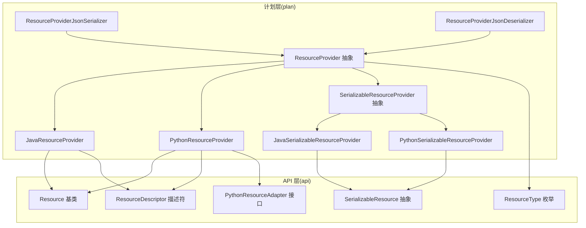
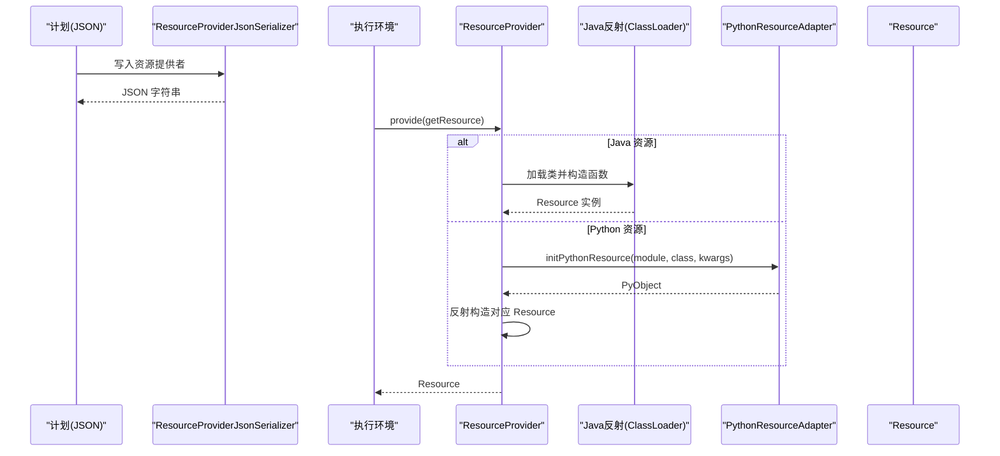
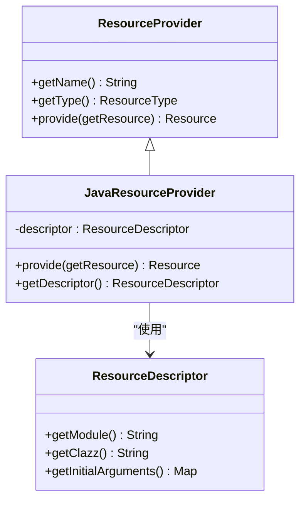
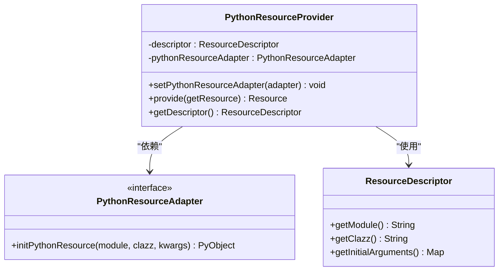
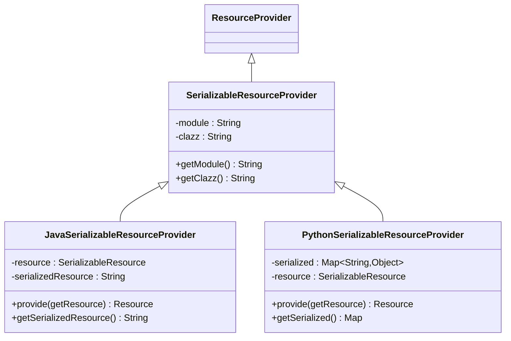
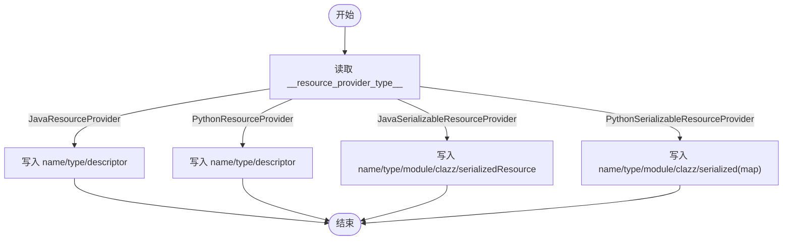
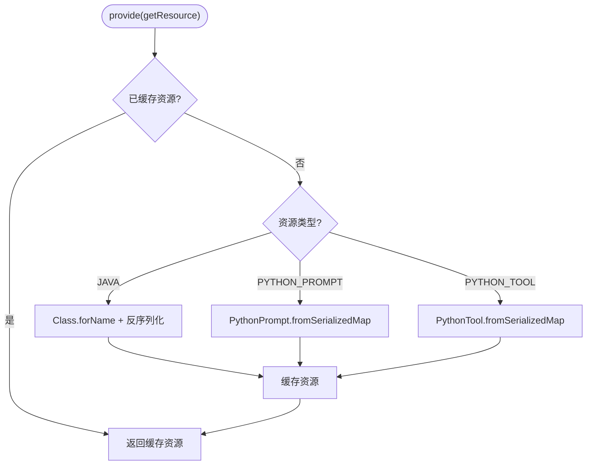
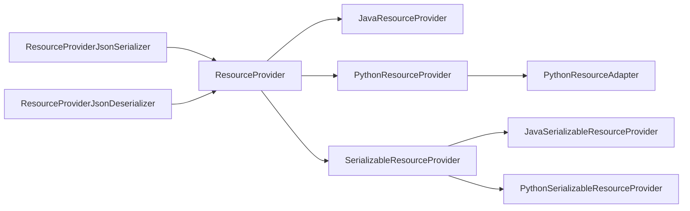

# 资源提供者

<cite>
**本文引用的文件**   
- [ResourceProvider.java](file://plan/src/main/java/org/apache/flink/agents/plan/resourceprovider/ResourceProvider.java)
- [JavaResourceProvider.java](file://plan/src/main/java/org/apache/flink/agents/plan/resourceprovider/JavaResourceProvider.java)
- [PythonResourceProvider.java](file://plan/src/main/java/org/apache/flink/agents/plan/resourceprovider/PythonResourceProvider.java)
- [SerializableResourceProvider.java](file://plan/src/main/java/org/apache/flink/agents/plan/resourceprovider/SerializableResourceProvider.java)
- [JavaSerializableResourceProvider.java](file://plan/src/main/java/org/apache/flink/agents/plan/resourceprovider/JavaSerializableResourceProvider.java)
- [PythonSerializableResourceProvider.java](file://plan/src/main/java/org/apache/flink/agents/plan/resourceprovider/PythonSerializableResourceProvider.java)
- [ResourceProviderJsonSerializer.java](file://plan/src/main/java/org/apache/flink/agents/plan/serializer/ResourceProviderJsonSerializer.java)
- [ResourceProviderJsonDeserializer.java](file://plan/src/main/java/org/apache/flink/agents/plan/serializer/ResourceProviderJsonDeserializer.java)
- [Resource.java](file://api/src/main/java/org/apache/flink/agents/api/resource/Resource.java)
- [SerializableResource.java](file://api/src/main/java/org/apache/flink/agents/api/resource/SerializableResource.java)
- [ResourceDescriptor.java](file://api/src/main/java/org/apache/flink/agents/api/resource/ResourceDescriptor.java)
- [ResourceType.java](file://api/src/main/java/org/apache/flink/agents/api/resource/ResourceType.java)
- [PythonResourceAdapter.java](file://api/src/main/java/org/apache/flink/agents/api/resource/python/PythonResourceAdapter.java)
- [PythonPrompt.java](file://plan/src/main/java/org/apache/flink/agents/plan/resource/python/PythonPrompt.java)
- [PythonTool.java](file://plan/src/main/java/org/apache/flink/agents/plan/resource/python/PythonTool.java)
- [ResourceProviderSerializerTest.java](file://plan/src/test/java/org/apache/flink/agents/plan/serializer/ResourceProviderSerializerTest.java)
</cite>

## 目录
1. [简介](#简介)
2. [项目结构](#项目结构)
3. [核心组件](#核心组件)
4. [架构总览](#架构总览)
5. [组件详解](#组件详解)
6. [依赖关系分析](#依赖关系分析)
7. [性能与内存特性](#性能与内存特性)
8. [故障排查指南](#故障排查指南)
9. [结论](#结论)
10. [附录：扩展开发指南](#附录扩展开发指南)

## 简介
本章节面向 Apache Flink Agents 的“资源提供者”体系，系统性阐述统一资源抽象、延迟加载与缓存机制、跨语言资源适配（Java/Python）、序列化与可序列化资源提供者的特殊处理、注册与依赖解析、冲突处理策略、缓存策略与失效机制、内存管理，以及扩展开发的最佳实践与常见问题诊断。

## 项目结构
资源提供者位于 plan 模块的 resourceprovider 包中，并通过自定义 Jackson 序列化器在计划阶段进行序列化/反序列化；API 层提供统一的 Resource 抽象、ResourceDescriptor 描述符、ResourceType 类型枚举及 PythonResourceAdapter 接口以支撑跨语言交互。

图表来源
- [ResourceProvider.java](file://plan/src/main/java/org/apache/flink/agents/plan/resourceprovider/ResourceProvider.java#L38-L75)
- [JavaResourceProvider.java](file://plan/src/main/java/org/apache/flink/agents/plan/resourceprovider/JavaResourceProvider.java#L29-L56)
- [PythonResourceProvider.java](file://plan/src/main/java/org/apache/flink/agents/plan/resourceprovider/PythonResourceProvider.java#L47-L148)
- [SerializableResourceProvider.java](file://plan/src/main/java/org/apache/flink/agents/plan/resourceprovider/SerializableResourceProvider.java#L30-L59)
- [JavaSerializableResourceProvider.java](file://plan/src/main/java/org/apache/flink/agents/plan/resourceprovider/JavaSerializableResourceProvider.java#L36-L95)
- [PythonSerializableResourceProvider.java](file://plan/src/main/java/org/apache/flink/agents/plan/resourceprovider/PythonSerializableResourceProvider.java#L37-L110)
- [ResourceProviderJsonSerializer.java](file://plan/src/main/java/org/apache/flink/agents/plan/serializer/ResourceProviderJsonSerializer.java#L36-L121)
- [ResourceProviderJsonDeserializer.java](file://plan/src/main/java/org/apache/flink/agents/plan/serializer/ResourceProviderJsonDeserializer.java#L43-L124)
- [Resource.java](file://api/src/main/java/org/apache/flink/agents/api/resource/Resource.java#L30-L70)
- [SerializableResource.java](file://api/src/main/java/org/apache/flink/agents/api/resource/SerializableResource.java#L30-L49)
- [ResourceDescriptor.java](file://api/src/main/java/org/apache/flink/agents/api/resource/ResourceDescriptor.java#L29-L143)
- [ResourceType.java](file://api/src/main/java/org/apache/flink/agents/api/resource/ResourceType.java#L26-L61)
- [PythonResourceAdapter.java](file://api/src/main/java/org/apache/flink/agents/api/resource/python/PythonResourceAdapter.java#L37-L140)

章节来源
- [ResourceProvider.java](file://plan/src/main/java/org/apache/flink/agents/plan/resourceprovider/ResourceProvider.java#L38-L75)
- [ResourceProviderJsonSerializer.java](file://plan/src/main/java/org/apache/flink/agents/plan/serializer/ResourceProviderJsonSerializer.java#L36-L121)
- [ResourceProviderJsonDeserializer.java](file://plan/src/main/java/org/apache/flink/agents/plan/serializer/ResourceProviderJsonDeserializer.java#L43-L124)

## 核心组件
- 统一资源抽象：Resource 作为所有资源的基类，提供类型标识、度量组绑定与关闭接口；SerializableResource 进一步约束可序列化能力。
- 资源描述符：ResourceDescriptor 承载资源的类名、模块路径与初始化参数，支持跨语言兼容。
- 资源类型：ResourceType 定义了聊天模型、嵌入模型、向量库、工具、提示词、MCP 服务器等类型。
- 资源提供者：ResourceProvider 抽象出“携带元数据并在运行时创建 Resource”的职责；具体实现包括 JavaResourceProvider、PythonResourceProvider、JavaSerializableResourceProvider、PythonSerializableResourceProvider。
- 序列化器：ResourceProviderJsonSerializer/Deserializer 通过标记字段区分不同提供者类型，完成跨进程/跨语言的序列化与反序列化。

章节来源
- [Resource.java](file://api/src/main/java/org/apache/flink/agents/api/resource/Resource.java#L30-L70)
- [SerializableResource.java](file://api/src/main/java/org/apache/flink/agents/api/resource/SerializableResource.java#L30-L49)
- [ResourceDescriptor.java](file://api/src/main/java/org/apache/flink/agents/api/resource/ResourceDescriptor.java#L29-L143)
- [ResourceType.java](file://api/src/main/java/org/apache/flink/agents/api/resource/ResourceType.java#L26-L61)
- [ResourceProvider.java](file://plan/src/main/java/org/apache/flink/agents/plan/resourceprovider/ResourceProvider.java#L38-L75)

## 架构总览
资源提供者体系围绕“计划期声明 + 运行期按需创建”的模式工作。计划期通过 ResourceProviderJsonSerializer 将资源提供者写入 JSON；运行期由 RunnerContext 或执行环境调用 ResourceProvider.provide(...)，根据类型选择 Java 反射或 PythonResourceAdapter 初始化对应资源对象。

图表来源
- [ResourceProviderJsonSerializer.java](file://plan/src/main/java/org/apache/flink/agents/plan/serializer/ResourceProviderJsonSerializer.java#L41-L65)
- [JavaResourceProvider.java](file://plan/src/main/java/org/apache/flink/agents/plan/resourceprovider/JavaResourceProvider.java#L37-L51)
- [PythonResourceProvider.java](file://plan/src/main/java/org/apache/flink/agents/plan/resourceprovider/PythonResourceProvider.java#L76-L126)
- [PythonResourceAdapter.java](file://api/src/main/java/org/apache/flink/agents/api/resource/python/PythonResourceAdapter.java#L56-L56)

## 组件详解

### 统一资源抽象与生命周期
- Resource 提供 getResourceType、度量组绑定与关闭接口，便于统一管理资源生命周期与指标。
- SerializableResource 在 Resource 基础上确保可序列化，便于跨进程传输与持久化。

章节来源
- [Resource.java](file://api/src/main/java/org/apache/flink/agents/api/resource/Resource.java#L30-L70)
- [SerializableResource.java](file://api/src/main/java/org/apache/flink/agents/api/resource/SerializableResource.java#L30-L49)

### 资源描述符与类型
- ResourceDescriptor 支持 Java/Python 资源的跨平台声明，包含类名、模块路径与初始参数。
- ResourceType 定义资源类型枚举，用于序列化器识别与运行时分发。

章节来源
- [ResourceDescriptor.java](file://api/src/main/java/org/apache/flink/agents/api/resource/ResourceDescriptor.java#L29-L143)
- [ResourceType.java](file://api/src/main/java/org/apache/flink/agents/api/resource/ResourceType.java#L26-L61)

### Java 资源提供者（JavaResourceProvider）
- 职责：携带 ResourceDescriptor，在运行时通过反射加载目标类并注入 ResourceDescriptor 与 getResource 函数。
- 关键点：
  - 从 ResourceDescriptor 获取模块/类信息，必要时从初始参数中提取 java_clazz。
  - 使用当前线程上下文类加载器 Class.forName 动态加载类。
  - 通过反射获取构造函数并实例化 Resource。

图表来源
- [ResourceProvider.java](file://plan/src/main/java/org/apache/flink/agents/plan/resourceprovider/ResourceProvider.java#L38-L75)
- [JavaResourceProvider.java](file://plan/src/main/java/org/apache/flink/agents/plan/resourceprovider/JavaResourceProvider.java#L29-L56)
- [ResourceDescriptor.java](file://api/src/main/java/org/apache/flink/agents/api/resource/ResourceDescriptor.java#L29-L143)

章节来源
- [JavaResourceProvider.java](file://plan/src/main/java/org/apache/flink/agents/plan/resourceprovider/JavaResourceProvider.java#L29-L56)

### Python 资源提供者（PythonResourceProvider）
- 职责：携带 ResourceDescriptor，在运行时通过 PythonResourceAdapter 初始化 Python 对象，并映射到对应的 Java 资源包装类。
- 关键点：
  - 通过静态映射将 ResourceType 映射到具体 Java 包装类（如聊天模型、嵌入模型、向量库、MCP 服务器）。
  - 若未显式提供模块/类，从 kwargs 中解析 pythonClazz 并拆分为模块与类名。
  - 必须设置 PythonResourceAdapter，否则抛出状态异常。
  - 通过反射构造对应 Java 资源包装类，传入 PythonResourceAdapter、PyObject、ResourceDescriptor 与 getResource。

图表来源
- [PythonResourceProvider.java](file://plan/src/main/java/org/apache/flink/agents/plan/resourceprovider/PythonResourceProvider.java#L47-L148)
- [PythonResourceAdapter.java](file://api/src/main/java/org/apache/flink/agents/api/resource/python/PythonResourceAdapter.java#L37-L140)
- [ResourceDescriptor.java](file://api/src/main/java/org/apache/flink/agents/api/resource/ResourceDescriptor.java#L29-L143)

章节来源
- [PythonResourceProvider.java](file://plan/src/main/java/org/apache/flink/agents/plan/resourceprovider/PythonResourceProvider.java#L47-L148)

### 可序列化资源提供者（SerializableResourceProvider 及其实现）
- 抽象：SerializableResourceProvider 扩展 ResourceProvider，用于声明可序列化的资源，包含 module/clazz 信息。
- Java 实现（JavaSerializableResourceProvider）：
  - 保存序列化后的资源字符串，首次使用时反序列化为本地对象并缓存。
  - 提供静态工厂方法将可序列化资源转换为提供者。
- Python 实现（PythonSerializableResourceProvider）：
  - 保存序列化 Map，按类型（提示词/工具）反序列化为对应对象。
  - 当前支持 PROMPT 与 TOOL 类型，其他类型抛出不支持异常。

图表来源
- [SerializableResourceProvider.java](file://plan/src/main/java/org/apache/flink/agents/plan/resourceprovider/SerializableResourceProvider.java#L30-L59)
- [JavaSerializableResourceProvider.java](file://plan/src/main/java/org/apache/flink/agents/plan/resourceprovider/JavaSerializableResourceProvider.java#L36-L95)
- [PythonSerializableResourceProvider.java](file://plan/src/main/java/org/apache/flink/agents/plan/resourceprovider/PythonSerializableResourceProvider.java#L37-L110)

章节来源
- [JavaSerializableResourceProvider.java](file://plan/src/main/java/org/apache/flink/agents/plan/resourceprovider/JavaSerializableResourceProvider.java#L36-L95)
- [PythonSerializableResourceProvider.java](file://plan/src/main/java/org/apache/flink/agents/plan/resourceprovider/PythonSerializableResourceProvider.java#L37-L110)

### 跨语言资源适配与序列化处理
- PythonResourceAdapter：提供从 Java 到 Python 的对象转换、方法调用与资源初始化能力，是 Python 资源提供者运行时的关键桥梁。
- 序列化器：ResourceProviderJsonSerializer/Deserializer 通过 __resource_provider_type__ 字段区分不同提供者类型，分别处理 Java/Python 与可序列化资源的序列化/反序列化。

图表来源
- [ResourceProviderJsonSerializer.java](file://plan/src/main/java/org/apache/flink/agents/plan/serializer/ResourceProviderJsonSerializer.java#L41-L121)
- [ResourceProviderJsonDeserializer.java](file://plan/src/main/java/org/apache/flink/agents/plan/serializer/ResourceProviderJsonDeserializer.java#L50-L124)

章节来源
- [ResourceProviderJsonSerializer.java](file://plan/src/main/java/org/apache/flink/agents/plan/serializer/ResourceProviderJsonSerializer.java#L36-L121)
- [ResourceProviderJsonDeserializer.java](file://plan/src/main/java/org/apache/flink/agents/plan/serializer/ResourceProviderJsonDeserializer.java#L43-L124)
- [PythonResourceAdapter.java](file://api/src/main/java/org/apache/flink/agents/api/resource/python/PythonResourceAdapter.java#L37-L140)

### 可序列化资源的反序列化与类型分支
- Java：首次使用时基于 clazz 与上下文类加载器反序列化为本地对象并缓存。
- Python：根据类型分支，使用 PythonPrompt/PythonTool 的 fromSerializedMap 方法从 Map 反序列化。

图表来源
- [JavaSerializableResourceProvider.java](file://plan/src/main/java/org/apache/flink/agents/plan/resourceprovider/JavaSerializableResourceProvider.java#L80-L94)
- [PythonSerializableResourceProvider.java](file://plan/src/main/java/org/apache/flink/agents/plan/resourceprovider/PythonSerializableResourceProvider.java#L70-L84)
- [PythonPrompt.java](file://plan/src/main/java/org/apache/flink/agents/plan/resource/python/PythonPrompt.java#L41-L70)
- [PythonTool.java](file://plan/src/main/java/org/apache/flink/agents/plan/resource/python/PythonTool.java#L40-L94)

章节来源
- [JavaSerializableResourceProvider.java](file://plan/src/main/java/org/apache/flink/agents/plan/resourceprovider/JavaSerializableResourceProvider.java#L80-L94)
- [PythonSerializableResourceProvider.java](file://plan/src/main/java/org/apache/flink/agents/plan/resourceprovider/PythonSerializableResourceProvider.java#L70-L84)
- [PythonPrompt.java](file://plan/src/main/java/org/apache/flink/agents/plan/resource/python/PythonPrompt.java#L41-L70)
- [PythonTool.java](file://plan/src/main/java/org/apache/flink/agents/plan/resource/python/PythonTool.java#L40-L94)

### 注册流程、依赖解析与冲突处理
- 注册：资源提供者随 Agent 计划一起序列化，包含 name、type、descriptor/module/clazz/serialized 等字段。
- 依赖解析：provide(getResource) 允许资源在创建过程中按名称与类型获取其他资源，形成资源图。
- 冲突处理：ResourceType 与 name 组合用于唯一标识资源；若重复声明，应由上层计划生成逻辑避免或在运行期按覆盖策略处理（具体策略取决于 RunnerContext 实现）。

章节来源
- [ResourceProvider.java](file://plan/src/main/java/org/apache/flink/agents/plan/resourceprovider/ResourceProvider.java#L73-L74)
- [ResourceType.java](file://api/src/main/java/org/apache/flink/agents/api/resource/ResourceType.java#L26-L61)

### 缓存机制与内存管理
- Java 可序列化资源：首次反序列化后缓存在实例字段中，后续直接复用，避免重复开销。
- Python 可序列化资源：按类型分支反序列化后缓存，减少重复构建成本。
- Python 资源：通过 PythonResourceAdapter 管理 PyObject 生命周期，建议在 Resource.close() 中释放底层资源。
- 内存管理：对大对象（如向量库、模型）应谨慎缓存，结合 RunnerContext 的度量与生命周期管理进行回收。

章节来源
- [JavaSerializableResourceProvider.java](file://plan/src/main/java/org/apache/flink/agents/plan/resourceprovider/JavaSerializableResourceProvider.java#L83-L94)
- [PythonSerializableResourceProvider.java](file://plan/src/main/java/org/apache/flink/agents/plan/resourceprovider/PythonSerializableResourceProvider.java#L73-L84)
- [Resource.java](file://api/src/main/java/org/apache/flink/agents/api/resource/Resource.java#L68-L70)

## 依赖关系分析
- ResourceProvider 与具体实现之间为继承关系；SerializableResourceProvider 与 Java/Python 实现并列。
- JavaResourceProvider 依赖 ResourceDescriptor 与反射；PythonResourceProvider 依赖 PythonResourceAdapter。
- 序列化器依赖各实现类以写出正确的字段与类型标记。

图表来源
- [ResourceProvider.java](file://plan/src/main/java/org/apache/flink/agents/plan/resourceprovider/ResourceProvider.java#L38-L75)
- [JavaResourceProvider.java](file://plan/src/main/java/org/apache/flink/agents/plan/resourceprovider/JavaResourceProvider.java#L29-L56)
- [PythonResourceProvider.java](file://plan/src/main/java/org/apache/flink/agents/plan/resourceprovider/PythonResourceProvider.java#L47-L148)
- [SerializableResourceProvider.java](file://plan/src/main/java/org/apache/flink/agents/plan/resourceprovider/SerializableResourceProvider.java#L30-L59)
- [JavaSerializableResourceProvider.java](file://plan/src/main/java/org/apache/flink/agents/plan/resourceprovider/JavaSerializableResourceProvider.java#L36-L95)
- [PythonSerializableResourceProvider.java](file://plan/src/main/java/org/apache/flink/agents/plan/resourceprovider/PythonSerializableResourceProvider.java#L37-L110)
- [ResourceProviderJsonSerializer.java](file://plan/src/main/java/org/apache/flink/agents/plan/serializer/ResourceProviderJsonSerializer.java#L36-L121)
- [ResourceProviderJsonDeserializer.java](file://plan/src/main/java/org/apache/flink/agents/plan/serializer/ResourceProviderJsonDeserializer.java#L43-L124)
- [PythonResourceAdapter.java](file://api/src/main/java/org/apache/flink/agents/api/resource/python/PythonResourceAdapter.java#L37-L140)

章节来源
- [ResourceProviderJsonSerializer.java](file://plan/src/main/java/org/apache/flink/agents/plan/serializer/ResourceProviderJsonSerializer.java#L36-L121)
- [ResourceProviderJsonDeserializer.java](file://plan/src/main/java/org/apache/flink/agents/plan/serializer/ResourceProviderJsonDeserializer.java#L43-L124)

## 性能与内存特性
- 延迟加载：仅在首次需要时创建资源，避免启动期不必要的初始化。
- 缓存复用：Java/Python 可序列化资源在首次使用后缓存，降低重复反序列化/初始化成本。
- 跨语言调用成本：PythonResourceProvider 通过 PythonResourceAdapter 进行桥接，注意方法调用与对象转换的性能影响。
- 大对象管理：向量库、嵌入模型等资源应谨慎缓存，结合 RunnerContext 的度量与生命周期管理进行回收。

[本节为通用性能讨论，无需列出具体文件来源]

## 故障排查指南
- 反序列化失败（Java 可序列化资源）：检查 serializedResource 是否完整且 clazz 正确，确认上下文类加载器可加载该类。
- Python 资源初始化失败：确认已设置 PythonResourceAdapter；检查 descriptor.module/class 或 kwargs.pythonClazz 的格式与可用性。
- 不支持的资源类型：Python 可序列化资源仅支持 PROMPT/TOOL；其他类型会抛出不支持异常。
- 序列化/反序列化不匹配：确保 __resource_provider_type__ 字段与实际实现一致，避免类型混淆。
- 测试参考：可通过 ResourceProviderSerializerTest 验证序列化输出与期望 JSON 的一致性。

章节来源
- [JavaSerializableResourceProvider.java](file://plan/src/main/java/org/apache/flink/agents/plan/resourceprovider/JavaSerializableResourceProvider.java#L80-L94)
- [PythonResourceProvider.java](file://plan/src/main/java/org/apache/flink/agents/plan/resourceprovider/PythonResourceProvider.java#L76-L126)
- [PythonSerializableResourceProvider.java](file://plan/src/main/java/org/apache/flink/agents/plan/resourceprovider/PythonSerializableResourceProvider.java#L70-L84)
- [ResourceProviderSerializerTest.java](file://plan/src/test/java/org/apache/flink/agents/plan/serializer/ResourceProviderSerializerTest.java#L58-L149)

## 结论
资源提供者体系通过统一抽象、跨语言适配与可序列化机制，实现了计划期声明与运行期按需创建的解耦。Java/Python 资源提供者分别利用反射与 PythonResourceAdapter 完成资源实例化；可序列化提供者则在分布式场景下提供稳定的资源状态持久化与远程传输能力。配合延迟加载与缓存策略，整体具备良好的性能与可维护性。

[本节为总结性内容，无需列出具体文件来源]

## 附录：扩展开发指南

### 自定义资源提供者的实现要求
- 若为 Java 资源：继承 ResourceProvider，实现 provide(getResource)，内部通过 ResourceDescriptor 与反射创建 Resource。
- 若为 Python 资源：继承 ResourceProvider，实现 provide(getResource)，内部通过 PythonResourceAdapter 初始化 PyObject，并反射构造对应 Java 包装类。
- 若为可序列化资源：继承 SerializableResourceProvider，实现 provide(getResource)，在首次使用时反序列化并缓存。
- 保持 name 与 type 的唯一性，避免与已有资源冲突。
- 在序列化器中正确写出字段，确保反序列化端能正确识别类型。

章节来源
- [ResourceProvider.java](file://plan/src/main/java/org/apache/flink/agents/plan/resourceprovider/ResourceProvider.java#L38-L75)
- [JavaResourceProvider.java](file://plan/src/main/java/org/apache/flink/agents/plan/resourceprovider/JavaResourceProvider.java#L29-L56)
- [PythonResourceProvider.java](file://plan/src/main/java/org/apache/flink/agents/plan/resourceprovider/PythonResourceProvider.java#L47-L148)
- [SerializableResourceProvider.java](file://plan/src/main/java/org/apache/flink/agents/plan/resourceprovider/SerializableResourceProvider.java#L30-L59)
- [ResourceProviderJsonSerializer.java](file://plan/src/main/java/org/apache/flink/agents/plan/serializer/ResourceProviderJsonSerializer.java#L41-L121)

### 最佳实践
- 明确资源类型与依赖：在计划阶段清晰声明资源类型与依赖关系，避免运行期循环依赖。
- 合理使用可序列化提供者：对大对象或易变状态谨慎序列化，优先采用延迟加载与按需创建。
- 跨语言边界清晰：PythonResourceProvider 依赖 PythonResourceAdapter，确保其在运行环境中可用。
- 单元测试覆盖：参考 ResourceProviderSerializerTest，验证序列化/反序列化行为与期望一致。

[本节为通用指导，无需列出具体文件来源]