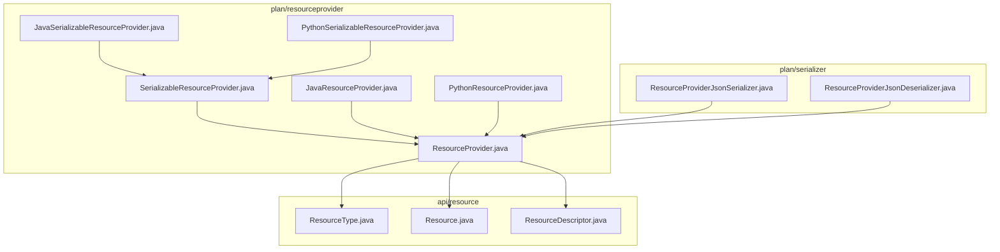
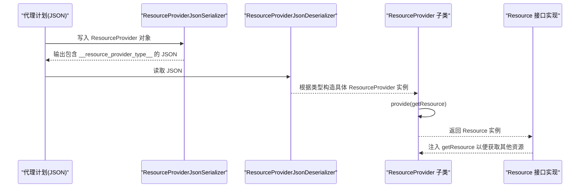
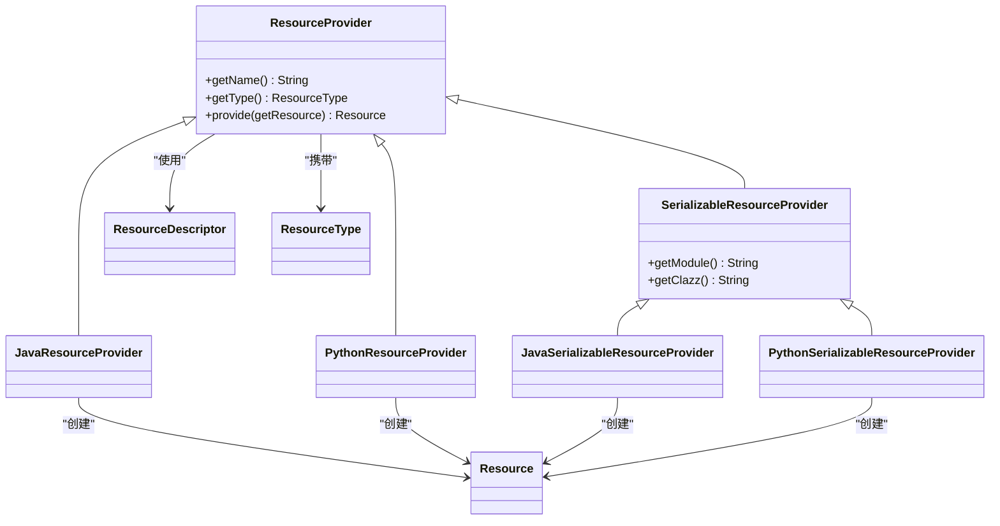

# 资源提供者基类

<cite>
**本文引用的文件**
- [ResourceProvider.java](file://plan/src/main/java/org/apache/flink/agents/plan/resourceprovider/ResourceProvider.java)
- [SerializableResourceProvider.java](file://plan/src/main/java/org/apache/flink/agents/plan/resourceprovider/SerializableResourceProvider.java)
- [JavaResourceProvider.java](file://plan/src/main/java/org/apache/flink/agents/plan/resourceprovider/JavaResourceProvider.java)
- [PythonResourceProvider.java](file://plan/src/main/java/org/apache/flink/agents/plan/resourceprovider/PythonResourceProvider.java)
- [JavaSerializableResourceProvider.java](file://plan/src/main/java/org/apache/flink/agents/plan/resourceprovider/JavaSerializableResourceProvider.java)
- [PythonSerializableResourceProvider.java](file://plan/src/main/java/org/apache/flink/agents/plan/resourceprovider/PythonSerializableResourceProvider.java)
- [ResourceProviderJsonSerializer.java](file://plan/src/main/java/org/apache/flink/agents/plan/serializer/ResourceProviderJsonSerializer.java)
- [ResourceProviderJsonDeserializer.java](file://plan/src/main/java/org/apache/flink/agents/plan/serializer/ResourceProviderJsonDeserializer.java)
- [ResourceType.java](file://api/src/main/java/org/apache/flink/agents/api/resource/ResourceType.java)
- [Resource.java](file://api/src/main/java/org/apache/flink/agents/api/resource/Resource.java)
- [ResourceDescriptor.java](file://api/src/main/java/org/apache/flink/agents/api/resource/ResourceDescriptor.java)
- [ResourceProviderSerializerTest.java](file://plan/src/test/java/org/apache/flink/agents/plan/serializer/ResourceProviderSerializerTest.java)
- [python_resource_provider.json](file://plan/src/test/resources/resource_providers/python_resource_provider.json)
- [python_serializable_resource_provider.json](file://plan/src/test/resources/resource_providers/python_serializable_resource_provider.json)
</cite>

## 目录
1. [简介](#简介)
2. [项目结构](#项目结构)
3. [核心组件](#核心组件)
4. [架构总览](#架构总览)
5. [组件详细分析](#组件详细分析)
6. [依赖关系分析](#依赖关系分析)
7. [性能考量](#性能考量)
8. [故障排查指南](#故障排查指南)
9. [结论](#结论)
10. [附录：使用示例与最佳实践](#附录使用示例与最佳实践)

## 简介
本文件面向 Apache Flink Agents 的“资源提供者”抽象体系，系统性解析 ResourceProvider 抽象类的设计原理、职责边界与运行时资源创建流程；详解构造函数参数 name 与 type 的语义与约束；阐明 getName()/getType() 的访问策略；说明 provide() 抽象方法的实现要求与 BiFunction 形参 getResource 的工作机制及异常处理策略；并深入讲解 JSON 序列化注解（@JsonSerialize/@JsonDeserialize）与自定义序列化器的实现原理；最后给出资源提供者在代理计划中的生命周期管理（注册、发现、实例化）与继承扩展的最佳实践。

## 项目结构
围绕资源提供者的核心代码位于 plan 模块的 resourceprovider 包与 serializer 包，并与 api 模块的资源接口与类型定义形成协作关系。

图表来源
- [ResourceProvider.java](file://plan/src/main/java/org/apache/flink/agents/plan/resourceprovider/ResourceProvider.java#L30-L76)
- [SerializableResourceProvider.java](file://plan/src/main/java/org/apache/flink/agents/plan/resourceprovider/SerializableResourceProvider.java#L23-L60)
- [JavaResourceProvider.java](file://plan/src/main/java/org/apache/flink/agents/plan/resourceprovider/JavaResourceProvider.java#L28-L57)
- [PythonResourceProvider.java](file://plan/src/main/java/org/apache/flink/agents/plan/resourceprovider/PythonResourceProvider.java#L41-L149)
- [JavaSerializableResourceProvider.java](file://plan/src/main/java/org/apache/flink/agents/plan/resourceprovider/JavaSerializableResourceProvider.java#L30-L96)
- [PythonSerializableResourceProvider.java](file://plan/src/main/java/org/apache/flink/agents/plan/resourceprovider/PythonSerializableResourceProvider.java#L31-L110)
- [ResourceProviderJsonSerializer.java](file://plan/src/main/java/org/apache/flink/agents/plan/serializer/ResourceProviderJsonSerializer.java#L32-L122)
- [ResourceProviderJsonDeserializer.java](file://plan/src/main/java/org/apache/flink/agents/plan/serializer/ResourceProviderJsonDeserializer.java#L39-L125)
- [ResourceType.java](file://api/src/main/java/org/apache/flink/agents/api/resource/ResourceType.java#L21-L62)
- [Resource.java](file://api/src/main/java/org/apache/flink/agents/api/resource/Resource.java#L25-L71)
- [ResourceDescriptor.java](file://api/src/main/java/org/apache/flink/agents/api/resource/ResourceDescriptor.java#L28-L144)

章节来源
- [ResourceProvider.java](file://plan/src/main/java/org/apache/flink/agents/plan/resourceprovider/ResourceProvider.java#L30-L76)
- [ResourceType.java](file://api/src/main/java/org/apache/flink/agents/api/resource/ResourceType.java#L21-L62)
- [Resource.java](file://api/src/main/java/org/apache/flink/agents/api/resource/Resource.java#L25-L71)
- [ResourceDescriptor.java](file://api/src/main/java/org/apache/flink/agents/api/resource/ResourceDescriptor.java#L28-L144)

## 核心组件
- ResourceProvider 抽象类：承载资源元数据（name、type），定义运行时资源创建入口 provide()，并声明 JSON 序列化/反序列化策略。
- 可序列化资源提供者基类 SerializableResourceProvider：用于标识可序列化的资源提供者，携带 module/clazz 信息以支持跨语言/分布式场景。
- JavaResourceProvider：基于 ResourceDescriptor 在运行时通过反射构造 Java 资源实例。
- PythonResourceProvider：基于 ResourceDescriptor 或 kwargs 提供 Python 资源初始化，内部维护类型到适配类的映射。
- JavaSerializableResourceProvider：将 SerializableResource 序列化为字符串，在运行时反序列化复用对象。
- PythonSerializableResourceProvider：将 Python 资源（如工具、提示词）序列化为 Map，在运行时从 Map 构造资源对象。
- 自定义序列化器：ResourceProviderJsonSerializer/Deserializer 基于 __resource_provider_type__ 字段识别具体子类，完成多态序列化与反序列化。

章节来源
- [ResourceProvider.java](file://plan/src/main/java/org/apache/flink/agents/plan/resourceprovider/ResourceProvider.java#L30-L76)
- [SerializableResourceProvider.java](file://plan/src/main/java/org/apache/flink/agents/plan/resourceprovider/SerializableResourceProvider.java#L23-L60)
- [JavaResourceProvider.java](file://plan/src/main/java/org/apache/flink/agents/plan/resourceprovider/JavaResourceProvider.java#L28-L57)
- [PythonResourceProvider.java](file://plan/src/main/java/org/apache/flink/agents/plan/resourceprovider/PythonResourceProvider.java#L41-L149)
- [JavaSerializableResourceProvider.java](file://plan/src/main/java/org/apache/flink/agents/plan/resourceprovider/JavaSerializableResourceProvider.java#L30-L96)
- [PythonSerializableResourceProvider.java](file://plan/src/main/java/org/apache/flink/agents/plan/resourceprovider/PythonSerializableResourceProvider.java#L31-L110)
- [ResourceProviderJsonSerializer.java](file://plan/src/main/java/org/apache/flink/agents/plan/serializer/ResourceProviderJsonSerializer.java#L32-L122)
- [ResourceProviderJsonDeserializer.java](file://plan/src/main/java/org/apache/flink/agents/plan/serializer/ResourceProviderJsonDeserializer.java#L39-L125)

## 架构总览
下图展示了资源提供者在代理计划中的生命周期：从序列化存储到运行时发现与实例化，以及资源对象的创建与依赖注入。

图表来源
- [ResourceProviderJsonSerializer.java](file://plan/src/main/java/org/apache/flink/agents/plan/serializer/ResourceProviderJsonSerializer.java#L41-L65)
- [ResourceProviderJsonDeserializer.java](file://plan/src/main/java/org/apache/flink/agents/plan/serializer/ResourceProviderJsonDeserializer.java#L50-L72)
- [ResourceProvider.java](file://plan/src/main/java/org/apache/flink/agents/plan/resourceprovider/ResourceProvider.java#L66-L74)
- [Resource.java](file://api/src/main/java/org/apache/flink/agents/api/resource/Resource.java#L30-L42)

## 组件详细分析

### ResourceProvider 抽象类
- 设计要点
  - 元数据承载：name 与 type 作为资源标识，贯穿序列化、反序列化与运行时查找。
  - 运行时创建：provide() 作为统一入口，接收 BiFunction 形参 getResource，用于在同计划内按名称/类型获取其他资源。
  - JSON 策略：通过 @JsonSerialize/@JsonDeserialize 指定自定义序列化器，确保多态正确输出与输入。
- 访问控制
  - getName()/getType() 为公开只读访问器，便于外部查询与日志记录。
- 异常处理
  - provide() 声明抛出 Exception，允许子类在资源创建失败时抛出具体异常，由上层捕获与处理。

章节来源
- [ResourceProvider.java](file://plan/src/main/java/org/apache/flink/agents/plan/resourceprovider/ResourceProvider.java#L30-L76)
- [ResourceType.java](file://api/src/main/java/org/apache/flink/agents/api/resource/ResourceType.java#L21-L62)
- [Resource.java](file://api/src/main/java/org/apache/flink/agents/api/resource/Resource.java#L30-L42)

### 可序列化资源提供者基类 SerializableResourceProvider
- 作用
  - 标识资源提供者可序列化，携带 module/clazz 信息，便于跨进程/跨语言传输与恢复。
- 字段
  - module：资源类所在模块路径。
  - clazz：资源类名。
- 与 ResourceProvider 的关系
  - 扩展 ResourceProvider，保留 name/type 元数据，新增序列化相关字段。

章节来源
- [SerializableResourceProvider.java](file://plan/src/main/java/org/apache/flink/agents/plan/resourceprovider/SerializableResourceProvider.java#L23-L60)

### JavaResourceProvider
- 用途
  - 基于 ResourceDescriptor 在运行时通过反射创建 Java 资源实例。
- 关键逻辑
  - 通过当前线程上下文类加载器定位目标类，匹配带 ResourceDescriptor 与 BiFunction 的构造函数，完成实例化。
  - 支持从 descriptor 中提取初始化参数，传递给资源构造函数。
- 异常处理
  - 类加载失败、构造函数签名不匹配等均会抛出异常，需在上层捕获并处理。

章节来源
- [JavaResourceProvider.java](file://plan/src/main/java/org/apache/flink/agents/plan/resourceprovider/JavaResourceProvider.java#L28-L57)
- [ResourceDescriptor.java](file://api/src/main/java/org/apache/flink/agents/api/resource/ResourceDescriptor.java#L28-L144)

### PythonResourceProvider
- 用途
  - 为 Python 资源提供运行时创建能力，内部维护 ResourceType 到对应适配类的映射。
- 关键逻辑
  - 校验 PythonResourceAdapter 已设置；根据类型选择适配类；从 descriptor 或 kwargs 中解析模块与类名；调用适配器初始化 Python 资源；通过适配类构造函数完成包装。
  - 特殊处理：当类型为 MCP_SERVER 时，强制使用内置模块与类名。
- 异常处理
  - 未设置适配器、不支持的资源类型、kwargs 缺失或格式错误等情况均抛出异常。

章节来源
- [PythonResourceProvider.java](file://plan/src/main/java/org/apache/flink/agents/plan/resourceprovider/PythonResourceProvider.java#L41-L149)

### JavaSerializableResourceProvider
- 用途
  - 将 SerializableResource 序列化为字符串，运行时按需反序列化复用对象，避免重复创建。
- 关键逻辑
  - 提供静态工厂方法从 SerializableResource 创建提供者；运行时若内存中无对象则反序列化字符串为对象。
- 性能考虑
  - 首次反序列化后缓存对象，后续直接返回，降低开销。

章节来源
- [JavaSerializableResourceProvider.java](file://plan/src/main/java/org/apache/flink/agents/plan/resourceprovider/JavaSerializableResourceProvider.java#L30-L96)

### PythonSerializableResourceProvider
- 用途
  - 将 Python 资源（如工具、提示词）序列化为 Map，在运行时从 Map 构造资源对象。
- 关键逻辑
  - 支持 PROMPT 与 TOOL 类型的反序列化；其他类型抛出不支持异常。
- 异常处理
  - 不支持的类型直接抛出异常，提示上层修正类型。

章节来源
- [PythonSerializableResourceProvider.java](file://plan/src/main/java/org/apache/flink/agents/plan/resourceprovider/PythonSerializableResourceProvider.java#L31-L110)

### JSON 序列化与反序列化
- 注解与策略
  - ResourceProvider 使用 @JsonSerialize(using=...) 与 @JsonDeserialize(using=...) 指定自定义序列化器与反序列化器。
- 多态识别
  - 序列化器在输出 JSON 时写入 __resource_provider_type__ 字段；反序列化器据此判断具体子类并构造实例。
- 字段映射
  - 各子类序列化字段不同：JavaResourceProvider/PythonResourceProvider 输出 descriptor；可序列化子类输出 module/clazz 与 serialized/serializedResource。
- 测试验证
  - 单元测试通过读取期望 JSON 文件与实际序列化结果比对，确保字段与结构一致。

章节来源
- [ResourceProvider.java](file://plan/src/main/java/org/apache/flink/agents/plan/resourceprovider/ResourceProvider.java#L36-L37)
- [ResourceProviderJsonSerializer.java](file://plan/src/main/java/org/apache/flink/agents/plan/serializer/ResourceProviderJsonSerializer.java#L32-L122)
- [ResourceProviderJsonDeserializer.java](file://plan/src/main/java/org/apache/flink/agents/plan/serializer/ResourceProviderJsonDeserializer.java#L39-L125)
- [ResourceProviderSerializerTest.java](file://plan/src/test/java/org/apache/flink/agents/plan/serializer/ResourceProviderSerializerTest.java#L38-L151)
- [python_resource_provider.json](file://plan/src/test/resources/resource_providers/python_resource_provider.json#L1-L13)
- [python_serializable_resource_provider.json](file://plan/src/test/resources/resource_providers/python_serializable_resource_provider.json#L1-L39)

## 依赖关系分析

图表来源
- [ResourceProvider.java](file://plan/src/main/java/org/apache/flink/agents/plan/resourceprovider/ResourceProvider.java#L30-L76)
- [SerializableResourceProvider.java](file://plan/src/main/java/org/apache/flink/agents/plan/resourceprovider/SerializableResourceProvider.java#L23-L60)
- [JavaResourceProvider.java](file://plan/src/main/java/org/apache/flink/agents/plan/resourceprovider/JavaResourceProvider.java#L28-L57)
- [PythonResourceProvider.java](file://plan/src/main/java/org/apache/flink/agents/plan/resourceprovider/PythonResourceProvider.java#L41-L149)
- [JavaSerializableResourceProvider.java](file://plan/src/main/java/org/apache/flink/agents/plan/resourceprovider/JavaSerializableResourceProvider.java#L30-L96)
- [PythonSerializableResourceProvider.java](file://plan/src/main/java/org/apache/flink/agents/plan/resourceprovider/PythonSerializableResourceProvider.java#L31-L110)
- [Resource.java](file://api/src/main/java/org/apache/flink/agents/api/resource/Resource.java#L25-L71)
- [ResourceDescriptor.java](file://api/src/main/java/org/apache/flink/agents/api/resource/ResourceDescriptor.java#L28-L144)
- [ResourceType.java](file://api/src/main/java/org/apache/flink/agents/api/resource/ResourceType.java#L21-L62)

## 性能考量
- 反射与类加载
  - JavaResourceProvider 通过 Class.forName 与构造函数反射创建实例，建议在可用时复用已加载类与构造器引用以减少开销。
- 序列化缓存
  - JavaSerializableResourceProvider 首次反序列化后缓存对象，避免重复创建；PythonSerializableResourceProvider 在运行时按需构造，注意 Map 解析成本。
- Python 适配器
  - PythonResourceProvider 依赖 PythonResourceAdapter 初始化 Python 资源，初始化成本较高，应尽量避免重复初始化。

[本节为通用性能建议，无需列出章节来源]

## 故障排查指南
- 序列化/反序列化问题
  - 症状：JSON 缺少 __resource_provider_type__ 或类型不匹配导致反序列化失败。
  - 处理：检查序列化器输出字段与反序列化器分支是否一致；确认类型值与枚举匹配。
- 反射创建失败
  - 症状：JavaResourceProvider 在构造资源时抛出类加载或构造函数不匹配异常。
  - 处理：核对 ResourceDescriptor 中的类名与模块路径、构造函数签名与参数顺序。
- Python 资源初始化失败
  - 症状：PythonResourceProvider 抛出适配器未设置、类型不支持或 kwargs 格式错误。
  - 处理：确保已设置 PythonResourceAdapter；校验 descriptor/module/clazz 或 kwargs 的格式与完整性。
- 不支持的资源类型
  - 症状：PythonSerializableResourceProvider 或序列化器遇到未知类型抛出异常。
  - 处理：仅使用受支持的类型（如 PROMPT、TOOL），并在扩展时完善序列化器分支。

章节来源
- [ResourceProviderJsonDeserializer.java](file://plan/src/main/java/org/apache/flink/agents/plan/serializer/ResourceProviderJsonDeserializer.java#L50-L72)
- [JavaResourceProvider.java](file://plan/src/main/java/org/apache/flink/agents/plan/resourceprovider/JavaResourceProvider.java#L37-L51)
- [PythonResourceProvider.java](file://plan/src/main/java/org/apache/flink/agents/plan/resourceprovider/PythonResourceProvider.java#L76-L126)
- [PythonSerializableResourceProvider.java](file://plan/src/main/java/org/apache/flink/agents/plan/resourceprovider/PythonSerializableResourceProvider.java#L70-L84)

## 结论
ResourceProvider 抽象类通过“元数据 + 运行时创建”的设计，将资源声明与实例化解耦；配合可序列化基类与多态序列化器，实现了跨语言与分布式场景下的稳定传输与恢复。子类分别覆盖了 Java/Python 资源的创建路径与序列化策略，提供清晰的异常处理与约束条件。遵循本文的实现与扩展规范，可在代理计划中可靠地注册、发现与实例化各类资源。

[本节为总结性内容，无需列出章节来源]

## 附录：使用示例与最佳实践
- 继承 ResourceProvider 的步骤
  - 明确资源类型：参考 ResourceType 枚举，确保类型值与序列化器分支一致。
  - 设计构造函数：接收 name、type 与必要的描述信息（如 ResourceDescriptor 或序列化字符串/Map）。
  - 实现 provide()：利用 getResource 获取同计划内的其他资源；根据类型与描述信息创建并返回 Resource 实例；在异常情况下抛出明确异常。
  - 若资源可序列化：继承 SerializableResourceProvider，提供 module/clazz 与序列化数据；在运行时按需反序列化。
- JSON 序列化注意事项
  - 确保 @JsonSerialize/@JsonDeserialize 正确配置，且序列化器/反序列化器覆盖所有子类分支。
  - 输出 JSON 必须包含 __resource_provider_type__ 字段，以便反序列化器正确识别类型。
- 示例参考
  - Python 资源提供者序列化输出结构可参考测试资源文件：
    - [python_resource_provider.json](file://plan/src/test/resources/resource_providers/python_resource_provider.json#L1-L13)
    - [python_serializable_resource_provider.json](file://plan/src/test/resources/resource_providers/python_serializable_resource_provider.json#L1-L39)
  - 序列化与反序列化行为可通过以下测试验证：
    - [ResourceProviderSerializerTest.java](file://plan/src/test/java/org/apache/flink/agents/plan/serializer/ResourceProviderSerializerTest.java#L38-L151)

章节来源
- [ResourceProvider.java](file://plan/src/main/java/org/apache/flink/agents/plan/resourceprovider/ResourceProvider.java#L30-L76)
- [ResourceType.java](file://api/src/main/java/org/apache/flink/agents/api/resource/ResourceType.java#L21-L62)
- [ResourceProviderJsonSerializer.java](file://plan/src/main/java/org/apache/flink/agents/plan/serializer/ResourceProviderJsonSerializer.java#L32-L122)
- [ResourceProviderJsonDeserializer.java](file://plan/src/main/java/org/apache/flink/agents/plan/serializer/ResourceProviderJsonDeserializer.java#L39-L125)
- [python_resource_provider.json](file://plan/src/test/resources/resource_providers/python_resource_provider.json#L1-L13)
- [python_serializable_resource_provider.json](file://plan/src/test/resources/resource_providers/python_serializable_resource_provider.json#L1-L39)
- [ResourceProviderSerializerTest.java](file://plan/src/test/java/org/apache/flink/agents/plan/serializer/ResourceProviderSerializerTest.java#L38-L151)