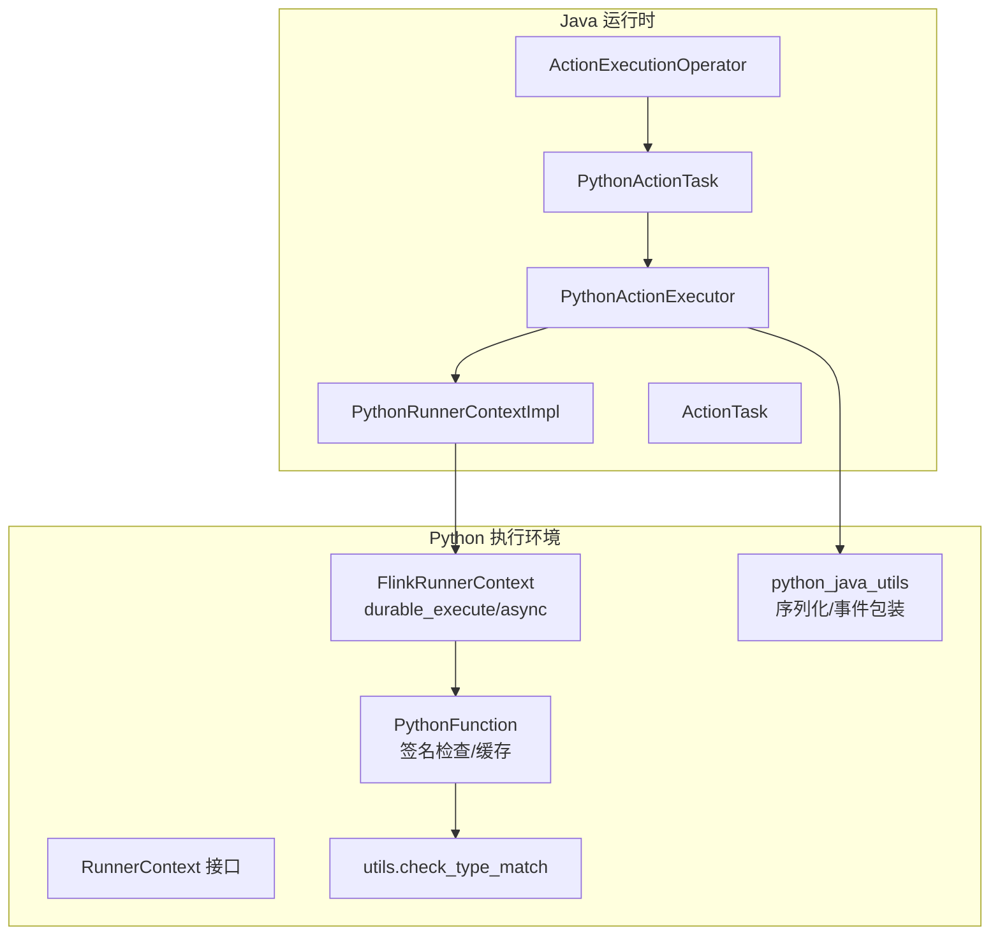
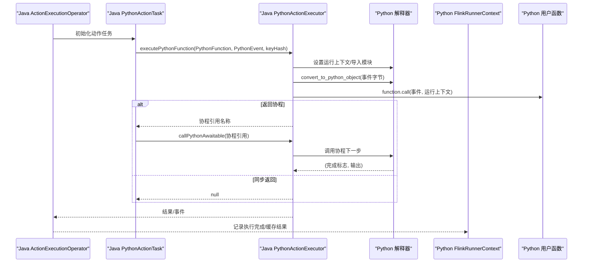
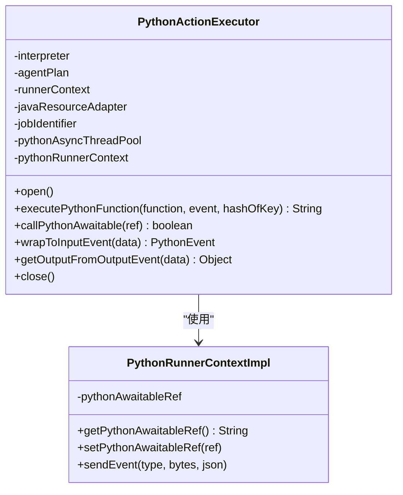
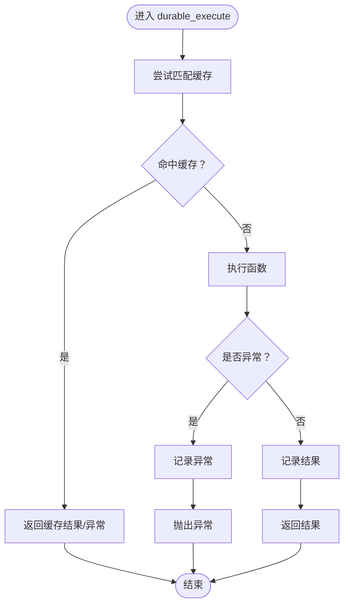
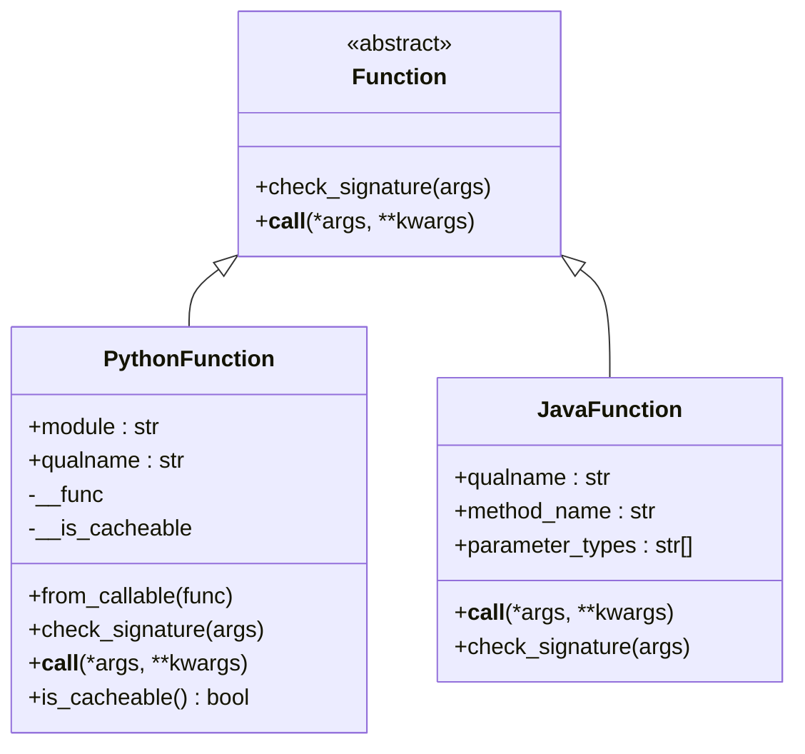
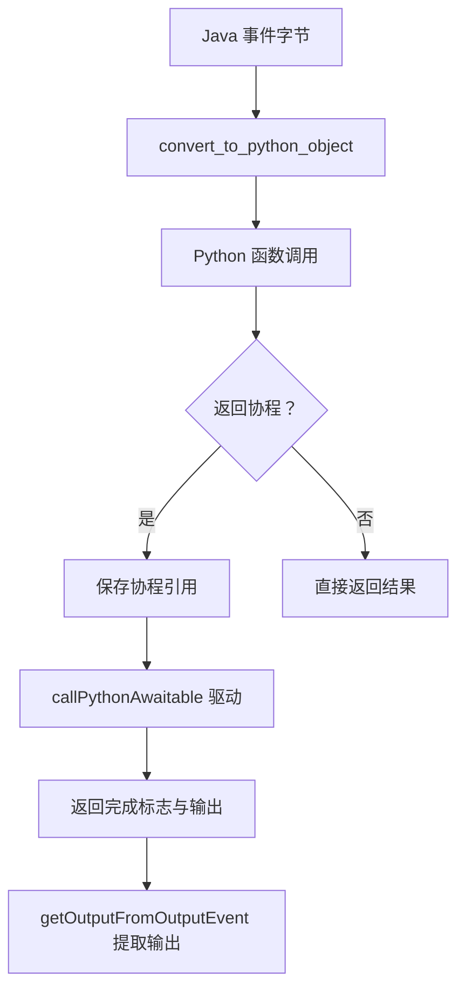
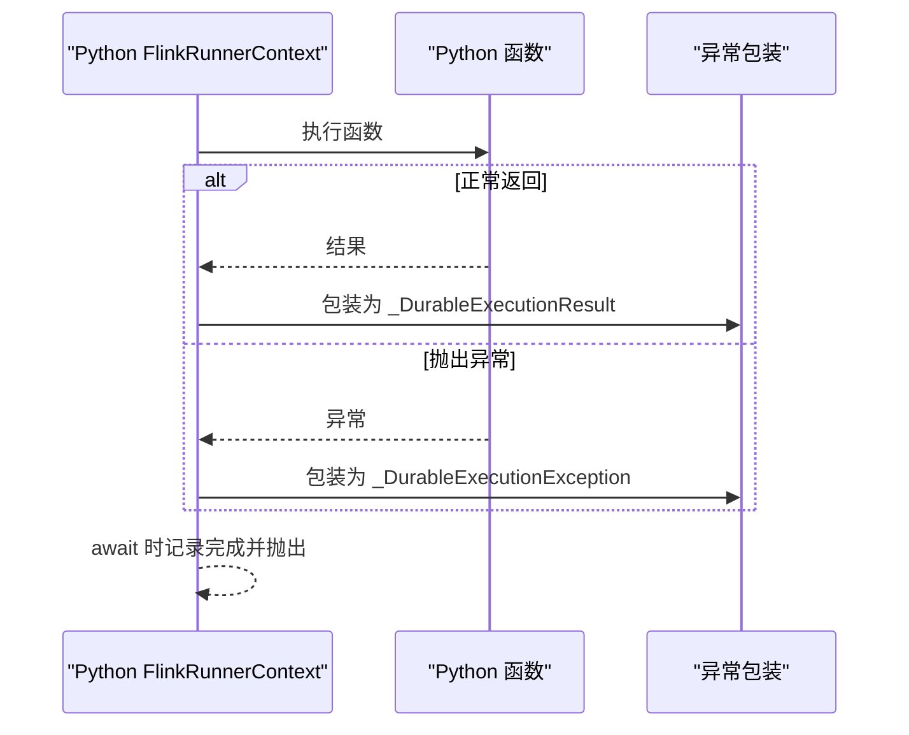
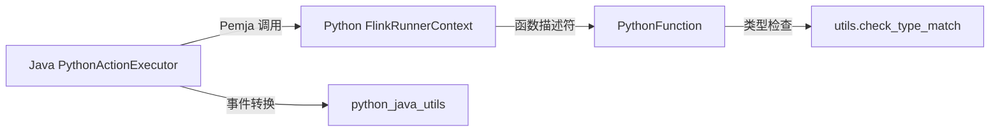

# Python 动作执行器

<cite>
**本文档引用的文件**
- [PythonActionExecutor.java](file://runtime/src/main/java/org/apache/flink/agents/runtime/python/utils/PythonActionExecutor.java)
- [PythonRunnerContextImpl.java](file://runtime/src/main/java/org/apache/flink/agents/runtime/python/context/PythonRunnerContextImpl.java)
- [PythonActionTask.java](file://runtime/src/main/java/org/apache/flink/agents/runtime/python/operator/PythonActionTask.java)
- [ActionExecutionOperator.java](file://runtime/src/main/java/org/apache/flink/agents/runtime/operator/ActionExecutionOperator.java)
- [ActionTask.java](file://runtime/src/main/java/org/apache/flink/agents/runtime/operator/ActionTask.java)
- [flink_runner_context.py](file://python/flink_agents/runtime/flink_runner_context.py)
- [function.py](file://python/flink_agents/plan/function.py)
- [python_java_utils.py](file://python/flink_agents/runtime/python_java_utils.py)
- [runner_context.py](file://python/flink_agents/api/runner_context.py)
- [utils.py](file://python/flink_agents/plan/utils.py)
- [test_runner_context_execute.py](file://python/flink_agents/runtime/tests/test_runner_context_execute.py)
- [execute_test_agent.py](file://python/flink_agents/e2e_tests/e2e_tests_integration/execute_test_agent.py)
</cite>

## 目录
1. [简介](#简介)
2. [项目结构](#项目结构)
3. [核心组件](#核心组件)
4. [架构总览](#架构总览)
5. [详细组件分析](#详细组件分析)
6. [依赖关系分析](#依赖关系分析)
7. [性能考虑](#性能考虑)
8. [故障排查指南](#故障排查指南)
9. [结论](#结论)
10. [附录](#附录)

## 简介
本文件为 Python 动作执行器（PythonActionExecutor）提供完整的技术文档。该执行器负责在 Flink 代理运行时中，将 Java 层的动作任务与 Python 层的用户函数进行桥接，实现跨语言的动态函数调用、参数序列化/反序列化、事件封装与输出提取、异步协程驱动以及持久化执行等能力。文档涵盖以下主题：
- 动态函数发现与加载：模块导入、函数解析与签名验证
- 参数转换系统：类型检查、默认值处理与可选参数支持
- 异常处理策略：Python 异常捕获、错误信息转换与堆栈跟踪保留
- 超时与中断机制：执行时间限制、取消操作与资源清理
- 性能优化技术：函数缓存、线程池复用与并发控制
- 配置选项与监控：执行统计、性能指标与故障诊断

## 项目结构
Python 动作执行器横跨 Java 运行时与 Python 执行环境，通过 Pemja 桥接两者。关键目录与文件如下：
- Java 运行时
  - PythonActionExecutor：负责在 Python 解释器中执行用户函数、管理协程与事件转换
  - PythonRunnerContextImpl：Python 侧运行上下文，承载事件发送与协程引用
  - PythonActionTask：动作任务，触发 Python 函数执行并处理协程
  - ActionExecutionOperator：Flink Operator，初始化 Python 环境并调度动作
  - ActionTask：动作任务抽象与结果封装
- Python 执行环境
  - flink_runner_context：提供 durable_execute/durable_execute_async、事件发送与内存访问控制
  - function：PythonFunction 描述符、签名检查与函数缓存
  - python_java_utils：对象序列化/反序列化、事件包装与输出提取
  - runner_context：RunnerContext 抽象接口定义
  - utils：类型匹配工具

**图表来源**
- [ActionExecutionOperator.java](file://runtime/src/main/java/org/apache/flink/agents/runtime/operator/ActionExecutionOperator.java#L612-L626)
- [PythonActionTask.java](file://runtime/src/main/java/org/apache/flink/agents/runtime/python/operator/PythonActionTask.java#L55-L72)
- [PythonActionExecutor.java](file://runtime/src/main/java/org/apache/flink/agents/runtime/python/utils/PythonActionExecutor.java#L123-L149)
- [PythonRunnerContextImpl.java](file://runtime/src/main/java/org/apache/flink/agents/runtime/python/context/PythonRunnerContextImpl.java#L31-L69)
- [flink_runner_context.py](file://python/flink_agents/runtime/flink_runner_context.py#L181-L572)
- [function.py](file://python/flink_agents/plan/function.py#L104-L371)
- [python_java_utils.py](file://python/flink_agents/runtime/python_java_utils.py#L48-L77)
- [runner_context.py](file://python/flink_agents/api/runner_context.py#L76-L291)
- [utils.py](file://python/flink_agents/plan/utils.py#L22-L89)

**章节来源**
- [ActionExecutionOperator.java](file://runtime/src/main/java/org/apache/flink/agents/runtime/operator/ActionExecutionOperator.java#L612-L626)
- [PythonActionExecutor.java](file://runtime/src/main/java/org/apache/flink/agents/runtime/python/utils/PythonActionExecutor.java#L35-L211)
- [flink_runner_context.py](file://python/flink_agents/runtime/flink_runner_context.py#L181-L572)
- [function.py](file://python/flink_agents/plan/function.py#L104-L371)
- [python_java_utils.py](file://python/flink_agents/runtime/python_java_utils.py#L48-L77)
- [runner_context.py](file://python/flink_agents/api/runner_context.py#L76-L291)
- [utils.py](file://python/flink_agents/plan/utils.py#L22-L89)

## 核心组件
- PythonActionExecutor
  - 在 Python 解释器中执行用户函数，管理协程生命周期，负责事件封装与输出提取
  - 提供协程驱动入口与异常包装，确保与 Java 的交互安全
- PythonRunnerContextImpl
  - Python 侧运行上下文，持有协程引用并在 Python 与 Java 间传递事件
- FlinkRunnerContext（Python）
  - 提供 durable_execute/durable_execute_async，实现确定性重放与结果缓存
  - 控制内存访问与事件发送，记录执行完成状态
- PythonFunction
  - 描述符，存储模块与限定名，按需导入并调用；支持签名检查与函数缓存
- python_java_utils
  - 对象序列化/反序列化、输入事件包装、输出提取
- RunnerContext 接口
  - 定义事件发送、资源获取、内存访问、配置读取与持久化执行 API

**章节来源**
- [PythonActionExecutor.java](file://runtime/src/main/java/org/apache/flink/agents/runtime/python/utils/PythonActionExecutor.java#L35-L211)
- [PythonRunnerContextImpl.java](file://runtime/src/main/java/org/apache/flink/agents/runtime/python/context/PythonRunnerContextImpl.java#L31-L69)
- [flink_runner_context.py](file://python/flink_agents/runtime/flink_runner_context.py#L181-L572)
- [function.py](file://python/flink_agents/plan/function.py#L116-L238)
- [python_java_utils.py](file://python/flink_agents/runtime/python_java_utils.py#L48-L77)
- [runner_context.py](file://python/flink_agents/api/runner_context.py#L76-L291)

## 架构总览
下图展示从 Java Operator 到 Python 执行器再到用户函数的完整调用链路，包含协程驱动与事件回传。

**图表来源**
- [ActionExecutionOperator.java](file://runtime/src/main/java/org/apache/flink/agents/runtime/operator/ActionExecutionOperator.java#L485-L626)
- [PythonActionTask.java](file://runtime/src/main/java/org/apache/flink/agents/runtime/python/operator/PythonActionTask.java#L55-L72)
- [PythonActionExecutor.java](file://runtime/src/main/java/org/apache/flink/agents/runtime/python/utils/PythonActionExecutor.java#L123-L186)
- [flink_runner_context.py](file://python/flink_agents/runtime/flink_runner_context.py#L408-L487)

**章节来源**
- [ActionExecutionOperator.java](file://runtime/src/main/java/org/apache/flink/agents/runtime/operator/ActionExecutionOperator.java#L485-L626)
- [PythonActionTask.java](file://runtime/src/main/java/org/apache/flink/agents/runtime/python/operator/PythonActionTask.java#L55-L72)
- [PythonActionExecutor.java](file://runtime/src/main/java/org/apache/flink/agents/runtime/python/utils/PythonActionExecutor.java#L123-L186)
- [flink_runner_context.py](file://python/flink_agents/runtime/flink_runner_context.py#L408-L487)

## 详细组件分析

### Python 动作执行器（Java）
- 职责
  - 在 Python 解释器中创建并管理运行上下文
  - 将 Java 事件转换为 Python 对象，调用用户函数
  - 处理协程返回与驱动，封装输出事件
  - 关闭时释放线程池与上下文资源
- 关键流程
  - 打开：导入模块、创建线程池、创建 Python 运行上下文
  - 执行：切换动作上下文、转换事件、调用函数、返回协程引用或直接结果
  - 协程：通过引用名驱动协程，返回完成标志与输出
  - 关闭：关闭线程池与上下文

**图表来源**
- [PythonActionExecutor.java](file://runtime/src/main/java/org/apache/flink/agents/runtime/python/utils/PythonActionExecutor.java#L79-L211)
- [PythonRunnerContextImpl.java](file://runtime/src/main/java/org/apache/flink/agents/runtime/python/context/PythonRunnerContextImpl.java#L31-L69)

**章节来源**
- [PythonActionExecutor.java](file://runtime/src/main/java/org/apache/flink/agents/runtime/python/utils/PythonActionExecutor.java#L79-L211)
- [PythonRunnerContextImpl.java](file://runtime/src/main/java/org/apache/flink/agents/runtime/python/context/PythonRunnerContextImpl.java#L31-L69)

### Python 运行上下文（Python）
- 职责
  - durable_execute：同步执行并缓存结果，支持作业恢复时命中缓存
  - durable_execute_async：异步执行，仅在 await 时记录完成
  - send_event：将事件发送到 Java 侧
  - 内存与配置：提供感官认知记忆、短期记忆、长期记忆与指标组
- 缓存与重放
  - 使用函数标识与参数摘要进行匹配，避免重复执行
  - 记录成功/失败结果，恢复时直接返回

**图表来源**
- [flink_runner_context.py](file://python/flink_agents/runtime/flink_runner_context.py#L327-L442)

**章节来源**
- [flink_runner_context.py](file://python/flink_agents/runtime/flink_runner_context.py#L181-L572)
- [runner_context.py](file://python/flink_agents/api/runner_context.py#L76-L291)

### 函数发现与加载（Python）
- PythonFunction
  - 存储模块与限定名，按需导入真实函数
  - 支持签名检查：解析注解、字符串注解与泛型类型匹配
  - 函数缓存：对纯函数、无闭包、非生成器、非协程、无可变默认值的函数进行缓存
- 类型检查工具
  - utils.check_type_match：支持 Any、字符串注解、泛型原语与参数列表

**图表来源**
- [function.py](file://python/flink_agents/plan/function.py#L104-L240)
- [utils.py](file://python/flink_agents/plan/utils.py#L22-L89)

**章节来源**
- [function.py](file://python/flink_agents/plan/function.py#L104-L371)
- [utils.py](file://python/flink_agents/plan/utils.py#L22-L89)

### 参数转换与事件封装（Python）
- 序列化/反序列化
  - cloudpickle 用于对象序列化与事件打包
- 输入事件包装
  - 将原始输入数据封装为 InputEvent 并生成 JSON 日志字符串
- 输出提取
  - 从 OutputEvent 中提取输出数据

**图表来源**
- [python_java_utils.py](file://python/flink_agents/runtime/python_java_utils.py#L48-L77)
- [PythonActionExecutor.java](file://runtime/src/main/java/org/apache/flink/agents/runtime/python/utils/PythonActionExecutor.java#L123-L186)

**章节来源**
- [python_java_utils.py](file://python/flink_agents/runtime/python_java_utils.py#L48-L77)
- [PythonActionExecutor.java](file://runtime/src/main/java/org/apache/flink/agents/runtime/python/utils/PythonActionExecutor.java#L123-L186)

### 异常处理策略
- Java 侧
  - PythonActionExecutionException：封装 Python 执行异常，保留原始异常以便诊断
- Python 侧
  - _DurableExecutionException：包装异常并在 await 时记录并重新抛出
  - _DurableExecutionResult：包装结果并在首次 unwrap 时记录完成
  - call_python_awaitable：捕获协程异常并转换为运行时错误提示

**图表来源**
- [flink_runner_context.py](file://python/flink_agents/runtime/flink_runner_context.py#L52-L106)
- [flink_runner_context.py](file://python/flink_agents/runtime/flink_runner_context.py#L133-L154)

**章节来源**
- [PythonActionExecutor.java](file://runtime/src/main/java/org/apache/flink/agents/runtime/python/utils/PythonActionExecutor.java#L145-L148)
- [flink_runner_context.py](file://python/flink_agents/runtime/flink_runner_context.py#L52-L106)
- [flink_runner_context.py](file://python/flink_agents/runtime/flink_runner_context.py#L133-L154)

### 超时控制与中断机制
- 当前实现未显式提供超时控制与取消操作
- 建议在 Python 侧通过协程 awaitable 的驱动频率与外部信号实现超时与中断
- 资源清理
  - PythonActionExecutor.close：关闭线程池与运行上下文
  - PythonRunnerContextImpl：在动作上下文切换时清理协程引用

**章节来源**
- [PythonActionExecutor.java](file://runtime/src/main/java/org/apache/flink/agents/runtime/python/utils/PythonActionExecutor.java#L188-L202)
- [PythonRunnerContextImpl.java](file://runtime/src/main/java/org/apache/flink/agents/runtime/python/context/PythonRunnerContextImpl.java#L61-L67)

### 性能优化技术
- 函数缓存
  - PythonFunction 缓存：对可缓存函数进行全局缓存，减少重复导入与解析
  - 缓存键：(module, qualname)，可配置清空与查询
- 线程池复用
  - PythonActionExecutor.open：创建固定大小线程池
  - FlinkRunnerContext.async：延迟提交，仅在 await 时执行
- 并发控制
  - durable_execute_async：仅在 await 时记录完成，避免 fire-and-forget 导致不可恢复

**章节来源**
- [function.py](file://python/flink_agents/plan/function.py#L286-L331)
- [flink_runner_context.py](file://python/flink_agents/runtime/flink_runner_context.py#L561-L572)
- [flink_runner_context.py](file://python/flink_agents/runtime/flink_runner_context.py#L444-L487)

### 配置选项与监控
- 配置
  - NUM_ASYNC_THREADS：异步线程池大小
  - LongTermMemoryOptions：长期记忆后端与资源名称
- 监控
  - 指标组：agent_metric_group/action_metric_group
  - 事件日志：_build_event_log_string 生成 JSON 字段便于审计
- 故障诊断
  - PythonActionExecutionException：携带原始异常原因
  - call_python_awaitable：针对 asyncio 错误给出明确提示

**章节来源**
- [PythonActionExecutor.java](file://runtime/src/main/java/org/apache/flink/agents/runtime/python/utils/PythonActionExecutor.java#L96-L110)
- [flink_runner_context.py](file://python/flink_agents/runtime/flink_runner_context.py#L513-L539)
- [python_java_utils.py](file://python/flink_agents/runtime/python_java_utils.py#L53-L60)

## 依赖关系分析
- Java 与 Python 的耦合点
  - Pemja 方法名映射：CREATE_FLINK_RUNNER_CONTEXT、CONVERT_TO_PYTHON_OBJECT、CALL_PYTHON_AWAITABLE 等
  - 事件类型：PythonEvent 与 Java 事件的双向转换
- 组件内聚与耦合
  - PythonActionExecutor 与 PythonRunnerContextImpl 高内聚，职责清晰
  - FlinkRunnerContext 与 Java 的 ActionExecutionOperator 通过接口解耦

**图表来源**
- [PythonActionExecutor.java](file://runtime/src/main/java/org/apache/flink/agents/runtime/python/utils/PythonActionExecutor.java#L38-L70)
- [flink_runner_context.py](file://python/flink_agents/runtime/flink_runner_context.py#L181-L572)
- [function.py](file://python/flink_agents/plan/function.py#L104-L371)
- [python_java_utils.py](file://python/flink_agents/runtime/python_java_utils.py#L48-L77)

**章节来源**
- [PythonActionExecutor.java](file://runtime/src/main/java/org/apache/flink/agents/runtime/python/utils/PythonActionExecutor.java#L38-L70)
- [flink_runner_context.py](file://python/flink_agents/runtime/flink_runner_context.py#L181-L572)
- [function.py](file://python/flink_agents/plan/function.py#L104-L371)
- [python_java_utils.py](file://python/flink_agents/runtime/python_java_utils.py#L48-L77)

## 性能考虑
- 函数缓存
  - 可缓存函数：纯函数、无闭包、非生成器/协程、无可变默认值
  - 缓存命中：显著降低模块导入与反射成本
- 线程池
  - 固定大小线程池，避免频繁创建销毁带来的开销
  - durable_execute_async 仅在 await 时提交，保证串行记录语义
- 序列化
  - cloudpickle 用于复杂对象序列化，注意大对象对吞吐的影响

[本节为通用指导，无需具体文件分析]

## 故障排查指南
- Python 执行异常
  - Java 侧：捕获 PythonActionExecutionException，查看内部原因
  - Python 侧：_DurableExecutionException 在 await 时记录并抛出
- 协程问题
  - call_python_awaitable：若出现“无运行中的事件循环”等错误，确认仅使用 ctx.durable_execute_async 的 await 语法
- 事件不匹配
  - 确认 wrap_to_input_event 与 get_output_from_output_event 的序列化一致性
- 缓存与恢复
  - 若 durable_execute 结果不一致，检查函数标识与参数摘要是否稳定

**章节来源**
- [PythonActionExecutor.java](file://runtime/src/main/java/org/apache/flink/agents/runtime/python/utils/PythonActionExecutor.java#L145-L148)
- [flink_runner_context.py](file://python/flink_agents/runtime/flink_runner_context.py#L133-L154)
- [function.py](file://python/flink_agents/plan/function.py#L333-L371)
- [python_java_utils.py](file://python/flink_agents/runtime/python_java_utils.py#L63-L77)

## 结论
Python 动作执行器通过 Java 与 Python 的紧密协作，实现了跨语言的确定性执行、事件驱动与持久化恢复。其设计重点在于：
- 明确的职责划分与接口约束（RunnerContext）
- 高效的函数缓存与线程池复用
- 严谨的异常包装与诊断信息保留
- 清晰的协程驱动与事件转换机制

建议在生产环境中结合配置项与监控指标进行容量规划，并遵循 durable_execute 的确定性约束以确保作业恢复的正确性。

[本节为总结，无需具体文件分析]

## 附录
- 集成与调试示例
  - 测试用例展示了 durable_execute 与 durable_execute_async 的使用方式
  - 可参考测试样例在本地或端到端环境中验证行为

**章节来源**
- [test_runner_context_execute.py](file://python/flink_agents/runtime/tests/test_runner_context_execute.py#L27-L69)
- [execute_test_agent.py](file://python/flink_agents/e2e_tests/e2e_tests_integration/execute_test_agent.py#L92-L124)