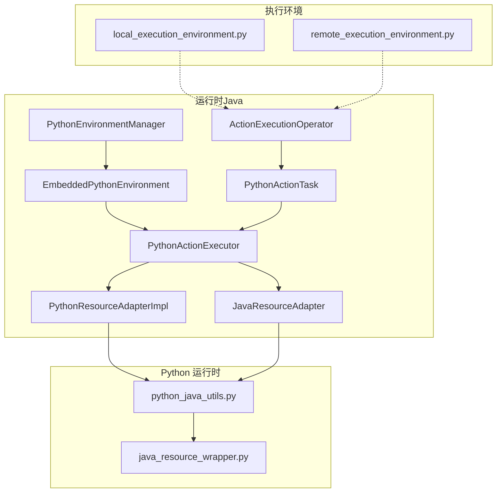
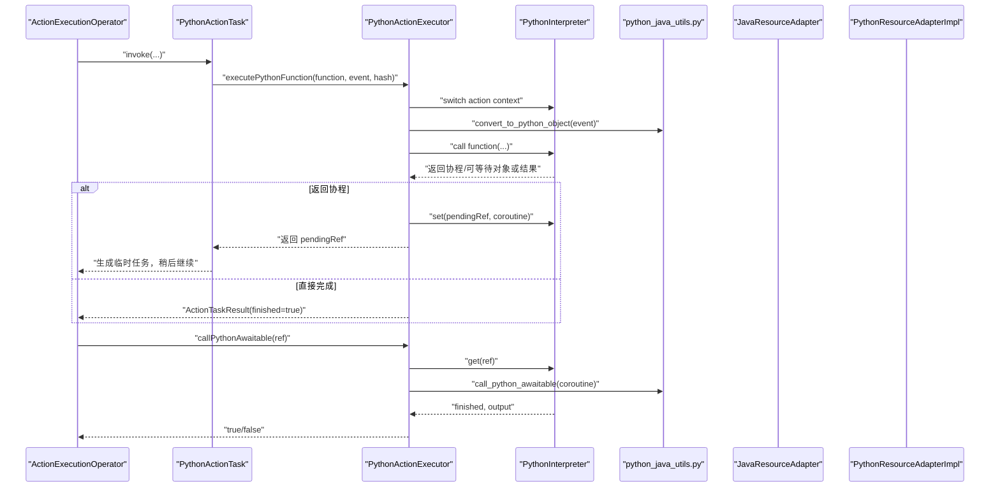
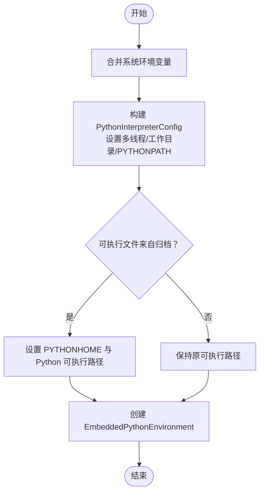
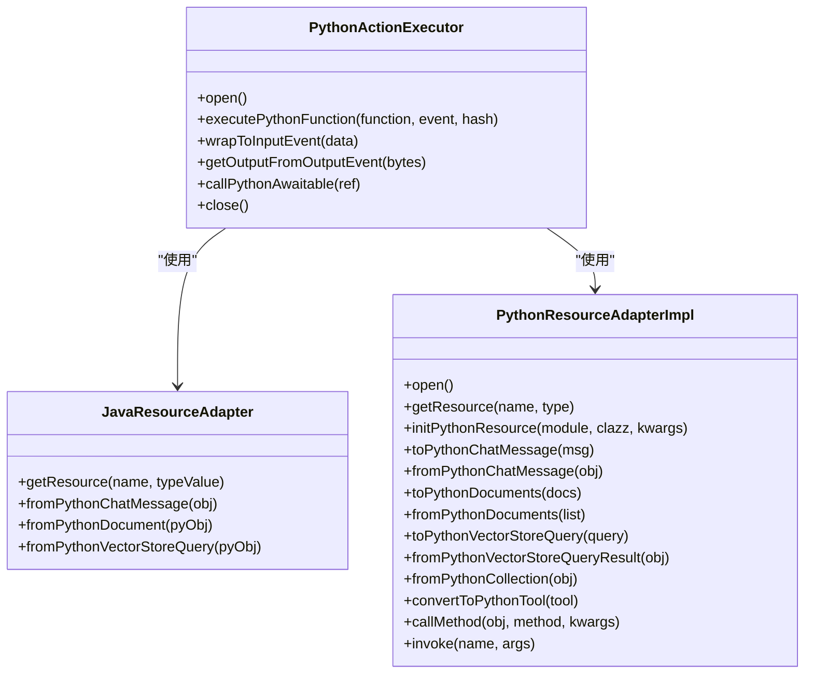
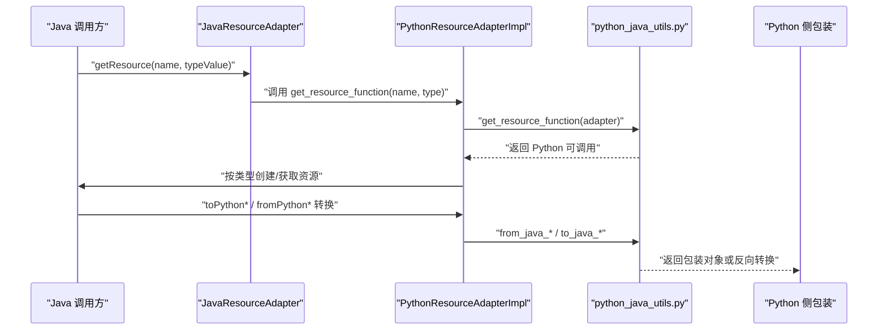
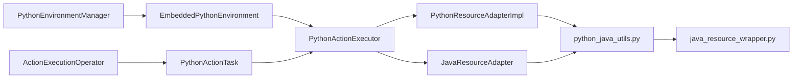

# Python 环境管理

<cite>
**本文引用的文件**
- [PythonEnvironmentManager.java](file://runtime/src/main/java/org/apache/flink/agents/runtime/env/PythonEnvironmentManager.java)
- [EmbeddedPythonEnvironment.java](file://runtime/src/main/java/org/apache/flink/agents/runtime/env/EmbeddedPythonEnvironment.java)
- [PythonActionExecutor.java](file://runtime/src/main/java/org/apache/flink/agents/runtime/python/utils/PythonActionExecutor.java)
- [JavaResourceAdapter.java](file://runtime/src/main/java/org/apache/flink/agents/runtime/python/utils/JavaResourceAdapter.java)
- [PythonResourceAdapterImpl.java](file://runtime/src/main/java/org/apache/flink/agents/runtime/python/utils/PythonResourceAdapterImpl.java)
- [python_java_utils.py](file://python/flink_agents/runtime/python_java_utils.py)
- [java_resource_wrapper.py](file://python/flink_agents/runtime/java/java_resource_wrapper.py)
- [PythonEnvironmentManagerTest.java](file://runtime/src/test/java/org/apache/flink/agents/runtime/env/PythonEnvironmentManagerTest.java)
- [ActionExecutionOperator.java](file://runtime/src/main/java/org/apache/flink/agents/runtime/operator/ActionExecutionOperator.java)
- [PythonActionTask.java](file://runtime/src/main/java/org/apache/flink/agents/runtime/python/operator/PythonActionTask.java)
- [BuiltInMetrics.java](file://runtime/src/main/java/org/apache/flink/agents/runtime/metrics/BuiltInMetrics.java)
- [UpdatableGaugeImpl.java](file://runtime/src/main/java/org/apache/flink/agents/runtime/metrics/UpdatableGaugeImpl.java)
- [local_execution_environment.py](file://python/flink_agents/runtime/local_execution_environment.py)
- [remote_execution_environment.py](file://python/flink_agents/runtime/remote_execution_environment.py)
</cite>

## 目录
1. [简介](#简介)
2. [项目结构](#项目结构)
3. [核心组件](#核心组件)
4. [架构总览](#架构总览)
5. [详细组件分析](#详细组件分析)
6. [依赖关系分析](#依赖关系分析)
7. [性能考量](#性能考量)
8. [故障排查指南](#故障排查指南)
9. [结论](#结论)
10. [附录：集成与最佳实践](#附录集成与最佳实践)

## 简介
本技术文档围绕 Python 环境管理系统，系统性阐述以下主题：
- PythonEnvironmentManager 的生命周期管理：Python 解释器的创建、配置与销毁。
- EmbeddedPythonEnvironment 的嵌入式环境实现：依赖包管理、环境隔离与资源清理。
- 双向资源适配机制：PythonResourceAdapterImpl 与 JavaResourceAdapter 如何在 Java 与 Python 之间传递与转换资源对象。
- PythonActionExecutor 的动作执行器：Python 函数调用、异常处理与结果返回。
- 跨语言通信协议：数据序列化（cloudpickle）、类型转换与性能优化策略。
- 环境热重载与动态配置更新：当前代码未提供热重载实现，建议的扩展路径。
- 调试与监控：性能指标采集与故障诊断工具。

## 项目结构
该系统由三层组成：
- 运行时（Java）：负责环境管理、动作执行、资源适配与度量。
- Python 运行时（Python）：提供事件包装、资源桥接与类型转换工具。
- 执行环境（本地/远程）：封装 PyFlink 数据流/表环境，连接 Java 与 Python。

**图表来源**
- [PythonEnvironmentManager.java](file://runtime/src/main/java/org/apache/flink/agents/runtime/env/PythonEnvironmentManager.java#L35-L83)
- [EmbeddedPythonEnvironment.java](file://runtime/src/main/java/org/apache/flink/agents/runtime/env/EmbeddedPythonEnvironment.java#L27-L47)
- [PythonActionExecutor.java](file://runtime/src/main/java/org/apache/flink/agents/runtime/python/utils/PythonActionExecutor.java#L36-L111)
- [JavaResourceAdapter.java](file://runtime/src/main/java/org/apache/flink/agents/runtime/python/utils/JavaResourceAdapter.java#L34-L104)
- [PythonResourceAdapterImpl.java](file://runtime/src/main/java/org/apache/flink/agents/runtime/python/utils/PythonResourceAdapterImpl.java#L41-L93)
- [python_java_utils.py](file://python/flink_agents/runtime/python_java_utils.py#L48-L102)
- [java_resource_wrapper.py](file://python/flink_agents/runtime/java/java_resource_wrapper.py#L69-L79)
- [ActionExecutionOperator.java](file://runtime/src/main/java/org/apache/flink/agents/runtime/operator/ActionExecutionOperator.java#L485-L506)
- [PythonActionTask.java](file://runtime/src/main/java/org/apache/flink/agents/runtime/python/operator/PythonActionTask.java#L55-L71)
- [local_execution_environment.py](file://python/flink_agents/runtime/local_execution_environment.py#L92-L179)
- [remote_execution_environment.py](file://python/flink_agents/runtime/remote_execution_environment.py#L160-L335)

**章节来源**
- [PythonEnvironmentManager.java](file://runtime/src/main/java/org/apache/flink/agents/runtime/env/PythonEnvironmentManager.java#L35-L83)
- [EmbeddedPythonEnvironment.java](file://runtime/src/main/java/org/apache/flink/agents/runtime/env/EmbeddedPythonEnvironment.java#L27-L47)
- [PythonActionExecutor.java](file://runtime/src/main/java/org/apache/flink/agents/runtime/python/utils/PythonActionExecutor.java#L36-L111)
- [JavaResourceAdapter.java](file://runtime/src/main/java/org/apache/flink/agents/runtime/python/utils/JavaResourceAdapter.java#L34-L104)
- [PythonResourceAdapterImpl.java](file://runtime/src/main/java/org/apache/flink/agents/runtime/python/utils/PythonResourceAdapterImpl.java#L41-L93)
- [python_java_utils.py](file://python/flink_agents/runtime/python_java_utils.py#L48-L102)
- [java_resource_wrapper.py](file://python/flink_agents/runtime/java/java_resource_wrapper.py#L69-L79)
- [ActionExecutionOperator.java](file://runtime/src/main/java/org/apache/flink/agents/runtime/operator/ActionExecutionOperator.java#L485-L506)
- [PythonActionTask.java](file://runtime/src/main/java/org/apache/flink/agents/runtime/python/operator/PythonActionTask.java#L55-L71)
- [local_execution_environment.py](file://python/flink_agents/runtime/local_execution_environment.py#L92-L179)
- [remote_execution_environment.py](file://python/flink_agents/runtime/remote_execution_environment.py#L160-L335)

## 核心组件
- PythonEnvironmentManager：根据依赖信息构建嵌入式 Python 环境，设置 Python 可执行文件、工作目录与 PATH。
- EmbeddedPythonEnvironment：封装 PythonInterpreter 配置与环境变量，提供解释器实例。
- PythonActionExecutor：在 Python 解释器中执行用户定义的动作函数，支持协程/可等待对象的后续调用。
- JavaResourceAdapter 与 PythonResourceAdapterImpl：双向资源适配，将 Java 资源转换为 Python 对象，或将 Python 对象转换回 Java。
- python_java_utils.py：提供 cloudpickle 序列化、事件包装、资源创建与类型转换等桥接函数。
- java_resource_wrapper.py：Python 侧对 Java Prompt/Tool/Resource 的包装，便于在 Python 中使用。
- ActionExecutionOperator 与 PythonActionTask：触发动作执行，处理异步协程与结果返回。

**章节来源**
- [PythonEnvironmentManager.java](file://runtime/src/main/java/org/apache/flink/agents/runtime/env/PythonEnvironmentManager.java#L35-L83)
- [EmbeddedPythonEnvironment.java](file://runtime/src/main/java/org/apache/flink/agents/runtime/env/EmbeddedPythonEnvironment.java#L27-L47)
- [PythonActionExecutor.java](file://runtime/src/main/java/org/apache/flink/agents/runtime/python/utils/PythonActionExecutor.java#L36-L111)
- [JavaResourceAdapter.java](file://runtime/src/main/java/org/apache/flink/agents/runtime/python/utils/JavaResourceAdapter.java#L34-L104)
- [PythonResourceAdapterImpl.java](file://runtime/src/main/java/org/apache/flink/agents/runtime/python/utils/PythonResourceAdapterImpl.java#L41-L93)
- [python_java_utils.py](file://python/flink_agents/runtime/python_java_utils.py#L48-L102)
- [java_resource_wrapper.py](file://python/flink_agents/runtime/java/java_resource_wrapper.py#L69-L79)
- [ActionExecutionOperator.java](file://runtime/src/main/java/org/apache/flink/agents/runtime/operator/ActionExecutionOperator.java#L485-L506)
- [PythonActionTask.java](file://runtime/src/main/java/org/apache/flink/agents/runtime/python/operator/PythonActionTask.java#L55-L71)

## 架构总览
下图展示从 Java 触发动作到 Python 执行再到结果返回的完整链路，以及资源适配与类型转换的关键节点。

**图表来源**
- [ActionExecutionOperator.java](file://runtime/src/main/java/org/apache/flink/agents/runtime/operator/ActionExecutionOperator.java#L485-L506)
- [PythonActionTask.java](file://runtime/src/main/java/org/apache/flink/agents/runtime/python/operator/PythonActionTask.java#L55-L71)
- [PythonActionExecutor.java](file://runtime/src/main/java/org/apache/flink/agents/runtime/python/utils/PythonActionExecutor.java#L123-L149)
- [python_java_utils.py](file://python/flink_agents/runtime/python_java_utils.py#L48-L76)

**章节来源**
- [ActionExecutionOperator.java](file://runtime/src/main/java/org/apache/flink/agents/runtime/operator/ActionExecutionOperator.java#L485-L506)
- [PythonActionTask.java](file://runtime/src/main/java/org/apache/flink/agents/runtime/python/operator/PythonActionTask.java#L55-L71)
- [PythonActionExecutor.java](file://runtime/src/main/java/org/apache/flink/agents/runtime/python/utils/PythonActionExecutor.java#L123-L149)
- [python_java_utils.py](file://python/flink_agents/runtime/python_java_utils.py#L48-L76)

## 详细组件分析

### PythonEnvironmentManager 生命周期管理
- 创建阶段：合并系统环境变量，基于依赖信息设置 Python 可执行文件、工作目录与 PYTHONPATH；若可执行文件来自归档，则计算 PYTHONHOME 并修正路径。
- 配置阶段：设置解释器为多线程模式，注入工作目录与路径。
- 销毁阶段：通过 EmbeddedPythonEnvironment 暴露的解释器进行资源释放（关闭 runner 上下文与线程池），避免内存泄漏。

**图表来源**
- [PythonEnvironmentManager.java](file://runtime/src/main/java/org/apache/flink/agents/runtime/env/PythonEnvironmentManager.java#L44-L83)
- [PythonEnvironmentManagerTest.java](file://runtime/src/test/java/org/apache/flink/agents/runtime/env/PythonEnvironmentManagerTest.java#L139-L162)

**章节来源**
- [PythonEnvironmentManager.java](file://runtime/src/main/java/org/apache/flink/agents/runtime/env/PythonEnvironmentManager.java#L44-L83)
- [PythonEnvironmentManagerTest.java](file://runtime/src/test/java/org/apache/flink/agents/runtime/env/PythonEnvironmentManagerTest.java#L139-L162)

### EmbeddedPythonEnvironment 嵌入式环境
- 职责：持有 PythonInterpreterConfig 与环境变量映射；按需创建 PythonInterpreter 实例。
- 资源清理：通过上层执行器关闭 runner 上下文与线程池，确保解释器生命周期可控。

**章节来源**
- [EmbeddedPythonEnvironment.java](file://runtime/src/main/java/org/apache/flink/agents/runtime/env/EmbeddedPythonEnvironment.java#L27-L47)
- [PythonActionExecutor.java](file://runtime/src/main/java/org/apache/flink/agents/runtime/python/utils/PythonActionExecutor.java#L188-L202)

### PythonActionExecutor 动作执行器
- 初始化：导入必要模块，创建异步线程池与 runner 上下文，并注入 Java 资源适配器与作业标识。
- 执行流程：将 Java 事件转换为 Python 对象，调用用户定义的 Python 函数；若返回协程则保存引用以便后续轮询。
- 异常处理：捕获执行异常并清空待处理事件，抛出带原因的执行异常。
- 结果返回：支持从输出事件中提取 Python 输出对象，供上层消费。

**图表来源**
- [PythonActionExecutor.java](file://runtime/src/main/java/org/apache/flink/agents/runtime/python/utils/PythonActionExecutor.java#L36-L111)
- [JavaResourceAdapter.java](file://runtime/src/main/java/org/apache/flink/agents/runtime/python/utils/JavaResourceAdapter.java#L34-L104)
- [PythonResourceAdapterImpl.java](file://runtime/src/main/java/org/apache/flink/agents/runtime/python/utils/PythonResourceAdapterImpl.java#L41-L93)

**章节来源**
- [PythonActionExecutor.java](file://runtime/src/main/java/org/apache/flink/agents/runtime/python/utils/PythonActionExecutor.java#L93-L149)
- [JavaResourceAdapter.java](file://runtime/src/main/java/org/apache/flink/agents/runtime/python/utils/JavaResourceAdapter.java#L34-L104)
- [PythonResourceAdapterImpl.java](file://runtime/src/main/java/org/apache/flink/agents/runtime/python/utils/PythonResourceAdapterImpl.java#L90-L203)

### 资源适配机制：Java ↔ Python
- 单向适配（Java → Python）：JavaResourceAdapter 与 PythonResourceAdapterImpl 在初始化时建立“获取资源”函数引用，Python 侧通过该引用按名称与类型从 Java 获取资源。
- 双向适配（Python → Java）：python_java_utils 提供 from_java_* 与 to_java_* 方法族，将 Java 对象转换为 Python 包装对象或反向转换。
- 类型转换：ChatMessage、Document、VectorStoreQuery 等对象通过属性映射与工具函数完成转换。

**图表来源**
- [JavaResourceAdapter.java](file://runtime/src/main/java/org/apache/flink/agents/runtime/python/utils/JavaResourceAdapter.java#L34-L56)
- [PythonResourceAdapterImpl.java](file://runtime/src/main/java/org/apache/flink/agents/runtime/python/utils/PythonResourceAdapterImpl.java#L90-L117)
- [python_java_utils.py](file://python/flink_agents/runtime/python_java_utils.py#L93-L151)
- [java_resource_wrapper.py](file://python/flink_agents/runtime/java/java_resource_wrapper.py#L69-L79)

**章节来源**
- [JavaResourceAdapter.java](file://runtime/src/main/java/org/apache/flink/agents/runtime/python/utils/JavaResourceAdapter.java#L34-L104)
- [PythonResourceAdapterImpl.java](file://runtime/src/main/java/org/apache/flink/agents/runtime/python/utils/PythonResourceAdapterImpl.java#L90-L203)
- [python_java_utils.py](file://python/flink_agents/runtime/python_java_utils.py#L93-L151)
- [java_resource_wrapper.py](file://python/flink_agents/runtime/java/java_resource_wrapper.py#L69-L79)

### 跨语言通信协议与序列化
- 序列化：使用 cloudpickle 对 Java 侧事件与输出进行序列化/反序列化，保证复杂对象的跨语言传输。
- 事件包装：将输入字节流包装为 Python 输入事件，同时生成可记录的 JSON 字符串。
- 类型转换：通过 python_java_utils 提供的 from_java_* 与 to_java_* 方法族，完成消息、文档、查询等对象的双向转换。

**章节来源**
- [python_java_utils.py](file://python/flink_agents/runtime/python_java_utils.py#L48-L76)
- [PythonActionExecutor.java](file://runtime/src/main/java/org/apache/flink/agents/runtime/python/utils/PythonActionExecutor.java#L151-L160)

### 环境热重载与动态配置更新
- 当前实现：未提供 Python 环境的热重载与动态配置更新能力。PythonActionExecutor 在 open/close 期间创建/销毁解释器上下文，不支持运行期热替换。
- 建议方案：
  - 采用“双解释器+切换”策略：后台加载新配置并预热解释器，完成后再切换引用。
  - 使用配置版本号与增量更新：仅更新变更项，避免全量重启。
  - 优雅降级：若新配置加载失败，回滚至旧配置并保留服务可用性。

[本节为通用建议，不直接分析具体文件，故无“章节来源”]

## 依赖关系分析
- 组件耦合：
  - PythonActionExecutor 依赖 JavaResourceAdapter 与 PythonResourceAdapterImpl 完成资源与类型转换。
  - PythonEnvironmentManager 与 EmbeddedPythonEnvironment 为底层基础设施，被上层执行器复用。
  - ActionExecutionOperator 与 PythonActionTask 作为调度入口，协调动作执行与协程轮询。
- 外部依赖：
  - pemja.core.PythonInterpreter：嵌入式 Python 解释器。
  - cloudpickle：跨语言序列化库。
  - PyFlink：远程执行环境的数据流/表集成。

**图表来源**
- [PythonEnvironmentManager.java](file://runtime/src/main/java/org/apache/flink/agents/runtime/env/PythonEnvironmentManager.java#L35-L83)
- [EmbeddedPythonEnvironment.java](file://runtime/src/main/java/org/apache/flink/agents/runtime/env/EmbeddedPythonEnvironment.java#L27-L47)
- [PythonActionExecutor.java](file://runtime/src/main/java/org/apache/flink/agents/runtime/python/utils/PythonActionExecutor.java#L36-L111)
- [JavaResourceAdapter.java](file://runtime/src/main/java/org/apache/flink/agents/runtime/python/utils/JavaResourceAdapter.java#L34-L104)
- [PythonResourceAdapterImpl.java](file://runtime/src/main/java/org/apache/flink/agents/runtime/python/utils/PythonResourceAdapterImpl.java#L41-L93)
- [python_java_utils.py](file://python/flink_agents/runtime/python_java_utils.py#L48-L102)
- [java_resource_wrapper.py](file://python/flink_agents/runtime/java/java_resource_wrapper.py#L69-L79)
- [ActionExecutionOperator.java](file://runtime/src/main/java/org/apache/flink/agents/runtime/operator/ActionExecutionOperator.java#L485-L506)
- [PythonActionTask.java](file://runtime/src/main/java/org/apache/flink/agents/runtime/python/operator/PythonActionTask.java#L55-L71)

**章节来源**
- [PythonEnvironmentManager.java](file://runtime/src/main/java/org/apache/flink/agents/runtime/env/PythonEnvironmentManager.java#L35-L83)
- [EmbeddedPythonEnvironment.java](file://runtime/src/main/java/org/apache/flink/agents/runtime/env/EmbeddedPythonEnvironment.java#L27-L47)
- [PythonActionExecutor.java](file://runtime/src/main/java/org/apache/flink/agents/runtime/python/utils/PythonActionExecutor.java#L36-L111)
- [JavaResourceAdapter.java](file://runtime/src/main/java/org/apache/flink/agents/runtime/python/utils/JavaResourceAdapter.java#L34-L104)
- [PythonResourceAdapterImpl.java](file://runtime/src/main/java/org/apache/flink/agents/runtime/python/utils/PythonResourceAdapterImpl.java#L41-L93)
- [python_java_utils.py](file://python/flink_agents/runtime/python_java_utils.py#L48-L102)
- [java_resource_wrapper.py](file://python/flink_agents/runtime/java/java_resource_wrapper.py#L69-L79)
- [ActionExecutionOperator.java](file://runtime/src/main/java/org/apache/flink/agents/runtime/operator/ActionExecutionOperator.java#L485-L506)
- [PythonActionTask.java](file://runtime/src/main/java/org/apache/flink/agents/runtime/python/operator/PythonActionTask.java#L55-L71)

## 性能考量
- 多线程执行：解释器以多线程模式运行，适合并发动作执行。
- 协程轮询：通过可等待对象引用与 callPythonAwaitable 轮询，避免阻塞主线程。
- 序列化成本：cloudpickle 在复杂对象序列化上开销较高，建议：
  - 尽量减少事件与输出中的大对象。
  - 对频繁传输的对象进行扁平化或分片。
- 资源适配：类型转换与包装对象创建存在额外开销，应避免在热路径中重复转换。

[本节为通用指导，不直接分析具体文件，故无“章节来源”]

## 故障排查指南
- 执行异常：PythonActionExecutor 捕获异常后会清空待处理事件并抛出带原因的异常，便于定位。
- 资源获取失败：JavaResourceAdapter 与 PythonResourceAdapterImpl 在类型映射缺失或构造失败时会抛出异常，检查资源类型与映射配置。
- 事件包装问题：wrapToInputEvent 期望输入为字节数组，若类型不符会导致断言失败。
- 监控指标：BuiltInMetrics 与 UpdatableGaugeImpl 提供事件与动作计数与速率统计，可用于性能观测与告警。

**章节来源**
- [PythonActionExecutor.java](file://runtime/src/main/java/org/apache/flink/agents/runtime/python/utils/PythonActionExecutor.java#L145-L148)
- [BuiltInMetrics.java](file://runtime/src/main/java/org/apache/flink/agents/runtime/metrics/BuiltInMetrics.java#L34-L72)
- [UpdatableGaugeImpl.java](file://runtime/src/main/java/org/apache/flink/agents/runtime/metrics/UpdatableGaugeImpl.java#L30-L42)

## 结论
该系统通过 PythonEnvironmentManager 与 EmbeddedPythonEnvironment 提供稳定的嵌入式 Python 执行环境；借助 PythonActionExecutor 与资源适配器实现 Java 与 Python 的高效互操作；配合 cloudpickle 与类型转换工具完成跨语言数据交换。当前未提供热重载能力，建议采用“双解释器+切换”与版本化配置策略实现动态更新。结合内置指标体系，可有效支撑生产级部署与运维。

[本节为总结，不直接分析具体文件，故无“章节来源”]

## 附录：集成与最佳实践
- 本地执行环境：使用 local_execution_environment.py 快速在本地列表数据上验证 Agent 行为。
- 远程执行环境：使用 remote_execution_environment.py 将 Agent 集成到 PyFlink 数据流/表中，自动加载 FLINK_CONF_DIR 下的配置文件。
- 资源注册：在 AgentPlan 中声明资源提供者，Java 与 Python 资源均可通过适配器互通。
- 最佳实践：
  - 明确动作边界，尽量将长耗时逻辑放入协程并定期轮询。
  - 控制事件大小，避免 cloudpickle 带来的高序列化成本。
  - 使用资源适配器集中管理外部依赖，避免在 Python 侧硬编码配置。
  - 启用 BuiltInMetrics 与日志，持续监控吞吐与延迟。

**章节来源**
- [local_execution_environment.py](file://python/flink_agents/runtime/local_execution_environment.py#L92-L179)
- [remote_execution_environment.py](file://python/flink_agents/runtime/remote_execution_environment.py#L160-L335)
- [BuiltInMetrics.java](file://runtime/src/main/java/org/apache/flink/agents/runtime/metrics/BuiltInMetrics.java#L34-L72)