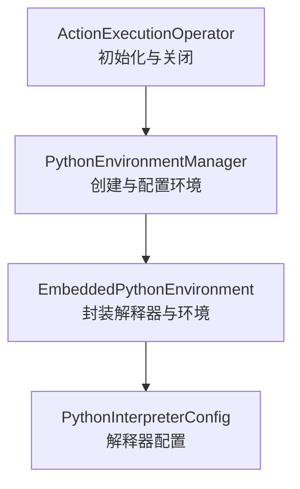
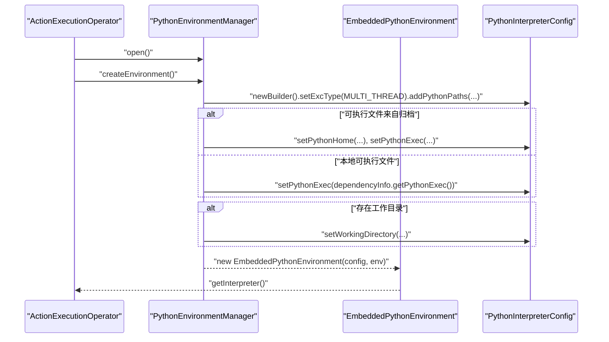
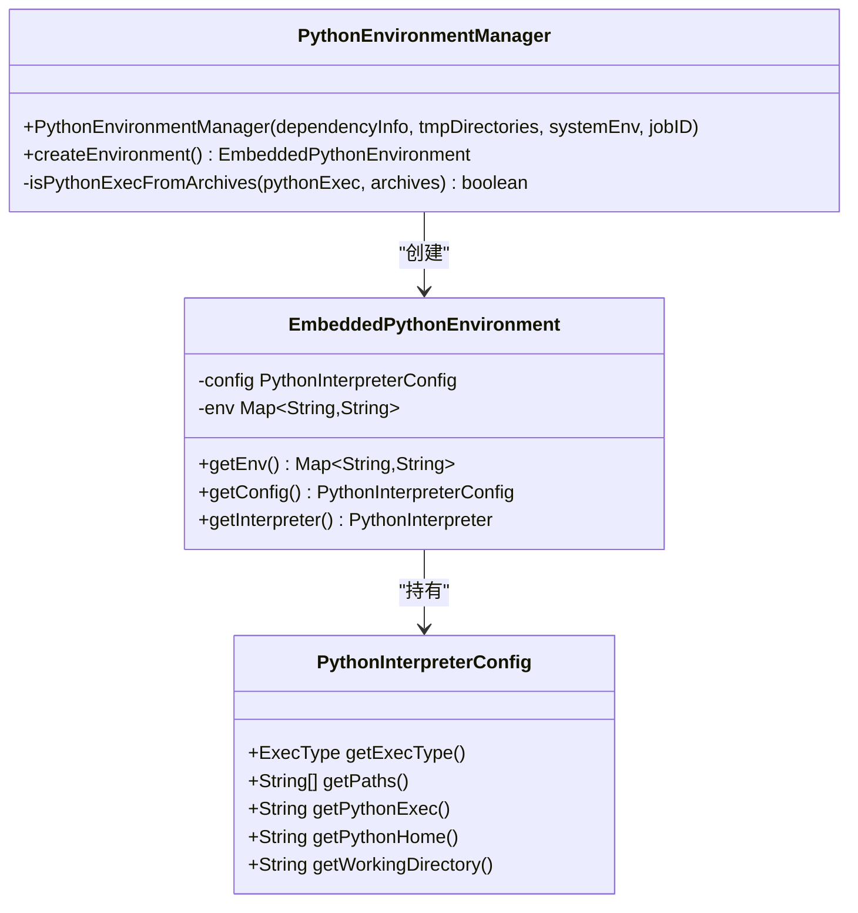
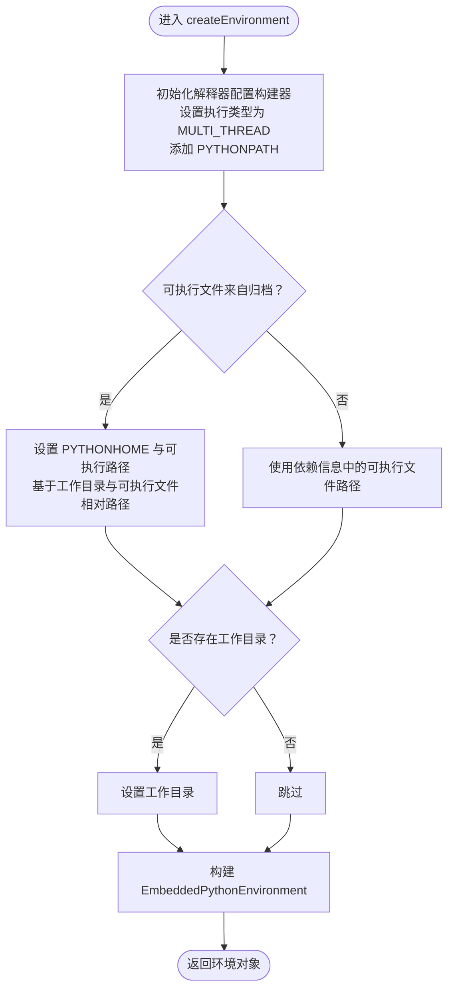
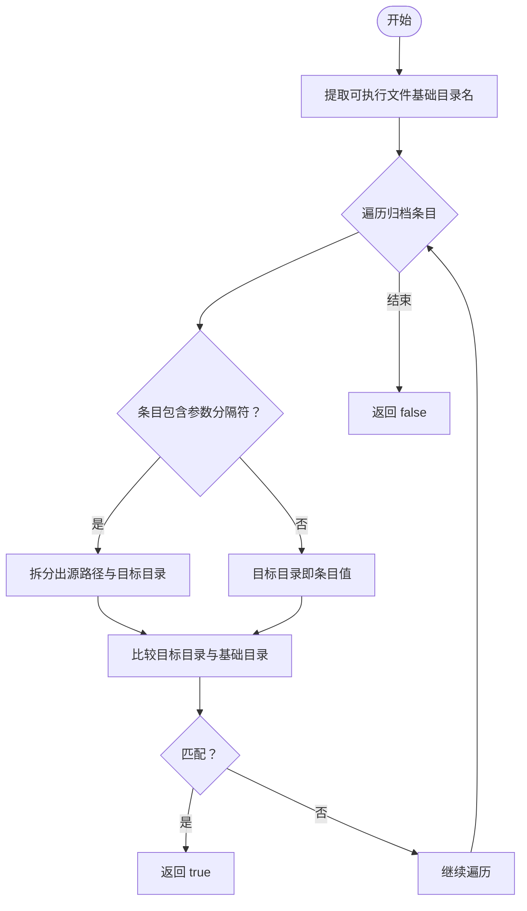
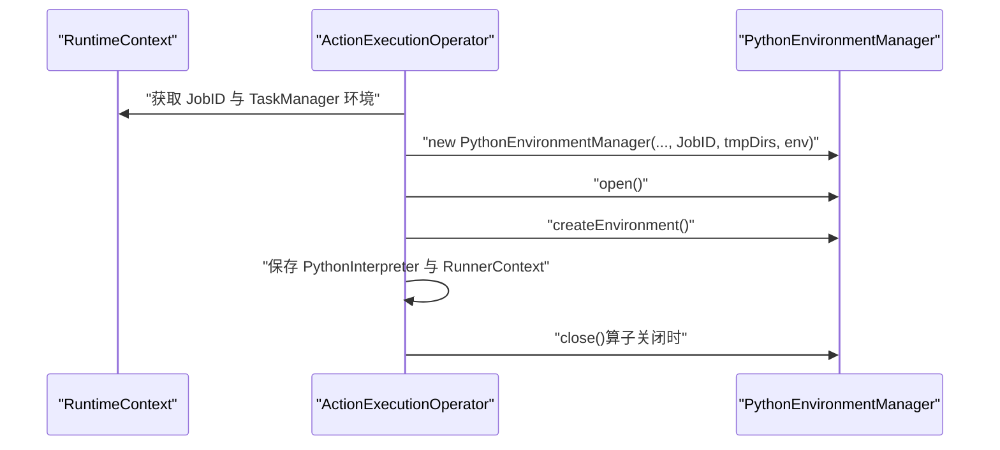
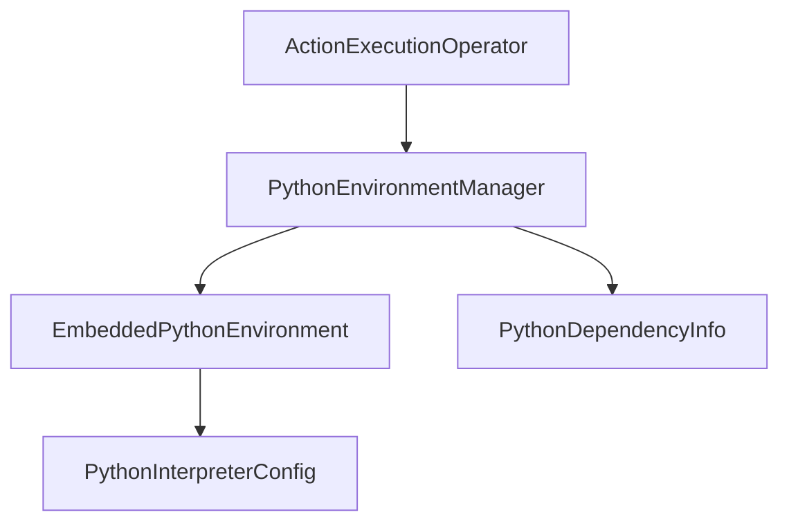

# Python 环境管理器

<cite>
**本文引用的文件**
- [PythonEnvironmentManager.java](file://runtime/src/main/java/org/apache/flink/agents/runtime/env/PythonEnvironmentManager.java)
- [EmbeddedPythonEnvironment.java](file://runtime/src/main/java/org/apache/flink/agents/runtime/env/EmbeddedPythonEnvironment.java)
- [PythonEnvironmentManagerTest.java](file://runtime/src/test/java/org/apache/flink/agents/runtime/env/PythonEnvironmentManagerTest.java)
- [ActionExecutionOperator.java](file://runtime/src/main/java/org/apache/flink/agents/runtime/operator/ActionExecutionOperator.java)
</cite>

## 目录
1. [引言](#引言)
2. [项目结构](#项目结构)
3. [核心组件](#核心组件)
4. [架构总览](#架构总览)
5. [详细组件分析](#详细组件分析)
6. [依赖关系分析](#依赖关系分析)
7. [性能考虑](#性能考虑)
8. [故障排查指南](#故障排查指南)
9. [结论](#结论)
10. [附录](#附录)

## 引言
本文件面向 PythonEnvironmentManager 的技术文档，系统性阐述其在 Flink 作业中的职责与实现：包括 Python 环境的创建、配置与生命周期管理；createEnvironment() 方法的实现机制（Python 解释器配置、环境变量设置、依赖信息处理）；isPythonExecFromArchives() 的归档检测逻辑；PythonInterpreterConfig 的构建过程（多线程执行类型、PYTHONPATH 设置、工作目录配置）；以及与 Flink 作业的集成方式（JobID 关联与临时目录管理）。同时提供配置选项与最佳实践建议，帮助读者在生产环境中安全、高效地使用该组件。

## 项目结构
PythonEnvironmentManager 位于运行时模块中，负责在 Task 级别为 Python 动作与资源适配器初始化嵌入式 Python 环境。其直接依赖于 Flink 的 Python 环境抽象基类与外部 Python 解释器桥接库（pemja），并通过 ActionExecutionOperator 在算子初始化阶段触发环境创建与释放。

图表来源
- [ActionExecutionOperator.java](file://runtime/src/main/java/org/apache/flink/agents/runtime/operator/ActionExecutionOperator.java#L612-L661)
- [PythonEnvironmentManager.java](file://runtime/src/main/java/org/apache/flink/agents/runtime/env/PythonEnvironmentManager.java#L44-L83)
- [EmbeddedPythonEnvironment.java](file://runtime/src/main/java/org/apache/flink/agents/runtime/env/EmbeddedPythonEnvironment.java#L27-L47)

章节来源
- [PythonEnvironmentManager.java](file://runtime/src/main/java/org/apache/flink/agents/runtime/env/PythonEnvironmentManager.java#L1-L110)
- [EmbeddedPythonEnvironment.java](file://runtime/src/main/java/org/apache/flink/agents/runtime/env/EmbeddedPythonEnvironment.java#L1-L48)
- [ActionExecutionOperator.java](file://runtime/src/main/java/org/apache/flink/agents/runtime/operator/ActionExecutionOperator.java#L612-L661)

## 核心组件
- PythonEnvironmentManager：继承自 Flink 抽象基类，负责根据依赖信息与系统环境变量生成嵌入式 Python 环境，并在归档场景下进行 PYTHONHOME 与可执行路径修正。
- EmbeddedPythonEnvironment：对 PythonInterpreterConfig 与环境变量的轻量封装，提供获取解释器实例的能力。
- ActionExecutionOperator：在算子生命周期内调用 PythonEnvironmentManager 完成环境初始化与释放，确保与 Flink 作业的 JobID 关联与临时目录管理。

章节来源
- [PythonEnvironmentManager.java](file://runtime/src/main/java/org/apache/flink/agents/runtime/env/PythonEnvironmentManager.java#L35-L83)
- [EmbeddedPythonEnvironment.java](file://runtime/src/main/java/org/apache/flink/agents/runtime/env/EmbeddedPythonEnvironment.java#L27-L47)
- [ActionExecutionOperator.java](file://runtime/src/main/java/org/apache/flink/agents/runtime/operator/ActionExecutionOperator.java#L612-L661)

## 架构总览
PythonEnvironmentManager 的职责链路如下：
- 输入：PythonDependencyInfo（包含 python 执行器、python_files、archives 等）、系统环境变量、Flink 临时目录数组、JobID。
- 处理：解析依赖信息，构造环境变量映射，决定是否需要将可执行文件从归档中解压并修正路径，设置多线程执行模式与 PYTHONPATH。
- 输出：EmbeddedPythonEnvironment，包含已配置的 PythonInterpreterConfig 与环境变量映射。

图表来源
- [ActionExecutionOperator.java](file://runtime/src/main/java/org/apache/flink/agents/runtime/operator/ActionExecutionOperator.java#L612-L661)
- [PythonEnvironmentManager.java](file://runtime/src/main/java/org/apache/flink/agents/runtime/env/PythonEnvironmentManager.java#L44-L83)
- [EmbeddedPythonEnvironment.java](file://runtime/src/main/java/org/apache/flink/agents/runtime/env/EmbeddedPythonEnvironment.java#L27-L47)

## 详细组件分析

### PythonEnvironmentManager 类分析
- 继承关系：继承自 Flink 的抽象环境管理器，复用其依赖分发与临时目录管理能力。
- 职责边界：
  - 将依赖信息转换为运行时环境变量映射；
  - 构建 PythonInterpreterConfig，设置执行类型、PYTHONPATH、可执行路径与工作目录；
  - 在归档场景下修正 PYTHONHOME 与可执行路径，确保解释器能正确加载运行时库。
- 关键方法：
  - createEnvironment()：主流程入口，负责环境变量与解释器配置的组装。
  - isPythonExecFromArchives()：归档检测逻辑，判断可执行文件是否来自归档目录。

图表来源
- [PythonEnvironmentManager.java](file://runtime/src/main/java/org/apache/flink/agents/runtime/env/PythonEnvironmentManager.java#L35-L109)
- [EmbeddedPythonEnvironment.java](file://runtime/src/main/java/org/apache/flink/agents/runtime/env/EmbeddedPythonEnvironment.java#L27-L47)

章节来源
- [PythonEnvironmentManager.java](file://runtime/src/main/java/org/apache/flink/agents/runtime/env/PythonEnvironmentManager.java#L35-L109)

### createEnvironment() 方法实现机制
- 环境变量与路径：
  - 以基础环境变量为基础，追加用户提供的 PYTHONPATH；
  - 若可执行文件来自归档，则计算并设置 PYTHONHOME 与最终可执行路径，确保解释器根目录正确；
  - 若存在工作目录变量，则设置解释器的工作目录。
- 解释器配置：
  - 执行类型固定为多线程（MULTI_THREAD），以支持并发执行；
  - 将环境变量中的 PYTHONPATH 拆分为多个路径项传入解释器配置。
- 返回值：
  - 返回 EmbeddedPythonEnvironment，其中包含已构建的 PythonInterpreterConfig 与环境变量映射。

图表来源
- [PythonEnvironmentManager.java](file://runtime/src/main/java/org/apache/flink/agents/runtime/env/PythonEnvironmentManager.java#L44-L83)

章节来源
- [PythonEnvironmentManager.java](file://runtime/src/main/java/org/apache/flink/agents/runtime/env/PythonEnvironmentManager.java#L44-L83)

### isPythonExecFromArchives() 归档检测逻辑
- 判定依据：
  - 从可执行文件路径中提取基础目录名；
  - 遍历归档映射，若归档目标目录名与可执行文件的基础目录一致，则判定为“来自归档”。
- 参数解析：
  - 支持归档条目携带“源路径+参数分隔符+目标目录”的形式，此时仅比较目标目录名。
- 返回值：
  - true 表示需要修正 PYTHONHOME 与可执行路径；false 表示按原路径直接使用。

图表来源
- [PythonEnvironmentManager.java](file://runtime/src/main/java/org/apache/flink/agents/runtime/env/PythonEnvironmentManager.java#L85-L108)

章节来源
- [PythonEnvironmentManager.java](file://runtime/src/main/java/org/apache/flink/agents/runtime/env/PythonEnvironmentManager.java#L85-L108)

### PythonInterpreterConfig 的构建过程
- 执行类型：固定为 MULTI_THREAD，确保多任务并发执行。
- PYTHONPATH：从环境变量中读取并拆分为多个路径项，传入解释器配置。
- 可执行文件与 HOME：
  - 若来自归档：先设置 PYTHONHOME，再设置最终可执行路径；
  - 否则：直接使用依赖信息中的可执行文件路径。
- 工作目录：若存在工作目录变量，则设置为解释器的工作目录。

章节来源
- [PythonEnvironmentManager.java](file://runtime/src/main/java/org/apache/flink/agents/runtime/env/PythonEnvironmentManager.java#L48-L80)

### 与 Flink 作业的集成方式
- JobID 关联：在创建 PythonEnvironmentManager 时传入当前任务所属的 JobID，用于标识与跟踪作业。
- 临时目录管理：从 TaskManager 环境中获取临时目录数组，作为环境变量与归档/文件解压的目标位置。
- 生命周期集成：
  - 初始化：在 ActionExecutionOperator 的初始化阶段创建并打开环境管理器；
  - 关闭：在算子关闭时释放 Python 解释器与环境管理器资源。

图表来源
- [ActionExecutionOperator.java](file://runtime/src/main/java/org/apache/flink/agents/runtime/operator/ActionExecutionOperator.java#L612-L661)

章节来源
- [ActionExecutionOperator.java](file://runtime/src/main/java/org/apache/flink/agents/runtime/operator/ActionExecutionOperator.java#L612-L661)

## 依赖关系分析
- 内部耦合：
  - PythonEnvironmentManager 依赖 EmbeddedPythonEnvironment 提供的封装；
  - 通过 pemja 的 PythonInterpreterConfig 构建解释器配置。
- 外部依赖：
  - Flink 的 PythonDependencyInfo 与抽象环境管理器基类；
  - 运行时算子 ActionExecutionOperator 在生命周期内驱动环境管理器的创建与释放。
- 测试验证：
  - 单元测试覆盖了本地可执行文件、python_files 与 archives 三类场景，验证环境变量、PYTHONPATH 与工作目录的正确性。

图表来源
- [PythonEnvironmentManager.java](file://runtime/src/main/java/org/apache/flink/agents/runtime/env/PythonEnvironmentManager.java#L22-L24)
- [EmbeddedPythonEnvironment.java](file://runtime/src/main/java/org/apache/flink/agents/runtime/env/EmbeddedPythonEnvironment.java#L20-L22)
- [ActionExecutionOperator.java](file://runtime/src/main/java/org/apache/flink/agents/runtime/operator/ActionExecutionOperator.java#L630-L642)

章节来源
- [PythonEnvironmentManager.java](file://runtime/src/main/java/org/apache/flink/agents/runtime/env/PythonEnvironmentManager.java#L22-L24)
- [EmbeddedPythonEnvironment.java](file://runtime/src/main/java/org/apache/flink/agents/runtime/env/EmbeddedPythonEnvironment.java#L20-L22)
- [ActionExecutionOperator.java](file://runtime/src/main/java/org/apache/flink/agents/runtime/operator/ActionExecutionOperator.java#L630-L642)

## 性能考虑
- 多线程执行类型：设置为 MULTI_THREAD 以提升并发执行能力，但需注意 Python GIL 对 CPU 密集型任务的影响。
- PYTHONPATH 规模控制：避免将大量无关路径加入 PYTHONPATH，减少模块导入开销。
- 归档解压策略：归档场景会进行解压与路径修正，建议合理组织归档内容，减少冗余文件。
- 临时目录选择：优先使用高性能磁盘作为临时目录，降低 I/O 延迟。
- 资源释放：确保在算子关闭时及时释放 PythonInterpreter 与环境管理器，防止内存泄漏。

## 故障排查指南
- 可执行文件路径异常：
  - 确认依赖信息中的 python_exec 是否正确；
  - 若来自归档，检查归档目标目录与可执行文件基础目录是否一致。
- PYTHONPATH 不生效：
  - 检查环境变量中 PYTHONPATH 的拼接顺序与分隔符；
  - 确认 EmbeddedPythonEnvironment 返回的配置中路径项是否正确。
- 工作目录未设置：
  - 确认环境变量中存在工作目录键；
  - 检查解释器配置的工作目录是否被设置。
- 归档解压失败：
  - 检查归档文件完整性与权限；
  - 确认临时目录有足够空间与写权限。

章节来源
- [PythonEnvironmentManagerTest.java](file://runtime/src/test/java/org/apache/flink/agents/runtime/env/PythonEnvironmentManagerTest.java#L139-L278)

## 结论
PythonEnvironmentManager 在 Flink 作业中承担着 Python 环境的创建与配置职责，通过严谨的环境变量与解释器配置构建，结合归档检测与路径修正，确保嵌入式 Python 解释器在不同部署形态下的稳定运行。配合 ActionExecutionOperator 的生命周期管理，实现了与 Flink 作业的无缝集成。遵循本文的配置与最佳实践建议，可在保证性能的同时提升系统的可靠性与可维护性。

## 附录
- 关键实现路径参考：
  - [PythonEnvironmentManager.createEnvironment](file://runtime/src/main/java/org/apache/flink/agents/runtime/env/PythonEnvironmentManager.java#L44-L83)
  - [PythonEnvironmentManager.isPythonExecFromArchives](file://runtime/src/main/java/org/apache/flink/agents/runtime/env/PythonEnvironmentManager.java#L85-L108)
  - [EmbeddedPythonEnvironment.getConfig](file://runtime/src/main/java/org/apache/flink/agents/runtime/env/EmbeddedPythonEnvironment.java#L40-L42)
  - [ActionExecutionOperator.initPythonEnvironment](file://runtime/src/main/java/org/apache/flink/agents/runtime/operator/ActionExecutionOperator.java#L612-L661)
- 测试用例参考：
  - [PythonEnvironmentManagerTest.testPythonExecutable](file://runtime/src/test/java/org/apache/flink/agents/runtime/env/PythonEnvironmentManagerTest.java#L139-L162)
  - [PythonEnvironmentManagerTest.testPythonFiles](file://runtime/src/test/java/org/apache/flink/agents/runtime/env/PythonEnvironmentManagerTest.java#L164-L233)
  - [PythonEnvironmentManagerTest.testArchives](file://runtime/src/test/java/org/apache/flink/agents/runtime/env/PythonEnvironmentManagerTest.java#L235-L278)