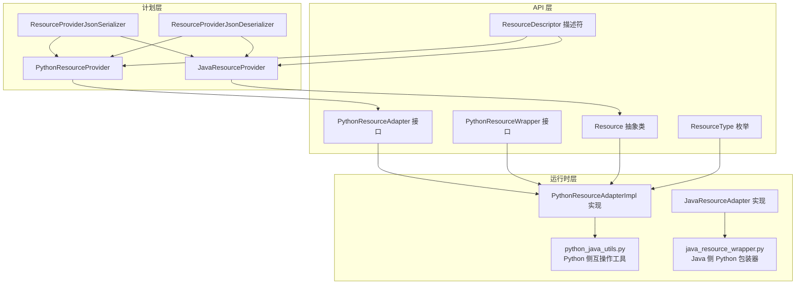
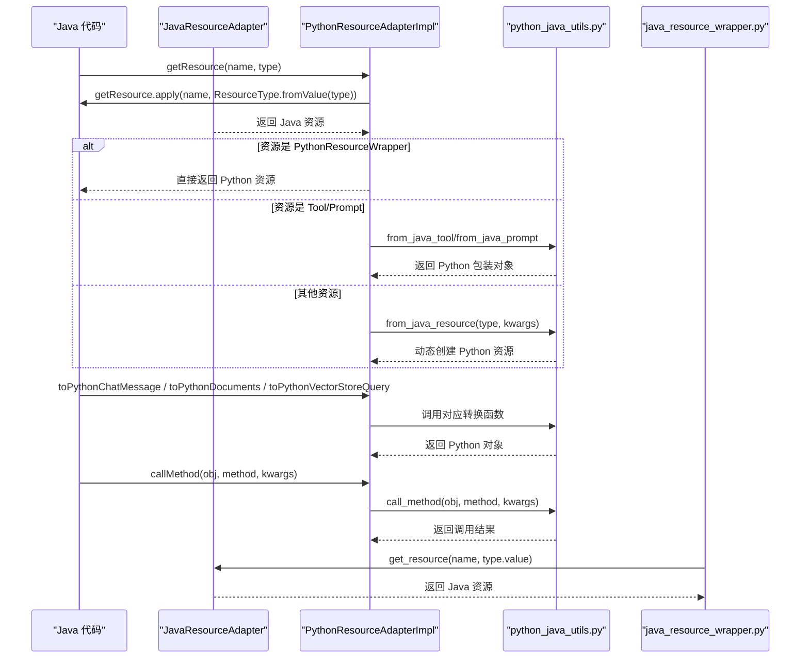
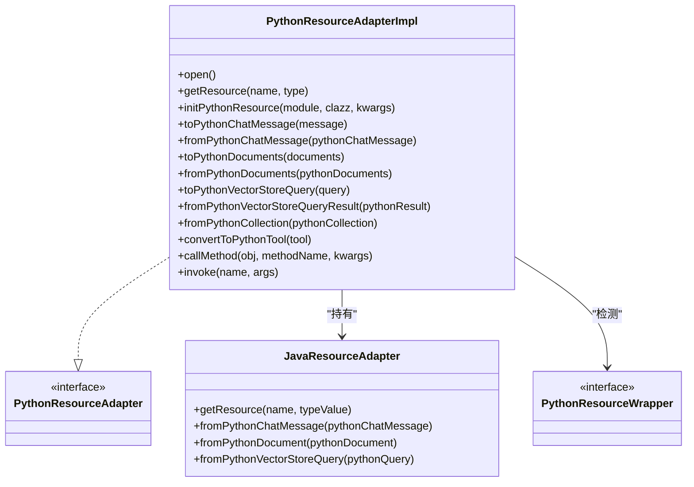
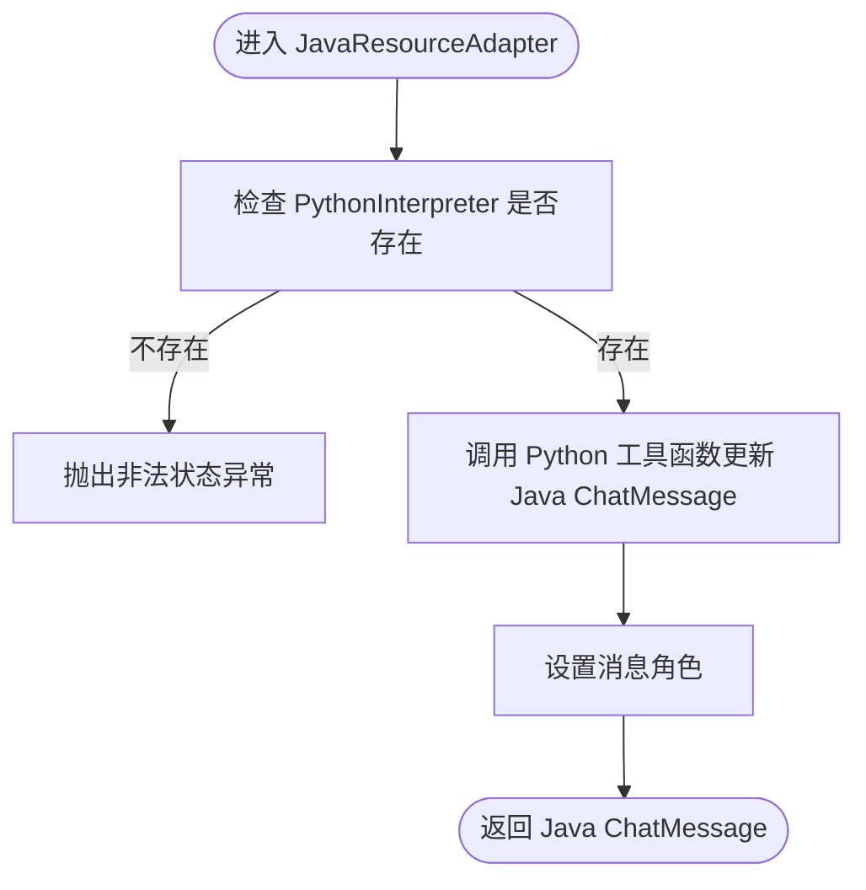
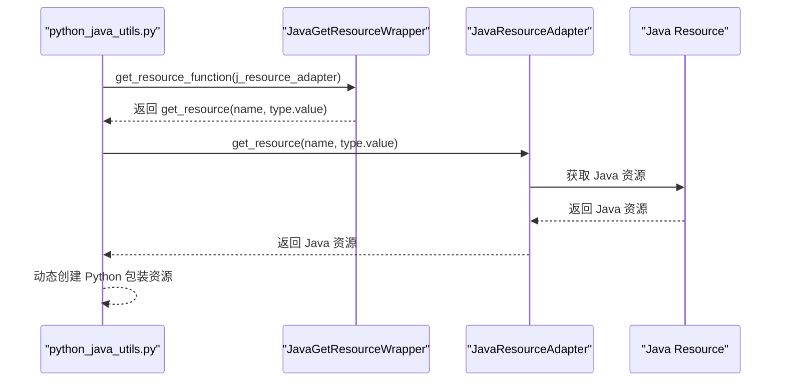
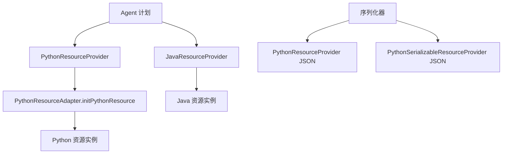
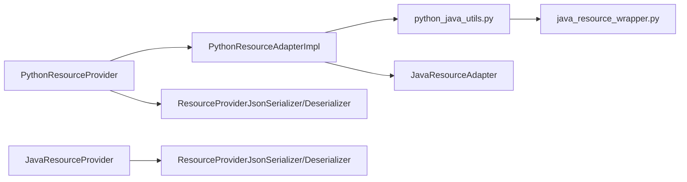

# Python 资源适配器

<cite>
**本文档引用的文件**
- [PythonResourceAdapter.java](file://api/src/main/java/org/apache/flink/agents/api/resource/python/PythonResourceAdapter.java)
- [PythonResourceWrapper.java](file://api/src/main/java/org/apache/flink/agents/api/resource/python/PythonResourceWrapper.java)
- [PythonResourceAdapterImpl.java](file://runtime/src/main/java/org/apache/flink/agents/runtime/python/utils/PythonResourceAdapterImpl.java)
- [JavaResourceAdapter.java](file://runtime/src/main/java/org/apache/flink/agents/runtime/python/utils/JavaResourceAdapter.java)
- [java_resource_wrapper.py](file://python/flink_agents/runtime/java/java_resource_wrapper.py)
- [python_java_utils.py](file://python/flink_agents/runtime/python_java_utils.py)
- [PythonResourceProvider.java](file://plan/src/main/java/org/apache/flink/agents/plan/resourceprovider/PythonResourceProvider.java)
- [JavaResourceProvider.java](file://plan/src/main/java/org/apache/flink/agents/plan/resourceprovider/JavaResourceProvider.java)
- [ResourceProviderJsonSerializer.java](file://plan/src/main/java/org/apache/flink/agents/plan/serializer/ResourceProviderJsonSerializer.java)
- [ResourceProviderJsonDeserializer.java](file://plan/src/main/java/org/apache/flink/agents/plan/serializer/ResourceProviderJsonDeserializer.java)
- [Resource.java](file://api/src/main/java/org/apache/flink/agents/api/resource/Resource.java)
- [ResourceType.java](file://api/src/main/java/org/apache/flink/agents/api/resource/ResourceType.java)
- [ResourceDescriptor.java](file://api/src/main/java/org/apache/flink/agents/api/resource/ResourceDescriptor.java)
- [PythonResourceAdapterImplTest.java](file://runtime/src/test/java/org/apache/flink/agents/runtime/python/utils/PythonResourceAdapterImplTest.java)
</cite>

## 目录
1. [简介](#简介)
2. [项目结构](#项目结构)
3. [核心组件](#核心组件)
4. [架构总览](#架构总览)
5. [组件详细分析](#组件详细分析)
6. [依赖关系分析](#依赖关系分析)
7. [性能考量](#性能考量)
8. [故障排查指南](#故障排查指南)
9. [结论](#结论)
10. [附录](#附录)

## 简介
本技术文档围绕 Python 资源适配器系统，系统性阐述 Java 与 Python 之间的双向资源适配机制：从 Java 到 Python 的对象转换、方法调用与资源检索，到从 Python 回传 Java 的消息、文档、查询结果与集合等对象的反向转换。文档重点覆盖以下方面：
- 双向适配机制：PythonResourceAdapterImpl（Java → Python）与 JavaResourceAdapter（Python → Java）如何协同工作
- 资源序列化与反序列化：数据类型映射、编码格式（如 cloudpickle）、性能优化策略
- 类型系统：基本类型、复合类型与自定义类型的处理
- 资源引用与生命周期：对象引用跟踪、垃圾回收协调与内存泄漏防护
- 错误处理：类型不匹配、转换失败与异常传播
- 扩展性设计：自定义类型处理器与插件机制
- 使用示例与最佳实践：性能优化技巧与常见问题解决方案

## 项目结构
该系统跨越三层：API 层（接口与资源模型）、运行时层（适配器实现与工具）、计划层（资源提供者与序列化）。Python 端通过 pemja 与 Java 进行互操作，并借助 cloudpickle 实现复杂对象的序列化。

图表来源
- [PythonResourceAdapter.java](file://api/src/main/java/org/apache/flink/agents/api/resource/python/PythonResourceAdapter.java#L37-L140)
- [PythonResourceAdapterImpl.java](file://runtime/src/main/java/org/apache/flink/agents/runtime/python/utils/PythonResourceAdapterImpl.java#L41-L203)
- [JavaResourceAdapter.java](file://runtime/src/main/java/org/apache/flink/agents/runtime/python/utils/JavaResourceAdapter.java#L34-L104)
- [python_java_utils.py](file://python/flink_agents/runtime/python_java_utils.py#L78-L151)
- [java_resource_wrapper.py](file://python/flink_agents/runtime/java/java_resource_wrapper.py#L69-L79)
- [PythonResourceProvider.java](file://plan/src/main/java/org/apache/flink/agents/plan/resourceprovider/PythonResourceProvider.java#L47-L126)
- [JavaResourceProvider.java](file://plan/src/main/java/org/apache/flink/agents/plan/resourceprovider/JavaResourceProvider.java#L29-L51)
- [ResourceProviderJsonSerializer.java](file://plan/src/main/java/org/apache/flink/agents/plan/serializer/ResourceProviderJsonSerializer.java#L75-L99)
- [ResourceProviderJsonDeserializer.java](file://plan/src/main/java/org/apache/flink/agents/plan/serializer/ResourceProviderJsonDeserializer.java#L74-L100)

章节来源
- [PythonResourceAdapter.java](file://api/src/main/java/org/apache/flink/agents/api/resource/python/PythonResourceAdapter.java#L32-L140)
- [PythonResourceAdapterImpl.java](file://runtime/src/main/java/org/apache/flink/agents/runtime/python/utils/PythonResourceAdapterImpl.java#L41-L203)
- [JavaResourceAdapter.java](file://runtime/src/main/java/org/apache/flink/agents/runtime/python/utils/JavaResourceAdapter.java#L34-L104)
- [python_java_utils.py](file://python/flink_agents/runtime/python_java_utils.py#L78-L151)
- [java_resource_wrapper.py](file://python/flink_agents/runtime/java/java_resource_wrapper.py#L69-L79)
- [PythonResourceProvider.java](file://plan/src/main/java/org/apache/flink/agents/plan/resourceprovider/PythonResourceProvider.java#L47-L126)
- [JavaResourceProvider.java](file://plan/src/main/java/org/apache/flink/agents/plan/resourceprovider/JavaResourceProvider.java#L29-L51)
- [ResourceProviderJsonSerializer.java](file://plan/src/main/java/org/apache/flink/agents/plan/serializer/ResourceProviderJsonSerializer.java#L75-L99)
- [ResourceProviderJsonDeserializer.java](file://plan/src/main/java/org/apache/flink/agents/plan/serializer/ResourceProviderJsonDeserializer.java#L74-L100)

## 核心组件
- PythonResourceAdapter 接口：定义 Java 与 Python 互操作的契约，包括资源检索、Python 对象初始化、类型转换（消息、文档、查询、结果、集合）、方法调用与通用调用。
- PythonResourceAdapterImpl 实现：在 Java 侧负责将 Java 对象转换为 Python 对象、调用 Python 工具函数、执行方法调用、反向转换 Python 对象回 Java。
- JavaResourceAdapter 实现：在 Java 侧提供资源检索、Python 对象反向转换为 Java 消息、文档、查询等能力。
- python_java_utils.py：Python 侧工具模块，提供资源动态创建、资源包装器、类型转换函数、方法调用封装、事件序列化等。
- java_resource_wrapper.py：Python 侧对 Java 资源适配器的包装，提供资源检索桥接。
- 资源提供者：PythonResourceProvider 与 JavaResourceProvider 在计划层负责根据描述符创建资源实例并注入适配器。
- 序列化器：ResourceProviderJsonSerializer/Deserializer 支持资源提供者的 JSON 序列化与反序列化。

章节来源
- [PythonResourceAdapter.java](file://api/src/main/java/org/apache/flink/agents/api/resource/python/PythonResourceAdapter.java#L37-L140)
- [PythonResourceAdapterImpl.java](file://runtime/src/main/java/org/apache/flink/agents/runtime/python/utils/PythonResourceAdapterImpl.java#L41-L203)
- [JavaResourceAdapter.java](file://runtime/src/main/java/org/apache/flink/agents/runtime/python/utils/JavaResourceAdapter.java#L34-L104)
- [python_java_utils.py](file://python/flink_agents/runtime/python_java_utils.py#L78-L151)
- [java_resource_wrapper.py](file://python/flink_agents/runtime/java/java_resource_wrapper.py#L69-L79)
- [PythonResourceProvider.java](file://plan/src/main/java/org/apache/flink/agents/plan/resourceprovider/PythonResourceProvider.java#L47-L126)
- [JavaResourceProvider.java](file://plan/src/main/java/org/apache/flink/agents/plan/resourceprovider/JavaResourceProvider.java#L29-L51)
- [ResourceProviderJsonSerializer.java](file://plan/src/main/java/org/apache/flink/agents/plan/serializer/ResourceProviderJsonSerializer.java#L75-L99)
- [ResourceProviderJsonDeserializer.java](file://plan/src/main/java/org/apache/flink/agents/plan/serializer/ResourceProviderJsonDeserializer.java#L74-L100)

## 架构总览
Java 与 Python 的互操作通过适配器与工具模块完成，形成“Java 主导、Python 辅助”的双向通道。Java 侧通过 PythonResourceAdapterImpl 将 Java 对象转换为 Python 对象或调用 Python 方法；Python 侧通过 java_resource_wrapper 与 python_java_utils 提供资源检索、类型转换与方法调用。

图表来源
- [PythonResourceAdapterImpl.java](file://runtime/src/main/java/org/apache/flink/agents/runtime/python/utils/PythonResourceAdapterImpl.java#L95-L117)
- [JavaResourceAdapter.java](file://runtime/src/main/java/org/apache/flink/agents/runtime/python/utils/JavaResourceAdapter.java#L54-L56)
- [python_java_utils.py](file://python/flink_agents/runtime/python_java_utils.py#L93-L102)
- [java_resource_wrapper.py](file://python/flink_agents/runtime/java/java_resource_wrapper.py#L77-L79)

## 组件详细分析

### PythonResourceAdapterImpl 分析
- 初始化与导入：在 open() 中执行 Python 导入并注册 get_resource 函数，确保后续调用可用。
- 资源检索策略：
  - 若资源实现了 PythonResourceWrapper，则直接返回其 Python 资源。
  - 若为 Tool 或 Prompt，则通过 python_java_utils 的包装函数转换为对应的 Python 对象。
  - 否则调用 from_java_resource 动态创建 Python 资源。
- 类型转换：
  - 消息：from_java_chat_message 与 update_java_chat_message 配合完成双向转换。
  - 文档：from_java_document 与 update_java_document 完成内容、元数据与嵌入向量的转换。
  - 查询与结果：from_java_vector_store_query 与 from_java_vector_store_query_result 完成查询模式、文本、限制、集合名与额外参数的转换。
  - 集合：from_java_collection 完成集合名称与元数据的转换。
- 方法调用：call_method 委托给 python_java_utils 的 call_method，支持关键字参数传递。
- 通用调用：invoke 直接转发到 PythonInterpreter。

图表来源
- [PythonResourceAdapterImpl.java](file://runtime/src/main/java/org/apache/flink/agents/runtime/python/utils/PythonResourceAdapterImpl.java#L41-L203)
- [PythonResourceAdapter.java](file://api/src/main/java/org/apache/flink/agents/api/resource/python/PythonResourceAdapter.java#L37-L140)
- [JavaResourceAdapter.java](file://runtime/src/main/java/org/apache/flink/agents/runtime/python/utils/JavaResourceAdapter.java#L34-L104)
- [PythonResourceWrapper.java](file://api/src/main/java/org/apache/flink/agents/api/resource/python/PythonResourceWrapper.java#L24-L32)

章节来源
- [PythonResourceAdapterImpl.java](file://runtime/src/main/java/org/apache/flink/agents/runtime/python/utils/PythonResourceAdapterImpl.java#L90-L203)
- [PythonResourceAdapterImplTest.java](file://runtime/src/test/java/org/apache/flink/agents/runtime/python/utils/PythonResourceAdapterImplTest.java#L62-L194)

### JavaResourceAdapter 分析
- 资源检索：getResource 接受资源名与字符串形式的类型值，转换为 ResourceType 后委托给上层 BiFunction 获取资源。
- 反向转换：
  - fromPythonChatMessage：通过 Python 工具函数更新 Java ChatMessage 并设置角色。
  - fromPythonDocument：读取 Python Document 的属性并构造 Java Document。
  - fromPythonVectorStoreQuery：读取 Python VectorStoreQuery 的属性并构造 Java 查询对象。

图表来源
- [JavaResourceAdapter.java](file://runtime/src/main/java/org/apache/flink/agents/runtime/python/utils/JavaResourceAdapter.java#L65-L79)

章节来源
- [JavaResourceAdapter.java](file://runtime/src/main/java/org/apache/flink/agents/runtime/python/utils/JavaResourceAdapter.java#L54-L103)

### Python 互操作工具模块分析
- 资源创建：create_resource 动态导入模块并实例化指定类。
- 资源包装：get_resource_function 返回 JavaGetResourceWrapper.get_resource，作为 Python 侧的资源检索入口。
- 类型转换：
  - from_java_tool/from_java_prompt：将 Java Tool/Prompt 包装为 Python 对应对象。
  - from_java_resource：根据 ResourceType 映射到具体 Python 资源类并实例化。
  - from_java_chat_message/to_java_chat_message/update_java_chat_message：消息对象的双向转换。
  - from_java_document/update_java_document：文档对象的双向转换。
  - from_java_vector_store_query/from_java_vector_store_query_result：查询与结果的双向转换。
  - from_java_collection：集合对象的转换。
  - call_method：安全地调用对象方法并处理属性缺失异常。
- 序列化：convert_to_python_object 使用 cloudpickle 解码字节流，wrap_to_input_event 与 get_output_from_output_event 支持事件序列化。

图表来源
- [python_java_utils.py](file://python/flink_agents/runtime/python_java_utils.py#L93-L102)
- [java_resource_wrapper.py](file://python/flink_agents/runtime/java/java_resource_wrapper.py#L77-L79)
- [JavaResourceAdapter.java](file://runtime/src/main/java/org/apache/flink/agents/runtime/python/utils/JavaResourceAdapter.java#L54-L56)

章节来源
- [python_java_utils.py](file://python/flink_agents/runtime/python_java_utils.py#L78-L284)
- [java_resource_wrapper.py](file://python/flink_agents/runtime/java/java_resource_wrapper.py#L69-L79)

### 资源提供者与序列化
- PythonResourceProvider：根据 ResourceDescriptor 中的模块与类信息，结合 ResourceType 映射，通过 PythonResourceAdapter 初始化 Python 资源，并以反射方式构造具体资源实例。
- JavaResourceProvider：根据 ResourceDescriptor 加载 Java 类并通过反射构造资源实例。
- 序列化器：ResourceProviderJsonSerializer/Deserializer 支持 PythonResourceProvider 与 PythonSerializableResourceProvider 的 JSON 序列化与反序列化，包含模块、类名与序列化字段。

图表来源
- [PythonResourceProvider.java](file://plan/src/main/java/org/apache/flink/agents/plan/resourceprovider/PythonResourceProvider.java#L76-L126)
- [JavaResourceProvider.java](file://plan/src/main/java/org/apache/flink/agents/plan/resourceprovider/JavaResourceProvider.java#L37-L51)
- [ResourceProviderJsonSerializer.java](file://plan/src/main/java/org/apache/flink/agents/plan/serializer/ResourceProviderJsonSerializer.java#L75-L99)
- [ResourceProviderJsonDeserializer.java](file://plan/src/main/java/org/apache/flink/agents/plan/serializer/ResourceProviderJsonDeserializer.java#L74-L100)

章节来源
- [PythonResourceProvider.java](file://plan/src/main/java/org/apache/flink/agents/plan/resourceprovider/PythonResourceProvider.java#L47-L126)
- [JavaResourceProvider.java](file://plan/src/main/java/org/apache/flink/agents/plan/resourceprovider/JavaResourceProvider.java#L29-L51)
- [ResourceProviderJsonSerializer.java](file://plan/src/main/java/org/apache/flink/agents/plan/serializer/ResourceProviderJsonSerializer.java#L75-L99)
- [ResourceProviderJsonDeserializer.java](file://plan/src/main/java/org/apache/flink/agents/plan/serializer/ResourceProviderJsonDeserializer.java#L74-L100)

## 依赖关系分析
- 耦合与内聚：
  - PythonResourceAdapterImpl 与 JavaResourceAdapter 形成互补：前者负责 Java → Python 的转换与调用，后者负责 Python → Java 的转换与调用。
  - 资源提供者与适配器通过 ResourceDescriptor 解耦，便于跨语言资源声明与创建。
- 外部依赖：
  - pemja：用于 Java 与 Python 的互操作与对象访问。
  - cloudpickle：用于复杂对象的序列化与反序列化。
- 循环依赖：
  - 通过工具模块与包装器避免直接循环引用，保持清晰的调用链。

图表来源
- [PythonResourceAdapterImpl.java](file://runtime/src/main/java/org/apache/flink/agents/runtime/python/utils/PythonResourceAdapterImpl.java#L76-L88)
- [JavaResourceAdapter.java](file://runtime/src/main/java/org/apache/flink/agents/runtime/python/utils/JavaResourceAdapter.java#L34-L43)
- [python_java_utils.py](file://python/flink_agents/runtime/python_java_utils.py#L78-L102)
- [java_resource_wrapper.py](file://python/flink_agents/runtime/java/java_resource_wrapper.py#L69-L79)
- [PythonResourceProvider.java](file://plan/src/main/java/org/apache/flink/agents/plan/resourceprovider/PythonResourceProvider.java#L76-L126)
- [ResourceProviderJsonSerializer.java](file://plan/src/main/java/org/apache/flink/agents/plan/serializer/ResourceProviderJsonSerializer.java#L75-L99)
- [ResourceProviderJsonDeserializer.java](file://plan/src/main/java/org/apache/flink/agents/plan/serializer/ResourceProviderJsonDeserializer.java#L74-L100)

章节来源
- [PythonResourceAdapterImpl.java](file://runtime/src/main/java/org/apache/flink/agents/runtime/python/utils/PythonResourceAdapterImpl.java#L76-L88)
- [JavaResourceAdapter.java](file://runtime/src/main/java/org/apache/flink/agents/runtime/python/utils/JavaResourceAdapter.java#L34-L43)
- [python_java_utils.py](file://python/flink_agents/runtime/python_java_utils.py#L78-L102)
- [java_resource_wrapper.py](file://python/flink_agents/runtime/java/java_resource_wrapper.py#L69-L79)
- [PythonResourceProvider.java](file://plan/src/main/java/org/apache/flink/agents/plan/resourceprovider/PythonResourceProvider.java#L76-L126)
- [ResourceProviderJsonSerializer.java](file://plan/src/main/java/org/apache/flink/agents/plan/serializer/ResourceProviderJsonSerializer.java#L75-L99)
- [ResourceProviderJsonDeserializer.java](file://plan/src/main/java/org/apache/flink/agents/plan/serializer/ResourceProviderJsonDeserializer.java#L74-L100)

## 性能考量
- 调用开销控制：
  - 批量转换：toPythonDocuments 逐条转换，建议在上层聚合后再进行转换以减少跨语言调用次数。
  - 缓存 get_resource 函数：PythonResourceAdapterImpl 在 open() 中缓存 get_resource 函数，避免重复查找。
- 序列化优化：
  - cloudpickle 适合复杂对象，但体积较大；对于简单对象可考虑 JSON 或二进制协议以降低开销。
  - 事件序列化：wrap_to_input_event 与 get_output_from_output_event 使用 cloudpickle，注意仅在必要时启用。
- 内存管理：
  - Python 对象生命周期由 pemja 管理，Java 侧通过 Resource.close() 协调资源释放。
  - JavaResourceAdapter 与 PythonResourceAdapterImpl 避免不必要的中间对象创建，减少 GC 压力。

[本节为通用性能指导，无需列出章节来源]

## 故障排查指南
- 类型不匹配：
  - ResourceType.fromValue 抛出非法参数异常时，检查资源类型字符串是否正确。
  - 资源提供者映射缺失：确认 PythonResourceProvider 中的 ResourceType 到类的映射是否完整。
- 转换失败：
  - Python 工具函数未找到：确保 python_java_utils.py 已被正确导入且函数名一致。
  - Java 类型缺失：JavaResourceAdapter 的反向转换依赖 Java 类的存在，确保类路径与属性名正确。
- 异常传播：
  - call_method 对缺失属性抛出 AttributeError，需检查对象是否具备相应方法。
  - 序列化异常：cloudpickle.loads 失败时，检查输入字节流是否完整或是否来自可信来源。
- 资源检索：
  - JavaGetResourceWrapper.get_resource 返回空：确认 JavaResourceAdapter 的 getResource 实现与资源名一致。

章节来源
- [PythonResourceAdapterImpl.java](file://runtime/src/main/java/org/apache/flink/agents/runtime/python/utils/PythonResourceAdapterImpl.java#L95-L117)
- [JavaResourceAdapter.java](file://runtime/src/main/java/org/apache/flink/agents/runtime/python/utils/JavaResourceAdapter.java#L54-L56)
- [python_java_utils.py](file://python/flink_agents/runtime/python_java_utils.py#L278-L283)
- [PythonResourceProvider.java](file://plan/src/main/java/org/apache/flink/agents/plan/resourceprovider/PythonResourceProvider.java#L81-L85)

## 结论
该资源适配器系统通过 PythonResourceAdapterImpl 与 JavaResourceAdapter 实现了 Java 与 Python 的深度互操作，配合 python_java_utils 与 java_resource_wrapper 完成类型转换、资源检索与方法调用。计划层的资源提供者与序列化器进一步增强了跨语言资源的声明与传输能力。整体设计在保证类型安全与扩展性的同时，提供了良好的性能与可维护性。

[本节为总结性内容，无需列出章节来源]

## 附录

### 类型系统与数据映射
- 基本类型：字符串、整数、浮点数、布尔值、列表、字典等原生类型通过 PythonInterpreter 自动映射。
- 复合类型：消息、文档、查询、结果、集合等通过专用转换函数映射。
- 自定义类型：通过 PythonResourceWrapper 与 from_java_resource 支持自定义资源的动态创建与包装。

章节来源
- [python_java_utils.py](file://python/flink_agents/runtime/python_java_utils.py#L174-L250)
- [PythonResourceAdapterImpl.java](file://runtime/src/main/java/org/apache/flink/agents/runtime/python/utils/PythonResourceAdapterImpl.java#L125-L183)

### 序列化与编码格式
- cloudpickle：用于复杂对象的序列化与反序列化，适用于事件与工具元数据等。
- JSON：用于资源提供者的序列化与反序列化，包含模块、类名与序列化字段。

章节来源
- [python_java_utils.py](file://python/flink_agents/runtime/python_java_utils.py#L48-L77)
- [ResourceProviderJsonSerializer.java](file://plan/src/main/java/org/apache/flink/agents/plan/serializer/ResourceProviderJsonSerializer.java#L75-L99)
- [ResourceProviderJsonDeserializer.java](file://plan/src/main/java/org/apache/flink/agents/plan/serializer/ResourceProviderJsonDeserializer.java#L86-L99)

### 生命周期与内存管理
- 资源关闭：Resource 抽象类提供 close() 钩子，JavaResourceAdapterImpl 与 PythonResourceAdapterImpl 在适当时机触发关闭。
- 引用跟踪：通过 BiFunction getResource 与 Python 包装器统一管理资源引用，避免悬挂引用。

章节来源
- [Resource.java](file://api/src/main/java/org/apache/flink/agents/api/resource/Resource.java#L68-L70)
- [PythonResourceAdapterImpl.java](file://runtime/src/main/java/org/apache/flink/agents/runtime/python/utils/PythonResourceAdapterImpl.java#L95-L117)
- [java_resource_wrapper.py](file://python/flink_agents/runtime/java/java_resource_wrapper.py#L65-L67)

### 扩展性设计
- 自定义类型处理器：通过 PythonResourceWrapper 与 from_java_resource 可扩展新的资源类型。
- 插件机制：PythonResourceProvider 支持从 ResourceDescriptor 动态加载模块与类，便于插件式扩展。

章节来源
- [PythonResourceWrapper.java](file://api/src/main/java/org/apache/flink/agents/api/resource/python/PythonResourceWrapper.java#L24-L32)
- [PythonResourceProvider.java](file://plan/src/main/java/org/apache/flink/agents/plan/resourceprovider/PythonResourceProvider.java#L76-L126)

### 使用示例与最佳实践
- 示例路径：
  - 资源检索与转换：参考 [PythonResourceAdapterImplTest.java](file://runtime/src/test/java/org/apache/flink/agents/runtime/python/utils/PythonResourceAdapterImplTest.java#L94-L145)
  - Python 资源初始化：参考 [PythonResourceAdapterImplTest.java](file://runtime/src/test/java/org/apache/flink/agents/runtime/python/utils/PythonResourceAdapterImplTest.java#L62-L81)
  - 方法调用：参考 [PythonResourceAdapterImplTest.java](file://runtime/src/test/java/org/apache/flink/agents/runtime/python/utils/PythonResourceAdapterImplTest.java#L164-L180)
- 最佳实践：
  - 在 Java 侧优先使用 PythonResourceAdapterImpl 的批量转换接口，减少跨语言调用。
  - 对复杂对象使用 cloudpickle，对简单对象使用 JSON，平衡性能与兼容性。
  - 通过 ResourceProviderJsonSerializer/Deserializer 正确序列化资源提供者配置。

章节来源
- [PythonResourceAdapterImplTest.java](file://runtime/src/test/java/org/apache/flink/agents/runtime/python/utils/PythonResourceAdapterImplTest.java#L62-L194)
- [ResourceProviderJsonSerializer.java](file://plan/src/main/java/org/apache/flink/agents/plan/serializer/ResourceProviderJsonSerializer.java#L75-L99)
- [ResourceProviderJsonDeserializer.java](file://plan/src/main/java/org/apache/flink/agents/plan/serializer/ResourceProviderJsonDeserializer.java#L86-L99)