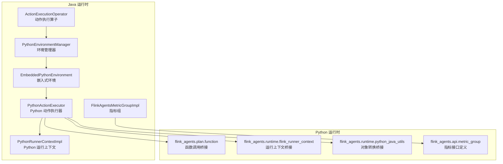
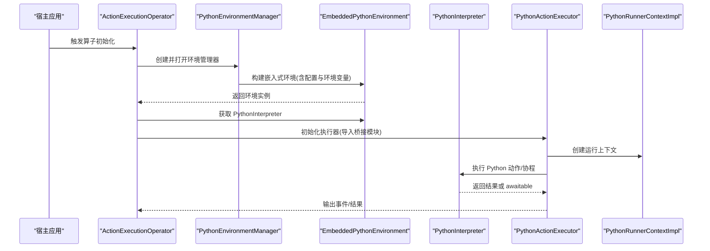
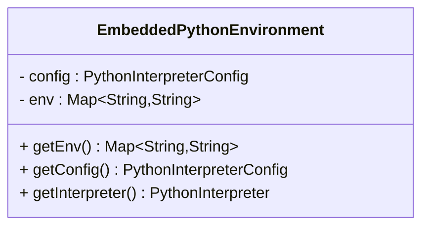
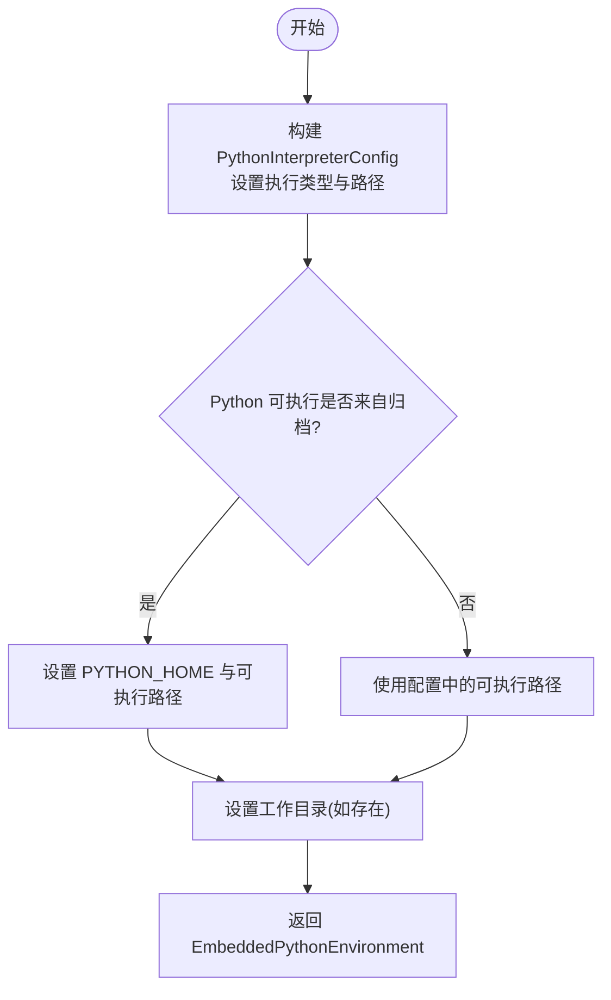
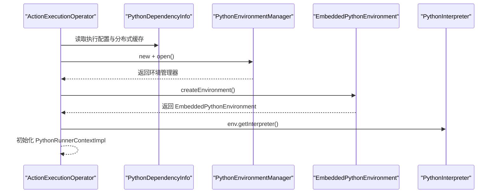
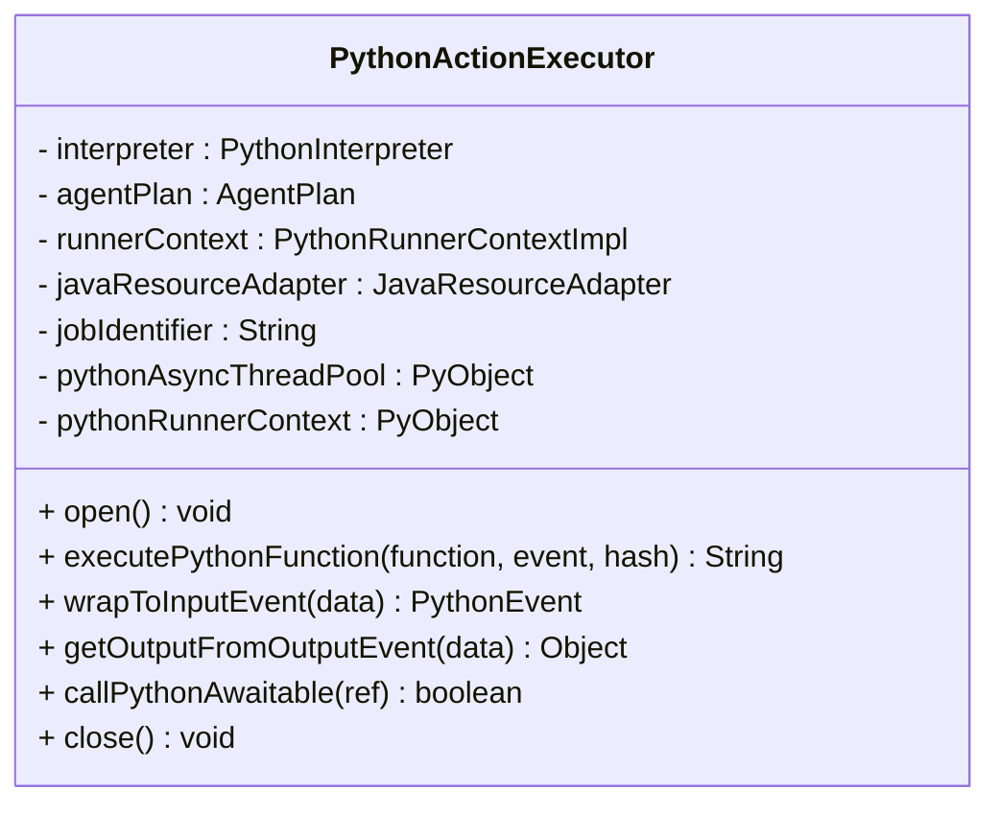
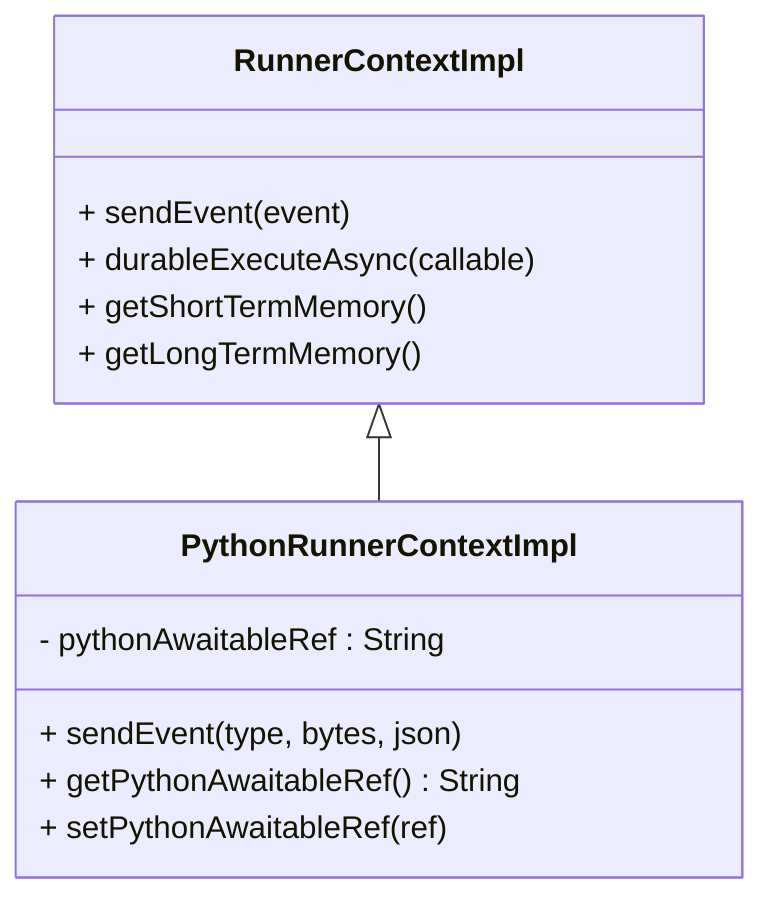
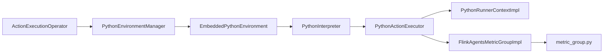

# 嵌入式 Python 环境

<cite>
**本文引用的文件**
- [EmbeddedPythonEnvironment.java](file://runtime/src/main/java/org/apache/flink/agents/runtime/env/EmbeddedPythonEnvironment.java)
- [PythonEnvironmentManager.java](file://runtime/src/main/java/org/apache/flink/agents/runtime/env/PythonEnvironmentManager.java)
- [ActionExecutionOperator.java](file://runtime/src/main/java/org/apache/flink/agents/runtime/operator/ActionExecutionOperator.java)
- [PythonRunnerContextImpl.java](file://runtime/src/main/java/org/apache/flink/agents/runtime/python/context/PythonRunnerContextImpl.java)
- [PythonActionExecutor.java](file://runtime/src/main/java/org/apache/flink/agents/runtime/python/utils/PythonActionExecutor.java)
- [PythonEnvironmentManagerTest.java](file://runtime/src/test/java/org/apache/flink/agents/runtime/env/PythonEnvironmentManagerTest.java)
- [FlinkAgentsMetricGroupImpl.java](file://runtime/src/main/java/org/apache/flink/agents/runtime/metrics/FlinkAgentsMetricGroupImpl.java)
- [metric_group.py](file://python/flink_agents/api/metric_group.py)
</cite>

## 目录
1. [引言](#引言)
2. [项目结构](#项目结构)
3. [核心组件](#核心组件)
4. [架构总览](#架构总览)
5. [详细组件分析](#详细组件分析)
6. [依赖关系分析](#依赖关系分析)
7. [性能考量](#性能考量)
8. [故障排查指南](#故障排查指南)
9. [结论](#结论)
10. [附录](#附录)

## 引言
本技术文档围绕 EmbeddedPythonEnvironment（嵌入式 Python 环境）展开，系统阐述其在 Java 应用中的设计理念与实现原理，重点覆盖以下方面：
- 如何在 Java 应用中嵌入并运行 Python 解释器
- 环境初始化流程：Python 解释器启动、内存管理、线程安全保证
- 隔离机制：进程隔离、资源限制与安全沙箱
- 生命周期管理：启动、运行、暂停与销毁
- 与宿主应用的交互：API 调用、数据交换与错误传播
- 配置选项：Python 版本选择、路径设置与性能参数
- 监控与调试：资源使用跟踪与性能分析工具

## 项目结构
与嵌入式 Python 环境直接相关的模块主要分布在 runtime 与 python 两个子树中：
- runtime：包含 Java 运行时侧的环境管理、执行器与上下文封装
- python：包含 Python 侧的计划、运行时桥接与指标接口

图表来源
- [ActionExecutionOperator.java](file://runtime/src/main/java/org/apache/flink/agents/runtime/operator/ActionExecutionOperator.java#L628-L651)
- [PythonEnvironmentManager.java](file://runtime/src/main/java/org/apache/flink/agents/runtime/env/PythonEnvironmentManager.java#L44-L83)
- [EmbeddedPythonEnvironment.java](file://runtime/src/main/java/org/apache/flink/agents/runtime/env/EmbeddedPythonEnvironment.java#L27-L47)
- [PythonActionExecutor.java](file://runtime/src/main/java/org/apache/flink/agents/runtime/python/utils/PythonActionExecutor.java#L36-L91)
- [PythonRunnerContextImpl.java](file://runtime/src/main/java/org/apache/flink/agents/runtime/python/context/PythonRunnerContextImpl.java#L32-L68)
- [FlinkAgentsMetricGroupImpl.java](file://runtime/src/main/java/org/apache/flink/agents/runtime/metrics/FlinkAgentsMetricGroupImpl.java#L69-L104)
- [metric_group.py](file://python/flink_agents/api/metric_group.py#L31-L85)

章节来源
- [EmbeddedPythonEnvironment.java](file://runtime/src/main/java/org/apache/flink/agents/runtime/env/EmbeddedPythonEnvironment.java#L27-L47)
- [PythonEnvironmentManager.java](file://runtime/src/main/java/org/apache/flink/agents/runtime/env/PythonEnvironmentManager.java#L35-L83)
- [ActionExecutionOperator.java](file://runtime/src/main/java/org/apache/flink/agents/runtime/operator/ActionExecutionOperator.java#L628-L651)

## 核心组件
- EmbeddedPythonEnvironment：封装 PythonInterpreterConfig 与环境变量，提供 PythonInterpreter 实例
- PythonEnvironmentManager：负责根据依赖信息构建嵌入式 Python 环境，处理 Python 可执行文件、工作目录与路径
- ActionExecutionOperator：在算子初始化阶段创建环境管理器与嵌入式环境，并获取 PythonInterpreter
- PythonActionExecutor：在 Python 解释器中执行动作，进行对象转换、协程调度与事件包装
- PythonRunnerContextImpl：Python 动作专用的运行上下文，支持 awaitable 对象引用与事件发送
- 指标体系：通过 FlinkAgentsMetricGroupImpl 提供计数器、计量器、直方图等指标能力

章节来源
- [EmbeddedPythonEnvironment.java](file://runtime/src/main/java/org/apache/flink/agents/runtime/env/EmbeddedPythonEnvironment.java#L27-L47)
- [PythonEnvironmentManager.java](file://runtime/src/main/java/org/apache/flink/agents/runtime/env/PythonEnvironmentManager.java#L44-L83)
- [ActionExecutionOperator.java](file://runtime/src/main/java/org/apache/flink/agents/runtime/operator/ActionExecutionOperator.java#L628-L651)
- [PythonActionExecutor.java](file://runtime/src/main/java/org/apache/flink/agents/runtime/python/utils/PythonActionExecutor.java#L36-L91)
- [PythonRunnerContextImpl.java](file://runtime/src/main/java/org/apache/flink/agents/runtime/python/context/PythonRunnerContextImpl.java#L32-L68)
- [FlinkAgentsMetricGroupImpl.java](file://runtime/src/main/java/org/apache/flink/agents/runtime/metrics/FlinkAgentsMetricGroupImpl.java#L69-L104)

## 架构总览
嵌入式 Python 环境的运行架构由“Java 初始化 → 环境构建 → 解释器执行 → 上下文与事件桥接”构成。

图表来源
- [ActionExecutionOperator.java](file://runtime/src/main/java/org/apache/flink/agents/runtime/operator/ActionExecutionOperator.java#L628-L651)
- [PythonEnvironmentManager.java](file://runtime/src/main/java/org/apache/flink/agents/runtime/env/PythonEnvironmentManager.java#L44-L83)
- [EmbeddedPythonEnvironment.java](file://runtime/src/main/java/org/apache/flink/agents/runtime/env/EmbeddedPythonEnvironment.java#L44-L46)
- [PythonActionExecutor.java](file://runtime/src/main/java/org/apache/flink/agents/runtime/python/utils/PythonActionExecutor.java#L93-L111)
- [PythonRunnerContextImpl.java](file://runtime/src/main/java/org/apache/flink/agents/runtime/python/context/PythonRunnerContextImpl.java#L41-L47)

## 详细组件分析

### 组件一：EmbeddedPythonEnvironment（嵌入式环境）
- 职责：持有 PythonInterpreterConfig 与环境变量映射；对外暴露获取 PythonInterpreter 的工厂方法
- 关键点：
  - 将 pemja.core.PythonInterpreterConfig 作为唯一配置源
  - 通过 getInterpreter() 每次返回新的 PythonInterpreter 实例，避免跨调用状态污染
  - 保留原始环境变量以便上层统一管理

图表来源
- [EmbeddedPythonEnvironment.java](file://runtime/src/main/java/org/apache/flink/agents/runtime/env/EmbeddedPythonEnvironment.java#L27-L47)

章节来源
- [EmbeddedPythonEnvironment.java](file://runtime/src/main/java/org/apache/flink/agents/runtime/env/EmbeddedPythonEnvironment.java#L27-L47)

### 组件二：PythonEnvironmentManager（环境管理器）
- 职责：基于 PythonDependencyInfo 与系统环境变量，构建 EmbeddedPythonEnvironment
- 关键点：
  - 设置执行类型为多线程（MULTI_THREAD），满足异步与并发需求
  - 处理“从归档中运行”的场景：自动设置 PYTHON_HOME 与 Python 可执行路径
  - 合并用户提供的 PYTHONPATH 与分发文件路径
  - 支持工作目录（PYTHON_WORKING_DIR）与临时目录

图表来源
- [PythonEnvironmentManager.java](file://runtime/src/main/java/org/apache/flink/agents/runtime/env/PythonEnvironmentManager.java#L44-L83)
- [PythonEnvironmentManager.java](file://runtime/src/main/java/org/apache/flink/agents/runtime/env/PythonEnvironmentManager.java#L85-L108)

章节来源
- [PythonEnvironmentManager.java](file://runtime/src/main/java/org/apache/flink/agents/runtime/env/PythonEnvironmentManager.java#L35-L83)
- [PythonEnvironmentManagerTest.java](file://runtime/src/test/java/org/apache/flink/agents/runtime/env/PythonEnvironmentManagerTest.java#L139-L162)
- [PythonEnvironmentManagerTest.java](file://runtime/src/test/java/org/apache/flink/agents/runtime/env/PythonEnvironmentManagerTest.java#L164-L233)
- [PythonEnvironmentManagerTest.java](file://runtime/src/test/java/org/apache/flink/agents/runtime/env/PythonEnvironmentManagerTest.java#L235-L254)

### 组件三：ActionExecutionOperator（动作执行算子）
- 职责：在算子生命周期内完成 Python 环境初始化与解释器获取
- 关键点：
  - 从执行配置与分布式缓存中提取 Python 依赖信息
  - 使用 TaskManager 的临时目录与系统环境变量构造环境管理器
  - 创建环境并获取 PythonInterpreter，随后初始化 PythonRunnerContextImpl

图表来源
- [ActionExecutionOperator.java](file://runtime/src/main/java/org/apache/flink/agents/runtime/operator/ActionExecutionOperator.java#L628-L651)

章节来源
- [ActionExecutionOperator.java](file://runtime/src/main/java/org/apache/flink/agents/runtime/operator/ActionExecutionOperator.java#L628-L651)

### 组件四：PythonActionExecutor（Python 动作执行器）
- 职责：在 Python 解释器中执行动作，进行对象转换、协程调度与事件包装
- 关键点：
  - 导入桥接模块：flink_agents.plan.function、flink_agents.runtime.flink_runner_context、python_java_utils
  - 创建异步线程池与运行上下文，绑定到 Python 环境
  - 将 Java 事件包装为 Python 事件，或将 Python 输出解包为 Java 结果
  - 对 awaitable 对象进行手动引用计数，避免被垃圾回收

图表来源
- [PythonActionExecutor.java](file://runtime/src/main/java/org/apache/flink/agents/runtime/python/utils/PythonActionExecutor.java#L36-L91)
- [PythonActionExecutor.java](file://runtime/src/main/java/org/apache/flink/agents/runtime/python/utils/PythonActionExecutor.java#L123-L149)
- [PythonActionExecutor.java](file://runtime/src/main/java/org/apache/flink/agents/runtime/python/utils/PythonActionExecutor.java#L176-L186)

章节来源
- [PythonActionExecutor.java](file://runtime/src/main/java/org/apache/flink/agents/runtime/python/utils/PythonActionExecutor.java#L36-L91)
- [PythonActionExecutor.java](file://runtime/src/main/java/org/apache/flink/agents/runtime/python/utils/PythonActionExecutor.java#L123-L149)
- [PythonActionExecutor.java](file://runtime/src/main/java/org/apache/flink/agents/runtime/python/utils/PythonActionExecutor.java#L176-L186)

### 组件五：PythonRunnerContextImpl（Python 运行上下文）
- 职责：为 Python 动作提供专用运行上下文，支持 awaitable 引用与事件发送
- 关键点：
  - 仅接受 PythonEvent 类型的事件
  - 维护 awaitable 对象的引用名称，便于后续恢复执行
  - 与 Java 线程模型配合，确保在邮箱线程中访问内存等资源

图表来源
- [PythonRunnerContextImpl.java](file://runtime/src/main/java/org/apache/flink/agents/runtime/python/context/PythonRunnerContextImpl.java#L32-L68)

章节来源
- [PythonRunnerContextImpl.java](file://runtime/src/main/java/org/apache/flink/agents/runtime/python/context/PythonRunnerContextImpl.java#L32-L68)

### 组件六：指标与监控（FlinkAgentsMetricGroupImpl 与 Python 指标接口）
- 职责：提供计数器、计量器、直方图等指标能力，用于性能观测与问题定位
- 关键点：
  - Java 侧通过 FlinkAgentsMetricGroupImpl 提供指标注册与查询
  - Python 侧通过 flink_agents.api.metric_group 定义指标抽象接口

章节来源
- [FlinkAgentsMetricGroupImpl.java](file://runtime/src/main/java/org/apache/flink/agents/runtime/metrics/FlinkAgentsMetricGroupImpl.java#L69-L104)
- [metric_group.py](file://python/flink_agents/api/metric_group.py#L31-L85)

## 依赖关系分析
- ActionExecutionOperator 依赖 PythonEnvironmentManager 以创建嵌入式环境
- EmbeddedPythonEnvironment 依赖 pemja.core.PythonInterpreterConfig 与环境变量
- PythonActionExecutor 依赖 PythonInterpreter 与桥接模块，负责动作执行与事件包装
- PythonRunnerContextImpl 依赖 RunnerContextImpl 并扩展 Python 专属能力
- 指标体系贯穿 Java 与 Python 两侧，形成统一观测面

图表来源
- [ActionExecutionOperator.java](file://runtime/src/main/java/org/apache/flink/agents/runtime/operator/ActionExecutionOperator.java#L628-L651)
- [PythonEnvironmentManager.java](file://runtime/src/main/java/org/apache/flink/agents/runtime/env/PythonEnvironmentManager.java#L44-L83)
- [EmbeddedPythonEnvironment.java](file://runtime/src/main/java/org/apache/flink/agents/runtime/env/EmbeddedPythonEnvironment.java#L27-L47)
- [PythonActionExecutor.java](file://runtime/src/main/java/org/apache/flink/agents/runtime/python/utils/PythonActionExecutor.java#L36-L91)
- [PythonRunnerContextImpl.java](file://runtime/src/main/java/org/apache/flink/agents/runtime/python/context/PythonRunnerContextImpl.java#L32-L68)
- [FlinkAgentsMetricGroupImpl.java](file://runtime/src/main/java/org/apache/flink/agents/runtime/metrics/FlinkAgentsMetricGroupImpl.java#L69-L104)
- [metric_group.py](file://python/flink_agents/api/metric_group.py#L31-L85)

章节来源
- [ActionExecutionOperator.java](file://runtime/src/main/java/org/apache/flink/agents/runtime/operator/ActionExecutionOperator.java#L628-L651)
- [PythonEnvironmentManager.java](file://runtime/src/main/java/org/apache/flink/agents/runtime/env/PythonEnvironmentManager.java#L44-L83)
- [EmbeddedPythonEnvironment.java](file://runtime/src/main/java/org/apache/flink/agents/runtime/env/EmbeddedPythonEnvironment.java#L27-L47)
- [PythonActionExecutor.java](file://runtime/src/main/java/org/apache/flink/agents/runtime/python/utils/PythonActionExecutor.java#L36-L91)
- [PythonRunnerContextImpl.java](file://runtime/src/main/java/org/apache/flink/agents/runtime/python/context/PythonRunnerContextImpl.java#L32-L68)
- [FlinkAgentsMetricGroupImpl.java](file://runtime/src/main/java/org/apache/flink/agents/runtime/metrics/FlinkAgentsMetricGroupImpl.java#L69-L104)
- [metric_group.py](file://python/flink_agents/api/metric_group.py#L31-L85)

## 性能考量
- 多线程执行：环境默认启用 MULTI_THREAD 执行类型，适合并发与异步任务
- 对象引用与 GC：对 awaitable 对象采用手动引用计数策略，避免被 Pemja 的对象计数问题导致过早回收
- 路径与归档：优先从归档中运行 Python 可执行文件，减少磁盘 IO 并提升启动速度
- 指标观测：通过直方图与计量器记录关键指标，辅助性能分析与容量规划

章节来源
- [PythonEnvironmentManager.java](file://runtime/src/main/java/org/apache/flink/agents/runtime/env/PythonEnvironmentManager.java#L48-L51)
- [PythonActionExecutor.java](file://runtime/src/main/java/org/apache/flink/agents/runtime/python/utils/PythonActionExecutor.java#L113-L149)
- [FlinkAgentsMetricGroupImpl.java](file://runtime/src/main/java/org/apache/flink/agents/runtime/metrics/FlinkAgentsMetricGroupImpl.java#L90-L103)

## 故障排查指南
- 环境变量与路径
  - 确认 PYTHONPATH 是否正确合并了分发文件路径
  - 归档场景下检查 PYTHON_HOME 与可执行路径是否一致
- 解释器初始化
  - 若出现多线程相关异常，确认执行类型已设为 MULTI_THREAD
  - 检查工作目录是否正确设置
- 协程与 awaitable
  - 若协程未继续执行，检查 awaitable 引用名是否正确传递
  - 确保在执行前已建立运行上下文与异步线程池
- 事件与内存
  - PythonRunnerContextImpl 仅接受 PythonEvent，避免类型不匹配
  - 在非邮箱线程访问内存会触发校验，需在邮箱线程中操作

章节来源
- [PythonEnvironmentManagerTest.java](file://runtime/src/test/java/org/apache/flink/agents/runtime/env/PythonEnvironmentManagerTest.java#L139-L162)
- [PythonEnvironmentManagerTest.java](file://runtime/src/test/java/org/apache/flink/agents/runtime/env/PythonEnvironmentManagerTest.java#L164-L233)
- [PythonEnvironmentManagerTest.java](file://runtime/src/test/java/org/apache/flink/agents/runtime/env/PythonEnvironmentManagerTest.java#L235-L254)
- [PythonActionExecutor.java](file://runtime/src/main/java/org/apache/flink/agents/runtime/python/utils/PythonActionExecutor.java#L176-L186)
- [PythonRunnerContextImpl.java](file://runtime/src/main/java/org/apache/flink/agents/runtime/python/context/PythonRunnerContextImpl.java#L49-L59)

## 结论
EmbeddedPythonEnvironment 通过清晰的职责划分与严格的生命周期管理，在 Java 应用中实现了稳定、可扩展的嵌入式 Python 执行环境。其多线程执行、路径与归档优化、对象引用保护以及统一的指标体系，共同构成了可靠的运行时基础。结合完善的测试用例与故障排查建议，可有效支撑复杂场景下的 Python 与 Java 互操作。

## 附录
- 隔离与安全
  - 进程隔离：当前实现基于单进程内的嵌入式解释器，未引入外部进程隔离
  - 资源限制：可通过 Python 环境变量与解释器配置进行限制（例如工作目录与路径）
  - 安全沙箱：建议在部署层面结合容器或受限运行时进一步加固
- 配置要点
  - Python 版本与可执行文件：通过依赖信息指定
  - 路径设置：合并用户 PYTHONPATH 与分发文件路径
  - 性能参数：多线程执行类型、异步线程池大小、工作目录