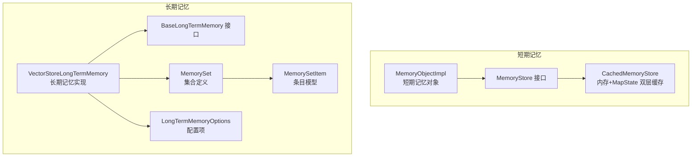
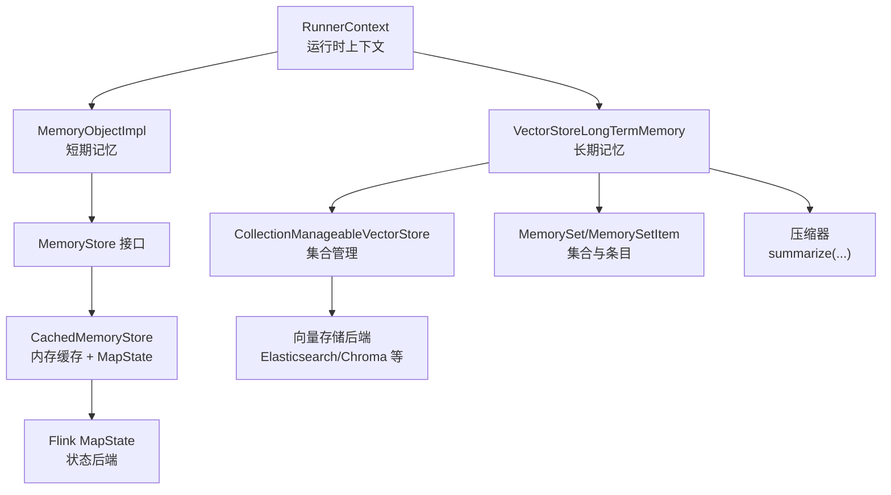
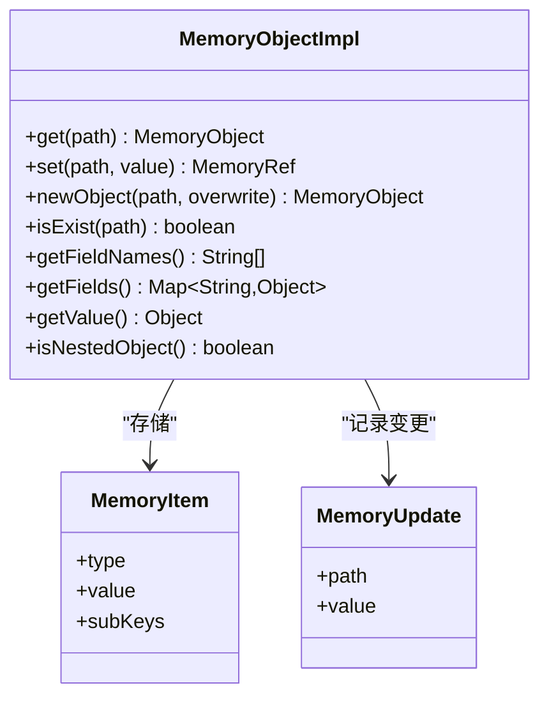
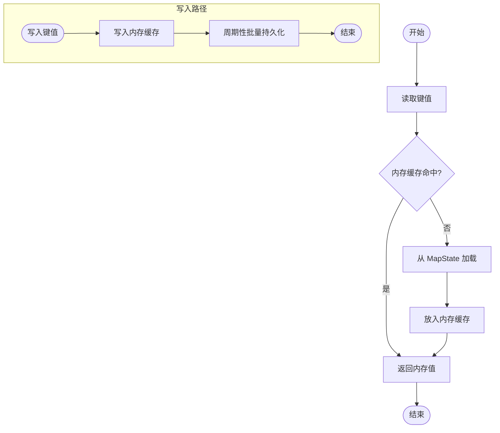
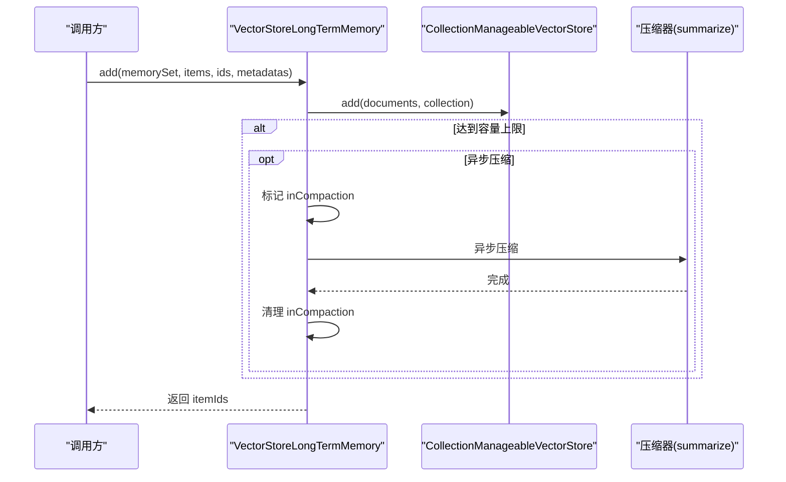
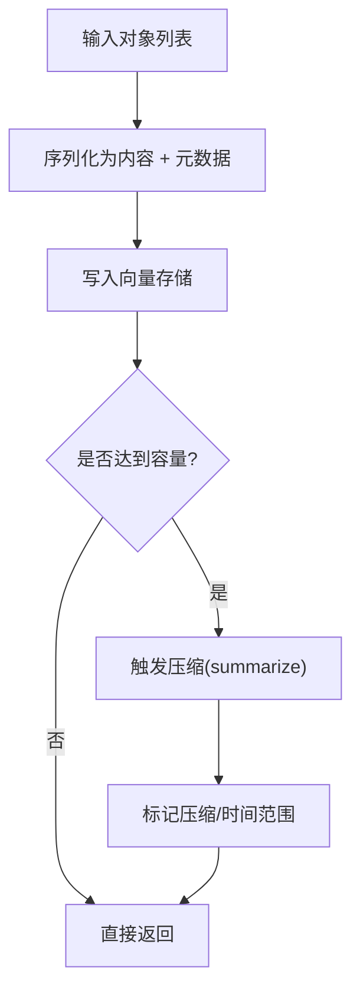
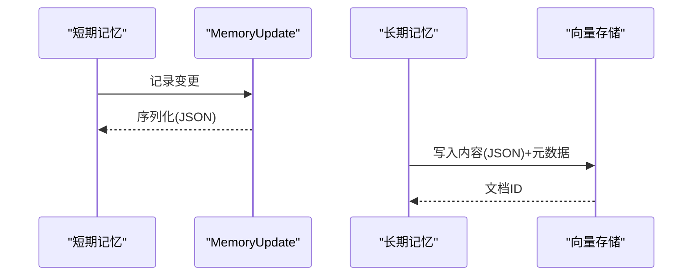
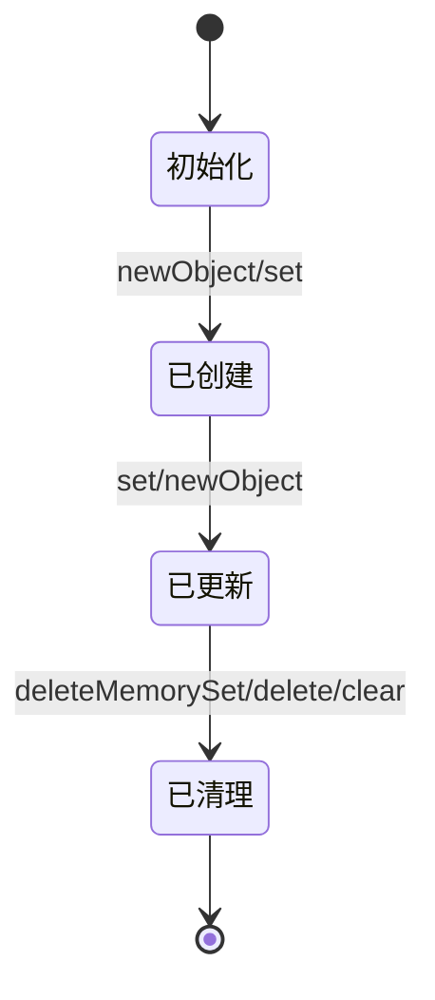
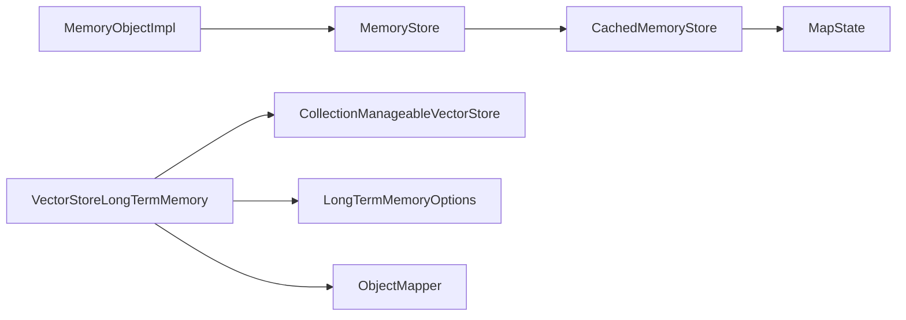

# 内存系统

<cite>
**本文引用的文件**   
- [MemoryObjectImpl.java](file://runtime/src/main/java/org/apache/flink/agents/runtime/memory/MemoryObjectImpl.java)
- [MemoryUpdate.java](file://api/src/main/java/org/apache/flink/agents/api/context/MemoryUpdate.java)
- [MemoryStore.java](file://runtime/src/main/java/org/apache/flink/agents/runtime/memory/MemoryStore.java)
- [CachedMemoryStore.java](file://runtime/src/main/java/org/apache/flink/agents/runtime/memory/CachedMemoryStore.java)
- [MemorySegmentPool.java](file://runtime/src/main/java/org/apache/flink/agents/runtime/memory/MemorySegmentPool.java)
- [VectorStoreLongTermMemory.java](file://runtime/src/main/java/org/apache/flink/agents/runtime/memory/VectorStoreLongTermMemory.java)
- [BaseLongTermMemory.java](file://api/src/main/java/org/apache/flink/agents/api/memory/BaseLongTermMemory.java)
- [InteranlBaseLongTermMemory.java](file://runtime/src/main/java/org/apache/flink/agents/runtime/memory/InteranlBaseLongTermMemory.java)
- [LongTermMemoryOptions.java](file://api/src/main/java/org/apache/flink/agents/api/memory/LongTermMemoryOptions.java)
- [MemorySet.java](file://api/src/main/java/org/apache/flink/agents/api/memory/MemorySet.java)
- [MemorySetItem.java](file://api/src/main/java/org/apache/flink/agents/api/memory/MemorySetItem.java)
- [MemoryObject.java](file://api/src/main/java/org/apache/flink/agents/api/context/MemoryObject.java)
- [VectorStoreLongTermMemoryTest.java](file://e2e-test/flink-agents-end-to-end-tests-integration/src/test/java/org/apache/flink/agents/integration/test/VectorStoreLongTermMemoryTest.java)
- [MemoryObjectTest.java](file://runtime/src/test/java/org/apache/flink/agents/runtime/memory/MemoryObjectTest.java)
- [test_vector_store_long_term_memory.py](file://python/flink_agents/runtime/memory/tests/test_vector_store_long_term_memory.py)
</cite>

## 目录
1. [简介](#简介)
2. [项目结构](#项目结构)
3. [核心组件](#核心组件)
4. [架构总览](#架构总览)
5. [组件详解](#组件详解)
6. [依赖关系分析](#依赖关系分析)
7. [性能考量](#性能考量)
8. [故障排查指南](#故障排查指南)
9. [结论](#结论)
10. [附录：配置与调优指南](#附录配置与调优指南)

## 简介
本文件系统性阐述 Flink Agents 的内存子系统，覆盖短期记忆与长期记忆的架构设计、数据模型、更新策略、缓存与持久化机制、向量存储实现、序列化与反序列化、与 Flink 状态后端的集成、内存对象生命周期管理，以及在故障恢复场景下的状态重建机制。面向性能优化工程师与系统管理员，提供可操作的配置与调优建议。

## 项目结构
内存系统主要由以下层次构成：
- 短期记忆（进程内）：基于键值树状结构的 MemoryObjectImpl，配合 MemoryStore/CachedMemoryStore 实现内存与状态后端的双层缓存。
- 长期记忆（外部向量存储）：以 VectorStoreLongTermMemory 为核心，通过 CollectionManageableVectorStore 管理集合，支持容量超限后的压缩（合并/摘要）。
- 数据模型：MemoryUpdate 记录短期记忆变更；MemorySet/MemorySetItem 描述长期记忆集合与条目；MemoryObject 定义短期记忆访问接口。
- 配置与选项：LongTermMemoryOptions 提供异步压缩、线程数等参数。

**图表来源**
- [MemoryObjectImpl.java](file://runtime/src/main/java/org/apache/flink/agents/runtime/memory/MemoryObjectImpl.java#L32-L260)
- [MemoryStore.java](file://runtime/src/main/java/org/apache/flink/agents/runtime/memory/MemoryStore.java#L22-L52)
- [CachedMemoryStore.java](file://runtime/src/main/java/org/apache/flink/agents/runtime/memory/CachedMemoryStore.java#L25-L66)
- [VectorStoreLongTermMemory.java](file://runtime/src/main/java/org/apache/flink/agents/runtime/memory/VectorStoreLongTermMemory.java#L57-L315)
- [BaseLongTermMemory.java](file://api/src/main/java/org/apache/flink/agents/api/memory/BaseLongTermMemory.java#L27-L134)
- [MemorySet.java](file://api/src/main/java/org/apache/flink/agents/api/memory/MemorySet.java#L81-L159)
- [MemorySetItem.java](file://api/src/main/java/org/apache/flink/agents/api/memory/MemorySetItem.java#L32-L94)
- [LongTermMemoryOptions.java](file://api/src/main/java/org/apache/flink/agents/api/memory/LongTermMemoryOptions.java#L22-L53)

**章节来源**
- [MemoryObjectImpl.java](file://runtime/src/main/java/org/apache/flink/agents/runtime/memory/MemoryObjectImpl.java#L32-L260)
- [CachedMemoryStore.java](file://runtime/src/main/java/org/apache/flink/agents/runtime/memory/CachedMemoryStore.java#L25-L66)
- [VectorStoreLongTermMemory.java](file://runtime/src/main/java/org/apache/flink/agents/runtime/memory/VectorStoreLongTermMemory.java#L57-L315)
- [BaseLongTermMemory.java](file://api/src/main/java/org/apache/flink/agents/api/memory/BaseLongTermMemory.java#L27-L134)
- [LongTermMemoryOptions.java](file://api/src/main/java/org/apache/flink/agents/api/memory/LongTermMemoryOptions.java#L22-L53)

## 核心组件
- MemoryObjectImpl：短期记忆的核心实现，提供路径式访问、对象创建、字段枚举、值读取等能力，并维护 MemoryUpdate 列表用于追踪变更。
- MemoryUpdate：记录短期记忆中某绝对路径的最新值，用于持久化与回放。
- MemoryStore/CachedMemoryStore：抽象与实现短期记忆的读写与缓存，支持内存缓存与 Flink MapState 的持久化。
- VectorStoreLongTermMemory：长期记忆实现，基于向量存储集合进行增删查改与语义检索，并在容量超限时触发压缩。
- MemorySet/MemorySetItem：长期记忆集合与条目的数据模型，包含类型、容量、元数据与时间戳。
- InteranlBaseLongTermMemory：扩展 BaseLongTermMemory，增加上下文切换能力（按 key 隔离数据）。
- LongTermMemoryOptions：长期记忆相关配置，如异步压缩开关与线程数。

**章节来源**
- [MemoryObjectImpl.java](file://runtime/src/main/java/org/apache/flink/agents/runtime/memory/MemoryObjectImpl.java#L32-L260)
- [MemoryUpdate.java](file://api/src/main/java/org/apache/flink/agents/api/context/MemoryUpdate.java#L28-L84)
- [MemoryStore.java](file://runtime/src/main/java/org/apache/flink/agents/runtime/memory/MemoryStore.java#L22-L52)
- [CachedMemoryStore.java](file://runtime/src/main/java/org/apache/flink/agents/runtime/memory/CachedMemoryStore.java#L25-L66)
- [VectorStoreLongTermMemory.java](file://runtime/src/main/java/org/apache/flink/agents/runtime/memory/VectorStoreLongTermMemory.java#L57-L315)
- [BaseLongTermMemory.java](file://api/src/main/java/org/apache/flink/agents/api/memory/BaseLongTermMemory.java#L27-L134)
- [InteranlBaseLongTermMemory.java](file://runtime/src/main/java/org/apache/flink/agents/runtime/memory/InteranlBaseLongTermMemory.java#L22-L32)
- [LongTermMemoryOptions.java](file://api/src/main/java/org/apache/flink/agents/api/memory/LongTermMemoryOptions.java#L22-L53)
- [MemorySet.java](file://api/src/main/java/org/apache/flink/agents/api/memory/MemorySet.java#L81-L159)
- [MemorySetItem.java](file://api/src/main/java/org/apache/flink/agents/api/memory/MemorySetItem.java#L32-L94)

## 架构总览
短期记忆采用“内存树 + MapState”的双层结构，通过 CachedMemoryStore 将频繁访问的数据驻留于内存，周期性批量写回 MapState，降低状态后端压力。长期记忆以 VectorStoreLongTermMemory 为中心，围绕 CollectionManageableVectorStore 进行集合管理与检索，支持容量超限的压缩（同步或异步），并以 MemorySet/MemorySetItem 维护集合元信息与条目属性。

**图表来源**
- [MemoryObjectImpl.java](file://runtime/src/main/java/org/apache/flink/agents/runtime/memory/MemoryObjectImpl.java#L32-L260)
- [CachedMemoryStore.java](file://runtime/src/main/java/org/apache/flink/agents/runtime/memory/CachedMemoryStore.java#L25-L66)
- [VectorStoreLongTermMemory.java](file://runtime/src/main/java/org/apache/flink/agents/runtime/memory/VectorStoreLongTermMemory.java#L57-L315)
- [MemorySet.java](file://api/src/main/java/org/apache/flink/agents/api/memory/MemorySet.java#L81-L159)
- [MemorySetItem.java](file://api/src/main/java/org/apache/flink/agents/api/memory/MemorySetItem.java#L32-L94)

## 组件详解

### 短期记忆：MemoryObjectImpl 与 MemoryUpdate
- 结构与路径访问：MemoryObjectImpl 以“根键”为起点，用点分隔的路径组织对象树，支持相对/绝对路径访问与对象创建。
- 更新策略：每次 set/newObject 操作会生成一条 MemoryUpdate 并追加到列表，便于后续持久化与事件传播。
- 类型安全：区分对象节点与值节点，防止将对象覆盖为值，或直接设置对象类型的值。
- 线程检查：通过 mailBoxThreadChecker 在访问前校验执行线程，确保状态一致性。

**图表来源**
- [MemoryObjectImpl.java](file://runtime/src/main/java/org/apache/flink/agents/runtime/memory/MemoryObjectImpl.java#L32-L260)
- [MemoryUpdate.java](file://api/src/main/java/org/apache/flink/agents/api/context/MemoryUpdate.java#L28-L84)

**章节来源**
- [MemoryObjectImpl.java](file://runtime/src/main/java/org/apache/flink/agents/runtime/memory/MemoryObjectImpl.java#L73-L225)
- [MemoryUpdate.java](file://api/src/main/java/org/apache/flink/agents/api/context/MemoryUpdate.java#L28-L84)
- [MemoryObject.java](file://api/src/main/java/org/apache/flink/agents/api/context/MemoryObject.java#L23-L132)

### 缓存策略：CachedMemoryStore 与内存池
- 双层缓存：CachedMemoryStore 维护内存缓存 Map 与底层 MapState，优先命中内存缓存，减少状态后端读写。
- 批量持久化：persistCache 将内存缓存批量写回 MapState，并清空内存缓存，降低 IO 压力。
- 内存池：MemorySegmentPool 提供固定页大小的内存段池，按需分配并在超过阈值时释放，避免 OOM。

**图表来源**
- [CachedMemoryStore.java](file://runtime/src/main/java/org/apache/flink/agents/runtime/memory/CachedMemoryStore.java#L25-L66)
- [MemorySegmentPool.java](file://runtime/src/main/java/org/apache/flink/agents/runtime/memory/MemorySegmentPool.java#L35-L107)

**章节来源**
- [CachedMemoryStore.java](file://runtime/src/main/java/org/apache/flink/agents/runtime/memory/CachedMemoryStore.java#L25-L66)
- [MemorySegmentPool.java](file://runtime/src/main/java/org/apache/flink/agents/runtime/memory/MemorySegmentPool.java#L35-L107)

### 长期记忆：VectorStoreLongTermMemory 与集合管理
- 集合命名：通过 nameMangling(jobId, key, name) 生成唯一集合名，支持按 key 隔离不同上下文。
- 写入与元数据：add 时为每条记录写入“是否已压缩”、“创建时间”、“最后访问时间”等元数据，并自动补全缺失 ID。
- 检索与转换：search 返回向量相似度结果，convertToItems 将 Document 转换为 MemorySetItem，处理压缩后的日期范围。
- 压缩策略：当集合大小达到容量上限时，根据配置选择同步或异步压缩；异步模式使用弱映射跟踪正在压缩的集合，避免重复触发。

**图表来源**
- [VectorStoreLongTermMemory.java](file://runtime/src/main/java/org/apache/flink/agents/runtime/memory/VectorStoreLongTermMemory.java#L137-L218)
- [VectorStoreLongTermMemory.java](file://runtime/src/main/java/org/apache/flink/agents/runtime/memory/VectorStoreLongTermMemory.java#L285-L292)

**章节来源**
- [VectorStoreLongTermMemory.java](file://runtime/src/main/java/org/apache/flink/agents/runtime/memory/VectorStoreLongTermMemory.java#L99-L135)
- [VectorStoreLongTermMemory.java](file://runtime/src/main/java/org/apache/flink/agents/runtime/memory/VectorStoreLongTermMemory.java#L137-L218)
- [VectorStoreLongTermMemory.java](file://runtime/src/main/java/org/apache/flink/agents/runtime/memory/VectorStoreLongTermMemory.java#L235-L283)
- [InteranlBaseLongTermMemory.java](file://runtime/src/main/java/org/apache/flink/agents/runtime/memory/InteranlBaseLongTermMemory.java#L22-L32)

### 向量存储实现：嵌入、检索与压缩
- 嵌入与存储：add 将对象序列化为内容，结合元数据写入向量存储；检索时通过 VectorStoreQuery 执行语义查询。
- 压缩机制：压缩器对超容量集合进行合并/摘要，标记 compacted 并记录时间范围，检索时自动解析。
- 集合元数据：集合元信息中保存 MemorySet 定义，便于重建集合与条目类型。

**图表来源**
- [VectorStoreLongTermMemory.java](file://runtime/src/main/java/org/apache/flink/agents/runtime/memory/VectorStoreLongTermMemory.java#L137-L187)
- [VectorStoreLongTermMemory.java](file://runtime/src/main/java/org/apache/flink/agents/runtime/memory/VectorStoreLongTermMemory.java#L285-L287)

**章节来源**
- [VectorStoreLongTermMemory.java](file://runtime/src/main/java/org/apache/flink/agents/runtime/memory/VectorStoreLongTermMemory.java#L137-L187)
- [VectorStoreLongTermMemory.java](file://runtime/src/main/java/org/apache/flink/agents/runtime/memory/VectorStoreLongTermMemory.java#L250-L283)

### 序列化与反序列化、与 Flink 状态后端集成
- 短期记忆：MemoryUpdate 使用 Jackson 注解进行序列化，便于跨语言与持久化传输。
- 长期记忆：MemorySet 作为集合元信息以 JSON 存储在集合元数据中；条目内容也以 JSON 字符串形式存储，检索时按条目类型反序列化。
- 状态后端：CachedMemoryStore 通过 MapState 与 Flink 状态后端交互，支持检查点与恢复。

**图表来源**
- [MemoryUpdate.java](file://api/src/main/java/org/apache/flink/agents/api/context/MemoryUpdate.java#L28-L84)
- [VectorStoreLongTermMemory.java](file://runtime/src/main/java/org/apache/flink/agents/runtime/memory/VectorStoreLongTermMemory.java#L104-L122)
- [VectorStoreLongTermMemory.java](file://runtime/src/main/java/org/apache/flink/agents/runtime/memory/VectorStoreLongTermMemory.java#L172-L179)

**章节来源**
- [MemoryUpdate.java](file://api/src/main/java/org/apache/flink/agents/api/context/MemoryUpdate.java#L28-L84)
- [VectorStoreLongTermMemory.java](file://runtime/src/main/java/org/apache/flink/agents/runtime/memory/VectorStoreLongTermMemory.java#L104-L122)
- [VectorStoreLongTermMemory.java](file://runtime/src/main/java/org/apache/flink/agents/runtime/memory/VectorStoreLongTermMemory.java#L172-L179)

### 内存对象生命周期管理
- 创建：newObject(path) 自动填充父节点，确保路径存在；set(path, value) 同时更新父节点子键集合。
- 更新：set 与 newObject 均会生成 MemoryUpdate，记录绝对路径与新值。
- 销毁：删除通过 deleteMemorySet 或 delete 清空集合/条目；CachedMemoryStore 支持 clear 清空缓存与状态后端。
- 上下文隔离：switchContext 支持按 key 切换，集合名经 nameMangling 含 key，实现逻辑隔离。

**图表来源**
- [MemoryObjectImpl.java](file://runtime/src/main/java/org/apache/flink/agents/runtime/memory/MemoryObjectImpl.java#L115-L146)
- [VectorStoreLongTermMemory.java](file://runtime/src/main/java/org/apache/flink/agents/runtime/memory/VectorStoreLongTermMemory.java#L87-L90)
- [CachedMemoryStore.java](file://runtime/src/main/java/org/apache/flink/agents/runtime/memory/CachedMemoryStore.java#L61-L64)

**章节来源**
- [MemoryObjectImpl.java](file://runtime/src/main/java/org/apache/flink/agents/runtime/memory/MemoryObjectImpl.java#L115-L146)
- [VectorStoreLongTermMemory.java](file://runtime/src/main/java/org/apache/flink/agents/runtime/memory/VectorStoreLongTermMemory.java#L87-L90)
- [CachedMemoryStore.java](file://runtime/src/main/java/org/apache/flink/agents/runtime/memory/CachedMemoryStore.java#L61-L64)

## 依赖关系分析
- 短期记忆：MemoryObjectImpl 依赖 MemoryStore 接口，具体实现为 CachedMemoryStore，后者持有 MapState。
- 长期记忆：VectorStoreLongTermMemory 依赖 CollectionManageableVectorStore，内部通过 ObjectMapper 序列化集合元信息与条目内容。
- 配置：LongTermMemoryOptions 控制异步压缩与线程数，影响 VectorStoreLongTermMemory 的压缩执行策略。

**图表来源**
- [MemoryObjectImpl.java](file://runtime/src/main/java/org/apache/flink/agents/runtime/memory/MemoryObjectImpl.java#L32-L260)
- [CachedMemoryStore.java](file://runtime/src/main/java/org/apache/flink/agents/runtime/memory/CachedMemoryStore.java#L25-L66)
- [VectorStoreLongTermMemory.java](file://runtime/src/main/java/org/apache/flink/agents/runtime/memory/VectorStoreLongTermMemory.java#L57-L315)
- [LongTermMemoryOptions.java](file://api/src/main/java/org/apache/flink/agents/api/memory/LongTermMemoryOptions.java#L22-L53)

**章节来源**
- [MemoryObjectImpl.java](file://runtime/src/main/java/org/apache/flink/agents/runtime/memory/MemoryObjectImpl.java#L32-L260)
- [CachedMemoryStore.java](file://runtime/src/main/java/org/apache/flink/agents/runtime/memory/CachedMemoryStore.java#L25-L66)
- [VectorStoreLongTermMemory.java](file://runtime/src/main/java/org/apache/flink/agents/runtime/memory/VectorStoreLongTermMemory.java#L57-L315)
- [LongTermMemoryOptions.java](file://api/src/main/java/org/apache/flink/agents/api/memory/LongTermMemoryOptions.java#L22-L53)

## 性能考量
- 短期记忆
  - 使用 CachedMemoryStore 的内存缓存减少 MapState 读写次数；通过批量持久化降低状态后端压力。
  - MemorySegmentPool 控制内存段分配与释放，避免过度分配导致 OOM。
- 长期记忆
  - 异步压缩：开启 ASYNC_COMPACTION 并合理设置 THREAD_COUNT，避免阻塞主线程。
  - 容量与压缩：根据业务规模调整 MemorySet 容量与压缩策略，平衡检索质量与存储成本。
- 检索与序列化
  - 条目内容以 JSON 存储，注意序列化开销；在高吞吐场景下可考虑二进制序列化方案（需自定义适配）。

[本节为通用指导，无需列出具体文件来源]

## 故障排查指南
- 短期记忆
  - set 报错“无法将对象覆盖为值”：确认目标路径是否已有对象节点，避免直接覆盖。
  - getFields 返回异常：检查 MemoryItem 类型与路径是否存在。
- 长期记忆
  - add 后未触发压缩：检查容量阈值与 asyncCompaction 配置；查看 inCompaction 标记是否被正确清除。
  - search 结果为空：确认集合元数据中是否包含正确的 MemorySet 定义，以及向量存储后端可用性。
- 状态后端
  - 恢复失败：检查 MapState 是否可读；确认 CachedMemoryStore 的 clear/persistCache 行为是否符合预期。

**章节来源**
- [MemoryObjectImpl.java](file://runtime/src/main/java/org/apache/flink/agents/runtime/memory/MemoryObjectImpl.java#L104-L106)
- [VectorStoreLongTermMemory.java](file://runtime/src/main/java/org/apache/flink/agents/runtime/memory/VectorStoreLongTermMemory.java#L188-L215)
- [CachedMemoryStore.java](file://runtime/src/main/java/org/apache/flink/agents/runtime/memory/CachedMemoryStore.java#L54-L64)

## 结论
该内存系统通过短期记忆与长期记忆的清晰分层，实现了高性能、可扩展的记忆管理：短期记忆以内存缓存与 MapState 双层结构保障低延迟访问，长期记忆以向量存储与压缩机制支撑大规模知识管理。配合完善的序列化、上下文隔离与配置项，满足生产环境的稳定性与可运维性需求。

[本节为总结性内容，无需列出具体文件来源]

## 附录：配置与调优指南
- 长期记忆配置
  - 异步压缩开关：控制压缩是否异步执行，建议在高并发场景开启。
  - 线程数：设置压缩工作线程数量，需结合 CPU 与向量存储后端能力调优。
  - 集合容量：根据消息长度与检索频率设定 MemorySet 容量，避免频繁压缩。
- 短期记忆调优
  - 缓存大小：通过 MapState 与内存缓存比例平衡读写压力。
  - 批量持久化：增大批量写回频率，降低状态后端抖动。
- 监控指标
  - 建议采集：短期内存命中率、MapState 读写 QPS、长期记忆压缩耗时、检索延迟、集合大小与压缩次数。
- 故障恢复
  - 检查点/状态后端：确保 MapState 可用且数据可恢复；验证 MemorySet 元信息与条目内容的序列化一致性。

**章节来源**
- [LongTermMemoryOptions.java](file://api/src/main/java/org/apache/flink/agents/api/memory/LongTermMemoryOptions.java#L45-L52)
- [VectorStoreLongTermMemory.java](file://runtime/src/main/java/org/apache/flink/agents/runtime/memory/VectorStoreLongTermMemory.java#L294-L313)
- [MemoryObjectTest.java](file://runtime/src/test/java/org/apache/flink/agents/runtime/memory/MemoryObjectTest.java#L60-L84)
- [VectorStoreLongTermMemoryTest.java](file://e2e-test/flink-agents-end-to-end-tests-integration/src/test/java/org/apache/flink/agents/integration/test/VectorStoreLongTermMemoryTest.java#L147-L183)
- [test_vector_store_long_term_memory.py](file://python/flink_agents/runtime/memory/tests/test_vector_store_long_term_memory.py#L149-L200)