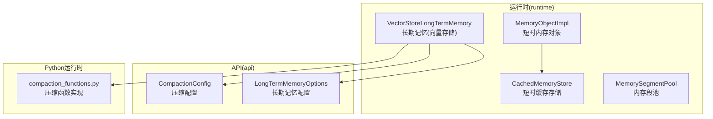
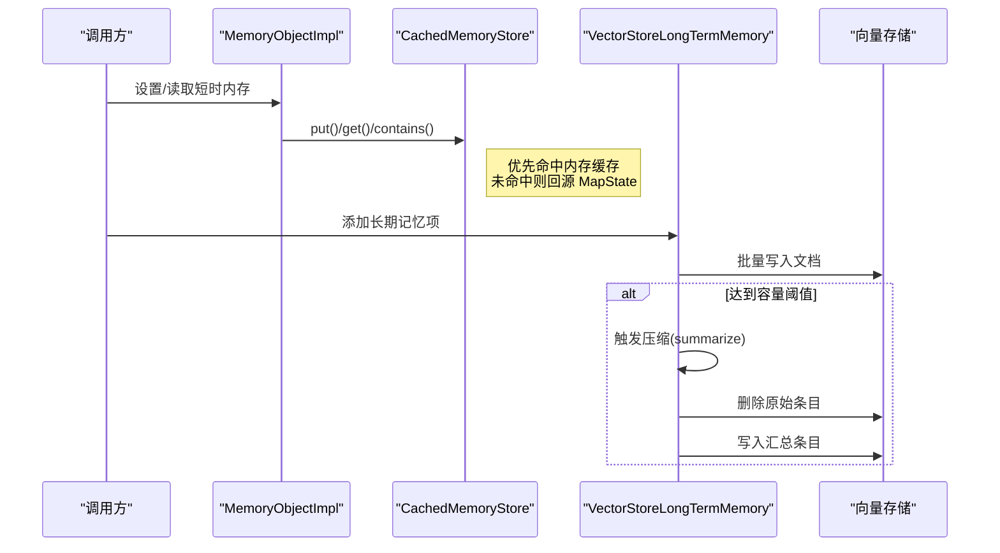
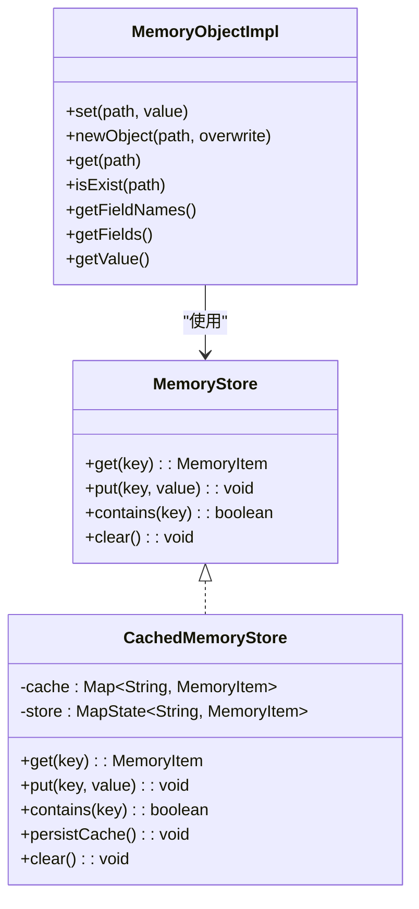
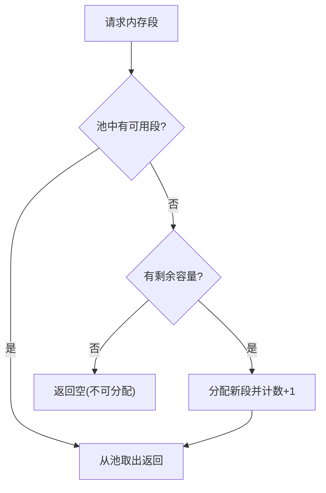
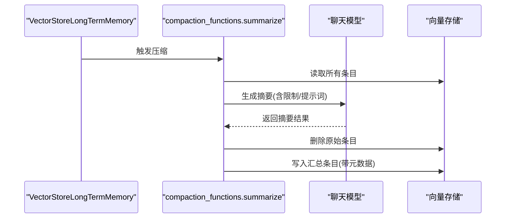
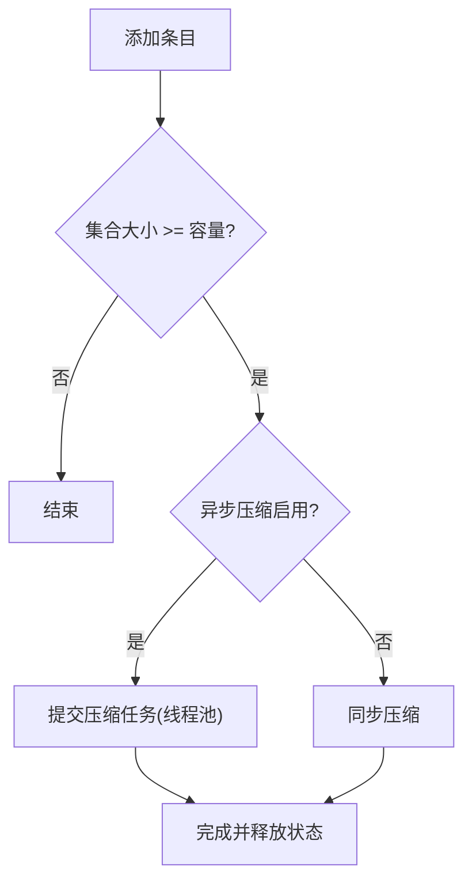
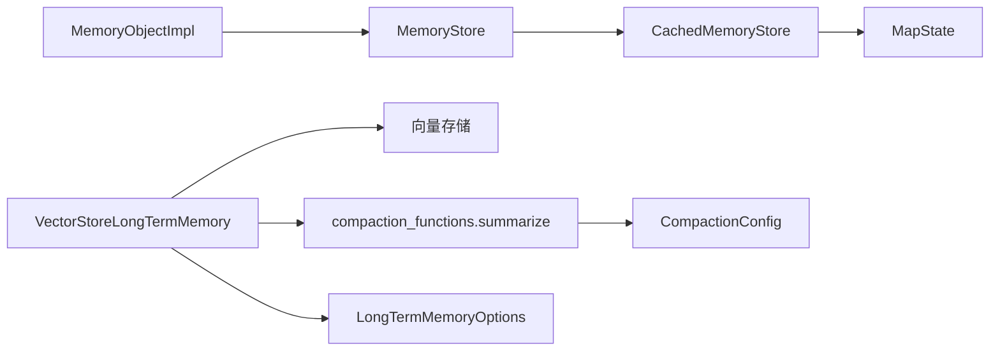

# 内存缓存机制

<cite>
**本文引用的文件**
- [CachedMemoryStore.java](file://runtime/src/main/java/org/apache/flink/agents/runtime/memory/CachedMemoryStore.java)
- [MemoryStore.java](file://runtime/src/main/java/org/apache/flink/agents/runtime/memory/MemoryStore.java)
- [MemoryObjectImpl.java](file://runtime/src/main/java/org/apache/flink/agents/runtime/memory/MemoryObjectImpl.java)
- [MemorySegmentPool.java](file://runtime/src/main/java/org/apache/flink/agents/runtime/memory/MemorySegmentPool.java)
- [VectorStoreLongTermMemory.java](file://runtime/src/main/java/org/apache/flink/agents/runtime/memory/VectorStoreLongTermMemory.java)
- [compaction_functions.py](file://python/flink_agents/runtime/memory/compaction_functions.py)
- [CompactionConfig.java](file://api/src/main/java/org/apache/flink/agents/api/memory/compaction/CompactionConfig.java)
- [LongTermMemoryOptions.java](file://api/src/main/java/org/apache/flink/agents/api/memory/LongTermMemoryOptions.java)
- [MemorySegmentPoolTest.java](file://runtime/src/test/java/org/apache/flink/agents/runtime/memory/MemorySegmentPoolTest.java)
- [CachedMemoryStoreTest.java](file://runtime/src/test/java/org/apache/flink/agents/runtime/memory/CachedMemoryStoreTest.java)
</cite>

## 目录
1. [引言](#引言)
2. [项目结构](#项目结构)
3. [核心组件](#核心组件)
4. [架构总览](#架构总览)
5. [组件详解](#组件详解)
6. [依赖关系分析](#依赖关系分析)
7. [性能考量与调优](#性能考量与调优)
8. [故障排除指南](#故障排除指南)
9. [结论](#结论)

## 引言
本技术文档聚焦于系统的内存缓存机制，围绕以下关键点展开：缓存策略实现（CachedMemoryStore）、内存段池管理（MemorySegmentPool）、压缩函数（CompactionFunctions）与长短期记忆的协同工作、持久化触发与批量写入、性能监控与调优参数、以及缓存一致性与并发控制。文档旨在帮助开发者与系统管理员理解并正确配置与维护该缓存体系。

## 项目结构
本仓库中与内存缓存直接相关的代码主要分布在 runtime 与 api 两个模块：
- runtime 模块包含短时内存对象与缓存存储实现、向量存储后端的长期记忆实现、内存段池等运行时组件。
- api 模块包含配置选项、压缩配置模型等接口与配置定义。

**图表来源**
- [CachedMemoryStore.java](file://runtime/src/main/java/org/apache/flink/agents/runtime/memory/CachedMemoryStore.java#L25-L65)
- [MemoryObjectImpl.java](file://runtime/src/main/java/org/apache/flink/agents/runtime/memory/MemoryObjectImpl.java#L33-L260)
- [MemorySegmentPool.java](file://runtime/src/main/java/org/apache/flink/agents/runtime/memory/MemorySegmentPool.java#L36-L106)
- [VectorStoreLongTermMemory.java](file://runtime/src/main/java/org/apache/flink/agents/runtime/memory/VectorStoreLongTermMemory.java#L57-L315)
- [compaction_functions.py](file://python/flink_agents/runtime/memory/compaction_functions.py#L62-L186)
- [CompactionConfig.java](file://api/src/main/java/org/apache/flink/agents/api/memory/compaction/CompactionConfig.java#L38-L92)
- [LongTermMemoryOptions.java](file://api/src/main/java/org/apache/flink/agents/api/memory/LongTermMemoryOptions.java#L22-L52)

**章节来源**
- [CachedMemoryStore.java](file://runtime/src/main/java/org/apache/flink/agents/runtime/memory/CachedMemoryStore.java#L1-L66)
- [MemoryStore.java](file://runtime/src/main/java/org/apache/flink/agents/runtime/memory/MemoryStore.java#L22-L51)
- [MemoryObjectImpl.java](file://runtime/src/main/java/org/apache/flink/agents/runtime/memory/MemoryObjectImpl.java#L1-L260)
- [MemorySegmentPool.java](file://runtime/src/main/java/org/apache/flink/agents/runtime/memory/MemorySegmentPool.java#L1-L107)
- [VectorStoreLongTermMemory.java](file://runtime/src/main/java/org/apache/flink/agents/runtime/memory/VectorStoreLongTermMemory.java#L1-L315)
- [compaction_functions.py](file://python/flink_agents/runtime/memory/compaction_functions.py#L1-L186)
- [CompactionConfig.java](file://api/src/main/java/org/apache/flink/agents/api/memory/compaction/CompactionConfig.java#L38-L92)
- [LongTermMemoryOptions.java](file://api/src/main/java/org/apache/flink/agents/api/memory/LongTermMemoryOptions.java#L22-L52)

## 核心组件
- 短时缓存存储 CachedMemoryStore：在 MapState 之上提供内存缓存层，支持 put/get/contains/persistCache/clear 等操作，用于加速短时内存访问。
- 短时内存对象 MemoryObjectImpl：封装路径式内存结构，支持嵌套对象、字段存在性检查、值读取与设置、父节点自动填充等。
- 内存段池 MemorySegmentPool：以固定页大小（64KB）为单位的内存段池，支持借出/归还、超额临时借用、容量上限控制。
- 长期记忆 VectorStoreLongTermMemory：基于外部向量存储的长期记忆实现，负责批量写入、容量阈值触发压缩、异步压缩执行与资源释放。
- 压缩函数 compaction_functions.py：对内存集合进行总结压缩，删除原始条目并写入汇总项，支持自定义提示词与限制数量。
- 压缩配置 CompactionConfig：描述压缩使用的模型、提示词与条目限制。
- 长期记忆配置 LongTermMemoryOptions：定义长期记忆后端、是否异步压缩、压缩线程数等配置项。

**章节来源**
- [CachedMemoryStore.java](file://runtime/src/main/java/org/apache/flink/agents/runtime/memory/CachedMemoryStore.java#L25-L65)
- [MemoryObjectImpl.java](file://runtime/src/main/java/org/apache/flink/agents/runtime/memory/MemoryObjectImpl.java#L33-L260)
- [MemorySegmentPool.java](file://runtime/src/main/java/org/apache/flink/agents/runtime/memory/MemorySegmentPool.java#L36-L106)
- [VectorStoreLongTermMemory.java](file://runtime/src/main/java/org/apache/flink/agents/runtime/memory/VectorStoreLongTermMemory.java#L57-L315)
- [compaction_functions.py](file://python/flink_agents/runtime/memory/compaction_functions.py#L62-L186)
- [CompactionConfig.java](file://api/src/main/java/org/apache/flink/agents/api/memory/compaction/CompactionConfig.java#L38-L92)
- [LongTermMemoryOptions.java](file://api/src/main/java/org/apache/flink/agents/api/memory/LongTermMemoryOptions.java#L22-L52)

## 架构总览
下图展示了短时缓存与长期记忆的协作关系：短时内存通过 CachedMemoryStore 提供快速访问；当达到容量阈值或显式触发时，长期记忆执行压缩，将短时缓存中的变更持久化到向量存储，并清理过期或被压缩的数据。

**图表来源**
- [MemoryObjectImpl.java](file://runtime/src/main/java/org/apache/flink/agents/runtime/memory/MemoryObjectImpl.java#L88-L113)
- [CachedMemoryStore.java](file://runtime/src/main/java/org/apache/flink/agents/runtime/memory/CachedMemoryStore.java#L35-L52)
- [VectorStoreLongTermMemory.java](file://runtime/src/main/java/org/apache/flink/agents/runtime/memory/VectorStoreLongTermMemory.java#L137-L218)
- [compaction_functions.py](file://python/flink_agents/runtime/memory/compaction_functions.py#L62-L136)

## 组件详解

### CachedMemoryStore：短时缓存策略
- 缓存层级结构
  - 内存缓存层：HashMap，优先命中，降低 MapState 访问频率。
  - 持久化层：MapState，作为最终落盘存储，保证重启后可恢复。
- 缓存键设计
  - 键为字符串，由 MemoryObjectImpl 负责路径拼接与规范化，避免冲突。
- 缓存命中与回源
  - get：先查内存缓存，未命中再从 MapState 回源。
  - contains：只要内存或 MapState 存在即视为存在。
- 缓存失效与持久化
  - persistCache：将内存缓存批量写入 MapState 并清空内存缓存。
  - clear：清空内存缓存与 MapState。
- 并发与一致性
  - 该实现未显示内置锁，需确保调用方在单线程上下文或外部同步（例如邮箱线程检查器）保障一致性。

**图表来源**
- [MemoryStore.java](file://runtime/src/main/java/org/apache/flink/agents/runtime/memory/MemoryStore.java#L22-L51)
- [CachedMemoryStore.java](file://runtime/src/main/java/org/apache/flink/agents/runtime/memory/CachedMemoryStore.java#L25-L65)
- [MemoryObjectImpl.java](file://runtime/src/main/java/org/apache/flink/agents/runtime/memory/MemoryObjectImpl.java#L33-L260)

**章节来源**
- [CachedMemoryStore.java](file://runtime/src/main/java/org/apache/flink/agents/runtime/memory/CachedMemoryStore.java#L25-L65)
- [MemoryStore.java](file://runtime/src/main/java/org/apache/flink/agents/runtime/memory/MemoryStore.java#L22-L51)
- [MemoryObjectImpl.java](file://runtime/src/main/java/org/apache/flink/agents/runtime/memory/MemoryObjectImpl.java#L73-L113)

### MemorySegmentPool：内存段池管理
- 分配策略
  - 优先从池中借出可用段；若池为空且仍有容量，则新分配一个固定页大小的段。
  - 若已超额（超过 inMemoryBufferSize），则临时借出但不放回池，避免内存膨胀。
- 回收策略
  - 在容量允许时将段归还至池；超出容量时直接释放，减少内存占用。
- 碎片整理
  - 通过池化复用减少频繁分配带来的碎片；超额时采用临时借出策略，避免阻塞。
- 关键参数
  - PAGE_SIZE：固定页大小（64KB）。
  - inMemoryBufferSize：内存缓冲上限，决定可借出段数与是否允许超额。

**图表来源**
- [MemorySegmentPool.java](file://runtime/src/main/java/org/apache/flink/agents/runtime/memory/MemorySegmentPool.java#L48-L105)

**章节来源**
- [MemorySegmentPool.java](file://runtime/src/main/java/org/apache/flink/agents/runtime/memory/MemorySegmentPool.java#L36-L106)
- [MemorySegmentPoolTest.java](file://runtime/src/test/java/org/apache/flink/agents/runtime/memory/MemorySegmentPoolTest.java#L37-L112)

### CompactionFunctions：压缩函数实现
- 压缩流程
  - 获取内存集合的所有条目。
  - 使用指定模型与提示词生成摘要，按限制数量聚合主题。
  - 删除参与压缩的原始条目，写入新的汇总条目并携带时间戳元数据。
- 数据去重与范围合并
  - 对已压缩条目合并创建时间范围，统一更新最后访问时间。
- 批量处理
  - 当前实现一次性喂给大模型，后续计划支持分批摘要生成以避免上下文窗口超限。

**图表来源**
- [VectorStoreLongTermMemory.java](file://runtime/src/main/java/org/apache/flink/agents/runtime/memory/VectorStoreLongTermMemory.java#L285-L292)
- [compaction_functions.py](file://python/flink_agents/runtime/memory/compaction_functions.py#L62-L136)

**章节来源**
- [compaction_functions.py](file://python/flink_agents/runtime/memory/compaction_functions.py#L62-L186)
- [VectorStoreLongTermMemory.java](file://runtime/src/main/java/org/apache/flink/agents/runtime/memory/VectorStoreLongTermMemory.java#L285-L315)

### 长期记忆与持久化触发
- 容量阈值触发
  - 当内存集合大小达到容量上限时，触发压缩流程。
- 异步压缩
  - 可配置是否异步执行；异步时使用固定线程池，避免阻塞主线程。
- 批量写入
  - 向量存储后端支持批量写入文档，减少网络/IO往返。
- 资源释放
  - 关闭时优雅关闭压缩线程池，防止资源泄漏。

**图表来源**
- [VectorStoreLongTermMemory.java](file://runtime/src/main/java/org/apache/flink/agents/runtime/memory/VectorStoreLongTermMemory.java#L188-L218)
- [LongTermMemoryOptions.java](file://api/src/main/java/org/apache/flink/agents/api/memory/LongTermMemoryOptions.java#L45-L51)

**章节来源**
- [VectorStoreLongTermMemory.java](file://runtime/src/main/java/org/apache/flink/agents/runtime/memory/VectorStoreLongTermMemory.java#L137-L218)
- [LongTermMemoryOptions.java](file://api/src/main/java/org/apache/flink/agents/api/memory/LongTermMemoryOptions.java#L22-L52)

## 依赖关系分析
- 短时内存对象依赖 MemoryStore 接口，具体实现为 CachedMemoryStore。
- CachedMemoryStore 依赖 MapState 作为持久化后端。
- 长期记忆实现依赖向量存储后端与压缩函数。
- 压缩函数依赖聊天模型资源与提示词资源。
- 配置选项影响长期记忆行为（后端、异步压缩、线程数）。

**图表来源**
- [MemoryObjectImpl.java](file://runtime/src/main/java/org/apache/flink/agents/runtime/memory/MemoryObjectImpl.java#L45-L71)
- [CachedMemoryStore.java](file://runtime/src/main/java/org/apache/flink/agents/runtime/memory/CachedMemoryStore.java#L25-L33)
- [VectorStoreLongTermMemory.java](file://runtime/src/main/java/org/apache/flink/agents/runtime/memory/VectorStoreLongTermMemory.java#L57-L85)
- [compaction_functions.py](file://python/flink_agents/runtime/memory/compaction_functions.py#L62-L89)
- [CompactionConfig.java](file://api/src/main/java/org/apache/flink/agents/api/memory/compaction/CompactionConfig.java#L38-L52)
- [LongTermMemoryOptions.java](file://api/src/main/java/org/apache/flink/agents/api/memory/LongTermMemoryOptions.java#L37-L51)

**章节来源**
- [MemoryObjectImpl.java](file://runtime/src/main/java/org/apache/flink/agents/runtime/memory/MemoryObjectImpl.java#L33-L71)
- [CachedMemoryStore.java](file://runtime/src/main/java/org/apache/flink/agents/runtime/memory/CachedMemoryStore.java#L25-L33)
- [VectorStoreLongTermMemory.java](file://runtime/src/main/java/org/apache/flink/agents/runtime/memory/VectorStoreLongTermMemory.java#L57-L85)
- [compaction_functions.py](file://python/flink_agents/runtime/memory/compaction_functions.py#L62-L89)
- [CompactionConfig.java](file://api/src/main/java/org/apache/flink/agents/api/memory/compaction/CompactionConfig.java#L38-L52)
- [LongTermMemoryOptions.java](file://api/src/main/java/org/apache/flink/agents/api/memory/LongTermMemoryOptions.java#L37-L51)

## 性能考量与调优
- 缓存命中率
  - 通过减少 MapState 访问提升命中率：合理设置短时缓存大小，避免频繁写入导致热键抖动。
  - 使用 persistCache 将热点数据批量落盘，降低回源概率。
- 内存使用率
  - MemorySegmentPool 的 inMemoryBufferSize 应结合作业内存预算与段使用模式调整，避免过度超额。
  - 异步压缩线程数（LongTermMemoryOptions.THREAD_COUNT）应与CPU核数匹配，避免过多线程争抢。
- 压缩比与吞吐
  - CompactionConfig.limit 控制每主题条目数量，影响压缩比与LLM输入长度；建议结合上下文窗口与成本评估设定。
  - 分批摘要生成可缓解上下文窗口压力，提高吞吐稳定性。
- 监控指标建议
  - 短时缓存命中率：(命中次数)/(命中次数+回源次数)
  - 内存段池利用率：已分配内存/内存上限
  - 压缩触发频率：单位时间内压缩任务数
  - LLM调用耗时与失败率：压缩阶段的关键瓶颈
  - 向量存储写入延迟与批量大小：影响整体吞吐

[本节为通用性能指导，无需列出具体文件来源]

## 故障排除指南
- 短时缓存未生效
  - 检查 CachedMemoryStore 是否正确注入到 MemoryObjectImpl。
  - 确认 persistCache 是否在合适时机调用（如事务边界或周期性刷新）。
  - 参考测试用例验证 put/get/contains/persistCache 行为。
- 内存溢出或段不足
  - 调整 MemorySegmentPool 的 inMemoryBufferSize，确保有足够超额能力。
  - 观察超额临时借用是否频繁发生，必要时增大上限或优化写入节奏。
- 压缩未触发或异常
  - 确认 MemorySet 容量设置与实际增长情况。
  - 检查异步压缩开关与线程池配置，查看异常回调日志。
  - 核对 CompactionConfig 的模型与提示词资源是否可用。
- 并发一致性问题
  - 确保 MemoryObjectImpl 的邮箱线程检查器在多线程场景下有效。
  - 避免跨线程共享同一 MemoryObjectImpl 实例，必要时复制隔离。

**章节来源**
- [CachedMemoryStoreTest.java](file://runtime/src/test/java/org/apache/flink/agents/runtime/memory/CachedMemoryStoreTest.java#L27-L90)
- [MemorySegmentPoolTest.java](file://runtime/src/test/java/org/apache/flink/agents/runtime/memory/MemorySegmentPoolTest.java#L37-L112)
- [VectorStoreLongTermMemory.java](file://runtime/src/main/java/org/apache/flink/agents/runtime/memory/VectorStoreLongTermMemory.java#L188-L218)
- [LongTermMemoryOptions.java](file://api/src/main/java/org/apache/flink/agents/api/memory/LongTermMemoryOptions.java#L45-L51)

## 结论
本内存缓存机制通过短时缓存（CachedMemoryStore）与内存段池（MemorySegmentPool）提升访问性能，借助长期记忆（VectorStoreLongTermMemory）与压缩函数（compaction_functions）实现数据的高效持久化与空间优化。通过合理的配置与监控，可在高吞吐场景下保持稳定的性能与可靠性。建议在生产环境中结合业务特征持续调优缓存大小、压缩策略与线程池参数，并建立完善的监控告警体系。