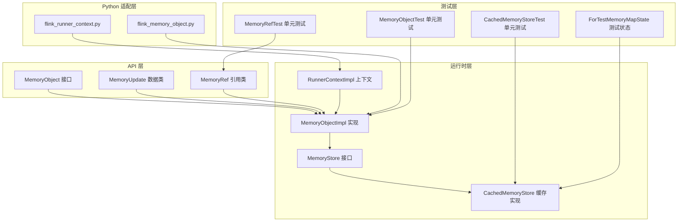
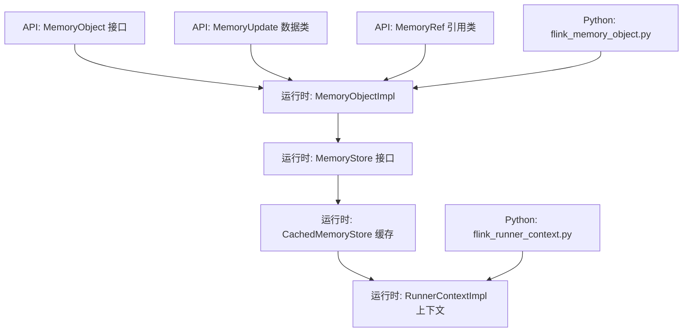
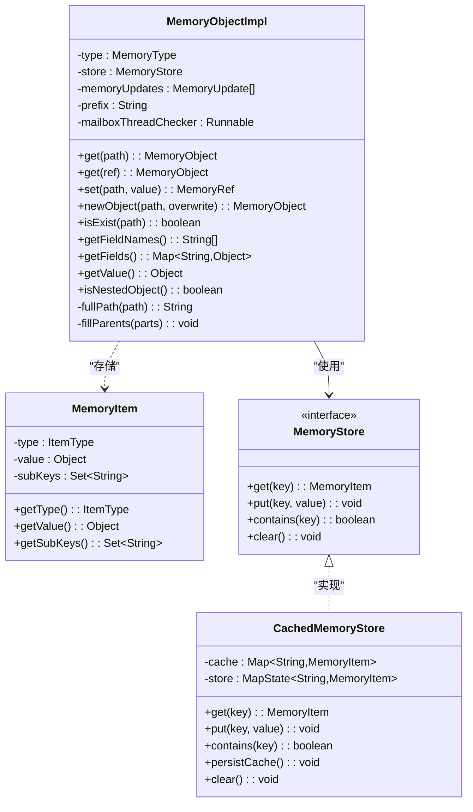
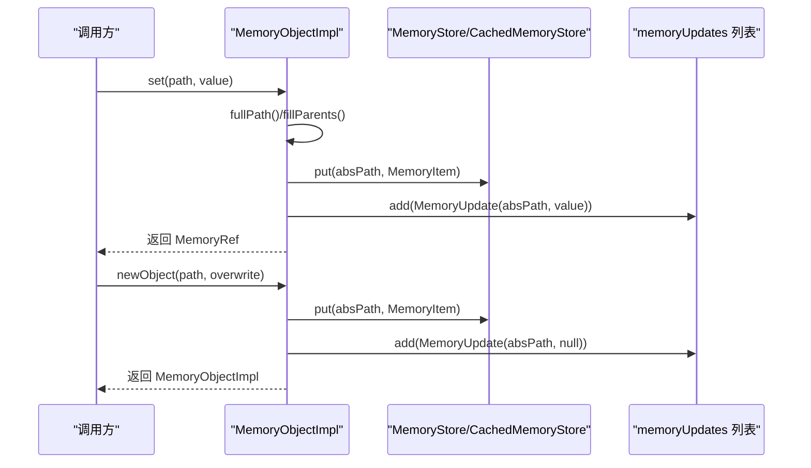
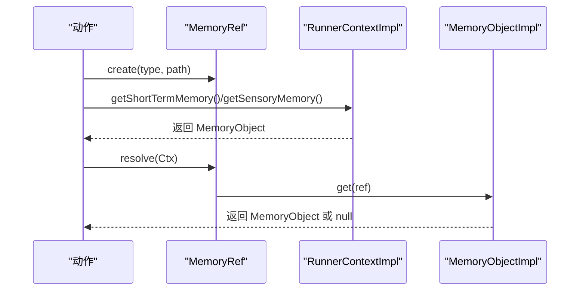
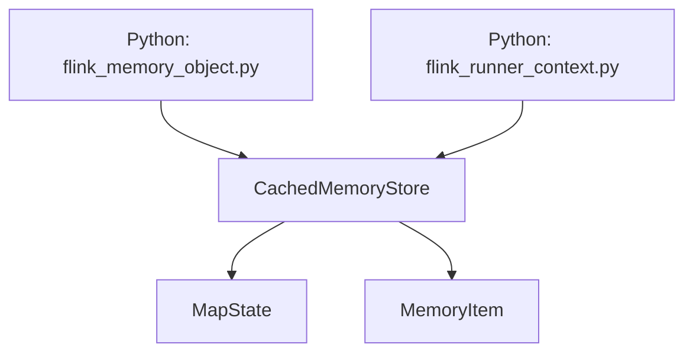
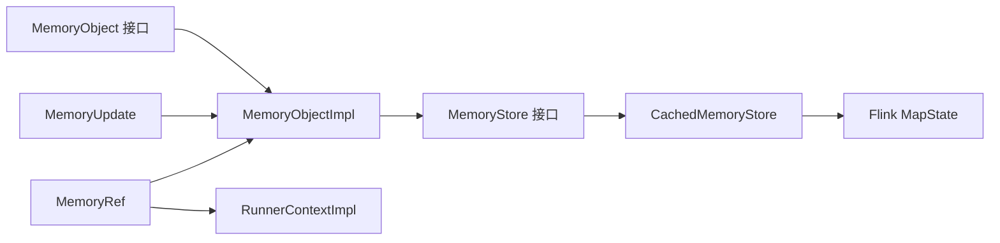

# 短期记忆管理

<cite>
**本文档引用的文件**
- [MemoryObject.java](file://api/src/main/java/org/apache/flink/agents/api/context/MemoryObject.java)
- [MemoryUpdate.java](file://api/src/main/java/org/apache/flink/agents/api/context/MemoryUpdate.java)
- [MemoryRef.java](file://api/src/main/java/org/apache/flink/agents/api/context/MemoryRef.java)
- [MemoryObjectImpl.java](file://runtime/src/main/java/org/apache/flink/agents/runtime/memory/MemoryObjectImpl.java)
- [MemoryStore.java](file://runtime/src/main/java/org/apache/flink/agents/runtime/memory/MemoryStore.java)
- [CachedMemoryStore.java](file://runtime/src/main/java/org/apache/flink/agents/runtime/memory/CachedMemoryStore.java)
- [RunnerContextImpl.java](file://runtime/src/main/java/org/apache/flink/agents/runtime/context/RunnerContextImpl.java)
- [MemoryObjectTest.java](file://runtime/src/test/java/org/apache/flink/agents/runtime/memory/MemoryObjectTest.java)
- [MemoryRefTest.java](file://runtime/src/test/java/org/apache/flink/agents/runtime/memory/MemoryRefTest.java)
- [CachedMemoryStoreTest.java](file://runtime/src/test/java/org/apache/flink/agents/runtime/memory/CachedMemoryStoreTest.java)
- [ForTestMemoryMapState.java](file://runtime/src/test/java/org/apache/flink/agents/runtime/memory/ForTestMemoryMapState.java)
- [flink_memory_object.py](file://python/flink_agents/runtime/flink_memory_object.py)
- [flink_runner_context.py](file://python/flink_agents/runtime/flink_runner_context.py)
</cite>

## 目录
1. [简介](#简介)
2. [项目结构](#项目结构)
3. [核心组件](#核心组件)
4. [架构总览](#架构总览)
5. [详细组件分析](#详细组件分析)
6. [依赖关系分析](#依赖关系分析)
7. [性能考量](#性能考量)
8. [故障排查指南](#故障排查指南)
9. [结论](#结论)
10. [附录](#附录)

## 简介
本技术文档围绕短期记忆管理系统展开，重点阐释 MemoryObjectImpl 的实现机制，涵盖内存对象的树形结构组织、路径解析与嵌套对象管理；详解 MemoryUpdate 的更新追踪机制，说明内存变更历史与增量更新的记录方式；介绍 MemoryRef 的引用管理，包括引用创建、验证与生命周期；梳理内存对象的 CRUD 操作（set、get、newObject）具体逻辑；明确 VALUE 与 OBJECT 两类类型的区分与转换规则；给出内存对象序列化与反序列化的实现细节及与 Flink 状态后端的集成方式；最后提供内存使用优化策略与性能调优建议。

## 项目结构
短期记忆管理相关代码主要分布在以下模块：
- API 层：定义对外接口与数据模型（MemoryObject、MemoryUpdate、MemoryRef）
- 运行时层：实现内存对象、存储与缓存、上下文桥接等核心逻辑
- 测试层：覆盖功能与边界条件，验证路径解析、引用管理、增量更新等行为
- Python 适配层：提供 Python 侧访问短期记忆的能力



**图表来源**
- [MemoryObject.java](file://api/src/main/java/org/apache/flink/agents/api/context/MemoryObject.java#L29-L131)
- [MemoryUpdate.java](file://api/src/main/java/org/apache/flink/agents/api/context/MemoryUpdate.java#L30-L83)
- [MemoryRef.java](file://api/src/main/java/org/apache/flink/agents/api/context/MemoryRef.java#L28-L87)
- [MemoryObjectImpl.java](file://runtime/src/main/java/org/apache/flink/agents/runtime/memory/MemoryObjectImpl.java#L33-L258)
- [MemoryStore.java](file://runtime/src/main/java/org/apache/flink/agents/runtime/memory/MemoryStore.java#L23-L51)
- [CachedMemoryStore.java](file://runtime/src/main/java/org/apache/flink/agents/runtime/memory/CachedMemoryStore.java#L25-L65)
- [RunnerContextImpl.java](file://runtime/src/main/java/org/apache/flink/agents/runtime/context/RunnerContextImpl.java#L86-L92)
- [MemoryObjectTest.java](file://runtime/src/test/java/org/apache/flink/agents/runtime/memory/MemoryObjectTest.java#L31-L186)
- [MemoryRefTest.java](file://runtime/src/test/java/org/apache/flink/agents/runtime/memory/MemoryRefTest.java#L135-L247)
- [CachedMemoryStoreTest.java](file://runtime/src/test/java/org/apache/flink/agents/runtime/memory/CachedMemoryStoreTest.java#L37-L90)
- [ForTestMemoryMapState.java](file://runtime/src/test/java/org/apache/flink/agents/runtime/memory/ForTestMemoryMapState.java#L27-L44)
- [flink_memory_object.py](file://python/flink_agents/runtime/flink_memory_object.py#L65-L96)
- [flink_runner_context.py](file://python/flink_agents/runtime/flink_runner_context.py#L279-L325)

**章节来源**
- [MemoryObject.java](file://api/src/main/java/org/apache/flink/agents/api/context/MemoryObject.java#L23-L131)
- [MemoryObjectImpl.java](file://runtime/src/main/java/org/apache/flink/agents/runtime/memory/MemoryObjectImpl.java#L33-L258)
- [MemoryStore.java](file://runtime/src/main/java/org/apache/flink/agents/runtime/memory/MemoryStore.java#L23-L51)
- [CachedMemoryStore.java](file://runtime/src/main/java/org/apache/flink/agents/runtime/memory/CachedMemoryStore.java#L25-L65)
- [RunnerContextImpl.java](file://runtime/src/main/java/org/apache/flink/agents/runtime/context/RunnerContextImpl.java#L86-L92)

## 核心组件
- MemoryObject 接口：定义短期记忆对象的统一抽象，支持 get、set、newObject、字段枚举、值访问、存在性检查等能力，并区分短期记忆与感知记忆类型。
- MemoryUpdate 数据类：表示一次内存变更的增量更新，包含绝对路径与新值，用于记录变更历史并支持序列化。
- MemoryRef 引用类：轻量级持久化指针，保存类型与绝对路径，通过 RunnerContext 解析到实际数据，便于在动作间传递大型对象。
- MemoryObjectImpl 实现：基于 MemoryStore 的树形内存结构，维护 OBJECT/VALUE 两类节点，负责路径解析、父节点填充、字段集合维护与增量更新记录。
- MemoryStore/CachedMemoryStore：抽象状态后端访问与缓存层，前者定义 get/put/contains/clear，后者以 HashMap 作为本地缓存，批量持久化至 MapState。
- RunnerContextImpl：提供短期/感知记忆存储实例，作为 Java 侧上下文入口。

**章节来源**
- [MemoryObject.java](file://api/src/main/java/org/apache/flink/agents/api/context/MemoryObject.java#L29-L131)
- [MemoryUpdate.java](file://api/src/main/java/org/apache/flink/agents/api/context/MemoryUpdate.java#L30-L83)
- [MemoryRef.java](file://api/src/main/java/org/apache/flink/agents/api/context/MemoryRef.java#L28-L87)
- [MemoryObjectImpl.java](file://runtime/src/main/java/org/apache/flink/agents/runtime/memory/MemoryObjectImpl.java#L33-L258)
- [MemoryStore.java](file://runtime/src/main/java/org/apache/flink/agents/runtime/memory/MemoryStore.java#L23-L51)
- [CachedMemoryStore.java](file://runtime/src/main/java/org/apache/flink/agents/runtime/memory/CachedMemoryStore.java#L25-L65)
- [RunnerContextImpl.java](file://runtime/src/main/java/org/apache/flink/agents/runtime/context/RunnerContextImpl.java#L86-L92)

## 架构总览
短期记忆系统采用“接口抽象 + 实现 + 存储桥接”的分层设计。API 层定义契约，运行时层实现具体逻辑并通过 CachedMemoryStore 与 Flink MapState 集成，Python 适配层通过 JNI/桥接访问 Java 实现。



**图表来源**
- [MemoryObject.java](file://api/src/main/java/org/apache/flink/agents/api/context/MemoryObject.java#L29-L131)
- [MemoryUpdate.java](file://api/src/main/java/org/apache/flink/agents/api/context/MemoryUpdate.java#L30-L83)
- [MemoryRef.java](file://api/src/main/java/org/apache/flink/agents/api/context/MemoryRef.java#L28-L87)
- [MemoryObjectImpl.java](file://runtime/src/main/java/org/apache/flink/agents/runtime/memory/MemoryObjectImpl.java#L33-L258)
- [MemoryStore.java](file://runtime/src/main/java/org/apache/flink/agents/runtime/memory/MemoryStore.java#L23-L51)
- [CachedMemoryStore.java](file://runtime/src/main/java/org/apache/flink/agents/runtime/memory/CachedMemoryStore.java#L25-L65)
- [RunnerContextImpl.java](file://runtime/src/main/java/org/apache/flink/agents/runtime/context/RunnerContextImpl.java#L86-L92)
- [flink_memory_object.py](file://python/flink_agents/runtime/flink_memory_object.py#L65-L96)
- [flink_runner_context.py](file://python/flink_agents/runtime/flink_runner_context.py#L279-L325)

## 详细组件分析

### MemoryObjectImpl：树形结构与路径解析
- 树形结构组织
  - 使用 MemoryItem 表示节点，包含类型（OBJECT/VALUE）、值与子键集合（subKeys），根节点默认存在且为空路径。
  - 通过前缀 prefix 与分隔符“.”组合形成绝对路径，支持相对路径解析。
- 路径解析与父节点填充
  - set/newObject 均会将相对路径拆分为段，逐级填充父节点，确保中间对象存在且维护父节点的 subKeys。
  - 父节点不存在时自动创建 OBJECT 节点；根节点始终存在。
- 嵌套对象管理
  - newObject 支持覆盖策略（overwrite），当目标已存在但非 OBJECT 类型时，按策略抛出异常或强制覆盖为 OBJECT。
  - get 返回新的 MemoryObjectImpl 实例，指向目标绝对路径，若不存在返回 null。
- 字段枚举与值访问
  - getFieldNames 返回当前对象的直接子键列表；getFields 返回键到“嵌套对象/原始值”的映射。
  - getValue 仅在当前节点为 VALUE 时返回值，否则返回 null；isNestedObject 判断当前是否为 OBJECT。
- 增量更新记录
  - set/newObject 成功后向 memoryUpdates 列表追加 MemoryUpdate，记录绝对路径与新值（对象创建时值为 null）。



**图表来源**
- [MemoryObjectImpl.java](file://runtime/src/main/java/org/apache/flink/agents/runtime/memory/MemoryObjectImpl.java#L33-L258)
- [MemoryStore.java](file://runtime/src/main/java/org/apache/flink/agents/runtime/memory/MemoryStore.java#L23-L51)
- [CachedMemoryStore.java](file://runtime/src/main/java/org/apache/flink/agents/runtime/memory/CachedMemoryStore.java#L25-L65)

**章节来源**
- [MemoryObjectImpl.java](file://runtime/src/main/java/org/apache/flink/agents/runtime/memory/MemoryObjectImpl.java#L73-L225)

### MemoryUpdate：更新追踪与历史记录
- 结构与语义
  - 记录绝对路径与新值，用于描述一次内存变更；对象创建时值为 null，体现“无值”的占位语义。
- 增量更新机制
  - set/newObject 成功后追加一条 MemoryUpdate，保证变更历史可追溯；测试用例验证了多层级对象创建与覆盖场景下的更新序列。
- 序列化支持
  - 通过 Jackson 注解标注，具备序列化/反序列化能力，便于跨进程或持久化传输。



**图表来源**
- [MemoryObjectImpl.java](file://runtime/src/main/java/org/apache/flink/agents/runtime/memory/MemoryObjectImpl.java#L88-L146)
- [MemoryUpdate.java](file://api/src/main/java/org/apache/flink/agents/api/context/MemoryUpdate.java#L30-L83)

**章节来源**
- [MemoryUpdate.java](file://api/src/main/java/org/apache/flink/agents/api/context/MemoryUpdate.java#L30-L83)
- [MemoryObjectTest.java](file://runtime/src/test/java/org/apache/flink/agents/runtime/memory/MemoryObjectTest.java#L169-L185)

### MemoryRef：引用管理与生命周期
- 引用创建与解析
  - create(type, path) 创建引用；resolve(ctx) 在 RunnerContext 中根据类型选择短期或感知记忆进行解析。
  - 支持相等性比较与哈希，便于集合去重与键控。
- 生命周期与验证
  - 引用本身不持有数据，仅携带路径；解析时通过上下文访问实际数据，若路径不存在则返回 null 或抛出异常。
  - 测试覆盖了引用创建、解析、嵌套对象引用与非存在引用的场景。



**图表来源**
- [MemoryRef.java](file://api/src/main/java/org/apache/flink/agents/api/context/MemoryRef.java#L28-L87)
- [RunnerContextImpl.java](file://runtime/src/main/java/org/apache/flink/agents/runtime/context/RunnerContextImpl.java#L86-L92)
- [MemoryObjectImpl.java](file://runtime/src/main/java/org/apache/flink/agents/runtime/memory/MemoryObjectImpl.java#L83-L86)

**章节来源**
- [MemoryRef.java](file://api/src/main/java/org/apache/flink/agents/api/context/MemoryRef.java#L28-L87)
- [MemoryRefTest.java](file://runtime/src/test/java/org/apache/flink/agents/runtime/memory/MemoryRefTest.java#L146-L247)

### CRUD 操作实现详解
- get(path/ref)
  - 将相对路径转为绝对路径，查询存储是否存在；存在则返回新的 MemoryObjectImpl 包装，否则返回 null。
- set(path, value)
  - 填充父节点，确保路径完整；若父键已存在且为 OBJECT，则禁止覆盖为 VALUE；写入新值并记录 MemoryUpdate。
- newObject(path, overwrite)
  - 若目标已存在且为 VALUE，按 overwrite 决定抛错或覆盖为 OBJECT；否则创建 OBJECT 节点；同时维护父节点 subKeys 并记录更新。
- isExist/getFieldNames/getFields/getValue/isNestedObject
  - 基于当前 prefix 对应的 MemoryItem 进行判断与读取，VALUE 仅能 getValue，OBJECT 可枚举字段与嵌套对象。

```mermaid
flowchart TD
Start(["进入 set(path, value)"]) --> Abs["计算绝对路径<br/>fillParents()"]
Abs --> ParentCheck{"父键存在？"}
ParentCheck --> |否| CreateParent["创建父 OBJECT 节点"]
ParentCheck --> |是| Next1["继续"]
CreateParent --> Next1
Next1 --> OverwriteCheck{"目标已存在？"}
OverwriteCheck --> |是| TypeCheck{"类型为 OBJECT？"}
TypeCheck --> |是| Err["抛出异常：不能用值覆盖对象"]
TypeCheck --> |否|| overwrite? |
overwrite --> |否| Err
overwrite --> |是| PutVal["写入新值并记录更新"]
OverwriteCheck --> |否| PutVal
PutVal --> Done(["返回 MemoryRef"])
Err --> Done
```

**图表来源**
- [MemoryObjectImpl.java](file://runtime/src/main/java/org/apache/flink/agents/runtime/memory/MemoryObjectImpl.java#L88-L113)

**章节来源**
- [MemoryObjectImpl.java](file://runtime/src/main/java/org/apache/flink/agents/runtime/memory/MemoryObjectImpl.java#L73-L225)

### 类型系统：VALUE 与 OBJECT 的区分与转换
- 节点类型
  - OBJECT：表示嵌套对象，无直接值，维护子键集合；VALUE：存储原始值，无子键。
- 转换规则
  - set 仅允许将 VALUE 节点写入原始值；若目标为 OBJECT 节点，必须先 newObject 创建后再写入。
  - newObject 可将 VALUE 节点覆盖为 OBJECT，或在不存在时创建 OBJECT。
- 查询语义
  - isNestedObject 仅对 OBJECT 返回 true；getValue 仅对 VALUE 返回值，否则返回 null。

**章节来源**
- [MemoryObjectImpl.java](file://runtime/src/main/java/org/apache/flink/agents/runtime/memory/MemoryObjectImpl.java#L227-L258)

### 序列化与反序列化、与 Flink 状态后端集成
- 序列化
  - MemoryUpdate 通过 Jackson 注解支持序列化/反序列化；MemoryRef 为可序列化类，便于跨语言/跨进程传递。
- 状态后端集成
  - CachedMemoryStore 以 MapState 作为底层持久化存储，内部维护 HashMap 作为缓存；persistCache() 将缓存批量写回 MapState。
  - ForTestMemoryMapState 提供测试用 MapState 实现，验证缓存命中、持久化与 contains 行为。
- Python 适配
  - flink_memory_object.py 将 Java 侧 MemoryObject 能力暴露给 Python，封装 set/newObject/isExist 等操作并返回 MemoryRef。
  - flink_runner_context.py 提供 Python 侧 RunnerContext，获取短期记忆对象。



**图表来源**
- [CachedMemoryStore.java](file://runtime/src/main/java/org/apache/flink/agents/runtime/memory/CachedMemoryStore.java#L25-L65)
- [ForTestMemoryMapState.java](file://runtime/src/test/java/org/apache/flink/agents/runtime/memory/ForTestMemoryMapState.java#L27-L44)
- [flink_memory_object.py](file://python/flink_agents/runtime/flink_memory_object.py#L65-L96)
- [flink_runner_context.py](file://python/flink_agents/runtime/flink_runner_context.py#L279-L325)

**章节来源**
- [MemoryUpdate.java](file://api/src/main/java/org/apache/flink/agents/api/context/MemoryUpdate.java#L28-L30)
- [MemoryRef.java](file://api/src/main/java/org/apache/flink/agents/api/context/MemoryRef.java#L28-L37)
- [CachedMemoryStore.java](file://runtime/src/main/java/org/apache/flink/agents/runtime/memory/CachedMemoryStore.java#L25-L65)
- [ForTestMemoryMapState.java](file://runtime/src/test/java/org/apache/flink/agents/runtime/memory/ForTestMemoryMapState.java#L27-L44)
- [flink_memory_object.py](file://python/flink_agents/runtime/flink_memory_object.py#L65-L96)
- [flink_runner_context.py](file://python/flink_agents/runtime/flink_runner_context.py#L279-L325)

## 依赖关系分析
- 组件耦合
  - MemoryObjectImpl 依赖 MemoryStore 接口，通过 CachedMemoryStore 实现与 Flink MapState 的解耦。
  - MemoryRef 依赖 RunnerContext 获取对应类型的记忆对象，实现引用到实际数据的延迟解析。
- 外部依赖
  - Flink MapState 作为状态后端；Jackson 用于 MemoryUpdate 的序列化。
- 潜在循环依赖
  - 当前结构清晰，未发现循环依赖；RunnerContext 仅提供存储实例，不反向依赖 MemoryObjectImpl。



**图表来源**
- [MemoryObject.java](file://api/src/main/java/org/apache/flink/agents/api/context/MemoryObject.java#L29-L131)
- [MemoryUpdate.java](file://api/src/main/java/org/apache/flink/agents/api/context/MemoryUpdate.java#L30-L83)
- [MemoryRef.java](file://api/src/main/java/org/apache/flink/agents/api/context/MemoryRef.java#L28-L87)
- [MemoryObjectImpl.java](file://runtime/src/main/java/org/apache/flink/agents/runtime/memory/MemoryObjectImpl.java#L33-L258)
- [MemoryStore.java](file://runtime/src/main/java/org/apache/flink/agents/runtime/memory/MemoryStore.java#L23-L51)
- [CachedMemoryStore.java](file://runtime/src/main/java/org/apache/flink/agents/runtime/memory/CachedMemoryStore.java#L25-L65)
- [RunnerContextImpl.java](file://runtime/src/main/java/org/apache/flink/agents/runtime/context/RunnerContextImpl.java#L86-L92)

**章节来源**
- [MemoryObjectImpl.java](file://runtime/src/main/java/org/apache/flink/agents/runtime/memory/MemoryObjectImpl.java#L33-L258)
- [CachedMemoryStore.java](file://runtime/src/main/java/org/apache/flink/agents/runtime/memory/CachedMemoryStore.java#L25-L65)
- [RunnerContextImpl.java](file://runtime/src/main/java/org/apache/flink/agents/runtime/context/RunnerContextImpl.java#L86-L92)

## 性能考量
- 缓存策略
  - CachedMemoryStore 使用 HashMap 作为本地缓存，减少频繁 MapState 访问；通过 persistCache() 批量写回，降低状态后端压力。
- 路径解析与父节点填充
  - set/newObject 会逐级填充父节点，避免重复创建；注意深层嵌套可能带来多次写入，建议合理规划路径层级。
- 增量更新
  - MemoryUpdate 仅记录变更，避免全量快照；但在高频写入场景下仍需关注更新列表增长。
- 线程与邮箱检查
  - 每次操作执行 mailboxThreadChecker.run()，确保在正确线程上下文中执行；在高并发动作中需关注该检查的开销。
- 建议
  - 合理使用 newObject 预分配结构，减少后续 set 的覆盖成本；
  - 在批处理场景合并多次 set/newObject 后再触发持久化；
  - 控制路径深度，避免过深嵌套导致的父链构建成本过高。

[本节为通用性能建议，无需特定文件引用]

## 故障排查指南
- set 抛出“不能用值覆盖对象”异常
  - 症状：对 OBJECT 节点直接 set 原始值。
  - 处理：先 newObject 创建对象，再 set 值；或在 newObject 时启用覆盖。
- newObject 抛出“字段已存在但不是对象”
  - 症状：对 VALUE 节点再次 newObject 且 overwrite=false。
  - 处理：设置 overwrite=true 或删除原值后再创建对象。
- get 返回 null
  - 症状：引用或路径不存在。
  - 处理：确认路径拼接与类型；使用 isExist 检查存在性。
- 引用解析失败
  - 症状：resolve 时类型不匹配或上下文未初始化。
  - 处理：确认 MemoryRef 的类型与 RunnerContext 的记忆实例一致。
- 缓存未持久化
  - 症状：任务重启后数据丢失。
  - 处理：确保在合适时机调用 CachedMemoryStore.persistCache() 或通过框架生命周期完成持久化。

**章节来源**
- [MemoryObjectImpl.java](file://runtime/src/main/java/org/apache/flink/agents/runtime/memory/MemoryObjectImpl.java#L104-L106)
- [MemoryObjectImpl.java](file://runtime/src/main/java/org/apache/flink/agents/runtime/memory/MemoryObjectImpl.java#L125-L131)
- [MemoryRefTest.java](file://runtime/src/test/java/org/apache/flink/agents/runtime/memory/MemoryRefTest.java#L224-L228)
- [CachedMemoryStoreTest.java](file://runtime/src/test/java/org/apache/flink/agents/runtime/memory/CachedMemoryStoreTest.java#L74-L90)

## 结论
短期记忆管理系统通过 MemoryObjectImpl 的树形结构与路径解析、MemoryUpdate 的增量追踪、MemoryRef 的引用管理，实现了对复杂嵌套数据的高效访问与持久化。结合 CachedMemoryStore 与 Flink MapState 的集成，系统在保证一致性的同时兼顾性能。遵循本文的类型规则、操作流程与优化建议，可在复杂动作流中稳定地管理短期记忆。

[本节为总结性内容，无需特定文件引用]

## 附录
- 关键 API 速览
  - get(path/ref)：获取子对象或值容器
  - set(path, value)：写入原始值并记录更新
  - newObject(path, overwrite)：创建/覆盖嵌套对象
  - isExist/getFieldNames/getFields/getValue/isNestedObject：查询与枚举
- 测试参考
  - MemoryObjectTest：覆盖基本 CRUD、深层嵌套与增量更新
  - MemoryRefTest：覆盖引用创建、解析与嵌套对象引用
  - CachedMemoryStoreTest：覆盖缓存命中、持久化与 contains

**章节来源**
- [MemoryObjectTest.java](file://runtime/src/test/java/org/apache/flink/agents/runtime/memory/MemoryObjectTest.java#L72-L186)
- [MemoryRefTest.java](file://runtime/src/test/java/org/apache/flink/agents/runtime/memory/MemoryRefTest.java#L146-L247)
- [CachedMemoryStoreTest.java](file://runtime/src/test/java/org/apache/flink/agents/runtime/memory/CachedMemoryStoreTest.java#L37-L90)