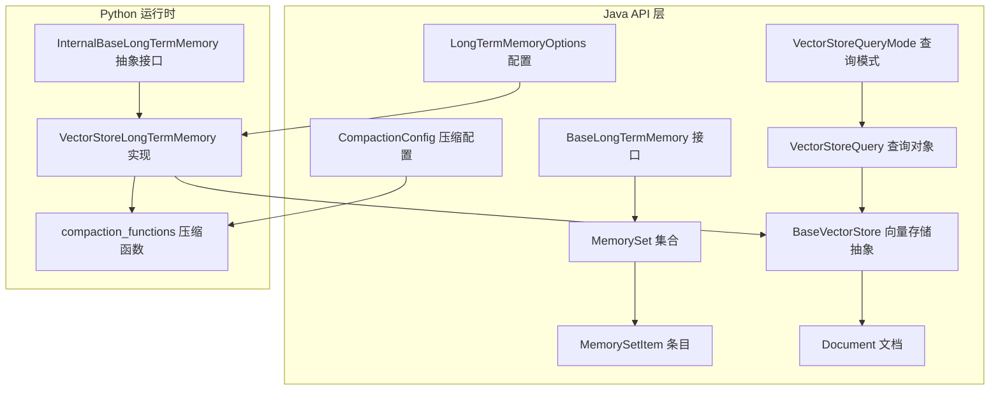
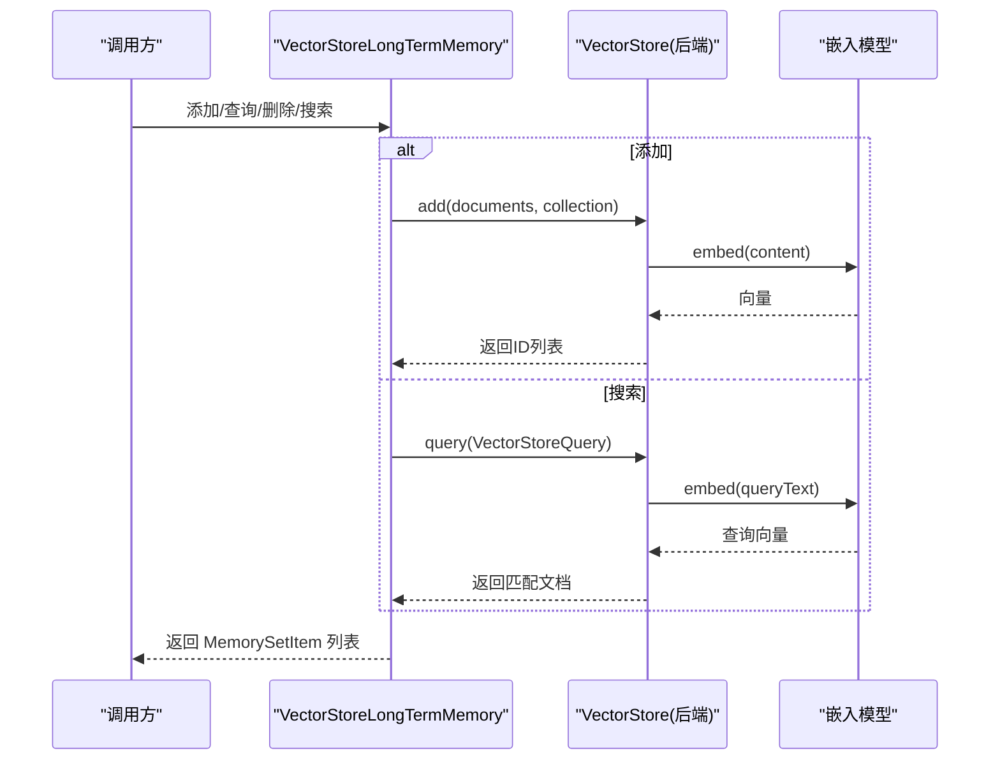
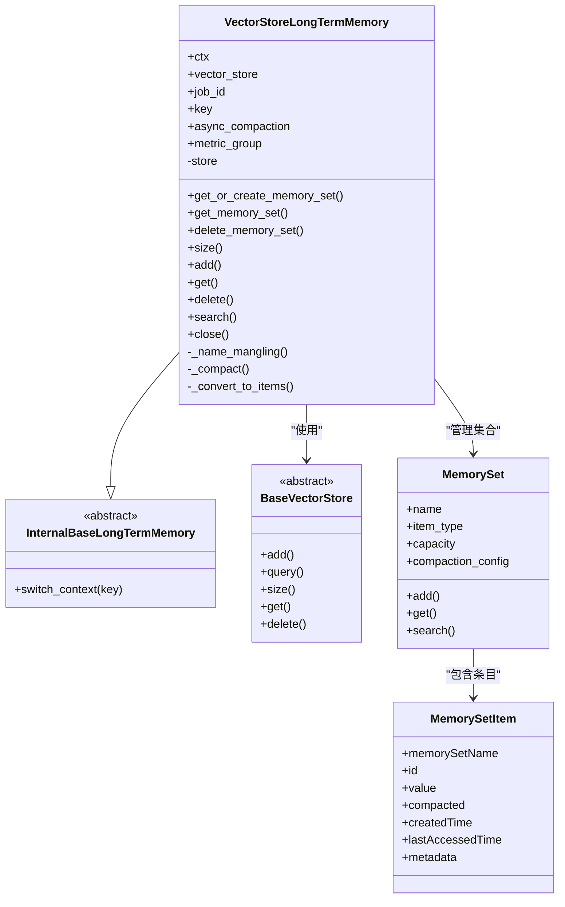
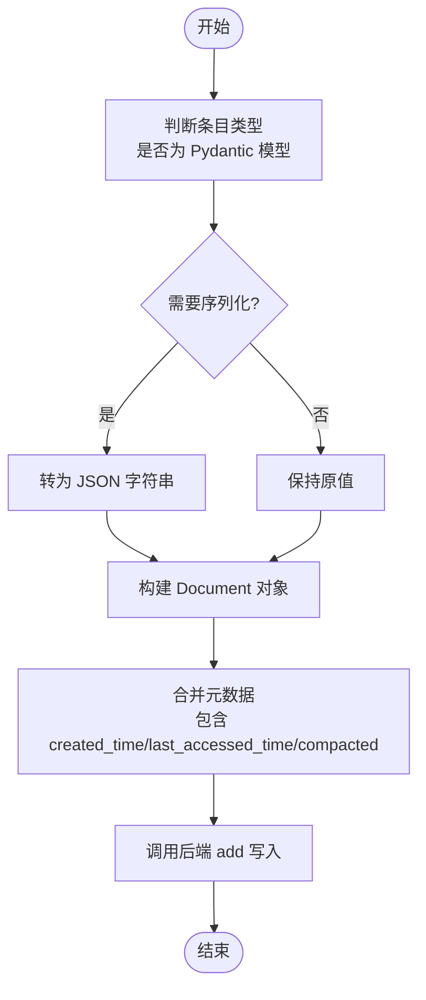
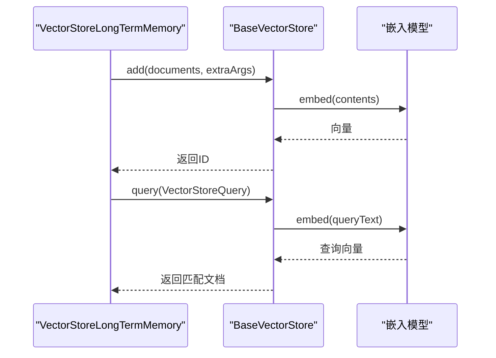
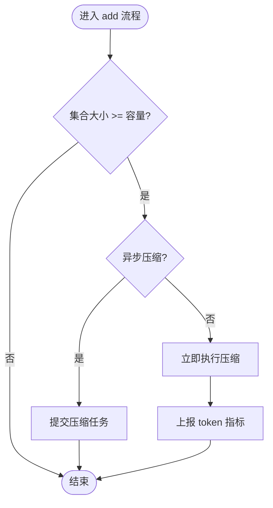
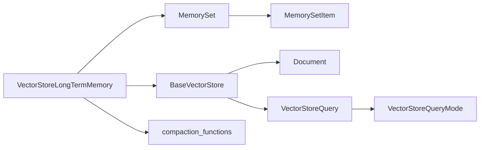

# 长期记忆系统

<cite>
**本文引用的文件**
- [BaseLongTermMemory.java](file://api/src/main/java/org/apache/flink/agents/api/memory/BaseLongTermMemory.java)
- [MemorySet.java](file://api/src/main/java/org/apache/flink/agents/api/memory/MemorySet.java)
- [MemorySetItem.java](file://api/src/main/java/org/apache/flink/agents/api/memory/MemorySetItem.java)
- [LongTermMemoryOptions.java](file://api/src/main/java/org/apache/flink/agents/api/memory/LongTermMemoryOptions.java)
- [CompactionConfig.java](file://api/src/main/java/org/apache/flink/agents/api/memory/compaction/CompactionConfig.java)
- [BaseVectorStore.java](file://api/src/main/java/org/apache/flink/agents/api/vectorstores/BaseVectorStore.java)
- [Document.java](file://api/src/main/java/org/apache/flink/agents/api/vectorstores/Document.java)
- [VectorStoreQuery.java](file://api/src/main/java/org/apache/flink/agents/api/vectorstores/VectorStoreQuery.java)
- [VectorStoreQueryMode.java](file://api/src/main/java/org/apache/flink/agents/api/vectorstores/VectorStoreQueryMode.java)
- [internal_base_long_term_memory.py](file://python/flink_agents/runtime/memory/internal_base_long_term_memory.py)
- [vector_store_long_term_memory.py](file://python/flink_agents/runtime/memory/vector_store_long_term_memory.py)
- [compaction_functions.py](file://python/flink_agents/runtime/memory/compaction_functions.py)
- [VectorStoreLongTermMemoryTest.java](file://e2e-test/flink-agents-end-to-end-tests-integration/src/test/java/org/apache/flink/agents/integration/test/VectorStoreLongTermMemoryTest.java)
- [test_vector_store_long_term_memory.py](file://python/flink_agents/runtime/memory/tests/test_vector_store_long_term_memory.py)
</cite>

## 目录
1. [简介](#简介)
2. [项目结构](#项目结构)
3. [核心组件](#核心组件)
4. [架构总览](#架构总览)
5. [详细组件分析](#详细组件分析)
6. [依赖关系分析](#依赖关系分析)
7. [性能考虑](#性能考虑)
8. [故障排查指南](#故障排查指南)
9. [结论](#结论)
10. [附录](#附录)

## 简介
本技术文档围绕长期记忆系统展开，重点覆盖以下方面：
- VectorStoreLongTermMemory 的向量存储实现：嵌入向量的生成、存储、检索与相似度计算机制
- InteranlBaseLongTermMemory 的基础架构设计：长期记忆生命周期管理与状态持久化策略
- MemorySet 与 MemorySetItem 的集合管理：批量操作、查询优化与元数据管理
- 长期记忆与向量存储的集成：嵌入模型调用、向量索引维护与检索流程
- 检索算法：语义搜索与精确匹配的组合策略
- 配置与性能调优：向量维度、索引类型、查询参数优化建议
- 故障恢复与数据迁移最佳实践

## 项目结构
长期记忆系统由 Java API 接口层与 Python 运行时实现组成，向量存储能力通过可插拔的 VectorStore 抽象接入。

**图表来源**
- [BaseLongTermMemory.java](file://api/src/main/java/org/apache/flink/agents/api/memory/BaseLongTermMemory.java#L33-L134)
- [MemorySet.java](file://api/src/main/java/org/apache/flink/agents/api/memory/MemorySet.java#L32-L160)
- [MemorySetItem.java](file://api/src/main/java/org/apache/flink/agents/api/memory/MemorySetItem.java#L23-L95)
- [LongTermMemoryOptions.java](file://api/src/main/java/org/apache/flink/agents/api/memory/LongTermMemoryOptions.java#L22-L53)
- [CompactionConfig.java](file://api/src/main/java/org/apache/flink/agents/api/memory/compaction/CompactionConfig.java#L29-L93)
- [BaseVectorStore.java](file://api/src/main/java/org/apache/flink/agents/api/vectorstores/BaseVectorStore.java#L38-L174)
- [Document.java](file://api/src/main/java/org/apache/flink/agents/api/vectorstores/Document.java#L34-L111)
- [VectorStoreQuery.java](file://api/src/main/java/org/apache/flink/agents/api/vectorstores/VectorStoreQuery.java#L33-L110)
- [VectorStoreQueryMode.java](file://api/src/main/java/org/apache/flink/agents/api/vectorstores/VectorStoreQueryMode.java#L28-L62)
- [internal_base_long_term_memory.py](file://python/flink_agents/runtime/memory/internal_base_long_term_memory.py#L23-L37)
- [vector_store_long_term_memory.py](file://python/flink_agents/runtime/memory/vector_store_long_term_memory.py#L52-L329)
- [compaction_functions.py](file://python/flink_agents/runtime/memory/compaction_functions.py#L62-L186)

**章节来源**
- [BaseLongTermMemory.java](file://api/src/main/java/org/apache/flink/agents/api/memory/BaseLongTermMemory.java#L27-L134)
- [BaseVectorStore.java](file://api/src/main/java/org/apache/flink/agents/api/vectorstores/BaseVectorStore.java#L38-L174)
- [vector_store_long_term_memory.py](file://python/flink_agents/runtime/memory/vector_store_long_term_memory.py#L52-L329)

## 核心组件
- BaseLongTermMemory：定义长期记忆的核心操作（创建/获取/删除集合、添加/查询/删除条目、语义检索）
- MemorySet：集合容器，封装名称、条目类型、容量与压缩配置，并委托 BaseLongTermMemory 执行操作
- MemorySetItem：条目实体，包含值、元数据、创建时间、最后访问时间、是否被压缩等字段
- LongTermMemoryOptions：长期记忆后端与异步压缩等配置项
- CompactionConfig：压缩配置，包含模型、提示词与限制条数
- BaseVectorStore：向量存储抽象，负责嵌入生成与查询执行
- Document/VectorStoreQuery/VectorStoreQueryMode：向量存储的数据模型与查询参数

**章节来源**
- [BaseLongTermMemory.java](file://api/src/main/java/org/apache/flink/agents/api/memory/BaseLongTermMemory.java#L33-L134)
- [MemorySet.java](file://api/src/main/java/org/apache/flink/agents/api/memory/MemorySet.java#L32-L160)
- [MemorySetItem.java](file://api/src/main/java/org/apache/flink/agents/api/memory/MemorySetItem.java#L23-L95)
- [LongTermMemoryOptions.java](file://api/src/main/java/org/apache/flink/agents/api/memory/LongTermMemoryOptions.java#L22-L53)
- [CompactionConfig.java](file://api/src/main/java/org/apache/flink/agents/api/memory/compaction/CompactionConfig.java#L29-L93)
- [BaseVectorStore.java](file://api/src/main/java/org/apache/flink/agents/api/vectorstores/BaseVectorStore.java#L38-L174)
- [Document.java](file://api/src/main/java/org/apache/flink/agents/api/vectorstores/Document.java#L34-L111)
- [VectorStoreQuery.java](file://api/src/main/java/org/apache/flink/agents/api/vectorstores/VectorStoreQuery.java#L33-L110)
- [VectorStoreQueryMode.java](file://api/src/main/java/org/apache/flink/agents/api/vectorstores/VectorStoreQueryMode.java#L28-L62)

## 架构总览
长期记忆以 VectorStoreLongTermMemory 为核心实现，基于 CollectionManageableVectorStore 的集合管理能力，结合嵌入模型完成语义检索；同时通过压缩函数对超限集合进行主题提取与归档，维持容量与成本平衡。

**图表来源**
- [vector_store_long_term_memory.py](file://python/flink_agents/runtime/memory/vector_store_long_term_memory.py#L157-L248)
- [BaseVectorStore.java](file://api/src/main/java/org/apache/flink/agents/api/vectorstores/BaseVectorStore.java#L71-L112)
- [VectorStoreQuery.java](file://api/src/main/java/org/apache/flink/agents/api/vectorstores/VectorStoreQuery.java#L33-L110)

## 详细组件分析

### VectorStoreLongTermMemory（向量存储驱动的长期记忆）
- 角色与职责
  - 基于 RunnerContext 获取资源（向量存储、聊天/嵌入模型、指标组）
  - 将 MemorySet 映射到后端集合，集合元信息中保存 MemorySet 定义
  - 在容量达到阈值时触发压缩流程（同步或异步）
  - 提供 add/get/delete/search 等统一入口
- 关键流程
  - 添加：序列化条目内容、写入元数据、调用后端 add、必要时提交压缩任务
  - 检索：构造 VectorStoreQuery，调用后端 query，转换为 MemorySetItem
  - 压缩：调用压缩函数生成摘要，删除原始条目，写入压缩后的条目
- 上下文隔离
  - 支持 switch_context 切换 key，通过命名混淆确保不同键空间隔离

**图表来源**
- [vector_store_long_term_memory.py](file://python/flink_agents/runtime/memory/vector_store_long_term_memory.py#L52-L329)
- [internal_base_long_term_memory.py](file://python/flink_agents/runtime/memory/internal_base_long_term_memory.py#L23-L37)
- [BaseVectorStore.java](file://api/src/main/java/org/apache/flink/agents/api/vectorstores/BaseVectorStore.java#L38-L174)
- [MemorySet.java](file://api/src/main/java/org/apache/flink/agents/api/memory/MemorySet.java#L32-L160)
- [MemorySetItem.java](file://api/src/main/java/org/apache/flink/agents/api/memory/MemorySetItem.java#L23-L95)

**章节来源**
- [vector_store_long_term_memory.py](file://python/flink_agents/runtime/memory/vector_store_long_term_memory.py#L83-L329)
- [internal_base_long_term_memory.py](file://python/flink_agents/runtime/memory/internal_base_long_term_memory.py#L23-L37)

### InteranlBaseLongTermMemory（内部基础接口）
- 设计目的：在用户接口之上提供内部扩展点，隐藏上下文切换等细节
- 关键方法：switch_context，用于按 key 隔离数据

**章节来源**
- [internal_base_long_term_memory.py](file://python/flink_agents/runtime/memory/internal_base_long_term_memory.py#L23-L37)

### MemorySet 与 MemorySetItem（集合与条目）
- MemorySet
  - 负责集合元信息与容量控制
  - 将 add/get/search 等操作委托给底层 BaseLongTermMemory
- MemorySetItem
  - 包含值、元数据、创建/访问时间、是否压缩标记
  - 支持压缩区间时间范围表示

**图表来源**
- [vector_store_long_term_memory.py](file://python/flink_agents/runtime/memory/vector_store_long_term_memory.py#L157-L221)
- [MemorySetItem.java](file://api/src/main/java/org/apache/flink/agents/api/memory/MemorySetItem.java#L23-L95)

**章节来源**
- [MemorySet.java](file://api/src/main/java/org/apache/flink/agents/api/memory/MemorySet.java#L32-L160)
- [MemorySetItem.java](file://api/src/main/java/org/apache/flink/agents/api/memory/MemorySetItem.java#L23-L95)

### 嵌入与检索（语义搜索）
- 嵌入生成
  - BaseVectorStore 在 add/query 时自动从资源描述中解析 embedding_model，并调用嵌入模型生成向量
- 相似度计算
  - 采用向量空间相似度（如余弦距离）进行检索
- 查询模式
  - 默认 SEMANTIC 模式，后续可扩展 KEYWORD/HYBRID

**图表来源**
- [BaseVectorStore.java](file://api/src/main/java/org/apache/flink/agents/api/vectorstores/BaseVectorStore.java#L71-L112)
- [VectorStoreQuery.java](file://api/src/main/java/org/apache/flink/agents/api/vectorstores/VectorStoreQuery.java#L33-L110)

**章节来源**
- [BaseVectorStore.java](file://api/src/main/java/org/apache/flink/agents/api/vectorstores/BaseVectorStore.java#L38-L174)
- [VectorStoreQueryMode.java](file://api/src/main/java/org/apache/flink/agents/api/vectorstores/VectorStoreQueryMode.java#L28-L62)

### 压缩与生命周期管理
- 触发条件：当集合大小达到 capacity 时
- 压缩策略：调用压缩函数，按主题抽取与摘要生成，删除原始条目，写入压缩条目
- 异步执行：可通过配置开启异步压缩，失败回调记录异常
- 元数据保留：压缩条目使用 created_time_start/end 表示时间区间

**图表来源**
- [vector_store_long_term_memory.py](file://python/flink_agents/runtime/memory/vector_store_long_term_memory.py#L201-L221)
- [compaction_functions.py](file://python/flink_agents/runtime/memory/compaction_functions.py#L62-L136)

**章节来源**
- [LongTermMemoryOptions.java](file://api/src/main/java/org/apache/flink/agents/api/memory/LongTermMemoryOptions.java#L37-L52)
- [compaction_functions.py](file://python/flink_agents/runtime/memory/compaction_functions.py#L62-L186)

## 依赖关系分析
- VectorStoreLongTermMemory 依赖 RunnerContext 获取资源（向量存储、聊天/嵌入模型），并通过 CollectionManageableVectorStore 的集合管理能力实现 MemorySet 的持久化
- BaseVectorStore 统一封装嵌入模型调用与查询执行，屏蔽具体后端差异
- MemorySet 作为门面，将操作委托给 BaseLongTermMemory，实现集合级别的容量与压缩控制

**图表来源**
- [vector_store_long_term_memory.py](file://python/flink_agents/runtime/memory/vector_store_long_term_memory.py#L52-L329)
- [BaseVectorStore.java](file://api/src/main/java/org/apache/flink/agents/api/vectorstores/BaseVectorStore.java#L38-L174)
- [MemorySet.java](file://api/src/main/java/org/apache/flink/agents/api/memory/MemorySet.java#L32-L160)
- [MemorySetItem.java](file://api/src/main/java/org/apache/flink/agents/api/memory/MemorySetItem.java#L23-L95)
- [Document.java](file://api/src/main/java/org/apache/flink/agents/api/vectorstores/Document.java#L34-L111)
- [VectorStoreQuery.java](file://api/src/main/java/org/apache/flink/agents/api/vectorstores/VectorStoreQuery.java#L33-L110)
- [VectorStoreQueryMode.java](file://api/src/main/java/org/apache/flink/agents/api/vectorstores/VectorStoreQueryMode.java#L28-L62)

**章节来源**
- [BaseLongTermMemory.java](file://api/src/main/java/org/apache/flink/agents/api/memory/BaseLongTermMemory.java#L33-L134)
- [BaseVectorStore.java](file://api/src/main/java/org/apache/flink/agents/api/vectorstores/BaseVectorStore.java#L38-L174)

## 性能考虑
- 向量维度与索引
  - 选择与嵌入模型一致的维度，避免额外降维开销
  - 后端支持的索引类型需与查询模式匹配（当前默认 SEMANTIC）
- 查询参数
  - limit 控制返回数量，避免过度扫描
  - extraArgs 可传递后端特定过滤/排序参数
- 压缩策略
  - 合理设置 capacity 与 compaction.limit，减少压缩频率
  - 异步压缩提升吞吐，但需关注失败处理与重试
- 序列化与元数据
  - 大对象建议序列化为紧凑格式，减少存储与传输开销
  - 元数据尽量精简，仅保留检索与统计所需字段

[本节为通用指导，无需列出具体文件来源]

## 故障排查指南
- 压缩失败
  - 现象：异步压缩任务抛出异常
  - 处理：检查压缩函数日志，确认 LLM 资源可用性与提示词配置
- 嵌入生成异常
  - 现象：add/query 时嵌入模型调用失败
  - 处理：验证嵌入模型连接参数与网络可达性
- 检索结果为空
  - 现象：search 返回空列表
  - 处理：确认集合已创建且有数据；检查查询文本是否过短或无语义信息
- 数据不一致
  - 现象：get 与 search 结果不一致
  - 处理：核对集合命名混淆规则与 key 切换逻辑

**章节来源**
- [vector_store_long_term_memory.py](file://python/flink_agents/runtime/memory/vector_store_long_term_memory.py#L286-L294)
- [BaseVectorStore.java](file://api/src/main/java/org/apache/flink/agents/api/vectorstores/BaseVectorStore.java#L71-L112)
- [VectorStoreLongTermMemoryTest.java](file://e2e-test/flink-agents-end-to-end-tests-integration/src/test/java/org/apache/flink/agents/integration/test/VectorStoreLongTermMemoryTest.java#L194-L254)

## 结论
长期记忆系统通过 VectorStoreLongTermMemory 将集合管理、嵌入检索与压缩策略有机结合，既保证了检索的语义质量，又通过压缩控制存储规模与成本。配合可插拔的向量存储与嵌入模型，系统具备良好的扩展性与工程落地能力。

[本节为总结性内容，无需列出具体文件来源]

## 附录

### 配置项与含义
- 后端类型：选择外部向量存储作为长期记忆后端
- 向量存储名称：指定使用的向量存储资源名
- 异步压缩：是否启用异步压缩
- 线程数：异步压缩线程池大小

**章节来源**
- [LongTermMemoryOptions.java](file://api/src/main/java/org/apache/flink/agents/api/memory/LongTermMemoryOptions.java#L22-L53)

### 使用示例（路径参考）
- Java 端测试用例展示了如何创建 MemorySet、添加消息、执行搜索与压缩
- Python 端测试用例展示了本地 ChromaDB 后端的完整流程

**章节来源**
- [VectorStoreLongTermMemoryTest.java](file://e2e-test/flink-agents-end-to-end-tests-integration/src/test/java/org/apache/flink/agents/integration/test/VectorStoreLongTermMemoryTest.java#L150-L331)
- [test_vector_store_long_term_memory.py](file://python/flink_agents/runtime/memory/tests/test_vector_store_long_term_memory.py#L133-L260)