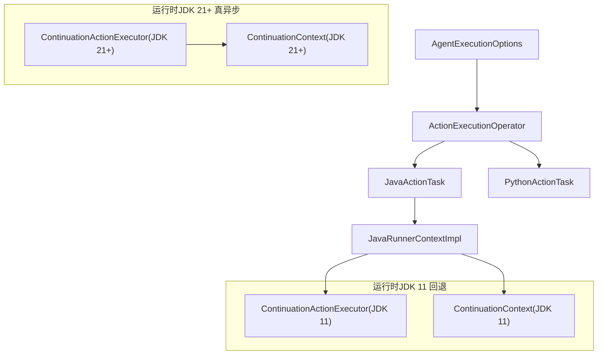
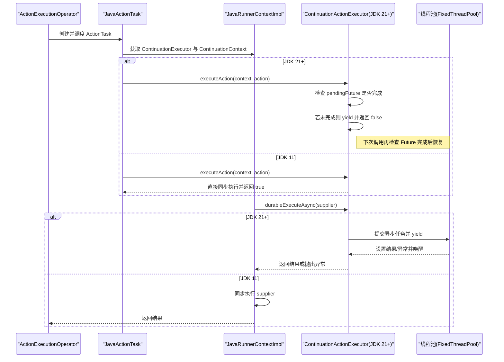
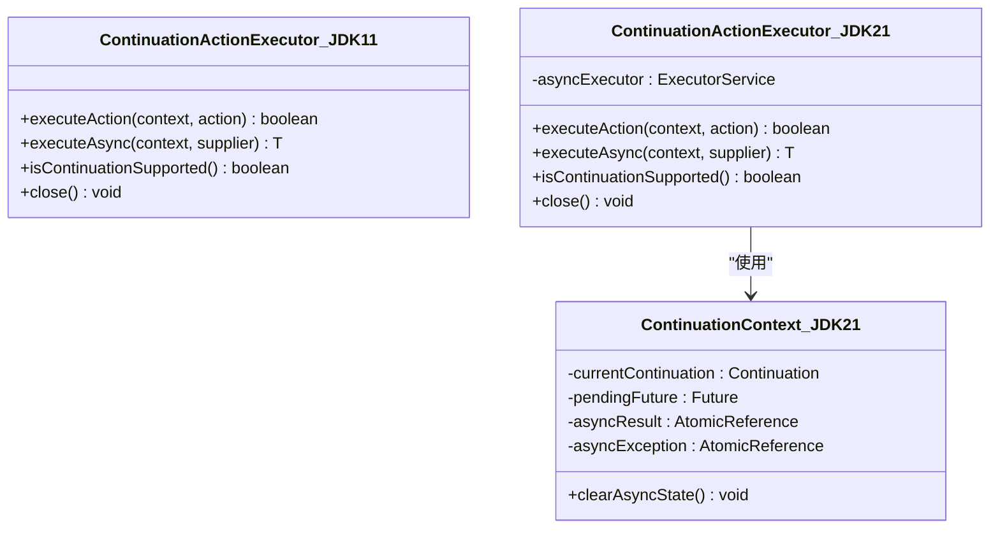
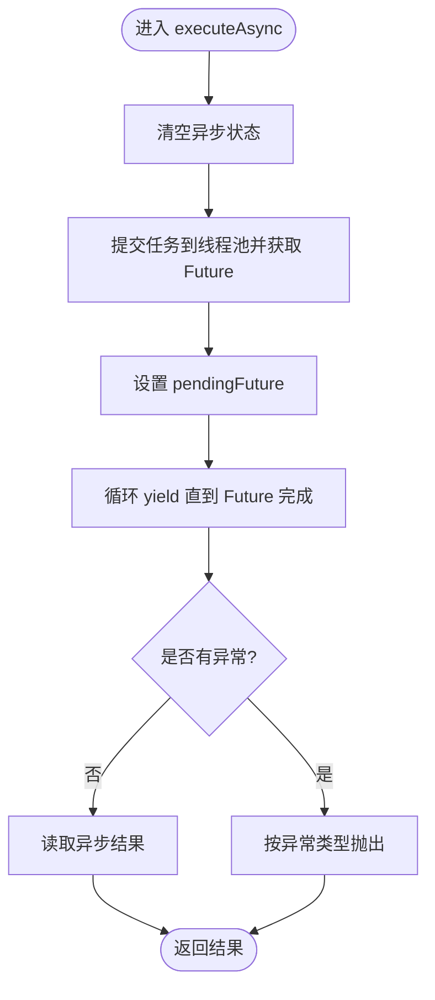
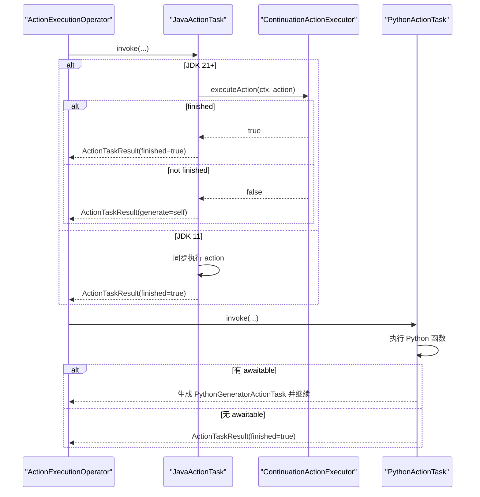
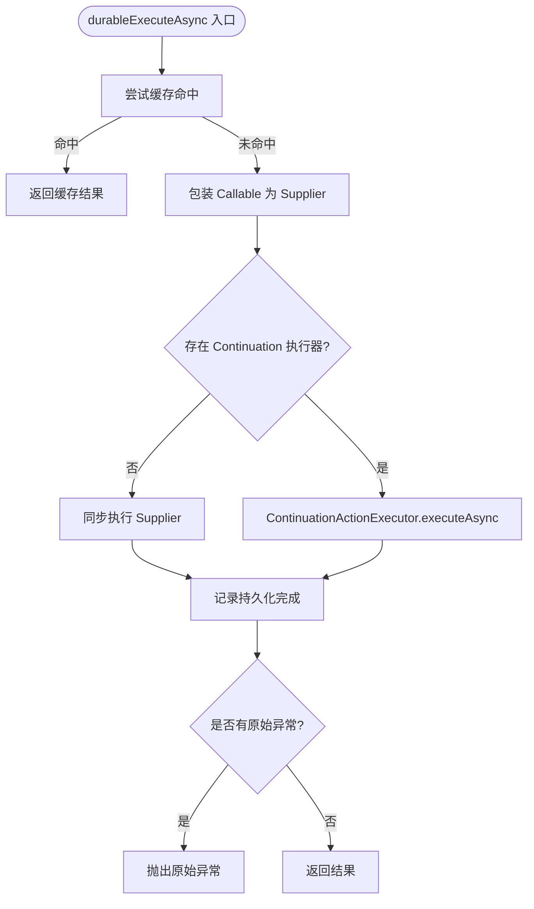
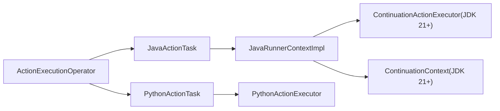

# 异步执行

<cite>
**本文引用的文件**
- [ContinuationActionExecutor.java](file://runtime/src/main/java/org/apache/flink/agents/runtime/async/ContinuationActionExecutor.java)
- [ContinuationContext.java](file://runtime/src/main/java/org/apache/flink/agents/runtime/async/ContinuationContext.java)
- [ContinuationActionExecutor.java（JDK 21+）](file://runtime/src/main/java21/org/apache/flink/agents/runtime/async/ContinuationActionExecutor.java)
- [ContinuationContext.java（JDK 21+）](file://runtime/src/main/java21/org/apache/flink/agents/runtime/async/ContinuationContext.java)
- [JavaActionTask.java](file://runtime/src/main/java/org/apache/flink/agents/runtime/operator/JavaActionTask.java)
- [PythonActionTask.java](file://runtime/src/main/java/org/apache/flink/agents/runtime/python/operator/PythonActionTask.java)
- [ActionExecutionOperator.java](file://runtime/src/main/java/org/apache/flink/agents/runtime/operator/ActionExecutionOperator.java)
- [JavaRunnerContextImpl.java](file://runtime/src/main/java/org/apache/flink/agents/runtime/context/JavaRunnerContextImpl.java)
- [AgentExecutionOptions.java](file://api/src/main/java/org/apache/flink/agents/api/agents/AgentExecutionOptions.java)
- [AsyncExecutionAgent.java](file://e2e-test/flink-agents-end-to-end-tests-integration/src/test/java/org/apache/flink/agents/integration/test/AsyncExecutionAgent.java)
- [AsyncExecutionTest.java](file://e2e-test/flink-agents-end-to-end-tests-integration/src/test/java/org/apache/flink/agents/integration/test/AsyncExecutionTest.java)
</cite>

## 目录
1. [简介](#简介)
2. [项目结构](#项目结构)
3. [核心组件](#核心组件)
4. [架构总览](#架构总览)
5. [组件详解](#组件详解)
6. [依赖关系分析](#依赖关系分析)
7. [性能考量](#性能考量)
8. [故障排查指南](#故障排查指南)
9. [结论](#结论)
10. [附录](#附录)

## 简介
本技术文档围绕异步执行系统展开，重点解析以下内容：
- 续体执行器 ContinuationActionExecutor 的实现与多版本适配（JDK 11 回退与 JDK 21+ 基于 Continuation API 的真异步）
- 续体上下文 ContinuationContext 的状态保存与恢复机制
- 任务抽象 ActionTask 及其 JavaActionTask、PythonActionTask 的实现差异与执行策略
- 异步执行生命周期：从任务创建、调度执行到完成回调的全流程
- 状态跟踪与监控：执行进度、性能指标与错误处理
- 同步/异步切换机制与资源类型优化策略
- 配置参数与调优建议（线程数、超时、资源限制）
- 调试方法与故障排查

## 项目结构
异步执行能力由运行时模块提供，核心文件分布如下：
- 运行时异步执行（JDK 11 回退版本）：runtime/src/main/java/org/apache/flink/agents/runtime/async
- 运行时异步执行（JDK 21+ 真异步版本）：runtime/src/main/java21/org/apache/flink/agents/runtime/async
- 任务与算子：runtime/src/main/java/org/apache/flink/agents/runtime/operator
- Python 任务与生成器：runtime/src/main/java/org/apache/flink/agents/runtime/python/operator
- 上下文与执行环境：runtime/src/main/java/org/apache/flink/agents/runtime/context
- 配置选项：api/src/main/java/org/apache/flink/agents/api/agents
- 端到端测试：e2e-test/flink-agents-end-to-end-tests-integration/src/test/java/org/apache/flink/agents/integration/test

**图表来源**
- [ContinuationActionExecutor.java](file://runtime/src/main/java/org/apache/flink/agents/runtime/async/ContinuationActionExecutor.java#L28-L70)
- [ContinuationContext.java](file://runtime/src/main/java/org/apache/flink/agents/runtime/async/ContinuationContext.java#L20-L26)
- [ContinuationActionExecutor.java（JDK 21+）](file://runtime/src/main/java21/org/apache/flink/agents/runtime/async/ContinuationActionExecutor.java#L35-L164)
- [ContinuationContext.java（JDK 21+）](file://runtime/src/main/java21/org/apache/flink/agents/runtime/async/ContinuationContext.java#L25-L63)
- [JavaActionTask.java](file://runtime/src/main/java/org/apache/flink/agents/runtime/operator/JavaActionTask.java#L39-L92)
- [PythonActionTask.java](file://runtime/src/main/java/org/apache/flink/agents/runtime/python/operator/PythonActionTask.java#L30-L73)
- [ActionExecutionOperator.java](file://runtime/src/main/java/org/apache/flink/agents/runtime/operator/ActionExecutionOperator.java#L108-L200)
- [JavaRunnerContextImpl.java](file://runtime/src/main/java/org/apache/flink/agents/runtime/context/JavaRunnerContextImpl.java#L28-L106)
- [AgentExecutionOptions.java](file://api/src/main/java/org/apache/flink/agents/api/agents/AgentExecutionOptions.java#L30-L47)

**章节来源**
- [ActionExecutionOperator.java](file://runtime/src/main/java/org/apache/flink/agents/runtime/operator/ActionExecutionOperator.java#L108-L200)

## 核心组件
- 续体执行器（ContinuationActionExecutor）
  - JDK 11 版本：提供同步回退实现，executeAction 总是返回完成；executeAsync 同步执行；isContinuationSupported 返回 false
  - JDK 21+ 版本：基于 jdk.internal.vm.Continuation 实现真异步，使用固定大小线程池执行异步任务，支持 yield/恢复
- 续体上下文（ContinuationContext）
  - JDK 11 版本：空标记类，不保存状态
  - JDK 21+ 版本：保存当前 Continuation、待完成 Future、异步结果与异常的原子引用，提供清理方法
- 任务抽象（ActionTask）
  - JavaActionTask：封装 Java 函数执行，支持在 JDK 21+ 下通过 executeAsync 协作式让出
  - PythonActionTask：封装 Python 函数执行，可能生成 PythonGeneratorActionTask 表示后续代码块
- 执行上下文（JavaRunnerContextImpl）
  - 提供 durableExecuteAsync，内部根据是否存在 Continuation 执行器选择同步或异步路径，并记录持久化完成状态
- 配置（AgentExecutionOptions）
  - 提供 num-async-threads 默认值（通常为 CPU 核数的倍数），以及若干异步开关

**章节来源**
- [ContinuationActionExecutor.java](file://runtime/src/main/java/org/apache/flink/agents/runtime/async/ContinuationActionExecutor.java#L28-L70)
- [ContinuationActionExecutor.java（JDK 21+）](file://runtime/src/main/java21/org/apache/flink/agents/runtime/async/ContinuationActionExecutor.java#L35-L164)
- [ContinuationContext.java（JDK 21+）](file://runtime/src/main/java21/org/apache/flink/agents/runtime/async/ContinuationContext.java#L25-L63)
- [JavaActionTask.java](file://runtime/src/main/java/org/apache/flink/agents/runtime/operator/JavaActionTask.java#L39-L92)
- [PythonActionTask.java](file://runtime/src/main/java/org/apache/flink/agents/runtime/python/operator/PythonActionTask.java#L30-L73)
- [JavaRunnerContextImpl.java](file://runtime/src/main/java/org/apache/flink/agents/runtime/context/JavaRunnerContextImpl.java#L28-L106)
- [AgentExecutionOptions.java](file://api/src/main/java/org/apache/flink/agents/api/agents/AgentExecutionOptions.java#L30-L47)

## 架构总览
异步执行在运行时层以“多版本兼容”的方式实现：
- JDK 11：所有异步调用回退为同步，确保可用性
- JDK 21+：引入 Continuation API，配合固定线程池实现协作式让出与恢复，提升吞吐

**图表来源**
- [JavaActionTask.java](file://runtime/src/main/java/org/apache/flink/agents/runtime/operator/JavaActionTask.java#L62-L90)
- [JavaRunnerContextImpl.java](file://runtime/src/main/java/org/apache/flink/agents/runtime/context/JavaRunnerContextImpl.java#L86-L104)
- [ContinuationActionExecutor.java（JDK 21+）](file://runtime/src/main/java21/org/apache/flink/agents/runtime/async/ContinuationActionExecutor.java#L60-L149)
- [ContinuationActionExecutor.java](file://runtime/src/main/java/org/apache/flink/agents/runtime/async/ContinuationActionExecutor.java#L40-L57)

## 组件详解

### 续体执行器（ContinuationActionExecutor）
- JDK 11 实现要点
  - executeAction：直接运行 Runnable，立即返回完成
  - executeAsync：直接调用 Supplier，同步阻塞直至返回
  - isContinuationSupported：返回 false
- JDK 21+ 实现要点
  - executeAction：维护 Continuation 生命周期；若存在未完成的 pendingFuture，则返回等待；否则创建/复用 Continuation 并运行，返回是否完成
  - executeAsync：提交任务至线程池，设置 pendingFuture，yield 直到 Future 完成；完成后读取异步结果或异常
  - 线程池：固定大小，可通过配置项控制线程数
  - 关闭：shutdownNow 中断未完成任务

**图表来源**
- [ContinuationActionExecutor.java](file://runtime/src/main/java/org/apache/flink/agents/runtime/async/ContinuationActionExecutor.java#L28-L70)
- [ContinuationActionExecutor.java（JDK 21+）](file://runtime/src/main/java21/org/apache/flink/agents/runtime/async/ContinuationActionExecutor.java#L35-L164)
- [ContinuationContext.java（JDK 21+）](file://runtime/src/main/java21/org/apache/flink/agents/runtime/async/ContinuationContext.java#L25-L63)

**章节来源**
- [ContinuationActionExecutor.java](file://runtime/src/main/java/org/apache/flink/agents/runtime/async/ContinuationActionExecutor.java#L28-L70)
- [ContinuationActionExecutor.java（JDK 21+）](file://runtime/src/main/java21/org/apache/flink/agents/runtime/async/ContinuationActionExecutor.java#L35-L164)

### 续体上下文（ContinuationContext）
- JDK 11：仅作为标记类，不承载状态
- JDK 21+：持有当前 Continuation、待完成 Future、异步结果与异常的原子引用；提供 clearAsyncState 清理状态

**图表来源**
- [ContinuationActionExecutor.java（JDK 21+）](file://runtime/src/main/java21/org/apache/flink/agents/runtime/async/ContinuationActionExecutor.java#L111-L149)
- [ContinuationContext.java（JDK 21+）](file://runtime/src/main/java21/org/apache/flink/agents/runtime/async/ContinuationContext.java#L57-L61)

**章节来源**
- [ContinuationContext.java（JDK 21+）](file://runtime/src/main/java21/org/apache/flink/agents/runtime/async/ContinuationContext.java#L25-L63)

### 任务抽象与执行策略（ActionTask）
- JavaActionTask
  - 在 JDK 21+ 下，通过 ContinuationActionExecutor.executeAction 协作式执行；若返回未完成，则将自身作为下一个待执行任务
  - 在 JDK 11 下，直接同步执行，无 yield
- PythonActionTask
  - 调用 PythonActionExecutor 执行 Python 函数，若返回 awaitable 引用，则创建 PythonGeneratorActionTask 代表后续代码块继续执行

**图表来源**
- [JavaActionTask.java](file://runtime/src/main/java/org/apache/flink/agents/runtime/operator/JavaActionTask.java#L62-L90)
- [PythonActionTask.java](file://runtime/src/main/java/org/apache/flink/agents/runtime/python/operator/PythonActionTask.java#L55-L71)
- [ContinuationActionExecutor.java（JDK 21+）](file://runtime/src/main/java21/org/apache/flink/agents/runtime/async/ContinuationActionExecutor.java#L60-L97)

**章节来源**
- [JavaActionTask.java](file://runtime/src/main/java/org/apache/flink/agents/runtime/operator/JavaActionTask.java#L39-L92)
- [PythonActionTask.java](file://runtime/src/main/java/org/apache/flink/agents/runtime/python/operator/PythonActionTask.java#L30-L73)

### 执行上下文与生命周期（JavaRunnerContextImpl）
- durableExecuteAsync 封装异步执行：优先尝试缓存命中；否则根据是否存在 Continuation 执行器选择同步或异步路径；最后记录持久化完成状态并按需抛出原始异常

**图表来源**
- [JavaRunnerContextImpl.java](file://runtime/src/main/java/org/apache/flink/agents/runtime/context/JavaRunnerContextImpl.java#L60-L104)
- [ContinuationActionExecutor.java（JDK 21+）](file://runtime/src/main/java21/org/apache/flink/agents/runtime/async/ContinuationActionExecutor.java#L111-L149)

**章节来源**
- [JavaRunnerContextImpl.java](file://runtime/src/main/java/org/apache/flink/agents/runtime/context/JavaRunnerContextImpl.java#L28-L106)

### 状态跟踪与监控
- 持久化执行上下文：ActionExecutionOperator 支持细粒度恢复，初始化 RunnerContext 的 DurableExecutionContext，使 execute/execute_async 调用在恢复时跳过已完成步骤并持久化 CallRecords
- 指标与日志：运行时使用内置指标组与事件日志工厂进行监控与审计
- 端到端测试验证：AsyncExecutionTest 解析输出中的时间戳范围，统计重叠对数量，验证异步并发执行效果

**章节来源**
- [ActionExecutionOperator.java](file://runtime/src/main/java/org/apache/flink/agents/runtime/operator/ActionExecutionOperator.java#L1019-L1022)
- [AsyncExecutionTest.java](file://e2e-test/flink-agents-end-to-end-tests-integration/src/test/java/org/apache/flink/agents/integration/test/AsyncExecutionTest.java#L254-L308)

## 依赖关系分析
- 组件耦合
  - JavaActionTask 依赖 JavaRunnerContextImpl 与 ContinuationActionExecutor
  - JavaRunnerContextImpl 依赖 ContinuationActionExecutor 与 ContinuationContext
  - PythonActionTask 依赖 PythonActionExecutor 与 PythonRunnerContextImpl
- 外部依赖
  - JDK 21+ 使用 jdk.internal.vm.Continuation 与 ContinuationScope
  - 线程池来自 java.util.concurrent.Executors.newFixedThreadPool
- 循环依赖
  - 未发现直接循环依赖；各组件职责清晰，通过接口与上下文传递解耦

**图表来源**
- [ActionExecutionOperator.java](file://runtime/src/main/java/org/apache/flink/agents/runtime/operator/ActionExecutionOperator.java#L108-L200)
- [JavaActionTask.java](file://runtime/src/main/java/org/apache/flink/agents/runtime/operator/JavaActionTask.java#L62-L90)
- [JavaRunnerContextImpl.java](file://runtime/src/main/java/org/apache/flink/agents/runtime/context/JavaRunnerContextImpl.java#L42-L57)
- [PythonActionTask.java](file://runtime/src/main/java/org/apache/flink/agents/runtime/python/operator/PythonActionTask.java#L55-L71)

**章节来源**
- [ActionExecutionOperator.java](file://runtime/src/main/java/org/apache/flink/agents/runtime/operator/ActionExecutionOperator.java#L108-L200)

## 性能考量
- 线程池规模
  - num-async-threads 默认值通常为 CPU 核数的倍数，适合 I/O 密集型异步任务
  - 建议根据外部服务延迟与并发请求数动态调整
- 协作式让出
  - JDK 21+ 通过 Continuation API 实现让出与恢复，避免传统线程切换开销
- 状态清理
  - ContinuationContext.clearAsyncState 用于避免内存泄漏与状态污染
- 持久化与恢复
  - DurableExecutionContext 降低重复执行成本，提高容错与可恢复性

**章节来源**
- [AgentExecutionOptions.java](file://api/src/main/java/org/apache/flink/agents/api/agents/AgentExecutionOptions.java#L30-L47)
- [ContinuationActionExecutor.java（JDK 21+）](file://runtime/src/main/java21/org/apache/flink/agents/runtime/async/ContinuationActionExecutor.java#L43-L47)
- [ContinuationContext.java（JDK 21+）](file://runtime/src/main/java21/org/apache/flink/agents/runtime/async/ContinuationContext.java#L57-L61)
- [ActionExecutionOperator.java](file://runtime/src/main/java/org/apache/flink/agents/runtime/operator/ActionExecutionOperator.java#L1019-L1022)

## 故障排查指南
- 异常传播
  - JavaRunnerContextImpl 在捕获 DurableExecutionRuntimeException 后会提取原始异常并重新抛出，便于定位
- 端到端验证
  - AsyncExecutionAgent 与 AsyncExecutionTest 通过输出中携带的起止时间戳验证异步并发执行，可用于判断是否存在串行化问题
- 日志与指标
  - ContinuationActionExecutor 在关键路径打印调试日志，有助于观察 Continuation 状态变化与 Future 完成情况

**章节来源**
- [JavaRunnerContextImpl.java](file://runtime/src/main/java/org/apache/flink/agents/runtime/context/JavaRunnerContextImpl.java#L94-L104)
- [AsyncExecutionAgent.java](file://e2e-test/flink-agents-end-to-end-tests-integration/src/test/java/org/apache/flink/agents/integration/test/AsyncExecutionAgent.java#L279-L301)
- [AsyncExecutionTest.java](file://e2e-test/flink-agents-end-to-end-tests-integration/src/test/java/org/apache/flink/agents/integration/test/AsyncExecutionTest.java#L254-L308)
- [ContinuationActionExecutor.java（JDK 21+）](file://runtime/src/main/java21/org/apache/flink/agents/runtime/async/ContinuationActionExecutor.java#L60-L97)

## 结论
该异步执行系统通过“多版本兼容”策略，在保证 JDK 11 可用性的前提下，利用 JDK 21+ 的 Continuation API 实现了真正的协作式异步执行。结合线程池、续体上下文与任务抽象，系统在高并发 I/O 场景下具备良好的吞吐与可恢复性。通过配置项与端到端测试，用户可以灵活调优并验证异步行为。

## 附录
- 配置参数
  - num-async-threads：异步线程池大小，默认值通常为 CPU 核数的倍数
  - chat.async、tool-call.async、rag.async：分别控制聊天、工具调用与检索增强的异步开关
- 调优建议
  - I/O 密集：适当增大 num-async-threads，避免线程饥饿
  - CPU 密集：谨慎增加线程数，防止上下文切换开销过大
  - 外部依赖：根据外部服务延迟与超时设置合理上限，避免堆积
- 资源类型优化
  - Java 与 Python 资源通过适配器桥接，异步执行时优先使用线程池隔离不同资源类型任务

**章节来源**
- [AgentExecutionOptions.java](file://api/src/main/java/org/apache/flink/agents/api/agents/AgentExecutionOptions.java#L30-L47)