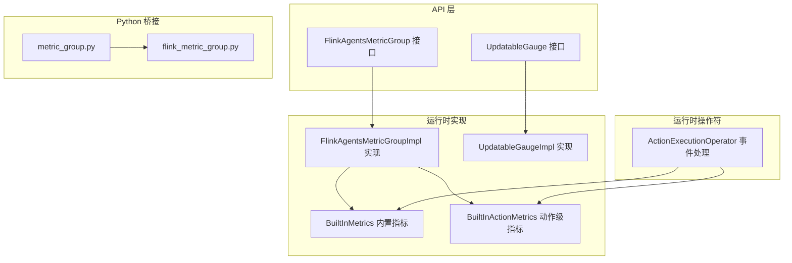
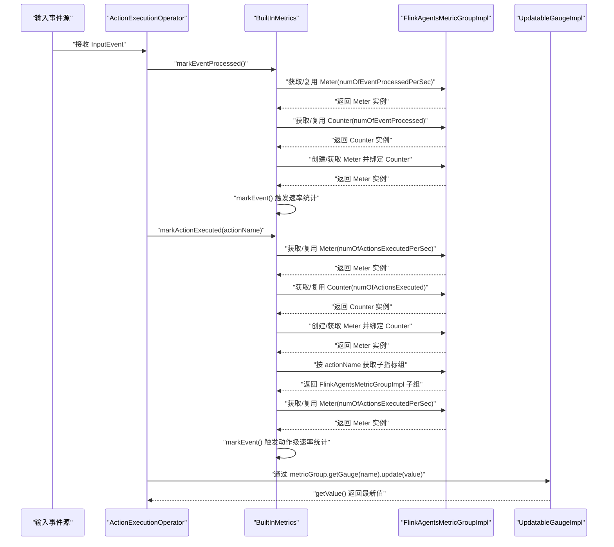
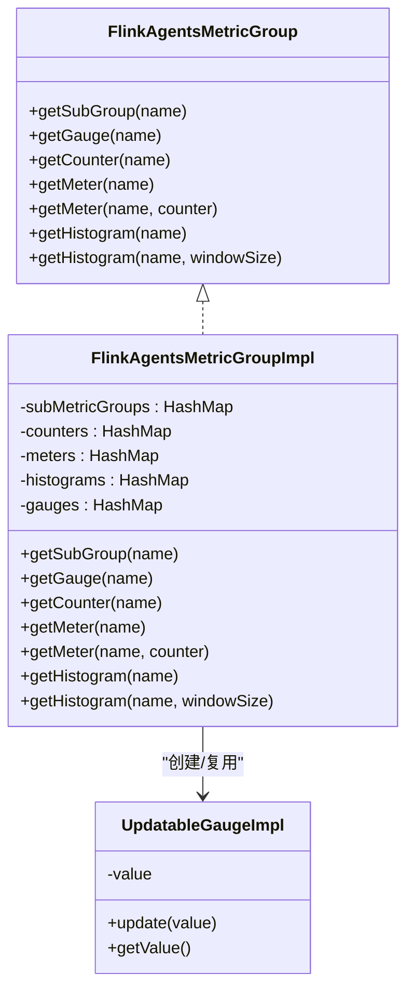
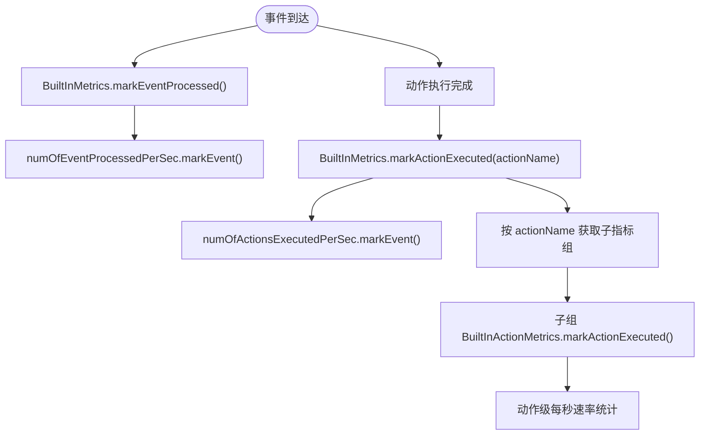
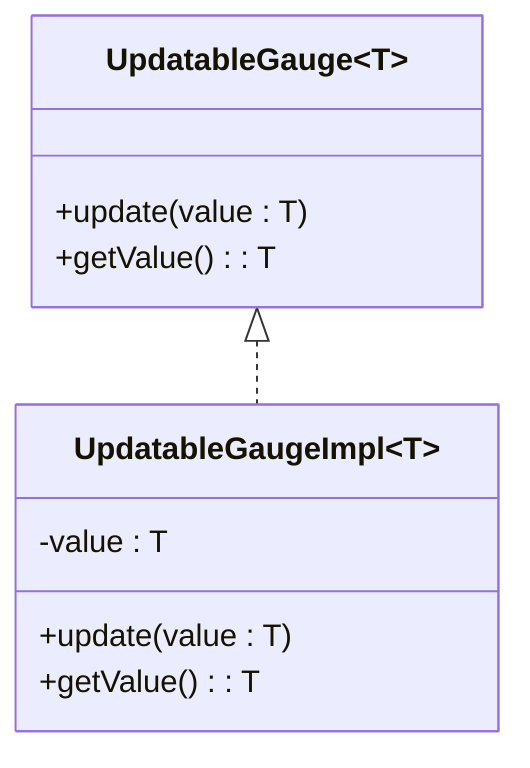
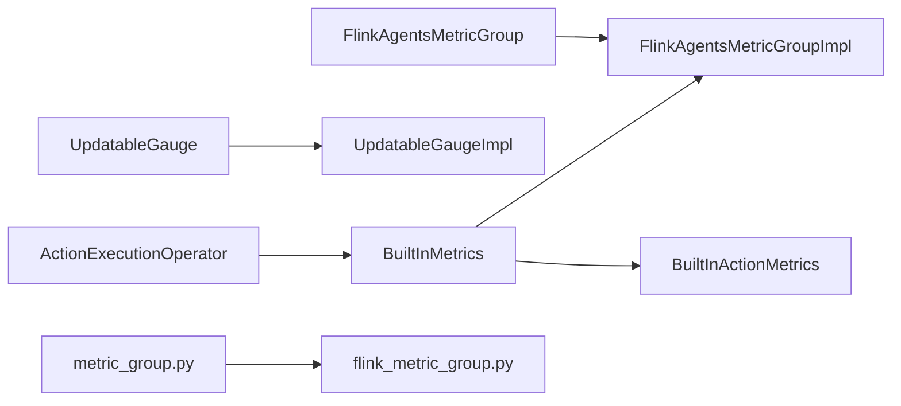

# 性能监控

<cite>
**本文引用的文件**
- [FlinkAgentsMetricGroup.java](file://api/src/main/java/org/apache/flink/agents/api/metrics/FlinkAgentsMetricGroup.java)
- [UpdatableGauge.java](file://api/src/main/java/org/apache/flink/agents/api/metrics/UpdatableGauge.java)
- [FlinkAgentsMetricGroupImpl.java](file://runtime/src/main/java/org/apache/flink/agents/runtime/metrics/FlinkAgentsMetricGroupImpl.java)
- [UpdatableGaugeImpl.java](file://runtime/src/main/java/org/apache/flink/agents/runtime/metrics/UpdatableGaugeImpl.java)
- [BuiltInMetrics.java](file://runtime/src/main/java/org/apache/flink/agents/runtime/metrics/BuiltInMetrics.java)
- [BuiltInActionMetrics.java](file://runtime/src/main/java/org/apache/flink/agents/runtime/metrics/BuiltInActionMetrics.java)
- [ActionExecutionOperator.java](file://runtime/src/main/java/org/apache/flink/agents/runtime/operator/ActionExecutionOperator.java)
- [metric_group.py](file://python/flink_agents/api/metric_group.py)
- [flink_metric_group.py](file://python/flink_agents/runtime/flink_metric_group.py)
- [FlinkAgentsMetricGroupImplTest.java](file://runtime/src/test/java/org/apache/flink/agents/runtime/metrics/FlinkAgentsMetricGroupImplTest.java)
- [UpdatableGaugeImplTest.java](file://runtime/src/test/java/org/apache/flink/agents/runtime/metrics/UpdatableGaugeImplTest.java)
</cite>

## 目录
1. [简介](#简介)
2. [项目结构](#项目结构)
3. [核心组件](#核心组件)
4. [架构总览](#架构总览)
5. [组件详解](#组件详解)
6. [依赖关系分析](#依赖关系分析)
7. [性能考量](#性能考量)
8. [故障排查指南](#故障排查指南)
9. [结论](#结论)
10. [附录](#附录)

## 简介
本文件为 Flink Agents 性能监控系统的技术文档，聚焦以下主题：
- 指标组实现：FlinkAgentsMetricGroupImpl 的指标分类、命名空间管理与聚合策略
- 内置指标体系：BuiltInMetrics 的事件处理速率、动作执行速率等关键指标
- 可更新仪表：UpdatableGaugeImpl 的动态更新与并发处理
- 数据采集机制：采样频率、窗口大小、批量上报策略
- 可视化与导出：与外部监控系统的集成方式
- 基准测试与调优：指标解读、瓶颈识别与优化建议
- 告警与诊断：监控告警配置与故障诊断方法

## 项目结构
监控相关代码主要分布在以下模块：
- API 层：定义指标接口与抽象度量组（FlinkAgentsMetricGroup、UpdatableGauge）
- 运行时层：指标组实现（FlinkAgentsMetricGroupImpl）、内置指标（BuiltInMetrics、BuiltInActionMetrics）、可更新仪表（UpdatableGaugeImpl）
- 运行时操作符：ActionExecutionOperator 在事件流转中记录内置指标
- Python 接口与运行时桥接：Python API 与 Flink 运行时指标桥接（metric_group.py、flink_metric_group.py）

图表来源
- [FlinkAgentsMetricGroup.java](file://api/src/main/java/org/apache/flink/agents/api/metrics/FlinkAgentsMetricGroup.java#L26-L92)
- [UpdatableGauge.java](file://api/src/main/java/org/apache/flink/agents/api/metrics/UpdatableGauge.java#L24-L37)
- [FlinkAgentsMetricGroupImpl.java](file://runtime/src/main/java/org/apache/flink/agents/runtime/metrics/FlinkAgentsMetricGroupImpl.java#L33-L104)
- [UpdatableGaugeImpl.java](file://runtime/src/main/java/org/apache/flink/agents/runtime/metrics/UpdatableGaugeImpl.java#L24-L42)
- [BuiltInMetrics.java](file://runtime/src/main/java/org/apache/flink/agents/runtime/metrics/BuiltInMetrics.java#L28-L72)
- [BuiltInActionMetrics.java](file://runtime/src/main/java/org/apache/flink/agents/runtime/metrics/BuiltInActionMetrics.java#L25-L44)
- [ActionExecutionOperator.java](file://runtime/src/main/java/org/apache/flink/agents/runtime/operator/ActionExecutionOperator.java#L108-L200)
- [metric_group.py](file://python/flink_agents/api/metric_group.py#L83-L139)
- [flink_metric_group.py](file://python/flink_agents/runtime/flink_metric_group.py#L72-L116)

章节来源
- [FlinkAgentsMetricGroup.java](file://api/src/main/java/org/apache/flink/agents/api/metrics/FlinkAgentsMetricGroup.java#L26-L92)
- [FlinkAgentsMetricGroupImpl.java](file://runtime/src/main/java/org/apache/flink/agents/runtime/metrics/FlinkAgentsMetricGroupImpl.java#L33-L104)
- [BuiltInMetrics.java](file://runtime/src/main/java/org/apache/flink/agents/runtime/metrics/BuiltInMetrics.java#L28-L72)
- [ActionExecutionOperator.java](file://runtime/src/main/java/org/apache/flink/agents/runtime/operator/ActionExecutionOperator.java#L108-L200)

## 核心组件
- 指标组接口与实现
  - FlinkAgentsMetricGroup 定义子组、计数器、计量器、直方图与可更新仪表的获取方法
  - FlinkAgentsMetricGroupImpl 提供具体实现，内部缓存各类指标实例，支持命名空间分组与默认窗口参数
- 内置指标体系
  - BuiltInMetrics 聚合事件处理速率与动作执行速率，并按动作名建立子指标组
  - BuiltInActionMetrics 针对单个动作提供执行速率统计
- 可更新仪表
  - UpdatableGauge 与 UpdatableGaugeImpl 支持动态更新任意类型值，便于跨语言交互与实时观测
- 运行时采集点
  - ActionExecutionOperator 在事件处理流程中调用 BuiltInMetrics 记录指标

章节来源
- [FlinkAgentsMetricGroup.java](file://api/src/main/java/org/apache/flink/agents/api/metrics/FlinkAgentsMetricGroup.java#L26-L92)
- [FlinkAgentsMetricGroupImpl.java](file://runtime/src/main/java/org/apache/flink/agents/runtime/metrics/FlinkAgentsMetricGroupImpl.java#L33-L104)
- [BuiltInMetrics.java](file://runtime/src/main/java/org/apache/flink/agents/runtime/metrics/BuiltInMetrics.java#L28-L72)
- [BuiltInActionMetrics.java](file://runtime/src/main/java/org/apache/flink/agents/runtime/metrics/BuiltInActionMetrics.java#L25-L44)
- [UpdatableGaugeImpl.java](file://runtime/src/main/java/org/apache/flink/agents/runtime/metrics/UpdatableGaugeImpl.java#L24-L42)
- [ActionExecutionOperator.java](file://runtime/src/main/java/org/apache/flink/agents/runtime/operator/ActionExecutionOperator.java#L108-L200)

## 架构总览
下图展示从事件到指标采集的端到端路径，以及指标组与内置指标之间的关系。

图表来源
- [ActionExecutionOperator.java](file://runtime/src/main/java/org/apache/flink/agents/runtime/operator/ActionExecutionOperator.java#L108-L200)
- [BuiltInMetrics.java](file://runtime/src/main/java/org/apache/flink/agents/runtime/metrics/BuiltInMetrics.java#L58-L72)
- [BuiltInActionMetrics.java](file://runtime/src/main/java/org/apache/flink/agents/runtime/metrics/BuiltInActionMetrics.java#L40-L44)
- [FlinkAgentsMetricGroupImpl.java](file://runtime/src/main/java/org/apache/flink/agents/runtime/metrics/FlinkAgentsMetricGroupImpl.java#L55-L103)
- [UpdatableGaugeImpl.java](file://runtime/src/main/java/org/apache/flink/agents/runtime/metrics/UpdatableGaugeImpl.java#L33-L41)

## 组件详解

### 指标组实现：FlinkAgentsMetricGroupImpl
- 指标分类与命名空间
  - 子指标组：通过 getSubGroup(name) 创建命名空间隔离的子组，内部以 HashMap 缓存，避免重复创建
  - 计数器：getCounter(name) 返回计数器实例，用于累计事件或动作总数
  - 计量器：getMeter(name) 与 getMeter(name, counter) 返回速率统计；默认窗口为 60 秒
  - 直方图：getHistogram(name) 与 getHistogram(name, windowSize) 返回描述性直方图，默认窗口 100
  - 可更新仪表：getGauge(name) 返回 UpdatableGaugeImpl，支持动态更新任意类型值
- 聚合策略
  - MeterView 默认窗口长度与滑动窗口统计由底层实现提供
  - DescriptiveStatisticsHistogram 提供均值、最大、最小等描述性统计
  - 子指标组按动作名划分，便于按动作维度聚合与查询

图表来源
- [FlinkAgentsMetricGroup.java](file://api/src/main/java/org/apache/flink/agents/api/metrics/FlinkAgentsMetricGroup.java#L26-L92)
- [FlinkAgentsMetricGroupImpl.java](file://runtime/src/main/java/org/apache/flink/agents/runtime/metrics/FlinkAgentsMetricGroupImpl.java#L33-L104)
- [UpdatableGaugeImpl.java](file://runtime/src/main/java/org/apache/flink/agents/runtime/metrics/UpdatableGaugeImpl.java#L24-L42)

章节来源
- [FlinkAgentsMetricGroupImpl.java](file://runtime/src/main/java/org/apache/flink/agents/runtime/metrics/FlinkAgentsMetricGroupImpl.java#L33-L104)
- [FlinkAgentsMetricGroup.java](file://api/src/main/java/org/apache/flink/agents/api/metrics/FlinkAgentsMetricGroup.java#L26-L92)

### 内置指标体系：BuiltInMetrics 与 BuiltInActionMetrics
- 事件处理速率
  - 计数器：numOfEventProcessed 累计事件总数
  - 计量器：numOfEventProcessedPerSec 每秒事件速率，基于 Counter 自动派生
- 动作执行速率
  - 计数器：numOfActionsExecuted 累计动作总数
  - 计量器：numOfActionsExecutedPerSec 每秒动作速率，基于 Counter 自动派生
  - 动作级子组：按动作名创建子指标组，分别统计各动作的执行速率
- 采集触发点
  - ActionExecutionOperator 在事件处理完成后调用 BuiltInMetrics 的 mark 方法进行统计

图表来源
- [BuiltInMetrics.java](file://runtime/src/main/java/org/apache/flink/agents/runtime/metrics/BuiltInMetrics.java#L58-L72)
- [BuiltInActionMetrics.java](file://runtime/src/main/java/org/apache/flink/agents/runtime/metrics/BuiltInActionMetrics.java#L40-L44)
- [ActionExecutionOperator.java](file://runtime/src/main/java/org/apache/flink/agents/runtime/operator/ActionExecutionOperator.java#L108-L200)

章节来源
- [BuiltInMetrics.java](file://runtime/src/main/java/org/apache/flink/agents/runtime/metrics/BuiltInMetrics.java#L28-L72)
- [BuiltInActionMetrics.java](file://runtime/src/main/java/org/apache/flink/agents/runtime/metrics/BuiltInActionMetrics.java#L25-L44)
- [ActionExecutionOperator.java](file://runtime/src/main/java/org/apache/flink/agents/runtime/operator/ActionExecutionOperator.java#L108-L200)

### 可更新仪表：UpdatableGaugeImpl
- 设计目标
  - 支持动态更新任意类型值，便于在运行时观测状态变化（如资源占用、阈值比较结果）
  - 与 FlinkAgentsMetricGroup.getGauge(name) 协同，统一命名空间与生命周期管理
- 并发与线程安全
  - 当前实现为简单字段更新与读取，未显式加锁；在单线程上下文（如 Flink Mailbox）中使用较为安全
  - 若需跨线程更新，建议在业务侧自行加锁或采用原子更新策略
- 测试验证
  - 单测覆盖了整型、长整型、浮点型与双精度类型的更新与读取，确保基本行为正确

图表来源
- [UpdatableGauge.java](file://api/src/main/java/org/apache/flink/agents/api/metrics/UpdatableGauge.java#L24-L37)
- [UpdatableGaugeImpl.java](file://runtime/src/main/java/org/apache/flink/agents/runtime/metrics/UpdatableGaugeImpl.java#L24-L42)

章节来源
- [UpdatableGaugeImpl.java](file://runtime/src/main/java/org/apache/flink/agents/runtime/metrics/UpdatableGaugeImpl.java#L24-L42)
- [UpdatableGaugeImplTest.java](file://runtime/src/test/java/org/apache/flink/agents/runtime/metrics/UpdatableGaugeImplTest.java#L29-L40)

### 数据采集机制与指标命名
- 采样频率与窗口
  - Meter 默认窗口长度与直方图窗口大小在实现中设定（例如 60 秒窗口与 100 窗口），可通过接口重载指定自定义窗口
- 数据缓冲与批量上报
  - 指标对象在运行时被缓存复用，减少频繁创建开销；底层 Flink 指标系统负责周期性采集与上报
- 命名空间管理
  - 通过 getSubGroup(actionName) 为每个动作建立独立命名空间，便于按动作维度聚合与查询

章节来源
- [FlinkAgentsMetricGroupImpl.java](file://runtime/src/main/java/org/apache/flink/agents/runtime/metrics/FlinkAgentsMetricGroupImpl.java#L69-L103)
- [BuiltInMetrics.java](file://runtime/src/main/java/org/apache/flink/agents/runtime/metrics/BuiltInMetrics.java#L51-L57)

### 可视化与导出
- Python 指标桥接
  - Python API 定义了 Meter、Histogram、Gauge 抽象，便于在 Python 环境中统一指标语义
  - Python 运行时桥接将 Python 指标映射到底层 Java 指标对象，实现跨语言一致的采集与导出
- 外部系统集成
  - 通过 Flink 指标系统与外部监控平台（如 Prometheus、InfluxDB、Grafana）对接，实现可视化与告警

章节来源
- [metric_group.py](file://python/flink_agents/api/metric_group.py#L83-L139)
- [flink_metric_group.py](file://python/flink_agents/runtime/flink_metric_group.py#L72-L116)

## 依赖关系分析
- 接口与实现
  - FlinkAgentsMetricGroup 是 API 层抽象，FlinkAgentsMetricGroupImpl 是运行时实现
  - UpdatableGauge 与 UpdatableGaugeImpl 同理
- 运行时耦合
  - ActionExecutionOperator 依赖 BuiltInMetrics 进行事件与动作统计
  - BuiltInMetrics 依赖 FlinkAgentsMetricGroupImpl 获取计数器与计量器
- Python 交互
  - Python API 与运行时桥接保证跨语言指标一致性

图表来源
- [FlinkAgentsMetricGroup.java](file://api/src/main/java/org/apache/flink/agents/api/metrics/FlinkAgentsMetricGroup.java#L26-L92)
- [FlinkAgentsMetricGroupImpl.java](file://runtime/src/main/java/org/apache/flink/agents/runtime/metrics/FlinkAgentsMetricGroupImpl.java#L33-L104)
- [UpdatableGauge.java](file://api/src/main/java/org/apache/flink/agents/api/metrics/UpdatableGauge.java#L24-L37)
- [UpdatableGaugeImpl.java](file://runtime/src/main/java/org/apache/flink/agents/runtime/metrics/UpdatableGaugeImpl.java#L24-L42)
- [BuiltInMetrics.java](file://runtime/src/main/java/org/apache/flink/agents/runtime/metrics/BuiltInMetrics.java#L28-L72)
- [BuiltInActionMetrics.java](file://runtime/src/main/java/org/apache/flink/agents/runtime/metrics/BuiltInActionMetrics.java#L25-L44)
- [ActionExecutionOperator.java](file://runtime/src/main/java/org/apache/flink/agents/runtime/operator/ActionExecutionOperator.java#L108-L200)
- [metric_group.py](file://python/flink_agents/api/metric_group.py#L83-L139)
- [flink_metric_group.py](file://python/flink_agents/runtime/flink_metric_group.py#L72-L116)

章节来源
- [FlinkAgentsMetricGroupImpl.java](file://runtime/src/main/java/org/apache/flink/agents/runtime/metrics/FlinkAgentsMetricGroupImpl.java#L33-L104)
- [BuiltInMetrics.java](file://runtime/src/main/java/org/apache/flink/agents/runtime/metrics/BuiltInMetrics.java#L28-L72)
- [ActionExecutionOperator.java](file://runtime/src/main/java/org/apache/flink/agents/runtime/operator/ActionExecutionOperator.java#L108-L200)

## 性能考量
- 指标创建与缓存
  - 指标组内部以 HashMap 缓存计数器、计量器、直方图与仪表，避免重复创建带来的开销
- 窗口参数选择
  - Meter 与 Histogram 的窗口大小影响统计精度与时延，应根据业务吞吐与观测粒度权衡
- 并发更新
  - UpdatableGaugeImpl 未内置同步控制，建议在单线程上下文中使用；若跨线程更新，需在业务侧加锁或采用原子更新
- 事件与动作统计
  - BuiltInMetrics 将事件与动作的速率统计与计数器绑定，减少重复计算；动作级统计按动作名子组化，便于细粒度分析

章节来源
- [FlinkAgentsMetricGroupImpl.java](file://runtime/src/main/java/org/apache/flink/agents/runtime/metrics/FlinkAgentsMetricGroupImpl.java#L69-L103)
- [BuiltInMetrics.java](file://runtime/src/main/java/org/apache/flink/agents/runtime/metrics/BuiltInMetrics.java#L58-L72)
- [UpdatableGaugeImpl.java](file://runtime/src/main/java/org/apache/flink/agents/runtime/metrics/UpdatableGaugeImpl.java#L33-L41)

## 故障排查指南
- 指标缺失或为空
  - 检查是否正确调用 BuiltInMetrics 的 mark 方法；确认 ActionExecutionOperator 的事件处理流程已执行
- 指标异常波动
  - 核对 Meter 窗口设置与直方图窗口；检查是否存在瞬时高并发导致的统计抖动
- 跨语言指标不一致
  - 确认 Python API 与运行时桥接是否正确初始化；检查指标命名与类型是否匹配
- 单测参考
  - 可参考指标组与仪表的单元测试，验证 getGauge、getCounter、getMeter、getHistogram 的行为

章节来源
- [FlinkAgentsMetricGroupImplTest.java](file://runtime/src/test/java/org/apache/flink/agents/runtime/metrics/FlinkAgentsMetricGroupImplTest.java#L45-L86)
- [UpdatableGaugeImplTest.java](file://runtime/src/test/java/org/apache/flink/agents/runtime/metrics/UpdatableGaugeImplTest.java#L29-L40)

## 结论
本文档系统梳理了 Flink Agents 性能监控体系：从指标组接口与实现、内置指标的事件与动作统计、可更新仪表的动态观测，到数据采集与跨语言桥接。通过合理的命名空间管理、窗口参数与并发控制，可在生产环境中稳定地采集与导出关键性能指标，并结合外部监控系统实现可视化与告警。

## 附录
- 关键指标清单
  - 事件处理速率：numOfEventProcessedPerSec
  - 动作执行速率：numOfActionsExecutedPerSec
  - 动作级速率：按动作名的子组下的 numOfActionsExecutedPerSec
- 建议的观测维度
  - 按动作名拆分的执行速率与延迟分布
  - 事件与动作的吞吐对比，识别瓶颈环节
  - 使用 UpdatableGauge 记录阈值状态或资源占用，辅助告警策略