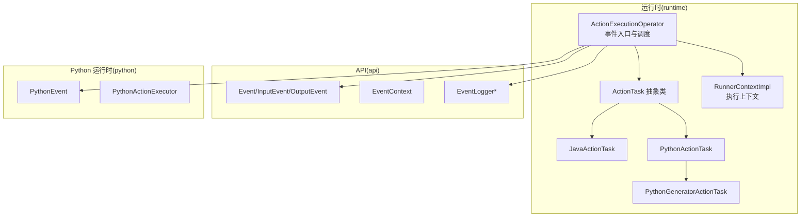
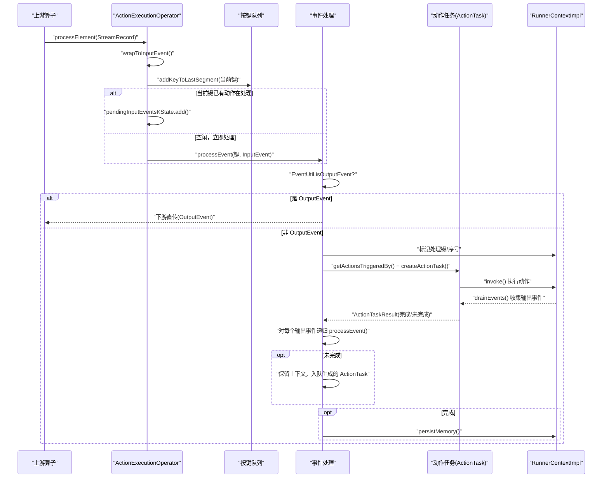
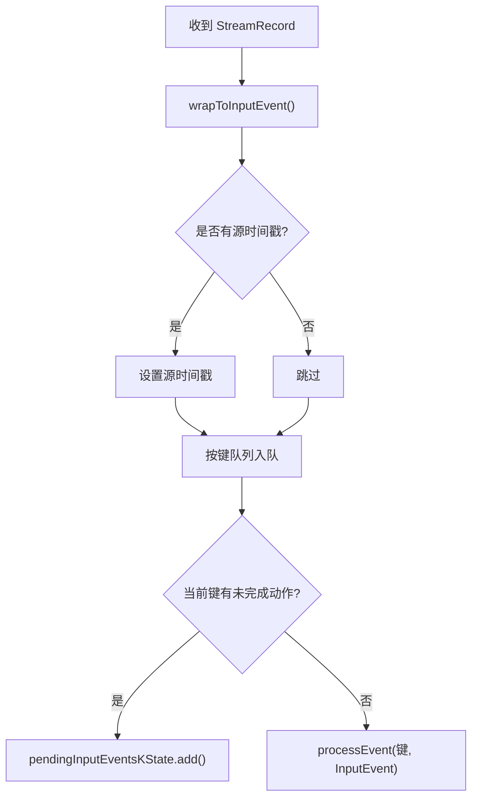
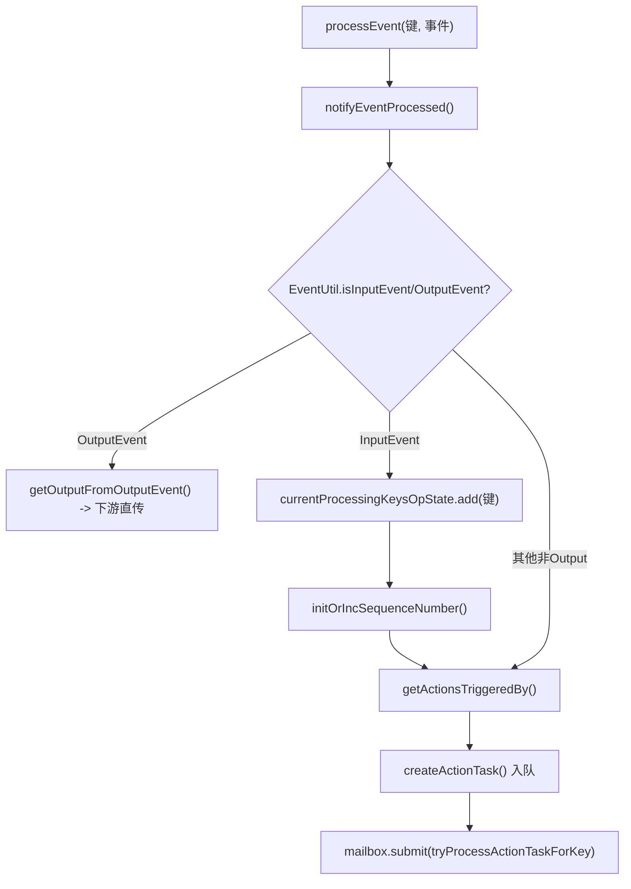
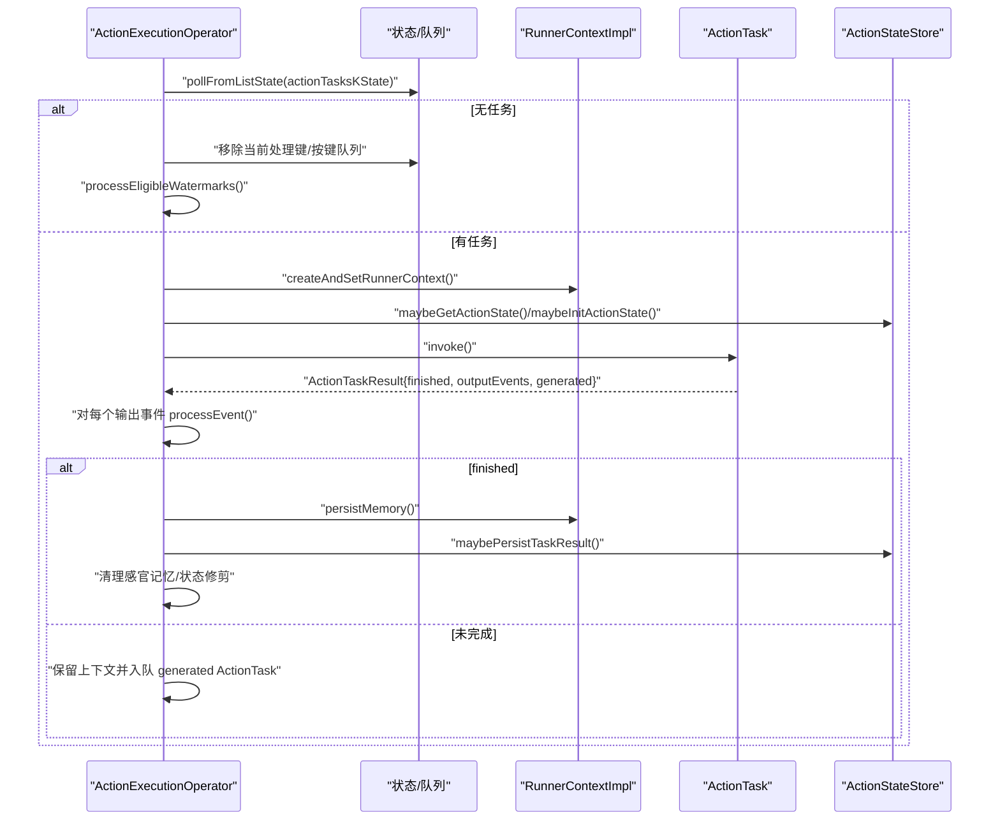
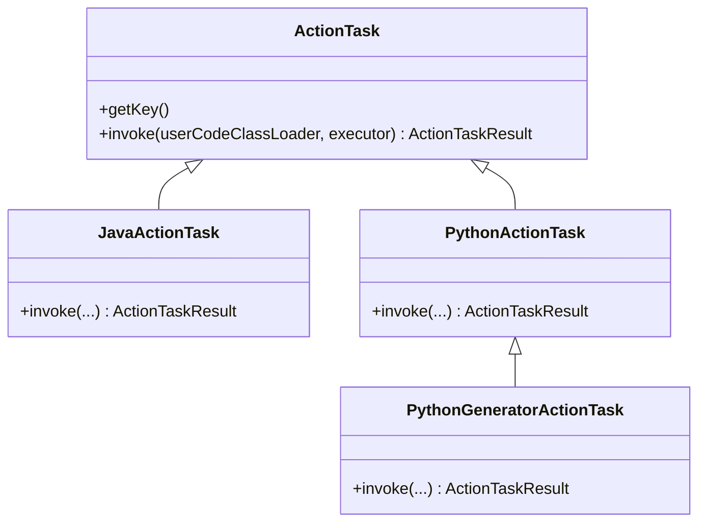
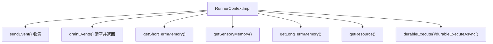
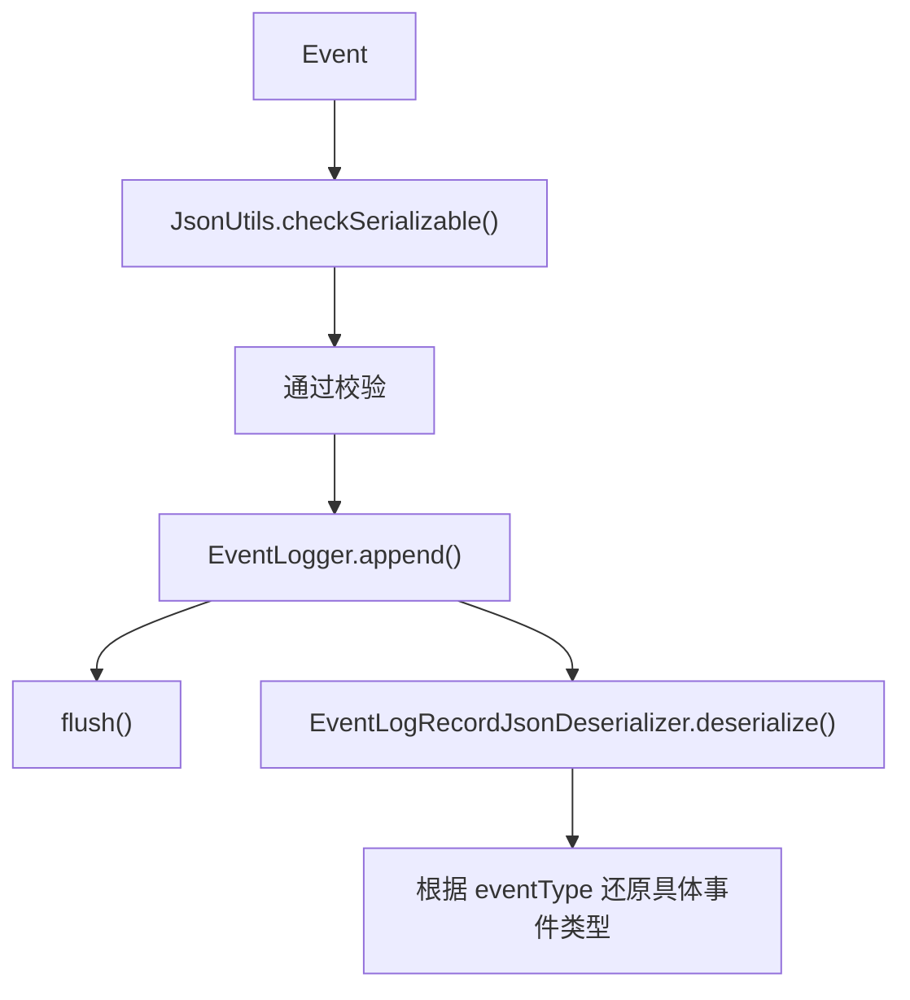
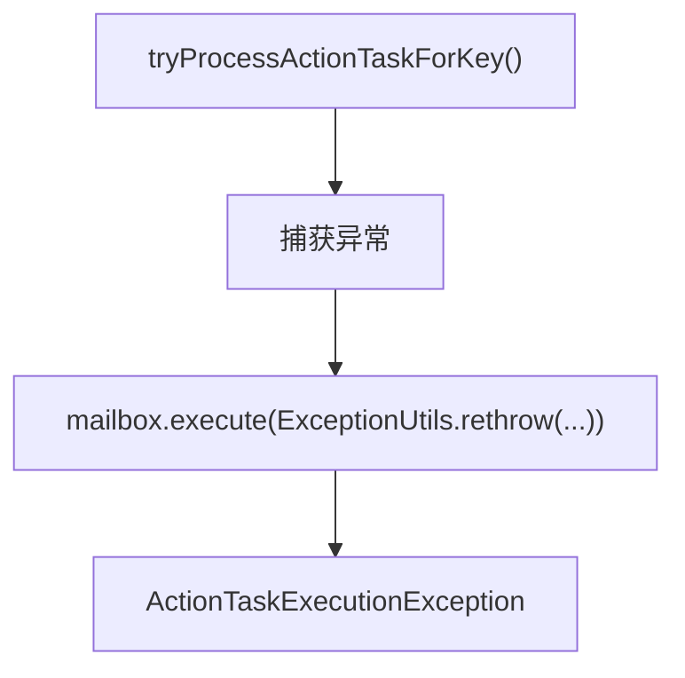
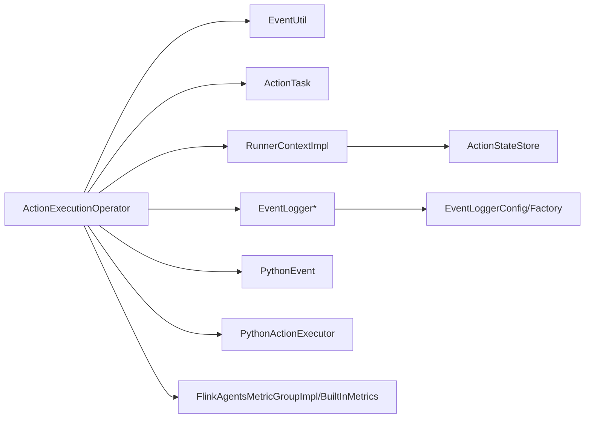

# 事件处理流程

<cite>
**本文引用的文件**
- [ActionExecutionOperator.java](file://runtime/src/main/java/org/apache/flink/agents/runtime/operator/ActionExecutionOperator.java)
- [EventUtil.java](file://runtime/src/main/java/org/apache/flink/agents/runtime/utils/EventUtil.java)
- [ActionTask.java](file://runtime/src/main/java/org/apache/flink/agents/runtime/operator/ActionTask.java)
- [JavaActionTask.java](file://runtime/src/main/java/org/apache/flink/agents/runtime/operator/JavaActionTask.java)
- [PythonActionTask.java](file://runtime/src/main/java/org/apache/flink/agents/runtime/python/operator/PythonActionTask.java)
- [PythonGeneratorActionTask.java](file://runtime/src/main/java/org/apache/flink/agents/runtime/python/operator/PythonGeneratorActionTask.java)
- [RunnerContextImpl.java](file://runtime/src/main/java/org/apache/flink/agents/runtime/context/RunnerContextImpl.java)
- [ActionStateUtil.java](file://runtime/src/main/java/org/apache/flink/agents/runtime/actionstate/ActionStateUtil.java)
- [EventLogRecordJsonDeserializer.java](file://runtime/src/main/java/org/apache/flink/agents/runtime/eventlog/EventLogRecordJsonDeserializer.java)
- [PythonEvent.java](file://runtime/src/main/java/org/apache/flink/agents/runtime/python/event/PythonEvent.java)
- [ActionExecutionOperatorTest.java](file://runtime/src/test/java/org/apache/flink/agents/runtime/operator/ActionExecutionOperatorTest.java)
- [FlinkAgentsMetricGroup.java](file://api/src/main/java/org/apache/flink/agents/api/metrics/FlinkAgentsMetricGroup.java)
- [FlinkAgentsMetricGroupImpl.java](file://runtime/src/main/java/org/apache/flink/agents/runtime/metrics/FlinkAgentsMetricGroupImpl.java)
- [BuiltInMetrics.java](file://runtime/src/main/java/org/apache/flink/agents/runtime/metrics/BuiltInMetrics.java)
- [EventLoggerConfig.java](file://api/src/main/java/org/apache/flink/agents/api/logger/EventLoggerConfig.java)
- [EventLoggerFactory.java](file://api/src/main/java/org/apache/flink/agents/api/logger/EventLoggerFactory.java)
</cite>

## 目录
1. [简介](#简介)
2. [项目结构](#项目结构)
3. [核心组件](#核心组件)
4. [架构总览](#架构总览)
5. [详细组件分析](#详细组件分析)
6. [依赖关系分析](#依赖关系分析)
7. [性能考量](#性能考量)
8. [故障排查指南](#故障排查指南)
9. [结论](#结论)
10. [附录](#附录)

## 简介
本技术文档围绕 ActionExecutionOperator 的事件处理流程进行深入解析，覆盖从上游数据接收、InputEvent 包装、事件生命周期管理、分类处理（OutputEvent 直传与非 OutputEvent 动作触发）、序列化与反序列化、事件上下文维护、错误处理与异常传播，以及性能优化与调试技巧。目标读者为系统架构师与高级开发者。

## 项目结构
本仓库采用多模块组织，与事件处理相关的关键模块如下：
- runtime：运行时核心，包含 ActionExecutionOperator、ActionTask 及其 Java/Python 实现、RunnerContext、状态存储与度量等
- api：公共 API，包含 Event、InputEvent、OutputEvent、EventContext、EventLogger 等
- plan：计划与资源定义，包含 AgentPlan、Action、资源提供者等
- python：Python 侧 API 与运行时桥接，包含 PythonEvent、PythonActionExecutor 等

图表来源
- [ActionExecutionOperator.java](file://runtime/src/main/java/org/apache/flink/agents/runtime/operator/ActionExecutionOperator.java#L118-L119)
- [ActionTask.java](file://runtime/src/main/java/org/apache/flink/agents/runtime/operator/ActionTask.java#L43-L43)
- [JavaActionTask.java](file://runtime/src/main/java/org/apache/flink/agents/runtime/operator/JavaActionTask.java#L39-L39)
- [PythonActionTask.java](file://runtime/src/main/java/org/apache/flink/agents/runtime/python/operator/PythonActionTask.java#L30-L36)
- [PythonGeneratorActionTask.java](file://runtime/src/main/java/org/apache/flink/agents/runtime/python/operator/PythonGeneratorActionTask.java#L26-L27)
- [RunnerContextImpl.java](file://runtime/src/main/java/org/apache/flink/agents/runtime/context/RunnerContextImpl.java#L60-L60)
- [PythonEvent.java](file://runtime/src/main/java/org/apache/flink/agents/runtime/python/event/PythonEvent.java#L63-L100)

章节来源
- [ActionExecutionOperator.java](file://runtime/src/main/java/org/apache/flink/agents/runtime/operator/ActionExecutionOperator.java#L118-L119)

## 核心组件
- ActionExecutionOperator：事件入口与调度器，负责将上游输入包装为 InputEvent，按键分区顺序处理事件，分发动作任务，维护当前处理键集合与待处理队列，支持 Java/Python 动作与异步恢复。
- ActionTask 及其实现：封装单个代码块的动作执行，返回 ActionTaskResult，指示是否完成及是否生成下一个 ActionTask。
- RunnerContextImpl：动作执行上下文，提供内存对象、资源访问、持久化度量、事件收集与派发、细粒度持久化执行（durable execution）能力。
- EventUtil：事件类型判断工具，区分 InputEvent 与 OutputEvent（含 PythonEvent）。
- PythonEvent/PythonActionExecutor：Python 事件与执行桥接，支持 Python 动作与协程 awaitable 的异步执行与恢复。
- ActionStateUtil/ActionStateStore：事件与动作的状态持久化与恢复，支持 Kafka 或内存后端。

章节来源
- [ActionExecutionOperator.java](file://runtime/src/main/java/org/apache/flink/agents/runtime/operator/ActionExecutionOperator.java#L118-L119)
- [ActionTask.java](file://runtime/src/main/java/org/apache/flink/agents/runtime/operator/ActionTask.java#L43-L43)
- [RunnerContextImpl.java](file://runtime/src/main/java/org/apache/flink/agents/runtime/context/RunnerContextImpl.java#L60-L60)
- [EventUtil.java](file://runtime/src/main/java/org/apache/flink/agents/runtime/utils/EventUtil.java#L26-L48)
- [PythonEvent.java](file://runtime/src/main/java/org/apache/flink/agents/runtime/python/event/PythonEvent.java#L63-L100)

## 架构总览
ActionExecutionOperator 在流式处理中作为 OneInputStreamOperator，接收上游数据，按键分区维护有序队列，将输入包装为 InputEvent 后进入事件处理循环。根据事件类型决定直接下游直传或触发动作执行；动作执行通过 RunnerContext 维护内存与资源，产出新的事件并递归处理，直至完成。

图表来源
- [ActionExecutionOperator.java](file://runtime/src/main/java/org/apache/flink/agents/runtime/operator/ActionExecutionOperator.java#L345-L405)
- [EventUtil.java](file://runtime/src/main/java/org/apache/flink/agents/runtime/utils/EventUtil.java#L33-L47)
- [ActionTask.java](file://runtime/src/main/java/org/apache/flink/agents/runtime/operator/ActionTask.java#L90-L92)
- [RunnerContextImpl.java](file://runtime/src/main/java/org/apache/flink/agents/runtime/context/RunnerContextImpl.java#L162-L170)

## 详细组件分析

### 事件接收与包装：processElement() 与 wrapToInputEvent()
- 接收上游 StreamRecord，提取值并包装为 InputEvent；若记录带时间戳，则设置到 InputEvent 的源时间戳。
- 将当前键加入按键队列尾段，用于水位线推进与键级有序处理。
- 若当前键已有动作在处理，则将新事件入队 pendingInputEventsKState；否则立即调用 processEvent()。

图表来源
- [ActionExecutionOperator.java](file://runtime/src/main/java/org/apache/flink/agents/runtime/operator/ActionExecutionOperator.java#L345-L366)
- [ActionExecutionOperator.java](file://runtime/src/main/java/org/apache/flink/agents/runtime/operator/ActionExecutionOperator.java#L809-L818)

章节来源
- [ActionExecutionOperator.java](file://runtime/src/main/java/org/apache/flink/agents/runtime/operator/ActionExecutionOperator.java#L345-L366)
- [ActionExecutionOperator.java](file://runtime/src/main/java/org/apache/flink/agents/runtime/operator/ActionExecutionOperator.java#L809-L818)

### 事件生命周期与分类处理：processEvent()
- 判断事件类型：
  - OutputEvent：直接从 OutputEvent 中取出下游数据，按是否携带源时间戳选择带/不带时间戳输出。
  - 非 OutputEvent：
    - 标记当前键正在处理，初始化/递增消息序号。
    - 依据事件类型获取触发的动作列表，创建 ActionTask 并入队等待执行。
    - 对于 InputEvent，提交一个 mailbox 任务尝试处理该键的动作队列。
- 通知机制：事件处理前后通过 EventLogger 与监听器回调记录与通知。

图表来源
- [ActionExecutionOperator.java](file://runtime/src/main/java/org/apache/flink/agents/runtime/operator/ActionExecutionOperator.java#L372-L405)
- [EventUtil.java](file://runtime/src/main/java/org/apache/flink/agents/runtime/utils/EventUtil.java#L33-L47)
- [ActionExecutionOperator.java](file://runtime/src/main/java/org/apache/flink/agents/runtime/operator/ActionExecutionOperator.java#L820-L832)

章节来源
- [ActionExecutionOperator.java](file://runtime/src/main/java/org/apache/flink/agents/runtime/operator/ActionExecutionOperator.java#L372-L405)
- [EventUtil.java](file://runtime/src/main/java/org/apache/flink/agents/runtime/utils/EventUtil.java#L33-L47)
- [ActionExecutionOperator.java](file://runtime/src/main/java/org/apache/flink/agents/runtime/operator/ActionExecutionOperator.java#L820-L832)

### 动作执行与递归处理：processActionTaskForKey()
- 从 keyed state 出队一个 ActionTask，创建/切换 RunnerContext，设置持久化执行上下文。
- 若 ActionState 已完成则跳过执行并回放记忆与事件；否则执行 ActionTask.invoke()，产出 ActionTaskResult。
- 对每个输出事件调用 processEvent() 递归处理；根据结果决定：
  - 完成：记录指标、清理感官记忆、持久化短期记忆、尝试处理下一个 InputEvent 或水位线。
  - 未完成：保留上下文，将生成的 ActionTask 入队继续执行。
- 恢复与修剪：在完成时清理过期状态，避免无限增长。

图表来源
- [ActionExecutionOperator.java](file://runtime/src/main/java/org/apache/flink/agents/runtime/operator/ActionExecutionOperator.java#L439-L602)
- [RunnerContextImpl.java](file://runtime/src/main/java/org/apache/flink/agents/runtime/context/RunnerContextImpl.java#L405-L412)
- [ActionExecutionOperator.java](file://runtime/src/main/java/org/apache/flink/agents/runtime/operator/ActionExecutionOperator.java#L947-L1006)

章节来源
- [ActionExecutionOperator.java](file://runtime/src/main/java/org/apache/flink/agents/runtime/operator/ActionExecutionOperator.java#L439-L602)
- [RunnerContextImpl.java](file://runtime/src/main/java/org/apache/flink/agents/runtime/context/RunnerContextImpl.java#L405-L412)
- [ActionExecutionOperator.java](file://runtime/src/main/java/org/apache/flink/agents/runtime/operator/ActionExecutionOperator.java#L947-L1006)

### 动作任务与执行模型
- JavaActionTask：在 JDK 21+ 支持 executeAsync，通过 ContinuationActionExecutor 与 ContinuationContext 实现细粒度异步；在 JDK < 21 回退同步。
- PythonActionTask：首次执行返回 awaitable 引用，随后使用 PythonGeneratorActionTask 调用 callPythonAwaitable，逐步推进协程。
- ActionTaskResult：统一承载完成标志、输出事件列表与可选的“下一动作任务”。

图表来源
- [ActionTask.java](file://runtime/src/main/java/org/apache/flink/agents/runtime/operator/ActionTask.java#L43-L133)
- [JavaActionTask.java](file://runtime/src/main/java/org/apache/flink/agents/runtime/operator/JavaActionTask.java#L39-L92)
- [PythonActionTask.java](file://runtime/src/main/java/org/apache/flink/agents/runtime/python/operator/PythonActionTask.java#L30-L73)
- [PythonGeneratorActionTask.java](file://runtime/src/main/java/org/apache/flink/agents/runtime/python/operator/PythonGeneratorActionTask.java#L26-L63)

章节来源
- [JavaActionTask.java](file://runtime/src/main/java/org/apache/flink/agents/runtime/operator/JavaActionTask.java#L39-L92)
- [PythonActionTask.java](file://runtime/src/main/java/org/apache/flink/agents/runtime/python/operator/PythonActionTask.java#L30-L73)
- [PythonGeneratorActionTask.java](file://runtime/src/main/java/org/apache/flink/agents/runtime/python/operator/PythonGeneratorActionTask.java#L26-L63)
- [ActionTask.java](file://runtime/src/main/java/org/apache/flink/agents/runtime/operator/ActionTask.java#L90-L133)

### 事件上下文与内存管理：RunnerContextImpl
- 提供发送事件、清点与派发事件、检查挂起事件、访问短期/感官记忆、长期记忆（可选外部向量库）与资源。
- durableExecute/durableExecuteAsync：细粒度持久化执行，记录 CallResult 并在恢复时匹配跳过已执行调用。
- 内存更新收集：通过 MemoryContext 记录短期与感官记忆的增量，在动作完成后持久化。

图表来源
- [RunnerContextImpl.java](file://runtime/src/main/java/org/apache/flink/agents/runtime/context/RunnerContextImpl.java#L150-L170)
- [RunnerContextImpl.java](file://runtime/src/main/java/org/apache/flink/agents/runtime/context/RunnerContextImpl.java#L194-L241)
- [RunnerContextImpl.java](file://runtime/src/main/java/org/apache/flink/agents/runtime/context/RunnerContextImpl.java#L284-L353)

章节来源
- [RunnerContextImpl.java](file://runtime/src/main/java/org/apache/flink/agents/runtime/context/RunnerContextImpl.java#L150-L170)
- [RunnerContextImpl.java](file://runtime/src/main/java/org/apache/flink/agents/runtime/context/RunnerContextImpl.java#L194-L241)
- [RunnerContextImpl.java](file://runtime/src/main/java/org/apache/flink/agents/runtime/context/RunnerContextImpl.java#L284-L353)

### 序列化与反序列化：事件与日志
- 事件序列化：RunnerContextImpl 在 sendEvent() 前校验事件 JSON 可序列化；ActionStateUtil 使用 UUID 为事件/动作生成稳定标识，便于状态持久化与去重。
- 日志反序列化：EventLogRecordJsonDeserializer 通过 eventType 字段动态反序列化具体事件类型，确保多态事件的正确还原。

图表来源
- [RunnerContextImpl.java](file://runtime/src/main/java/org/apache/flink/agents/runtime/context/RunnerContextImpl.java#L150-L159)
- [ActionStateUtil.java](file://runtime/src/main/java/org/apache/flink/agents/runtime/actionstate/ActionStateUtil.java#L61-L83)
- [EventLogRecordJsonDeserializer.java](file://runtime/src/main/java/org/apache/flink/agents/runtime/eventlog/EventLogRecordJsonDeserializer.java#L89-L121)

章节来源
- [RunnerContextImpl.java](file://runtime/src/main/java/org/apache/flink/agents/runtime/context/RunnerContextImpl.java#L150-L159)
- [ActionStateUtil.java](file://runtime/src/main/java/org/apache/flink/agents/runtime/actionstate/ActionStateUtil.java#L61-L83)
- [EventLogRecordJsonDeserializer.java](file://runtime/src/main/java/org/apache/flink/agents/runtime/eventlog/EventLogRecordJsonDeserializer.java#L89-L121)

### 错误处理与异常传播
- 异常捕获与传播：tryProcessActionTaskForKey() 捕获异常并通过 mailbox 抛出 ActionTaskExecutionException，保证异常在任务线程内可见且可追踪。
- Python 协程异常：PythonGeneratorActionTask 在 awaitable 丢失时回退到重新执行；异常通过 DurableExecutionException 序列化持久化并在恢复时重建。
- 测试验证：单元测试覆盖未捕获异常链路、异步异常恢复等场景，确保异常可串行化并正确传播。

图表来源
- [ActionExecutionOperator.java](file://runtime/src/main/java/org/apache/flink/agents/runtime/operator/ActionExecutionOperator.java#L426-L437)
- [ActionExecutionOperator.java](file://runtime/src/main/java/org/apache/flink/agents/runtime/operator/ActionExecutionOperator.java#L1125-L1131)
- [ActionExecutionOperatorTest.java](file://runtime/src/test/java/org/apache/flink/agents/runtime/operator/ActionExecutionOperatorTest.java#L805-L882)

章节来源
- [ActionExecutionOperator.java](file://runtime/src/main/java/org/apache/flink/agents/runtime/operator/ActionExecutionOperator.java#L426-L437)
- [ActionExecutionOperator.java](file://runtime/src/main/java/org/apache/flink/agents/runtime/operator/ActionExecutionOperator.java#L1125-L1131)
- [ActionExecutionOperatorTest.java](file://runtime/src/test/java/org/apache/flink/agents/runtime/operator/ActionExecutionOperatorTest.java#L805-L882)

## 依赖关系分析
- 组件耦合：
  - ActionExecutionOperator 依赖 EventUtil 判定事件类型，依赖 ActionTask 抽象与 Java/Python 实现，依赖 RunnerContext 维护上下文与内存。
  - RunnerContextImpl 依赖 ActionStateStore（可选）实现细粒度持久化执行，依赖资源与长期记忆后端。
  - PythonEvent/PythonActionExecutor 用于跨语言桥接，支持协程 awaitable 的异步与恢复。
- 外部集成：
  - EventLogger 通过工厂注册不同实现（如文件），支持过滤与属性配置。
  - 度量系统通过 FlinkAgentsMetricGroup 提供计数器、计量器、直方图等。

图表来源
- [ActionExecutionOperator.java](file://runtime/src/main/java/org/apache/flink/agents/runtime/operator/ActionExecutionOperator.java#L118-L119)
- [EventUtil.java](file://runtime/src/main/java/org/apache/flink/agents/runtime/utils/EventUtil.java#L26-L48)
- [RunnerContextImpl.java](file://runtime/src/main/java/org/apache/flink/agents/runtime/context/RunnerContextImpl.java#L60-L60)
- [EventLoggerConfig.java](file://api/src/main/java/org/apache/flink/agents/api/logger/EventLoggerConfig.java#L59-L149)
- [EventLoggerFactory.java](file://api/src/main/java/org/apache/flink/agents/api/logger/EventLoggerFactory.java#L70-L153)
- [FlinkAgentsMetricGroupImpl.java](file://runtime/src/main/java/org/apache/flink/agents/runtime/metrics/FlinkAgentsMetricGroupImpl.java#L69-L104)
- [BuiltInMetrics.java](file://runtime/src/main/java/org/apache/flink/agents/runtime/metrics/BuiltInMetrics.java#L34-L72)

章节来源
- [ActionExecutionOperator.java](file://runtime/src/main/java/org/apache/flink/agents/runtime/operator/ActionExecutionOperator.java#L118-L119)
- [EventUtil.java](file://runtime/src/main/java/org/apache/flink/agents/runtime/utils/EventUtil.java#L26-L48)
- [RunnerContextImpl.java](file://runtime/src/main/java/org/apache/flink/agents/runtime/context/RunnerContextImpl.java#L60-L60)
- [EventLoggerConfig.java](file://api/src/main/java/org/apache/flink/agents/api/logger/EventLoggerConfig.java#L59-L149)
- [EventLoggerFactory.java](file://api/src/main/java/org/apache/flink/agents/api/logger/EventLoggerFactory.java#L70-L153)
- [FlinkAgentsMetricGroupImpl.java](file://runtime/src/main/java/org/apache/flink/agents/runtime/metrics/FlinkAgentsMetricGroupImpl.java#L69-L104)
- [BuiltInMetrics.java](file://runtime/src/main/java/org/apache/flink/agents/runtime/metrics/BuiltInMetrics.java#L34-L72)

## 性能考量
- 邮件驱动与有序性：通过 MailboxExecutor 与 SegmentedQueue 保障同一键内的事件顺序与动作串行，避免锁竞争。
- 状态与内存：
  - 使用 CachedMemoryStore 缓存短期与感官记忆，减少频繁 IO。
  - 动作完成后批量持久化短期记忆，降低写放大。
- 持久化执行：
  - DurableExecutionContext 记录 CallResult，恢复时跳过已完成调用，显著降低重算成本。
- 度量与可观测性：
  - BuiltInMetrics 提供事件/动作吞吐与每动作计数器与计量器，结合直方图观察延迟分布。
  - EventLogger 支持即时刷新（测试阶段）或批处理策略（生产建议）。

章节来源
- [ActionExecutionOperator.java](file://runtime/src/main/java/org/apache/flink/agents/runtime/operator/ActionExecutionOperator.java#L439-L602)
- [RunnerContextImpl.java](file://runtime/src/main/java/org/apache/flink/agents/runtime/context/RunnerContextImpl.java#L405-L412)
- [BuiltInMetrics.java](file://runtime/src/main/java/org/apache/flink/agents/runtime/metrics/BuiltInMetrics.java#L34-L72)
- [FlinkAgentsMetricGroupImpl.java](file://runtime/src/main/java/org/apache/flink/agents/runtime/metrics/FlinkAgentsMetricGroupImpl.java#L69-L104)

## 故障排查指南
- 线程一致性：
  - 必须在任务邮箱线程内访问 RunnerContext 与状态，否则抛出线程检查异常。可通过测试用例定位问题。
- 异常链路：
  - 使用 ActionTaskExecutionException 包裹底层异常，结合日志与 EventLogger 定位根因。
  - Python 协程异常通过 DurableExecutionException 序列化持久化，恢复时重建异常信息。
- 状态与恢复：
  - 检查 ActionStateStore 是否启用与重建标记；确认 checkpoint 完成后 pruneState 的清理逻辑。
- 事件序列化：
  - 确保所有发送到 RunnerContext 的事件具备 JSON 可序列化能力；日志反序列化需包含 eventType 字段。

章节来源
- [ActionExecutionOperatorTest.java](file://runtime/src/test/java/org/apache/flink/agents/runtime/operator/ActionExecutionOperatorTest.java#L154-L171)
- [ActionExecutionOperator.java](file://runtime/src/main/java/org/apache/flink/agents/runtime/operator/ActionExecutionOperator.java#L426-L437)
- [RunnerContextImpl.java](file://runtime/src/main/java/org/apache/flink/agents/runtime/context/RunnerContextImpl.java#L150-L159)
- [EventLogRecordJsonDeserializer.java](file://runtime/src/main/java/org/apache/flink/agents/runtime/eventlog/EventLogRecordJsonDeserializer.java#L89-L121)

## 结论
ActionExecutionOperator 通过严格的事件类型判定、有序的键分区处理、细粒度的 RunnerContext 上下文与持久化执行机制，实现了高可靠、可观测、可恢复的事件驱动动作执行流水线。配合度量与日志系统，可在复杂场景下快速定位问题并持续优化性能。

## 附录
- 关键路径参考
  - 事件接收与包装：[processElement](file://runtime/src/main/java/org/apache/flink/agents/runtime/operator/ActionExecutionOperator.java#L345-L366)，[wrapToInputEvent](file://runtime/src/main/java/org/apache/flink/agents/runtime/operator/ActionExecutionOperator.java#L809-L818)
  - 事件分类与处理：[processEvent](file://runtime/src/main/java/org/apache/flink/agents/runtime/operator/ActionExecutionOperator.java#L372-L405)，[EventUtil](file://runtime/src/main/java/org/apache/flink/agents/runtime/utils/EventUtil.java#L33-L47)
  - 动作执行与递归：[processActionTaskForKey](file://runtime/src/main/java/org/apache/flink/agents/runtime/operator/ActionExecutionOperator.java#L439-L602)
  - 动作任务模型：[ActionTask](file://runtime/src/main/java/org/apache/flink/agents/runtime/operator/ActionTask.java#L43-L133)，[JavaActionTask](file://runtime/src/main/java/org/apache/flink/agents/runtime/operator/JavaActionTask.java#L39-L92)，[PythonActionTask](file://runtime/src/main/java/org/apache/flink/agents/runtime/python/operator/PythonActionTask.java#L30-L73)，[PythonGeneratorActionTask](file://runtime/src/main/java/org/apache/flink/agents/runtime/python/operator/PythonGeneratorActionTask.java#L26-L63)
  - 上下文与持久化：[RunnerContextImpl](file://runtime/src/main/java/org/apache/flink/agents/runtime/context/RunnerContextImpl.java#L150-L353)
  - 序列化与日志：[ActionStateUtil](file://runtime/src/main/java/org/apache/flink/agents/runtime/actionstate/ActionStateUtil.java#L61-L83)，[EventLogRecordJsonDeserializer](file://runtime/src/main/java/org/apache/flink/agents/runtime/eventlog/EventLogRecordJsonDeserializer.java#L89-L121)，[PythonEvent](file://runtime/src/main/java/org/apache/flink/agents/runtime/python/event/PythonEvent.java#L63-L100)
  - 度量与日志配置：[FlinkAgentsMetricGroup](file://api/src/main/java/org/apache/flink/agents/api/metrics/FlinkAgentsMetricGroup.java#L40-L92)，[FlinkAgentsMetricGroupImpl](file://runtime/src/main/java/org/apache/flink/agents/runtime/metrics/FlinkAgentsMetricGroupImpl.java#L69-L104)，[BuiltInMetrics](file://runtime/src/main/java/org/apache/flink/agents/runtime/metrics/BuiltInMetrics.java#L34-L72)，[EventLoggerConfig](file://api/src/main/java/org/apache/flink/agents/api/logger/EventLoggerConfig.java#L59-L149)，[EventLoggerFactory](file://api/src/main/java/org/apache/flink/agents/api/logger/EventLoggerFactory.java#L70-L153)