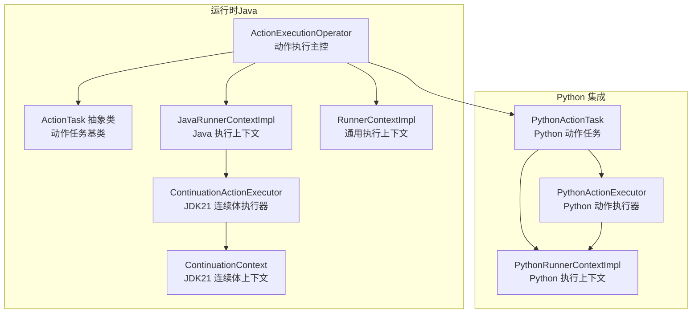
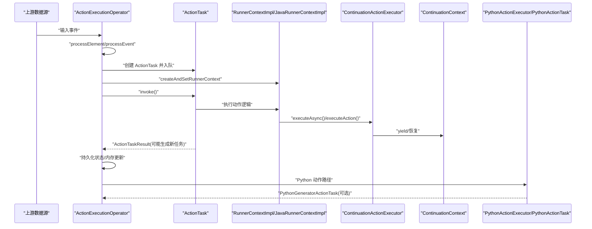
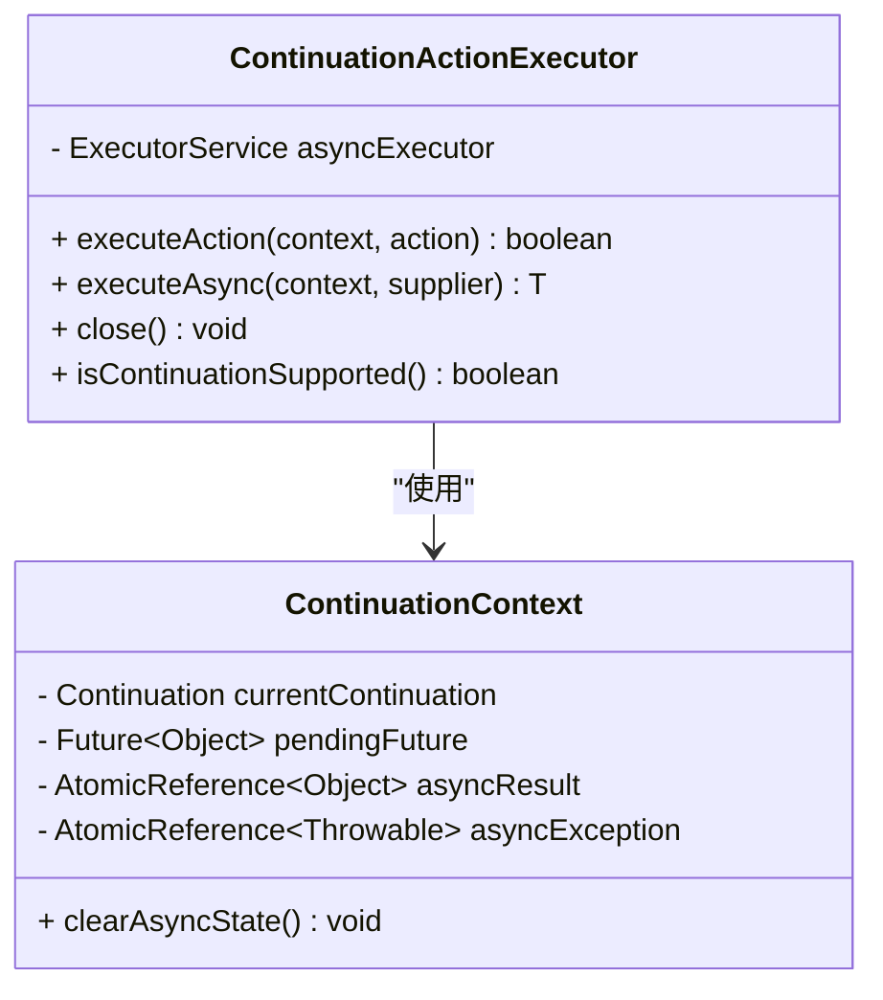
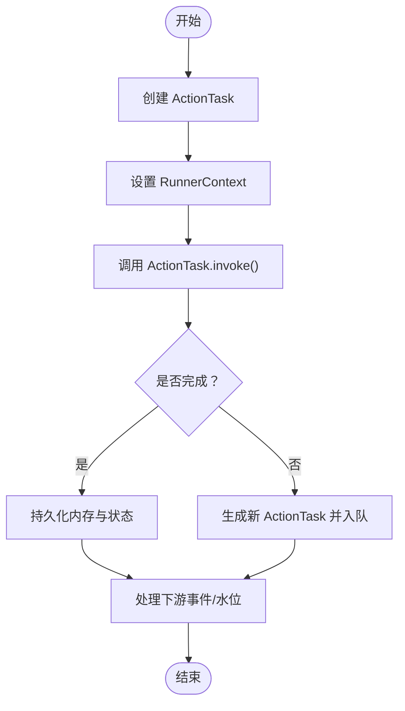
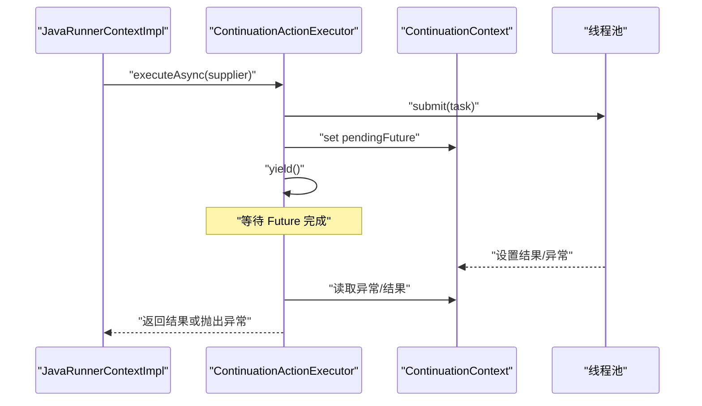
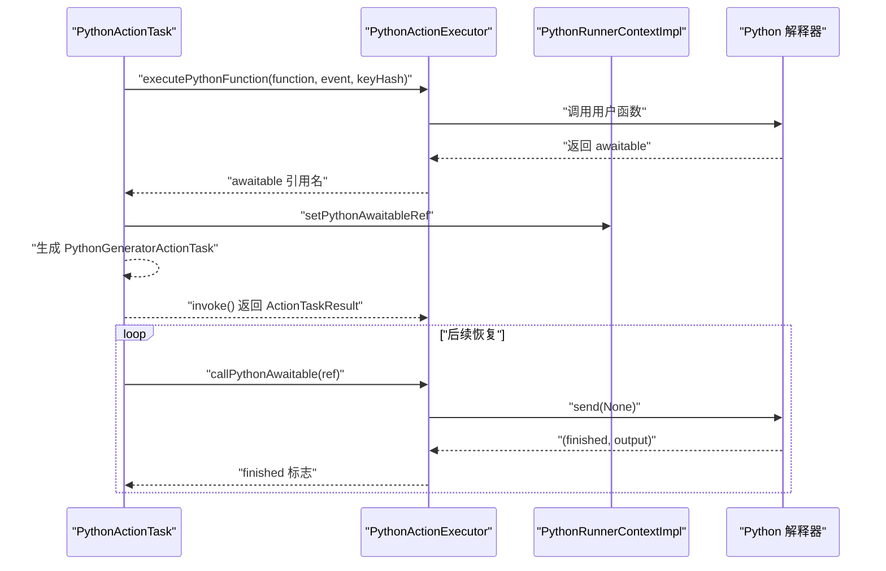
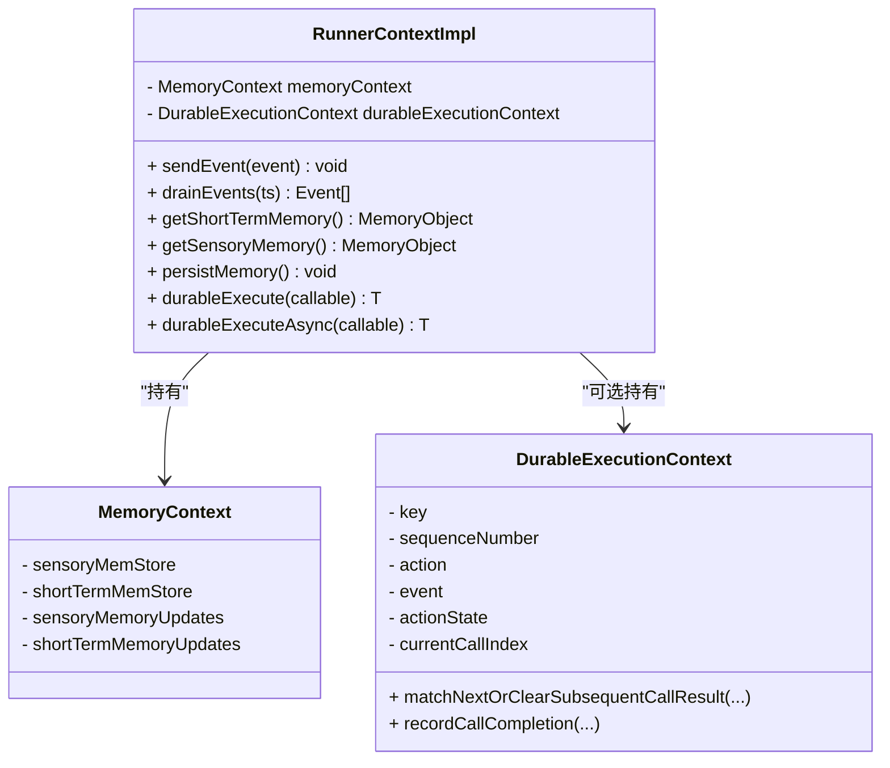
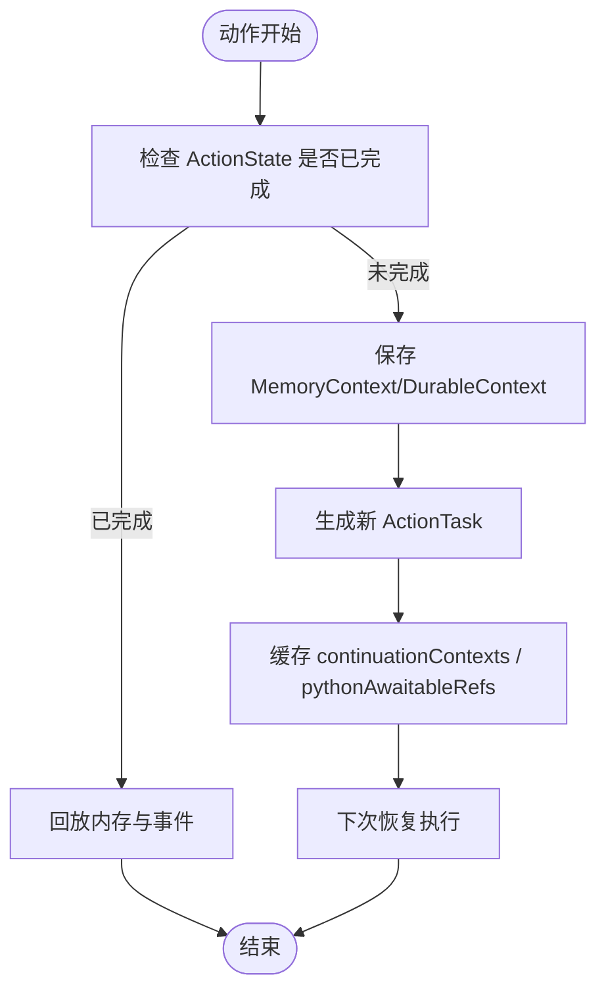
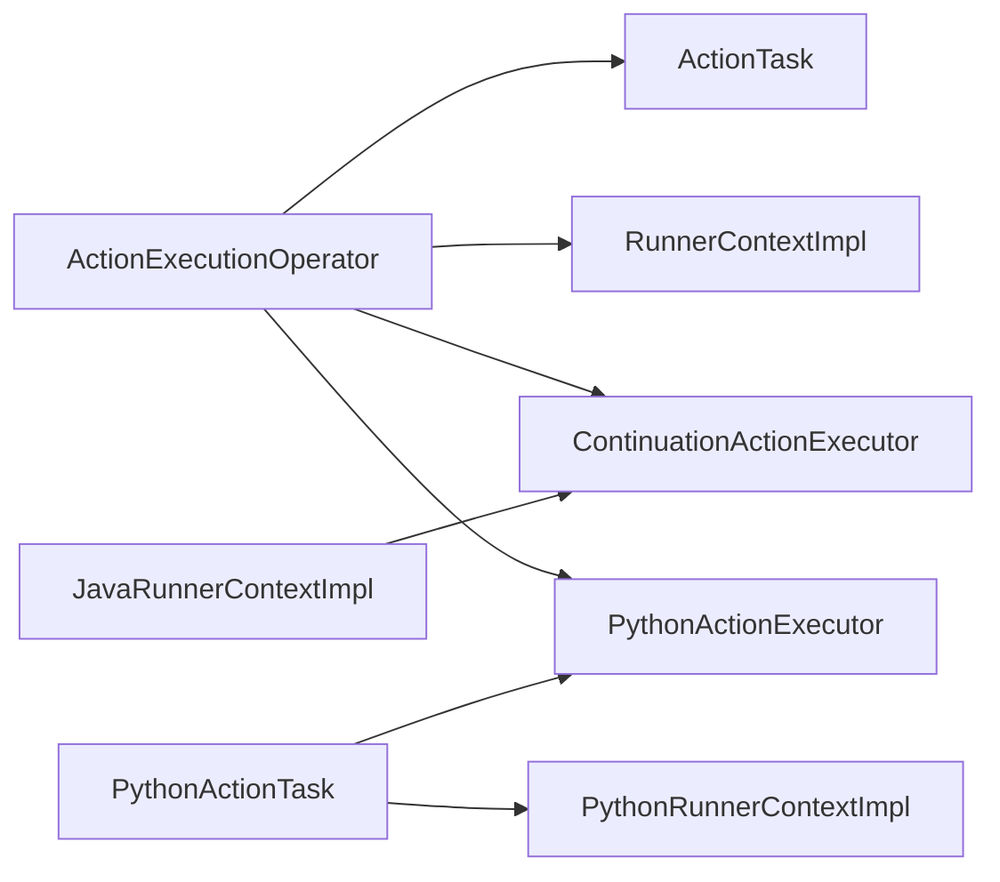

# 异步执行策略

<cite>
**本文引用的文件**
- [ContinuationActionExecutor.java](file://runtime/src/main/java21/org/apache/flink/agents/runtime/async/ContinuationActionExecutor.java)
- [ContinuationContext.java](file://runtime/src/main/java21/org/apache/flink/agents/runtime/async/ContinuationContext.java)
- [ActionExecutionOperator.java](file://runtime/src/main/java/org/apache/flink/agents/runtime/operator/ActionExecutionOperator.java)
- [ActionTask.java](file://runtime/src/main/java/org/apache/flink/agents/runtime/operator/ActionTask.java)
- [RunnerContextImpl.java](file://runtime/src/main/java/org/apache/flink/agents/runtime/context/RunnerContextImpl.java)
- [PythonActionTask.java](file://runtime/src/main/java/org/apache/flink/agents/runtime/python/operator/PythonActionTask.java)
- [PythonActionExecutor.java](file://runtime/src/main/java/org/apache/flink/agents/runtime/python/utils/PythonActionExecutor.java)
- [PythonRunnerContextImpl.java](file://runtime/src/main/java/org/apache/flink/agents/runtime/python/context/PythonRunnerContextImpl.java)
- [ActionExecutionOperatorTest.java](file://runtime/src/test/java/org/apache/flink/agents/runtime/operator/ActionExecutionOperatorTest.java)
</cite>

## 目录
1. [引言](#引言)
2. [项目结构](#项目结构)
3. [核心组件](#核心组件)
4. [架构总览](#架构总览)
5. [详细组件分析](#详细组件分析)
6. [依赖关系分析](#依赖关系分析)
7. [性能考量](#性能考量)
8. [故障排查指南](#故障排查指南)
9. [结论](#结论)

## 引言
本文件围绕 ActionExecutionOperator 的异步执行策略进行深入技术解析，重点覆盖以下方面：
- ContinuationActionExecutor 的线程池与任务调度机制
- ActionTask 的创建与执行流程（Java 与 Python 动作）
- 上下文管理：RunnerContextImpl 的内存上下文与持久化执行上下文
- ContinuationContext 的作用与实现，以及延续执行机制
- 异步执行的状态保存与恢复：actionTaskMemoryContexts 与 actionTaskDurableContexts
- 错误处理与异常传播
- Python 异步执行的特殊处理：PythonAwaitableRef 与 PythonActionExecutor
- 性能调优建议与故障排查

## 项目结构
本节聚焦与异步执行相关的核心模块与文件组织方式，便于读者快速定位实现位置。

图示来源
- [ActionExecutionOperator.java](file://runtime/src/main/java/org/apache/flink/agents/runtime/operator/ActionExecutionOperator.java#L118-L329)
- [ActionTask.java](file://runtime/src/main/java/org/apache/flink/agents/runtime/operator/ActionTask.java#L43-L92)
- [RunnerContextImpl.java](file://runtime/src/main/java/org/apache/flink/agents/runtime/context/RunnerContextImpl.java#L60-L137)
- [ContinuationActionExecutor.java](file://runtime/src/main/java21/org/apache/flink/agents/runtime/async/ContinuationActionExecutor.java#L35-L97)
- [ContinuationContext.java](file://runtime/src/main/java21/org/apache/flink/agents/runtime/async/ContinuationContext.java#L26-L62)
- [PythonActionTask.java](file://runtime/src/main/java/org/apache/flink/agents/runtime/python/operator/PythonActionTask.java#L36-L72)
- [PythonActionExecutor.java](file://runtime/src/main/java/org/apache/flink/agents/runtime/python/utils/PythonActionExecutor.java#L36-L111)
- [PythonRunnerContextImpl.java](file://runtime/src/main/java/org/apache/flink/agents/runtime/python/context/PythonRunnerContextImpl.java#L33-L67)

章节来源
- [ActionExecutionOperator.java](file://runtime/src/main/java/org/apache/flink/agents/runtime/operator/ActionExecutionOperator.java#L118-L329)
- [ActionTask.java](file://runtime/src/main/java/org/apache/flink/agents/runtime/operator/ActionTask.java#L43-L92)
- [RunnerContextImpl.java](file://runtime/src/main/java/org/apache/flink/agents/runtime/context/RunnerContextImpl.java#L60-L137)
- [ContinuationActionExecutor.java](file://runtime/src/main/java21/org/apache/flink/agents/runtime/async/ContinuationActionExecutor.java#L35-L97)
- [ContinuationContext.java](file://runtime/src/main/java21/org/apache/flink/agents/runtime/async/ContinuationContext.java#L26-L62)
- [PythonActionTask.java](file://runtime/src/main/java/org/apache/flink/agents/runtime/python/operator/PythonActionTask.java#L36-L72)
- [PythonActionExecutor.java](file://runtime/src/main/java/org/apache/flink/agents/runtime/python/utils/PythonActionExecutor.java#L36-L111)
- [PythonRunnerContextImpl.java](file://runtime/src/main/java/org/apache/flink/agents/runtime/python/context/PythonRunnerContextImpl.java#L33-L67)

## 核心组件
- ActionExecutionOperator：动作执行主控，负责事件接收、动作触发、任务队列管理、上下文创建与持久化、水位推进等。
- ActionTask：动作任务抽象，定义了单个代码块的执行接口与结果封装。
- RunnerContextImpl：通用执行上下文，提供事件发送、内存访问、长短期记忆、资源获取、细粒度持久化执行上下文等能力。
- JavaRunnerContextImpl：Java 动作专用上下文，持有 ContinuationActionExecutor 与 ContinuationContext，支持 JDK21 连续体异步。
- ContinuationActionExecutor：基于 JDK21 连续体的异步执行器，内部维护固定大小线程池，协调异步任务提交与恢复。
- ContinuationContext：JDK21 特有的上下文，保存当前连续体、待完成 Future、异步结果与异常引用。
- PythonActionTask：Python 动作任务，负责在 Python 环境中执行用户函数，并在需要时生成 PythonGeneratorActionTask 继续后续步骤。
- PythonActionExecutor：桥接 Java 与 Python 的执行器，负责初始化 Python RunnerContext、执行 Python 函数、管理 awaitable 对象。
- PythonRunnerContextImpl：Python 动作专用上下文，保存 Python awaitable 引用以便后续恢复。

章节来源
- [ActionExecutionOperator.java](file://runtime/src/main/java/org/apache/flink/agents/runtime/operator/ActionExecutionOperator.java#L118-L329)
- [ActionTask.java](file://runtime/src/main/java/org/apache/flink/agents/runtime/operator/ActionTask.java#L43-L92)
- [RunnerContextImpl.java](file://runtime/src/main/java/org/apache/flink/agents/runtime/context/RunnerContextImpl.java#L60-L137)
- [ContinuationActionExecutor.java](file://runtime/src/main/java21/org/apache/flink/agents/runtime/async/ContinuationActionExecutor.java#L35-L97)
- [ContinuationContext.java](file://runtime/src/main/java21/org/apache/flink/agents/runtime/async/ContinuationContext.java#L26-L62)
- [PythonActionTask.java](file://runtime/src/main/java/org/apache/flink/agents/runtime/python/operator/PythonActionTask.java#L36-L72)
- [PythonActionExecutor.java](file://runtime/src/main/java/org/apache/flink/agents/runtime/python/utils/PythonActionExecutor.java#L36-L111)
- [PythonRunnerContextImpl.java](file://runtime/src/main/java/org/apache/flink/agents/runtime/python/context/PythonRunnerContextImpl.java#L33-L67)

## 架构总览
下图展示异步执行从事件到动作任务再到上下文与执行器的整体流程。

图示来源
- [ActionExecutionOperator.java](file://runtime/src/main/java/org/apache/flink/agents/runtime/operator/ActionExecutionOperator.java#L344-L602)
- [ActionTask.java](file://runtime/src/main/java/org/apache/flink/agents/runtime/operator/ActionTask.java#L90-L92)
- [RunnerContextImpl.java](file://runtime/src/main/java/org/apache/flink/agents/runtime/context/RunnerContextImpl.java#L127-L137)
- [ContinuationActionExecutor.java](file://runtime/src/main/java21/org/apache/flink/agents/runtime/async/ContinuationActionExecutor.java#L60-L97)
- [ContinuationContext.java](file://runtime/src/main/java21/org/apache/flink/agents/runtime/async/ContinuationContext.java#L26-L62)
- [PythonActionTask.java](file://runtime/src/main/java/org/apache/flink/agents/runtime/python/operator/PythonActionTask.java#L46-L72)
- [PythonActionExecutor.java](file://runtime/src/main/java/org/apache/flink/agents/runtime/python/utils/PythonActionExecutor.java#L123-L149)

## 详细组件分析

### ContinuationActionExecutor 与 ContinuationContext
- 线程池管理：构造时创建固定大小线程池，用于执行异步任务；关闭时强制终止线程池。
- executeAction：若存在挂起的 Future，则检查其完成状态；否则创建或复用 Continuation，驱动执行直至 yield 或完成。
- executeAsync：提交任务到线程池，设置 pendingFuture 后通过 Continuation.yield 挂起，等待 Future 完成后恢复；根据异步结果或异常抛出对应类型。
- ContinuationContext：保存当前 Continuation、挂起的 Future、异步结果与异常引用，并提供 clearAsyncState 清理状态。

图示来源
- [ContinuationActionExecutor.java](file://runtime/src/main/java21/org/apache/flink/agents/runtime/async/ContinuationActionExecutor.java#L35-L163)
- [ContinuationContext.java](file://runtime/src/main/java21/org/apache/flink/agents/runtime/async/ContinuationContext.java#L26-L62)

章节来源
- [ContinuationActionExecutor.java](file://runtime/src/main/java21/org/apache/flink/agents/runtime/async/ContinuationActionExecutor.java#L35-L163)
- [ContinuationContext.java](file://runtime/src/main/java21/org/apache/flink/agents/runtime/async/ContinuationContext.java#L26-L62)

### ActionTask 创建与执行流程（Java）
- ActionTask 抽象定义 invoke 接口，返回 ActionTaskResult，包含是否完成、输出事件列表、以及可能生成的下一个 ActionTask。
- ActionExecutionOperator 在处理事件时，根据触发的动作创建 ActionTask 并入队；随后在 mailbox 中循环取出并执行。
- 执行期间会创建/设置 RunnerContext，并在完成后持久化内存更新与 ActionState。

图示来源
- [ActionTask.java](file://runtime/src/main/java/org/apache/flink/agents/runtime/operator/ActionTask.java#L90-L131)
- [ActionExecutionOperator.java](file://runtime/src/main/java/org/apache/flink/agents/runtime/operator/ActionExecutionOperator.java#L439-L602)

章节来源
- [ActionTask.java](file://runtime/src/main/java/org/apache/flink/agents/runtime/operator/ActionTask.java#L43-L131)
- [ActionExecutionOperator.java](file://runtime/src/main/java/org/apache/flink/agents/runtime/operator/ActionExecutionOperator.java#L439-L602)

### Java 动作的异步执行路径
- JavaRunnerContextImpl 持有 ContinuationActionExecutor 与 ContinuationContext，通过 executeAsync/executeAction 协调异步任务。
- 当动作调用异步执行时，ContinuationActionExecutor 提交任务到线程池并 yield；后续由 executeAction 检查 Future 完成状态并恢复执行。
- 若异步过程中发生异常，按 Exception/Error/RuntimeException 分类抛出，保证异常传播一致性。

图示来源
- [ContinuationActionExecutor.java](file://runtime/src/main/java21/org/apache/flink/agents/runtime/async/ContinuationActionExecutor.java#L111-L149)
- [ContinuationContext.java](file://runtime/src/main/java21/org/apache/flink/agents/runtime/async/ContinuationContext.java#L26-L62)

章节来源
- [ContinuationActionExecutor.java](file://runtime/src/main/java21/org/apache/flink/agents/runtime/async/ContinuationActionExecutor.java#L111-L149)
- [ContinuationContext.java](file://runtime/src/main/java21/org/apache/flink/agents/runtime/async/ContinuationContext.java#L26-L62)

### Python 动作的异步执行路径
- PythonActionTask 调用 PythonActionExecutor.executePythonFunction，返回 Python 协程 awaitable 的引用名。
- 若存在 awaitable，设置 PythonRunnerContextImpl 的 awaitable 引用，并生成 PythonGeneratorActionTask，后续通过 PythonActionExecutor.callPythonAwaitable 恢复执行。
- PythonActionExecutor 负责将 Java 事件转换为 Python 事件、调用用户函数、管理 awaitable 生命周期。

图示来源
- [PythonActionTask.java](file://runtime/src/main/java/org/apache/flink/agents/runtime/python/operator/PythonActionTask.java#L46-L72)
- [PythonActionExecutor.java](file://runtime/src/main/java/org/apache/flink/agents/runtime/python/utils/PythonActionExecutor.java#L123-L186)
- [PythonRunnerContextImpl.java](file://runtime/src/main/java/org/apache/flink/agents/runtime/python/context/PythonRunnerContextImpl.java#L61-L67)

章节来源
- [PythonActionTask.java](file://runtime/src/main/java/org/apache/flink/agents/runtime/python/operator/PythonActionTask.java#L46-L72)
- [PythonActionExecutor.java](file://runtime/src/main/java/org/apache/flink/agents/runtime/python/utils/PythonActionExecutor.java#L123-L186)
- [PythonRunnerContextImpl.java](file://runtime/src/main/java/org/apache/flink/agents/runtime/python/context/PythonRunnerContextImpl.java#L61-L67)

### 上下文管理：RunnerContextImpl 的内存与持久化执行上下文
- 内存上下文：MemoryContext 记录感官与短期记忆的更新列表，便于在动作完成后统一持久化。
- 持久化执行上下文：DurableExecutionContext 支持细粒度的调用结果缓存与持久化，恢复时按序匹配 CallResult，确保确定性。
- RunnerContextImpl 提供事件发送、内存对象访问、资源获取、配置读取、长短期记忆持久化与清理等能力。

图示来源
- [RunnerContextImpl.java](file://runtime/src/main/java/org/apache/flink/agents/runtime/context/RunnerContextImpl.java#L64-L137)
- [RunnerContextImpl.java](file://runtime/src/main/java/org/apache/flink/agents/runtime/context/RunnerContextImpl.java#L474-L588)

章节来源
- [RunnerContextImpl.java](file://runtime/src/main/java/org/apache/flink/agents/runtime/context/RunnerContextImpl.java#L64-L137)
- [RunnerContextImpl.java](file://runtime/src/main/java/org/apache/flink/agents/runtime/context/RunnerContextImpl.java#L474-L588)

### 状态保存与恢复：actionTaskMemoryContexts 与 actionTaskDurableContexts
- actionTaskMemoryContexts：在动作未完成时，将 MemoryContext 缓存至内存映射，供生成的新 ActionTask 恢复使用。
- actionTaskDurableContexts：对启用细粒度持久化的动作，将 DurableExecutionContext 缓存，以恢复 currentCallIndex 等状态。
- continuationContexts 与 pythonAwaitableRefs：分别缓存 Java/Python 的延续上下文与 awaitable 引用，确保跨多次 invoke 的状态一致性。

图示来源
- [ActionExecutionOperator.java](file://runtime/src/main/java/org/apache/flink/agents/runtime/operator/ActionExecutionOperator.java#L503-L572)

章节来源
- [ActionExecutionOperator.java](file://runtime/src/main/java/org/apache/flink/agents/runtime/operator/ActionExecutionOperator.java#L503-L572)

### 错误处理与异常传播
- Java 异常：ContinuationActionExecutor 在异步任务中捕获 Throwable，分别写入 asyncExceptionRef；恢复时按 Exception/Error/RuntimeException 抛出，保持与同步执行一致的语义。
- Python 异常：PythonActionExecutor 在调用用户函数失败时，清理 pendingEvents 并抛出 PythonActionExecutionException，避免污染上下文。
- 测试验证：ActionExecutionOperatorTest 包含 durableExecuteAsync 异常序列化与恢复的测试，确保异常在重启后仍可正确恢复。

章节来源
- [ContinuationActionExecutor.java](file://runtime/src/main/java21/org/apache/flink/agents/runtime/async/ContinuationActionExecutor.java#L119-L146)
- [PythonActionExecutor.java](file://runtime/src/main/java/org/apache/flink/agents/runtime/python/utils/PythonActionExecutor.java#L145-L148)
- [ActionExecutionOperatorTest.java](file://runtime/src/test/java/org/apache/flink/agents/runtime/operator/ActionExecutionOperatorTest.java#L888-L908)

## 依赖关系分析
- ActionExecutionOperator 依赖 ActionTask、RunnerContextImpl、ContinuationActionExecutor、PythonActionExecutor 等组件。
- JavaRunnerContextImpl 依赖 ContinuationActionExecutor 与 ContinuationContext，提供 executeAsync/executeAction 的桥接。
- PythonActionTask 依赖 PythonActionExecutor 与 PythonRunnerContextImpl，形成 Python 协程的 awaitable 生命周期管理。

图示来源
- [ActionExecutionOperator.java](file://runtime/src/main/java/org/apache/flink/agents/runtime/operator/ActionExecutionOperator.java#L118-L329)
- [ActionTask.java](file://runtime/src/main/java/org/apache/flink/agents/runtime/operator/ActionTask.java#L43-L92)
- [RunnerContextImpl.java](file://runtime/src/main/java/org/apache/flink/agents/runtime/context/RunnerContextImpl.java#L60-L137)
- [ContinuationActionExecutor.java](file://runtime/src/main/java21/org/apache/flink/agents/runtime/async/ContinuationActionExecutor.java#L35-L97)
- [PythonActionTask.java](file://runtime/src/main/java/org/apache/flink/agents/runtime/python/operator/PythonActionTask.java#L36-L72)
- [PythonActionExecutor.java](file://runtime/src/main/java/org/apache/flink/agents/runtime/python/utils/PythonActionExecutor.java#L36-L111)
- [PythonRunnerContextImpl.java](file://runtime/src/main/java/org/apache/flink/agents/runtime/python/context/PythonRunnerContextImpl.java#L33-L67)

章节来源
- [ActionExecutionOperator.java](file://runtime/src/main/java/org/apache/flink/agents/runtime/operator/ActionExecutionOperator.java#L118-L329)
- [ActionTask.java](file://runtime/src/main/java/org/apache/flink/agents/runtime/operator/ActionTask.java#L43-L92)
- [RunnerContextImpl.java](file://runtime/src/main/java/org/apache/flink/agents/runtime/context/RunnerContextImpl.java#L60-L137)
- [ContinuationActionExecutor.java](file://runtime/src/main/java21/org/apache/flink/agents/runtime/async/ContinuationActionExecutor.java#L35-L97)
- [PythonActionTask.java](file://runtime/src/main/java/org/apache/flink/agents/runtime/python/operator/PythonActionTask.java#L36-L72)
- [PythonActionExecutor.java](file://runtime/src/main/java/org/apache/flink/agents/runtime/python/utils/PythonActionExecutor.java#L36-L111)
- [PythonRunnerContextImpl.java](file://runtime/src/main/java/org/apache/flink/agents/runtime/python/context/PythonRunnerContextImpl.java#L33-L67)

## 性能考量
- 线程池规模：NUM_ASYNC_THREADS 控制 ContinuationActionExecutor 的线程池大小，应结合 CPU 与 IO 密集度调优。
- 任务粒度：将长耗时操作放入 executeAsync，避免阻塞 mailbox 线程；短小逻辑尽量同步执行以减少切换开销。
- 内存与状态：合理使用 MemoryContext 与 DurableExecutionContext，避免频繁持久化；利用 actionTaskMemoryContexts/actionTaskDurableContexts 缓存减少重复计算。
- Python 协程：awaitable 生命周期管理需谨慎，避免过多悬挂对象导致内存压力；及时清理不再使用的 awaitable 引用。

## 故障排查指南
- 异常恢复：确认 durableExecute/durableExecuteAsync 的异常序列化与恢复路径正常；参考测试用例验证异常链路。
- 线程模型：确保在 mailbox 线程上进行上下文访问与状态变更；违反此规则会触发校验异常。
- Python 环境：检查 PythonActionExecutor 初始化与关闭流程，确保 PythonRunnerContext 正确创建与释放。
- 状态一致性：核对 actionTaskMemoryContexts 与 actionTaskDurableContexts 的缓存与清理时机，避免跨任务状态污染。

章节来源
- [ActionExecutionOperatorTest.java](file://runtime/src/test/java/org/apache/flink/agents/runtime/operator/ActionExecutionOperatorTest.java#L154-L171)
- [ActionExecutionOperatorTest.java](file://runtime/src/test/java/org/apache/flink/agents/runtime/operator/ActionExecutionOperatorTest.java#L888-L908)
- [PythonActionExecutor.java](file://runtime/src/main/java/org/apache/flink/agents/runtime/python/utils/PythonActionExecutor.java#L188-L202)

## 结论
本文件系统梳理了 ActionExecutionOperator 的异步执行策略，涵盖 JDK21 连续体与 Python 协程两条异步路径，明确了上下文管理、状态保存与恢复、错误处理与异常传播机制。通过合理的线程池配置与任务拆分，可在保证确定性的前提下获得良好的吞吐与延迟表现。