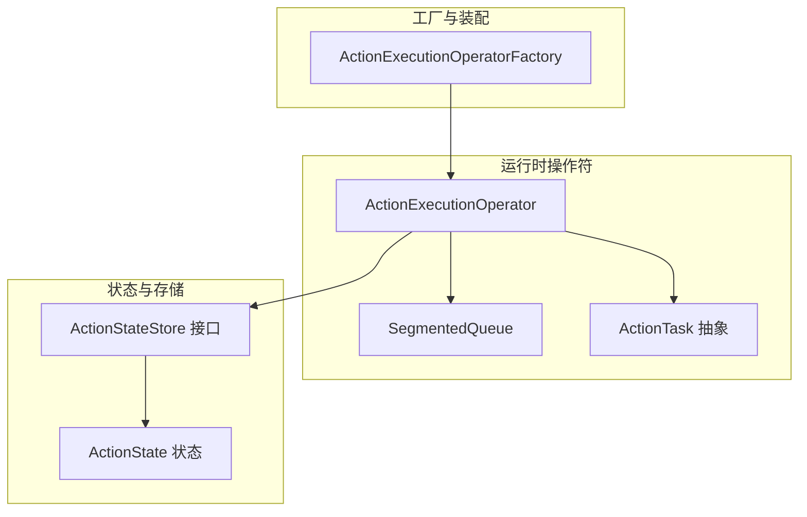
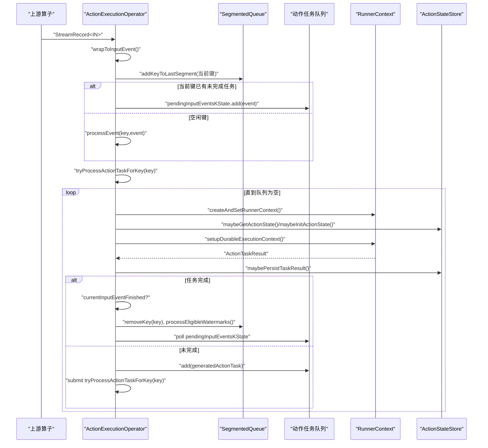
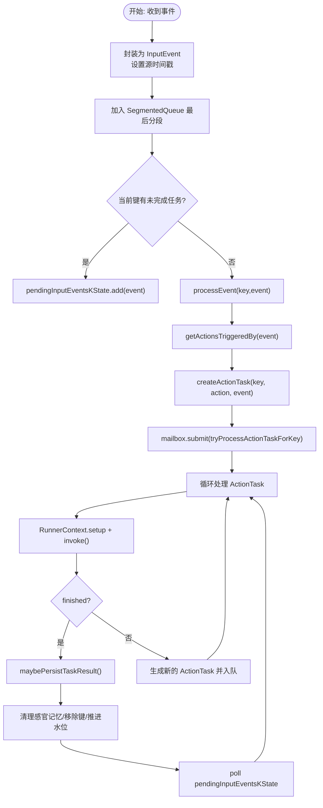
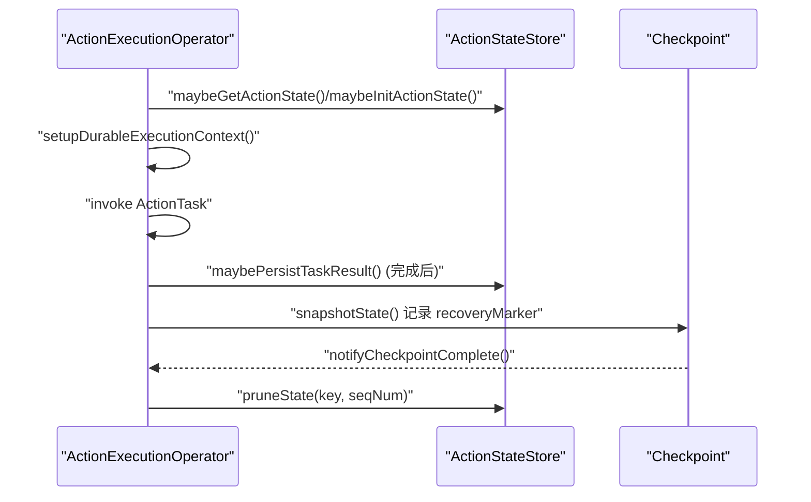
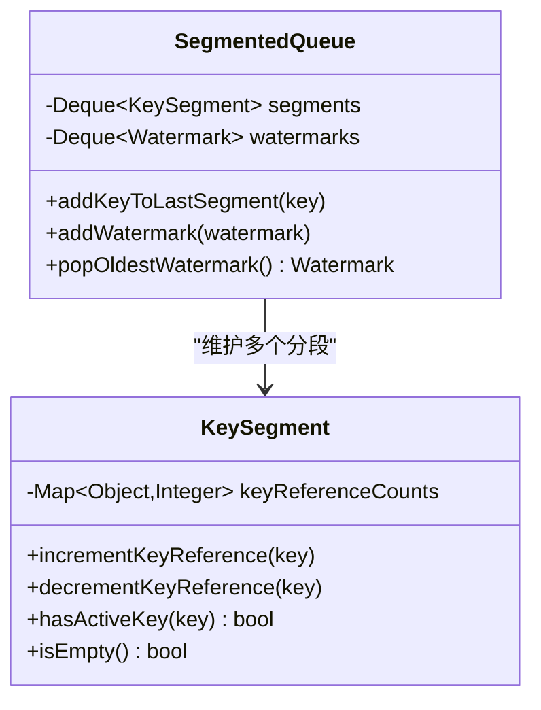
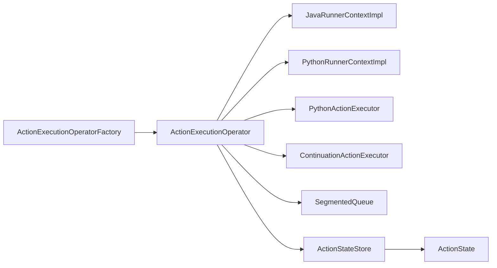

# 操作符执行

<cite>
**本文引用的文件**
- [ActionExecutionOperator.java](file://runtime/src/main/java/org/apache/flink/agents/runtime/operator/ActionExecutionOperator.java)
- [ActionExecutionOperatorFactory.java](file://runtime/src/main/java/org/apache/flink/agents/runtime/operator/ActionExecutionOperatorFactory.java)
- [SegmentedQueue.java](file://runtime/src/main/java/org/apache/flink/agents/runtime/operator/queue/SegmentedQueue.java)
- [KeySegment.java](file://runtime/src/main/java/org/apache/flink/agents/runtime/operator/queue/KeySegment.java)
- [ActionTask.java](file://runtime/src/main/java/org/apache/flink/agents/runtime/operator/ActionTask.java)
- [ActionStateStore.java](file://runtime/src/main/java/org/apache/flink/agents/runtime/actionstate/ActionStateStore.java)
- [ActionState.java](file://runtime/src/main/java/org/apache/flink/agents/runtime/actionstate/ActionState.java)
- [ActionExecutionOperatorTest.java](file://runtime/src/test/java/org/apache/flink/agents/runtime/operator/ActionExecutionOperatorTest.java)
- [SegmentedQueueTest.java](file://runtime/src/test/java/org/apache/flink/agents/runtime/operator/queue/SegmentedQueueTest.java)
</cite>

## 目录
1. [引言](#引言)
2. [项目结构](#项目结构)
3. [核心组件](#核心组件)
4. [架构总览](#架构总览)
5. [详细组件分析](#详细组件分析)
6. [依赖关系分析](#依赖关系分析)
7. [性能考量](#性能考量)
8. [故障排查指南](#故障排查指南)
9. [结论](#结论)

## 引言
本文件围绕 ActionExecutionOperator 操作符进行深入技术文档化，覆盖事件处理流程、异步执行机制与状态管理策略；阐述其如何接收上游数据、封装为 InputEvent 并触发相应动作；详解状态后端（键分区状态、序列号管理、恢复标记）；解释分段队列 SegmentedQueue 的设计以保证事件顺序与并行处理正确性；说明 ActionTask 的创建与调度（Java 与 Python 动作差异）；并给出生命周期管理（open 到 close）、性能调优与故障排查建议。

## 项目结构
ActionExecutionOperator 位于运行时模块中，作为 OneInputStreamOperator 接收上游事件，内部通过 SegmentedQueue 维护键级顺序，借助 ActionTask 抽象执行动作，结合 ActionStateStore 实现持久化的动作状态与细粒度恢复。

图示来源
- [ActionExecutionOperator.java](file://runtime/src/main/java/org/apache/flink/agents/runtime/operator/ActionExecutionOperator.java#L117-L119)
- [ActionExecutionOperatorFactory.java](file://runtime/src/main/java/org/apache/flink/agents/runtime/operator/ActionExecutionOperatorFactory.java#L29-L81)
- [SegmentedQueue.java](file://runtime/src/main/java/org/apache/flink/agents/runtime/operator/queue/SegmentedQueue.java#L25-L35)
- [ActionTask.java](file://runtime/src/main/java/org/apache/flink/agents/runtime/operator/ActionTask.java#L43-L43)
- [ActionStateStore.java](file://runtime/src/main/java/org/apache/flink/agents/runtime/actionstate/ActionStateStore.java#L26-L67)
- [ActionState.java](file://runtime/src/main/java/org/apache/flink/agents/runtime/actionstate/ActionState.java#L34-L60)

章节来源
- [ActionExecutionOperator.java](file://runtime/src/main/java/org/apache/flink/agents/runtime/operator/ActionExecutionOperator.java#L117-L119)
- [ActionExecutionOperatorFactory.java](file://runtime/src/main/java/org/apache/flink/agents/runtime/operator/ActionExecutionOperatorFactory.java#L29-L81)

## 核心组件
- ActionExecutionOperator：核心操作符，负责事件接收、InputEvent 封装、动作触发、ActionTask 调度、内存与状态管理、水位推进、事件日志与监听器通知、以及生命周期管理。
- ActionExecutionOperatorFactory：操作符工厂，注入 AgentPlan、输入类型标识与可选 ActionStateStore，创建并装配操作符。
- SegmentedQueue：按水位线分段的键队列，确保每个键在分段内有序处理，支持弹出最旧水位推进下游。
- ActionTask：动作任务抽象，定义 invoke 执行接口与结果 ActionTaskResult（完成态、输出事件、生成的下一个 ActionTask）。
- ActionStateStore：动作状态存储接口，支持 put/get、重建状态、修剪状态与恢复标记。
- ActionState：动作状态实体，记录感官/短期记忆更新、输出事件、已完成调用记录与完成标志，用于细粒度恢复。

章节来源
- [ActionExecutionOperator.java](file://runtime/src/main/java/org/apache/flink/agents/runtime/operator/ActionExecutionOperator.java#L117-L119)
- [ActionExecutionOperatorFactory.java](file://runtime/src/main/java/org/apache/flink/agents/runtime/operator/ActionExecutionOperatorFactory.java#L29-L81)
- [SegmentedQueue.java](file://runtime/src/main/java/org/apache/flink/agents/runtime/operator/queue/SegmentedQueue.java#L25-L35)
- [ActionTask.java](file://runtime/src/main/java/org/apache/flink/agents/runtime/operator/ActionTask.java#L43-L92)
- [ActionStateStore.java](file://runtime/src/main/java/org/apache/flink/agents/runtime/actionstate/ActionStateStore.java#L26-L67)
- [ActionState.java](file://runtime/src/main/java/org/apache/flink/agents/runtime/actionstate/ActionState.java#L34-L60)

## 架构总览
ActionExecutionOperator 在 open 阶段初始化内存状态、分段队列、事件日志、Python 环境与异步执行器；processElement 将上游数据封装为 InputEvent，入队至当前键的最后一个分段；随后尝试处理该键的动作任务队列；每轮执行 ActionTask 后根据结果决定是否继续生成新任务或完成当前输入事件；同时维护序列号、恢复标记与状态修剪；在 snapshotState/notifyCheckpointComplete 中与 ActionStateStore 协作完成持久化与清理；endInput/waitInFlightEventsFinished 确保结束前所有键处理完毕；close 清理资源。

图示来源
- [ActionExecutionOperator.java](file://runtime/src/main/java/org/apache/flink/agents/runtime/operator/ActionExecutionOperator.java#L344-L405)
- [ActionExecutionOperator.java](file://runtime/src/main/java/org/apache/flink/agents/runtime/operator/ActionExecutionOperator.java#L439-L602)
- [ActionExecutionOperator.java](file://runtime/src/main/java/org/apache/flink/agents/runtime/operator/ActionExecutionOperator.java#L1067-L1073)
- [ActionStateStore.java](file://runtime/src/main/java/org/apache/flink/agents/runtime/actionstate/ActionStateStore.java#L52-L67)

## 详细组件分析

### 事件处理与 InputEvent 封装
- 输入类型区分：inputIsJava 决定封装策略；Java 输入直接包装为 InputEvent；Python 输入需 Row(key,payload)，由 PythonActionExecutor 包装。
- 时间戳传递：若上游记录带时间戳，则写入 InputEvent 的源时间戳，下游输出时复用该时间戳。
- 键分区与排队：将当前键加入 SegmentedQueue 最后一个分段；若当前键存在未完成任务，则将新事件入 pendingInputEventsKState，否则立即处理。

章节来源
- [ActionExecutionOperator.java](file://runtime/src/main/java/org/apache/flink/agents/runtime/operator/ActionExecutionOperator.java#L809-L832)
- [ActionExecutionOperator.java](file://runtime/src/main/java/org/apache/flink/agents/runtime/operator/ActionExecutionOperator.java#L344-L366)

### 动作触发与 ActionTask 调度
- 触发动作选择：依据事件类型（Java 或 Python）查询 AgentPlan 获取触发动作列表。
- 任务创建：根据动作执行类型（JavaFunction/PythonFunction）创建对应 ActionTask。
- 上下文设置：为 ActionTask 设置 RunnerContext（Java/Python），并注入中间上下文（内存、续延上下文、Python awaitable 引用）。
- 调度执行：将 ActionTask 入队，提交 mailbox 任务尝试处理；每轮处理后根据 ActionTaskResult 决策：
  - 完成：持久化结果、清理感官记忆、移除键、推进水位、处理待处理事件。
  - 未完成：保留上下文，生成新的 ActionTask 入队并继续调度。

图示来源
- [ActionExecutionOperator.java](file://runtime/src/main/java/org/apache/flink/agents/runtime/operator/ActionExecutionOperator.java#L372-L405)
- [ActionExecutionOperator.java](file://runtime/src/main/java/org/apache/flink/agents/runtime/operator/ActionExecutionOperator.java#L439-L602)
- [ActionTask.java](file://runtime/src/main/java/org/apache/flink/agents/runtime/operator/ActionTask.java#L90-L92)

章节来源
- [ActionExecutionOperator.java](file://runtime/src/main/java/org/apache/flink/agents/runtime/operator/ActionExecutionOperator.java#L834-L840)
- [ActionExecutionOperator.java](file://runtime/src/main/java/org/apache/flink/agents/runtime/operator/ActionExecutionOperator.java#L854-L863)
- [ActionExecutionOperator.java](file://runtime/src/main/java/org/apache/flink/agents/runtime/operator/ActionExecutionOperator.java#L865-L909)

### 异步执行机制与 Java/Python 差异
- Java 动作：使用 ContinuationActionExecutor 线程池执行异步动作，通过 ContinuationContext 保存中间状态，支持细粒度恢复。
- Python 动作：通过 PythonActionExecutor 执行，RunnerContext 通过 PythonRunnerContextImpl 管理 awaitable 引用，跨检查点恢复时若丢失 awaitable 则重新执行。
- 统一抽象：ActionTask.invoke 接口对两类动作统一返回 ActionTaskResult，上层逻辑无感知。

章节来源
- [ActionExecutionOperator.java](file://runtime/src/main/java/org/apache/flink/agents/runtime/operator/ActionExecutionOperator.java#L314-L318)
- [ActionExecutionOperator.java](file://runtime/src/main/java/org/apache/flink/agents/runtime/operator/ActionExecutionOperator.java#L891-L908)
- [ActionExecutionOperator.java](file://runtime/src/main/java/org/apache/flink/agents/runtime/operator/ActionExecutionOperator.java#L1075-L1105)

### 状态管理与恢复策略
- 序列号管理：每个键维护自增序列号，用于 ActionStateStore 的定位与恢复一致性。
- 恢复标记：operator state 记录 recoveryMarker，快照时写入，重启时重建 ActionStateStore。
- 动作状态持久化：仅当 ActionTask 完成时才持久化 ActionState，包含输出事件、记忆更新与完成标志；支持修剪过期状态。
- 细粒度恢复：DurableExecutionContext 记录已执行的 durable_execute/durable_execute_async 调用，避免重复执行。

图示来源
- [ActionExecutionOperator.java](file://runtime/src/main/java/org/apache/flink/agents/runtime/operator/ActionExecutionOperator.java#L947-L1006)
- [ActionExecutionOperator.java](file://runtime/src/main/java/org/apache/flink/agents/runtime/operator/ActionExecutionOperator.java#L1019-L1048)
- [ActionExecutionOperator.java](file://runtime/src/main/java/org/apache/flink/agents/runtime/operator/ActionExecutionOperator.java#L776-L807)
- [ActionStateStore.java](file://runtime/src/main/java/org/apache/flink/agents/runtime/actionstate/ActionStateStore.java#L52-L67)
- [ActionState.java](file://runtime/src/main/java/org/apache/flink/agents/runtime/actionstate/ActionState.java#L34-L60)

章节来源
- [ActionExecutionOperator.java](file://runtime/src/main/java/org/apache/flink/agents/runtime/operator/ActionExecutionOperator.java#L189-L192)
- [ActionExecutionOperator.java](file://runtime/src/main/java/org/apache/flink/agents/runtime/operator/ActionExecutionOperator.java#L282-L309)
- [ActionExecutionOperator.java](file://runtime/src/main/java/org/apache/flink/agents/runtime/operator/ActionExecutionOperator.java#L737-L773)
- [ActionExecutionOperator.java](file://runtime/src/main/java/org/apache/flink/agents/runtime/operator/ActionExecutionOperator.java#L776-L807)

### 分段队列 SegmentedQueue 设计
- 分段模型：以水位线为界划分 KeySegment，每个分段维护键的活跃引用计数。
- 顺序保障：同一分段内通过引用计数保证键的事件顺序；只有当最早分段清空且到达水位时，才弹出最旧水位推进下游。
- 并行正确性：不同键可并行处理各自分段；removeKey 仅从包含该键的第一个分段递减引用计数，避免跨分段误删。

图示来源
- [SegmentedQueue.java](file://runtime/src/main/java/org/apache/flink/agents/runtime/operator/queue/SegmentedQueue.java#L25-L35)
- [SegmentedQueue.java](file://runtime/src/main/java/org/apache/flink/agents/runtime/operator/queue/SegmentedQueue.java#L37-L75)
- [SegmentedQueue.java](file://runtime/src/main/java/org/apache/flink/agents/runtime/operator/queue/SegmentedQueue.java#L81-L97)
- [KeySegment.java](file://runtime/src/main/java/org/apache/flink/agents/runtime/operator/queue/KeySegment.java#L23-L30)
- [KeySegment.java](file://runtime/src/main/java/org/apache/flink/agents/runtime/operator/queue/KeySegment.java#L32-L48)

章节来源
- [SegmentedQueue.java](file://runtime/src/main/java/org/apache/flink/agents/runtime/operator/queue/SegmentedQueue.java#L37-L97)
- [KeySegment.java](file://runtime/src/main/java/org/apache/flink/agents/runtime/operator/queue/KeySegment.java#L32-L58)
- [ActionExecutionOperator.java](file://runtime/src/main/java/org/apache/flink/agents/runtime/operator/ActionExecutionOperator.java#L1067-L1073)

### 生命周期管理
- open：初始化内存状态（感官/短期记忆）、分段队列、事件日志、Python 环境与异步执行器；恢复 ActionStateStore；提交 mailbox 任务重放遗留键。
- processElement/processWatermark：事件入队与水位推进。
- endInput/waitInFlightEventsFinished：等待所有键处理完成。
- close：关闭 RunnerContext、PythonActionExecutor、PythonInterpreter、PythonEnvironmentManager、EventLogger、ActionStateStore、ContinuationActionExecutor。

章节来源
- [ActionExecutionOperator.java](file://runtime/src/main/java/org/apache/flink/agents/runtime/operator/ActionExecutionOperator.java#L246-L329)
- [ActionExecutionOperator.java](file://runtime/src/main/java/org/apache/flink/agents/runtime/operator/ActionExecutionOperator.java#L338-L342)
- [ActionExecutionOperator.java](file://runtime/src/main/java/org/apache/flink/agents/runtime/operator/ActionExecutionOperator.java#L690-L700)
- [ActionExecutionOperator.java](file://runtime/src/main/java/org/apache/flink/agents/runtime/operator/ActionExecutionOperator.java#L702-L734)

## 依赖关系分析
- 操作符与工厂：工厂负责装配 ProcessingTimeService、MailboxExecutor、ActionStateStore，并设置链式策略。
- 操作符内部依赖：RunnerContext（Java/Python）、PythonActionExecutor、ContinuationActionExecutor、EventLogger、ActionStateStore、SegmentedQueue。
- 状态后端：ActionStateStore 支持 Kafka 等后端，提供 put/get、重建与修剪能力。

图示来源
- [ActionExecutionOperatorFactory.java](file://runtime/src/main/java/org/apache/flink/agents/runtime/operator/ActionExecutionOperatorFactory.java#L52-L66)
- [ActionExecutionOperator.java](file://runtime/src/main/java/org/apache/flink/agents/runtime/operator/ActionExecutionOperator.java#L217-L236)
- [ActionExecutionOperator.java](file://runtime/src/main/java/org/apache/flink/agents/runtime/operator/ActionExecutionOperator.java#L1075-L1105)
- [ActionStateStore.java](file://runtime/src/main/java/org/apache/flink/agents/runtime/actionstate/ActionStateStore.java#L26-L67)
- [ActionState.java](file://runtime/src/main/java/org/apache/flink/agents/runtime/actionstate/ActionState.java#L34-L60)

章节来源
- [ActionExecutionOperatorFactory.java](file://runtime/src/main/java/org/apache/flink/agents/runtime/operator/ActionExecutionOperatorFactory.java#L29-L81)
- [ActionExecutionOperator.java](file://runtime/src/main/java/org/apache/flink/agents/runtime/operator/ActionExecutionOperator.java#L1116-L1123)

## 性能考量
- 队列与分段：SegmentedQueue 通过分段与引用计数避免锁竞争，提升多键并发吞吐；建议合理设置水位频率以平衡延迟与有序性。
- 内存与状态：使用 CachedMemoryStore 缓存感官/短期记忆，减少频繁状态访问；注意控制记忆大小与清理策略。
- 异步执行：Java 动作使用固定线程池，建议根据动作 I/O 特性调整线程数；Python 动作受解释器与外部资源影响较大，应关注超时与重试。
- 快照与恢复：ActionStateStore 的持久化与修剪需权衡存储成本与恢复速度；在高吞吐场景下可考虑批量写入与压缩策略。
- 事件日志：事件日志即时刷新便于可观测性，但会增加 IO 压力，建议在生产环境评估刷新频率。

## 故障排查指南
- 事件未输出或乱序
  - 检查 SegmentedQueue 是否正确添加/移除键，确认水位推进逻辑。
  - 确认 pendingInputEventsKState 是否堆积导致阻塞。
- 动作未完成或重复执行
  - 核对 ActionStateStore 的持久化时机（仅在完成时写入），检查 pruneState 是否提前清理。
  - 对于 Python 动作，确认 awaitable 引用是否丢失（恢复时会重新执行）。
- 异步动作卡住
  - 检查 ContinuationActionExecutor 线程池配置与任务队列长度。
  - 关注 RunnerContext 的 DurableExecutionContext 是否正确传递。
- Python 环境问题
  - 确认 PythonActionExecutor 初始化成功，依赖安装与路径配置正确。
- 测试验证
  - 使用 ActionExecutionOperatorTest 与 SegmentedQueueTest 进行单元测试，覆盖异常恢复、多键并发、水位推进等场景。

章节来源
- [ActionExecutionOperatorTest.java](file://runtime/src/test/java/org/apache/flink/agents/runtime/operator/ActionExecutionOperatorTest.java#L332-L359)
- [SegmentedQueueTest.java](file://runtime/src/test/java/org/apache/flink/agents/runtime/operator/queue/SegmentedQueueTest.java#L27-L216)

## 结论
ActionExecutionOperator 通过 InputEvent 封装、ActionTask 抽象与 SegmentedQueue 分段队列，实现了键级有序与多键并行的事件处理；结合 ActionStateStore 提供细粒度的持久化与恢复能力；Java/Python 动作在统一 RunnerContext 下执行，满足跨语言扩展需求。遵循本文的生命周期管理、性能调优与故障排查建议，可在复杂流式场景中稳定高效地运行智能代理工作流。