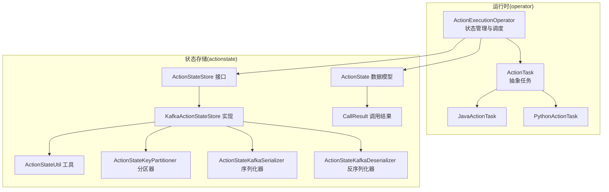
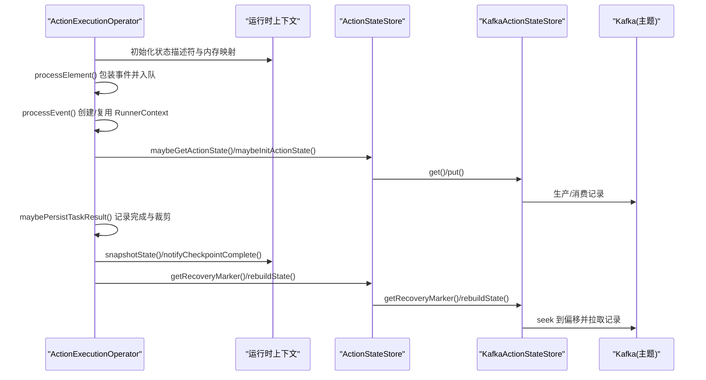
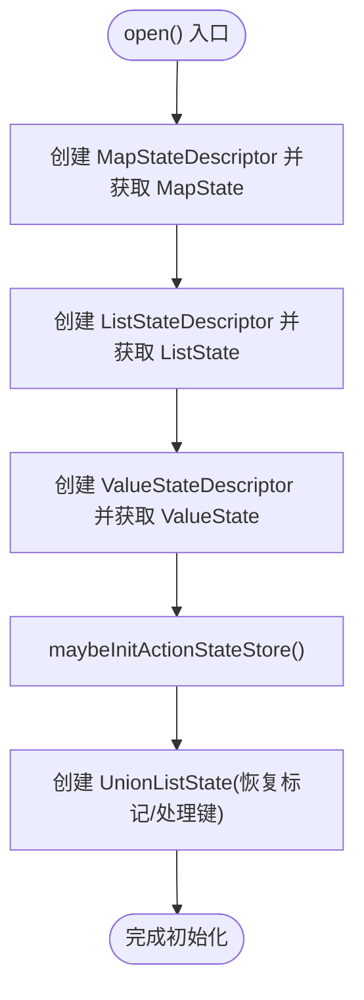
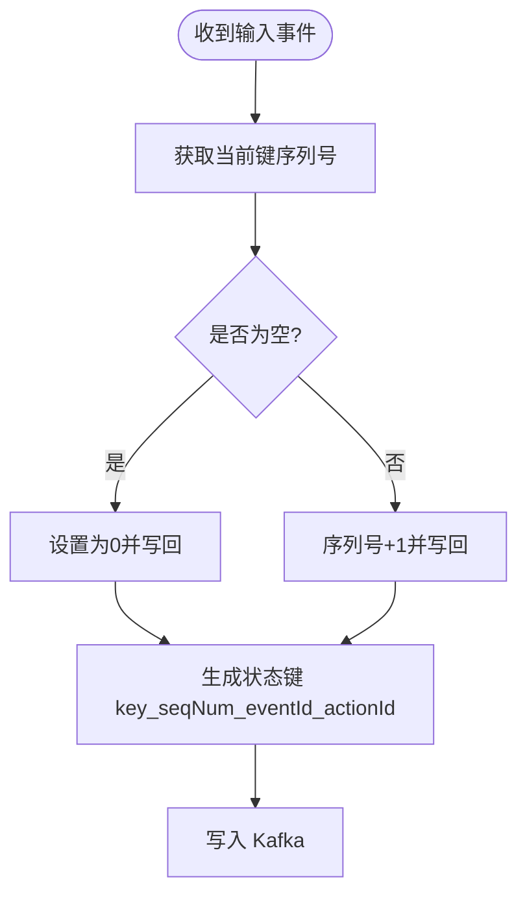
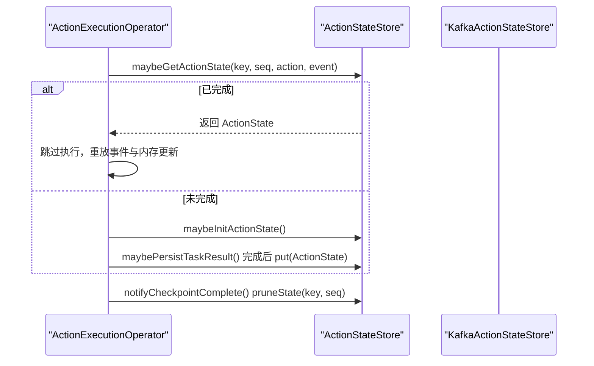
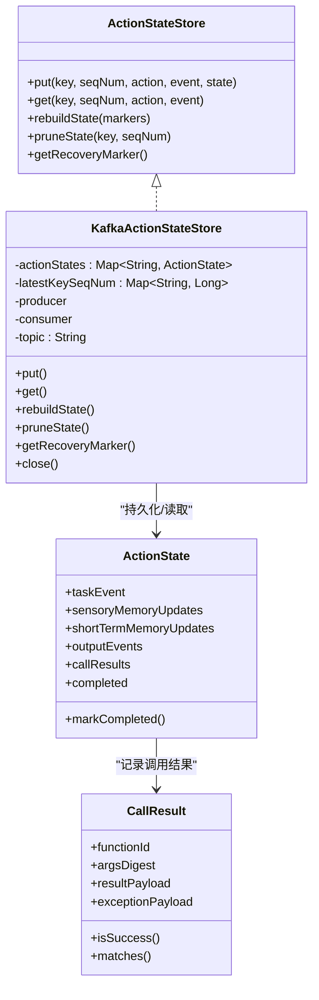
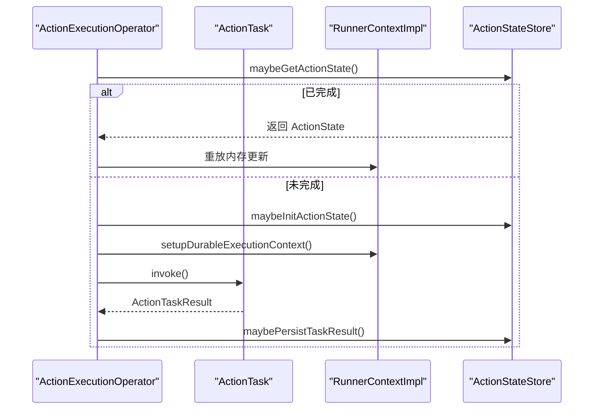
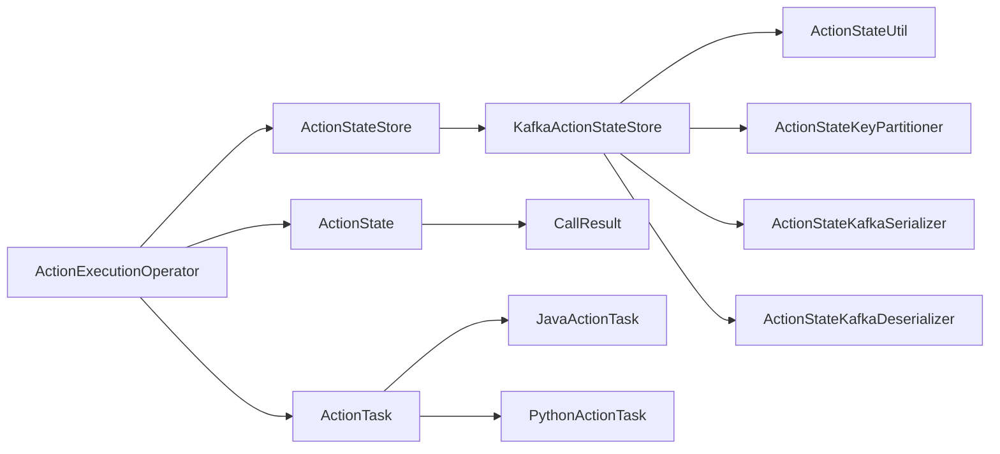

# 状态管理机制

<cite>
**本文引用的文件**
- [ActionExecutionOperator.java](file://runtime/src/main/java/org/apache/flink/agents/runtime/operator/ActionExecutionOperator.java)
- [ActionState.java](file://runtime/src/main/java/org/apache/flink/agents/runtime/actionstate/ActionState.java)
- [ActionStateStore.java](file://runtime/src/main/java/org/apache/flink/agents/runtime/actionstate/ActionStateStore.java)
- [KafkaActionStateStore.java](file://runtime/src/main/java/org/apache/flink/agents/runtime/actionstate/KafkaActionStateStore.java)
- [ActionStateUtil.java](file://runtime/src/main/java/org/apache/flink/agents/runtime/actionstate/ActionStateUtil.java)
- [ActionStateKeyPartitioner.java](file://runtime/src/main/java/org/apache/flink/agents/runtime/actionstate/ActionStateKeyPartitioner.java)
- [CallResult.java](file://runtime/src/main/java/org/apache/flink/agents/runtime/actionstate/CallResult.java)
- [ActionStateKafkaSerializer.java](file://runtime/src/main/java/org/apache/flink/agents/runtime/actionstate/ActionStateKafkaSerializer.java)
- [ActionStateKafkaDeserializer.java](file://runtime/src/main/java/org/apache/flink/agents/runtime/actionstate/ActionStateKafkaDeserializer.java)
- [ActionTask.java](file://runtime/src/main/java/org/apache/flink/agents/runtime/operator/ActionTask.java)
- [JavaActionTask.java](file://runtime/src/main/java/org/apache/flink/agents/runtime/operator/JavaActionTask.java)
- [PythonActionTask.java](file://runtime/src/main/java/org/apache/flink/agents/runtime/python/operator/PythonActionTask.java)
</cite>

## 目录
1. [简介](#简介)
2. [项目结构](#项目结构)
3. [核心组件](#核心组件)
4. [架构总览](#架构总览)
5. [详细组件分析](#详细组件分析)
6. [依赖关系分析](#依赖关系分析)
7. [性能考量](#性能考量)
8. [故障排查指南](#故障排查指南)
9. [结论](#结论)

## 简介
本文件聚焦于 ActionExecutionOperator 的状态管理机制，系统性阐述其状态后端管理、键分区状态、序列号管理与恢复标记机制。文档覆盖以下关键点：
- 各种状态的定义与用途：sensoryMemState（感觉记忆状态）、shortTermMemState（短期记忆状态）、actionTasksKState（待处理动作任务状态）、pendingInputEventsKState（待处理输入事件状态）、currentProcessingKeysOpState（当前处理键状态）
- 状态初始化流程：open() 中的状态描述符创建与获取
- 持久化与恢复：快照与重建过程
- ActionStateStore 的职责与实现：KafkaActionStateStore 的使用
- 并发控制与一致性保障
- 最佳实践与故障排查建议

## 项目结构
围绕状态管理的相关代码主要位于 runtime 子模块中，涉及操作符、状态存储与序列化等模块。

图表来源
- [ActionExecutionOperator.java](file://runtime/src/main/java/org/apache/flink/agents/runtime/operator/ActionExecutionOperator.java#L118-L329)
- [ActionStateStore.java](file://runtime/src/main/java/org/apache/flink/agents/runtime/actionstate/ActionStateStore.java#L27-L92)
- [KafkaActionStateStore.java](file://runtime/src/main/java/org/apache/flink/agents/runtime/actionstate/KafkaActionStateStore.java#L71-L124)
- [ActionState.java](file://runtime/src/main/java/org/apache/flink/agents/runtime/actionstate/ActionState.java#L28-L78)
- [CallResult.java](file://runtime/src/main/java/org/apache/flink/agents/runtime/actionstate/CallResult.java#L35-L98)
- [ActionStateUtil.java](file://runtime/src/main/java/org/apache/flink/agents/runtime/actionstate/ActionStateUtil.java#L35-L83)
- [ActionStateKeyPartitioner.java](file://runtime/src/main/java/org/apache/flink/agents/runtime/actionstate/ActionStateKeyPartitioner.java#L26-L60)
- [ActionStateKafkaSerializer.java](file://runtime/src/main/java/org/apache/flink/agents/runtime/actionstate/ActionStateKafkaSerializer.java#L44-L108)
- [ActionStateKafkaDeserializer.java](file://runtime/src/main/java/org/apache/flink/agents/runtime/actionstate/ActionStateKafkaDeserializer.java#L44-L110)

章节来源
- [ActionExecutionOperator.java](file://runtime/src/main/java/org/apache/flink/agents/runtime/operator/ActionExecutionOperator.java#L118-L329)

## 核心组件
- ActionExecutionOperator：负责接收上游事件、维护键级队列、调度 ActionTask 执行、协调内存状态与持久化状态，并在检查点与恢复过程中进行序列号与恢复标记的管理。
- ActionState：封装单次动作执行的状态，包含感觉/短期记忆更新、输出事件、细粒度调用结果记录以及完成标志。
- ActionStateStore：状态存储接口，定义 put/get/rebuildState/pruneState/getRecoveryMarker 等能力；KafkaActionStateStore 提供基于 Kafka 的实现。
- ActionStateUtil：状态键生成与解析工具，确保 key_seqNum_eventId_actionId 的稳定格式。
- ActionStateKeyPartitioner：基于键首段（key）的 MurmurHash 分区策略，保证同一 key 的状态写入同一分区。
- CallResult：细粒度调用结果记录，用于恢复时跳过已成功执行的 durable 调用。
- ActionStateKafkaSerializer/Deserializer：对 ActionState 进行 Jackson 序列化/反序列化，支持多态事件类型与 ActionTask 的空值处理。

章节来源
- [ActionExecutionOperator.java](file://runtime/src/main/java/org/apache/flink/agents/runtime/operator/ActionExecutionOperator.java#L135-L191)
- [ActionState.java](file://runtime/src/main/java/org/apache/flink/agents/runtime/actionstate/ActionState.java#L28-L78)
- [ActionStateStore.java](file://runtime/src/main/java/org/apache/flink/agents/runtime/actionstate/ActionStateStore.java#L27-L92)
- [KafkaActionStateStore.java](file://runtime/src/main/java/org/apache/flink/agents/runtime/actionstate/KafkaActionStateStore.java#L71-L124)
- [ActionStateUtil.java](file://runtime/src/main/java/org/apache/flink/agents/runtime/actionstate/ActionStateUtil.java#L35-L83)
- [ActionStateKeyPartitioner.java](file://runtime/src/main/java/org/apache/flink/agents/runtime/actionstate/ActionStateKeyPartitioner.java#L26-L60)
- [CallResult.java](file://runtime/src/main/java/org/apache/flink/agents/runtime/actionstate/CallResult.java#L35-L98)
- [ActionStateKafkaSerializer.java](file://runtime/src/main/java/org/apache/flink/agents/runtime/actionstate/ActionStateKafkaSerializer.java#L44-L108)
- [ActionStateKafkaDeserializer.java](file://runtime/src/main/java/org/apache/flink/agents/runtime/actionstate/ActionStateKafkaDeserializer.java#L44-L110)

## 架构总览
ActionExecutionOperator 在 open() 中初始化各类状态后端，并在处理事件时根据键进行序列号递增与任务排队。当启用 Kafka 后端时，所有动作状态通过 KafkaActionStateStore 持久化到 Kafka 主题，利用恢复标记与分区偏移进行重建与裁剪。

图表来源
- [ActionExecutionOperator.java](file://runtime/src/main/java/org/apache/flink/agents/runtime/operator/ActionExecutionOperator.java#L247-L329)
- [ActionExecutionOperator.java](file://runtime/src/main/java/org/apache/flink/agents/runtime/operator/ActionExecutionOperator.java#L737-L807)
- [ActionStateStore.java](file://runtime/src/main/java/org/apache/flink/agents/runtime/actionstate/ActionStateStore.java#L42-L91)
- [KafkaActionStateStore.java](file://runtime/src/main/java/org/apache/flink/agents/runtime/actionstate/KafkaActionStateStore.java#L127-L148)
- [KafkaActionStateStore.java](file://runtime/src/main/java/org/apache/flink/agents/runtime/actionstate/KafkaActionStateStore.java#L202-L270)
- [KafkaActionStateStore.java](file://runtime/src/main/java/org/apache/flink/agents/runtime/actionstate/KafkaActionStateStore.java#L309-L327)

## 详细组件分析

### 状态定义与用途
- sensoryMemState（感觉记忆状态）
  - 类型：MapState<String, MemoryObjectImpl.MemoryItem>
  - 作用：缓存最近一次输入事件产生的感觉记忆，便于动作执行期间快速访问
  - 初始化：open() 中通过 MapStateDescriptor 创建并注册
- shortTermMemState（短期记忆状态）
  - 类型：MapState<String, MemoryObjectImpl.MemoryItem>
  - 作用：缓存短期记忆更新，支持跨动作块累积
  - 初始化：open() 中通过 MapStateDescriptor 创建并注册
- actionTasksKState（待处理动作任务状态）
  - 类型：ListState<ActionTask>
  - 作用：保存当前键下等待执行的动作任务队列
  - 初始化：open() 中通过 ListStateDescriptor 创建并注册
- pendingInputEventsKState（待处理输入事件状态）
  - 类型：ListState<Event>
  - 作用：当键正在处理中时，将新输入事件排队等待
  - 初始化：open() 中通过 ListStateDescriptor 创建并注册
- currentProcessingKeysOpState（当前处理键状态）
  - 类型：Operator 级 UnionListState<Object>
  - 作用：记录当前正在处理的键集合，EndOfInput 等待全部处理完毕
  - 初始化：open() 中通过 OperatorStateBackend.getUnionListState 创建

章节来源
- [ActionExecutionOperator.java](file://runtime/src/main/java/org/apache/flink/agents/runtime/operator/ActionExecutionOperator.java#L135-L191)
- [ActionExecutionOperator.java](file://runtime/src/main/java/org/apache/flink/agents/runtime/operator/ActionExecutionOperator.java#L247-L329)

### 状态初始化流程（open()）
- 创建并注册：
  - sensoryMemState 与 shortTermMemState：MapStateDescriptor + getRuntimeContext().getMapState()
  - actionTasksKState、pendingInputEventsKState：ListStateDescriptor + getRuntimeContext().getListState()
  - currentProcessingKeysOpState：UnionListState + getOperatorStateBackend().getUnionListState()
- 初始化序列号状态：ValueStateDescriptor + getRuntimeContext().getState()
- 初始化恢复标记状态：UnionListState + getOperatorStateBackend().getUnionListState()
- 初始化 ActionStateStore：根据配置选择 Kafka 后端并创建实例
- 初始化 Python/Java 执行环境与监听器

图表来源
- [ActionExecutionOperator.java](file://runtime/src/main/java/org/apache/flink/agents/runtime/operator/ActionExecutionOperator.java#L247-L329)

章节来源
- [ActionExecutionOperator.java](file://runtime/src/main/java/org/apache/flink/agents/runtime/operator/ActionExecutionOperator.java#L247-L329)

### 序列号管理与键分区
- per-key 序列号：每个键维护一个单调递增的序列号，用于确定状态顺序与裁剪边界
- 序列号初始化/递增：initOrIncSequenceNumber() 在首次使用或每次处理输入事件时更新
- 键分区策略：ActionStateKeyPartitioner 基于 key 首段进行 MurmurHash 分区，确保同键数据在同一分区
- 状态键生成：ActionStateUtil.generateKey 将 key、seqNum、事件标识、动作标识拼接为稳定键

图表来源
- [ActionExecutionOperator.java](file://runtime/src/main/java/org/apache/flink/agents/runtime/operator/ActionExecutionOperator.java#L937-L945)
- [ActionStateUtil.java](file://runtime/src/main/java/org/apache/flink/agents/runtime/actionstate/ActionStateUtil.java#L40-L52)
- [ActionStateKeyPartitioner.java](file://runtime/src/main/java/org/apache/flink/agents/runtime/actionstate/ActionStateKeyPartitioner.java#L36-L52)

章节来源
- [ActionExecutionOperator.java](file://runtime/src/main/java/org/apache/flink/agents/runtime/operator/ActionExecutionOperator.java#L937-L945)
- [ActionStateUtil.java](file://runtime/src/main/java/org/apache/flink/agents/runtime/actionstate/ActionStateUtil.java#L40-L52)
- [ActionStateKeyPartitioner.java](file://runtime/src/main/java/org/apache/flink/agents/runtime/actionstate/ActionStateKeyPartitioner.java#L36-L52)

### 动作状态持久化与恢复
- 持久化时机：动作完成后，maybePersistTaskResult() 将感觉/短期记忆更新、输出事件写入 ActionState，并标记完成，随后 put 到 ActionStateStore
- 恢复策略：initializeState() 从恢复标记重建状态；processActionTaskForKey() 若检测到已完成动作则跳过执行并重放事件与内存更新
- 裁剪策略：notifyCheckpointComplete() 基于 checkpointId 对应的键序列号进行 pruneState，清理过期状态

图表来源
- [ActionExecutionOperator.java](file://runtime/src/main/java/org/apache/flink/agents/runtime/operator/ActionExecutionOperator.java#L466-L525)
- [ActionExecutionOperator.java](file://runtime/src/main/java/org/apache/flink/agents/runtime/operator/ActionExecutionOperator.java#L947-L1006)
- [ActionExecutionOperator.java](file://runtime/src/main/java/org/apache/flink/agents/runtime/operator/ActionExecutionOperator.java#L797-L807)
- [ActionStateStore.java](file://runtime/src/main/java/org/apache/flink/agents/runtime/actionstate/ActionStateStore.java#L52-L82)
- [KafkaActionStateStore.java](file://runtime/src/main/java/org/apache/flink/agents/runtime/actionstate/KafkaActionStateStore.java#L127-L148)
- [KafkaActionStateStore.java](file://runtime/src/main/java/org/apache/flink/agents/runtime/actionstate/KafkaActionStateStore.java#L273-L302)

章节来源
- [ActionExecutionOperator.java](file://runtime/src/main/java/org/apache/flink/agents/runtime/operator/ActionExecutionOperator.java#L466-L525)
- [ActionExecutionOperator.java](file://runtime/src/main/java/org/apache/flink/agents/runtime/operator/ActionExecutionOperator.java#L947-L1006)
- [ActionExecutionOperator.java](file://runtime/src/main/java/org/apache/flink/agents/runtime/operator/ActionExecutionOperator.java#L797-L807)
- [ActionStateStore.java](file://runtime/src/main/java/org/apache/flink/agents/runtime/actionstate/ActionStateStore.java#L52-L82)
- [KafkaActionStateStore.java](file://runtime/src/main/java/org/apache/flink/agents/runtime/actionstate/KafkaActionStateStore.java#L127-L148)
- [KafkaActionStateStore.java](file://runtime/src/main/java/org/apache/flink/agents/runtime/actionstate/KafkaActionStateStore.java#L273-L302)

### ActionStateStore 与 KafkaActionStateStore
- ActionStateStore 接口定义了 put/get/rebuildState/pruneState/getRecoveryMarker 等方法
- KafkaActionStateStore 实现：
  - put：生成状态键并发送到 Kafka，同时缓存到内存
  - get：检查分叉与缓存有效性，必要时清理并返回
  - rebuildState：根据恢复标记定位分区偏移，拉取记录并重建内存缓存
  - pruneState：按 key 与序列号裁剪内存缓存
  - getRecoveryMarker：返回各分区末尾偏移作为恢复标记
  - 序列化：使用自定义 Jackson ObjectMapper，支持多态事件与 ActionTask 空值处理

图表来源
- [ActionStateStore.java](file://runtime/src/main/java/org/apache/flink/agents/runtime/actionstate/ActionStateStore.java#L27-L92)
- [KafkaActionStateStore.java](file://runtime/src/main/java/org/apache/flink/agents/runtime/actionstate/KafkaActionStateStore.java#L71-L124)
- [ActionState.java](file://runtime/src/main/java/org/apache/flink/agents/runtime/actionstate/ActionState.java#L28-L78)
- [CallResult.java](file://runtime/src/main/java/org/apache/flink/agents/runtime/actionstate/CallResult.java#L35-L98)

章节来源
- [ActionStateStore.java](file://runtime/src/main/java/org/apache/flink/agents/runtime/actionstate/ActionStateStore.java#L27-L92)
- [KafkaActionStateStore.java](file://runtime/src/main/java/org/apache/flink/agents/runtime/actionstate/KafkaActionStateStore.java#L71-L124)
- [ActionState.java](file://runtime/src/main/java/org/apache/flink/agents/runtime/actionstate/ActionState.java#L28-L78)
- [CallResult.java](file://runtime/src/main/java/org/apache/flink/agents/runtime/actionstate/CallResult.java#L35-L98)

### 细粒度调用结果与恢复
- CallResult 记录函数标识、参数摘要、返回值或异常载荷
- ActionState 维护 callResults 列表，完成时清空以减少存储开销
- 恢复时通过 CallResult 的匹配避免重复执行，提升稳定性

章节来源
- [CallResult.java](file://runtime/src/main/java/org/apache/flink/agents/runtime/actionstate/CallResult.java#L35-L98)
- [ActionState.java](file://runtime/src/main/java/org/apache/flink/agents/runtime/actionstate/ActionState.java#L111-L180)

### 任务执行与状态联动
- ActionTask 抽象了动作代码块的执行，JavaActionTask 与 PythonActionTask 分别处理 Java/Python 动作
- ActionExecutionOperator 在 processActionTaskForKey() 中：
  - 获取/初始化 ActionState
  - 设置 RunnerContext 的细粒度持久化上下文
  - 执行 ActionTask.invoke()，根据结果决定是否继续生成新任务或完成
  - 完成后持久化 ActionState 并清理临时上下文

图表来源
- [ActionExecutionOperator.java](file://runtime/src/main/java/org/apache/flink/agents/runtime/operator/ActionExecutionOperator.java#L466-L525)
- [ActionExecutionOperator.java](file://runtime/src/main/java/org/apache/flink/agents/runtime/operator/ActionExecutionOperator.java#L503-L525)
- [ActionTask.java](file://runtime/src/main/java/org/apache/flink/agents/runtime/operator/ActionTask.java#L90-L131)
- [JavaActionTask.java](file://runtime/src/main/java/org/apache/flink/agents/runtime/operator/JavaActionTask.java#L48-L90)
- [PythonActionTask.java](file://runtime/src/main/java/org/apache/flink/agents/runtime/python/operator/PythonActionTask.java#L46-L71)

章节来源
- [ActionExecutionOperator.java](file://runtime/src/main/java/org/apache/flink/agents/runtime/operator/ActionExecutionOperator.java#L466-L525)
- [ActionExecutionOperator.java](file://runtime/src/main/java/org/apache/flink/agents/runtime/operator/ActionExecutionOperator.java#L503-L525)
- [ActionTask.java](file://runtime/src/main/java/org/apache/flink/agents/runtime/operator/ActionTask.java#L90-L131)
- [JavaActionTask.java](file://runtime/src/main/java/org/apache/flink/agents/runtime/operator/JavaActionTask.java#L48-L90)
- [PythonActionTask.java](file://runtime/src/main/java/org/apache/flink/agents/runtime/python/operator/PythonActionTask.java#L46-L71)

## 依赖关系分析
- ActionExecutionOperator 依赖：
  - Flink 状态后端（MapState/ListState/ValueState/OperatorState）
  - ActionStateStore 接口与 KafkaActionStateStore 实现
  - ActionState/CallResult 数据模型
  - ActionTask/JavaActionTask/PythonActionTask 执行模型
- KafkaActionStateStore 依赖：
  - Kafka 生产者/消费者
  - ActionStateUtil 生成键
  - ActionStateKeyPartitioner 分区策略
  - 自定义序列化器/反序列化器

图表来源
- [ActionExecutionOperator.java](file://runtime/src/main/java/org/apache/flink/agents/runtime/operator/ActionExecutionOperator.java#L118-L329)
- [ActionStateStore.java](file://runtime/src/main/java/org/apache/flink/agents/runtime/actionstate/ActionStateStore.java#L27-L92)
- [KafkaActionStateStore.java](file://runtime/src/main/java/org/apache/flink/agents/runtime/actionstate/KafkaActionStateStore.java#L71-L124)
- [ActionStateUtil.java](file://runtime/src/main/java/org/apache/flink/agents/runtime/actionstate/ActionStateUtil.java#L35-L83)
- [ActionStateKeyPartitioner.java](file://runtime/src/main/java/org/apache/flink/agents/runtime/actionstate/ActionStateKeyPartitioner.java#L26-L60)
- [ActionStateKafkaSerializer.java](file://runtime/src/main/java/org/apache/flink/agents/runtime/actionstate/ActionStateKafkaSerializer.java#L44-L108)
- [ActionStateKafkaDeserializer.java](file://runtime/src/main/java/org/apache/flink/agents/runtime/actionstate/ActionStateKafkaDeserializer.java#L44-L110)
- [ActionTask.java](file://runtime/src/main/java/org/apache/flink/agents/runtime/operator/ActionTask.java#L43-L92)
- [JavaActionTask.java](file://runtime/src/main/java/org/apache/flink/agents/runtime/operator/JavaActionTask.java#L39-L91)
- [PythonActionTask.java](file://runtime/src/main/java/org/apache/flink/agents/runtime/python/operator/PythonActionTask.java#L36-L72)

章节来源
- [ActionExecutionOperator.java](file://runtime/src/main/java/org/apache/flink/agents/runtime/operator/ActionExecutionOperator.java#L118-L329)
- [ActionStateStore.java](file://runtime/src/main/java/org/apache/flink/agents/runtime/actionstate/ActionStateStore.java#L27-L92)
- [KafkaActionStateStore.java](file://runtime/src/main/java/org/apache/flink/agents/runtime/actionstate/KafkaActionStateStore.java#L71-L124)
- [ActionStateUtil.java](file://runtime/src/main/java/org/apache/flink/agents/runtime/actionstate/ActionStateUtil.java#L35-L83)
- [ActionStateKeyPartitioner.java](file://runtime/src/main/java/org/apache/flink/agents/runtime/actionstate/ActionStateKeyPartitioner.java#L26-L60)
- [ActionStateKafkaSerializer.java](file://runtime/src/main/java/org/apache/flink/agents/runtime/actionstate/ActionStateKafkaSerializer.java#L44-L108)
- [ActionStateKafkaDeserializer.java](file://runtime/src/main/java/org/apache/flink/agents/runtime/actionstate/ActionStateKafkaDeserializer.java#L44-L110)
- [ActionTask.java](file://runtime/src/main/java/org/apache/flink/agents/runtime/operator/ActionTask.java#L43-L92)
- [JavaActionTask.java](file://runtime/src/main/java/org/apache/flink/agents/runtime/operator/JavaActionTask.java#L39-L91)
- [PythonActionTask.java](file://runtime/src/main/java/org/apache/flink/agents/runtime/python/operator/PythonActionTask.java#L36-L72)

## 性能考量
- Kafka 主题配置
  - 清理策略采用 compact，适合按键去重的幂等存储
  - 分区数与副本因子可配置，影响吞吐与容错
- 序列化成本
  - 使用 Jackson 多态混入与自定义 ActionTask 序列化策略，避免大对象传输
- 内存缓存
  - KafkaActionStateStore 维护内存缓存，减少重复读取
- 分区策略
  - 基于键首段的哈希分区，降低热点，但需确保 key 设计均匀

[本节为通用指导，不直接分析具体文件]

## 故障排查指南
- Kafka 连接与主题问题
  - 确认主题存在且清理策略为 compact
  - 检查生产者/消费者配置与分区器
- 恢复失败
  - 检查恢复标记是否正确生成与提交
  - 确认 rebuildState 的偏移定位逻辑
- 状态不一致
  - 检查序列号是否单调递增
  - 确认 pruneState 是否按 checkpointId 正确裁剪
- 任务卡住
  - 检查 currentProcessingKeysOpState 是否被正确清理
  - 确认 pendingInputEventsKState 是否被正确出队
- Python/Java 异步上下文丢失
  - 检查 RunnerContextImpl.DurableExecutionContext 的传递与清理
  - 确认 awaitable 引用在恢复时是否重建

章节来源
- [KafkaActionStateStore.java](file://runtime/src/main/java/org/apache/flink/agents/runtime/actionstate/KafkaActionStateStore.java#L339-L363)
- [ActionExecutionOperator.java](file://runtime/src/main/java/org/apache/flink/agents/runtime/operator/ActionExecutionOperator.java#L776-L807)
- [ActionExecutionOperator.java](file://runtime/src/main/java/org/apache/flink/agents/runtime/operator/ActionExecutionOperator.java#L915-L935)

## 结论
ActionExecutionOperator 通过 Flink 状态后端与 KafkaActionStateStore 实现了高可靠的动作状态持久化与恢复。借助 per-key 序列号、键分区策略与细粒度调用结果记录，系统在异步与跨语言场景下实现了强一致与高性能的协同。遵循本文最佳实践与故障排查建议，可有效提升系统的稳定性与可运维性。