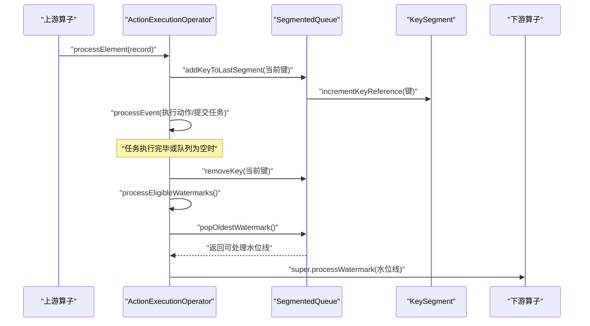
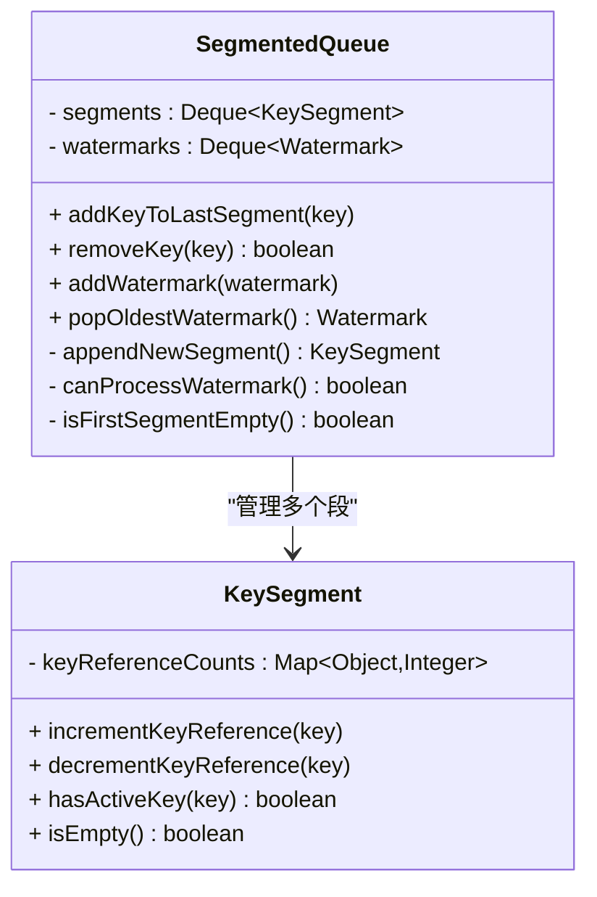
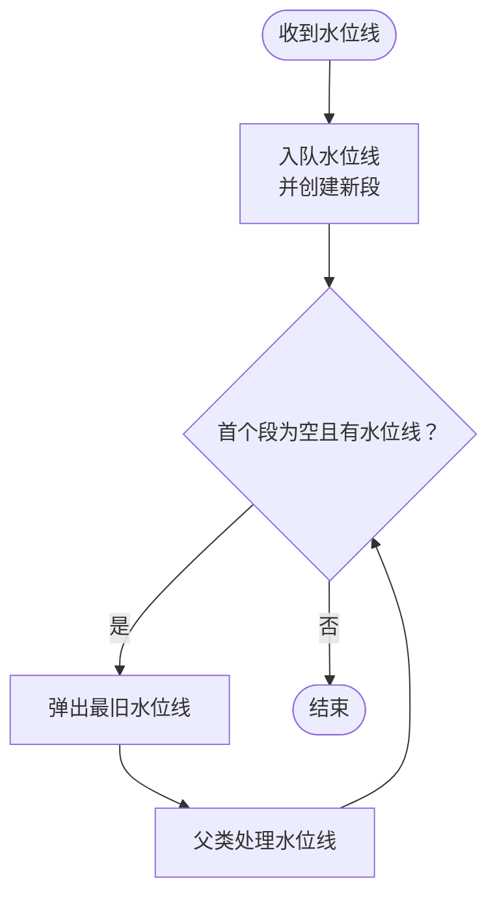
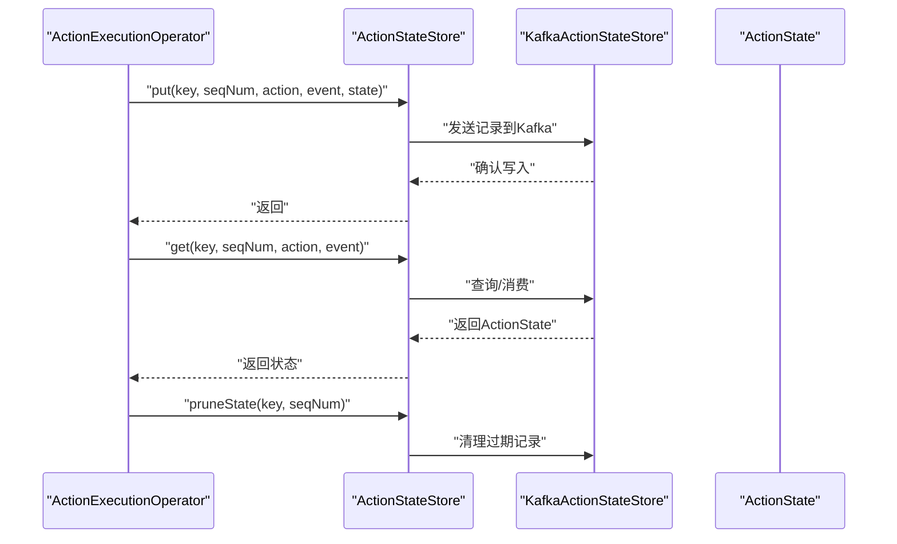
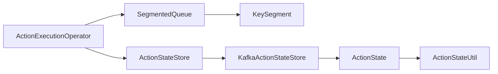

# 队列管理机制

<cite>
**本文引用的文件**
- [SegmentedQueue.java](file://runtime/src/main/java/org/apache/flink/agents/runtime/operator/queue/SegmentedQueue.java)
- [KeySegment.java](file://runtime/src/main/java/org/apache/flink/agents/runtime/operator/queue/KeySegment.java)
- [ActionExecutionOperator.java](file://runtime/src/main/java/org/apache/flink/agents/runtime/operator/ActionExecutionOperator.java)
- [SegmentedQueueTest.java](file://runtime/src/test/java/org/apache/flink/agents/runtime/operator/queue/SegmentedQueueTest.java)
- [KeySegmentTest.java](file://runtime/src/test/java/org/apache/flink/agents/runtime/operator/queue/KeySegmentTest.java)
- [ActionExecutionOperatorTest.java](file://runtime/src/test/java/org/apache/flink/agents/runtime/operator/ActionExecutionOperatorTest.java)
- [ActionExecutionOperatorFactory.java](file://runtime/src/main/java/org/apache/flink/agents/runtime/operator/ActionExecutionOperatorFactory.java)
- [ActionStateStore.java](file://runtime/src/main/java/org/apache/flink/agents/runtime/actionstate/ActionStateStore.java)
- [KafkaActionStateStore.java](file://runtime/src/main/java/org/apache/flink/agents/runtime/actionstate/KafkaActionStateStore.java)
- [ActionState.java](file://runtime/src/main/java/org/apache/flink/agents/runtime/actionstate/ActionState.java)
- [ActionStateUtil.java](file://runtime/src/main/java/org/apache/flink/agents/runtime/actionstate/ActionStateUtil.java)
</cite>

## 目录
1. [引言](#引言)
2. [项目结构](#项目结构)
3. [核心组件](#核心组件)
4. [架构总览](#架构总览)
5. [详细组件分析](#详细组件分析)
6. [依赖关系分析](#依赖关系分析)
7. [性能考量](#性能考量)
8. [故障排查指南](#故障排查指南)
9. [结论](#结论)
10. [附录](#附录)

## 引言
本技术文档围绕 ActionExecutionOperator 的队列管理机制展开，重点解析 SegmentedQueue 分段队列的设计与实现、KeySegment 键分区与水位线协同工作方式、事件入队与出队的添加/移除机制、水位线处理流程、高并发下的性能优化策略、状态持久化与恢复、内存与垃圾回收考虑，以及性能调优与故障排查建议。目标读者为系统架构师与高级开发者。

## 项目结构
本节聚焦于与队列管理直接相关的源码位置与职责划分：
- 队列模型层：SegmentedQueue 与 KeySegment
- 运行时操作器：ActionExecutionOperator 负责事件接收、入队、任务执行、水位线传播
- 状态存储接口与实现：ActionStateStore 及其 Kafka 实现
- 工厂类：ActionExecutionOperatorFactory 负责实例化与装配
- 测试用例：SegmentedQueueTest、KeySegmentTest、ActionExecutionOperatorTest 提供行为验证

```mermaid
graph TB
subgraph "队列模型"
SQ["SegmentedQueue<br/>分段队列"]
KS["KeySegment<br/>键分组"]
end
subgraph "运行时"
AEO["ActionExecutionOperator<br/>事件处理/水位线传播"]
AEOF["ActionExecutionOperatorFactory<br/>工厂"]
end
subgraph "状态存储"
ASSI["ActionStateStore<br/>接口"]
KASS["KafkaActionStateStore<br/>Kafka实现"]
AS["ActionState<br/>状态对象"]
ASU["ActionStateUtil<br/>键生成/解析"]
end
SQ --> KS
AEO --> SQ
AEO --> ASSI
ASSI <- --> KASS
KASS --> AS
ASU --> AS
AEOF --> AEO
```

图表来源
- [SegmentedQueue.java](file://runtime/src/main/java/org/apache/flink/agents/runtime/operator/queue/SegmentedQueue.java#L25-L109)
- [KeySegment.java](file://runtime/src/main/java/org/apache/flink/agents/runtime/operator/queue/KeySegment.java#L24-L65)
- [ActionExecutionOperator.java](file://runtime/src/main/java/org/apache/flink/agents/runtime/operator/ActionExecutionOperator.java#L118-L1132)
- [ActionExecutionOperatorFactory.java](file://runtime/src/main/java/org/apache/flink/agents/runtime/operator/ActionExecutionOperatorFactory.java#L30-L82)
- [ActionStateStore.java](file://runtime/src/main/java/org/apache/flink/agents/runtime/actionstate/ActionStateStore.java#L27-L93)
- [KafkaActionStateStore.java](file://runtime/src/main/java/org/apache/flink/agents/runtime/actionstate/KafkaActionStateStore.java#L71-L200)
- [ActionState.java](file://runtime/src/main/java/org/apache/flink/agents/runtime/actionstate/ActionState.java#L28-L200)
- [ActionStateUtil.java](file://runtime/src/main/java/org/apache/flink/agents/runtime/actionstate/ActionStateUtil.java#L35-L84)

章节来源
- [SegmentedQueue.java](file://runtime/src/main/java/org/apache/flink/agents/runtime/operator/queue/SegmentedQueue.java#L25-L109)
- [KeySegment.java](file://runtime/src/main/java/org/apache/flink/agents/runtime/operator/queue/KeySegment.java#L24-L65)
- [ActionExecutionOperator.java](file://runtime/src/main/java/org/apache/flink/agents/runtime/operator/ActionExecutionOperator.java#L118-L1132)
- [ActionExecutionOperatorFactory.java](file://runtime/src/main/java/org/apache/flink/agents/runtime/operator/ActionExecutionOperatorFactory.java#L30-L82)
- [ActionStateStore.java](file://runtime/src/main/java/org/apache/flink/agents/runtime/actionstate/ActionStateStore.java#L27-L93)
- [KafkaActionStateStore.java](file://runtime/src/main/java/org/apache/flink/agents/runtime/actionstate/KafkaActionStateStore.java#L71-L200)
- [ActionState.java](file://runtime/src/main/java/org/apache/flink/agents/runtime/actionstate/ActionState.java#L28-L200)
- [ActionStateUtil.java](file://runtime/src/main/java/org/apache/flink/agents/runtime/actionstate/ActionStateUtil.java#L35-L84)

## 核心组件
- SegmentedQueue：维护按水位线分段的键队列，支持向最后段追加键、移除键、添加水位线并创建新段、弹出可处理的最旧水位线。
- KeySegment：对同一分段内的键进行引用计数管理，记录每个键未完成输入记录的数量，用于判断分段是否“空”以便推进水位线。
- ActionExecutionOperator：作为核心运行时，负责接收事件、将当前键加入队列、提交任务执行、在任务完成后移除键并推进水位线；同时处理水位线事件，触发下游推进。

章节来源
- [SegmentedQueue.java](file://runtime/src/main/java/org/apache/flink/agents/runtime/operator/queue/SegmentedQueue.java#L25-L109)
- [KeySegment.java](file://runtime/src/main/java/org/apache/flink/agents/runtime/operator/queue/KeySegment.java#L24-L65)
- [ActionExecutionOperator.java](file://runtime/src/main/java/org/apache/flink/agents/runtime/operator/ActionExecutionOperator.java#L338-L1073)

## 架构总览
下图展示 ActionExecutionOperator 如何与队列模型协作，以及水位线在事件流中的传播路径。



图表来源
- [ActionExecutionOperator.java](file://runtime/src/main/java/org/apache/flink/agents/runtime/operator/ActionExecutionOperator.java#L338-L1073)
- [SegmentedQueue.java](file://runtime/src/main/java/org/apache/flink/agents/runtime/operator/queue/SegmentedQueue.java#L37-L107)

章节来源
- [ActionExecutionOperator.java](file://runtime/src/main/java/org/apache/flink/agents/runtime/operator/ActionExecutionOperator.java#L338-L1073)
- [SegmentedQueue.java](file://runtime/src/main/java/org/apache/flink/agents/runtime/operator/queue/SegmentedQueue.java#L37-L107)

## 详细组件分析

### SegmentedQueue 分段队列设计
- 数据结构
  - segments：双端队列，保存 KeySegment，按水位线顺序组织。
  - watermarks：双端队列，缓冲待处理水位线。
- 关键方法
  - addKeyToLastSegment：若 segments 为空则新建段，否则向最后一个段追加键。
  - removeKey：从第一个包含该键的段开始向前查找并递减计数，返回是否找到。
  - addWatermark：将水位线入队，并追加一个新段以关联该水位线。
  - popOldestWatermark：当首个段为空且存在水位线时，弹出最早水位线并移除对应段。
  - canProcessWatermark/isFirstSegmentEmpty：判定是否可处理最旧水位线。
- 设计要点
  - 通过“段”与“键引用计数”的组合，确保同一段内事件的顺序性与并行性：不同键之间可并发，同键内串行。
  - 水位线仅在对应段为空时推进，保证语义上的“已处理到该时间点”。



图表来源
- [SegmentedQueue.java](file://runtime/src/main/java/org/apache/flink/agents/runtime/operator/queue/SegmentedQueue.java#L25-L109)
- [KeySegment.java](file://runtime/src/main/java/org/apache/flink/agents/runtime/operator/queue/KeySegment.java#L24-L65)

章节来源
- [SegmentedQueue.java](file://runtime/src/main/java/org/apache/flink/agents/runtime/operator/queue/SegmentedQueue.java#L25-L109)
- [SegmentedQueueTest.java](file://runtime/src/test/java/org/apache/flink/agents/runtime/operator/queue/SegmentedQueueTest.java#L27-L217)

### KeySegment 键分区与引用计数
- 数据结构
  - keyReferenceCounts：键到未完成记录数的映射。
- 行为
  - incrementKeyReference：键计数累加，默认初始为1。
  - decrementKeyReference：计数递减，降至1或以下则移除键。
  - hasActiveKey/isEmpty：用于判断段是否仍持有活跃键，决定是否可推进水位线。
- 并发与正确性
  - 通过引用计数避免重复处理同一键，结合段边界确保跨键并发、同键串行。

章节来源
- [KeySegment.java](file://runtime/src/main/java/org/apache/flink/agents/runtime/operator/queue/KeySegment.java#L24-L65)
- [KeySegmentTest.java](file://runtime/src/test/java/org/apache/flink/agents/runtime/operator/queue/KeySegmentTest.java#L24-L138)

### 添加与移除机制：addKeyToLastSegment 与 removeKey
- addKeyToLastSegment
  - 若 segments 为空，先 appendNewSegment 创建首段。
  - 否则获取最后一个段，调用其 incrementKeyReference 增加键计数。
- removeKey
  - 遍历 segments，从前往后查找包含该键的段，对其 decrementKeyReference。
  - 找到即返回 true，否则返回 false。
- 正确性保障
  - 保证“键在首次出现时被加入最后一段”，并在任务完成后从对应段移除，从而让水位线推进成为可能。

章节来源
- [SegmentedQueue.java](file://runtime/src/main/java/org/apache/flink/agents/runtime/operator/queue/SegmentedQueue.java#L37-L62)
- [SegmentedQueueTest.java](file://runtime/src/test/java/org/apache/flink/agents/runtime/operator/queue/SegmentedQueueTest.java#L29-L87)

### 水位线处理：addWatermark 与 processEligibleWatermarks
- addWatermark
  - 将水位线入队至 watermarks。
  - 立即 appendNewSegment 创建新段，使后续事件进入该段。
- processEligibleWatermarks
  - 循环调用 popOldestWatermark，只要首个段为空且存在水位线，就弹出并调用父类 processWatermark 推进下游。
- 语义保证
  - “只有当某段完全清空后，对应的水位线才被推进”，确保事件处理的因果有序性。



图表来源
- [ActionExecutionOperator.java](file://runtime/src/main/java/org/apache/flink/agents/runtime/operator/ActionExecutionOperator.java#L1067-L1073)
- [SegmentedQueue.java](file://runtime/src/main/java/org/apache/flink/agents/runtime/operator/queue/SegmentedQueue.java#L64-L97)

章节来源
- [ActionExecutionOperator.java](file://runtime/src/main/java/org/apache/flink/agents/runtime/operator/ActionExecutionOperator.java#L338-L1073)
- [SegmentedQueue.java](file://runtime/src/main/java/org/apache/flink/agents/runtime/operator/queue/SegmentedQueue.java#L64-L97)

### 高并发场景下的性能优化
- 线程模型与调度
  - ActionExecutionOperator 使用 MailboxExecutor 在任务邮箱线程中串行执行关键逻辑，避免跨线程共享状态竞争。
  - 通过 tryProcessActionTaskForKey 与 mailboxExecutor.submit 将后续处理挂起到邮箱队列，降低锁竞争。
- 数据结构选择
  - 使用 ArrayDeque/HashMap 等轻量容器，减少锁粒度与拷贝开销。
  - KeySegment 内部使用 HashMap 记录键计数，查找/更新均为平均 O(1)。
- 水位线推进批量化
  - processEligibleWatermarks 循环弹出并处理所有可推进的水位线，减少多次上下文切换。
- 事件入队与出队
  - 入队仅在最后段追加键，避免中间插入带来的复杂性。
  - 出队从首个包含键的段递减计数，保证最小扫描范围。

章节来源
- [ActionExecutionOperator.java](file://runtime/src/main/java/org/apache/flink/agents/runtime/operator/ActionExecutionOperator.java#L426-L602)
- [SegmentedQueue.java](file://runtime/src/main/java/org/apache/flink/agents/runtime/operator/queue/SegmentedQueue.java#L37-L97)

### 队列状态的持久化与恢复
- 状态存储接口
  - ActionStateStore 定义 put/get/rebuildState/pruneState/getRecoveryMarker 等能力，支持外部后端（如 Kafka）。
- Kafka 实现
  - KafkaActionStateStore 维护内存缓存与 Kafka 通道，put/get 支持序列化存储与消费端重建。
  - 通过 ActionStateUtil 生成稳定键，确保恢复时能定位到正确的状态记录。
- 恢复流程
  - 初始化时根据 recoveryMarker 重建状态；快照时记录每个键的序列号，通知清理过期状态。
  - ActionExecutionOperator 在快照完成回调中调用 pruneState 清理已完成的记录，降低存储压力。



图表来源
- [ActionStateStore.java](file://runtime/src/main/java/org/apache/flink/agents/runtime/actionstate/ActionStateStore.java#L27-L93)
- [KafkaActionStateStore.java](file://runtime/src/main/java/org/apache/flink/agents/runtime/actionstate/KafkaActionStateStore.java#L126-L200)
- [ActionState.java](file://runtime/src/main/java/org/apache/flink/agents/runtime/actionstate/ActionState.java#L28-L200)
- [ActionStateUtil.java](file://runtime/src/main/java/org/apache/flink/agents/runtime/actionstate/ActionStateUtil.java#L40-L82)
- [ActionExecutionOperator.java](file://runtime/src/main/java/org/apache/flink/agents/runtime/operator/ActionExecutionOperator.java#L776-L807)

章节来源
- [ActionStateStore.java](file://runtime/src/main/java/org/apache/flink/agents/runtime/actionstate/ActionStateStore.java#L27-L93)
- [KafkaActionStateStore.java](file://runtime/src/main/java/org/apache/flink/agents/runtime/actionstate/KafkaActionStateStore.java#L71-L200)
- [ActionState.java](file://runtime/src/main/java/org/apache/flink/agents/runtime/actionstate/ActionState.java#L28-L200)
- [ActionStateUtil.java](file://runtime/src/main/java/org/apache/flink/agents/runtime/actionstate/ActionStateUtil.java#L35-L84)
- [ActionExecutionOperator.java](file://runtime/src/main/java/org/apache/flink/agents/runtime/operator/ActionExecutionOperator.java#L776-L807)

### 内存管理与垃圾回收考虑
- 引用计数与段生命周期
  - KeySegment 仅保留活跃键及其计数，当计数降至0时自动移除键，避免长期持有不再使用的键。
  - 水位线推进后移除对应段，防止 segments 无限增长。
- 状态清理
  - ActionState 在标记完成时清理 callResults，减少内存占用。
  - 快照完成后调用 pruneState 清理已完成的 ActionState 记录，避免历史累积。
- 对象重用
  - 复用 StreamRecord 以减少 GC 压力。

章节来源
- [KeySegment.java](file://runtime/src/main/java/org/apache/flink/agents/runtime/operator/queue/KeySegment.java#L37-L58)
- [ActionState.java](file://runtime/src/main/java/org/apache/flink/agents/runtime/actionstate/ActionState.java#L148-L180)
- [ActionExecutionOperator.java](file://runtime/src/main/java/org/apache/flink/agents/runtime/operator/ActionExecutionOperator.java#L796-L807)

## 依赖关系分析
- 组件耦合
  - ActionExecutionOperator 依赖 SegmentedQueue 进行键排队与水位线推进。
  - ActionExecutionOperator 通过 ActionStateStore 管理动作状态，KafkaActionStateStore 作为具体实现。
- 外部依赖
  - Kafka 生产/消费者用于状态持久化与恢复。
  - Flink 状态后端用于键控状态（如序列号、待处理事件列表等）。



图表来源
- [ActionExecutionOperator.java](file://runtime/src/main/java/org/apache/flink/agents/runtime/operator/ActionExecutionOperator.java#L118-L1132)
- [SegmentedQueue.java](file://runtime/src/main/java/org/apache/flink/agents/runtime/operator/queue/SegmentedQueue.java#L25-L109)
- [KeySegment.java](file://runtime/src/main/java/org/apache/flink/agents/runtime/operator/queue/KeySegment.java#L24-L65)
- [ActionStateStore.java](file://runtime/src/main/java/org/apache/flink/agents/runtime/actionstate/ActionStateStore.java#L27-L93)
- [KafkaActionStateStore.java](file://runtime/src/main/java/org/apache/flink/agents/runtime/actionstate/KafkaActionStateStore.java#L71-L200)
- [ActionState.java](file://runtime/src/main/java/org/apache/flink/agents/runtime/actionstate/ActionState.java#L28-L200)
- [ActionStateUtil.java](file://runtime/src/main/java/org/apache/flink/agents/runtime/actionstate/ActionStateUtil.java#L35-L84)

章节来源
- [ActionExecutionOperator.java](file://runtime/src/main/java/org/apache/flink/agents/runtime/operator/ActionExecutionOperator.java#L118-L1132)
- [SegmentedQueue.java](file://runtime/src/main/java/org/apache/flink/agents/runtime/operator/queue/SegmentedQueue.java#L25-L109)
- [KeySegment.java](file://runtime/src/main/java/org/apache/flink/agents/runtime/operator/queue/KeySegment.java#L24-L65)
- [ActionStateStore.java](file://runtime/src/main/java/org/apache/flink/agents/runtime/actionstate/ActionStateStore.java#L27-L93)
- [KafkaActionStateStore.java](file://runtime/src/main/java/org/apache/flink/agents/runtime/actionstate/KafkaActionStateStore.java#L71-L200)
- [ActionState.java](file://runtime/src/main/java/org/apache/flink/agents/runtime/actionstate/ActionState.java#L28-L200)
- [ActionStateUtil.java](file://runtime/src/main/java/org/apache/flink/agents/runtime/actionstate/ActionStateUtil.java#L35-L84)

## 性能考量
- 并发与锁
  - 通过 MailboxExecutor 串行化关键路径，避免多线程共享可变状态。
  - SegmentedQueue 与 KeySegment 使用无锁容器，减少锁竞争。
- 队列长度与内存
  - 控制每键的未完成记录数量，避免 KeySegment 过大；及时移除已完成键。
  - 水位线推进后及时移除段，防止 segments 堆积。
- 序列号与去重
  - 使用序列号确保键内事件严格有序，避免乱序导致的回溯成本。
- 状态写放大
  - KafkaActionStateStore 采用批量 flush 与内存缓存，减少网络往返。
  - pruneState 清理已完成记录，降低存储与网络压力。

[本节为通用性能讨论，不直接分析具体文件]

## 故障排查指南
- 水位线无法推进
  - 检查首个段是否仍有活跃键：若非空则不会弹出水位线。
  - 确认 removeKey 是否在任务完成后调用，且传入的是当前键。
- 事件堆积
  - 检查 pendingInputEventsKState 是否异常增长，确认 tryProcessActionTaskForKey 是否持续提交。
- 状态不一致
  - 核对序列号是否单调递增，检查快照与清理时机。
  - 确认 ActionStateStore 的 getRecoveryMarker 与 rebuildState 是否正确配合。
- 并发问题
  - 确保仅在邮箱线程中访问内部状态，避免跨线程访问引发竞态。

章节来源
- [ActionExecutionOperator.java](file://runtime/src/main/java/org/apache/flink/agents/runtime/operator/ActionExecutionOperator.java#L426-L602)
- [SegmentedQueueTest.java](file://runtime/src/test/java/org/apache/flink/agents/runtime/operator/queue/SegmentedQueueTest.java#L106-L142)
- [ActionExecutionOperatorTest.java](file://runtime/src/test/java/org/apache/flink/agents/runtime/operator/ActionExecutionOperatorTest.java#L114-L939)

## 结论
SegmentedQueue 通过“段+键引用计数”的设计，在保证键内事件顺序的同时实现了跨键并发处理；结合水位线推进机制，确保了事件因果有序性。ActionExecutionOperator 将队列管理与状态持久化有机结合，借助 MailboxExecutor 与无锁容器实现高并发下的稳定性与性能。通过合理的状态清理与序列号管理，系统在长尾任务与大规模并发场景下具备良好的可扩展性与可维护性。

[本节为总结性内容，不直接分析具体文件]

## 附录
- 关键流程回顾
  - 事件入队：processElement -> addKeyToLastSegment -> KeySegment.incrementKeyReference
  - 任务执行：processEvent -> 提交 ActionTask -> 执行 -> 完成后 removeKey -> processEligibleWatermarks
  - 水位线推进：addWatermark -> appendNewSegment -> popOldestWatermark -> super.processWatermark
- 相关测试参考
  - SegmentedQueueTest：覆盖键入队/出队、水位线推进等场景
  - KeySegmentTest：覆盖引用计数与空段判断
  - ActionExecutionOperatorTest：覆盖状态存储集成与并发行为

章节来源
- [SegmentedQueueTest.java](file://runtime/src/test/java/org/apache/flink/agents/runtime/operator/queue/SegmentedQueueTest.java#L27-L217)
- [KeySegmentTest.java](file://runtime/src/test/java/org/apache/flink/agents/runtime/operator/queue/KeySegmentTest.java#L24-L138)
- [ActionExecutionOperatorTest.java](file://runtime/src/test/java/org/apache/flink/agents/runtime/operator/ActionExecutionOperatorTest.java#L114-L939)