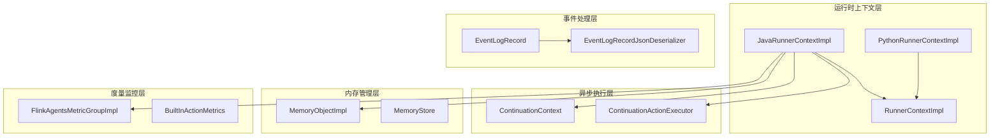
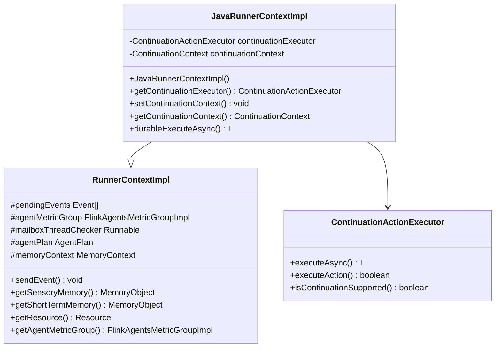
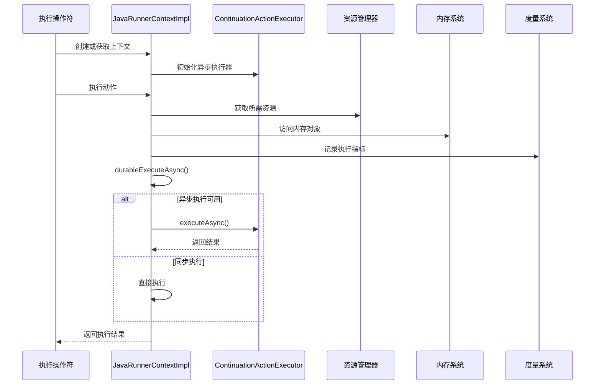
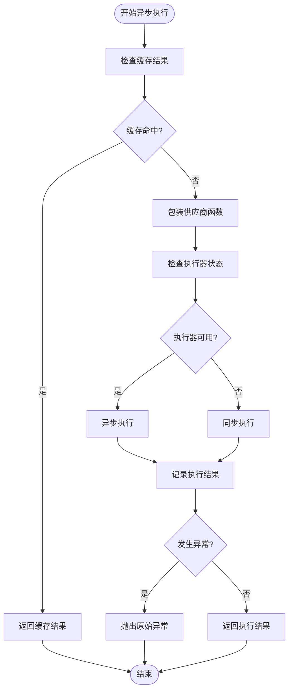
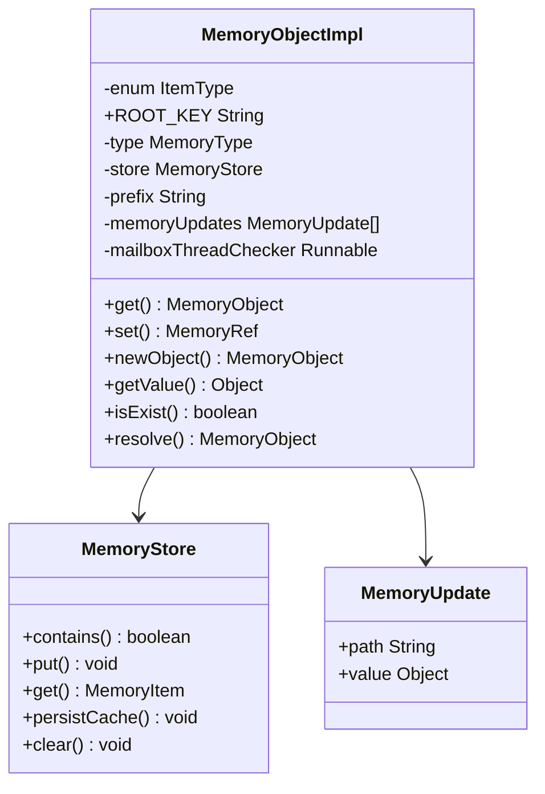
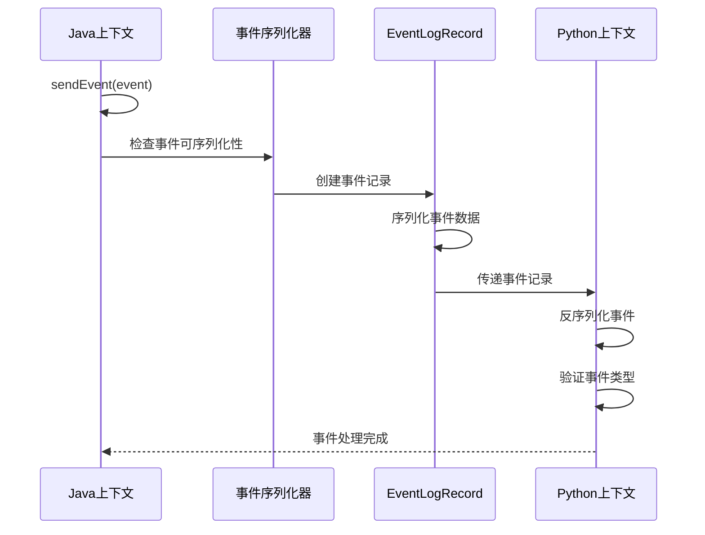
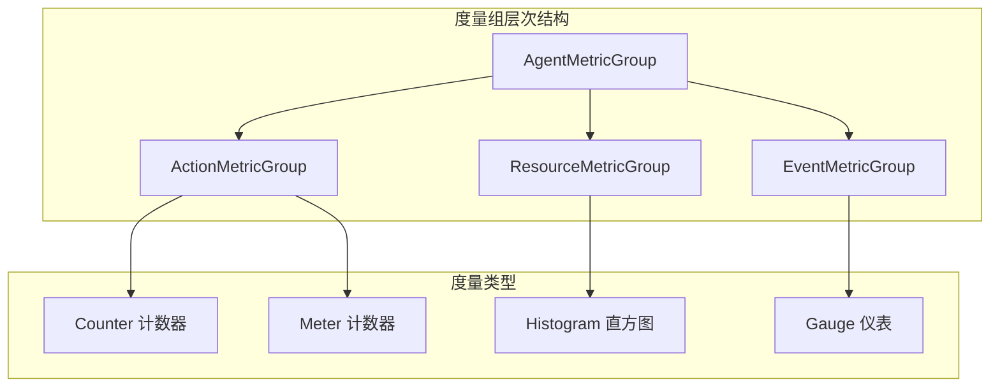
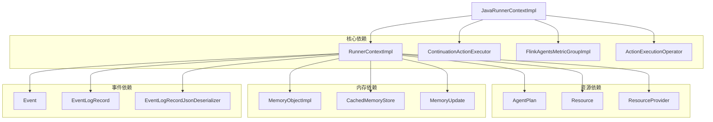

# JavaRunnerContextImpl 实现类

<cite>
**本文档引用的文件**
- [JavaRunnerContextImpl.java](file://runtime/src/main/java/org/apache/flink/agents/runtime/context/JavaRunnerContextImpl.java)
- [RunnerContextImpl.java](file://runtime/src/main/java/org/apache/flink/agents/runtime/context/RunnerContextImpl.java)
- [PythonRunnerContextImpl.java](file://runtime/src/main/java/org/apache/flink/agents/runtime/python/context/PythonRunnerContextImpl.java)
- [ContinuationActionExecutor.java](file://runtime/src/main/java/org/apache/flink/agents/runtime/async/ContinuationActionExecutor.java)
- [ContinuationContext.java](file://runtime/src/main/java/org/apache/flink/agents/runtime/async/ContinuationContext.java)
- [MemoryObjectImpl.java](file://runtime/src/main/java/org/apache/flink/agents/runtime/memory/MemoryObjectImpl.java)
- [FlinkAgentsMetricGroupImpl.java](file://runtime/src/main/java/org/apache/flink/agents/runtime/metrics/FlinkAgentsMetricGroupImpl.java)
- [EventLogRecordJsonDeserializer.java](file://runtime/src/main/java/org/apache/flink/agents/runtime/eventlog/EventLogRecordJsonDeserializer.java)
- [EventLogRecord.java](file://runtime/src/main/java/org/apache/flink/agents/runtime/eventlog/EventLogRecord.java)
- [ActionExecutionOperator.java](file://runtime/src/main/java/org/apache/flink/agents/runtime/operator/ActionExecutionOperator.java)
- [BuiltInActionMetrics.java](file://runtime/src/main/java/org/apache/flink/agents/runtime/metrics/BuiltInActionMetrics.java)
</cite>

## 目录
1. [简介](#简介)
2. [项目结构](#项目结构)
3. [核心组件](#核心组件)
4. [架构概览](#架构概览)
5. [详细组件分析](#详细组件分析)
6. [依赖关系分析](#依赖关系分析)
7. [性能考虑](#性能考虑)
8. [故障排除指南](#故障排除指南)
9. [结论](#结论)

## 简介

JavaRunnerContextImpl 是 Flink Agents 运行时系统中的关键组件，作为 Java 侧运行时上下文的具体实现。该类继承自 RunnerContextImpl，为 Java 动作执行提供了完整的运行时环境支持，包括异步执行、资源管理、内存操作、事件处理和度量监控等功能。

该实现特别针对 Java 环境进行了优化，集成了 ContinuationActionExecutor 以支持异步执行模式，同时保持了与 PythonRunnerContextImpl 的兼容性设计。通过这种架构，系统能够在 Java 和 Python 之间无缝切换，为混合语言的智能代理执行提供统一的运行时抽象。

## 项目结构

JavaRunnerContextImpl 位于运行时模块的上下文包中，与相关的运行时组件共同构成了完整的执行环境：

**图表来源**
- [JavaRunnerContextImpl.java](file://runtime/src/main/java/org/apache/flink/agents/runtime/context/JavaRunnerContextImpl.java#L1-L106)
- [RunnerContextImpl.java](file://runtime/src/main/java/org/apache/flink/agents/runtime/context/RunnerContextImpl.java#L1-L590)
- [PythonRunnerContextImpl.java](file://runtime/src/main/java/org/apache/flink/agents/runtime/python/context/PythonRunnerContextImpl.java#L1-L69)

**章节来源**
- [JavaRunnerContextImpl.java](file://runtime/src/main/java/org/apache/flink/agents/runtime/context/JavaRunnerContextImpl.java#L1-L106)
- [RunnerContextImpl.java](file://runtime/src/main/java/org/apache/flink/agents/runtime/context/RunnerContextImpl.java#L1-L590)

## 核心组件

### JavaRunnerContextImpl 类结构

JavaRunnerContextImpl 作为 Java 专用的运行时上下文实现，具有以下核心特性：

- **继承关系**: 继承自 RunnerContextImpl，获得完整的运行时基础功能
- **异步执行支持**: 集成 ContinuationActionExecutor 提供异步执行能力
- **资源管理**: 通过 AgentPlan 获取和管理各种资源
- **内存操作**: 提供完整的内存对象访问和更新机制
- **事件处理**: 支持事件的序列化、反序列化和跨语言传递
- **度量监控**: 集成 Flink Agents 度量系统进行性能监控

### 关键字段和方法

**图表来源**
- [JavaRunnerContextImpl.java](file://runtime/src/main/java/org/apache/flink/agents/runtime/context/JavaRunnerContextImpl.java#L32-L106)
- [RunnerContextImpl.java](file://runtime/src/main/java/org/apache/flink/agents/runtime/context/RunnerContextImpl.java#L60-L590)

**章节来源**
- [JavaRunnerContextImpl.java](file://runtime/src/main/java/org/apache/flink/agents/runtime/context/JavaRunnerContextImpl.java#L32-L106)
- [RunnerContextImpl.java](file://runtime/src/main/java/org/apache/flink/agents/runtime/context/RunnerContextImpl.java#L60-L200)

## 架构概览

JavaRunnerContextImpl 在整体架构中扮演着核心运行时角色，负责协调各个子系统的协同工作：

**图表来源**
- [ActionExecutionOperator.java](file://runtime/src/main/java/org/apache/flink/agents/runtime/operator/ActionExecutionOperator.java#L1075-L1105)
- [JavaRunnerContextImpl.java](file://runtime/src/main/java/org/apache/flink/agents/runtime/context/JavaRunnerContextImpl.java#L59-L104)

## 详细组件分析

### 异步执行支持

JavaRunnerContextImpl 最重要的扩展功能是异步执行支持，通过 ContinuationActionExecutor 实现：

#### 异步执行流程

**图表来源**
- [JavaRunnerContextImpl.java](file://runtime/src/main/java/org/apache/flink/agents/runtime/context/JavaRunnerContextImpl.java#L59-L104)

#### ContinuationActionExecutor 设计

ContinuationActionExecutor 提供了多版本支持，确保在不同 JDK 版本下的兼容性：

- **JDK 11 实现**: 回退到同步执行模式
- **JDK 21+ 实现**: 利用 Continuation API 实现真正的异步执行
- **线程池管理**: 支持可配置的异步线程数量

**章节来源**
- [JavaRunnerContextImpl.java](file://runtime/src/main/java/org/apache/flink/agents/runtime/context/JavaRunnerContextImpl.java#L59-L104)
- [ContinuationActionExecutor.java](file://runtime/src/main/java/org/apache/flink/agents/runtime/async/ContinuationActionExecutor.java#L28-L70)

### Java 侧内存对象管理

JavaRunnerContextImpl 通过 MemoryObjectImpl 提供了完整的内存管理功能：

#### 内存对象结构

**图表来源**
- [MemoryObjectImpl.java](file://runtime/src/main/java/org/apache/flink/agents/runtime/memory/MemoryObjectImpl.java#L33-L86)

#### 内存更新机制

JavaRunnerContextImpl 实现了增量式内存更新跟踪，支持：

- **增量更新**: 仅跟踪自上次访问以来的内存变更
- **路径访问**: 支持嵌套对象的路径式访问
- **引用解析**: 通过 MemoryRef 实现对象引用的解析
- **事务性操作**: 确保内存操作的原子性和一致性

**章节来源**
- [MemoryObjectImpl.java](file://runtime/src/main/java/org/apache/flink/agents/runtime/memory/MemoryObjectImpl.java#L73-L86)
- [RunnerContextImpl.java](file://runtime/src/main/java/org/apache/flink/agents/runtime/context/RunnerContextImpl.java#L194-L220)

### 事件处理机制

JavaRunnerContextImpl 支持跨语言的事件处理，包括序列化、反序列化和传递：

#### 事件序列化流程

**图表来源**
- [RunnerContextImpl.java](file://runtime/src/main/java/org/apache/flink/agents/runtime/context/RunnerContextImpl.java#L150-L170)
- [EventLogRecordJsonDeserializer.java](file://runtime/src/main/java/org/apache/flink/agents/runtime/eventlog/EventLogRecordJsonDeserializer.java#L46-L121)

#### 事件类型支持

系统支持多种事件类型的序列化和反序列化：

- **内置事件**: InputEvent、OutputEvent、ChatRequestEvent 等
- **自定义事件**: 通过继承 Event 基类实现的自定义事件
- **跨语言兼容**: 通过 eventType 字段实现多态事件处理

**章节来源**
- [RunnerContextImpl.java](file://runtime/src/main/java/org/apache/flink/agents/runtime/context/RunnerContextImpl.java#L150-L170)
- [EventLogRecordJsonDeserializer.java](file://runtime/src/main/java/org/apache/flink/agents/runtime/eventlog/EventLogRecordJsonDeserializer.java#L82-L103)

### 度量组集成

JavaRunnerContextImpl 集成了完整的度量监控系统：

#### 度量组层次结构

**图表来源**
- [FlinkAgentsMetricGroupImpl.java](file://runtime/src/main/java/org/apache/flink/agents/runtime/metrics/FlinkAgentsMetricGroupImpl.java#L38-L67)
- [BuiltInActionMetrics.java](file://runtime/src/main/java/org/apache/flink/agents/runtime/metrics/BuiltInActionMetrics.java#L30-L44)

#### 性能监控指标

系统提供以下关键性能指标：

- **动作执行统计**: 动作总数、执行速率
- **资源使用情况**: 资源调用频率、响应时间
- **内存操作监控**: 内存访问次数、更新频率
- **事件处理性能**: 事件吞吐量、处理延迟

**章节来源**
- [FlinkAgentsMetricGroupImpl.java](file://runtime/src/main/java/org/apache/flink/agents/runtime/metrics/FlinkAgentsMetricGroupImpl.java#L55-L67)
- [BuiltInActionMetrics.java](file://runtime/src/main/java/org/apache/flink/agents/runtime/metrics/BuiltInActionMetrics.java#L30-L44)

## 依赖关系分析

JavaRunnerContextImpl 与系统其他组件存在复杂的依赖关系：

**图表来源**
- [JavaRunnerContextImpl.java](file://runtime/src/main/java/org/apache/flink/agents/runtime/context/JavaRunnerContextImpl.java#L20-L26)
- [RunnerContextImpl.java](file://runtime/src/main/java/org/apache/flink/agents/runtime/context/RunnerContextImpl.java#L20-L45)

### 组件耦合分析

JavaRunnerContextImpl 的设计遵循了高内聚、低耦合的原则：

- **向上依赖**: 依赖于 RunnerContextImpl 提供的基础功能
- **向下依赖**: 通过接口抽象，减少对具体实现的依赖
- **横向依赖**: 与其他运行时组件保持松散耦合

**章节来源**
- [JavaRunnerContextImpl.java](file://runtime/src/main/java/org/apache/flink/agents/runtime/context/JavaRunnerContextImpl.java#L20-L26)
- [RunnerContextImpl.java](file://runtime/src/main/java/org/apache/flink/agents/runtime/context/RunnerContextImpl.java#L20-L45)

## 性能考虑

### 异步执行性能

JavaRunnerContextImpl 的异步执行性能受以下因素影响：

- **线程池大小**: 通过 NUM_ASYNC_THREADS 配置控制
- **JDK 版本**: JDK 21+ 可利用 Continuation API 获得更好的性能
- **任务类型**: CPU 密集型 vs I/O 密集型任务的处理策略

### 内存管理优化

- **增量更新**: 减少不必要的内存同步开销
- **缓存机制**: 利用 tryGetCachedResult 避免重复计算
- **垃圾回收**: 合理的对象生命周期管理

### 度量监控开销

- **采样策略**: 选择合适的采样频率避免过度监控
- **异步记录**: 使用异步方式记录度量数据
- **批量处理**: 批量提交度量数据减少 I/O 操作

## 故障排除指南

### 常见问题诊断

#### 异步执行失败

当异步执行出现问题时，可以检查：

1. **执行器状态**: 确认 ContinuationActionExecutor 是否正确初始化
2. **上下文设置**: 验证 ContinuationContext 是否已正确设置
3. **异常处理**: 检查 DurableExecutionRuntimeException 的原因

#### 内存访问异常

内存相关问题的排查步骤：

1. **线程检查**: 确认 mailboxThreadChecker 正常工作
2. **路径验证**: 检查内存路径的有效性
3. **类型匹配**: 验证内存对象类型的一致性

#### 事件处理错误

事件处理问题的解决方法：

1. **序列化检查**: 验证事件对象的可序列化性
2. **类型匹配**: 确认 eventType 字段的正确性
3. **反序列化验证**: 检查反序列化过程的完整性

**章节来源**
- [JavaRunnerContextImpl.java](file://runtime/src/main/java/org/apache/flink/agents/runtime/context/JavaRunnerContextImpl.java#L89-L103)
- [RunnerContextImpl.java](file://runtime/src/main/java/org/apache/flink/agents/runtime/context/RunnerContextImpl.java#L150-L170)

## 结论

JavaRunnerContextImpl 作为 Java 侧运行时上下文的核心实现，成功地将异步执行、资源管理、内存操作、事件处理和度量监控等复杂功能整合在一个统一的框架中。通过与 PythonRunnerContextImpl 的设计对比，我们可以看到：

### 优势特点

1. **异步执行支持**: 通过 ContinuationActionExecutor 提供了灵活的异步执行能力
2. **内存管理完善**: MemoryObjectImpl 提供了强大的内存操作功能
3. **事件处理跨语言**: 支持 Java 和 Python 之间的事件传递
4. **度量监控全面**: 集成了完整的度量系统用于性能监控

### 适用场景

JavaRunnerContextImpl 特别适用于：

- **混合语言应用**: 需要在 Java 和 Python 之间切换的场景
- **高性能计算**: 需要异步执行和并发处理的应用
- **复杂状态管理**: 需要精细内存控制和状态持久化的系统
- **实时数据处理**: 需要快速事件响应和处理的应用

### 性能差异

与 PythonRunnerContextImpl 相比，JavaRunnerContextImpl 在以下方面具有优势：

- **执行效率**: Java 的原生执行速度通常优于 Python
- **内存管理**: 更精细的内存控制和优化
- **并发性能**: 更好的多线程和异步处理能力
- **类型安全**: 编译时类型检查提供更好的代码质量

通过合理的设计和实现，JavaRunnerContextImpl 为 Flink Agents 系统提供了强大而灵活的 Java 侧运行时支持，是构建高性能智能代理应用的理想选择。