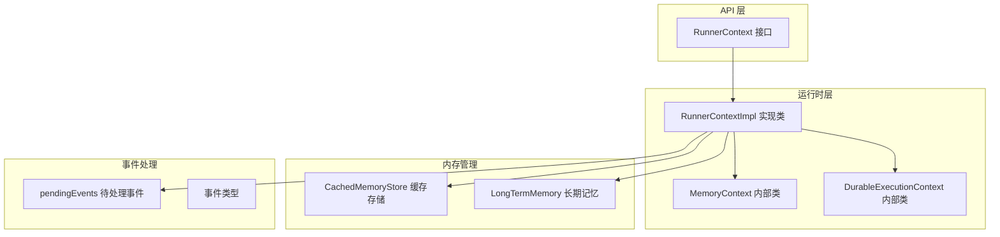
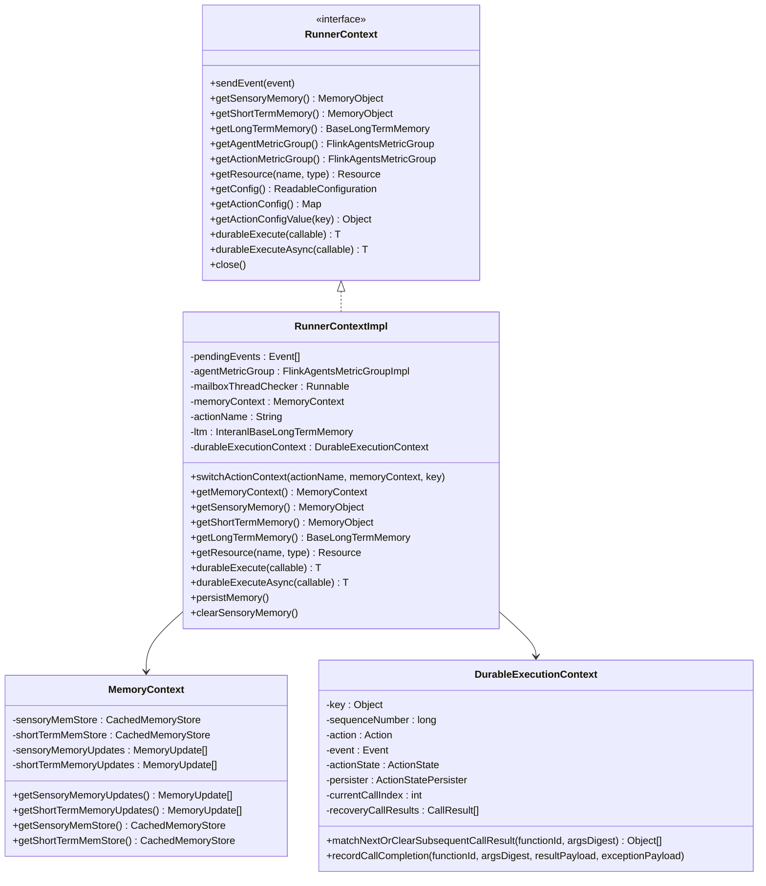
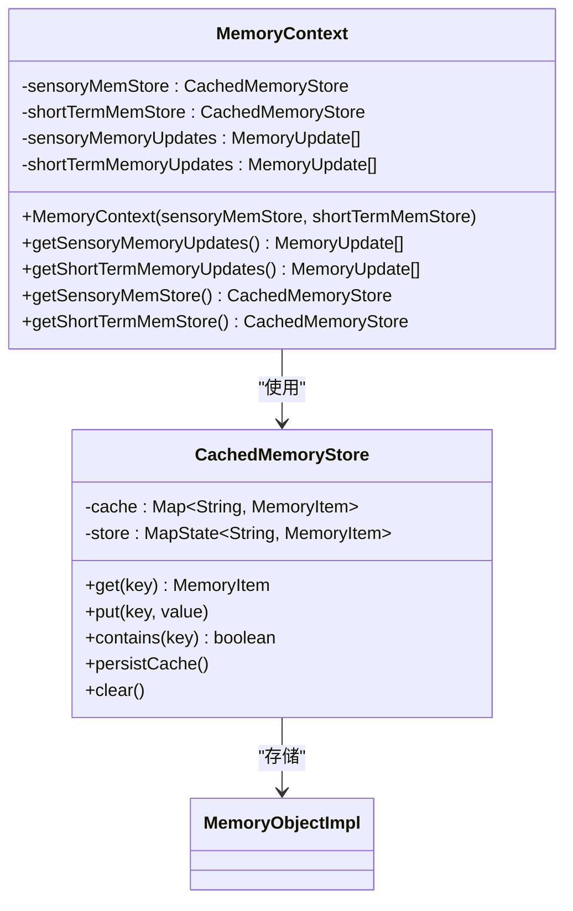
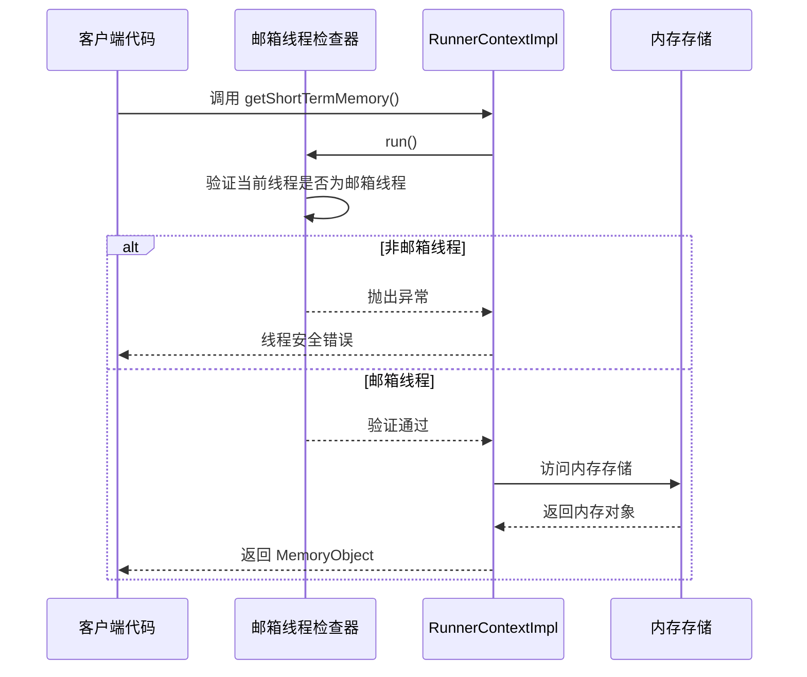
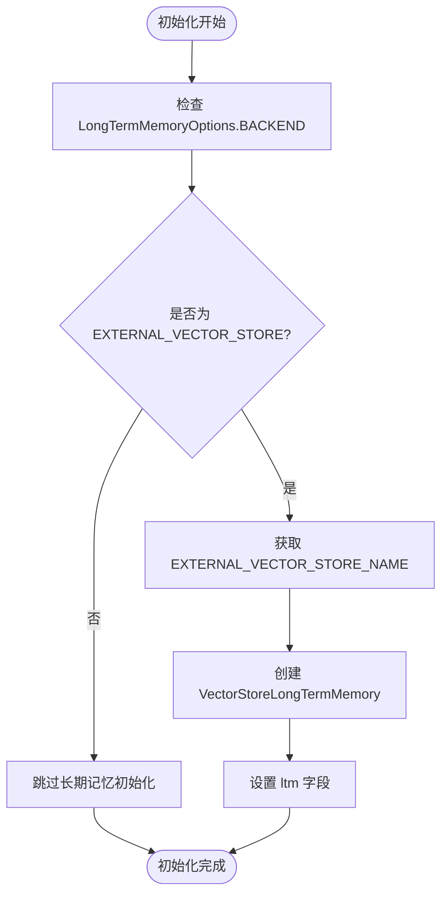
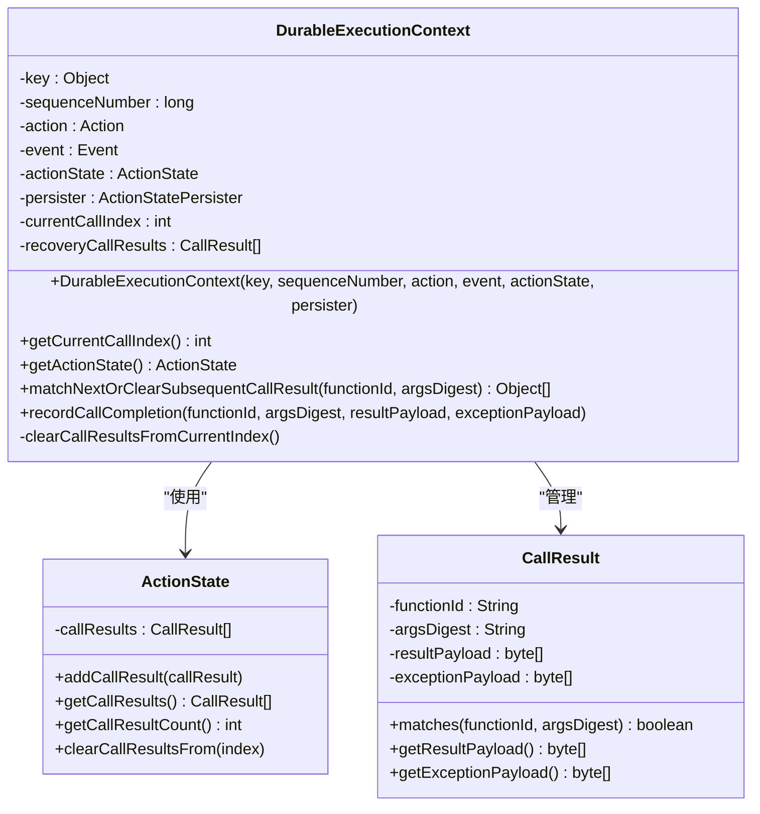
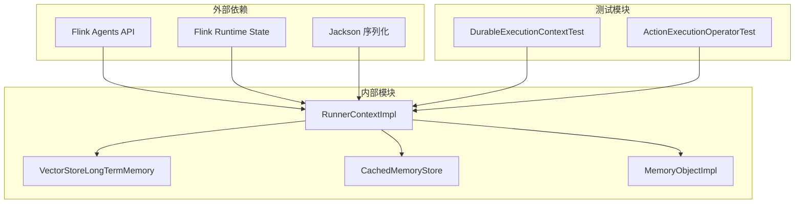

# RunnerContextImpl 实现类

<cite>
**本文档引用的文件**
- [RunnerContextImpl.java](file://runtime/src/main/java/org/apache/flink/agents/runtime/context/RunnerContextImpl.java)
- [RunnerContext.java](file://api/src/main/java/org/apache/flink/agents/api/context/RunnerContext.java)
- [VectorStoreLongTermMemory.java](file://runtime/src/main/java/org/apache/flink/agents/runtime/memory/VectorStoreLongTermMemory.java)
- [CachedMemoryStore.java](file://runtime/src/main/java/org/apache/flink/agents/runtime/memory/CachedMemoryStore.java)
- [MemoryObject.java](file://api/src/main/java/org/apache/flink/agents/api/context/MemoryObject.java)
- [DurableExecutionContextTest.java](file://runtime/src/test/java/org/apache/flink/agents/runtime/context/DurableExecutionContextTest.java)
- [ActionExecutionOperator.java](file://runtime/src/main/java/org/apache/flink/agents/runtime/operator/ActionExecutionOperator.java)
</cite>

## 目录
1. [简介](#简介)
2. [项目结构](#项目结构)
3. [核心组件](#核心组件)
4. [架构概览](#架构概览)
5. [详细组件分析](#详细组件分析)
6. [依赖关系分析](#依赖关系分析)
7. [性能考虑](#性能考虑)
8. [故障排除指南](#故障排除指南)
9. [结论](#结论)

## 简介

RunnerContextImpl 是 Flink Agents 框架中 RunnerContext 接口的具体实现类，负责在动作执行期间提供统一的执行上下文。该类实现了内存上下文管理、事件发送和接收、度量组集成以及资源配置等功能。

该实现类采用邮箱线程检查机制确保线程安全性，并提供了持久化执行上下文支持，使得动作执行可以在作业恢复时保持一致性。

## 项目结构

RunnerContextImpl 类位于运行时模块中，与 API 层的 RunnerContext 接口形成完整的实现关系：

**图表来源**
- [RunnerContextImpl.java](file://runtime/src/main/java/org/apache/flink/agents/runtime/context/RunnerContextImpl.java#L60-L125)
- [RunnerContext.java](file://api/src/main/java/org/apache/flink/agents/api/context/RunnerContext.java#L33-L137)

**章节来源**
- [RunnerContextImpl.java](file://runtime/src/main/java/org/apache/flink/agents/runtime/context/RunnerContextImpl.java#L1-L590)
- [RunnerContext.java](file://api/src/main/java/org/apache/flink/agents/api/context/RunnerContext.java#L1-L138)

## 核心组件

### 主要职责

RunnerContextImpl 实现了以下核心功能：

1. **内存上下文管理**：提供感觉记忆和短期记忆的访问接口
2. **事件处理系统**：支持事件的发送、接收和序列化
3. **度量组集成**：提供全局和动作特定的度量组访问
4. **资源配置**：从 AgentPlan 获取和配置资源
5. **持久化执行**：支持可靠的动作执行和恢复

### 关键属性

- `pendingEvents`: 存储待处理的事件列表
- `agentMetricGroup`: 全局度量组实例
- `mailboxThreadChecker`: 邮箱线程检查器
- `memoryContext`: 当前动作的内存上下文
- `ltm`: 长期记忆管理系统
- `durableExecutionContext`: 持久化执行上下文

**章节来源**
- [RunnerContextImpl.java](file://runtime/src/main/java/org/apache/flink/agents/runtime/context/RunnerContextImpl.java#L95-L125)

## 架构概览

**图表来源**
- [RunnerContextImpl.java](file://runtime/src/main/java/org/apache/flink/agents/runtime/context/RunnerContextImpl.java#L60-L589)
- [RunnerContext.java](file://api/src/main/java/org/apache/flink/agents/api/context/RunnerContext.java#L33-L137)

## 详细组件分析

### MemoryContext 内部类设计

MemoryContext 是 RunnerContextImpl 的内部类，专门负责管理内存上下文：

**图表来源**
- [RunnerContextImpl.java](file://runtime/src/main/java/org/apache/flink/agents/runtime/context/RunnerContextImpl.java#L64-L93)
- [CachedMemoryStore.java](file://runtime/src/main/java/org/apache/flink/agents/runtime/memory/CachedMemoryStore.java#L25-L65)

#### 感觉记忆存储

感觉记忆存储用于临时存储数据，会在代理运行完成后自动清理。它使用 CachedMemoryStore 提供的缓存机制：

- **缓存策略**：内存中的快速访问 + 状态后端的持久化
- **生命周期管理**：与动作执行周期绑定，结束后自动清理
- **更新跟踪**：记录所有对感觉记忆的修改操作

#### 短期记忆存储

短期记忆存储提供更持久的数据保存能力：

- **持久化机制**：通过 persistCache() 方法将缓存内容写入状态后端
- **事务性操作**：支持批量更新和原子性操作
- **内存优化**：结合缓存和直接存储的优势

#### 内存更新列表管理

两个更新列表分别跟踪不同类型内存的变更：

- **sensoryMemoryUpdates**: 感觉记忆的变更历史
- **shortTermMemoryUpdates**: 短期记忆的变更历史

这些更新列表用于动作执行后的状态同步和恢复。

**章节来源**
- [RunnerContextImpl.java](file://runtime/src/main/java/org/apache/flink/agents/runtime/context/RunnerContextImpl.java#L64-L93)
- [CachedMemoryStore.java](file://runtime/src/main/java/org/apache/flink/agents/runtime/memory/CachedMemoryStore.java#L25-L65)

### 邮箱线程检查器机制

邮箱线程检查器是 RunnerContextImpl 的关键线程安全组件：

**图表来源**
- [RunnerContextImpl.java](file://runtime/src/main/java/org/apache/flink/agents/runtime/context/RunnerContextImpl.java#L195-L214)
- [ActionExecutionOperator.java](file://runtime/src/main/java/org/apache/flink/agents/runtime/operator/ActionExecutionOperator.java#L166-L171)

邮箱线程检查器的作用：

1. **线程验证**：确保所有内存访问和事件操作都在邮箱线程中执行
2. **异常处理**：当检测到非邮箱线程访问时抛出明确的异常信息
3. **调试支持**：通过反射机制获取 MailboxProcessor 实例进行线程检查

**章节来源**
- [RunnerContextImpl.java](file://runtime/src/main/java/org/apache/flink/agents/runtime/context/RunnerContextImpl.java#L150-L175)
- [ActionExecutionOperator.java](file://runtime/src/main/java/org/apache/flink/agents/runtime/operator/ActionExecutionOperator.java#L166-L171)

### 长期记忆系统初始化

长期记忆系统根据配置选择不同的后端存储：

**图表来源**
- [RunnerContextImpl.java](file://runtime/src/main/java/org/apache/flink/agents/runtime/context/RunnerContextImpl.java#L118-L125)
- [VectorStoreLongTermMemory.java](file://runtime/src/main/java/org/apache/flink/agents/runtime/memory/VectorStoreLongTermMemory.java#L70-L97)

长期记忆系统的特性：

- **可插拔后端**：支持多种向量存储后端
- **异步压缩**：支持后台数据压缩和优化
- **命名空间隔离**：通过 jobIdentifier 和 key 进行数据隔离
- **资源管理**：自动管理向量存储资源的获取和释放

**章节来源**
- [RunnerContextImpl.java](file://runtime/src/main/java/org/apache/flink/agents/runtime/context/RunnerContextImpl.java#L118-L125)
- [VectorStoreLongTermMemory.java](file://runtime/src/main/java/org/apache/flink/agents/runtime/memory/VectorStoreLongTermMemory.java#L70-L97)

### 持久化执行上下文

DurableExecutionContext 提供细粒度的持久化执行支持：

**图表来源**
- [RunnerContextImpl.java](file://runtime/src/main/java/org/apache/flink/agents/runtime/context/RunnerContextImpl.java#L474-L588)

持久化执行的关键特性：

1. **调用结果缓存**：在 ActionState 中缓存已完成的调用结果
2. **恢复机制**：在作业恢复时重新匹配和验证调用序列
3. **异常处理**：支持异常结果的序列化和恢复
4. **索引管理**：维护当前调用索引以确保执行顺序的一致性

**章节来源**
- [RunnerContextImpl.java](file://runtime/src/main/java/org/apache/flink/agents/runtime/context/RunnerContextImpl.java#L474-L588)
- [DurableExecutionContextTest.java](file://runtime/src/test/java/org/apache/flink/agents/runtime/context/DurableExecutionContextTest.java#L36-L312)

## 依赖关系分析

**图表来源**
- [RunnerContextImpl.java](file://runtime/src/main/java/org/apache/flink/agents/runtime/context/RunnerContextImpl.java#L20-L45)
- [VectorStoreLongTermMemory.java](file://runtime/src/main/java/org/apache/flink/agents/runtime/memory/VectorStoreLongTermMemory.java#L20-L37)

主要依赖关系：

1. **API 层依赖**：依赖 Flink Agents API 定义的接口和类型
2. **运行时依赖**：依赖 Flink Runtime 的状态管理功能
3. **序列化依赖**：使用 Jackson 进行对象序列化和反序列化
4. **测试依赖**：通过单元测试验证核心功能的正确性

**章节来源**
- [RunnerContextImpl.java](file://runtime/src/main/java/org/apache/flink/agents/runtime/context/RunnerContextImpl.java#L20-L45)
- [VectorStoreLongTermMemory.java](file://runtime/src/main/java/org/apache/flink/agents/runtime/memory/VectorStoreLongTermMemory.java#L20-L37)

## 性能考虑

### 内存管理优化

1. **缓存策略**：CachedMemoryStore 使用内存缓存减少状态后端访问频率
2. **批量操作**：支持批量持久化操作减少 I/O 开销
3. **延迟加载**：长期记忆资源按需加载，避免不必要的初始化

### 线程安全开销

1. **检查成本**：邮箱线程检查在每次敏感操作时都会执行
2. **异常处理**：线程验证失败会抛出异常，影响性能
3. **建议**：在设计动作时尽量避免跨线程访问上下文

### 序列化性能

1. **对象映射**：使用 ObjectMapper 进行高效的 JSON 序列化
2. **字节数组**：调用结果以字节数组形式存储，减少序列化开销
3. **异常优化**：异常信息序列化时包含必要的元数据

## 故障排除指南

### 常见问题及解决方案

#### 线程安全错误

**问题描述**：尝试从非邮箱线程访问内存或发送事件

**解决方法**：
1. 确保所有 RunnerContext 操作都在邮箱线程中执行
2. 使用 `mailboxThreadChecker.run()` 明确进行线程验证
3. 在异步操作中正确传递上下文引用

#### 长期记忆初始化失败

**问题描述**：无法正确初始化长期记忆系统

**解决方法**：
1. 检查 LongTermMemoryOptions 配置项
2. 验证外部向量存储资源的可用性
3. 确认资源名称和类型配置正确

#### 持久化执行异常

**问题描述**：持久化执行过程中出现不一致或异常

**解决方法**：
1. 检查 ActionState 的序列化和反序列化
2. 验证调用结果的匹配逻辑
3. 确认异常信息的正确序列化

**章节来源**
- [RunnerContextImpl.java](file://runtime/src/main/java/org/apache/flink/agents/runtime/context/RunnerContextImpl.java#L150-L175)
- [DurableExecutionContextTest.java](file://runtime/src/test/java/org/apache/flink/agents/runtime/context/DurableExecutionContextTest.java#L36-L312)

## 结论

RunnerContextImpl 作为 RunnerContext 接口的完整实现，提供了强大的执行上下文管理能力。其设计特点包括：

1. **全面的功能覆盖**：实现了内存管理、事件处理、度量集成和资源配置等核心功能
2. **严格的线程安全**：通过邮箱线程检查器确保操作的线程安全性
3. **灵活的持久化支持**：提供细粒度的持久化执行上下文
4. **可扩展的架构**：支持多种长期记忆后端和配置选项

该实现为 Flink Agents 框架提供了稳定可靠的执行环境，支持复杂动作的可靠执行和作业恢复。