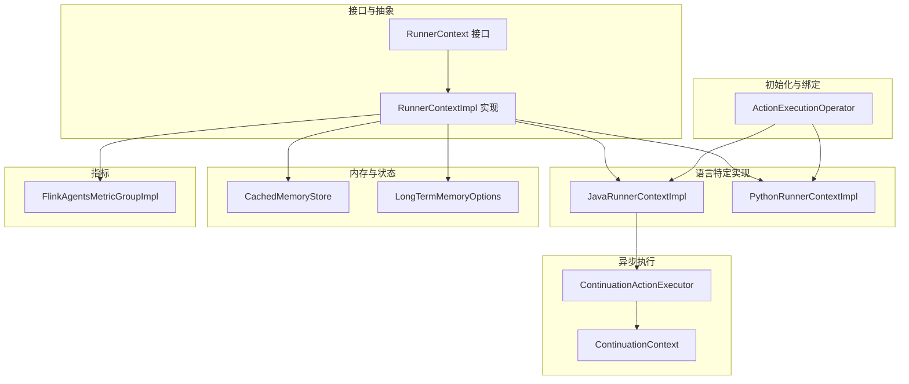
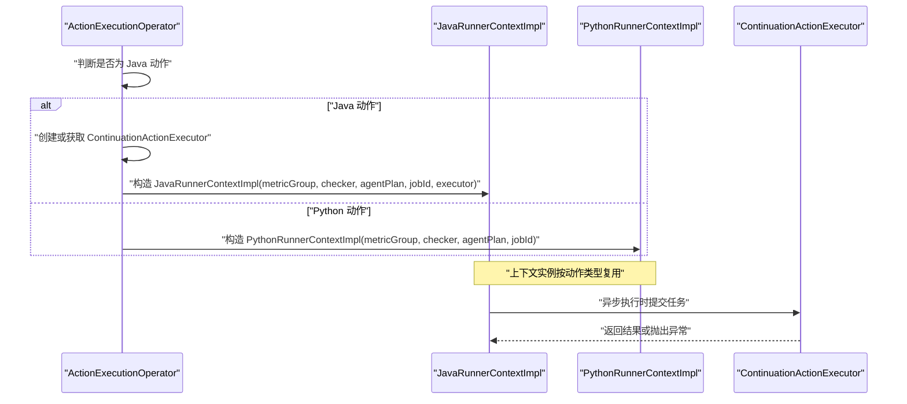
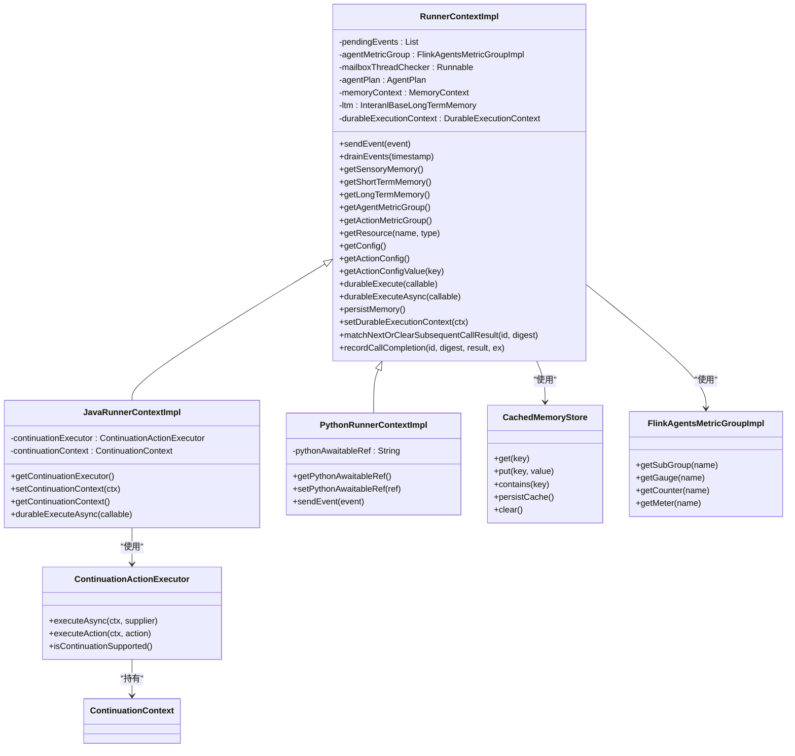
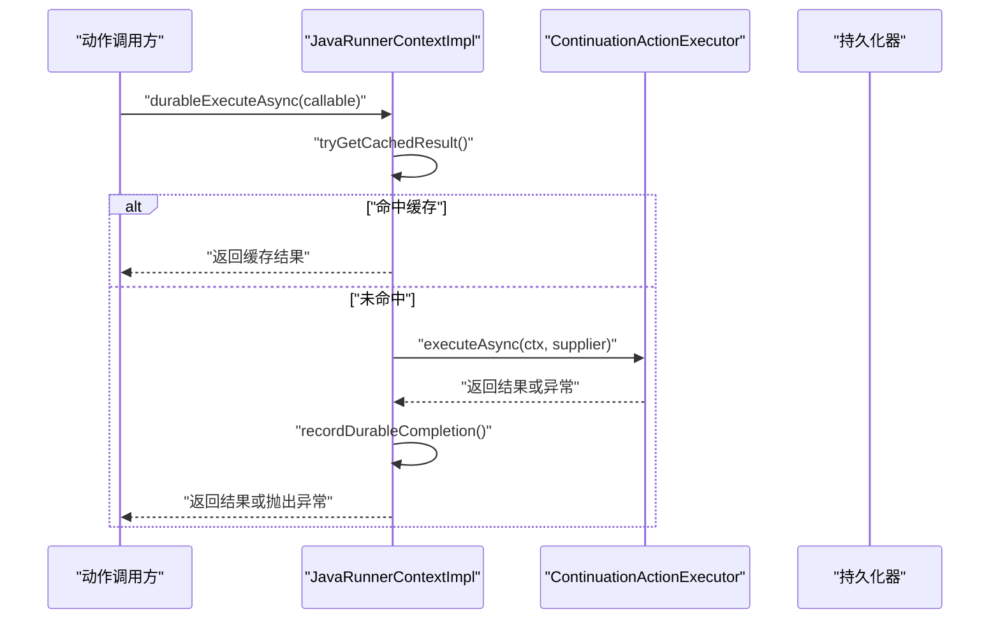
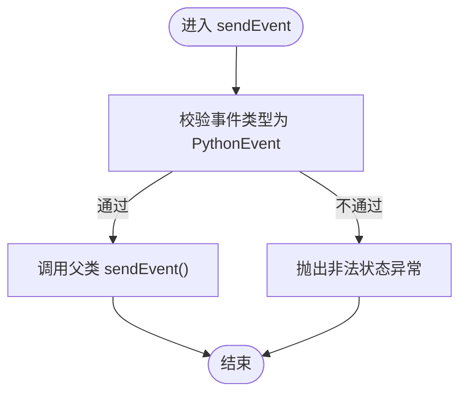
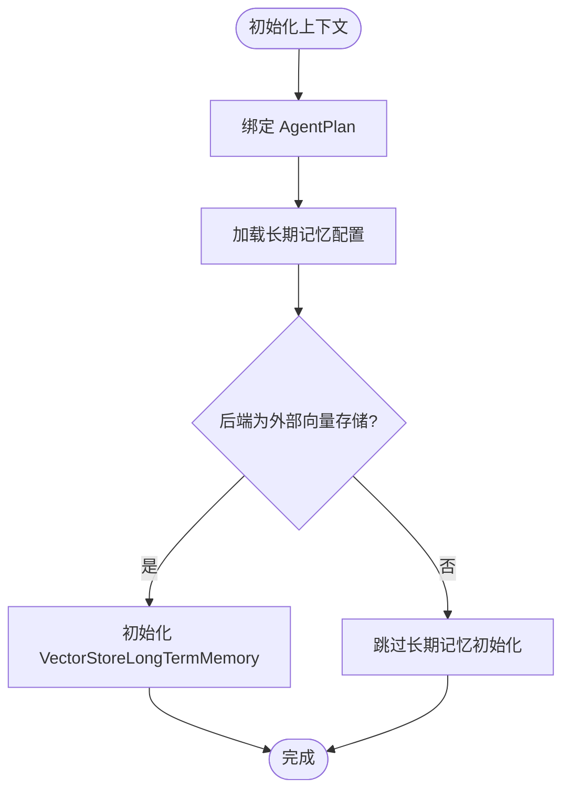
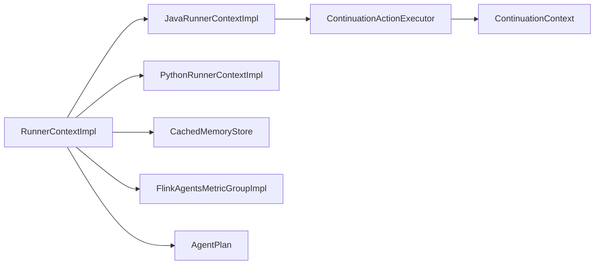

# 上下文实现类

<cite>
**本文引用的文件**
- [RunnerContext.java](file://api/src/main/java/org/apache/flink/agents/api/context/RunnerContext.java)
- [RunnerContextImpl.java](file://runtime/src/main/java/org/apache/flink/agents/runtime/context/RunnerContextImpl.java)
- [JavaRunnerContextImpl.java](file://runtime/src/main/java/org/apache/flink/agents/runtime/context/JavaRunnerContextImpl.java)
- [PythonRunnerContextImpl.java](file://runtime/src/main/java/org/apache/flink/agents/runtime/python/context/PythonRunnerContextImpl.java)
- [ContinuationActionExecutor.java](file://runtime/src/main/java/org/apache/flink/agents/runtime/async/ContinuationActionExecutor.java)
- [ContinuationContext.java](file://runtime/src/main/java/org/apache/flink/agents/runtime/async/ContinuationContext.java)
- [CachedMemoryStore.java](file://runtime/src/main/java/org/apache/flink/agents/runtime/memory/CachedMemoryStore.java)
- [FlinkAgentsMetricGroupImpl.java](file://runtime/src/main/java/org/apache/flink/agents/runtime/metrics/FlinkAgentsMetricGroupImpl.java)
- [LongTermMemoryOptions.java](file://api/src/main/java/org/apache/flink/agents/api/memory/LongTermMemoryOptions.java)
- [ActionExecutionOperator.java](file://runtime/src/main/java/org/apache/flink/agents/runtime/operator/ActionExecutionOperator.java)
- [DurableExecutionContextTest.java](file://runtime/src/test/java/org/apache/flink/agents/runtime/context/DurableExecutionContextTest.java)
- [ActionExecutionOperatorTest.java](file://runtime/src/test/java/org/apache/flink/agents/runtime/operator/ActionExecutionOperatorTest.java)
- [AsyncExecutionAgent.java](file://e2e-test/flink-agents-end-to-end-tests-integration/src/test/java/org/apache/flink/agents/integration/test/AsyncExecutionAgent.java)
</cite>

## 目录
1. [简介](#简介)
2. [项目结构](#项目结构)
3. [核心组件](#核心组件)
4. [架构总览](#架构总览)
5. [详细组件分析](#详细组件分析)
6. [依赖关系分析](#依赖关系分析)
7. [性能考量](#性能考量)
8. [故障排查指南](#故障排查指南)
9. [结论](#结论)
10. [附录：最佳实践与示例](#附录最佳实践与示例)

## 简介
本文件聚焦于上下文实现类，系统性解析 RunnerContext 及其在 Java 与 Python 执行环境中的具体实现，涵盖以下主题：
- 内存上下文管理（感知记忆、短期记忆、长期记忆）
- 事件发送机制与邮箱线程检查器
- 度量组集成与指标采集
- 资源获取与配置访问
- JavaRunnerContextImpl 的异步执行支持与 ContinuationActionExecutor 集成
- 线程安全机制与并发控制策略
- 上下文初始化流程（代理计划绑定、长期记忆系统配置、度量组设置）
- 使用最佳实践（资源管理、异常处理、性能优化）
- 具体示例路径（通过“章节来源”定位到仓库中的测试与示例）

## 项目结构
围绕上下文实现的关键模块如下：
- 接口层：RunnerContext 定义统一的上下文能力边界
- 运行时实现：RunnerContextImpl 提供通用实现；JavaRunnerContextImpl 与 PythonRunnerContextImpl 分别面向 Java 与 Python 执行环境
- 异步支持：ContinuationActionExecutor 与 ContinuationContext 提供 Java 异步执行能力
- 内存与状态：CachedMemoryStore 提供缓存与持久化；LongTermMemoryOptions 控制长期记忆后端
- 指标体系：FlinkAgentsMetricGroupImpl 提供度量组与指标注册
- 初始化与绑定：ActionExecutionOperator 在运行时根据语言类型创建并复用上下文实例

**图示来源**
- [RunnerContext.java](file://api/src/main/java/org/apache/flink/agents/api/context/RunnerContext.java#L29-L137)
- [RunnerContextImpl.java](file://runtime/src/main/java/org/apache/flink/agents/runtime/context/RunnerContextImpl.java#L60-L125)
- [JavaRunnerContextImpl.java](file://runtime/src/main/java/org/apache/flink/agents/runtime/context/JavaRunnerContextImpl.java#L32-L104)
- [PythonRunnerContextImpl.java](file://runtime/src/main/java/org/apache/flink/agents/runtime/python/context/PythonRunnerContextImpl.java#L32-L67)
- [ContinuationActionExecutor.java](file://runtime/src/main/java/org/apache/flink/agents/runtime/async/ContinuationActionExecutor.java#L28-L68)
- [ContinuationContext.java](file://runtime/src/main/java/org/apache/flink/agents/runtime/async/ContinuationContext.java#L21-L26)
- [CachedMemoryStore.java](file://runtime/src/main/java/org/apache/flink/agents/runtime/memory/CachedMemoryStore.java#L25-L64)
- [LongTermMemoryOptions.java](file://api/src/main/java/org/apache/flink/agents/api/memory/LongTermMemoryOptions.java#L22-L52)
- [FlinkAgentsMetricGroupImpl.java](file://runtime/src/main/java/org/apache/flink/agents/runtime/metrics/FlinkAgentsMetricGroupImpl.java#L38-L67)
- [ActionExecutionOperator.java](file://runtime/src/main/java/org/apache/flink/agents/runtime/operator/ActionExecutionOperator.java#L1075-L1105)

**章节来源**
- [RunnerContext.java](file://api/src/main/java/org/apache/flink/agents/api/context/RunnerContext.java#L29-L137)
- [RunnerContextImpl.java](file://runtime/src/main/java/org/apache/flink/agents/runtime/context/RunnerContextImpl.java#L60-L125)
- [JavaRunnerContextImpl.java](file://runtime/src/main/java/org/apache/flink/agents/runtime/context/JavaRunnerContextImpl.java#L32-L104)
- [PythonRunnerContextImpl.java](file://runtime/src/main/java/org/apache/flink/agents/runtime/python/context/PythonRunnerContextImpl.java#L32-L67)
- [ContinuationActionExecutor.java](file://runtime/src/main/java/org/apache/flink/agents/runtime/async/ContinuationActionExecutor.java#L28-L68)
- [ContinuationContext.java](file://runtime/src/main/java/org/apache/flink/agents/runtime/async/ContinuationContext.java#L21-L26)
- [CachedMemoryStore.java](file://runtime/src/main/java/org/apache/flink/agents/runtime/memory/CachedMemoryStore.java#L25-L64)
- [LongTermMemoryOptions.java](file://api/src/main/java/org/apache/flink/agents/api/memory/LongTermMemoryOptions.java#L22-L52)
- [FlinkAgentsMetricGroupImpl.java](file://runtime/src/main/java/org/apache/flink/agents/runtime/metrics/FlinkAgentsMetricGroupImpl.java#L38-L67)
- [ActionExecutionOperator.java](file://runtime/src/main/java/org/apache/flink/agents/runtime/operator/ActionExecutionOperator.java#L1075-L1105)

## 核心组件
- RunnerContext 接口：定义事件发送、内存访问、长期记忆、度量组、资源配置、动作配置、同步/异步持久化执行等能力
- RunnerContextImpl：通用实现，负责事件队列、内存上下文、长期记忆初始化、度量组分组、资源获取、持久化执行（含恢复逻辑）
- JavaRunnerContextImpl：在 RunnerContextImpl 基础上增强 Java 异步执行能力，通过 ContinuationActionExecutor 与 ContinuationContext 协作
- PythonRunnerContextImpl：在 RunnerContextImpl 基础上限制仅接受 PythonEvent，提供 Python awaitable 引用以便恢复执行
- ContinuationActionExecutor/ContinuationContext：提供 Java 异步执行支持（JDK 11 回退同步，JDK 21 多发行版本使用 Continuation API）
- CachedMemoryStore：内存存储缓存与持久化桥接
- FlinkAgentsMetricGroupImpl：度量组与指标注册入口
- ActionExecutionOperator：运行时根据语言类型创建/复用上下文实例

**章节来源**
- [RunnerContext.java](file://api/src/main/java/org/apache/flink/agents/api/context/RunnerContext.java#L29-L137)
- [RunnerContextImpl.java](file://runtime/src/main/java/org/apache/flink/agents/runtime/context/RunnerContextImpl.java#L60-L125)
- [JavaRunnerContextImpl.java](file://runtime/src/main/java/org/apache/flink/agents/runtime/context/JavaRunnerContextImpl.java#L32-L104)
- [PythonRunnerContextImpl.java](file://runtime/src/main/java/org/apache/flink/agents/runtime/python/context/PythonRunnerContextImpl.java#L32-L67)
- [ContinuationActionExecutor.java](file://runtime/src/main/java/org/apache/flink/agents/runtime/async/ContinuationActionExecutor.java#L28-L68)
- [ContinuationContext.java](file://runtime/src/main/java/org/apache/flink/agents/runtime/async/ContinuationContext.java#L21-L26)
- [CachedMemoryStore.java](file://runtime/src/main/java/org/apache/flink/agents/runtime/memory/CachedMemoryStore.java#L25-L64)
- [FlinkAgentsMetricGroupImpl.java](file://runtime/src/main/java/org/apache/flink/agents/runtime/metrics/FlinkAgentsMetricGroupImpl.java#L38-L67)
- [ActionExecutionOperator.java](file://runtime/src/main/java/org/apache/flink/agents/runtime/operator/ActionExecutionOperator.java#L1075-L1105)

## 架构总览
上下文在运行时的创建与使用流程如下：

**图示来源**
- [ActionExecutionOperator.java](file://runtime/src/main/java/org/apache/flink/agents/runtime/operator/ActionExecutionOperator.java#L1075-L1105)
- [JavaRunnerContextImpl.java](file://runtime/src/main/java/org/apache/flink/agents/runtime/context/JavaRunnerContextImpl.java#L37-L104)
- [ContinuationActionExecutor.java](file://runtime/src/main/java/org/apache/flink/agents/runtime/async/ContinuationActionExecutor.java#L30-L57)

## 详细组件分析

### RunnerContextImpl：通用上下文实现
- 内存上下文管理
  - 维护感知记忆与短期记忆的缓存存储（CachedMemoryStore），并记录变更（MemoryUpdate 列表）
  - 提供 getSensoryMemory()/getShortTermMemory() 访问根节点，内部通过 MemoryObjectImpl 与邮箱线程检查器协作
  - 支持持久化缓存与清空操作，便于在动作完成后落盘或清理
- 事件发送机制
  - sendEvent() 在进入前执行邮箱线程检查器，确保只在邮箱线程中进行内存与事件相关操作
  - drainEvents() 将待发送事件批量取出并可设置来源时间戳，随后清空队列
  - checkNoPendingEvents() 断言无挂起事件，用于收尾校验
- 长期记忆集成
  - 依据配置选择外部向量存储作为长期记忆后端，初始化 VectorStoreLongTermMemory 并在动作切换时切换上下文键
- 度量组集成
  - 提供全局度量组与按动作细分的子度量组，便于统计与监控
- 资源获取
  - 从 AgentPlan 中按名称与类型检索资源，并将当前动作度量组注入资源对象
- 配置访问
  - 暴露全局配置与动作级配置（键值查询）
- 持久化执行（durableExecute/durableExecuteAsync）
  - 通过 DurableExecutionContext 记录调用结果与异常，支持作业恢复跳过已执行步骤
  - 异常序列化为 DurableExecutionException，保证跨重启可恢复
- 关闭与清理
  - 关闭长期记忆与代理计划资源

**图示来源**
- [RunnerContextImpl.java](file://runtime/src/main/java/org/apache/flink/agents/runtime/context/RunnerContextImpl.java#L60-L589)
- [JavaRunnerContextImpl.java](file://runtime/src/main/java/org/apache/flink/agents/runtime/context/JavaRunnerContextImpl.java#L32-L104)
- [PythonRunnerContextImpl.java](file://runtime/src/main/java/org/apache/flink/agents/runtime/python/context/PythonRunnerContextImpl.java#L32-L67)
- [ContinuationActionExecutor.java](file://runtime/src/main/java/org/apache/flink/agents/runtime/async/ContinuationActionExecutor.java#L28-L68)
- [ContinuationContext.java](file://runtime/src/main/java/org/apache/flink/agents/runtime/async/ContinuationContext.java#L21-L26)
- [CachedMemoryStore.java](file://runtime/src/main/java/org/apache/flink/agents/runtime/memory/CachedMemoryStore.java#L25-L64)
- [FlinkAgentsMetricGroupImpl.java](file://runtime/src/main/java/org/apache/flink/agents/runtime/metrics/FlinkAgentsMetricGroupImpl.java#L38-L67)

**章节来源**
- [RunnerContextImpl.java](file://runtime/src/main/java/org/apache/flink/agents/runtime/context/RunnerContextImpl.java#L60-L589)
- [CachedMemoryStore.java](file://runtime/src/main/java/org/apache/flink/agents/runtime/memory/CachedMemoryStore.java#L25-L64)
- [FlinkAgentsMetricGroupImpl.java](file://runtime/src/main/java/org/apache/flink/agents/runtime/metrics/FlinkAgentsMetricGroupImpl.java#L38-L67)

### JavaRunnerContextImpl：Java 侧上下文实现
- 设计要点
  - 继承 RunnerContextImpl，扩展 Java 异步执行能力
  - 通过 ContinuationActionExecutor 与 ContinuationContext 协作，实现异步执行与恢复
  - 在 JDK 21+ 场景下利用 Continuation API，JDK 11 下回退为同步执行
- 异步执行支持
  - durableExecuteAsync() 对传入 DurableCallable 进行缓存命中检查
  - 若未命中，包装为 Supplier 并交由 ContinuationActionExecutor 执行
  - 捕获内部异常并转换为 DurableExecutionRuntimeException，最终统一记录完成态
- 与邮箱线程检查器协作
  - 所有内存与事件相关操作均需在邮箱线程中执行，避免并发问题

**图示来源**
- [JavaRunnerContextImpl.java](file://runtime/src/main/java/org/apache/flink/agents/runtime/context/JavaRunnerContextImpl.java#L59-L104)
- [ContinuationActionExecutor.java](file://runtime/src/main/java/org/apache/flink/agents/runtime/async/ContinuationActionExecutor.java#L54-L57)

**章节来源**
- [JavaRunnerContextImpl.java](file://runtime/src/main/java/org/apache/flink/agents/runtime/context/JavaRunnerContextImpl.java#L32-L104)
- [ContinuationActionExecutor.java](file://runtime/src/main/java/org/apache/flink/agents/runtime/async/ContinuationActionExecutor.java#L28-L68)

### PythonRunnerContextImpl：Python 侧上下文实现
- 设计要点
  - 继承 RunnerContextImpl，限制事件类型为 PythonEvent
  - 提供 Python awaitable 引用字段，供 PythonGeneratorActionTask 恢复执行
  - 标注 @NotThreadSafe，强调在单线程上下文中使用
- 事件发送
  - sendEvent(event) 严格校验事件类型
  - sendEvent(type, bytes, json) 由 PythonActionExecutor 在解释器中调用，封装为 PythonEvent 后发送

**图示来源**
- [PythonRunnerContextImpl.java](file://runtime/src/main/java/org/apache/flink/agents/runtime/python/context/PythonRunnerContextImpl.java#L49-L67)

**章节来源**
- [PythonRunnerContextImpl.java](file://runtime/src/main/java/org/apache/flink/agents/runtime/python/context/PythonRunnerContextImpl.java#L32-L67)

### 邮箱线程检查器与并发控制
- 邮箱线程检查器作用
  - 在所有内存访问、事件发送、持久化执行等关键路径前置执行，确保操作发生在邮箱线程
  - 防止跨线程访问共享状态导致的数据竞争与不一致
- 并发控制策略
  - 通过 ActionExecutionOperator 在创建上下文时注入检查器
  - JavaRunnerContextImpl 与 RunnerContextImpl 的关键方法均调用该检查器
  - 测试用例验证了从非邮箱线程访问内存会触发异常，确保约束生效

**章节来源**
- [RunnerContextImpl.java](file://runtime/src/main/java/org/apache/flink/agents/runtime/context/RunnerContextImpl.java#L150-L175)
- [ActionExecutionOperatorTest.java](file://runtime/src/test/java/org/apache/flink/agents/runtime/operator/ActionExecutionOperatorTest.java#L1002-L1014)

### 上下文初始化流程
- 代理计划绑定
  - 上下文构造时接收 AgentPlan，后续通过其获取资源与配置
- 长期记忆系统配置
  - 依据 LongTermMemoryOptions 选择外部向量存储后端，初始化 VectorStoreLongTermMemory
  - 动作切换时通过 switchContext(key) 切换上下文键
- 度量组设置
  - 构造时接收 FlinkAgentsMetricGroupImpl，提供全局与动作级度量组
- 上下文创建与复用
  - ActionExecutionOperator 根据 isJava 分支创建 JavaRunnerContextImpl 或 PythonRunnerContextImpl
  - Java 分支同时创建 ContinuationActionExecutor 并注入上下文

**图示来源**
- [RunnerContextImpl.java](file://runtime/src/main/java/org/apache/flink/agents/runtime/context/RunnerContextImpl.java#L109-L125)
- [LongTermMemoryOptions.java](file://api/src/main/java/org/apache/flink/agents/api/memory/LongTermMemoryOptions.java#L22-L52)
- [ActionExecutionOperator.java](file://runtime/src/main/java/org/apache/flink/agents/runtime/operator/ActionExecutionOperator.java#L1075-L1105)

**章节来源**
- [RunnerContextImpl.java](file://runtime/src/main/java/org/apache/flink/agents/runtime/context/RunnerContextImpl.java#L109-L125)
- [LongTermMemoryOptions.java](file://api/src/main/java/org/apache/flink/agents/api/memory/LongTermMemoryOptions.java#L22-L52)
- [ActionExecutionOperator.java](file://runtime/src/main/java/org/apache/flink/agents/runtime/operator/ActionExecutionOperator.java#L1075-L1105)

## 依赖关系分析
- 组件耦合
  - RunnerContextImpl 与 JavaRunnerContextImpl 之间为继承关系，JavaRunnerContextImpl 依赖 ContinuationActionExecutor
  - PythonRunnerContextImpl 与 RunnerContextImpl 为继承关系，但不引入异步执行依赖
  - 内存与状态依赖 CachedMemoryStore，指标依赖 FlinkAgentsMetricGroupImpl
- 外部依赖
  - AgentPlan 提供资源与配置
  - ActionState/ActionStatePersister 用于持久化执行结果
- 循环依赖
  - 未发现直接循环依赖；异步执行通过接口解耦

**图示来源**
- [RunnerContextImpl.java](file://runtime/src/main/java/org/apache/flink/agents/runtime/context/RunnerContextImpl.java#L60-L125)
- [JavaRunnerContextImpl.java](file://runtime/src/main/java/org/apache/flink/agents/runtime/context/JavaRunnerContextImpl.java#L32-L104)
- [PythonRunnerContextImpl.java](file://runtime/src/main/java/org/apache/flink/agents/runtime/python/context/PythonRunnerContextImpl.java#L32-L67)
- [ContinuationActionExecutor.java](file://runtime/src/main/java/org/apache/flink/agents/runtime/async/ContinuationActionExecutor.java#L28-L68)
- [ContinuationContext.java](file://runtime/src/main/java/org/apache/flink/agents/runtime/async/ContinuationContext.java#L21-L26)
- [CachedMemoryStore.java](file://runtime/src/main/java/org/apache/flink/agents/runtime/memory/CachedMemoryStore.java#L25-L64)
- [FlinkAgentsMetricGroupImpl.java](file://runtime/src/main/java/org/apache/flink/agents/runtime/metrics/FlinkAgentsMetricGroupImpl.java#L38-L67)

**章节来源**
- [RunnerContextImpl.java](file://runtime/src/main/java/org/apache/flink/agents/runtime/context/RunnerContextImpl.java#L60-L125)
- [JavaRunnerContextImpl.java](file://runtime/src/main/java/org/apache/flink/agents/runtime/context/JavaRunnerContextImpl.java#L32-L104)
- [PythonRunnerContextImpl.java](file://runtime/src/main/java/org/apache/flink/agents/runtime/python/context/PythonRunnerContextImpl.java#L32-L67)
- [ContinuationActionExecutor.java](file://runtime/src/main/java/org/apache/flink/agents/runtime/async/ContinuationActionExecutor.java#L28-L68)
- [ContinuationContext.java](file://runtime/src/main/java/org/apache/flink/agents/runtime/async/ContinuationContext.java#L21-L26)
- [CachedMemoryStore.java](file://runtime/src/main/java/org/apache/flink/agents/runtime/memory/CachedMemoryStore.java#L25-L64)
- [FlinkAgentsMetricGroupImpl.java](file://runtime/src/main/java/org/apache/flink/agents/runtime/metrics/FlinkAgentsMetricGroupImpl.java#L38-L67)

## 性能考量
- 异步执行
  - JavaRunnerContextImpl 在 JDK 21+ 可利用 Continuation API 实现真正的非阻塞等待，降低线程占用
  - JDK 11 下回退同步执行，仍可通过线程池提升吞吐，但存在线程切换开销
- 内存缓存与持久化
  - CachedMemoryStore 采用内存缓存 + 批量持久化的策略，减少频繁 IO
  - 建议在动作结束后及时调用 persistMemory()，避免缓存堆积
- 指标采集
  - 使用 FlinkAgentsMetricGroupImpl 的子度量组对动作级指标进行细粒度统计，有助于性能分析
- 长期记忆后端
  - 外部向量存储后端需要考虑网络延迟与写入性能，建议合理设置批大小与刷新频率

[本节为通用指导，无需列出章节来源]

## 故障排查指南
- 邮箱线程违规访问
  - 现象：从非邮箱线程访问内存或事件相关方法抛出异常
  - 排查：确认调用路径是否在邮箱线程；避免在自定义线程池中直接访问上下文
  - 参考测试：[ActionExecutionOperatorTest.java](file://runtime/src/test/java/org/apache/flink/agents/runtime/operator/ActionExecutionOperatorTest.java#L1002-L1014)
- 持久化执行异常
  - 现象：durableExecute/durableExecuteAsync 抛出异常且无法恢复
  - 排查：检查 DurableExecutionException 的序列化/反序列化；确认 ActionState 是否正确持久化
  - 参考测试：[DurableExecutionContextTest.java](file://runtime/src/test/java/org/apache/flink/agents/runtime/context/DurableExecutionContextTest.java#L211-L246)
- Python 事件类型错误
  - 现象：sendEvent 抛出非法状态异常
  - 排查：确保使用 PythonEvent 或通过 sendEvent(type, bytes, json) 由 PythonActionExecutor 封装
  - 参考实现：[PythonRunnerContextImpl.java](file://runtime/src/main/java/org/apache/flink/agents/runtime/python/context/PythonRunnerContextImpl.java#L49-L67)

**章节来源**
- [ActionExecutionOperatorTest.java](file://runtime/src/test/java/org/apache/flink/agents/runtime/operator/ActionExecutionOperatorTest.java#L1002-L1014)
- [DurableExecutionContextTest.java](file://runtime/src/test/java/org/apache/flink/agents/runtime/context/DurableExecutionContextTest.java#L211-L246)
- [PythonRunnerContextImpl.java](file://runtime/src/main/java/org/apache/flink/agents/runtime/python/context/PythonRunnerContextImpl.java#L49-L67)

## 结论
- RunnerContextImpl 提供了统一的上下文能力边界，覆盖事件、内存、长期记忆、度量与资源管理
- JavaRunnerContextImpl 通过 ContinuationActionExecutor 为 Java 动作提供了异步执行支持，兼顾 JDK 版本差异
- PythonRunnerContextImpl 以类型约束与 awaitable 引用保障 Python 动作的正确执行与恢复
- 邮箱线程检查器与严格的内存/事件访问约束确保了线程安全
- 初始化流程清晰地将代理计划、长期记忆与度量组整合进上下文生命周期

[本节为总结，无需列出章节来源]

## 附录：最佳实践与示例

### 最佳实践
- 资源管理
  - 优先通过 getResource(name, type) 获取资源，避免在动作内自行创建昂贵对象
  - 在动作结束时调用 persistMemory() 以减少缓存滞留
- 异常处理
  - durableExecute/durableExecuteAsync 中的异常会被序列化并持久化，确保恢复一致性
  - 对外暴露的异常应尽量包含语义明确的消息，便于诊断
- 性能优化
  - 在 Java 环境优先使用 durableExecuteAsync 以提升吞吐（JDK 21+）
  - 合理设置 NUM_ASYNC_THREADS，避免线程池过载
  - 长期记忆后端写入应批量化，减少网络往返

### 示例路径（通过“章节来源”定位）
- Java 异步执行示例（多步异步链路）
  - [AsyncExecutionAgent.java](file://e2e-test/flink-agents-end-to-end-tests-integration/src/test/java/org/apache/flink/agents/integration/test/AsyncExecutionAgent.java#L172-L218)
- 多次异步调用与结果聚合
  - [ActionExecutionOperatorTest.java](file://runtime/src/test/java/org/apache/flink/agents/runtime/operator/ActionExecutionOperatorTest.java#L1051-L1108)
- 非邮箱线程访问内存触发异常
  - [ActionExecutionOperatorTest.java](file://runtime/src/test/java/org/apache/flink/agents/runtime/operator/ActionExecutionOperatorTest.java#L1002-L1014)
- 持久化执行异常序列化/反序列化
  - [DurableExecutionContextTest.java](file://runtime/src/test/java/org/apache/flink/agents/runtime/context/DurableExecutionContextTest.java#L211-L246)

**章节来源**
- [AsyncExecutionAgent.java](file://e2e-test/flink-agents-end-to-end-tests-integration/src/test/java/org/apache/flink/agents/integration/test/AsyncExecutionAgent.java#L172-L218)
- [ActionExecutionOperatorTest.java](file://runtime/src/test/java/org/apache/flink/agents/runtime/operator/ActionExecutionOperatorTest.java#L1002-L1108)
- [DurableExecutionContextTest.java](file://runtime/src/test/java/org/apache/flink/agents/runtime/context/DurableExecutionContextTest.java#L211-L246)