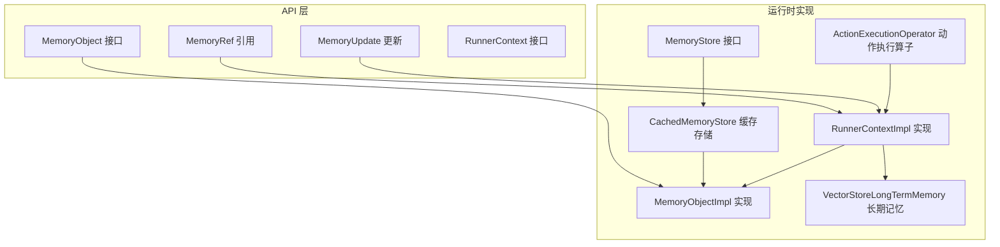
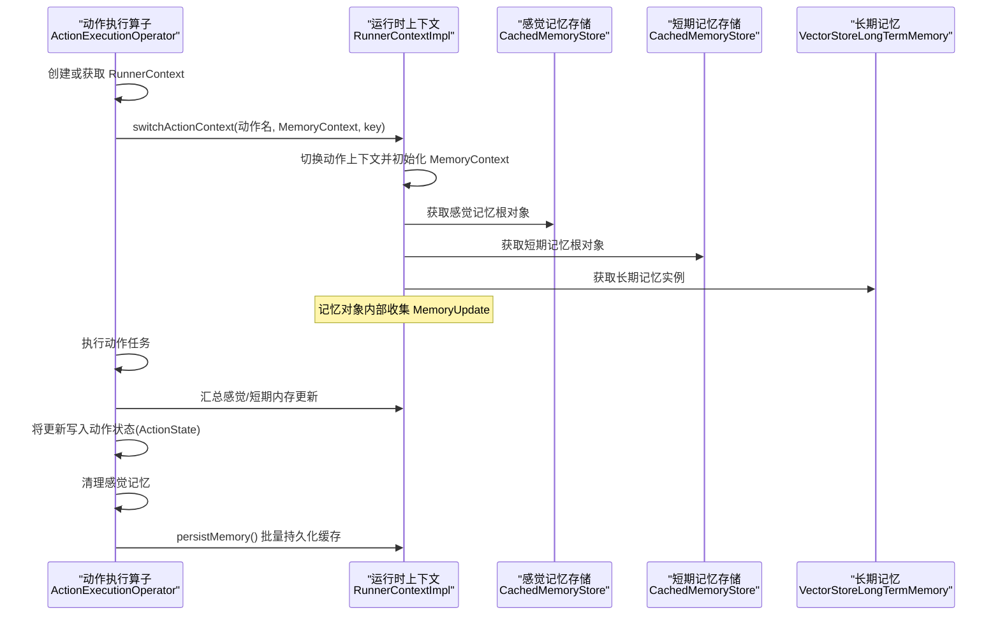
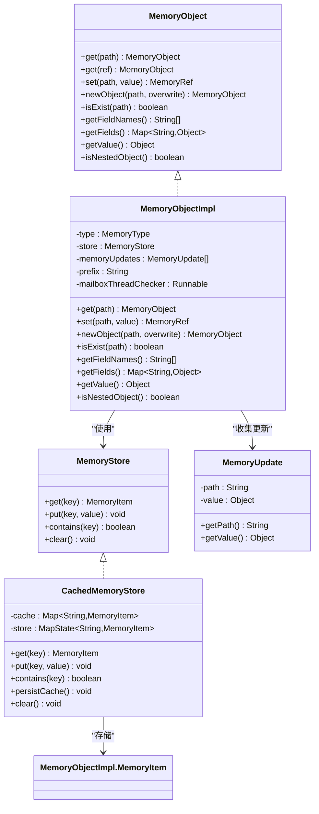
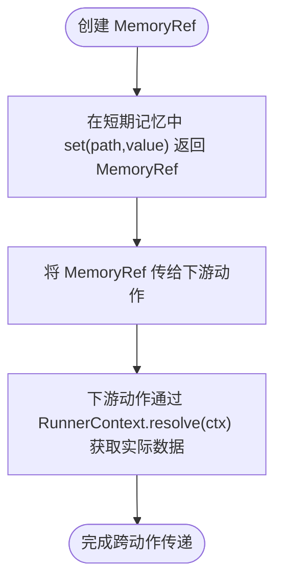
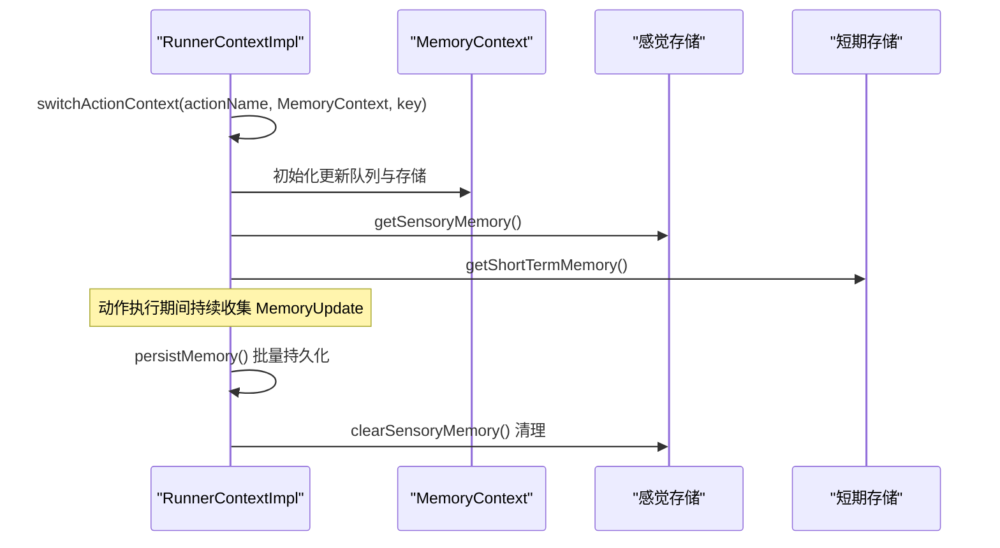
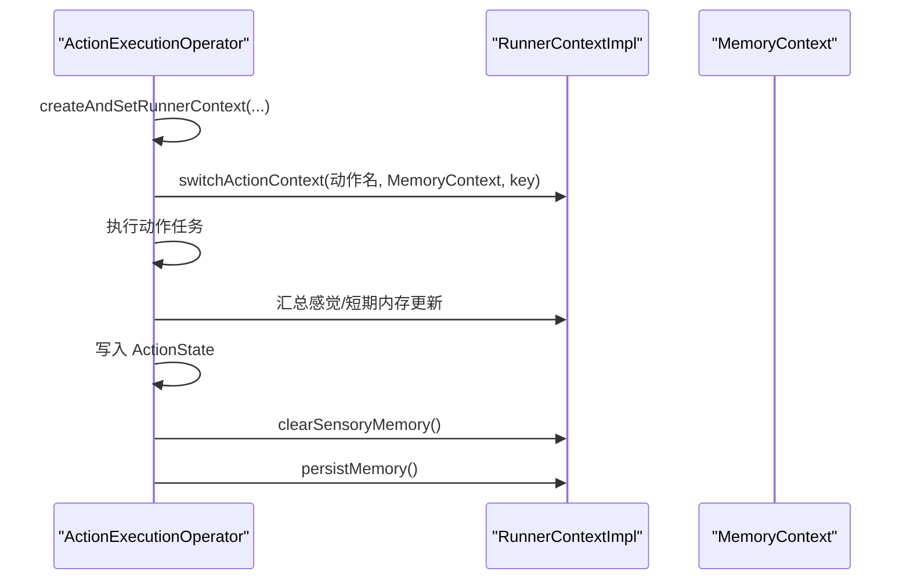
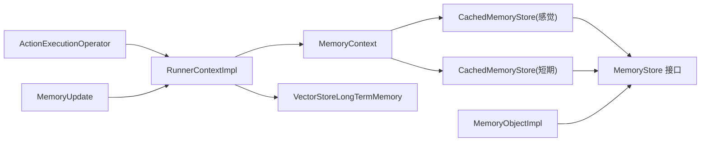

# 内存上下文管理

<cite>
**本文引用的文件**
- [MemoryObject.java](file://api/src/main/java/org/apache/flink/agents/api/context/MemoryObject.java)
- [MemoryRef.java](file://api/src/main/java/org/apache/flink/agents/api/context/MemoryRef.java)
- [MemoryUpdate.java](file://api/src/main/java/org/apache/flink/agents/api/context/MemoryUpdate.java)
- [RunnerContext.java](file://api/src/main/java/org/apache/flink/agents/api/context/RunnerContext.java)
- [MemoryObjectImpl.java](file://runtime/src/main/java/org/apache/flink/agents/runtime/memory/MemoryObjectImpl.java)
- [CachedMemoryStore.java](file://runtime/src/main/java/org/apache/flink/agents/runtime/memory/CachedMemoryStore.java)
- [MemoryStore.java](file://runtime/src/main/java/org/apache/flink/agents/runtime/memory/MemoryStore.java)
- [RunnerContextImpl.java](file://runtime/src/main/java/org/apache/flink/agents/runtime/context/RunnerContextImpl.java)
- [ActionExecutionOperator.java](file://runtime/src/main/java/org/apache/flink/agents/runtime/operator/ActionExecutionOperator.java)
- [VectorStoreLongTermMemory.java](file://runtime/src/main/java/org/apache/flink/agents/runtime/memory/VectorStoreLongTermMemory.java)
- [MemoryObjectTest.java](file://runtime/src/test/java/org/apache/flink/agents/runtime/memory/MemoryObjectTest.java)
- [MemoryRefTest.java](file://runtime/src/test/java/org/apache/flink/agents/runtime/memory/MemoryRefTest.java)
- [test_memory_reference.py](file://python/flink_agents/runtime/tests/test_memory_reference.py)
</cite>

## 目录
1. [简介](#简介)
2. [项目结构](#项目结构)
3. [核心组件](#核心组件)
4. [架构总览](#架构总览)
5. [组件详解](#组件详解)
6. [依赖关系分析](#依赖关系分析)
7. [性能考量](#性能考量)
8. [故障排查指南](#故障排查指南)
9. [结论](#结论)
10. [附录：最佳实践与示例路径](#附录最佳实践与示例路径)

## 简介
本技术文档围绕内存上下文管理系统展开，系统性阐述 MemoryContext 的设计与实现，涵盖感觉记忆（Sensory Memory）与短期记忆（Short-Term Memory）的存储模型、更新队列的收集与处理机制、在不同执行阶段的状态变化与生命周期管理、动作执行与上下文切换逻辑、以及与动作切换相关的上下文切换流程。同时，文档说明了内存缓存存储的持久化机制与性能优化策略，并提供可直接定位到源码的示例路径，帮助读者快速上手并正确使用内存上下文进行数据访问与状态管理。

## 项目结构
内存上下文管理涉及 API 层与运行时层两部分：
- API 层定义抽象接口与数据结构，如 MemoryObject、MemoryRef、MemoryUpdate、RunnerContext；
- 运行时层提供具体实现，如 MemoryObjectImpl、CachedMemoryStore、RunnerContextImpl，并与算子 ActionExecutionOperator 协作完成动作执行与上下文切换。

**图表来源**
- [MemoryObject.java](file://api/src/main/java/org/apache/flink/agents/api/context/MemoryObject.java#L29-L131)
- [MemoryRef.java](file://api/src/main/java/org/apache/flink/agents/api/context/MemoryRef.java#L28-L87)
- [MemoryUpdate.java](file://api/src/main/java/org/apache/flink/agents/api/context/MemoryUpdate.java#L30-L83)
- [RunnerContext.java](file://api/src/main/java/org/apache/flink/agents/api/context/RunnerContext.java#L33-L137)
- [MemoryObjectImpl.java](file://runtime/src/main/java/org/apache/flink/agents/runtime/memory/MemoryObjectImpl.java#L33-L259)
- [CachedMemoryStore.java](file://runtime/src/main/java/org/apache/flink/agents/runtime/memory/CachedMemoryStore.java#L25-L65)
- [MemoryStore.java](file://runtime/src/main/java/org/apache/flink/agents/runtime/memory/MemoryStore.java#L23-L51)
- [RunnerContextImpl.java](file://runtime/src/main/java/org/apache/flink/agents/runtime/context/RunnerContextImpl.java#L60-L589)
- [ActionExecutionOperator.java](file://runtime/src/main/java/org/apache/flink/agents/runtime/operator/ActionExecutionOperator.java#L459-L1022)
- [VectorStoreLongTermMemory.java](file://runtime/src/main/java/org/apache/flink/agents/runtime/memory/VectorStoreLongTermMemory.java#L70-L97)

**章节来源**
- [MemoryObject.java](file://api/src/main/java/org/apache/flink/agents/api/context/MemoryObject.java#L29-L131)
- [RunnerContext.java](file://api/src/main/java/org/apache/flink/agents/api/context/RunnerContext.java#L33-L137)
- [MemoryObjectImpl.java](file://runtime/src/main/java/org/apache/flink/agents/runtime/memory/MemoryObjectImpl.java#L33-L259)
- [RunnerContextImpl.java](file://runtime/src/main/java/org/apache/flink/agents/runtime/context/RunnerContextImpl.java#L60-L589)

## 核心组件
- MemoryObject：短期记忆对象的抽象接口，支持路径式访问、字段存在性检查、嵌套对象创建与值读取等能力。
- MemoryRef：对短期记忆中某数据项的轻量级持久化引用，用于跨动作高效传递大型对象。
- MemoryUpdate：内存更新事件，记录绝对路径与新值，用于收集与回放。
- RunnerContext：动作执行上下文，提供感觉/短期/长期记忆访问、事件发送、资源获取、度量指标、持久化执行等能力。
- MemoryObjectImpl：MemoryObject 的运行时实现，基于 MemoryStore 提供树形结构的键空间与增量更新收集。
- CachedMemoryStore：带缓存的 MemoryStore 实现，负责本地缓存与状态后端的批量持久化。
- RunnerContextImpl：RunnerContext 的运行时实现，维护 MemoryContext（含感觉/短期记忆存储与更新队列），并提供动作级上下文切换与持久化执行支持。
- ActionExecutionOperator：动作执行算子，负责创建/设置 RunnerContext、在动作切换时保存与恢复上下文、清理感觉记忆、持久化动作状态与内存更新。
- VectorStoreLongTermMemory：基于外部向量存储的长期记忆实现，支持集合创建、获取与上下文切换。

**章节来源**
- [MemoryObject.java](file://api/src/main/java/org/apache/flink/agents/api/context/MemoryObject.java#L29-L131)
- [MemoryRef.java](file://api/src/main/java/org/apache/flink/agents/api/context/MemoryRef.java#L28-L87)
- [MemoryUpdate.java](file://api/src/main/java/org/apache/flink/agents/api/context/MemoryUpdate.java#L30-L83)
- [RunnerContext.java](file://api/src/main/java/org/apache/flink/agents/api/context/RunnerContext.java#L33-L137)
- [MemoryObjectImpl.java](file://runtime/src/main/java/org/apache/flink/agents/runtime/memory/MemoryObjectImpl.java#L33-L259)
- [CachedMemoryStore.java](file://runtime/src/main/java/org/apache/flink/agents/runtime/memory/CachedMemoryStore.java#L25-L65)
- [RunnerContextImpl.java](file://runtime/src/main/java/org/apache/flink/agents/runtime/context/RunnerContextImpl.java#L60-L589)
- [ActionExecutionOperator.java](file://runtime/src/main/java/org/apache/flink/agents/runtime/operator/ActionExecutionOperator.java#L459-L1022)
- [VectorStoreLongTermMemory.java](file://runtime/src/main/java/org/apache/flink/agents/runtime/memory/VectorStoreLongTermMemory.java#L70-L97)

## 架构总览
下图展示了从动作执行到内存上下文切换与更新收集的整体流程：

**图表来源**
- [ActionExecutionOperator.java](file://runtime/src/main/java/org/apache/flink/agents/runtime/operator/ActionExecutionOperator.java#L459-L1022)
- [RunnerContextImpl.java](file://runtime/src/main/java/org/apache/flink/agents/runtime/context/RunnerContextImpl.java#L127-L133)
- [RunnerContextImpl.java](file://runtime/src/main/java/org/apache/flink/agents/runtime/context/RunnerContextImpl.java#L194-L220)
- [RunnerContextImpl.java](file://runtime/src/main/java/org/apache/flink/agents/runtime/context/RunnerContextImpl.java#L405-L408)
- [VectorStoreLongTermMemory.java](file://runtime/src/main/java/org/apache/flink/agents/runtime/memory/VectorStoreLongTermMemory.java#L70-L97)

## 组件详解

### MemoryObject 与 MemoryObjectImpl：短期记忆树形结构与更新收集
- 设计要点
  - MemoryObject 定义路径访问、字段存在性、嵌套对象创建、字段枚举与值读取等能力。
  - MemoryObjectImpl 基于 MemoryStore 存储树形节点（OBJECT/VALUE），通过前缀路径与分隔符构建层级；在 set/newObject 时自动填充父节点并维护子键集合。
  - 在每次 set/newObject 时生成 MemoryUpdate 并加入当前上下文的更新列表，用于后续持久化与回放。
- 关键行为
  - set(path, value)：确保父路径存在，禁止将对象覆盖为标量；写入值并记录更新。
  - newObject(path, overwrite)：创建或覆盖嵌套对象，记录更新。
  - get/isExist/getFieldNames/getFields/isNestedObject/getValue：基于当前前缀路径返回对应视图或值。
- 复杂度
  - 路径解析与父节点填充为 O(depth)，其中 depth 为路径段数；字段枚举与读取为 O(k)，k 为当前对象子键数量。
- 错误处理
  - 覆盖冲突抛出非法参数异常；状态访问异常向上抛出以便调用方感知。

**图表来源**
- [MemoryObject.java](file://api/src/main/java/org/apache/flink/agents/api/context/MemoryObject.java#L29-L131)
- [MemoryObjectImpl.java](file://runtime/src/main/java/org/apache/flink/agents/runtime/memory/MemoryObjectImpl.java#L33-L259)
- [MemoryStore.java](file://runtime/src/main/java/org/apache/flink/agents/runtime/memory/MemoryStore.java#L23-L51)
- [CachedMemoryStore.java](file://runtime/src/main/java/org/apache/flink/agents/runtime/memory/CachedMemoryStore.java#L25-L65)
- [MemoryUpdate.java](file://api/src/main/java/org/apache/flink/agents/api/context/MemoryUpdate.java#L30-L83)

**章节来源**
- [MemoryObject.java](file://api/src/main/java/org/apache/flink/agents/api/context/MemoryObject.java#L29-L131)
- [MemoryObjectImpl.java](file://runtime/src/main/java/org/apache/flink/agents/runtime/memory/MemoryObjectImpl.java#L73-L225)
- [MemoryUpdate.java](file://api/src/main/java/org/apache/flink/agents/api/context/MemoryUpdate.java#L30-L83)

### MemoryRef：轻量引用与跨动作传递
- 设计要点
  - MemoryRef 是可序列化的轻量指针，仅持有类型与绝对路径；通过 RunnerContext.resolve 取回实际数据。
  - 支持相等性与哈希比较，便于作为集合元素去重。
- 使用场景
  - 在动作间传递大型对象而不复制数据体，降低序列化与网络开销。
  - 作为中间结果的稳定引用，避免深层路径解析带来的错误。

**图表来源**
- [MemoryRef.java](file://api/src/main/java/org/apache/flink/agents/api/context/MemoryRef.java#L28-L87)
- [RunnerContextImpl.java](file://runtime/src/main/java/org/apache/flink/agents/runtime/context/RunnerContextImpl.java#L194-L220)

**章节来源**
- [MemoryRef.java](file://api/src/main/java/org/apache/flink/agents/api/context/MemoryRef.java#L28-L87)
- [MemoryRefTest.java](file://runtime/src/test/java/org/apache/flink/agents/runtime/memory/MemoryRefTest.java#L135-L247)
- [test_memory_reference.py](file://python/flink_agents/runtime/tests/test_memory_reference.py#L75-L137)

### RunnerContext 与 RunnerContextImpl：上下文与动作级生命周期
- 设计要点
  - RunnerContext 提供感觉/短期/长期记忆访问、事件发送、资源获取、配置读取、持久化执行等能力。
  - RunnerContextImpl 维护 MemoryContext（包含感觉/短期存储与更新队列）、动作名称、长期记忆实例，并提供上下文切换、事件与更新汇总、缓存持久化与清理等。
- 生命周期
  - switchActionContext：在动作切换时设置动作名与 MemoryContext，并将长期记忆上下文切换到 key。
  - persistMemory：将感觉与短期存储的缓存批量写入状态后端。
  - clearSensoryMemory：在单次运行结束后清理感觉记忆。
- 持久化执行
  - durableExecute/durableExecuteAsync：支持细粒度恢复，记录调用结果并在恢复时跳过已完成调用。

**图表来源**
- [RunnerContextImpl.java](file://runtime/src/main/java/org/apache/flink/agents/runtime/context/RunnerContextImpl.java#L127-L133)
- [RunnerContextImpl.java](file://runtime/src/main/java/org/apache/flink/agents/runtime/context/RunnerContextImpl.java#L194-L220)
- [RunnerContextImpl.java](file://runtime/src/main/java/org/apache/flink/agents/runtime/context/RunnerContextImpl.java#L405-L412)

**章节来源**
- [RunnerContext.java](file://api/src/main/java/org/apache/flink/agents/api/context/RunnerContext.java#L33-L137)
- [RunnerContextImpl.java](file://runtime/src/main/java/org/apache/flink/agents/runtime/context/RunnerContextImpl.java#L60-L589)

### 动作执行与上下文切换：ActionExecutionOperator
- 设计要点
  - 在执行动作任务前创建/设置 RunnerContext，并根据是否已有中间上下文决定从映射恢复还是新建 MemoryContext。
  - 动作完成后将感觉/短期内存更新写入动作状态，清理感觉记忆，并持久化缓存。
  - 对异步动作，保存中间上下文（MemoryContext、DurableExecutionContext、续体上下文等）以供后续生成的动作任务恢复使用。
- 关键流程
  - 创建 RunnerContext 并 switchActionContext；
  - 执行动作任务并收集输出事件与内存更新；
  - 将更新写入 ActionState；
  - 清理感觉记忆并持久化缓存。

**图表来源**
- [ActionExecutionOperator.java](file://runtime/src/main/java/org/apache/flink/agents/runtime/operator/ActionExecutionOperator.java#L459-L1022)

**章节来源**
- [ActionExecutionOperator.java](file://runtime/src/main/java/org/apache/flink/agents/runtime/operator/ActionExecutionOperator.java#L459-L1022)

### 长期记忆：VectorStoreLongTermMemory
- 设计要点
  - 基于外部向量存储实现长期记忆，支持集合创建、获取与上下文切换。
  - 支持异步压缩配置，避免并发压缩冲突。
- 上下文切换
  - switchContext(key) 将长期记忆隔离到不同 key 下，保证多键并行执行时的数据隔离。

**章节来源**
- [VectorStoreLongTermMemory.java](file://runtime/src/main/java/org/apache/flink/agents/runtime/memory/VectorStoreLongTermMemory.java#L70-L97)

## 依赖关系分析
- 耦合与内聚
  - MemoryObjectImpl 与 MemoryStore 高内聚，通过统一的键空间与增量更新收集实现清晰职责分离。
  - RunnerContextImpl 作为门面，聚合 MemoryContext、事件队列、度量与资源，便于动作执行时统一管理。
  - ActionExecutionOperator 与 RunnerContextImpl 松耦合，通过接口交互，便于扩展与测试。
- 外部依赖
  - 状态后端 MapState 由 CachedMemoryStore 封装，避免直接操作状态后端的复杂性。
  - 长期记忆依赖外部向量存储资源，通过 RunnerContext 的资源获取接口注入。

**图表来源**
- [ActionExecutionOperator.java](file://runtime/src/main/java/org/apache/flink/agents/runtime/operator/ActionExecutionOperator.java#L459-L1022)
- [RunnerContextImpl.java](file://runtime/src/main/java/org/apache/flink/agents/runtime/context/RunnerContextImpl.java#L60-L589)
- [MemoryObjectImpl.java](file://runtime/src/main/java/org/apache/flink/agents/runtime/memory/MemoryObjectImpl.java#L33-L259)
- [CachedMemoryStore.java](file://runtime/src/main/java/org/apache/flink/agents/runtime/memory/CachedMemoryStore.java#L25-L65)
- [MemoryStore.java](file://runtime/src/main/java/org/apache/flink/agents/runtime/memory/MemoryStore.java#L23-L51)
- [MemoryUpdate.java](file://api/src/main/java/org/apache/flink/agents/api/context/MemoryUpdate.java#L30-L83)

**章节来源**
- [RunnerContextImpl.java](file://runtime/src/main/java/org/apache/flink/agents/runtime/context/RunnerContextImpl.java#L60-L589)
- [MemoryObjectImpl.java](file://runtime/src/main/java/org/apache/flink/agents/runtime/memory/MemoryObjectImpl.java#L33-L259)

## 性能考量
- 缓存与批量持久化
  - CachedMemoryStore 使用本地缓存减少频繁状态后端访问；通过 persistCache() 批量写入，显著降低状态后端压力。
- 更新收集与回放
  - MemoryObjectImpl 在 set/newObject 时即时生成 MemoryUpdate，便于动作完成后一次性写入 ActionState，避免分散写入。
- 线程与邮箱检查
  - 各访问方法均调用 mailboxThreadChecker，确保在受控线程环境中访问状态，避免并发问题。
- 长期记忆与压缩
  - VectorStoreLongTermMemory 支持异步压缩配置，减少压缩对主线程的影响；通过 switchContext 实现多键隔离，避免锁竞争。
- 最佳实践
  - 控制更新频率：合并多次小更新为一次 set/newObject，减少 MemoryUpdate 数量。
  - 使用 MemoryRef：跨动作传递大型对象时优先使用 MemoryRef，避免重复序列化。
  - 及时清理：动作完成后及时调用 clearSensoryMemory 与 persistMemory，释放内存并持久化。

[本节为通用性能指导，不直接分析具体文件]

## 故障排查指南
- 常见问题
  - 覆盖冲突：尝试将对象覆盖为标量或标量覆盖为对象会触发非法参数异常。请检查路径与类型一致性。
  - 路径不存在：通过 MemoryRef.get 或 MemoryObject.get 访问不存在的路径返回空对象，请在使用前进行存在性检查。
  - 线程安全：若在非邮箱线程访问内存，可能触发线程检查异常。请确保在 RunnerContext 的执行上下文中访问。
  - 长期记忆不可用：未配置外部向量存储时，getLongTermMemory 会抛出空指针异常。请确认配置与资源可用。
- 定位手段
  - 使用单元测试验证 MemoryObject 与 MemoryRef 的行为，参考以下测试文件：
    - [MemoryObjectTest.java](file://runtime/src/test/java/org/apache/flink/agents/runtime/memory/MemoryObjectTest.java#L72-L186)
    - [MemoryRefTest.java](file://runtime/src/test/java/org/apache/flink/agents/runtime/memory/MemoryRefTest.java#L146-L247)
    - [test_memory_reference.py](file://python/flink_agents/runtime/tests/test_memory_reference.py#L52-L137)

**章节来源**
- [MemoryObjectImpl.java](file://runtime/src/main/java/org/apache/flink/agents/runtime/memory/MemoryObjectImpl.java#L104-L106)
- [MemoryObjectTest.java](file://runtime/src/test/java/org/apache/flink/agents/runtime/memory/MemoryObjectTest.java#L148-L159)
- [MemoryRefTest.java](file://runtime/src/test/java/org/apache/flink/agents/runtime/memory/MemoryRefTest.java#L223-L228)
- [RunnerContextImpl.java](file://runtime/src/main/java/org/apache/flink/agents/runtime/context/RunnerContextImpl.java#L216-L220)

## 结论
内存上下文管理系统通过 MemoryObject/MemoryRef/MemoryUpdate 的协同，实现了对短期与感觉记忆的高效管理与更新收集；通过 RunnerContextImpl 的上下文封装与 ActionExecutionOperator 的动作级生命周期管理，确保了在复杂执行场景下的稳定性与可恢复性。结合 CachedMemoryStore 的缓存与批量持久化、VectorStoreLongTermMemory 的外部存储能力，系统在性能与可靠性之间取得良好平衡。遵循本文的最佳实践与排错建议，可有效提升内存使用的效率与安全性。

[本节为总结性内容，不直接分析具体文件]

## 附录：最佳实践与示例路径
- 内存管理
  - 使用 MemoryRef 传递大型对象，避免重复序列化与网络传输。
    - 示例路径：[MemoryRefTest.java](file://runtime/src/test/java/org/apache/flink/agents/runtime/memory/MemoryRefTest.java#L146-L180)
    - 示例路径：[test_memory_reference.py](file://python/flink_agents/runtime/tests/test_memory_reference.py#L52-L73)
  - 在动作结束时调用 clearSensoryMemory 清理感觉记忆，防止残留数据影响后续执行。
    - 示例路径：[ActionExecutionOperator.java](file://runtime/src/main/java/org/apache/flink/agents/runtime/operator/ActionExecutionOperator.java#L575-L577)
- 更新频率控制
  - 合并多次 set/newObject 操作，减少 MemoryUpdate 数量与状态后端写入次数。
    - 示例路径：[MemoryObjectTest.java](file://runtime/src/test/java/org/apache/flink/agents/runtime/memory/MemoryObjectTest.java#L168-L185)
- 存储优化建议
  - 使用 CachedMemoryStore 的 persistCache() 批量持久化，降低状态后端压力。
    - 示例路径：[RunnerContextImpl.java](file://runtime/src/main/java/org/apache/flink/agents/runtime/context/RunnerContextImpl.java#L405-L408)
  - 对长期记忆使用外部向量存储，并启用异步压缩以提升吞吐。
    - 示例路径：[VectorStoreLongTermMemory.java](file://runtime/src/main/java/org/apache/flink/agents/runtime/memory/VectorStoreLongTermMemory.java#L70-L97)
- 数据访问与状态管理示例
  - 通过 MemoryObject.get/set/newObject 管理嵌套结构与字段存在性。
    - 示例路径：[MemoryObjectTest.java](file://runtime/src/test/java/org/apache/flink/agents/runtime/memory/MemoryObjectTest.java#L72-L146)
  - 通过 RunnerContext.resolve 解析 MemoryRef 获取实际数据。
    - 示例路径：[MemoryRefTest.java](file://runtime/src/test/java/org/apache/flink/agents/runtime/memory/MemoryRefTest.java#L192-L208)
    - 示例路径：[test_memory_reference.py](file://python/flink_agents/runtime/tests/test_memory_reference.py#L83-L100)

**章节来源**
- [MemoryRefTest.java](file://runtime/src/test/java/org/apache/flink/agents/runtime/memory/MemoryRefTest.java#L146-L208)
- [test_memory_reference.py](file://python/flink_agents/runtime/tests/test_memory_reference.py#L52-L100)
- [MemoryObjectTest.java](file://runtime/src/test/java/org/apache/flink/agents/runtime/memory/MemoryObjectTest.java#L72-L185)
- [RunnerContextImpl.java](file://runtime/src/main/java/org/apache/flink/agents/runtime/context/RunnerContextImpl.java#L405-L408)
- [ActionExecutionOperator.java](file://runtime/src/main/java/org/apache/flink/agents/runtime/operator/ActionExecutionOperator.java#L575-L577)
- [VectorStoreLongTermMemory.java](file://runtime/src/main/java/org/apache/flink/agents/runtime/memory/VectorStoreLongTermMemory.java#L70-L97)