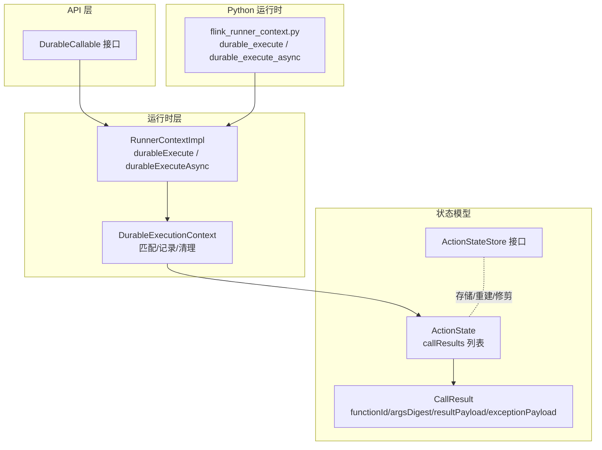
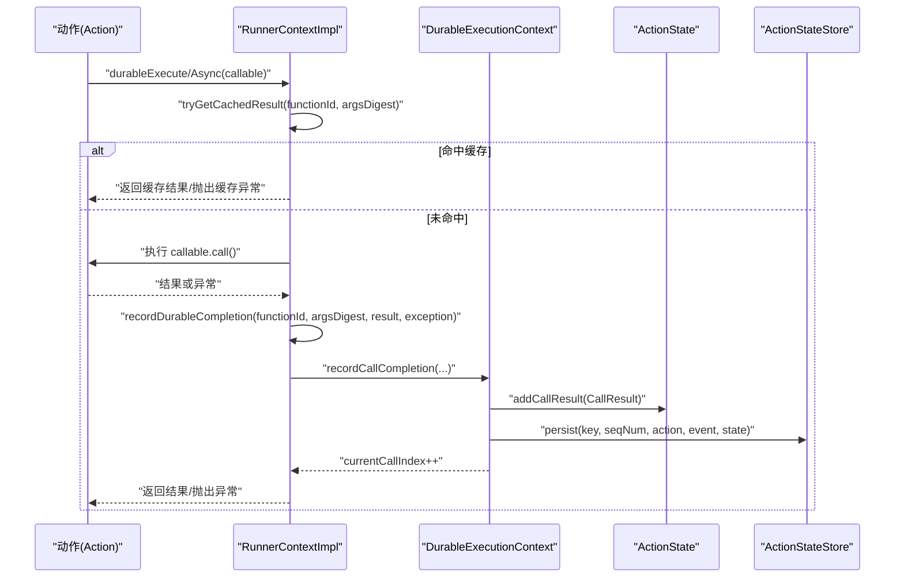
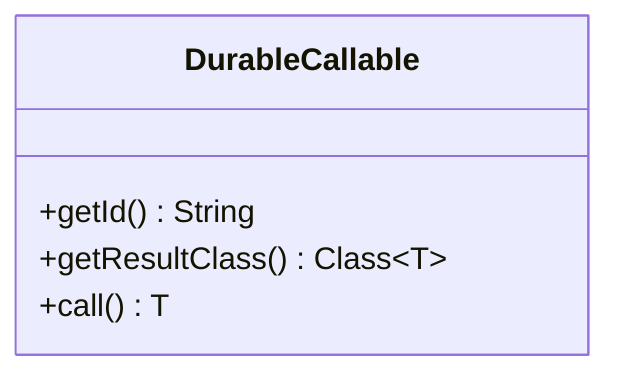
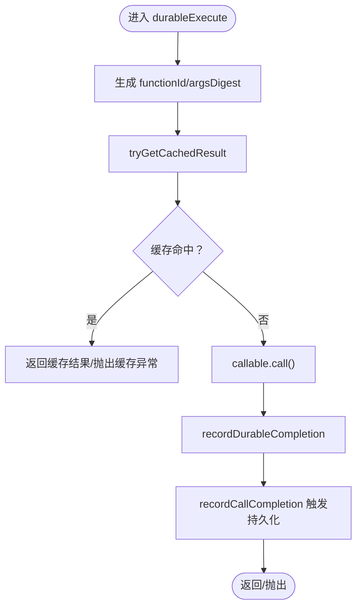
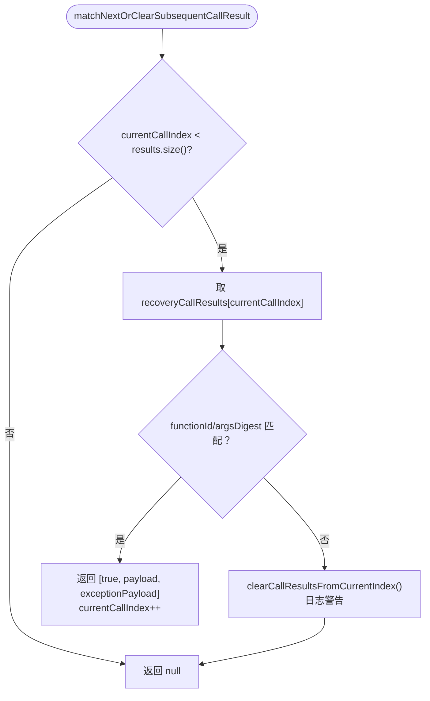
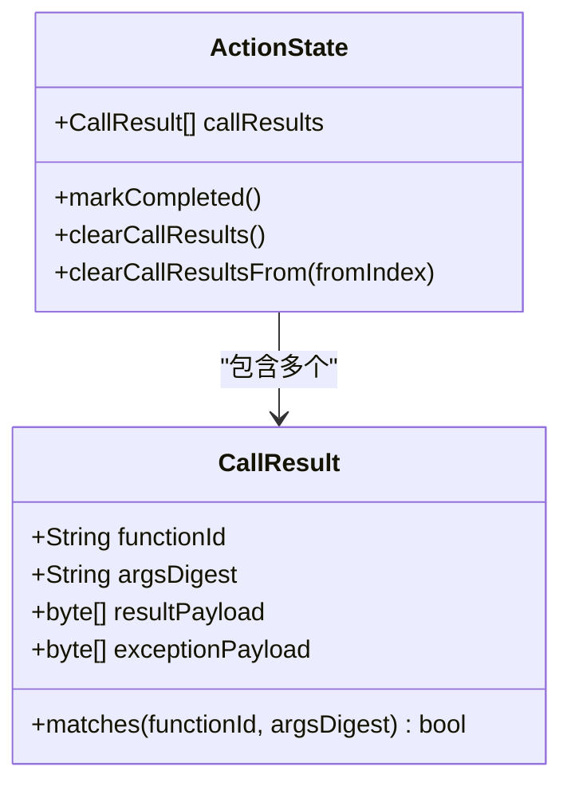
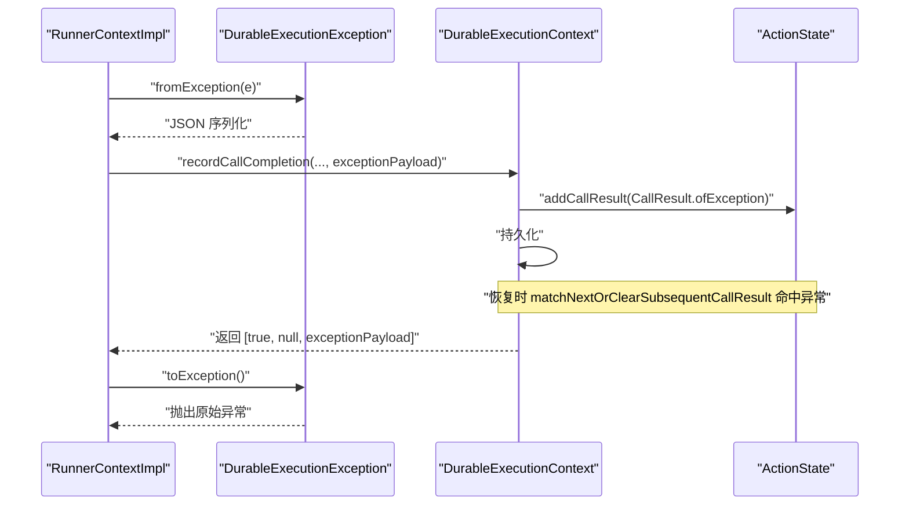
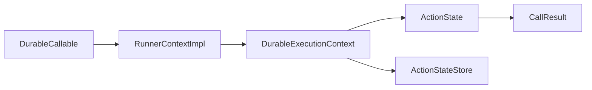

# 持久化执行机制

<cite>
**本文档引用的文件**
- [DurableCallable.java](file://api/src/main/java/org/apache/flink/agents/api/context/DurableCallable.java)
- [RunnerContextImpl.java](file://runtime/src/main/java/org/apache/flink/agents/runtime/context/RunnerContextImpl.java)
- [ActionState.java](file://runtime/src/main/java/org/apache/flink/agents/runtime/actionstate/ActionState.java)
- [CallResult.java](file://runtime/src/main/java/org/apache/flink/agents/runtime/actionstate/CallResult.java)
- [ActionStateStore.java](file://runtime/src/main/java/org/apache/flink/agents/runtime/actionstate/ActionStateStore.java)
- [DurableExecutionContextTest.java](file://runtime/src/test/java/org/apache/flink/agents/runtime/context/DurableExecutionContextTest.java)
- [ActionExecutionOperatorTest.java](file://runtime/src/test/java/org/apache/flink/agents/runtime/operator/ActionExecutionOperatorTest.java)
- [flink_runner_context.py](file://python/flink_agents/runtime/flink_runner_context.py)
- [runner_context.py](file://python/flink_agents/api/runner_context.py)
- [test_durable_execution.py](file://python/flink_agents/runtime/tests/test_durable_execution.py)
</cite>

## 目录
1. [引言](#引言)
2. [项目结构](#项目结构)
3. [核心组件](#核心组件)
4. [架构总览](#架构总览)
5. [详细组件分析](#详细组件分析)
6. [依赖关系分析](#依赖关系分析)
7. [性能考量](#性能考量)
8. [故障排查指南](#故障排查指南)
9. [结论](#结论)
10. [附录：最佳实践与示例](#附录最佳实践与示例)

## 引言
本文件系统性阐述 Flink Agents 中的持久化执行机制，围绕以下目标展开：
- 深入解析 DurableExecutionContext 的设计与实现，涵盖细粒度持久化执行的上下文管理
- 阐述持久化可调用对象 DurableCallable 的工作机制（函数标识符、参数摘要与结果缓存策略）
- 说明持久化执行的恢复机制（调用结果匹配、非确定性检测与后续结果清理）
- 对比持久化执行与普通执行的差异（状态跟踪、结果记录与检查点集成）
- 解释异常处理机制（异常序列化、恢复时的异常重放与错误传播）
- 提供最佳实践（函数设计原则、参数处理策略与性能优化建议）
- 给出具体代码示例路径，展示如何实现与使用持久化执行功能

## 项目结构
持久化执行相关代码主要分布在以下模块：
- API 层：定义 DurableCallable 接口，用于声明稳定的函数标识与结果类型
- 运行时层：实现 RunnerContextImpl 及其内部 DurableExecutionContext，负责调用缓存、结果记录与恢复匹配
- 状态存储层：ActionState/CallResult 描述持久化状态模型；ActionStateStore 定义状态存取接口
- 测试层：覆盖同步/异步持久化执行、异常序列化与恢复匹配等场景
- Python 运行时层：提供与 Java 侧一致的 durable_execute/durable_execute_async 能力与工具函数

**图表来源**
- [DurableCallable.java](file://api/src/main/java/org/apache/flink/agents/api/context/DurableCallable.java#L29-L49)
- [RunnerContextImpl.java](file://runtime/src/main/java/org/apache/flink/agents/runtime/context/RunnerContextImpl.java#L284-L353)
- [RunnerContextImpl.java](file://runtime/src/main/java/org/apache/flink/agents/runtime/context/RunnerContextImpl.java#L474-L588)
- [ActionState.java](file://runtime/src/main/java/org/apache/flink/agents/runtime/actionstate/ActionState.java#L28-L78)
- [CallResult.java](file://runtime/src/main/java/org/apache/flink/agents/runtime/actionstate/CallResult.java#L35-L98)
- [ActionStateStore.java](file://runtime/src/main/java/org/apache/flink/agents/runtime/actionstate/ActionStateStore.java#L27-L92)
- [flink_runner_context.py](file://python/flink_agents/runtime/flink_runner_context.py#L417-L456)

**章节来源**
- [DurableCallable.java](file://api/src/main/java/org/apache/flink/agents/api/context/DurableCallable.java#L18-L49)
- [RunnerContextImpl.java](file://runtime/src/main/java/org/apache/flink/agents/runtime/context/RunnerContextImpl.java#L18-L125)
- [ActionState.java](file://runtime/src/main/java/org/apache/flink/agents/runtime/actionstate/ActionState.java#L28-L78)
- [CallResult.java](file://runtime/src/main/java/org/apache/flink/agents/runtime/actionstate/CallResult.java#L35-L98)
- [ActionStateStore.java](file://runtime/src/main/java/org/apache/flink/agents/runtime/actionstate/ActionStateStore.java#L27-L92)
- [flink_runner_context.py](file://python/flink_agents/runtime/flink_runner_context.py#L417-L456)

## 核心组件
- DurableCallable：声明稳定函数标识与结果类型，封装参数与调用逻辑，确保在恢复时可唯一识别调用
- RunnerContextImpl：对外暴露 durableExecute/durableExecuteAsync，负责缓存命中、结果记录与异常序列化
- DurableExecutionContext：细粒度持久化上下文，负责按序匹配 CallResult、记录完成调用并触发持久化
- ActionState/CallResult：持久化状态模型，记录每个调用的结果或异常，支持恢复时跳过重执行
- ActionStateStore：状态存储接口，定义 put/get/rebuild/prune 等能力，支撑检查点与恢复
- Python 运行时：提供与 Java 一致的 durable_execute/durable_execute_async 语义与工具函数

**章节来源**
- [DurableCallable.java](file://api/src/main/java/org/apache/flink/agents/api/context/DurableCallable.java#L29-L49)
- [RunnerContextImpl.java](file://runtime/src/main/java/org/apache/flink/agents/runtime/context/RunnerContextImpl.java#L284-L353)
- [RunnerContextImpl.java](file://runtime/src/main/java/org/apache/flink/agents/runtime/context/RunnerContextImpl.java#L474-L588)
- [ActionState.java](file://runtime/src/main/java/org/apache/flink/agents/runtime/actionstate/ActionState.java#L111-L180)
- [CallResult.java](file://runtime/src/main/java/org/apache/flink/agents/runtime/actionstate/CallResult.java#L100-L136)
- [ActionStateStore.java](file://runtime/src/main/java/org/apache/flink/agents/runtime/actionstate/ActionStateStore.java#L27-L92)
- [flink_runner_context.py](file://python/flink_agents/runtime/flink_runner_context.py#L417-L456)

## 架构总览
持久化执行在“调用前缓存命中 → 执行 → 记录结果/异常 → 持久化”的主流程中，通过 DurableExecutionContext 在恢复时进行顺序匹配与非确定性检测。

**图表来源**
- [RunnerContextImpl.java](file://runtime/src/main/java/org/apache/flink/agents/runtime/context/RunnerContextImpl.java#L284-L353)
- [RunnerContextImpl.java](file://runtime/src/main/java/org/apache/flink/agents/runtime/context/RunnerContextImpl.java#L457-L464)
- [RunnerContextImpl.java](file://runtime/src/main/java/org/apache/flink/agents/runtime/context/RunnerContextImpl.java#L562-L580)
- [ActionState.java](file://runtime/src/main/java/org/apache/flink/agents/runtime/actionstate/ActionState.java#L121-L123)
- [ActionStateStore.java](file://runtime/src/main/java/org/apache/flink/agents/runtime/actionstate/ActionStateStore.java#L52-L53)

## 详细组件分析

### DurableCallable 设计与实现
- 函数标识符：getId() 返回稳定且唯一的字符串，用于在恢复时匹配已执行的调用
- 结果类型：getResultClass() 返回结果类以支持反序列化
- 调用入口：call() 执行实际逻辑，仅在缓存未命中时调用
- 参数处理：DurableCallable 内部封装所有参数，因此在 RunnerContext 中对 argsDigest 使用空串占位

**图表来源**
- [DurableCallable.java](file://api/src/main/java/org/apache/flink/agents/api/context/DurableCallable.java#L29-L49)

**章节来源**
- [DurableCallable.java](file://api/src/main/java/org/apache/flink/agents/api/context/DurableCallable.java#L29-L49)

### RunnerContextImpl 的持久化执行流程
- 同步持久化执行：durableExecute
  - 生成 functionId（来自 callable.getId），argsDigest 空串
  - 尝试从缓存命中（tryGetCachedResult）：若命中则直接返回或抛出缓存异常
  - 若未命中，执行 callable.call()，捕获异常
  - 通过 recordDurableCompletion 序列化结果或异常，再调用 recordCallCompletion
  - 最终根据是否异常决定抛出或返回
- 异步持久化执行：durableExecuteAsync
  - 包装为 Supplier，在其中捕获异常并以特殊运行时异常包装
  - 外层捕获该包装异常，还原原始异常
  - 其余流程与同步一致

**图表来源**
- [RunnerContextImpl.java](file://runtime/src/main/java/org/apache/flink/agents/runtime/context/RunnerContextImpl.java#L284-L353)
- [RunnerContextImpl.java](file://runtime/src/main/java/org/apache/flink/agents/runtime/context/RunnerContextImpl.java#L268-L281)
- [RunnerContextImpl.java](file://runtime/src/main/java/org/apache/flink/agents/runtime/context/RunnerContextImpl.java#L457-L464)

**章节来源**
- [RunnerContextImpl.java](file://runtime/src/main/java/org/apache/flink/agents/runtime/context/RunnerContextImpl.java#L284-L353)
- [RunnerContextImpl.java](file://runtime/src/main/java/org/apache/flink/agents/runtime/context/RunnerContextImpl.java#L268-L281)
- [RunnerContextImpl.java](file://runtime/src/main/java/org/apache/flink/agents/runtime/context/RunnerContextImpl.java#L457-L464)

### DurableExecutionContext 的恢复与匹配
- 恢复匹配：matchNextOrClearSubsequentCallResult
  - 按当前索引顺序比较 CallResult.functionId 与 argsDigest
  - 匹配成功：返回 [true, resultPayload, exceptionPayload]，索引前进
  - 不匹配：清空从当前索引开始的后续 CallResult，并返回 null
- 记录完成：recordCallCompletion
  - 创建 CallResult 并加入 ActionState
  - 调用 ActionStatePersister 持久化
  - 索引前进
- 非确定性检测：当顺序不一致时，清理后续结果，避免错误恢复

**图表来源**
- [RunnerContextImpl.java](file://runtime/src/main/java/org/apache/flink/agents/runtime/context/RunnerContextImpl.java#L524-L552)
- [RunnerContextImpl.java](file://runtime/src/main/java/org/apache/flink/agents/runtime/context/RunnerContextImpl.java#L582-L587)
- [ActionState.java](file://runtime/src/main/java/org/apache/flink/agents/runtime/actionstate/ActionState.java#L162-L166)

**章节来源**
- [RunnerContextImpl.java](file://runtime/src/main/java/org/apache/flink/agents/runtime/context/RunnerContextImpl.java#L524-L552)
- [RunnerContextImpl.java](file://runtime/src/main/java/org/apache/flink/agents/runtime/context/RunnerContextImpl.java#L582-L587)
- [ActionState.java](file://runtime/src/main/java/org/apache/flink/agents/runtime/actionstate/ActionState.java#L162-L166)

### CallResult 与 ActionState 的状态模型
- CallResult 字段
  - functionId：函数标识符
  - argsDigest：参数摘要（用于验证）
  - resultPayload：成功时的序列化结果
  - exceptionPayload：失败时的序列化异常信息
- ActionState 字段
  - callResults：已完成调用的列表，支持按序恢复
  - completed：标记动作完成，可清理 callResults 以减少存储开销
- 清理策略
  - clearCallResults：清空全部
  - clearCallResultsFrom：从指定索引起清空，用于非确定性检测后的回滚

**图表来源**
- [ActionState.java](file://runtime/src/main/java/org/apache/flink/agents/runtime/actionstate/ActionState.java#L111-L180)
- [CallResult.java](file://runtime/src/main/java/org/apache/flink/agents/runtime/actionstate/CallResult.java#L100-L136)

**章节来源**
- [ActionState.java](file://runtime/src/main/java/org/apache/flink/agents/runtime/actionstate/ActionState.java#L111-L180)
- [CallResult.java](file://runtime/src/main/java/org/apache/flink/agents/runtime/actionstate/CallResult.java#L100-L136)

### 异常处理机制
- 异常序列化：DurableExecutionException 将异常类名与消息序列化为 JSON 字段
- 缓存命中异常重放：当缓存命中异常时，直接反序列化并抛出
- 恢复时异常传播：recordDurableCompletion 将异常序列化后写入 ActionState，恢复时按序匹配并重放

**图表来源**
- [RunnerContextImpl.java](file://runtime/src/main/java/org/apache/flink/agents/runtime/context/RunnerContextImpl.java#L362-L389)
- [RunnerContextImpl.java](file://runtime/src/main/java/org/apache/flink/agents/runtime/context/RunnerContextImpl.java#L256-L258)
- [RunnerContextImpl.java](file://runtime/src/main/java/org/apache/flink/agents/runtime/context/RunnerContextImpl.java#L562-L580)
- [CallResult.java](file://runtime/src/main/java/org/apache/flink/agents/runtime/actionstate/CallResult.java#L95-L98)

**章节来源**
- [RunnerContextImpl.java](file://runtime/src/main/java/org/apache/flink/agents/runtime/context/RunnerContextImpl.java#L362-L389)
- [RunnerContextImpl.java](file://runtime/src/main/java/org/apache/flink/agents/runtime/context/RunnerContextImpl.java#L256-L258)
- [RunnerContextImpl.java](file://runtime/src/main/java/org/apache/flink/agents/runtime/context/RunnerContextImpl.java#L562-L580)
- [CallResult.java](file://runtime/src/main/java/org/apache/flink/agents/runtime/actionstate/CallResult.java#L95-L98)

### Python 运行时的持久化执行
- Python 侧提供 durable_execute/durable_execute_async，行为与 Java 一致
- 内置工具函数用于计算 functionId 与 argsDigest，保证跨语言一致性
- 支持 cloudpickle 序列化复杂结果与异常，便于跨进程/跨语言传递

**章节来源**
- [flink_runner_context.py](file://python/flink_agents/runtime/flink_runner_context.py#L417-L456)
- [runner_context.py](file://python/flink_agents/api/runner_context.py#L206-L246)
- [test_durable_execution.py](file://python/flink_agents/runtime/tests/test_durable_execution.py#L28-L220)

## 依赖关系分析
- RunnerContextImpl 依赖 DurableCallable 接口以获得稳定的函数标识与结果类型
- DurableExecutionContext 依赖 ActionState 与 ActionStatePersister 进行状态读写
- ActionStateStore 定义状态存储后端抽象，支持重建与修剪
- 测试覆盖了同步/异步执行、异常序列化与恢复匹配等关键路径

**图表来源**
- [DurableCallable.java](file://api/src/main/java/org/apache/flink/agents/api/context/DurableCallable.java#L29-L49)
- [RunnerContextImpl.java](file://runtime/src/main/java/org/apache/flink/agents/runtime/context/RunnerContextImpl.java#L474-L588)
- [ActionState.java](file://runtime/src/main/java/org/apache/flink/agents/runtime/actionstate/ActionState.java#L111-L180)
- [CallResult.java](file://runtime/src/main/java/org/apache/flink/agents/runtime/actionstate/CallResult.java#L100-L136)
- [ActionStateStore.java](file://runtime/src/main/java/org/apache/flink/agents/runtime/actionstate/ActionStateStore.java#L27-L92)

**章节来源**
- [DurableCallable.java](file://api/src/main/java/org/apache/flink/agents/api/context/DurableCallable.java#L29-L49)
- [RunnerContextImpl.java](file://runtime/src/main/java/org/apache/flink/agents/runtime/context/RunnerContextImpl.java#L474-L588)
- [ActionState.java](file://runtime/src/main/java/org/apache/flink/agents/runtime/actionstate/ActionState.java#L111-L180)
- [CallResult.java](file://runtime/src/main/java/org/apache/flink/agents/runtime/actionstate/CallResult.java#L100-L136)
- [ActionStateStore.java](file://runtime/src/main/java/org/apache/flink/agents/runtime/actionstate/ActionStateStore.java#L27-L92)

## 性能考量
- 结果缓存命中：优先命中可避免重复调用与 IO，建议合理设计 functionId 与参数摘要
- 持久化频率：每次调用完成后即持久化，确保原子性；可通过批处理策略降低频繁写入（需权衡一致性）
- 存储开销：动作完成后可调用 markCompleted 清理 callResults，减少存储压力
- 异常序列化成本：异常信息序列化为字节流，注意异常大小与 JSON 字段长度
- 非确定性检测：一旦检测到顺序不一致，会清理后续结果，避免错误恢复带来的额外 IO

[本节为通用指导，无需特定文件分析]

## 故障排查指南
- 缓存命中异常未重放
  - 检查缓存命中逻辑与异常序列化字段
  - 参考：[RunnerContextImpl.java](file://runtime/src/main/java/org/apache/flink/agents/runtime/context/RunnerContextImpl.java#L256-L258)
- 恢复时非确定性导致后续结果被清理
  - 查看日志警告与清理行为
  - 参考：[RunnerContextImpl.java](file://runtime/src/main/java/org/apache/flink/agents/runtime/context/RunnerContextImpl.java#L539-L549)
- 多次持久化调用未触发
  - 确认 recordCallCompletion 是否被调用以及 ActionStatePersister 实现
  - 参考：[DurableExecutionContextTest.java](file://runtime/src/test/java/org/apache/flink/agents/runtime/context/DurableExecutionContextTest.java#L195-L207)
- 异常序列化/反序列化失败
  - 检查 JSON 字段与异常类名/消息
  - 参考：[DurableExecutionContextTest.java](file://runtime/src/test/java/org/apache/flink/agents/runtime/context/DurableExecutionContextTest.java#L211-L232)

**章节来源**
- [RunnerContextImpl.java](file://runtime/src/main/java/org/apache/flink/agents/runtime/context/RunnerContextImpl.java#L256-L258)
- [RunnerContextImpl.java](file://runtime/src/main/java/org/apache/flink/agents/runtime/context/RunnerContextImpl.java#L539-L549)
- [DurableExecutionContextTest.java](file://runtime/src/test/java/org/apache/flink/agents/runtime/context/DurableExecutionContextTest.java#L195-L207)
- [DurableExecutionContextTest.java](file://runtime/src/test/java/org/apache/flink/agents/runtime/context/DurableExecutionContextTest.java#L211-L232)

## 结论
持久化执行机制通过 DurableCallable 的稳定标识与 RunnerContextImpl 的缓存/记录/恢复流程，结合 ActionState/CallResult 的细粒度状态模型，实现了在作业重启时跳过已执行调用的能力。DurableExecutionContext 在恢复时按序匹配 CallResult，遇到非确定性则清理后续结果，确保恢复正确性。异常通过 DurableExecutionException 序列化并在恢复时重放，保障错误语义一致。配合 Python 侧工具函数与序列化库，形成跨语言一致的持久化执行体验。

[本节为总结，无需特定文件分析]

## 附录：最佳实践与示例

### 函数设计原则
- 保持函数幂等：同一 functionId + argsDigest 的组合应产生相同结果
- 明确异常语义：异常应可序列化，便于恢复时重放
- 控制参数范围：argsDigest 基于参数计算，避免不可序列化或体积过大的参数

**章节来源**
- [DurableCallable.java](file://api/src/main/java/org/apache/flink/agents/api/context/DurableCallable.java#L29-L49)
- [RunnerContextImpl.java](file://runtime/src/main/java/org/apache/flink/agents/runtime/context/RunnerContextImpl.java#L362-L389)

### 参数处理策略
- 使用稳定参数：避免随机数、时间戳等非确定性输入
- 合理摘要：确保 argsDigest 能唯一标识调用意图
- Python 工具：参考函数 ID 与摘要计算测试

**章节来源**
- [test_durable_execution.py](file://python/flink_agents/runtime/tests/test_durable_execution.py#L51-L128)

### 性能优化建议
- 动作完成后清理 callResults：调用 markCompleted
- 合理控制持久化频率：在保证一致性的前提下减少写入次数
- 结果与异常大小控制：避免过大的 payload 影响序列化与存储

**章节来源**
- [ActionState.java](file://runtime/src/main/java/org/apache/flink/agents/runtime/actionstate/ActionState.java#L177-L180)

### 使用示例（代码路径）
- Java 同步持久化执行
  - 示例路径：[ActionExecutionOperatorTest.java](file://runtime/src/test/java/org/apache/flink/agents/runtime/operator/ActionExecutionOperatorTest.java#L1121-L1137)
- Java 异步持久化执行
  - 示例路径：[ActionExecutionOperatorTest.java](file://runtime/src/test/java/org/apache/flink/agents/runtime/operator/ActionExecutionOperatorTest.java#L1016-L1030)
- Python 同步持久化执行
  - 示例路径：[execute_test_agent.py](file://python/flink_agents/e2e_tests/e2e_tests_integration/execute_test_agent.py#L100-L120)
- Python 异步持久化执行
  - 示例路径：[execute_test_agent.py](file://python/flink_agents/e2e_tests/e2e_tests_integration/execute_test_agent.py#L123-L140)

**章节来源**
- [ActionExecutionOperatorTest.java](file://runtime/src/test/java/org/apache/flink/agents/runtime/operator/ActionExecutionOperatorTest.java#L1016-L1137)
- [execute_test_agent.py](file://python/flink_agents/e2e_tests/e2e_tests_integration/execute_test_agent.py#L100-L140)