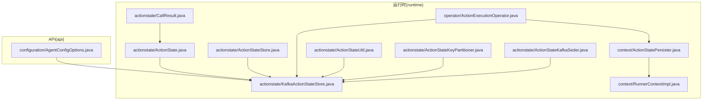
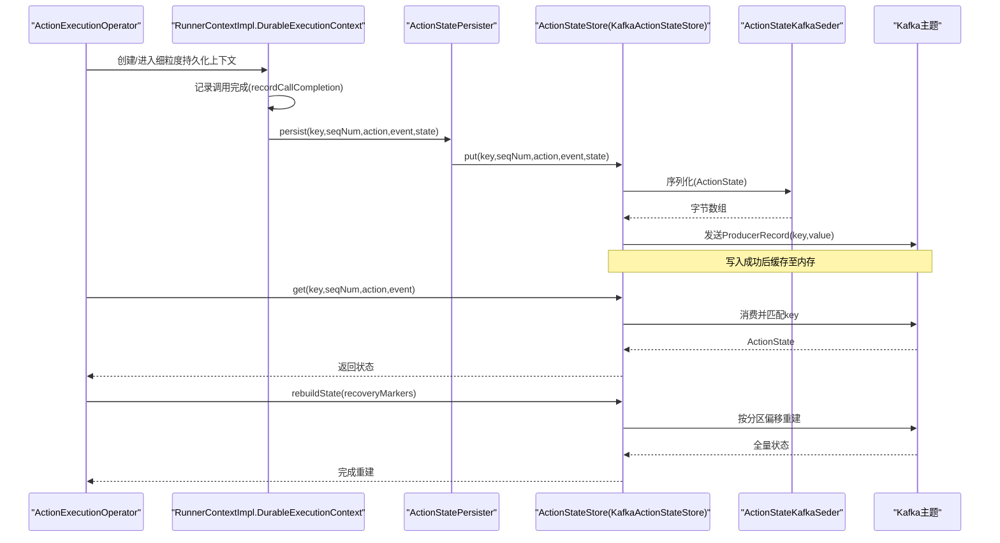
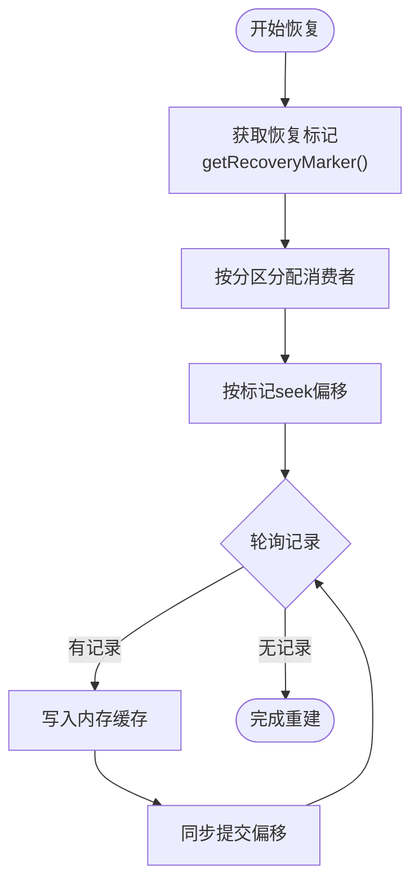
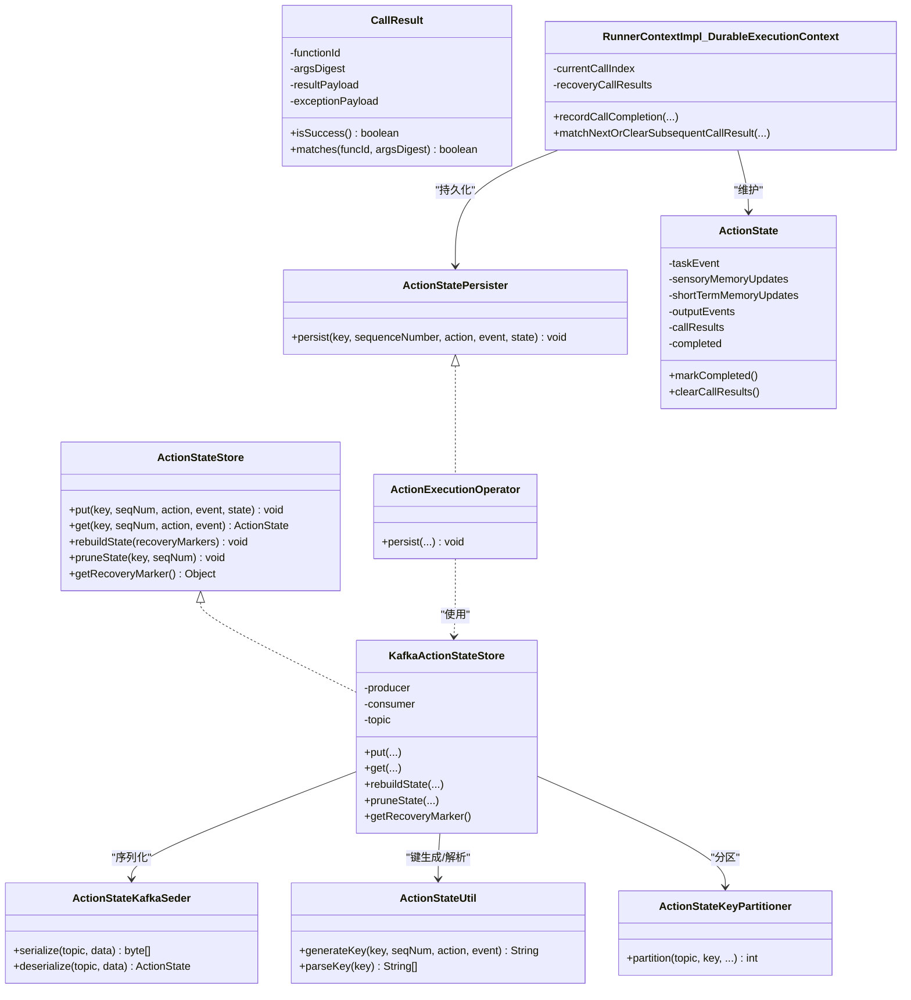

# 状态持久化

<cite>
**本文引用的文件**
- [ActionStatePersister.java](file://runtime/src/main/java/org/apache/flink/agents/runtime/context/ActionStatePersister.java)
- [ActionStateStore.java](file://runtime/src/main/java/org/apache/flink/agents/runtime/actionstate/ActionStateStore.java)
- [ActionState.java](file://runtime/src/main/java/org/apache/flink/agents/runtime/actionstate/ActionState.java)
- [CallResult.java](file://runtime/src/main/java/org/apache/flink/agents/runtime/actionstate/CallResult.java)
- [ActionStateUtil.java](file://runtime/src/main/java/org/apache/flink/agents/runtime/actionstate/ActionStateUtil.java)
- [ActionStateKeyPartitioner.java](file://runtime/src/main/java/org/apache/flink/agents/runtime/actionstate/ActionStateKeyPartitioner.java)
- [ActionStateKafkaSeder.java](file://runtime/src/main/java/org/apache/flink/agents/runtime/actionstate/ActionStateKafkaSeder.java)
- [KafkaActionStateStore.java](file://runtime/src/main/java/org/apache/flink/agents/runtime/actionstate/KafkaActionStateStore.java)
- [RunnerContextImpl.java](file://runtime/src/main/java/org/apache/flink/agents/runtime/context/RunnerContextImpl.java)
- [ActionExecutionOperator.java](file://runtime/src/main/java/org/apache/flink/agents/runtime/operator/ActionExecutionOperator.java)
- [AgentConfigOptions.java](file://api/src/main/java/org/apache/flink/agents/api/configuration/AgentConfigOptions.java)
- [ActionStateSerdeTest.java](file://runtime/src/test/java/org/apache/flink/agents/runtime/actionstate/ActionStateSerdeTest.java)
- [KafkaActionStateStoreTest.java](file://runtime/src/test/java/org/apache/flink/agents/runtime/actionstate/KafkaActionStateStoreTest.java)
- [DurableExecutionContextTest.java](file://runtime/src/test/java/org/apache/flink/agents/runtime/context/DurableExecutionContextTest.java)
</cite>

## 目录
1. [引言](#引言)
2. [项目结构](#项目结构)
3. [核心组件](#核心组件)
4. [架构总览](#架构总览)
5. [组件详解](#组件详解)
6. [依赖关系分析](#依赖关系分析)
7. [性能考量](#性能考量)
8. [故障排查指南](#故障排查指南)
9. [结论](#结论)
10. [附录：最佳实践与示例路径](#附录最佳实践与示例路径)

## 引言
本技术文档围绕状态持久化系统展开，重点阐释 ActionStatePersister 接口的设计理念与实现要求，覆盖动作状态的持久化策略、触发时机、数据格式与序列化机制、恢复流程、一致性检查与错误处理，以及在分布式系统中的集成（状态分片、并发控制、故障恢复）。同时提供最佳实践与可直接参考的代码示例路径。

## 项目结构
状态持久化相关代码主要位于 runtime 模块的 actionstate 与 context 包中，并通过 Operator 与 RunnerContext 协同工作；配置项位于 api 模块的 configuration 包中。

图示来源
- [ActionStatePersister.java](file://runtime/src/main/java/org/apache/flink/agents/runtime/context/ActionStatePersister.java#L31-L44)
- [ActionStateStore.java](file://runtime/src/main/java/org/apache/flink/agents/runtime/actionstate/ActionStateStore.java#L26-L92)
- [ActionState.java](file://runtime/src/main/java/org/apache/flink/agents/runtime/actionstate/ActionState.java#L27-L180)
- [CallResult.java](file://runtime/src/main/java/org/apache/flink/agents/runtime/actionstate/CallResult.java#L25-L177)
- [ActionStateUtil.java](file://runtime/src/main/java/org/apache/flink/agents/runtime/actionstate/ActionStateUtil.java#L34-L84)
- [ActionStateKeyPartitioner.java](file://runtime/src/main/java/org/apache/flink/agents/runtime/actionstate/ActionStateKeyPartitioner.java#L26-L60)
- [ActionStateKafkaSeder.java](file://runtime/src/main/java/org/apache/flink/agents/runtime/actionstate/ActionStateKafkaSeder.java#L38-L124)
- [KafkaActionStateStore.java](file://runtime/src/main/java/org/apache/flink/agents/runtime/actionstate/KafkaActionStateStore.java#L66-L398)
- [ActionExecutionOperator.java](file://runtime/src/main/java/org/apache/flink/agents/runtime/operator/ActionExecutionOperator.java#L118-L200)
- [RunnerContextImpl.java](file://runtime/src/main/java/org/apache/flink/agents/runtime/context/RunnerContextImpl.java#L474-L514)
- [AgentConfigOptions.java](file://api/src/main/java/org/apache/flink/agents/api/configuration/AgentConfigOptions.java#L31-L50)

章节来源
- [ActionStatePersister.java](file://runtime/src/main/java/org/apache/flink/agents/runtime/context/ActionStatePersister.java#L25-L44)
- [ActionStateStore.java](file://runtime/src/main/java/org/apache/flink/agents/runtime/actionstate/ActionStateStore.java#L26-L92)
- [KafkaActionStateStore.java](file://runtime/src/main/java/org/apache/flink/agents/runtime/actionstate/KafkaActionStateStore.java#L66-L124)

## 核心组件
- ActionStatePersister：抽象出“持久化”的接口，解耦 RunnerContext 的细粒度持久化与具体存储后端。
- ActionStateStore：抽象出“状态存取”的接口，定义 put/get/rebuildState/pruneState/getRecoveryMarker 等能力。
- ActionState：封装单次动作执行的状态，含输入事件、内存更新、输出事件、细粒度调用结果列表、完成标记等。
- CallResult：记录一次 durable_execute/durable_execute_async 调用的结果或异常，支持命中/回放与校验。
- ActionStateUtil：生成/解析状态键，确保跨进程/跨语言的一致性。
- ActionStateKeyPartitioner：基于键的第一段进行分区，保证同一 key 的状态落在同一分区。
- ActionStateKafkaSeder：Kafka 序列化器/反序列化器，支持多态事件类型与 ActionTask 的空值处理。
- KafkaActionStateStore：基于 Kafka 的 ActionStateStore 实现，负责写入、读取、重建、修剪与恢复标记。
- RunnerContextImpl.DurableExecutionContext：细粒度持久化上下文，负责记录调用完成并触发持久化。
- ActionExecutionOperator：流式算子，实现 ActionStatePersister 接口，作为持久化入口与恢复协调者。

章节来源
- [ActionStatePersister.java](file://runtime/src/main/java/org/apache/flink/agents/runtime/context/ActionStatePersister.java#L31-L44)
- [ActionStateStore.java](file://runtime/src/main/java/org/apache/flink/agents/runtime/actionstate/ActionStateStore.java#L26-L92)
- [ActionState.java](file://runtime/src/main/java/org/apache/flink/agents/runtime/actionstate/ActionState.java#L27-L180)
- [CallResult.java](file://runtime/src/main/java/org/apache/flink/agents/runtime/actionstate/CallResult.java#L25-L177)
- [ActionStateUtil.java](file://runtime/src/main/java/org/apache/flink/agents/runtime/actionstate/ActionStateUtil.java#L34-L84)
- [ActionStateKeyPartitioner.java](file://runtime/src/main/java/org/apache/flink/agents/runtime/actionstate/ActionStateKeyPartitioner.java#L26-L60)
- [ActionStateKafkaSeder.java](file://runtime/src/main/java/org/apache/flink/agents/runtime/actionstate/ActionStateKafkaSeder.java#L38-L124)
- [KafkaActionStateStore.java](file://runtime/src/main/java/org/apache/flink/agents/runtime/actionstate/KafkaActionStateStore.java#L66-L398)
- [RunnerContextImpl.java](file://runtime/src/main/java/org/apache/flink/agents/runtime/context/RunnerContextImpl.java#L474-L514)
- [ActionExecutionOperator.java](file://runtime/src/main/java/org/apache/flink/agents/runtime/operator/ActionExecutionOperator.java#L118-L120)

## 架构总览
下图展示了从动作执行到状态持久化与恢复的整体交互：

图示来源
- [ActionExecutionOperator.java](file://runtime/src/main/java/org/apache/flink/agents/runtime/operator/ActionExecutionOperator.java#L118-L120)
- [RunnerContextImpl.java](file://runtime/src/main/java/org/apache/flink/agents/runtime/context/RunnerContextImpl.java#L474-L514)
- [ActionStatePersister.java](file://runtime/src/main/java/org/apache/flink/agents/runtime/context/ActionStatePersister.java#L31-L44)
- [ActionStateStore.java](file://runtime/src/main/java/org/apache/flink/agents/runtime/actionstate/ActionStateStore.java#L42-L67)
- [KafkaActionStateStore.java](file://runtime/src/main/java/org/apache/flink/agents/runtime/actionstate/KafkaActionStateStore.java#L126-L194)
- [ActionStateKafkaSeder.java](file://runtime/src/main/java/org/apache/flink/agents/runtime/actionstate/ActionStateKafkaSeder.java#L55-L81)

## 组件详解

### ActionStatePersister 接口设计与实现要求
- 设计理念
  - 将“持久化”从 RunnerContext 的执行细节中解耦，便于替换存储后端（如 Kafka、文件、数据库）。
  - 仅暴露最小必要方法：persist(key, sequenceNumber, action, event, state)，参数明确、职责单一。
- 实现要求
  - 必须保证幂等性：重复持久化相同状态不应产生副作用。
  - 必须保证顺序性：按 sequenceNumber 有序写入，确保恢复时能正确回放。
  - 必须具备容错性：网络/存储异常需被上抛或转换为可识别的运行时异常。
  - 可选实现：ActionExecutionOperator 已实现该接口，作为默认持久化入口。

章节来源
- [ActionStatePersister.java](file://runtime/src/main/java/org/apache/flink/agents/runtime/context/ActionStatePersister.java#L25-L44)
- [ActionExecutionOperator.java](file://runtime/src/main/java/org/apache/flink/agents/runtime/operator/ActionExecutionOperator.java#L118-L120)

### ActionStateStore 抽象与 Kafka 实现
- 抽象能力
  - put/get：按 key+seqNum+action+event 唯一键定位状态。
  - rebuildState：基于恢复标记从后端重建内存状态。
  - pruneState：按 key 和 seqNum 清理过期状态，降低存储与内存占用。
  - getRecoveryMarker：返回当前可恢复位置的标记对象。
- Kafka 实现要点
  - 使用 ActionStateKafkaSeder 进行序列化/反序列化，支持多态事件类型。
  - 使用 ActionStateKeyPartitioner 按 key 第一段进行分区，保障同 key 的状态在同一分区。
  - 主题自动创建且启用“compact”清理策略，适配 Kafka 的键值去重语义。
  - 恢复时按分区偏移 seek 并消费，逐条重建内存状态，最后同步提交偏移。

章节来源
- [ActionStateStore.java](file://runtime/src/main/java/org/apache/flink/agents/runtime/actionstate/ActionStateStore.java#L26-L92)
- [KafkaActionStateStore.java](file://runtime/src/main/java/org/apache/flink/agents/runtime/actionstate/KafkaActionStateStore.java#L66-L398)
- [ActionStateKafkaSeder.java](file://runtime/src/main/java/org/apache/flink/agents/runtime/actionstate/ActionStateKafkaSeder.java#L38-L124)
- [ActionStateKeyPartitioner.java](file://runtime/src/main/java/org/apache/flink/agents/runtime/actionstate/ActionStateKeyPartitioner.java#L26-L60)

### ActionState 与 CallResult：状态模型与细粒度恢复
- ActionState
  - 记录任务事件、感官/短期记忆更新、输出事件、调用结果列表、完成标记。
  - 提供清理调用结果的方法，减少存储开销；支持按索引清理以应对非确定性场景。
- CallResult
  - 记录函数标识、参数摘要、结果或异常载荷，用于恢复时跳过已执行的调用。
  - 支持命中检测与异常载荷回放，保证恢复一致性。

章节来源
- [ActionState.java](file://runtime/src/main/java/org/apache/flink/agents/runtime/actionstate/ActionState.java#L27-L180)
- [CallResult.java](file://runtime/src/main/java/org/apache/flink/agents/runtime/actionstate/CallResult.java#L25-L177)

### 键生成与分区策略：一致性与分片
- 键生成规则
  - 采用“key_seqNum_eventId_actionId”的组合，其中 event 与 action 的标识通过哈希/UUID 生成，确保跨语言与跨进程一致。
- 分区策略
  - 仅使用键的第一段（原始 key）进行 MurmurHash 分区，保证同一业务键始终落在同一分区，利于状态聚合与恢复。

章节来源
- [ActionStateUtil.java](file://runtime/src/main/java/org/apache/flink/agents/runtime/actionstate/ActionStateUtil.java#L34-L84)
- [ActionStateKeyPartitioner.java](file://runtime/src/main/java/org/apache/flink/agents/runtime/actionstate/ActionStateKeyPartitioner.java#L26-L60)

### 序列化与反序列化：格式与兼容性
- 多态事件支持
  - 通过 Jackson mixin 注入类型信息，使 InputEvent/OutputEvent 等多态事件可正确序列化/反序列化。
- ActionTask 处理
  - 显式将 ActionTask 序列化为空值，避免跨语言对象泄漏到存储层。
- 测试验证
  - 提供完整的序列化/反序列化测试，覆盖复杂属性、空任务事件、完成标记等场景。

章节来源
- [ActionStateKafkaSeder.java](file://runtime/src/main/java/org/apache/flink/agents/runtime/actionstate/ActionStateKafkaSeder.java#L38-L124)
- [ActionStateSerdeTest.java](file://runtime/src/test/java/org/apache/flink/agents/runtime/actionstate/ActionStateSerdeTest.java#L33-L64)

### 触发时机：检查点、动作完成与手动持久化
- 动作完成触发
  - RunnerContextImpl.DurableExecutionContext 在每次 recordCallCompletion 后持久化一次状态，确保细粒度可恢复。
- 手动持久化
  - ActionState 提供 markCompleted 与清理调用结果的能力，可在动作整体完成后触发一次持久化，减少后续存储压力。
- 检查点触发
  - ActionExecutionOperator 与 Checkpoints 机制配合，可在检查点边界触发持久化与修剪，平衡一致性与吞吐。

章节来源
- [RunnerContextImpl.java](file://runtime/src/main/java/org/apache/flink/agents/runtime/context/RunnerContextImpl.java#L474-L514)
- [ActionState.java](file://runtime/src/main/java/org/apache/flink/agents/runtime/actionstate/ActionState.java#L168-L180)
- [DurableExecutionContextTest.java](file://runtime/src/test/java/org/apache/flink/agents/runtime/context/DurableExecutionContextTest.java#L125-L152)

### 状态恢复流程：加载、一致性检查与错误处理
- 加载与一致性检查
  - get(key, seqNum, action, event) 会先检查是否存在分歧（同一 key+seqNum 下存在多个不同 action 的状态），若发现分歧则清理后续状态，确保只保留有效序列。
- 恢复标记与重建
  - getRecoveryMarker 返回各分区的结束偏移，作为重建起点；rebuildState 按分区 seek 并消费，逐条重建内存状态，最后同步提交偏移。
- 错误处理
  - 序列化失败、Kafka 连接异常、主题创建失败均被包装为运行时异常并记录日志，便于上层捕获与重试。

图示来源
- [KafkaActionStateStore.java](file://runtime/src/main/java/org/apache/flink/agents/runtime/actionstate/KafkaActionStateStore.java#L201-L270)

章节来源
- [KafkaActionStateStore.java](file://runtime/src/main/java/org/apache/flink/agents/runtime/actionstate/KafkaActionStateStore.java#L150-L194)
- [KafkaActionStateStore.java](file://runtime/src/main/java/org/apache/flink/agents/runtime/actionstate/KafkaActionStateStore.java#L201-L270)

### 分布式集成：状态分片、并发控制与故障恢复
- 状态分片
  - 通过 ActionStateKeyPartitioner 将同一业务键映射到固定分区，结合 Kafka 主题分区数实现水平扩展。
- 并发控制
  - Kafka 生产者使用“all”确认级别与重试策略，保证消息可靠到达；消费者独立线程池与手动提交偏移，避免阻塞主处理。
- 故障恢复
  - 通过 compact 主题与恢复标记实现增量重建；当出现分歧或非确定性调用时，ActionState 支持清理调用结果，确保恢复一致性。

章节来源
- [ActionStateKeyPartitioner.java](file://runtime/src/main/java/org/apache/flink/agents/runtime/actionstate/ActionStateKeyPartitioner.java#L26-L60)
- [KafkaActionStateStore.java](file://runtime/src/main/java/org/apache/flink/agents/runtime/actionstate/KafkaActionStateStore.java#L371-L396)
- [KafkaActionStateStore.java](file://runtime/src/main/java/org/apache/flink/agents/runtime/actionstate/KafkaActionStateStore.java#L339-L363)

### 自定义状态持久化器与恢复逻辑示例路径
- 实现自定义持久化器
  - 参考接口定义与默认实现：[ActionStatePersister.java](file://runtime/src/main/java/org/apache/flink/agents/runtime/context/ActionStatePersister.java#L31-L44)、[ActionExecutionOperator.java](file://runtime/src/main/java/org/apache/flink/agents/runtime/operator/ActionExecutionOperator.java#L118-L120)
- 处理状态恢复逻辑
  - 参考细粒度恢复上下文与调用结果匹配：[RunnerContextImpl.java](file://runtime/src/main/java/org/apache/flink/agents/runtime/context/RunnerContextImpl.java#L474-L514)、[CallResult.java](file://runtime/src/main/java/org/apache/flink/agents/runtime/actionstate/CallResult.java#L121-L136)
- 验证序列化/反序列化
  - 参考测试用例：[ActionStateSerdeTest.java](file://runtime/src/test/java/org/apache/flink/agents/runtime/actionstate/ActionStateSerdeTest.java#L33-L64)
- 验证 Kafka 行为（写入/读取/修剪/恢复标记）
  - 参考测试用例：[KafkaActionStateStoreTest.java](file://runtime/src/test/java/org/apache/flink/agents/runtime/actionstate/KafkaActionStateStoreTest.java#L84-L200)
- 验证细粒度恢复与多次持久化
  - 参考测试用例：[DurableExecutionContextTest.java](file://runtime/src/test/java/org/apache/flink/agents/runtime/context/DurableExecutionContextTest.java#L195-L311)

## 依赖关系分析

图示来源
- [ActionStateStore.java](file://runtime/src/main/java/org/apache/flink/agents/runtime/actionstate/ActionStateStore.java#L26-L92)
- [KafkaActionStateStore.java](file://runtime/src/main/java/org/apache/flink/agents/runtime/actionstate/KafkaActionStateStore.java#L66-L398)
- [ActionState.java](file://runtime/src/main/java/org/apache/flink/agents/runtime/actionstate/ActionState.java#L27-L180)
- [CallResult.java](file://runtime/src/main/java/org/apache/flink/agents/runtime/actionstate/CallResult.java#L25-L177)
- [ActionStateUtil.java](file://runtime/src/main/java/org/apache/flink/agents/runtime/actionstate/ActionStateUtil.java#L34-L84)
- [ActionStateKeyPartitioner.java](file://runtime/src/main/java/org/apache/flink/agents/runtime/actionstate/ActionStateKeyPartitioner.java#L26-L60)
- [ActionStateKafkaSeder.java](file://runtime/src/main/java/org/apache/flink/agents/runtime/actionstate/ActionStateKafkaSeder.java#L38-L124)
- [RunnerContextImpl.java](file://runtime/src/main/java/org/apache/flink/agents/runtime/context/RunnerContextImpl.java#L474-L514)
- [ActionExecutionOperator.java](file://runtime/src/main/java/org/apache/flink/agents/runtime/operator/ActionExecutionOperator.java#L118-L120)

## 性能考量
- 持久化频率控制
  - 默认每次调用完成即持久化，适合高一致性场景；可通过业务策略在动作完成时统一持久化，减少写放大。
- 存储优化
  - Kafka 主题启用“compact”，利用键值去重减少磁盘占用；ActionState 提供 markCompleted 与清理调用结果，降低长期存储压力。
- 序列化成本
  - 使用 Jackson mixin 与自定义序列化器，避免冗余字段；对 ActionTask 固定为空值，减少跨语言对象序列化开销。
- 分区与并行
  - 合理设置分区数以匹配并发度；使用稳定的分区策略，避免热点分区。
- 恢复效率
  - 恢复标记按分区最小偏移构建，避免全量扫描；消费过程手动提交偏移，降低恢复延迟。

## 故障排查指南
- Kafka 写入失败
  - 现象：持久化抛出运行时异常。
  - 排查：检查主题是否创建成功、生产者配置（acks、retries）、分区器是否正确。
  - 参考：[KafkaActionStateStore.java](file://runtime/src/main/java/org/apache/flink/agents/runtime/actionstate/KafkaActionStateStore.java#L126-L148)
- 恢复标记为空或不正确
  - 现象：rebuildState 未加载任何状态。
  - 排查：确认 getRecoveryMarker 是否返回分区偏移；检查消费者分区分配与 seek 偏移。
  - 参考：[KafkaActionStateStore.java](file://runtime/src/main/java/org/apache/flink/agents/runtime/actionstate/KafkaActionStateStore.java#L308-L327)
- 分歧导致状态缺失
  - 现象：get 返回 null 或部分状态缺失。
  - 排查：检查是否存在同一 key+seqNum 下多个 action 的状态；确认分歧检测与清理逻辑是否生效。
  - 参考：[KafkaActionStateStore.java](file://runtime/src/main/java/org/apache/flink/agents/runtime/actionstate/KafkaActionStateStore.java#L196-L199)
- 序列化/反序列化异常
  - 现象：日志报错“Failed to serialize/deserialize ActionState”。
  - 排查：确认事件类型混入配置、ActionTask 序列化器、Jackson ObjectMapper 配置。
  - 参考：[ActionStateKafkaSeder.java](file://runtime/src/main/java/org/apache/flink/agents/runtime/actionstate/ActionStateKafkaSeder.java#L55-L81)

章节来源
- [KafkaActionStateStore.java](file://runtime/src/main/java/org/apache/flink/agents/runtime/actionstate/KafkaActionStateStore.java#L126-L148)
- [KafkaActionStateStore.java](file://runtime/src/main/java/org/apache/flink/agents/runtime/actionstate/KafkaActionStateStore.java#L308-L327)
- [KafkaActionStateStore.java](file://runtime/src/main/java/org/apache/flink/agents/runtime/actionstate/KafkaActionStateStore.java#L196-L199)
- [ActionStateKafkaSeder.java](file://runtime/src/main/java/org/apache/flink/agents/runtime/actionstate/ActionStateKafkaSeder.java#L55-L81)

## 结论
本状态持久化体系通过接口解耦、键生成与分区策略、Kafka 序列化与主题配置、细粒度调用结果与动作完成标记等机制，实现了高可用、可扩展、可恢复的动作状态管理。结合合理的持久化频率控制与存储优化策略，可在一致性与性能之间取得良好平衡。

## 附录：最佳实践与示例路径
- 最佳实践
  - 持久化频率：高频细粒度持久化（默认）适用于强一致性；低频统一持久化（动作完成）适用于吞吐优先。
  - 存储优化：启用 Kafka compact；及时 markCompleted 并清理调用结果；合理设置分区数与副本因子。
  - 并发控制：使用稳定的分区策略；生产者配置“all”确认与重试；消费者手动提交偏移。
  - 故障恢复：定期生成恢复标记；监控序列化/反序列化与 Kafka 连接健康。
- 示例路径
  - 自定义持久化器实现：[ActionStatePersister.java](file://runtime/src/main/java/org/apache/flink/agents/runtime/context/ActionStatePersister.java#L31-L44)、[ActionExecutionOperator.java](file://runtime/src/main/java/org/apache/flink/agents/runtime/operator/ActionExecutionOperator.java#L118-L120)
  - 状态恢复逻辑：[RunnerContextImpl.java](file://runtime/src/main/java/org/apache/flink/agents/runtime/context/RunnerContextImpl.java#L474-L514)、[CallResult.java](file://runtime/src/main/java/org/apache/flink/agents/runtime/actionstate/CallResult.java#L121-L136)
  - 序列化/反序列化验证：[ActionStateSerdeTest.java](file://runtime/src/test/java/org/apache/flink/agents/runtime/actionstate/ActionStateSerdeTest.java#L33-L64)
  - Kafka 行为验证：[KafkaActionStateStoreTest.java](file://runtime/src/test/java/org/apache/flink/agents/runtime/actionstate/KafkaActionStateStoreTest.java#L84-L200)
  - 细粒度恢复验证：[DurableExecutionContextTest.java](file://runtime/src/test/java/org/apache/flink/agents/runtime/context/DurableExecutionContextTest.java#L195-L311)