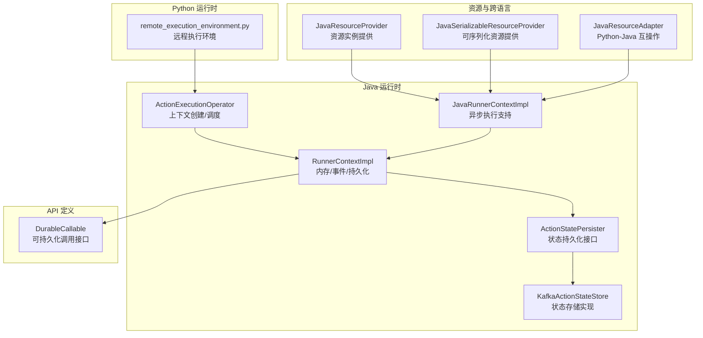
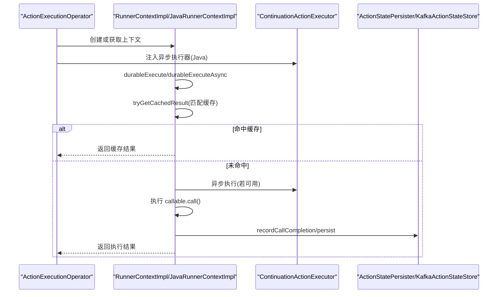
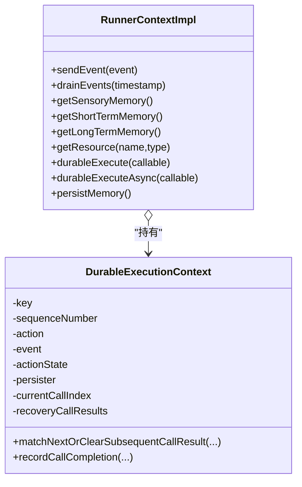
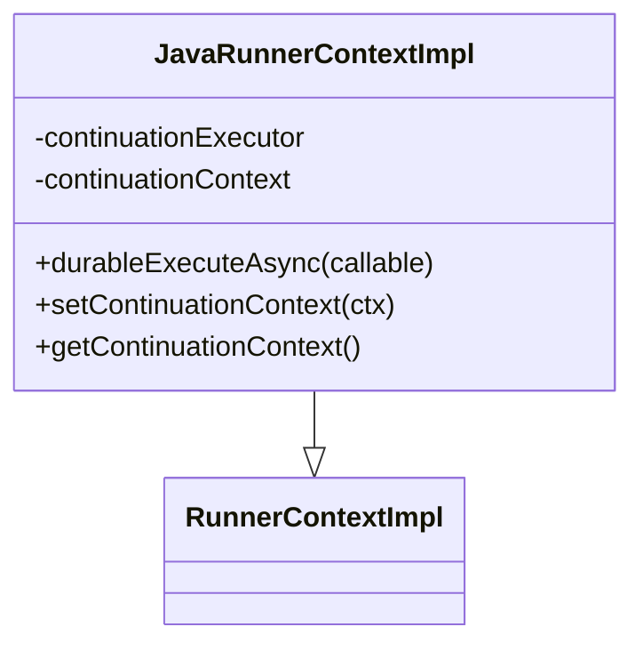
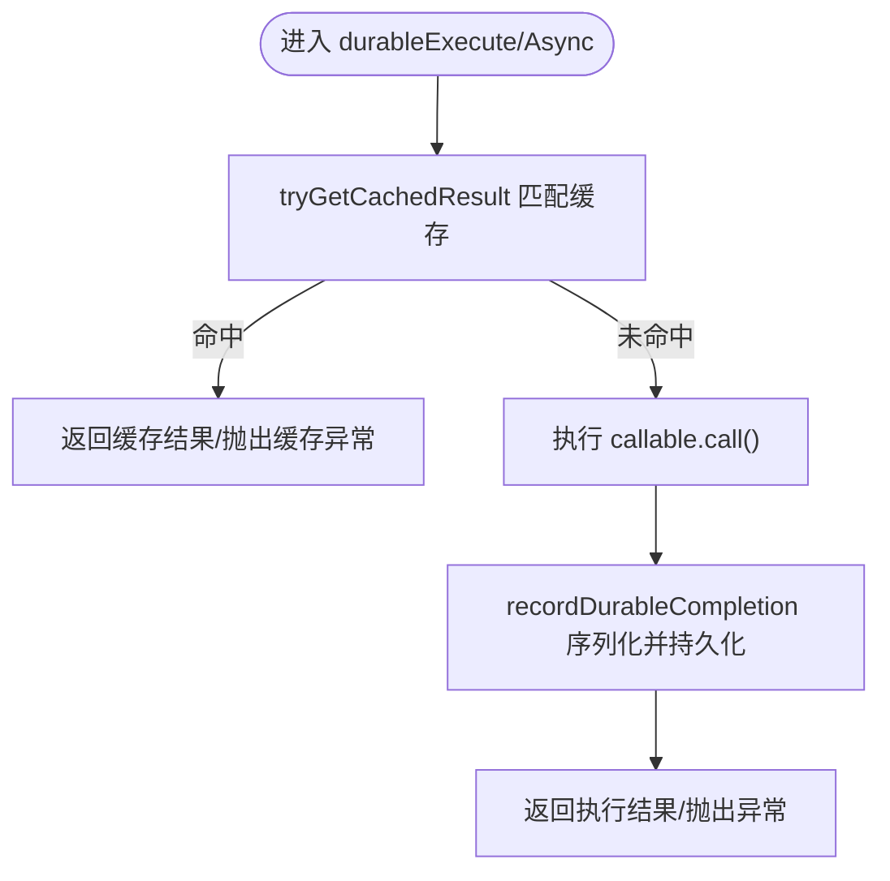
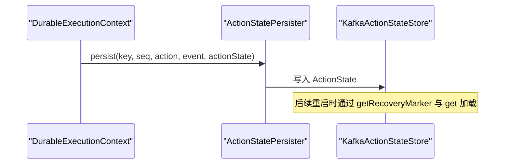
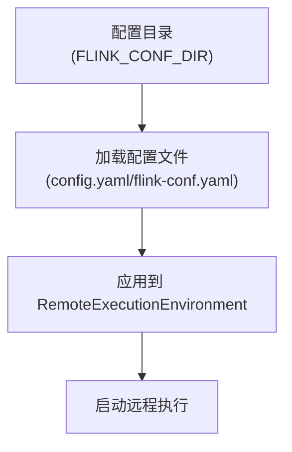
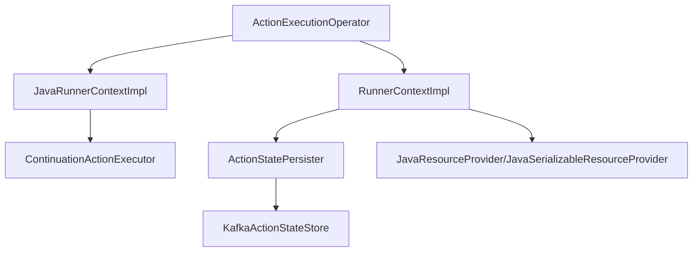
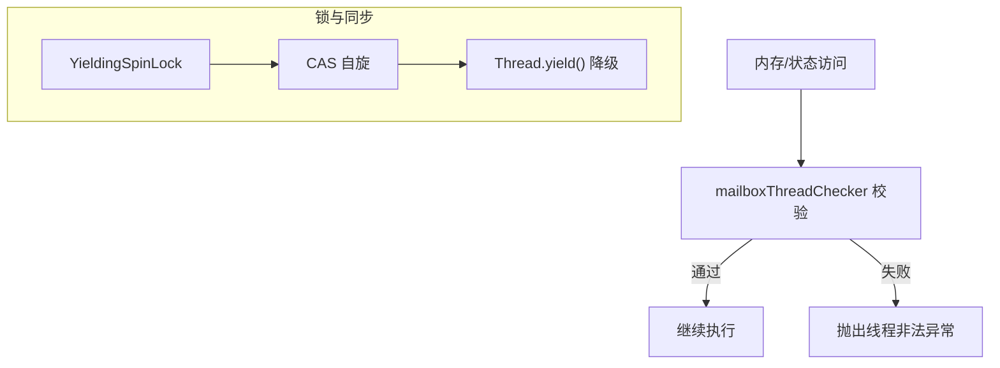

# 运行时上下文

<cite>
**本文引用的文件**   
- [RunnerContextImpl.java](file://runtime/src/main/java/org/apache/flink/agents/runtime/context/RunnerContextImpl.java)
- [JavaRunnerContextImpl.java](file://runtime/src/main/java/org/apache/flink/agents/runtime/context/JavaRunnerContextImpl.java)
- [DurableCallable.java](file://api/src/main/java/org/apache/flink/agents/api/context/DurableCallable.java)
- [ActionStatePersister.java](file://runtime/src/main/java/org/apache/flink/agents/runtime/context/ActionStatePersister.java)
- [ActionExecutionOperator.java](file://runtime/src/main/java/org/apache/flink/agents/runtime/operator/ActionExecutionOperator.java)
- [ActionExecutionOperatorTest.java](file://runtime/src/test/java/org/apache/flink/agents/runtime/operator/ActionExecutionOperatorTest.java)
- [KafkaActionStateStore.java](file://runtime/src/main/java/org/apache/flink/agents/runtime/actionstate/KafkaActionStateStore.java)
- [InMemoryActionStateStore.java](file://runtime/src/test/java/org/apache/flink/agents/runtime/actionstate/InMemoryActionStateStore.java)
- [JavaResourceProvider.java](file://plan/src/main/java/org/apache/flink/agents/plan/resourceprovider/JavaResourceProvider.java)
- [JavaSerializableResourceProvider.java](file://plan/src/main/java/org/apache/flink/agents/plan/resourceprovider/JavaSerializableResourceProvider.java)
- [JavaResourceAdapter.java](file://runtime/src/main/java/org/apache/flink/agents/runtime/python/utils/JavaResourceAdapter.java)
- [RemoteExecutionEnvironmentTest.java](file://runtime/src/test/java/org/apache/flink/agents/runtime/env/RemoteExecutionEnvironmentTest.java)
- [remote_execution_environment.py](file://python/flink_agents/runtime/remote_execution_environment.py)
- [Locks.java](file://runtime/src/main/java/org/apache/flink/agents/runtime/queue/Locks.java)
- [Lock.java](file://runtime/src/main/java/org/apache/flink/agents/runtime/queue/Lock.java)
</cite>

## 目录
1. [引言](#引言)
2. [项目结构](#项目结构)
3. [核心组件](#核心组件)
4. [架构总览](#架构总览)
5. [组件详解](#组件详解)
6. [依赖关系分析](#依赖关系分析)
7. [性能与并发特性](#性能与并发特性)
8. [故障排查指南](#故障排查指南)
9. [结论](#结论)
10. [附录：最佳实践与监控建议](#附录最佳实践与监控建议)

## 引言
本技术文档围绕运行时上下文系统展开，重点覆盖以下方面：
- RunnerContextImpl 的上下文实现：内存访问接口、事件发送机制、状态持久化能力
- JavaRunnerContextImpl 的 Java 侧上下文实现：资源获取、工具调用、异步执行支持
- ActionStatePersister 的状态持久化机制：检查点触发、状态快照与恢复流程
- DurableCallable 的持久化可调用对象：如何在作业重启后恢复执行状态
- 线程安全机制与并发控制策略
- 不同执行环境（本地、远程）的行为差异
- 使用最佳实践、异常处理、性能优化以及调试与监控方法

## 项目结构
运行时上下文相关代码主要分布在以下模块：
- runtime 模块：Java 实现的核心运行时上下文、操作符、状态存储与异步执行器
- api 模块：公共接口定义，如 RunnerContext、DurableCallable 等
- plan 模块：资源提供者与序列化资源提供者，用于在运行时构造 Java 资源
- python 模块：Python 侧运行时与远程执行环境，负责跨语言交互与配置加载

**图表来源**
- [RunnerContextImpl.java](file://runtime/src/main/java/org/apache/flink/agents/runtime/context/RunnerContextImpl.java#L1-L590)
- [JavaRunnerContextImpl.java](file://runtime/src/main/java/org/apache/flink/agents/runtime/context/JavaRunnerContextImpl.java#L1-L106)
- [DurableCallable.java](file://api/src/main/java/org/apache/flink/agents/api/context/DurableCallable.java#L1-L50)
- [ActionStatePersister.java](file://runtime/src/main/java/org/apache/flink/agents/runtime/context/ActionStatePersister.java#L1-L45)
- [ActionExecutionOperator.java](file://runtime/src/main/java/org/apache/flink/agents/runtime/operator/ActionExecutionOperator.java#L1075-L1105)
- [JavaResourceProvider.java](file://plan/src/main/java/org/apache/flink/agents/plan/resourceprovider/JavaResourceProvider.java#L1-L56)
- [JavaSerializableResourceProvider.java](file://plan/src/main/java/org/apache/flink/agents/plan/resourceprovider/JavaSerializableResourceProvider.java#L28-L62)
- [JavaResourceAdapter.java](file://runtime/src/main/java/org/apache/flink/agents/runtime/python/utils/JavaResourceAdapter.java#L30-L56)
- [remote_execution_environment.py](file://python/flink_agents/runtime/remote_execution_environment.py#L320-L334)

**章节来源**
- [RunnerContextImpl.java](file://runtime/src/main/java/org/apache/flink/agents/runtime/context/RunnerContextImpl.java#L1-L590)
- [JavaRunnerContextImpl.java](file://runtime/src/main/java/org/apache/flink/agents/runtime/context/JavaRunnerContextImpl.java#L1-L106)
- [ActionExecutionOperator.java](file://runtime/src/main/java/org/apache/flink/agents/runtime/operator/ActionExecutionOperator.java#L1075-L1105)

## 核心组件
- RunnerContextImpl：统一的运行时上下文，提供内存访问、事件发送、资源获取、配置读取、持久化与细粒度耐久执行能力
- JavaRunnerContextImpl：在 RunnerContextImpl 基础上增强 Java 异步执行支持，通过 ContinuationActionExecutor 实现异步调度
- DurableCallable：定义可耐久执行的调用接口，要求稳定标识与结果类型，确保重启后可匹配缓存结果
- ActionStatePersister：状态持久化接口，解耦上下文与存储层，便于扩展多种存储后端
- ActionExecutionOperator：根据执行语言选择合适的 RunnerContext 实例（Java 或 Python），并注入异步执行器

**章节来源**
- [RunnerContextImpl.java](file://runtime/src/main/java/org/apache/flink/agents/runtime/context/RunnerContextImpl.java#L56-L137)
- [JavaRunnerContextImpl.java](file://runtime/src/main/java/org/apache/flink/agents/runtime/context/JavaRunnerContextImpl.java#L28-L57)
- [DurableCallable.java](file://api/src/main/java/org/apache/flink/agents/api/context/DurableCallable.java#L20-L49)
- [ActionStatePersister.java](file://runtime/src/main/java/org/apache/flink/agents/runtime/context/ActionStatePersister.java#L25-L44)
- [ActionExecutionOperator.java](file://runtime/src/main/java/org/apache/flink/agents/runtime/operator/ActionExecutionOperator.java#L1075-L1105)

## 架构总览
运行时上下文在执行期贯穿“动作执行—状态持久化—事件发送—资源获取”的主链路。Java 侧通过 ContinuationActionExecutor 支持异步执行；状态持久化通过 ActionStatePersister 抽象，结合 KafkaActionStateStore 实现高可靠持久化。

**图表来源**
- [ActionExecutionOperator.java](file://runtime/src/main/java/org/apache/flink/agents/runtime/operator/ActionExecutionOperator.java#L1075-L1105)
- [RunnerContextImpl.java](file://runtime/src/main/java/org/apache/flink/agents/runtime/context/RunnerContextImpl.java#L283-L353)
- [JavaRunnerContextImpl.java](file://runtime/src/main/java/org/apache/flink/agents/runtime/context/JavaRunnerContextImpl.java#L60-L104)
- [ActionStatePersister.java](file://runtime/src/main/java/org/apache/flink/agents/runtime/context/ActionStatePersister.java#L33-L43)
- [KafkaActionStateStore.java](file://runtime/src/main/java/org/apache/flink/agents/runtime/actionstate/KafkaActionStateStore.java#L186-L207)

## 组件详解

### RunnerContextImpl：上下文实现与内存/事件/持久化
- 内存访问接口
  - 提供感官记忆与短期记忆对象，封装 CachedMemoryStore 并维护增量更新列表
  - 访问前通过 mailboxThreadChecker 校验线程，确保仅在邮箱线程内进行内存操作
- 事件发送机制
  - sendEvent 将事件加入待发送队列，并校验 JSON 可序列化
  - drainEvents 在批处理时清空并返回事件列表，可设置来源时间戳
- 状态持久化功能
  - durableExecute/durableExecuteAsync：基于函数 ID 与参数摘要进行缓存匹配
  - recordDurableCompletion：序列化结果或异常，写入 ActionState 并持久化
  - DurableExecutionContext：在动作粒度内维护 CallResult 快照，支持恢复时跳过已完成调用
- 资源与配置
  - getResource 从 AgentPlan 获取资源并绑定当前动作指标组
  - getConfig/getActionConfig/getActionConfigValue 提供全局与动作级配置读取

**图表来源**
- [RunnerContextImpl.java](file://runtime/src/main/java/org/apache/flink/agents/runtime/context/RunnerContextImpl.java#L149-L246)
- [RunnerContextImpl.java](file://runtime/src/main/java/org/apache/flink/agents/runtime/context/RunnerContextImpl.java#L283-L353)
- [RunnerContextImpl.java](file://runtime/src/main/java/org/apache/flink/agents/runtime/context/RunnerContextImpl.java#L466-L588)

**章节来源**
- [RunnerContextImpl.java](file://runtime/src/main/java/org/apache/flink/agents/runtime/context/RunnerContextImpl.java#L149-L246)
- [RunnerContextImpl.java](file://runtime/src/main/java/org/apache/flink/agents/runtime/context/RunnerContextImpl.java#L283-L353)
- [RunnerContextImpl.java](file://runtime/src/main/java/org/apache/flink/agents/runtime/context/RunnerContextImpl.java#L405-L464)

### JavaRunnerContextImpl：Java 侧上下文与异步执行
- 继承 RunnerContextImpl，新增 ContinuationActionExecutor 与 ContinuationContext
- durableExecuteAsync：优先使用 ContinuationActionExecutor.executeAsync 执行，否则回退到同步执行
- 提供 set/getContinuationContext 以在动作执行过程中传递异步上下文

**图表来源**
- [JavaRunnerContextImpl.java](file://runtime/src/main/java/org/apache/flink/agents/runtime/context/JavaRunnerContextImpl.java#L32-L57)
- [JavaRunnerContextImpl.java](file://runtime/src/main/java/org/apache/flink/agents/runtime/context/JavaRunnerContextImpl.java#L60-L104)

**章节来源**
- [JavaRunnerContextImpl.java](file://runtime/src/main/java/org/apache/flink/agents/runtime/context/JavaRunnerContextImpl.java#L32-L57)
- [JavaRunnerContextImpl.java](file://runtime/src/main/java/org/apache/flink/agents/runtime/context/JavaRunnerContextImpl.java#L60-L104)

### DurableCallable：持久化可调用对象
- 接口职责
  - getId：稳定的函数标识，用于缓存匹配与恢复
  - getResultClass：结果类型，用于反序列化
  - call：执行逻辑，仅在未命中缓存时调用
- 与 RunnerContext 的协作
  - durableExecute/durableExecuteAsync 先尝试缓存匹配，未命中则执行并记录结果

**图表来源**
- [RunnerContextImpl.java](file://runtime/src/main/java/org/apache/flink/agents/runtime/context/RunnerContextImpl.java#L248-L309)
- [RunnerContextImpl.java](file://runtime/src/main/java/org/apache/flink/agents/runtime/context/RunnerContextImpl.java#L311-L353)
- [DurableCallable.java](file://api/src/main/java/org/apache/flink/agents/api/context/DurableCallable.java#L29-L49)

**章节来源**
- [DurableCallable.java](file://api/src/main/java/org/apache/flink/agents/api/context/DurableCallable.java#L29-L49)
- [RunnerContextImpl.java](file://runtime/src/main/java/org/apache/flink/agents/runtime/context/RunnerContextImpl.java#L248-L309)

### ActionStatePersister：状态持久化机制
- 角色定位
  - 解耦 RunnerContextImpl.DurableExecutionContext 与具体存储实现
  - 通过 persist(key, sequenceNumber, action, event, actionState) 写入状态
- 存储实现示例
  - KafkaActionStateStore：按 key+seqNum 查询/重建状态，支持去发散检测与恢复标记
  - InMemoryActionStateStore：测试用内存实现，不实际持久化

**图表来源**
- [ActionStatePersister.java](file://runtime/src/main/java/org/apache/flink/agents/runtime/context/ActionStatePersister.java#L33-L43)
- [KafkaActionStateStore.java](file://runtime/src/main/java/org/apache/flink/agents/runtime/actionstate/KafkaActionStateStore.java#L186-L207)
- [InMemoryActionStateStore.java](file://runtime/src/test/java/org/apache/flink/agents/runtime/actionstate/InMemoryActionStateStore.java#L45-L82)

**章节来源**
- [ActionStatePersister.java](file://runtime/src/main/java/org/apache/flink/agents/runtime/context/ActionStatePersister.java#L25-L44)
- [KafkaActionStateStore.java](file://runtime/src/main/java/org/apache/flink/agents/runtime/actionstate/KafkaActionStateStore.java#L186-L207)
- [InMemoryActionStateStore.java](file://runtime/src/test/java/org/apache/flink/agents/runtime/actionstate/InMemoryActionStateStore.java#L45-L82)

### 资源获取与跨语言交互
- Java 资源提供
  - JavaResourceProvider：通过反射构造资源实例，支持从 ResourceDescriptor 获取类与构造参数
  - JavaSerializableResourceProvider：提供可序列化的 Java 资源包装，便于跨语言传输
- Python-Java 互操作
  - JavaResourceAdapter：在 Python 侧通过 getResource(name, typeValue) 获取 Java 资源

**图表来源**
- [JavaResourceProvider.java](file://plan/src/main/java/org/apache/flink/agents/plan/resourceprovider/JavaResourceProvider.java#L37-L51)
- [JavaSerializableResourceProvider.java](file://plan/src/main/java/org/apache/flink/agents/plan/resourceprovider/JavaSerializableResourceProvider.java#L42-L62)
- [JavaResourceAdapter.java](file://runtime/src/main/java/org/apache/flink/agents/runtime/python/utils/JavaResourceAdapter.java#L54-L56)

**章节来源**
- [JavaResourceProvider.java](file://plan/src/main/java/org/apache/flink/agents/plan/resourceprovider/JavaResourceProvider.java#L37-L51)
- [JavaSerializableResourceProvider.java](file://plan/src/main/java/org/apache/flink/agents/plan/resourceprovider/JavaSerializableResourceProvider.java#L42-L62)
- [JavaResourceAdapter.java](file://runtime/src/main/java/org/apache/flink/agents/runtime/python/utils/JavaResourceAdapter.java#L54-L56)

### 执行环境差异：本地与远程
- 本地执行环境（Python）
  - RemoteExecutionEnvironment：从配置目录加载 agent 配置，兼容新旧配置文件命名
- 远程执行环境（Python）
  - remote_execution_environment.py：提供构建远程执行环境的入口，供 Python 侧集成

**图表来源**
- [RemoteExecutionEnvironmentTest.java](file://runtime/src/test/java/org/apache/flink/agents/runtime/env/RemoteExecutionEnvironmentTest.java#L36-L77)
- [remote_execution_environment.py](file://python/flink_agents/runtime/remote_execution_environment.py#L320-L334)

**章节来源**
- [RemoteExecutionEnvironmentTest.java](file://runtime/src/test/java/org/apache/flink/agents/runtime/env/RemoteExecutionEnvironmentTest.java#L36-L77)
- [remote_execution_environment.py](file://python/flink_agents/runtime/remote_execution_environment.py#L320-L334)

## 依赖关系分析
- 上下文与操作符
  - ActionExecutionOperator 在创建任务时根据语言选择 RunnerContextImpl 或 PythonRunnerContextImpl，并在 Java 场景注入 ContinuationActionExecutor
- 上下文与状态存储
  - RunnerContextImpl.DurableExecutionContext 通过 ActionStatePersister 将 CallResult 写入存储，KafkaActionStateStore 提供查询与重建能力
- 上下文与资源
  - JavaRunnerContextImpl 依赖 ContinuationActionExecutor 实现异步执行；资源由 JavaResourceProvider/JavaSerializableResourceProvider 提供

**图表来源**
- [ActionExecutionOperator.java](file://runtime/src/main/java/org/apache/flink/agents/runtime/operator/ActionExecutionOperator.java#L1075-L1105)
- [JavaRunnerContextImpl.java](file://runtime/src/main/java/org/apache/flink/agents/runtime/context/JavaRunnerContextImpl.java#L37-L44)
- [RunnerContextImpl.java](file://runtime/src/main/java/org/apache/flink/agents/runtime/context/RunnerContextImpl.java#L414-L426)
- [ActionStatePersister.java](file://runtime/src/main/java/org/apache/flink/agents/runtime/context/ActionStatePersister.java#L33-L43)
- [KafkaActionStateStore.java](file://runtime/src/main/java/org/apache/flink/agents/runtime/actionstate/KafkaActionStateStore.java#L186-L207)
- [JavaResourceProvider.java](file://plan/src/main/java/org/apache/flink/agents/plan/resourceprovider/JavaResourceProvider.java#L37-L51)

**章节来源**
- [ActionExecutionOperator.java](file://runtime/src/main/java/org/apache/flink/agents/runtime/operator/ActionExecutionOperator.java#L1075-L1105)
- [RunnerContextImpl.java](file://runtime/src/main/java/org/apache/flink/agents/runtime/context/RunnerContextImpl.java#L414-L426)
- [ActionStatePersister.java](file://runtime/src/main/java/org/apache/flink/agents/runtime/context/ActionStatePersister.java#L33-L43)

## 性能与并发特性
- 线程安全保障
  - 所有内存访问与状态匹配均通过 mailboxThreadChecker 校验，禁止从非邮箱线程访问内存，避免竞态
- 锁与无阻塞同步
  - Locks/YieldingSpinLock 提供自旋锁实现，降低上下文切换开销，适用于高并发场景
- 异步执行
  - JavaRunnerContextImpl 通过 ContinuationActionExecutor 支持异步执行，减少阻塞等待
- 状态持久化
  - KafkaActionStateStore 支持按 key+seqNum 查询与重建，具备去发散检测能力，保证恢复一致性

**图表来源**
- [RunnerContextImpl.java](file://runtime/src/main/java/org/apache/flink/agents/runtime/context/RunnerContextImpl.java#L150-L170)
- [Locks.java](file://runtime/src/main/java/org/apache/flink/agents/runtime/queue/Locks.java#L53-L69)
- [Lock.java](file://runtime/src/main/java/org/apache/flink/agents/runtime/queue/Lock.java#L26-L31)

**章节来源**
- [RunnerContextImpl.java](file://runtime/src/main/java/org/apache/flink/agents/runtime/context/RunnerContextImpl.java#L150-L170)
- [Locks.java](file://runtime/src/main/java/org/apache/flink/agents/runtime/queue/Locks.java#L53-L69)
- [Lock.java](file://runtime/src/main/java/org/apache/flink/agents/runtime/queue/Lock.java#L26-L31)

## 故障排查指南
- 内存访问线程错误
  - 症状：从非邮箱线程访问内存导致异常
  - 处理：确保在邮箱线程内调用 getShortTermMemory/getSensoryMemory/sendEvent
  - 参考测试用例：[ActionExecutionOperatorTest.java](file://runtime/src/test/java/org/apache/flink/agents/runtime/operator/ActionExecutionOperatorTest.java#L1002-L1014)
- 缓存命中与异常重放
  - 症状：重启后异常未正确重放
  - 处理：确认 DurableCallable.getId 唯一且稳定；检查 ActionState 是否持久化成功
  - 参考实现：[RunnerContextImpl.java](file://runtime/src/main/java/org/apache/flink/agents/runtime/context/RunnerContextImpl.java#L248-L309)
- 恢复标记与状态重建
  - 症状：恢复时状态缺失或不一致
  - 处理：验证 getRecoveryMarker 返回值；检查 KafkaActionStateStore 的重建逻辑
  - 参考实现：[KafkaActionStateStore.java](file://runtime/src/main/java/org/apache/flink/agents/runtime/actionstate/KafkaActionStateStore.java#L201-L207)
- 异步执行异常
  - 症状：异步执行抛出异常但未被捕获
  - 处理：确认 ContinuationActionExecutor 正常注入；检查 JavaRunnerContextImpl 的异步分支
  - 参考实现：[JavaRunnerContextImpl.java](file://runtime/src/main/java/org/apache/flink/agents/runtime/context/JavaRunnerContextImpl.java#L89-L96)

**章节来源**
- [ActionExecutionOperatorTest.java](file://runtime/src/test/java/org/apache/flink/agents/runtime/operator/ActionExecutionOperatorTest.java#L1002-L1014)
- [RunnerContextImpl.java](file://runtime/src/main/java/org/apache/flink/agents/runtime/context/RunnerContextImpl.java#L248-L309)
- [KafkaActionStateStore.java](file://runtime/src/main/java/org/apache/flink/agents/runtime/actionstate/KafkaActionStateStore.java#L201-L207)
- [JavaRunnerContextImpl.java](file://runtime/src/main/java/org/apache/flink/agents/runtime/context/JavaRunnerContextImpl.java#L89-L96)

## 结论
运行时上下文系统通过 RunnerContextImpl 提供统一的内存、事件与资源访问能力，并以 DurableCallable 和 ActionStatePersister 实现细粒度的耐久执行与状态持久化。JavaRunnerContextImpl 在此基础上增强了异步执行支持，配合 ContinuationActionExecutor 提升吞吐。在不同执行环境（本地/远程）下，系统通过配置加载与跨语言适配保持一致的行为模型。遵循线程安全约束与最佳实践，可获得稳定、可观测且高性能的执行体验。

## 附录：最佳实践与监控建议
- 资源管理
  - 使用 getResource 获取资源时，确保资源实现 JSON 可序列化，避免事件发送失败
  - 对外部资源（向量库、嵌入模型等）在关闭上下文时显式释放
- 异常处理
  - DurableCallable 的 call 方法应尽量幂等，避免副作用
  - 对异常进行分类处理，必要时抛出受控异常以便缓存重放
- 性能优化
  - 合理使用异步执行，减少阻塞；对短小任务避免过度拆分
  - 利用内存增量更新，减少全量写入
- 调试与监控
  - 通过指标组（FlinkAgentsMetricGroupImpl）收集动作级指标
  - 使用日志与断点定位非邮箱线程访问问题
  - 在恢复场景下核对 ActionState 的 CallResult 顺序与内容

[本节为通用指导，无需列出具体文件来源]