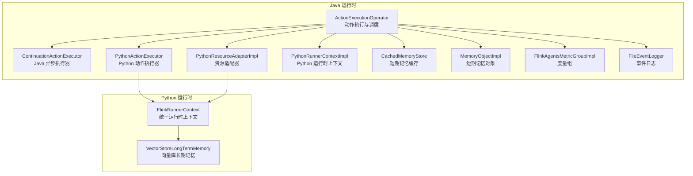
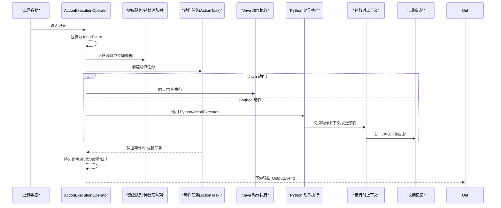
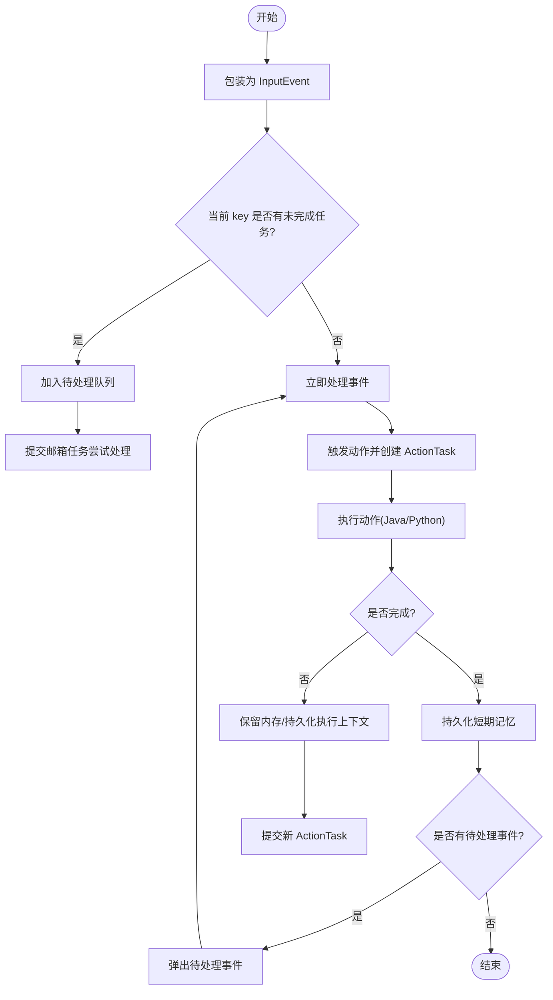
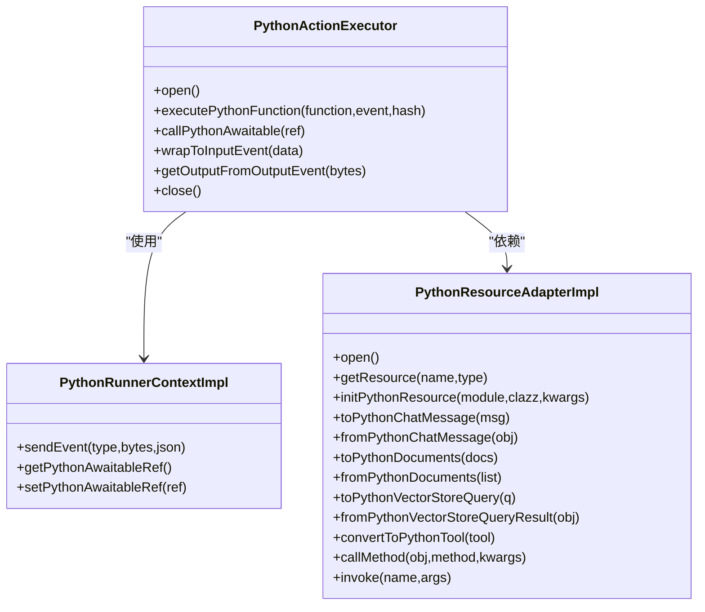
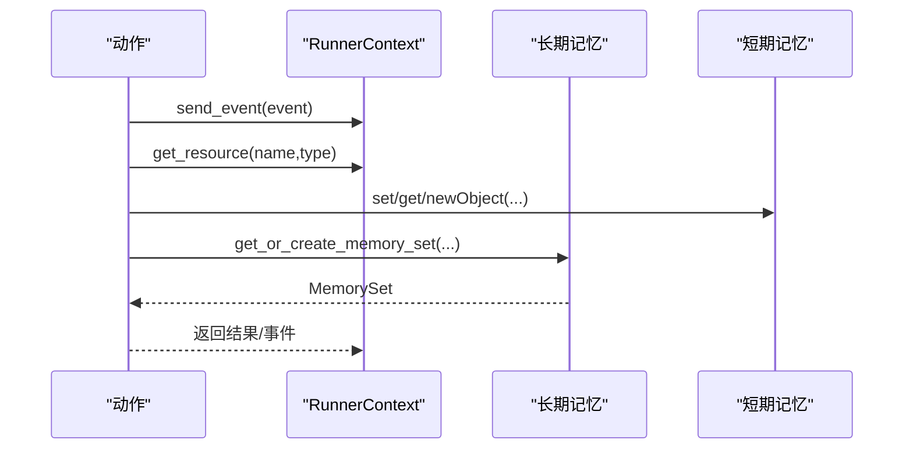
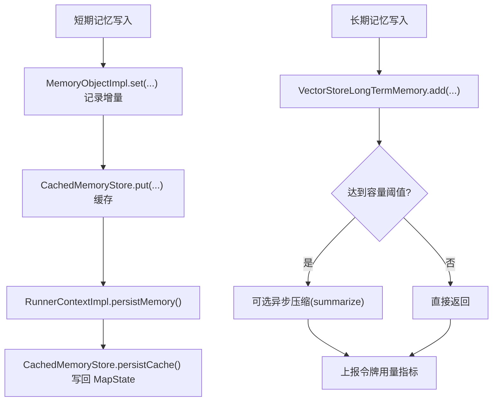
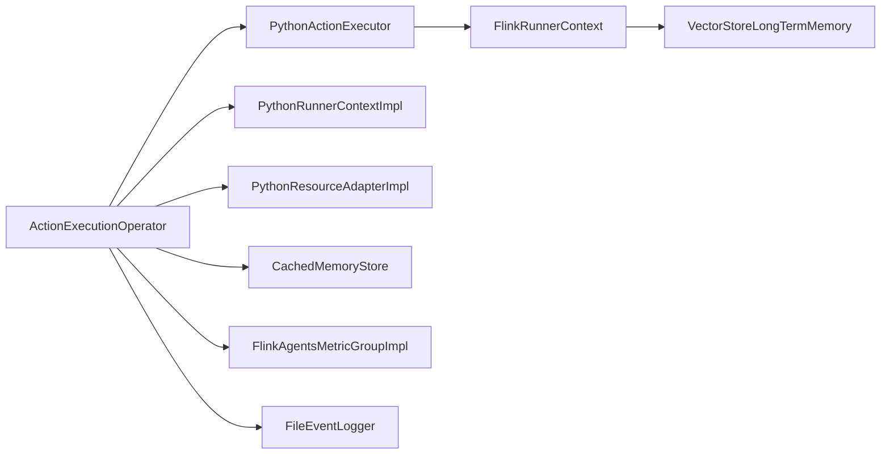

# 运行时层

<cite>
**本文引用的文件**
- [ActionExecutionOperator.java](file://runtime/src/main/java/org/apache/flink/agents/runtime/operator/ActionExecutionOperator.java)
- [ContinuationActionExecutor.java](file://runtime/src/main/java/org/apache/flink/agents/runtime/async/ContinuationActionExecutor.java)
- [PythonActionExecutor.java](file://runtime/src/main/java/org/apache/flink/agents/runtime/python/utils/PythonActionExecutor.java)
- [PythonRunnerContextImpl.java](file://runtime/src/main/java/org/apache/flink/agents/runtime/python/context/PythonRunnerContextImpl.java)
- [PythonResourceAdapterImpl.java](file://runtime/src/main/java/org/apache/flink/agents/runtime/python/utils/PythonResourceAdapterImpl.java)
- [FileEventLogger.java](file://runtime/src/main/java/org/apache/flink/agents/runtime/eventlog/FileEventLogger.java)
- [CachedMemoryStore.java](file://runtime/src/main/java/org/apache/flink/agents/runtime/memory/CachedMemoryStore.java)
- [MemoryObjectImpl.java](file://runtime/src/main/java/org/apache/flink/agents/runtime/memory/MemoryObjectImpl.java)
- [FlinkAgentsMetricGroupImpl.java](file://runtime/src/main/java/org/apache/flink/agents/runtime/metrics/FlinkAgentsMetricGroupImpl.java)
- [flink_runner_context.py](file://python/flink_agents/runtime/flink_runner_context.py)
- [vector_store_long_term_memory.py](file://python/flink_agents/runtime/memory/vector_store_long_term_memory.py)
</cite>

## 目录
1. [引言](#引言)
2. [项目结构](#项目结构)
3. [核心组件](#核心组件)
4. [架构总览](#架构总览)
5. [组件详解](#组件详解)
6. [依赖关系分析](#依赖关系分析)
7. [性能考量](#性能考量)
8. [故障排查指南](#故障排查指南)
9. [结论](#结论)
10. [附录：运行时配置与调优](#附录运行时配置与调优)

## 引言
本文件聚焦 Apache Flink Agents 的运行时层，围绕 ActionExecutionOperator 的实现原理进行深入解析，涵盖异步执行机制、状态管理与错误恢复策略；阐述内存系统（短期记忆与长期记忆）的架构与持久化/缓存策略；说明 Python 环境管理（解释器生命周期、资源适配器、跨语言通信协议）；介绍运行时上下文 RunnerContext 的职责与用法；并给出事件日志、性能监控与调试支持、配置项与调优建议以及故障诊断实践。

## 项目结构
运行时层主要由 Java 运行时与 Python 运行时协同组成：
- Java 运行时负责流式处理、状态管理、事件调度、异步执行与度量指标。
- Python 运行时负责动作执行、事件封装、资源桥接与长期记忆访问。

图示来源
- [ActionExecutionOperator.java](file://runtime/src/main/java/org/apache/flink/agents/runtime/operator/ActionExecutionOperator.java#L118-L329)
- [ContinuationActionExecutor.java](file://runtime/src/main/java/org/apache/flink/agents/runtime/async/ContinuationActionExecutor.java#L28-L69)
- [PythonActionExecutor.java](file://runtime/src/main/java/org/apache/flink/agents/runtime/python/utils/PythonActionExecutor.java#L36-L111)
- [PythonRunnerContextImpl.java](file://runtime/src/main/java/org/apache/flink/agents/runtime/python/context/PythonRunnerContextImpl.java#L33-L68)
- [PythonResourceAdapterImpl.java](file://runtime/src/main/java/org/apache/flink/agents/runtime/python/utils/PythonResourceAdapterImpl.java#L41-L93)
- [CachedMemoryStore.java](file://runtime/src/main/java/org/apache/flink/agents/runtime/memory/CachedMemoryStore.java#L25-L65)
- [MemoryObjectImpl.java](file://runtime/src/main/java/org/apache/flink/agents/runtime/memory/MemoryObjectImpl.java#L33-L71)
- [FlinkAgentsMetricGroupImpl.java](file://runtime/src/main/java/org/apache/flink/agents/runtime/metrics/FlinkAgentsMetricGroupImpl.java#L38-L104)
- [FileEventLogger.java](file://runtime/src/main/java/org/apache/flink/agents/runtime/eventlog/FileEventLogger.java#L77-L156)
- [flink_runner_context.py](file://python/flink_agents/runtime/flink_runner_context.py#L181-L539)
- [vector_store_long_term_memory.py](file://python/flink_agents/runtime/memory/vector_store_long_term_memory.py#L53-L146)

章节来源
- [ActionExecutionOperator.java](file://runtime/src/main/java/org/apache/flink/agents/runtime/operator/ActionExecutionOperator.java#L118-L329)
- [PythonActionExecutor.java](file://runtime/src/main/java/org/apache/flink/agents/runtime/python/utils/PythonActionExecutor.java#L36-L111)
- [flink_runner_context.py](file://python/flink_agents/runtime/flink_runner_context.py#L181-L539)

## 核心组件
- ActionExecutionOperator：动作执行与事件调度的核心算子，负责接收上游输入、包装为 InputEvent、触发对应 Action 并收集 OutputEvent 下游输出；维护键级队列、待处理事件队列、动作任务队列与序列号，确保有序与可恢复。
- ContinuationActionExecutor：Java 动作的异步执行器，在 JDK 11 上回退到同步执行；在 JDK 21+ 使用 Continuation API 实现真正的异步。
- PythonActionExecutor：在 Python 解释器中执行 Python 动作，负责将 Java 事件转换为 Python 事件、调用用户定义的 Python 函数、处理 awaitable 协程、管理线程池与运行时上下文。
- PythonRunnerContextImpl：Python 动作专用的运行时上下文，负责发送事件、持有 Python awaitable 引用、与 Java 运行时上下文协作。
- PythonResourceAdapterImpl：连接 Java 资源与 Python 资源的适配器，提供类型转换、方法调用桥接与资源封装。
- CachedMemoryStore 与 MemoryObjectImpl：短期记忆的缓存与树形结构存储，支持路径式读写、增量更新记录与持久化。
- FlinkAgentsMetricGroupImpl：度量指标的聚合与导出，提供计数器、计量器、直方图与可更新 Gauge。
- FileEventLogger：事件日志落盘，按子任务生成独立文件，采用 JSON Lines 格式，支持过滤与刷新。
- FlinkRunnerContext（Python）：统一的运行时上下文，提供事件发送、资源获取、短期/长期记忆访问、持久化执行（durable_execute/durable_execute_async）、度量组访问等能力。
- VectorStoreLongTermMemory（Python）：基于外部向量库的长期记忆实现，支持集合创建/查询/删除、容量触发的压缩（summarize）与令牌用量统计上报。

章节来源
- [ActionExecutionOperator.java](file://runtime/src/main/java/org/apache/flink/agents/runtime/operator/ActionExecutionOperator.java#L118-L329)
- [ContinuationActionExecutor.java](file://runtime/src/main/java/org/apache/flink/agents/runtime/async/ContinuationActionExecutor.java#L28-L69)
- [PythonActionExecutor.java](file://runtime/src/main/java/org/apache/flink/agents/runtime/python/utils/PythonActionExecutor.java#L36-L210)
- [PythonRunnerContextImpl.java](file://runtime/src/main/java/org/apache/flink/agents/runtime/python/context/PythonRunnerContextImpl.java#L33-L68)
- [PythonResourceAdapterImpl.java](file://runtime/src/main/java/org/apache/flink/agents/runtime/python/utils/PythonResourceAdapterImpl.java#L41-L203)
- [CachedMemoryStore.java](file://runtime/src/main/java/org/apache/flink/agents/runtime/memory/CachedMemoryStore.java#L25-L65)
- [MemoryObjectImpl.java](file://runtime/src/main/java/org/apache/flink/agents/runtime/memory/MemoryObjectImpl.java#L33-L260)
- [FlinkAgentsMetricGroupImpl.java](file://runtime/src/main/java/org/apache/flink/agents/runtime/metrics/FlinkAgentsMetricGroupImpl.java#L38-L104)
- [FileEventLogger.java](file://runtime/src/main/java/org/apache/flink/agents/runtime/eventlog/FileEventLogger.java#L77-L156)
- [flink_runner_context.py](file://python/flink_agents/runtime/flink_runner_context.py#L181-L572)
- [vector_store_long_term_memory.py](file://python/flink_agents/runtime/memory/vector_store_long_term_memory.py#L53-L329)

## 架构总览
运行时层通过 ActionExecutionOperator 将 Java 流水线与 Python 执行环境解耦，同时保持强一致的状态与可观测性。Java 侧负责事件编排、状态持久化、度量与日志；Python 侧负责动作逻辑、资源桥接与长期记忆访问。

图示来源
- [ActionExecutionOperator.java](file://runtime/src/main/java/org/apache/flink/agents/runtime/operator/ActionExecutionOperator.java#L345-L601)
- [PythonActionExecutor.java](file://runtime/src/main/java/org/apache/flink/agents/runtime/python/utils/PythonActionExecutor.java#L123-L186)
- [flink_runner_context.py](file://python/flink_agents/runtime/flink_runner_context.py#L221-L326)
- [vector_store_long_term_memory.py](file://python/flink_agents/runtime/memory/vector_store_long_term_memory.py#L101-L146)

## 组件详解

### ActionExecutionOperator：异步执行、状态管理与错误恢复
- 异步执行机制
  - Java 动作：通过 ContinuationActionExecutor 在 JDK 21+ 使用 Continuation API，JDK 11 回退为同步执行。
  - Python 动作：通过 PythonActionExecutor 在 Python 解释器中执行协程(awaitable)，并通过变量名引用避免 GC 导致的引用丢失。
- 状态管理
  - 键级队列：按 key 分段组织事件，保证同一 key 内部顺序与串行处理。
  - 待处理事件队列：同一 key 多事件排队，避免并发冲突。
  - 动作任务队列：保存 ActionTask，支持生成新的 ActionTask 继续执行。
  - 序列号：每 key 维护消息序号，保障事件顺序。
  - 恢复标记：ActionStateStore 支持从外部存储重建状态。
- 错误恢复策略
  - 动作状态持久化：动作完成或中间结果持久化，重启后跳过已完成动作并重放记忆更新。
  - 邮箱线程异常捕获：在邮箱线程中捕获异常并以受控方式抛出，避免破坏算子状态。
  - 水位线推进：事件处理完成后尝试推进水位线，确保下游背压与一致性。
- Python 环境初始化
  - 仅当存在 Python 动作或资源时初始化 Python 环境，避免不必要的开销。
  - 初始化 PythonRunnerContext、JavaResourceAdapter、PythonResourceAdapter 与 PythonActionExecutor。

图示来源
- [ActionExecutionOperator.java](file://runtime/src/main/java/org/apache/flink/agents/runtime/operator/ActionExecutionOperator.java#L345-L601)

章节来源
- [ActionExecutionOperator.java](file://runtime/src/main/java/org/apache/flink/agents/runtime/operator/ActionExecutionOperator.java#L118-L329)
- [ActionExecutionOperator.java](file://runtime/src/main/java/org/apache/flink/agents/runtime/operator/ActionExecutionOperator.java#L345-L601)
- [ActionExecutionOperator.java](file://runtime/src/main/java/org/apache/flink/agents/runtime/operator/ActionExecutionOperator.java#L691-L734)

### Python 环境管理：解释器生命周期、资源适配器与跨语言通信
- 解释器生命周期
  - 仅在需要时创建 PythonEnvironmentManager，初始化嵌入式解释器，创建 PythonRunnerContext，并打开线程池与运行时上下文。
  - 关闭时依次释放线程池、运行时上下文、解释器与环境管理器。
- 资源适配器
  - Java 资源到 Python 资源的双向转换：工具、提示词、聊天消息、文档、向量库查询等。
  - 提供方法调用桥接与资源封装，支持动态模块加载与实例化。
- 跨语言通信协议
  - 通过 PythonActionExecutor 将 Java 事件转换为 Python 事件，调用用户函数并返回 awaitable 引用。
  - PythonRunnerContextImpl 接收来自 Python 的事件并注入 Java 侧事件系统。
  - PythonResourceAdapterImpl 注册 getResource 函数，使 Python 侧可直接调用 Java 资源。

图示来源
- [PythonActionExecutor.java](file://runtime/src/main/java/org/apache/flink/agents/runtime/python/utils/PythonActionExecutor.java#L36-L210)
- [PythonRunnerContextImpl.java](file://runtime/src/main/java/org/apache/flink/agents/runtime/python/context/PythonRunnerContextImpl.java#L33-L68)
- [PythonResourceAdapterImpl.java](file://runtime/src/main/java/org/apache/flink/agents/runtime/python/utils/PythonResourceAdapterImpl.java#L41-L203)

章节来源
- [PythonActionExecutor.java](file://runtime/src/main/java/org/apache/flink/agents/runtime/python/utils/PythonActionExecutor.java#L93-L111)
- [PythonActionExecutor.java](file://runtime/src/main/java/org/apache/flink/agents/runtime/python/utils/PythonActionExecutor.java#L123-L186)
- [PythonRunnerContextImpl.java](file://runtime/src/main/java/org/apache/flink/agents/runtime/python/context/PythonRunnerContextImpl.java#L49-L67)
- [PythonResourceAdapterImpl.java](file://runtime/src/main/java/org/apache/flink/agents/runtime/python/utils/PythonResourceAdapterImpl.java#L90-L117)

### 运行时上下文：RunnerContext 的功能与使用
- Java 侧
  - RunnerContextImpl 提供短期/长期记忆访问、事件发送、度量组访问、动作配置读取等能力。
  - 对于 Java 动作，使用 JavaRunnerContextImpl；对于 Python 动作，使用 PythonRunnerContextImpl。
- Python 侧
  - FlinkRunnerContext 提供统一接口：send_event、get_resource、短期/长期记忆访问、持久化执行（durable_execute/durable_execute_async）、度量组访问。
  - 长期记忆默认基于外部向量库实现，支持集合创建、查询、删除与容量触发的压缩。
  - 支持线程池管理与资源清理。

图示来源
- [flink_runner_context.py](file://python/flink_agents/runtime/flink_runner_context.py#L221-L326)
- [vector_store_long_term_memory.py](file://python/flink_agents/runtime/memory/vector_store_long_term_memory.py#L121-L146)

章节来源
- [flink_runner_context.py](file://python/flink_agents/runtime/flink_runner_context.py#L181-L572)
- [vector_store_long_term_memory.py](file://python/flink_agents/runtime/memory/vector_store_long_term_memory.py#L53-L329)

### 内存系统：短期记忆与长期记忆
- 短期记忆（Java）
  - CachedMemoryStore：内存缓存 + Flink MapState 存储，支持批量持久化与清空。
  - MemoryObjectImpl：树形结构存储，支持路径式 set/get/newObject、字段枚举与增量更新记录。
  - RunnerContextImpl 在动作完成时调用 persistMemory 将增量更新写回状态。
- 长期记忆（Python）
  - VectorStoreLongTermMemory：基于外部向量库的集合管理，支持容量触发压缩（summarize），异步压缩可选，令牌用量指标上报。
  - 名称混淆：集合名包含 job_id 与 key 前缀，确保隔离。

图示来源
- [CachedMemoryStore.java](file://runtime/src/main/java/org/apache/flink/agents/runtime/memory/CachedMemoryStore.java#L25-L65)
- [MemoryObjectImpl.java](file://runtime/src/main/java/org/apache/flink/agents/runtime/memory/MemoryObjectImpl.java#L89-L113)
- [vector_store_long_term_memory.py](file://python/flink_agents/runtime/memory/vector_store_long_term_memory.py#L157-L221)

章节来源
- [CachedMemoryStore.java](file://runtime/src/main/java/org/apache/flink/agents/runtime/memory/CachedMemoryStore.java#L25-L65)
- [MemoryObjectImpl.java](file://runtime/src/main/java/org/apache/flink/agents/runtime/memory/MemoryObjectImpl.java#L33-L260)
- [vector_store_long_term_memory.py](file://python/flink_agents/runtime/memory/vector_store_long_term_memory.py#L53-L329)

### 事件日志、性能监控与调试支持
- 事件日志
  - FileEventLogger：按子任务生成独立 JSON Lines 文件，支持过滤与刷新；线程安全（单子任务内）。
- 性能监控
  - FlinkAgentsMetricGroupImpl：提供计数器、计量器、直方图与可更新 Gauge，支持分组与窗口大小配置。
  - BuiltInMetrics：对事件处理与动作执行进行内置指标打点。
- 调试支持
  - 事件日志即时 flush，便于快速定位问题。
  - PythonRunnerContext 提供持久化执行（durable_execute/durable_execute_async）与缓存命中检测，便于恢复验证。

章节来源
- [FileEventLogger.java](file://runtime/src/main/java/org/apache/flink/agents/runtime/eventlog/FileEventLogger.java#L77-L156)
- [FlinkAgentsMetricGroupImpl.java](file://runtime/src/main/java/org/apache/flink/agents/runtime/metrics/FlinkAgentsMetricGroupImpl.java#L38-L104)
- [ActionExecutionOperator.java](file://runtime/src/main/java/org/apache/flink/agents/runtime/operator/ActionExecutionOperator.java#L407-L424)
- [flink_runner_context.py](file://python/flink_agents/runtime/flink_runner_context.py#L408-L487)

## 依赖关系分析
- 组件耦合
  - ActionExecutionOperator 与 PythonActionExecutor、PythonRunnerContextImpl、PythonResourceAdapterImpl 强耦合，但通过接口与适配器降低跨语言复杂度。
  - 短期记忆与长期记忆分别由 Java 与 Python 实现，通过 RunnerContext 抽象对接。
- 外部依赖
  - Python 解释器（Pemja）用于执行 Python 动作与协程。
  - Flink 状态后端用于键控状态与操作员状态持久化。
  - 外部向量库作为长期记忆后端。

图示来源
- [ActionExecutionOperator.java](file://runtime/src/main/java/org/apache/flink/agents/runtime/operator/ActionExecutionOperator.java#L118-L329)
- [PythonActionExecutor.java](file://runtime/src/main/java/org/apache/flink/agents/runtime/python/utils/PythonActionExecutor.java#L36-L111)
- [flink_runner_context.py](file://python/flink_agents/runtime/flink_runner_context.py#L181-L539)

章节来源
- [ActionExecutionOperator.java](file://runtime/src/main/java/org/apache/flink/agents/runtime/operator/ActionExecutionOperator.java#L118-L329)
- [PythonActionExecutor.java](file://runtime/src/main/java/org/apache/flink/agents/runtime/python/utils/PythonActionExecutor.java#L36-L111)
- [flink_runner_context.py](file://python/flink_agents/runtime/flink_runner_context.py#L181-L539)

## 性能考量
- 异步执行
  - Java 动作在 JDK 21+ 可利用 Continuation API 提升吞吐；JDK 11 回退同步，需合理设置异步线程数。
  - Python 动作通过线程池执行，注意避免阻塞操作，必要时拆分为多个小任务。
- 状态与 IO
  - 短期记忆采用缓存 + 批量持久化，减少状态后端压力。
  - 长期记忆写入后可能触发压缩，建议评估压缩成本与收益，必要时开启异步压缩。
- 日志与度量
  - 事件日志即时 flush 会增加 IO，生产环境可结合过滤策略与采样。
  - 度量组按需创建子组，避免过度细分导致指标膨胀。
- 资源适配器
  - 类型转换与方法调用桥接存在序列化/反序列化成本，尽量减少频繁转换。

## 故障排查指南
- Python 动作异常
  - 症状：PythonActionExecutionException 或协程未正确 await。
  - 排查：检查 PythonActionExecutor 的 wrapToInputEvent 与 callPythonAwaitable 调用链；确认 awaitable 引用未被 GC。
- 邮箱线程异常
  - 症状：动作执行抛出 ActionTaskExecutionException。
  - 排查：查看 ActionExecutionOperator 中邮箱线程异常捕获与重抛逻辑，定位具体动作与参数。
- 状态不一致
  - 症状：重启后动作重复执行或遗漏。
  - 排查：确认 ActionStateStore 的恢复标记与重建流程；检查序列号与当前处理键集合。
- 长期记忆写入失败
  - 症状：压缩失败或令牌用量未上报。
  - 排查：检查向量库可用性与权限；查看异步压缩回调中的异常处理。
- 资源适配器问题
  - 症状：Python 侧无法获取 Java 资源或类型转换失败。
  - 排查：确认 PythonResourceAdapterImpl 的导入与注册；核对资源类型映射。

章节来源
- [PythonActionExecutor.java](file://runtime/src/main/java/org/apache/flink/agents/runtime/python/utils/PythonActionExecutor.java#L145-L148)
- [ActionExecutionOperator.java](file://runtime/src/main/java/org/apache/flink/agents/runtime/operator/ActionExecutionOperator.java#L426-L437)
- [vector_store_long_term_memory.py](file://python/flink_agents/runtime/memory/vector_store_long_term_memory.py#L286-L294)
- [PythonResourceAdapterImpl.java](file://runtime/src/main/java/org/apache/flink/agents/runtime/python/utils/PythonResourceAdapterImpl.java#L90-L117)

## 结论
运行时层通过 ActionExecutionOperator 将 Java 流式处理与 Python 动作执行有机融合，借助短期/长期记忆、事件日志与度量体系，提供了高可靠、可观测、可扩展的智能体执行平台。针对不同 JDK 版本与部署场景，应合理选择异步执行策略与资源适配方案，并结合配置与调优建议获得最佳性能与稳定性。

## 附录：运行时配置与调优
- 运行时配置项（示例）
  - 作业标识（JOB_IDENTIFIER）：用于长期记忆可见性与命名空间隔离。
  - 日志目录（BASE_LOG_DIR）：事件日志文件存放位置。
  - 异步线程数（NUM_ASYNC_THREADS）：Java/Python 异步执行线程数量。
  - 长期记忆后端（LongTermMemoryOptions.BACKEND）：外部向量库模式。
  - 异步压缩（LongTermMemoryOptions.ASYNC_COMPACTION）：压缩是否异步执行。
- 调优建议
  - 异步线程数：根据 CPU 核心数与 IO 密集程度设置，避免过度并发导致上下文切换开销。
  - 状态后端：合理设置键控状态与操作员状态的序列号与恢复标记，确保重启一致性。
  - 日志策略：生产环境启用事件过滤与批量 flush，降低 IO 压力。
  - 长期记忆：根据数据规模与查询频率调整集合容量与压缩策略，平衡存储与检索成本。

章节来源
- [ActionExecutionOperator.java](file://runtime/src/main/java/org/apache/flink/agents/runtime/operator/ActionExecutionOperator.java#L101-L106)
- [FileEventLogger.java](file://runtime/src/main/java/org/apache/flink/agents/runtime/eventlog/FileEventLogger.java#L78-L121)
- [flink_runner_context.py](file://python/flink_agents/runtime/flink_runner_context.py#L525-L537)
- [vector_store_long_term_memory.py](file://python/flink_agents/runtime/memory/vector_store_long_term_memory.py#L96-L98)