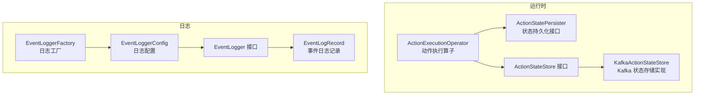
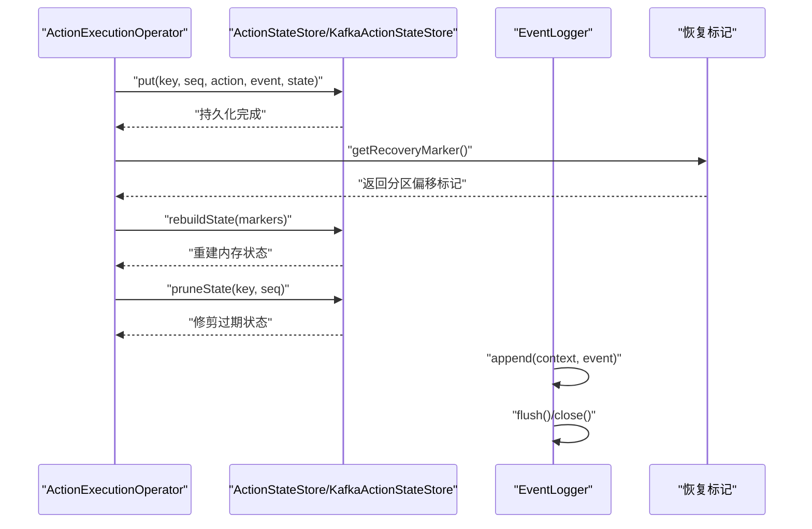
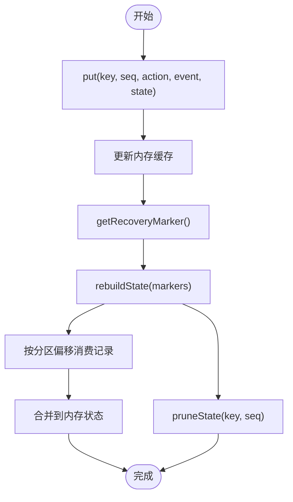
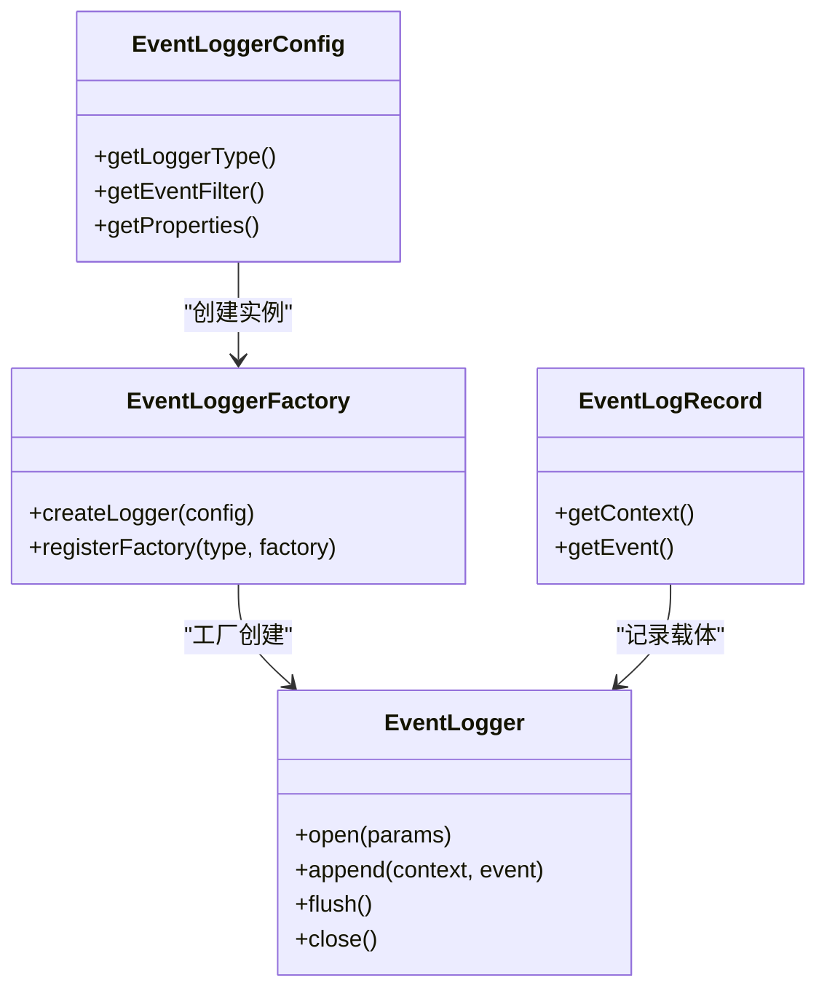
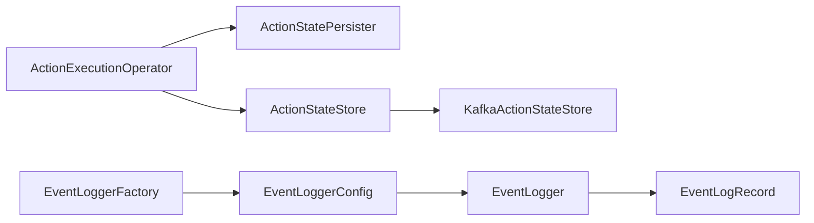

# 备份恢复

<cite>
**本文引用的文件**
- [README.md](file://README.md)
- [ActionStateStore.java](file://runtime/src/main/java/org/apache/flink/agents/runtime/actionstate/ActionStateStore.java)
- [KafkaActionStateStore.java](file://runtime/src/main/java/org/apache/flink/agents/runtime/actionstate/KafkaActionStateStore.java)
- [ActionExecutionOperator.java](file://runtime/src/main/java/org/apache/flink/agents/runtime/operator/ActionExecutionOperator.java)
- [ActionStatePersister.java](file://runtime/src/main/java/org/apache/flink/agents/runtime/context/ActionStatePersister.java)
- [EventLogger.java](file://api/src/main/java/org/apache/flink/agents/api/logger/EventLogger.java)
- [EventLoggerConfig.java](file://api/src/main/java/org/apache/flink/agents/api/logger/EventLoggerConfig.java)
- [EventLoggerFactory.java](file://api/src/main/java/org/apache/flink/agents/api/logger/EventLoggerFactory.java)
- [EventLogRecord.java](file://runtime/src/main/java/org/apache/flink/agents/runtime/eventlog/EventLogRecord.java)
- [RescalingTest.java](file://runtime/src/test/java/org/apache/flink/agents/runtime/RescalingTest.java)
- [DurableExecutionContextTest.java](file://runtime/src/test/java/org/apache/flink/agents/runtime/context/DurableExecutionContextTest.java)
- [KafkaActionStateStoreTest.java](file://runtime/src/test/java/org/apache/flink/agents/runtime/actionstate/KafkaActionStateStoreTest.java)
- [build.sh](file://tools/build.sh)
- [create_binary_release.sh](file://tools/releasing/create_binary_release.sh)
- [deploy_staging_jars.sh](file://tools/releasing/deploy_staging_jars.sh)
</cite>

## 目录
1. [简介](#简介)
2. [项目结构](#项目结构)
3. [核心组件](#核心组件)
4. [架构总览](#架构总览)
5. [详细组件分析](#详细组件分析)
6. [依赖关系分析](#依赖关系分析)
7. [性能考量](#性能考量)
8. [故障排查指南](#故障排查指南)
9. [结论](#结论)
10. [附录](#附录)

## 简介
本文件面向运维团队，提供 Apache Flink Agents 的备份与恢复操作指导。内容覆盖配置文件备份、状态数据备份与日志文件备份的实施方案；明确备份频率与保留策略（全量/增量/校验）；给出灾难恢复流程（系统故障恢复、数据丢失恢复、业务连续性保障）；介绍备份存储管理（介质选择、加密与异地备份）；提供恢复测试与演练方法（流程验证、性能测试、业务验证）；并给出自动化脚本与工具使用建议。

## 项目结构
从仓库结构可见，备份与恢复相关能力主要体现在运行时的状态持久化与事件日志记录两个方面：
- 状态持久化：通过 ActionStateStore 接口及 Kafka 实现，实现动作执行状态的持久化与恢复标记生成。
- 事件日志：通过 EventLogger 接口及其工厂与配置类，支持将事件按过滤规则写入不同后端（如文件、数据库、Kafka 等），用于审计与回溯。

**图表来源**
- [ActionExecutionOperator.java](file://runtime/src/main/java/org/apache/flink/agents/runtime/operator/ActionExecutionOperator.java#L186-L213)
- [ActionStatePersister.java](file://runtime/src/main/java/org/apache/flink/agents/runtime/context/ActionStatePersister.java#L31-L44)
- [ActionStateStore.java](file://runtime/src/main/java/org/apache/flink/agents/runtime/actionstate/ActionStateStore.java#L69-L92)
- [KafkaActionStateStore.java](file://runtime/src/main/java/org/apache/flink/agents/runtime/actionstate/KafkaActionStateStore.java#L66-L124)
- [EventLoggerFactory.java](file://api/src/main/java/org/apache/flink/agents/api/logger/EventLoggerFactory.java#L70-L153)
- [EventLoggerConfig.java](file://api/src/main/java/org/apache/flink/agents/api/logger/EventLoggerConfig.java#L59-L149)
- [EventLogger.java](file://api/src/main/java/org/apache/flink/agents/api/logger/EventLogger.java#L24-L79)
- [EventLogRecord.java](file://runtime/src/main/java/org/apache/flink/agents/runtime/eventlog/EventLogRecord.java#L26-L54)

**章节来源**
- [README.md](file://README.md#L1-L44)

## 核心组件
- 动作状态存储接口与实现
  - ActionStateStore：定义重建状态、修剪状态、获取恢复标记等能力。
  - KafkaActionStateStore：基于 Kafka 的实现，提供 put/get、rebuildState、pruneState、getRecoveryMarker 等方法，并在构造时自动创建主题（启用压缩）。
- 持久化回调
  - ActionStatePersister：封装状态持久化的回调签名，供执行上下文调用。
- 事件日志
  - EventLogger：统一的日志接口，支持打开、追加、刷新、关闭。
  - EventLoggerConfig/Factory：配置与工厂注册，支持多种后端（默认文件类型）。
  - EventLogRecord：事件日志记录的数据载体，支持多态序列化。

**章节来源**
- [ActionStateStore.java](file://runtime/src/main/java/org/apache/flink/agents/runtime/actionstate/ActionStateStore.java#L69-L92)
- [KafkaActionStateStore.java](file://runtime/src/main/java/org/apache/flink/agents/runtime/actionstate/KafkaActionStateStore.java#L66-L124)
- [ActionStatePersister.java](file://runtime/src/main/java/org/apache/flink/agents/runtime/context/ActionStatePersister.java#L31-L44)
- [EventLogger.java](file://api/src/main/java/org/apache/flink/agents/api/logger/EventLogger.java#L24-L79)
- [EventLoggerConfig.java](file://api/src/main/java/org/apache/flink/agents/api/logger/EventLoggerConfig.java#L59-L149)
- [EventLoggerFactory.java](file://api/src/main/java/org/apache/flink/agents/api/logger/EventLoggerFactory.java#L70-L153)
- [EventLogRecord.java](file://runtime/src/main/java/org/apache/flink/agents/runtime/eventlog/EventLogRecord.java#L26-L54)

## 架构总览
下图展示备份与恢复的关键路径：状态持久化与恢复标记生成、事件日志记录与检索、以及恢复流程中的重建与修剪。

**图表来源**
- [ActionExecutionOperator.java](file://runtime/src/main/java/org/apache/flink/agents/runtime/operator/ActionExecutionOperator.java#L1050-L1059)
- [ActionStateStore.java](file://runtime/src/main/java/org/apache/flink/agents/runtime/actionstate/ActionStateStore.java#L69-L92)
- [KafkaActionStateStore.java](file://runtime/src/main/java/org/apache/flink/agents/runtime/actionstate/KafkaActionStateStore.java#L202-L270)
- [EventLogger.java](file://api/src/main/java/org/apache/flink/agents/api/logger/EventLogger.java#L33-L76)

## 详细组件分析

### 状态数据备份与恢复（Kafka 后端）
- 持久化与重建
  - put：将动作状态写入 Kafka 并缓存到内存。
  - rebuildState：根据恢复标记（各分区结束偏移）重建状态，消费指定偏移范围内的记录并合并到内存。
  - pruneState：按键与序列号修剪过期状态。
  - getRecoveryMarker：返回当前各分区的结束偏移作为恢复点标记。
- 关键流程图

**图表来源**
- [KafkaActionStateStore.java](file://runtime/src/main/java/org/apache/flink/agents/runtime/actionstate/KafkaActionStateStore.java#L126-L148)
- [KafkaActionStateStore.java](file://runtime/src/main/java/org/apache/flink/agents/runtime/actionstate/KafkaActionStateStore.java#L202-L270)
- [KafkaActionStateStore.java](file://runtime/src/main/java/org/apache/flink/agents/runtime/actionstate/KafkaActionStateStore.java#L272-L302)
- [KafkaActionStateStore.java](file://runtime/src/main/java/org/apache/flink/agents/runtime/actionstate/KafkaActionStateStore.java#L308-L327)

**章节来源**
- [ActionExecutionOperator.java](file://runtime/src/main/java/org/apache/flink/agents/runtime/operator/ActionExecutionOperator.java#L1050-L1059)
- [ActionStateStore.java](file://runtime/src/main/java/org/apache/flink/agents/runtime/actionstate/ActionStateStore.java#L69-L92)
- [KafkaActionStateStore.java](file://runtime/src/main/java/org/apache/flink/agents/runtime/actionstate/KafkaActionStateStore.java#L66-L124)
- [KafkaActionStateStore.java](file://runtime/src/main/java/org/apache/flink/agents/runtime/actionstate/KafkaActionStateStore.java#L202-L270)
- [KafkaActionStateStore.java](file://runtime/src/main/java/org/apache/flink/agents/runtime/actionstate/KafkaActionStateStore.java#L272-L302)
- [KafkaActionStateStore.java](file://runtime/src/main/java/org/apache/flink/agents/runtime/actionstate/KafkaActionStateStore.java#L308-L327)

### 日志文件备份与恢复
- 统一接口与配置
  - EventLogger：open/append/flush/close 生命周期。
  - EventLoggerConfig：支持设置 loggerType、事件过滤器与属性（如文件基目录、最大文件大小、压缩等）。
  - EventLoggerFactory：注册内置工厂（默认文件类型），可扩展自定义实现。
- 数据模型

**图表来源**
- [EventLogger.java](file://api/src/main/java/org/apache/flink/agents/api/logger/EventLogger.java#L24-L79)
- [EventLoggerConfig.java](file://api/src/main/java/org/apache/flink/agents/api/logger/EventLoggerConfig.java#L59-L149)
- [EventLoggerFactory.java](file://api/src/main/java/org/apache/flink/agents/api/logger/EventLoggerFactory.java#L70-L153)
- [EventLogRecord.java](file://runtime/src/main/java/org/apache/flink/agents/runtime/eventlog/EventLogRecord.java#L26-L54)

**章节来源**
- [EventLogger.java](file://api/src/main/java/org/apache/flink/agents/api/logger/EventLogger.java#L24-L79)
- [EventLoggerConfig.java](file://api/src/main/java/org/apache/flink/agents/api/logger/EventLoggerConfig.java#L59-L149)
- [EventLoggerFactory.java](file://api/src/main/java/org/apache/flink/agents/api/logger/EventLoggerFactory.java#L70-L153)
- [EventLogRecord.java](file://runtime/src/main/java/org/apache/flink/agents/runtime/eventlog/EventLogRecord.java#L26-L54)

### 配置文件备份
- 构建与发布脚本
  - build.sh：构建 Java 与 Python 组件，复制分发 JAR 到 Python 包中。
  - create_binary_release.sh：打包二进制发行版，生成签名与哈希。
  - deploy_staging_jars.sh：多 JDK 版本发布（含 JDK 11 分类器）。
- 建议
  - 将 pom.xml、各模块的 pom.xml、脚本与文档纳入版本控制与备份。
  - 发布前对构建产物进行完整性校验（签名与哈希）。

**章节来源**
- [build.sh](file://tools/build.sh#L1-L86)
- [create_binary_release.sh](file://tools/releasing/create_binary_release.sh#L1-L127)
- [deploy_staging_jars.sh](file://tools/releasing/deploy_staging_jars.sh#L45-L75)

## 依赖关系分析
- 运行时算子依赖状态存储接口与持久化回调，以实现细粒度的可恢复执行。
- KafkaActionStateStore 依赖 Kafka 客户端，自动创建主题并启用压缩策略，确保幂等与可回溯。
- 事件日志通过工厂与配置解耦具体后端，便于替换与扩展。

**图表来源**
- [ActionExecutionOperator.java](file://runtime/src/main/java/org/apache/flink/agents/runtime/operator/ActionExecutionOperator.java#L186-L213)
- [ActionStatePersister.java](file://runtime/src/main/java/org/apache/flink/agents/runtime/context/ActionStatePersister.java#L31-L44)
- [ActionStateStore.java](file://runtime/src/main/java/org/apache/flink/agents/runtime/actionstate/ActionStateStore.java#L69-L92)
- [KafkaActionStateStore.java](file://runtime/src/main/java/org/apache/flink/agents/runtime/actionstate/KafkaActionStateStore.java#L66-L124)
- [EventLoggerFactory.java](file://api/src/main/java/org/apache/flink/agents/api/logger/EventLoggerFactory.java#L70-L153)
- [EventLoggerConfig.java](file://api/src/main/java/org/apache/flink/agents/api/logger/EventLoggerConfig.java#L59-L149)
- [EventLogger.java](file://api/src/main/java/org/apache/flink/agents/api/logger/EventLogger.java#L24-L79)
- [EventLogRecord.java](file://runtime/src/main/java/org/apache/flink/agents/runtime/eventlog/EventLogRecord.java#L26-L54)

**章节来源**
- [ActionExecutionOperator.java](file://runtime/src/main/java/org/apache/flink/agents/runtime/operator/ActionExecutionOperator.java#L186-L213)
- [KafkaActionStateStore.java](file://runtime/src/main/java/org/apache/flink/agents/runtime/actionstate/KafkaActionStateStore.java#L66-L124)
- [EventLoggerFactory.java](file://api/src/main/java/org/apache/flink/agents/api/logger/EventLoggerFactory.java#L70-L153)

## 性能考量
- Kafka 主题压缩：启用 compact 清理策略，降低存储占用并保持最新值可回溯。
- 恢复标记聚合：rebuildState 会取各分区最小偏移，减少重复消费。
- 批量刷盘：生产者使用 flush 保证持久化，避免频繁 IO。
- 测试场景：RescalingTest 展示了检查点与保存点目录配置，有助于理解状态后端与目录管理。

**章节来源**
- [KafkaActionStateStore.java](file://runtime/src/main/java/org/apache/flink/agents/runtime/actionstate/KafkaActionStateStore.java#L352-L355)
- [KafkaActionStateStore.java](file://runtime/src/main/java/org/apache/flink/agents/runtime/actionstate/KafkaActionStateStore.java#L209-L224)
- [KafkaActionStateStore.java](file://runtime/src/main/java/org/apache/flink/agents/runtime/actionstate/KafkaActionStateStore.java#L139-L140)
- [RescalingTest.java](file://runtime/src/test/java/org/apache/flink/agents/runtime/RescalingTest.java#L127-L136)

## 故障排查指南
- 状态重建失败
  - 检查 Kafka 主题是否存在、消费者权限与网络连通性。
  - 使用 getRecoveryMarker 获取当前标记，确认是否为空或异常。
  - rebuildState 中的偏移 seek 与 poll 超时参数需结合实际数据量调整。
- 状态修剪无效
  - 确认键格式与序列号解析逻辑一致，避免误删。
- 事件日志写入异常
  - 校验 EventLoggerConfig 的属性（如文件基目录、压缩开关）与权限。
  - 使用 flush 确保缓冲区落盘。
- 单元测试参考
  - KafkaActionStateStoreTest：验证恢复标记与重建流程。
  - DurableExecutionContextTest：验证持久化回调与状态缓存一致性。
  - RescalingTest：验证保存点与状态后端配置。

**章节来源**
- [KafkaActionStateStore.java](file://runtime/src/main/java/org/apache/flink/agents/runtime/actionstate/KafkaActionStateStore.java#L202-L270)
- [KafkaActionStateStore.java](file://runtime/src/main/java/org/apache/flink/agents/runtime/actionstate/KafkaActionStateStore.java#L308-L327)
- [KafkaActionStateStoreTest.java](file://runtime/src/test/java/org/apache/flink/agents/runtime/actionstate/KafkaActionStateStoreTest.java#L149-L175)
- [DurableExecutionContextTest.java](file://runtime/src/test/java/org/apache/flink/agents/runtime/context/DurableExecutionContextTest.java#L33-L66)
- [RescalingTest.java](file://runtime/src/test/java/org/apache/flink/agents/runtime/RescalingTest.java#L107-L145)

## 结论
本方案以 Kafka 为状态持久化后端，结合恢复标记与重建流程，实现细粒度的可恢复执行；通过 EventLogger 提供统一的日志记录能力，满足审计与回溯需求。建议在生产环境中采用多副本、压缩策略与异地备份，配合定期校验与演练，确保灾难恢复的可靠性与业务连续性。

## 附录

### 备份策略与保留策略
- 全量备份
  - 周期性创建保存点（savepoint），记录作业当前状态与恢复标记。
  - 导出事件日志到外部存储（文件/对象存储），保留完整历史。
- 增量备份
  - 基于 Kafka 主题的偏移标记，按分区增量消费并合并到外部归档。
  - 对事件日志采用滚动归档与压缩，控制单文件大小。
- 保留策略
  - 依据法规与业务 SLA 设定保留周期（如 90/180/365 天），到期清理。
  - 保留最近 N 个全量备份与最近一次保存点。

### 灾难恢复流程
- 系统故障恢复
  - 从最近保存点重启作业，触发 rebuildState，使用 getRecoveryMarker 精确恢复。
  - 校验 Kafka 主题可用性与消费者组偏移。
- 数据丢失恢复
  - 若状态丢失，回放事件日志至外部存储，重建动作状态。
  - 对关键事件进行去重与幂等处理，避免重复执行。
- 业务连续性保障
  - 预留热备节点与跨可用区部署，缩短切换时间。
  - 通过演练验证恢复时间目标（RTO）与恢复点目标（RPO）。

### 备份存储管理
- 存储介质选择
  - 状态：Kafka（高吞吐、可压缩）、对象存储（归档）。
  - 日志：本地文件系统（热数据）、对象存储（冷数据）。
- 加密
  - 在传输层（TLS）与存储层（服务端加密）实施加密。
- 异地备份
  - 将状态与日志分别复制到不同地理区域，定期校验一致性。

### 恢复测试与演练
- 流程验证
  - 模拟故障场景（Kafka 不可用、状态丢失、日志损坏），验证恢复路径。
- 性能测试
  - 评估 rebuildState 的耗时与吞吐，优化分区数与批大小。
- 业务验证
  - 对关键业务事件进行抽样回放，核对结果一致性。

### 自动化脚本与工具使用
- 构建与发布
  - 使用 build.sh 构建 Java 与 Python 组件，复制分发 JAR。
  - 使用 create_binary_release.sh 生成发行包与签名/哈希。
  - 使用 deploy_staging_jars.sh 多 JDK 版本发布。
- 运维脚本建议
  - 编写定时任务：创建保存点、导出日志、校验备份完整性。
  - 编写恢复脚本：从保存点启动、重建状态、回放日志、健康检查。

**章节来源**
- [build.sh](file://tools/build.sh#L1-L86)
- [create_binary_release.sh](file://tools/releasing/create_binary_release.sh#L58-L94)
- [deploy_staging_jars.sh](file://tools/releasing/deploy_staging_jars.sh#L45-L75)