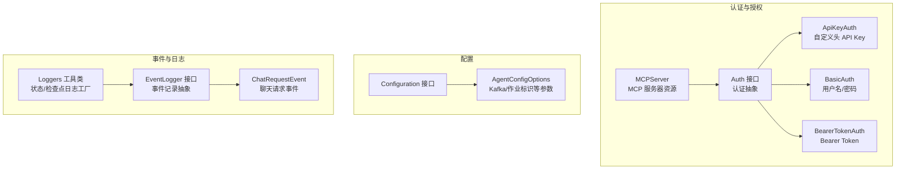
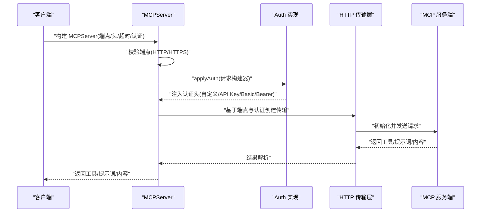
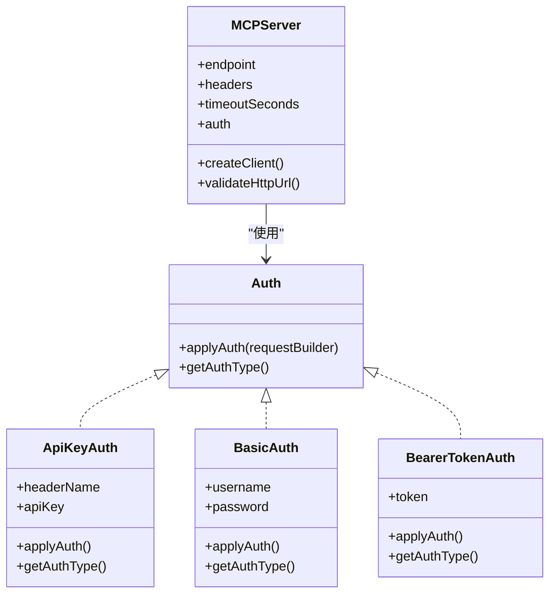
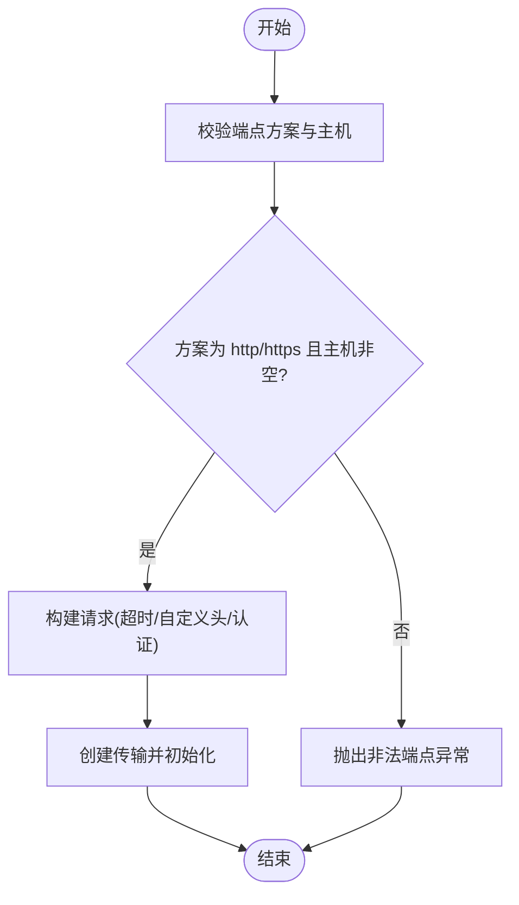
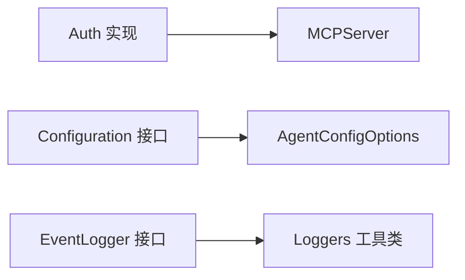

# 安全配置

<cite>
**本文引用的文件**
- [MCPServer.java](file://integrations/mcp/src/main/java/org/apache/flink/agents/integrations/mcp/MCPServer.java)
- [Auth.java](file://integrations/mcp/src/main/java/org/apache/flink/agents/integrations/mcp/auth/Auth.java)
- [ApiKeyAuth.java](file://integrations/mcp/src/main/java/org/apache/flink/agents/integrations/mcp/auth/ApiKeyAuth.java)
- [BasicAuth.java](file://integrations/mcp/src/main/java/org/apache/flink/agents/integrations/mcp/auth/BasicAuth.java)
- [BearerTokenAuth.java](file://integrations/mcp/src/main/java/org/apache/flink/agents/integrations/mcp/auth/BearerTokenAuth.java)
- [MCPServerTest.java](file://integrations/mcp/src/test/java/org/apache/flink/agents/integrations/mcp/MCPServerTest.java)
- [Configuration.java](file://api/src/main/java/org/apache/flink/agents/api/configuration/Configuration.java)
- [AgentConfigOptions.java](file://api/src/main/java/org/apache/flink/agents/api/configuration/AgentConfigOptions.java)
- [EventLogger.java](file://api/src/main/java/org/apache/flink/agents/api/logger/EventLogger.java)
- [ChatRequestEvent.java](file://api/src/main/java/org/apache/flink/agents/api/event/ChatRequestEvent.java)
- [Loggers.java](file://runtime/src/main/java/org/apache/flink/agents/runtime/logger/Loggers.java)
- [mcp.py](file://python/flink_agents/integrations/mcp/mcp.py)
- [utils.py](file://python/flink_agents/integrations/mcp/utils.py)
</cite>

## 目录
1. [简介](#简介)
2. [项目结构](#项目结构)
3. [核心组件](#核心组件)
4. [架构总览](#架构总览)
5. [详细组件分析](#详细组件分析)
6. [依赖关系分析](#依赖关系分析)
7. [性能与安全特性](#性能与安全特性)
8. [故障排查指南](#故障排查指南)
9. [结论](#结论)
10. [附录：配置清单与最佳实践](#附录配置清单与最佳实践)

## 简介
本文件面向安全工程师与运维人员，系统化梳理 Apache Flink Agents 在认证与授权、数据传输安全、访问控制、敏感数据保护、漏洞防护以及合规与最佳实践方面的安全配置要点。重点覆盖 MCP 服务器集成中的多种认证方式（API Key、Basic、Bearer Token），以及事件日志与运行时日志在安全审计与数据保护中的作用。

## 项目结构
围绕安全主题的关键模块如下：
- 认证与授权：MCP 服务器资源封装与多种认证实现
- 配置接口：统一的可读写配置能力
- 事件与日志：事件记录与持久化接口，支持审计与追踪
- 运行时日志工具：状态与检查点相关的日志工厂与校验逻辑

图表来源
- [MCPServer.java](file://integrations/mcp/src/main/java/org/apache/flink/agents/integrations/mcp/MCPServer.java#L50-L77)
- [Auth.java](file://integrations/mcp/src/main/java/org/apache/flink/agents/integrations/mcp/auth/Auth.java#L27-L59)
- [ApiKeyAuth.java](file://integrations/mcp/src/main/java/org/apache/flink/agents/integrations/mcp/auth/ApiKeyAuth.java#L27-L101)
- [BasicAuth.java](file://integrations/mcp/src/main/java/org/apache/flink/agents/integrations/mcp/auth/BasicAuth.java#L29-L107)
- [BearerTokenAuth.java](file://integrations/mcp/src/main/java/org/apache/flink/agents/integrations/mcp/auth/BearerTokenAuth.java#L27-L88)
- [Configuration.java](file://api/src/main/java/org/apache/flink/agents/api/configuration/Configuration.java#L20-L24)
- [AgentConfigOptions.java](file://api/src/main/java/org/apache/flink/agents/api/configuration/AgentConfigOptions.java#L21-L50)
- [EventLogger.java](file://api/src/main/java/org/apache/flink/agents/api/logger/EventLogger.java#L24-L78)
- [ChatRequestEvent.java](file://api/src/main/java/org/apache/flink/agents/api/event/ChatRequestEvent.java#L28-L57)
- [Loggers.java](file://runtime/src/main/java/org/apache/flink/agents/runtime/logger/Loggers.java#L34-L108)

章节来源
- [MCPServer.java](file://integrations/mcp/src/main/java/org/apache/flink/agents/integrations/mcp/MCPServer.java#L50-L77)
- [Configuration.java](file://api/src/main/java/org/apache/flink/agents/api/configuration/Configuration.java#L20-L24)
- [AgentConfigOptions.java](file://api/src/main/java/org/apache/flink/agents/api/configuration/AgentConfigOptions.java#L21-L50)
- [EventLogger.java](file://api/src/main/java/org/apache/flink/agents/api/logger/EventLogger.java#L24-L78)
- [ChatRequestEvent.java](file://api/src/main/java/org/apache/flink/agents/api/event/ChatRequestEvent.java#L28-L57)
- [Loggers.java](file://runtime/src/main/java/org/apache/flink/agents/runtime/logger/Loggers.java#L34-L108)

## 核心组件
- 认证抽象与实现
  - Auth 接口定义认证类型与应用策略
  - ApiKeyAuth：通过自定义头部注入 API Key
  - BasicAuth：标准 HTTP 基本身份认证
  - BearerTokenAuth：OAuth 2.0/JWT 等承载令牌认证
- MCP 服务器资源
  - 支持端点校验、超时、自定义头与认证注入
  - 提供工具与提示词列表查询、调用与关闭
- 配置接口
  - 统一的可读写配置能力，便于集中管理安全相关参数（如 Kafka 通信、作业标识）
- 事件与日志
  - 事件记录接口支持审计与追踪
  - 运行时日志工具提供状态与检查点相关能力

章节来源
- [Auth.java](file://integrations/mcp/src/main/java/org/apache/flink/agents/integrations/mcp/auth/Auth.java#L27-L59)
- [ApiKeyAuth.java](file://integrations/mcp/src/main/java/org/apache/flink/agents/integrations/mcp/auth/ApiKeyAuth.java#L27-L101)
- [BasicAuth.java](file://integrations/mcp/src/main/java/org/apache/flink/agents/integrations/mcp/auth/BasicAuth.java#L29-L107)
- [BearerTokenAuth.java](file://integrations/mcp/src/main/java/org/apache/flink/agents/integrations/mcp/auth/BearerTokenAuth.java#L27-L88)
- [MCPServer.java](file://integrations/mcp/src/main/java/org/apache/flink/agents/integrations/mcp/MCPServer.java#L50-L77)
- [Configuration.java](file://api/src/main/java/org/apache/flink/agents/api/configuration/Configuration.java#L20-L24)
- [AgentConfigOptions.java](file://api/src/main/java/org/apache/flink/agents/api/configuration/AgentConfigOptions.java#L21-L50)
- [EventLogger.java](file://api/src/main/java/org/apache/flink/agents/api/logger/EventLogger.java#L24-L78)

## 架构总览
下图展示 MCP 服务器与多种认证方式的交互流程，以及事件日志在执行过程中的位置。

图表来源
- [MCPServer.java](file://integrations/mcp/src/main/java/org/apache/flink/agents/integrations/mcp/MCPServer.java#L213-L240)
- [Auth.java](file://integrations/mcp/src/main/java/org/apache/flink/agents/integrations/mcp/auth/Auth.java#L45-L58)
- [ApiKeyAuth.java](file://integrations/mcp/src/main/java/org/apache/flink/agents/integrations/mcp/auth/ApiKeyAuth.java#L67-L70)
- [BasicAuth.java](file://integrations/mcp/src/main/java/org/apache/flink/agents/integrations/mcp/auth/BasicAuth.java#L69-L75)
- [BearerTokenAuth.java](file://integrations/mcp/src/main/java/org/apache/flink/agents/integrations/mcp/auth/BearerTokenAuth.java#L58-L61)

## 详细组件分析

### 认证与授权机制
- Auth 抽象
  - 通过注解声明多态序列化类型，支持以 JSON 形式区分不同认证类型
- ApiKeyAuth
  - 将 API Key 注入到指定自定义头部，适合第三方服务的 API Key 校验
- BasicAuth
  - 生成基础认证头，适用于需要用户名/密码的服务端
- BearerTokenAuth
  - 生成承载令牌头，适用于 OAuth 2.0/JWT 场景
- MCPServer 的认证应用
  - 在创建传输前，将认证信息注入到 HTTP 请求构建器中
  - 对端点进行 HTTP/HTTPS 校验，避免不安全连接

图表来源
- [Auth.java](file://integrations/mcp/src/main/java/org/apache/flink/agents/integrations/mcp/auth/Auth.java#L27-L59)
- [ApiKeyAuth.java](file://integrations/mcp/src/main/java/org/apache/flink/agents/integrations/mcp/auth/ApiKeyAuth.java#L41-L101)
- [BasicAuth.java](file://integrations/mcp/src/main/java/org/apache/flink/agents/integrations/mcp/auth/BasicAuth.java#L43-L107)
- [BearerTokenAuth.java](file://integrations/mcp/src/main/java/org/apache/flink/agents/integrations/mcp/auth/BearerTokenAuth.java#L40-L88)
- [MCPServer.java](file://integrations/mcp/src/main/java/org/apache/flink/agents/integrations/mcp/MCPServer.java#L213-L240)

章节来源
- [Auth.java](file://integrations/mcp/src/main/java/org/apache/flink/agents/integrations/mcp/auth/Auth.java#L27-L59)
- [ApiKeyAuth.java](file://integrations/mcp/src/main/java/org/apache/flink/agents/integrations/mcp/auth/ApiKeyAuth.java#L27-L101)
- [BasicAuth.java](file://integrations/mcp/src/main/java/org/apache/flink/agents/integrations/mcp/auth/BasicAuth.java#L29-L107)
- [BearerTokenAuth.java](file://integrations/mcp/src/main/java/org/apache/flink/agents/integrations/mcp/auth/BearerTokenAuth.java#L27-L88)
- [MCPServer.java](file://integrations/mcp/src/main/java/org/apache/flink/agents/integrations/mcp/MCPServer.java#L213-L258)

### 数据传输安全与网络配置
- 端点校验
  - 仅允许 http 或 https 方案，且主机不能为空，防止不安全或格式错误的端点
- 超时与头部
  - 支持自定义超时与通用头部，便于与下游服务协商与限流
- Python 版本的传输层
  - 使用官方 MCP SDK 的可流式 HTTP 传输，支持 SSE 读取超时与认证传递

图表来源
- [MCPServer.java](file://integrations/mcp/src/main/java/org/apache/flink/agents/integrations/mcp/MCPServer.java#L242-L258)
- [mcp.py](file://python/flink_agents/integrations/mcp/mcp.py#L181-L201)

章节来源
- [MCPServer.java](file://integrations/mcp/src/main/java/org/apache/flink/agents/integrations/mcp/MCPServer.java#L242-L258)
- [mcp.py](file://python/flink_agents/integrations/mcp/mcp.py#L173-L201)

### 访问控制策略与资源访问限制
- 资源类型与封装
  - MCPServer 作为 MCP 服务器资源，统一暴露工具与提示词，便于在执行环境中进行资源级访问控制
- 参数与输入处理
  - 工具参数具备类型转换与存在性检查，有助于减少越权或误用风险
- 事件与上下文
  - 事件记录接口支持对执行过程进行审计，结合过滤与持久化策略实现访问追踪

章节来源
- [MCPServer.java](file://integrations/mcp/src/main/java/org/apache/flink/agents/integrations/mcp/MCPServer.java#L265-L335)
- [ChatRequestEvent.java](file://api/src/main/java/org/apache/flink/agents/api/event/ChatRequestEvent.java#L28-L57)
- [EventLogger.java](file://api/src/main/java/org/apache/flink/agents/api/logger/EventLogger.java#L24-L78)

### 敏感数据保护与密钥管理
- 认证信息的序列化与传输
  - Java 侧：认证对象通过 Jackson 多态序列化，避免明文泄露
  - Python 侧：认证对象采用 base64+cloudpickle 序列化，便于跨语言传递
- 日志与输出脱敏
  - 认证对象的字符串表示会隐藏敏感字段，降低日志泄露风险
- 事件日志
  - 事件记录接口支持按需过滤与持久化，建议对敏感字段进行脱敏处理

章节来源
- [Auth.java](file://integrations/mcp/src/main/java/org/apache/flink/agents/integrations/mcp/auth/Auth.java#L37-L42)
- [ApiKeyAuth.java](file://integrations/mcp/src/main/java/org/apache/flink/agents/integrations/mcp/auth/ApiKeyAuth.java#L98-L101)
- [BasicAuth.java](file://integrations/mcp/src/main/java/org/apache/flink/agents/integrations/mcp/auth/BasicAuth.java#L104-L107)
- [BearerTokenAuth.java](file://integrations/mcp/src/main/java/org/apache/flink/agents/integrations/mcp/auth/BearerTokenAuth.java#L85-L88)
- [mcp.py](file://python/flink_agents/integrations/mcp/mcp.py#L154-L166)

### 漏洞防护与输入验证
- 输入验证
  - 端点校验确保协议与主机合法性，避免 SSRF 等风险
  - 工具参数具备类型转换与存在性检查，减少注入与类型错误
- 内容提取与类型约束
  - Python 侧对 MCP 内容项进行类型判定与归一化，避免未知类型导致的异常传播
- 事件序列化
  - 事件对象需满足可序列化要求，避免反序列化异常引发的处理问题

章节来源
- [MCPServer.java](file://integrations/mcp/src/main/java/org/apache/flink/agents/integrations/mcp/MCPServer.java#L242-L258)
- [utils.py](file://python/flink_agents/integrations/mcp/utils.py#L23-L65)
- [TestEventSerializable.java](file://plan/src/test/java/org/apache/flink/agents/plan/TestEventSerializable.java#L58-L84)

### 安全配置示例与最佳实践
- API Key 认证
  - 选择合适的自定义头部名称，避免与标准头部冲突；定期轮换密钥
- Basic 认证
  - 结合 TLS 使用；最小权限原则分配账户；定期更换密码
- 承载令牌认证
  - 控制令牌有效期与作用域；启用刷新与撤销机制
- 传输安全
  - 强制使用 https；配置合理的超时与重试策略；启用中间人攻击防护
- 访问控制
  - 严格限制 MCP 服务器访问范围；对工具与提示词进行白名单管理
- 审计与日志
  - 启用事件日志并进行脱敏；定期审查日志；保留足够时间窗口用于取证

章节来源
- [MCPServerTest.java](file://integrations/mcp/src/test/java/org/apache/flink/agents/integrations/mcp/MCPServerTest.java#L157-L200)
- [EventLogger.java](file://api/src/main/java/org/apache/flink/agents/api/logger/EventLogger.java#L24-L78)

## 依赖关系分析
- 认证实现与 MCPServer 的耦合度低，通过 Auth 接口解耦
- 配置接口提供集中化参数管理，便于统一安全策略
- 事件日志与运行时日志相互独立，分别服务于审计与状态持久化

图表来源
- [Auth.java](file://integrations/mcp/src/main/java/org/apache/flink/agents/integrations/mcp/auth/Auth.java#L27-L59)
- [MCPServer.java](file://integrations/mcp/src/main/java/org/apache/flink/agents/integrations/mcp/MCPServer.java#L213-L240)
- [Configuration.java](file://api/src/main/java/org/apache/flink/agents/api/configuration/Configuration.java#L20-L24)
- [AgentConfigOptions.java](file://api/src/main/java/org/apache/flink/agents/api/configuration/AgentConfigOptions.java#L21-L50)
- [EventLogger.java](file://api/src/main/java/org/apache/flink/agents/api/logger/EventLogger.java#L24-L78)
- [Loggers.java](file://runtime/src/main/java/org/apache/flink/agents/runtime/logger/Loggers.java#L34-L108)

章节来源
- [Auth.java](file://integrations/mcp/src/main/java/org/apache/flink/agents/integrations/mcp/auth/Auth.java#L27-L59)
- [MCPServer.java](file://integrations/mcp/src/main/java/org/apache/flink/agents/integrations/mcp/MCPServer.java#L213-L240)
- [Configuration.java](file://api/src/main/java/org/apache/flink/agents/api/configuration/Configuration.java#L20-L24)
- [AgentConfigOptions.java](file://api/src/main/java/org/apache/flink/agents/api/configuration/AgentConfigOptions.java#L21-L50)
- [EventLogger.java](file://api/src/main/java/org/apache/flink/agents/api/logger/EventLogger.java#L24-L78)
- [Loggers.java](file://runtime/src/main/java/org/apache/flink/agents/runtime/logger/Loggers.java#L34-L108)

## 性能与安全特性
- 认证注入在请求构建阶段完成，开销极小
- 端点校验与超时配置有助于提升整体稳定性与安全性
- 事件日志与运行时日志分离，避免审计路径影响核心执行性能

[本节为通用讨论，无需列出具体文件来源]

## 故障排查指南
- 端点非法
  - 现象：初始化失败并提示非法端点
  - 排查：确认端点方案为 http/https 且主机非空
- 认证失败
  - 现象：请求被拒绝或返回未授权
  - 排查：核对认证类型与凭据；检查自定义头部是否正确
- 事件序列化异常
  - 现象：事件对象不可序列化导致处理失败
  - 排查：确保事件对象满足可序列化要求，并对敏感字段进行脱敏

章节来源
- [MCPServer.java](file://integrations/mcp/src/main/java/org/apache/flink/agents/integrations/mcp/MCPServer.java#L242-L258)
- [MCPServerTest.java](file://integrations/mcp/src/test/java/org/apache/flink/agents/integrations/mcp/MCPServerTest.java#L157-L200)
- [TestEventSerializable.java](file://plan/src/test/java/org/apache/flink/agents/plan/TestEventSerializable.java#L58-L84)

## 结论
通过将认证抽象化、严格的端点校验、可序列化的认证对象以及完善的事件与日志体系，Apache Flink Agents 在 MCP 集成场景下提供了清晰、可审计且易于维护的安全基线。配合合理的密钥轮换、TLS 强制与最小权限原则，可有效降低认证绕过、中间人攻击与数据泄露风险。

[本节为总结性内容，无需列出具体文件来源]

## 附录：配置清单与最佳实践
- 认证配置
  - API Key：选择安全的自定义头部名，定期轮换
  - Basic：强制 TLS，最小权限账户，定期更换密码
  - Bearer：控制有效期与作用域，启用刷新与撤销
- 传输与网络
  - 强制 https；合理设置超时与重试；限制可访问的 MCP 服务器范围
- 审计与日志
  - 启用事件日志并脱敏；保留足够时间窗口；定期审查
- 配置参数参考
  - Kafka 通信与作业标识等参数可通过配置接口集中管理

章节来源
- [AgentConfigOptions.java](file://api/src/main/java/org/apache/flink/agents/api/configuration/AgentConfigOptions.java#L21-L50)
- [Configuration.java](file://api/src/main/java/org/apache/flink/agents/api/configuration/Configuration.java#L20-L24)
- [EventLogger.java](file://api/src/main/java/org/apache/flink/agents/api/logger/EventLogger.java#L24-L78)