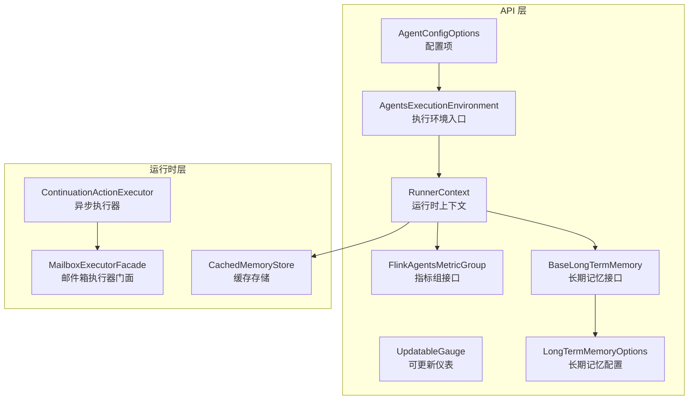
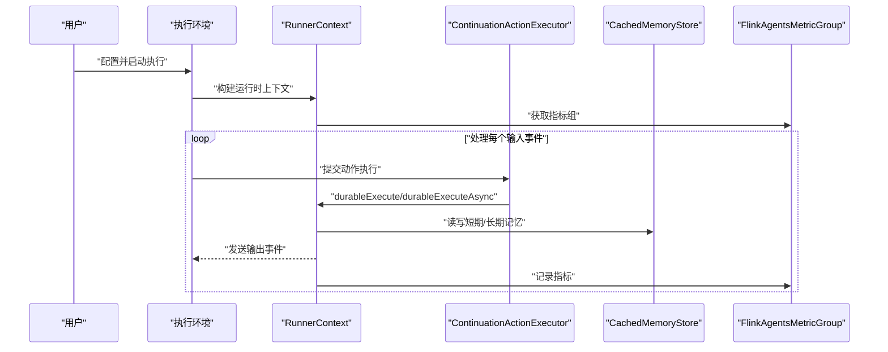
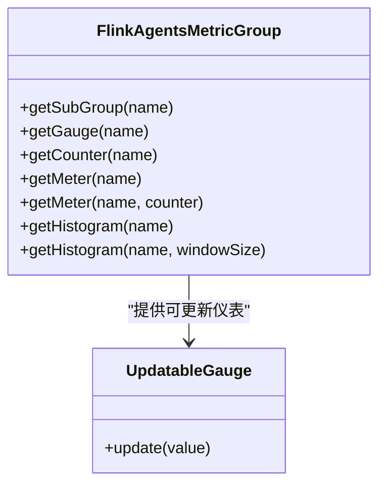
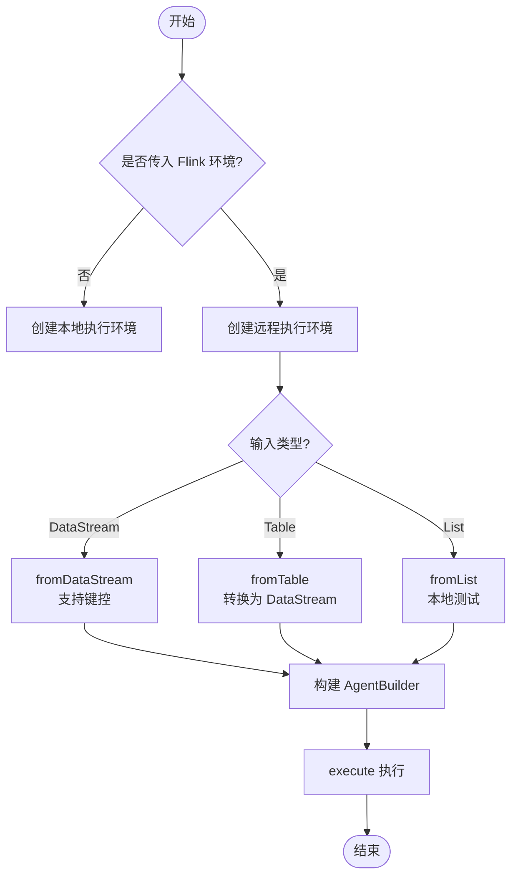
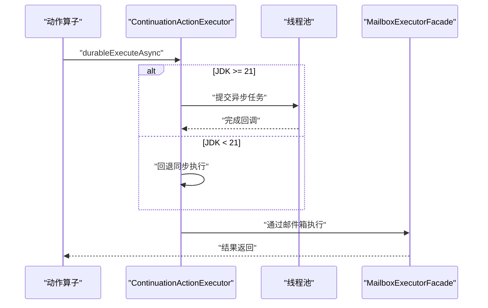
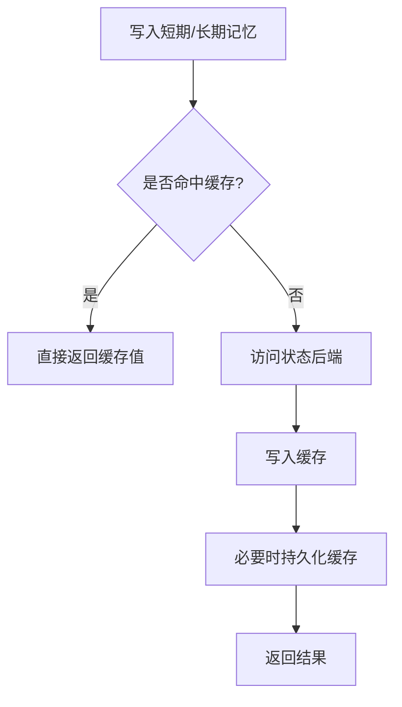
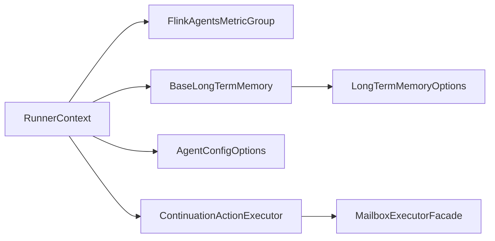

# 性能调优

<cite>
**本文引用的文件**
- [FlinkAgentsMetricGroup.java](file://api/src/main/java/org/apache/flink/agents/api/metrics/FlinkAgentsMetricGroup.java)
- [UpdatableGauge.java](file://api/src/main/java/org/apache/flink/agents/api/metrics/UpdatableGauge.java)
- [AgentConfigOptions.java](file://api/src/main/java/org/apache/flink/agents/api/configuration/AgentConfigOptions.java)
- [AgentsExecutionEnvironment.java](file://api/src/main/java/org/apache/flink/agents/api/AgentsExecutionEnvironment.java)
- [BaseLongTermMemory.java](file://api/src/main/java/org/apache/flink/agents/api/memory/BaseLongTermMemory.java)
- [LongTermMemoryOptions.java](file://api/src/main/java/org/apache/flink/agents/api/memory/LongTermMemoryOptions.java)
- [ContinuationActionExecutor.java](file://runtime/src/main/java/org/apache/flink/agents/runtime/async/ContinuationActionExecutor.java)
- [MailboxExecutorFacade.java](file://runtime/src/main/java/org/apache/flink/agents/runtime/common/MailboxExecutorFacade.java)
- [RunnerContext.java](file://api/src/main/java/org/apache/flink/agents/api/context/RunnerContext.java)
- [CachedMemoryStore.java](file://runtime/src/main/java/org/apache/flink/agents/runtime/memory/CachedMemoryStore.java)
- [MemoryObjectTest.java](file://runtime/src/test/java/org/apache/flink/agents/runtime/memory/MemoryObjectTest.java)
- [CachedMemoryStoreTest.java](file://runtime/src/test/java/org/apache/flink/agents/runtime/memory/CachedMemoryStoreTest.java)
- [MemoryRefTest.java](file://runtime/src/test/java/org/apache/flink/agents/runtime/memory/MemoryRefTest.java)
</cite>

## 目录
1. [简介](#简介)
2. [项目结构](#项目结构)
3. [核心组件](#核心组件)
4. [架构总览](#架构总览)
5. [详细组件分析](#详细组件分析)
6. [依赖关系分析](#依赖关系分析)
7. [性能考虑与优化建议](#性能考虑与优化建议)
8. [故障排查指南](#故障排查指南)
9. [结论](#结论)
10. [附录：基准与压测方法](#附录基准与压测方法)

## 简介
本文件面向性能工程师与系统管理员，围绕 Apache Flink Agents 的运行时与资源管理，提供一套系统性的性能调优指南。内容涵盖：
- 性能监控指标体系（内存、CPU、网络 I/O、磁盘 I/O）
- 资源配置优化（并行度、内存分配、线程池）
- 缓存策略优化（短期/长期记忆与 Python 环境缓存）
- 队列与异步执行优化（消息队列与异步任务调度）
- 瓶颈识别与常见问题诊断
- 基准与压力测试方法与工具

## 项目结构
从性能视角，关键模块与职责如下：
- API 层：定义执行环境、配置选项、指标接口、上下文与内存接口
- 运行时层：实现异步执行、邮件箱执行器门面、动作状态与缓存存储
- 内存与长短期记忆：抽象与可配置的后台与容量控制
- 配置与指标：统一的配置项与指标组接口，便于采集与导出

图表来源
- [AgentsExecutionEnvironment.java](file://api/src/main/java/org/apache/flink/agents/api/AgentsExecutionEnvironment.java#L43-L223)
- [AgentConfigOptions.java](file://api/src/main/java/org/apache/flink/agents/api/configuration/AgentConfigOptions.java#L21-L50)
- [FlinkAgentsMetricGroup.java](file://api/src/main/java/org/apache/flink/agents/api/metrics/FlinkAgentsMetricGroup.java#L30-L92)
- [UpdatableGauge.java](file://api/src/main/java/org/apache/flink/agents/api/metrics/UpdatableGauge.java#L24-L37)
- [RunnerContext.java](file://api/src/main/java/org/apache/flink/agents/api/context/RunnerContext.java#L33-L137)
- [BaseLongTermMemory.java](file://api/src/main/java/org/apache/flink/agents/api/memory/BaseLongTermMemory.java#L27-L133)
- [LongTermMemoryOptions.java](file://api/src/main/java/org/apache/flink/agents/api/memory/LongTermMemoryOptions.java#L22-L52)
- [ContinuationActionExecutor.java](file://runtime/src/main/java/org/apache/flink/agents/runtime/async/ContinuationActionExecutor.java#L28-L69)
- [MailboxExecutorFacade.java](file://runtime/src/main/java/org/apache/flink/agents/runtime/common/MailboxExecutorFacade.java#L25-L44)
- [CachedMemoryStore.java](file://runtime/src/main/java/org/apache/flink/agents/runtime/memory/CachedMemoryStore.java#L41-L65)

章节来源
- [AgentsExecutionEnvironment.java](file://api/src/main/java/org/apache/flink/agents/api/AgentsExecutionEnvironment.java#L43-L223)
- [AgentConfigOptions.java](file://api/src/main/java/org/apache/flink/agents/api/configuration/AgentConfigOptions.java#L21-L50)

## 核心组件
- 执行环境与并行度
  - 通过执行环境入口选择本地或远程模式，并在远程模式下集成 Flink DataStream/Table，支持键控以提升状态一致性与并行度。
- 指标体系
  - 指标组提供子组、计数器、计量器、直方图与可更新仪表，便于采集吞吐、延迟、错误等关键指标。
- 上下文与资源访问
  - 提供事件发送、短期/长期记忆访问、资源获取、配置读取与持久化执行能力。
- 长期记忆与容量控制
  - 支持按集合命名、类型、容量与压缩配置进行管理；可配置异步压缩与线程数。
- 异步执行与线程池
  - 在 JDK 21+ 使用 Continuation 实现真正异步；JDK 11 回退同步执行；可通过邮件箱执行器门面接入 Flink MailboxExecutor。

章节来源
- [AgentsExecutionEnvironment.java](file://api/src/main/java/org/apache/flink/agents/api/AgentsExecutionEnvironment.java#L123-L198)
- [FlinkAgentsMetricGroup.java](file://api/src/main/java/org/apache/flink/agents/api/metrics/FlinkAgentsMetricGroup.java#L30-L92)
- [RunnerContext.java](file://api/src/main/java/org/apache/flink/agents/api/context/RunnerContext.java#L33-L137)
- [BaseLongTermMemory.java](file://api/src/main/java/org/apache/flink/agents/api/memory/BaseLongTermMemory.java#L27-L133)
- [LongTermMemoryOptions.java](file://api/src/main/java/org/apache/flink/agents/api/memory/LongTermMemoryOptions.java#L22-L52)
- [ContinuationActionExecutor.java](file://runtime/src/main/java/org/apache/flink/agents/runtime/async/ContinuationActionExecutor.java#L28-L69)
- [MailboxExecutorFacade.java](file://runtime/src/main/java/org/apache/flink/agents/runtime/common/MailboxExecutorFacade.java#L25-L44)

## 架构总览
下图展示从输入到动作执行、指标采集与异步执行的整体流程。

图表来源
- [AgentsExecutionEnvironment.java](file://api/src/main/java/org/apache/flink/agents/api/AgentsExecutionEnvironment.java#L123-L198)
- [RunnerContext.java](file://api/src/main/java/org/apache/flink/agents/api/context/RunnerContext.java#L113-L133)
- [ContinuationActionExecutor.java](file://runtime/src/main/java/org/apache/flink/agents/runtime/async/ContinuationActionExecutor.java#L40-L57)
- [CachedMemoryStore.java](file://runtime/src/main/java/org/apache/flink/agents/runtime/memory/CachedMemoryStore.java#L41-L65)
- [FlinkAgentsMetricGroup.java](file://api/src/main/java/org/apache/flink/agents/api/metrics/FlinkAgentsMetricGroup.java#L30-L92)

## 详细组件分析

### 组件一：指标与可观测性（FlinkAgentsMetricGroup 与 UpdatableGauge）
- 设计要点
  - 指标组支持子组、计数器、计量器、直方图与可更新仪表，便于多维度观测。
  - 可更新仪表用于跨语言一致性（字符串值），避免类型冲突。
- 性能意义
  - 通过直方图与计量器统计延迟分布与速率，结合计数器统计错误与异常，支撑容量规划与 SLA 对齐。
- 调优建议
  - 为关键路径（模型调用、向量检索、工具调用）分别建立指标组与仪表。
  - 合理设置直方图窗口大小，平衡实时性与内存占用。

图表来源
- [FlinkAgentsMetricGroup.java](file://api/src/main/java/org/apache/flink/agents/api/metrics/FlinkAgentsMetricGroup.java#L30-L92)
- [UpdatableGauge.java](file://api/src/main/java/org/apache/flink/agents/api/metrics/UpdatableGauge.java#L24-L37)

章节来源
- [FlinkAgentsMetricGroup.java](file://api/src/main/java/org/apache/flink/agents/api/metrics/FlinkAgentsMetricGroup.java#L30-L92)
- [UpdatableGauge.java](file://api/src/main/java/org/apache/flink/agents/api/metrics/UpdatableGauge.java#L24-L37)

### 组件二：执行环境与并行度（AgentsExecutionEnvironment）
- 设计要点
  - 支持本地与远程两种执行环境；远程模式集成 Flink DataStream/Table，支持键控以提升状态一致性。
  - 提供从列表、数据流、表等多种输入源的适配。
- 性能意义
  - 并行度由底层 Flink 控制；键控可减少状态碎片与重分区开销。
- 调优建议
  - 在远程模式下，合理设置并行度与分区内核数，确保 CPU 与网络带宽充分利用。
  - 对有状态的动作使用稳定键控，降低状态恢复与一致性成本。

图表来源
- [AgentsExecutionEnvironment.java](file://api/src/main/java/org/apache/flink/agents/api/AgentsExecutionEnvironment.java#L68-L198)

章节来源
- [AgentsExecutionEnvironment.java](file://api/src/main/java/org/apache/flink/agents/api/AgentsExecutionEnvironment.java#L68-L198)

### 组件三：异步执行与线程池（ContinuationActionExecutor 与 MailboxExecutorFacade）
- 设计要点
  - JDK 21+ 使用 Continuation API 实现真正的异步；JDK 11 回退同步执行。
  - 邮件箱执行器门面将任务提交至 Flink MailboxExecutor，保证与算子执行模型一致。
- 性能意义
  - 异步执行可显著提升 I/O 密集型动作（如模型调用、向量检索）的并发度。
- 调优建议
  - 在 JDK 21+ 环境启用 Continuation，避免阻塞式等待。
  - 将外部 I/O 操作封装为异步调用，配合线程池限制并发度，防止下游过载。

图表来源
- [ContinuationActionExecutor.java](file://runtime/src/main/java/org/apache/flink/agents/runtime/async/ContinuationActionExecutor.java#L28-L69)
- [MailboxExecutorFacade.java](file://runtime/src/main/java/org/apache/flink/agents/runtime/common/MailboxExecutorFacade.java#L25-L44)
- [RunnerContext.java](file://api/src/main/java/org/apache/flink/agents/api/context/RunnerContext.java#L122-L133)

章节来源
- [ContinuationActionExecutor.java](file://runtime/src/main/java/org/apache/flink/agents/runtime/async/ContinuationActionExecutor.java#L28-L69)
- [MailboxExecutorFacade.java](file://runtime/src/main/java/org/apache/flink/agents/runtime/common/MailboxExecutorFacade.java#L25-L44)
- [RunnerContext.java](file://api/src/main/java/org/apache/flink/agents/api/context/RunnerContext.java#L122-L133)

### 组件四：缓存策略（短期/长期记忆与 Python 环境缓存）
- 设计要点
  - 短期记忆在每次运行后自动清理；长期记忆通过集合与容量控制管理，支持压缩配置。
  - 缓存存储支持写入缓存并在必要时持久化，减少状态后端压力。
- 性能意义
  - 通过缓存减少重复计算与 I/O 访问；合理的容量与压缩策略避免内存膨胀。
- 调优建议
  - 短期记忆：仅存放本次会话必要的中间结果，避免跨会话共享导致的锁竞争。
  - 长期记忆：根据查询负载调整容量与压缩线程数；开启异步压缩以降低主路径延迟。
  - Python 环境缓存：复用已初始化的资源，减少冷启动开销。

图表来源
- [CachedMemoryStore.java](file://runtime/src/main/java/org/apache/flink/agents/runtime/memory/CachedMemoryStore.java#L41-L65)
- [BaseLongTermMemory.java](file://api/src/main/java/org/apache/flink/agents/api/memory/BaseLongTermMemory.java#L27-L133)
- [LongTermMemoryOptions.java](file://api/src/main/java/org/apache/flink/agents/api/memory/LongTermMemoryOptions.java#L22-L52)

章节来源
- [CachedMemoryStore.java](file://runtime/src/main/java/org/apache/flink/agents/runtime/memory/CachedMemoryStore.java#L41-L65)
- [BaseLongTermMemory.java](file://api/src/main/java/org/apache/flink/agents/api/memory/BaseLongTermMemory.java#L27-L133)
- [LongTermMemoryOptions.java](file://api/src/main/java/org/apache/flink/agents/api/memory/LongTermMemoryOptions.java#L22-L52)

### 组件五：配置与资源（AgentConfigOptions）
- 设计要点
  - 提供基础日志目录、动作状态后端、Kafka 连接参数、作业标识等配置项。
- 性能意义
  - 正确的 Kafka 分区数与复制因子影响动作状态的吞吐与可靠性；作业标识有助于定位与隔离。
- 调优建议
  - 根据吞吐需求设置 Kafka 分区数；复制因子需与可用性目标匹配。
  - 日志目录与状态后端应位于高性能存储，避免 I/O 瓶颈。

章节来源
- [AgentConfigOptions.java](file://api/src/main/java/org/apache/flink/agents/api/configuration/AgentConfigOptions.java#L21-L50)

## 依赖关系分析
- 组件耦合
  - RunnerContext 依赖指标组、内存接口与配置；动作执行通过异步执行器与邮件箱执行器门面解耦。
  - 长期记忆接口与选项解耦于具体实现，便于替换与扩展。
- 外部依赖
  - Flink MailboxExecutor 作为执行后端，保证与算子模型一致。
  - Kafka 作为动作状态后端，需要独立的运维与容量规划。

图表来源
- [RunnerContext.java](file://api/src/main/java/org/apache/flink/agents/api/context/RunnerContext.java#L33-L137)
- [FlinkAgentsMetricGroup.java](file://api/src/main/java/org/apache/flink/agents/api/metrics/FlinkAgentsMetricGroup.java#L30-L92)
- [BaseLongTermMemory.java](file://api/src/main/java/org/apache/flink/agents/api/memory/BaseLongTermMemory.java#L27-L133)
- [LongTermMemoryOptions.java](file://api/src/main/java/org/apache/flink/agents/api/memory/LongTermMemoryOptions.java#L22-L52)
- [ContinuationActionExecutor.java](file://runtime/src/main/java/org/apache/flink/agents/runtime/async/ContinuationActionExecutor.java#L28-L69)
- [MailboxExecutorFacade.java](file://runtime/src/main/java/org/apache/flink/agents/runtime/common/MailboxExecutorFacade.java#L25-L44)
- [AgentConfigOptions.java](file://api/src/main/java/org/apache/flink/agents/api/configuration/AgentConfigOptions.java#L21-L50)

## 性能考虑与优化建议

### 1. 性能监控指标体系
- 内存使用
  - 关注短期/长期记忆容量与压缩线程数；通过指标组记录内存对象数量与缓存命中率。
- CPU 利用率
  - 观察异步执行的吞吐与延迟分布；对高 I/O 动作启用 Continuation 以提升并发。
- 网络 I/O
  - 监控 Kafka 动作状态主题的生产/消费速率与延迟；合理设置分区数与副本。
- 磁盘 I/O
  - 关注状态后端与日志目录所在存储的吞吐与延迟；必要时分离热数据与冷数据。

章节来源
- [FlinkAgentsMetricGroup.java](file://api/src/main/java/org/apache/flink/agents/api/metrics/FlinkAgentsMetricGroup.java#L30-L92)
- [AgentConfigOptions.java](file://api/src/main/java/org/apache/flink/agents/api/configuration/AgentConfigOptions.java#L21-L50)

### 2. 资源配置优化
- 并行度设置
  - 在远程执行环境中，结合键控与状态后端能力，合理设置并行度与分区数。
- 内存分配
  - 长期记忆的异步压缩线程数与容量直接影响内存峰值；根据负载动态调整。
- 线程池配置
  - 异步执行器线程数与邮件箱执行器的调度策略需与 CPU 核心数匹配，避免过度竞争。

章节来源
- [AgentsExecutionEnvironment.java](file://api/src/main/java/org/apache/flink/agents/api/AgentsExecutionEnvironment.java#L68-L198)
- [LongTermMemoryOptions.java](file://api/src/main/java/org/apache/flink/agents/api/memory/LongTermMemoryOptions.java#L45-L52)
- [MailboxExecutorFacade.java](file://runtime/src/main/java/org/apache/flink/agents/runtime/common/MailboxExecutorFacade.java#L25-L44)

### 3. 缓存策略优化
- 短期记忆
  - 仅存放当前会话必要数据，避免跨会话共享；定期清理减少累积。
- 长期记忆
  - 容量与压缩策略需结合查询模式；异步压缩降低主路径延迟。
- Python 环境缓存
  - 复用已初始化资源，减少冷启动；注意版本兼容与资源释放。

章节来源
- [CachedMemoryStore.java](file://runtime/src/main/java/org/apache/flink/agents/runtime/memory/CachedMemoryStore.java#L41-L65)
- [BaseLongTermMemory.java](file://api/src/main/java/org/apache/flink/agents/api/memory/BaseLongTermMemory.java#L27-L133)
- [LongTermMemoryOptions.java](file://api/src/main/java/org/apache/flink/agents/api/memory/LongTermMemoryOptions.java#L45-L52)

### 4. 队列与异步执行优化
- 消息队列配置
  - Kafka 主题分区数与副本因子需与吞吐与可用性目标匹配；监控生产/消费速率与延迟。
- 异步任务调度
  - 在 JDK 21+ 启用 Continuation；JDK 11 回退同步时，尽量减少阻塞操作。
  - 通过邮件箱执行器门面与 Flink 执行模型保持一致，避免上下文切换开销。

章节来源
- [AgentConfigOptions.java](file://api/src/main/java/org/apache/flink/agents/api/configuration/AgentConfigOptions.java#L21-L50)
- [ContinuationActionExecutor.java](file://runtime/src/main/java/org/apache/flink/agents/runtime/async/ContinuationActionExecutor.java#L28-L69)
- [MailboxExecutorFacade.java](file://runtime/src/main/java/org/apache/flink/agents/runtime/common/MailboxExecutorFacade.java#L25-L44)

### 5. 性能瓶颈识别与解决方案
- 常见问题
  - 高延迟：检查异步执行是否生效、指标组中延迟分布与错误计数。
  - 内存上涨：审查长期记忆容量与压缩策略，确认缓存持久化触发频率。
  - Kafka 吞吐不足：增加分区数或优化副本因子；监控消费者滞后。
- 诊断方法
  - 使用指标组记录关键路径的延迟直方图与错误计量器。
  - 结合缓存命中率与状态后端 I/O 指标定位瓶颈。

章节来源
- [FlinkAgentsMetricGroup.java](file://api/src/main/java/org/apache/flink/agents/api/metrics/FlinkAgentsMetricGroup.java#L30-L92)
- [CachedMemoryStore.java](file://runtime/src/main/java/org/apache/flink/agents/runtime/memory/CachedMemoryStore.java#L41-L65)
- [AgentConfigOptions.java](file://api/src/main/java/org/apache/flink/agents/api/configuration/AgentConfigOptions.java#L21-L50)

## 故障排查指南
- 单元测试参考
  - 缓存存储与短期记忆行为可通过测试用例验证一致性与持久化逻辑。
- 排查步骤
  - 确认异步执行是否按预期工作（JDK 版本差异）。
  - 检查指标组是否正确注册与更新。
  - 验证长期记忆容量与压缩配置是否符合负载特征。

章节来源
- [MemoryObjectTest.java](file://runtime/src/test/java/org/apache/flink/agents/runtime/memory/MemoryObjectTest.java#L72-L84)
- [CachedMemoryStoreTest.java](file://runtime/src/test/java/org/apache/flink/agents/runtime/memory/CachedMemoryStoreTest.java#L74-L90)
- [MemoryRefTest.java](file://runtime/src/test/java/org/apache/flink/agents/runtime/memory/MemoryRefTest.java#L146-L167)

## 结论
通过统一的指标体系、可配置的执行环境与异步执行模型，以及针对短期/长期记忆的缓存策略，Apache Flink Agents 能够在复杂的数据流场景中实现高效、可观测且可扩展的智能代理执行。结合本文提供的优化建议与排障方法，可在不同规模与负载条件下获得稳定的性能表现。

## 附录：基准与压测方法
- 基准测试
  - 使用执行环境提供的本地/远程模式，构造稳定输入数据流，记录吞吐、延迟与错误指标。
- 压力测试
  - 逐步提升并行度与输入速率，观察 Kafka 吞吐、状态后端 I/O 与内存使用变化。
- 工具与指标
  - 依托指标组直方图与计量器，持续监控关键路径性能；结合日志与作业标识进行定位。

[本节为通用方法说明，不直接分析具体文件，故无“章节来源”]