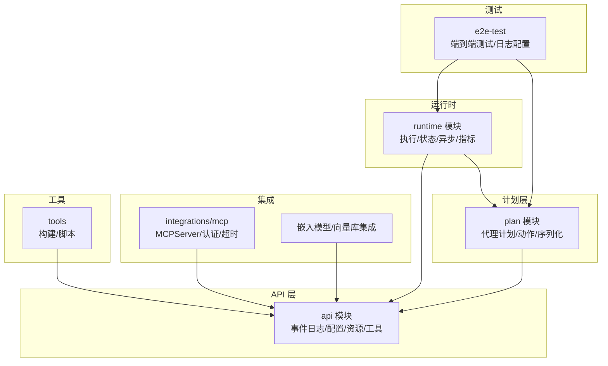
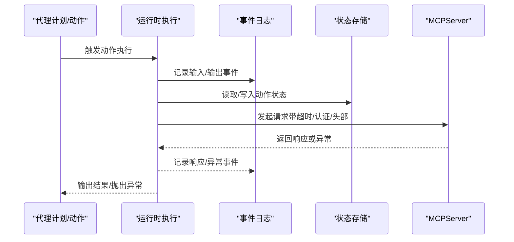
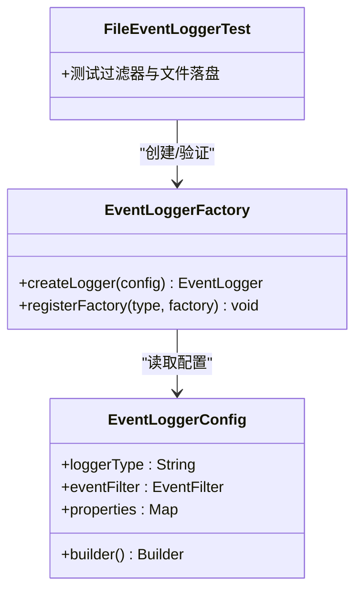
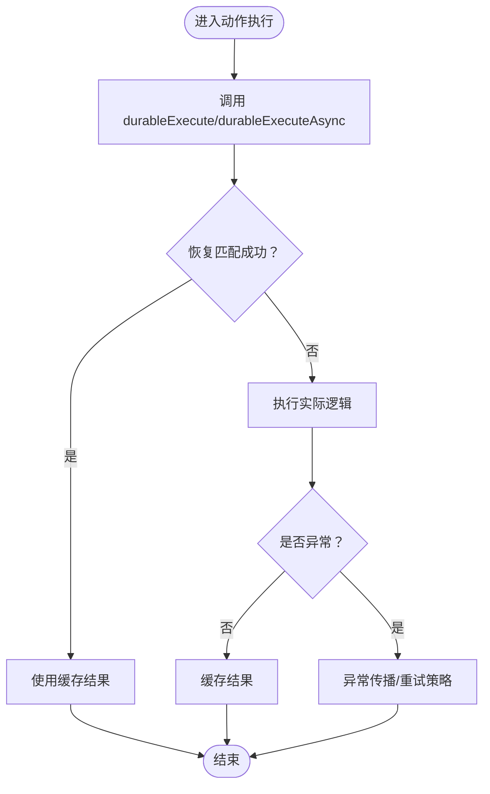
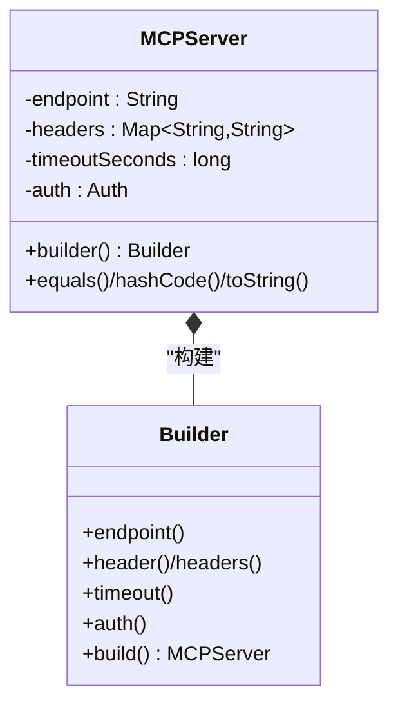
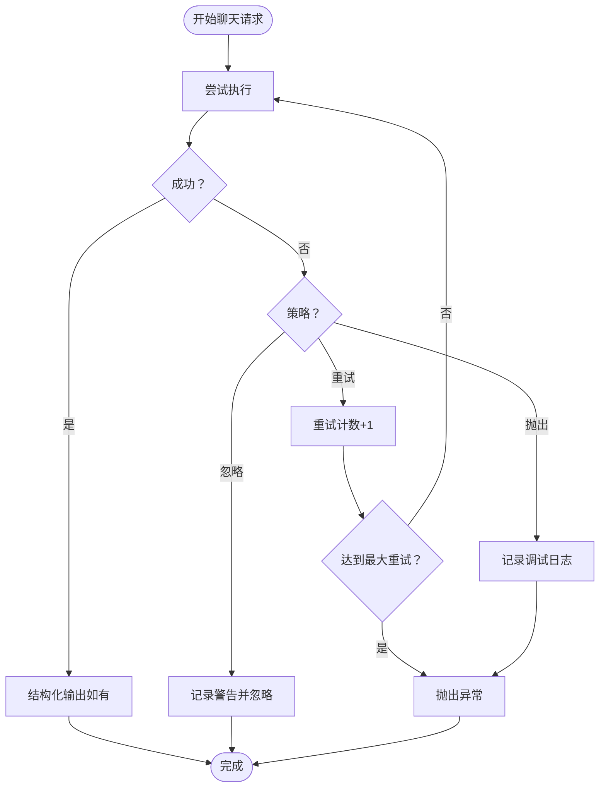
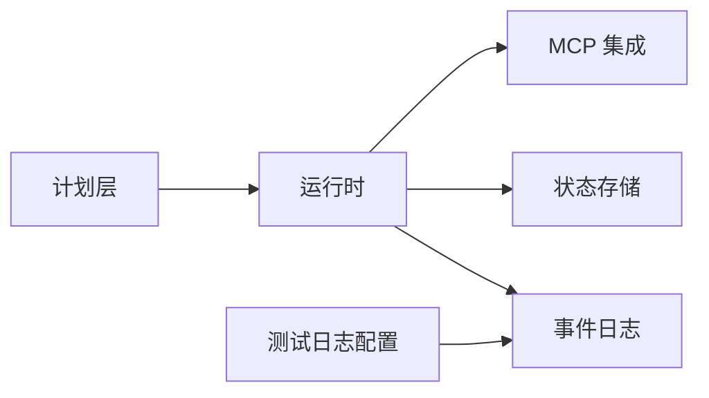
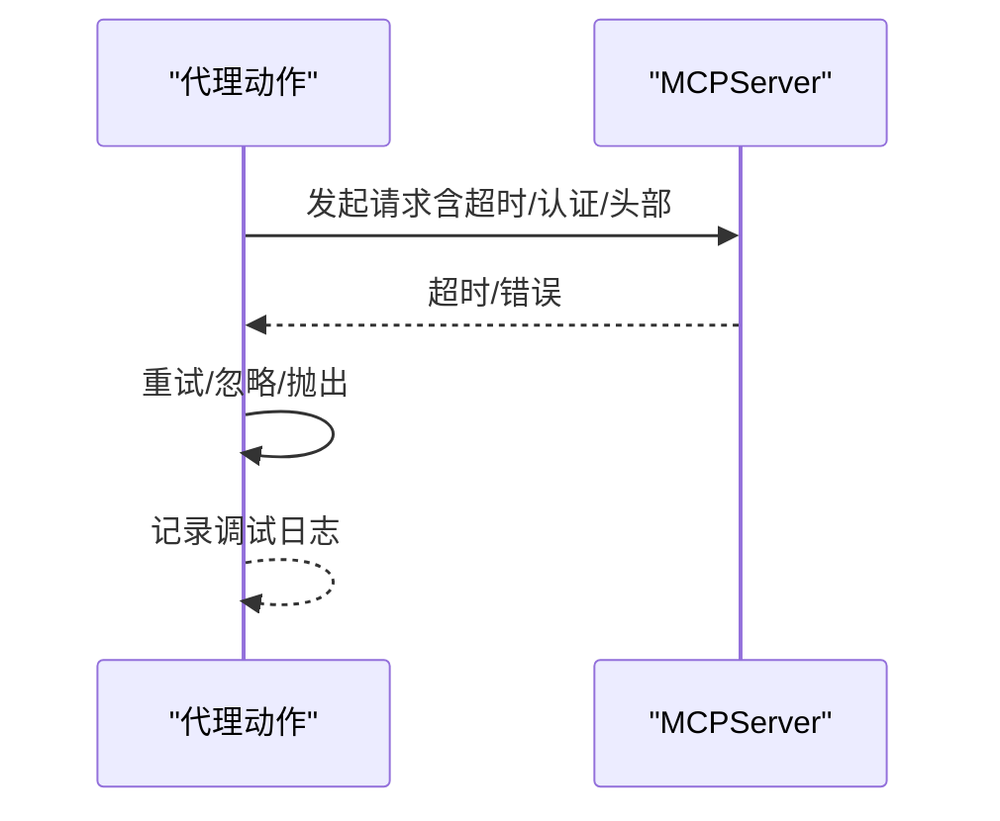

# 故障排除

<cite>
**本文引用的文件**
- [README.md](file://README.md)
- [pom.xml](file://pom.xml)
- [log4j2-test.properties（运行时测试）](file://runtime/src/test/resources/log4j2-test.properties)
- [log4j2-test.properties（集成测试）](file://e2e-test/flink-agents-end-to-end-tests-integration/src/test/resources/log4j2-test.properties)
- [事件日志工厂](file://api/src/main/java/org/apache/flink/agents/api/logger/EventLoggerFactory.java)
- [事件日志配置](file://api/src/main/java/org/apache/flink/agents/api/logger/EventLoggerConfig.java)
- [事件日志文件实现（测试）](file://runtime/src/test/java/org/apache/flink/agents/runtime/eventlog/FileEventLoggerTest.java)
- [MCPServer](file://integrations/mcp/src/main/java/org/apache/flink/agents/integrations/mcp/MCPServer.java)
- [MCPServer 测试](file://integrations/mcp/src/test/java/org/apache/flink/agents/integrations/mcp/MCPServerTest.java)
- [持久化调用接口](file://api/src/main/java/org/apache/flink/agents/api/context/DurableCallable.java)
- [动作执行算子测试（异常与恢复）](file://runtime/src/test/java/org/apache/flink/agents/runtime/operator/ActionExecutionOperatorTest.java)
- [聊天模型动作（重试与错误处理）](file://plan/src/main/java/org/apache/flink/agents/plan/actions/ChatModelAction.java)
- [长短期记忆基类](file://api/src/main/java/org/apache/flink/agents/api/memory/BaseLongTermMemory.java)
- [RunnerContext 实现（恢复匹配）](file://runtime/src/main/java/org/apache/flink/agents/runtime/context/RunnerContextImpl.java)
- [Ollama 启动脚本](file://tools/start_ollama_server.sh)
</cite>

## 目录
1. [简介](#简介)
2. [项目结构](#项目结构)
3. [核心组件](#核心组件)
4. [架构总览](#架构总览)
5. [详细组件分析](#详细组件分析)
6. [依赖分析](#依赖分析)
7. [性能考虑](#性能考虑)
8. [故障排除指南](#故障排除指南)
9. [结论](#结论)
10. [附录](#附录)

## 简介
本文件面向运维工程师，提供 Apache Flink Agents 的系统化故障排除指南。内容覆盖启动失败、连接超时、内存溢出、性能下降等常见问题的诊断与修复；说明日志分析技巧（错误日志解读、调试日志启用、日志过滤）；介绍问题定位工具与方法（调试命令、性能分析、网络诊断）；阐述系统恢复策略（数据恢复、服务重启、配置回滚）；给出紧急响应流程（故障报告、影响评估、快速修复）；并提供预防性维护建议与最佳实践。

## 项目结构
Flink Agents 采用多模块结构，核心模块包括：
- api：对外 API、事件日志、配置、资源与工具定义
- plan：代理计划序列化/反序列化、动作与资源提供器
- runtime：运行时执行、状态存储、异步执行、事件日志、指标
- integrations：第三方集成（如 MCP、嵌入模型、向量库）
- e2e-test：端到端测试与测试资源配置
- tools：构建与辅助脚本

**图表来源**
- [pom.xml](file://pom.xml#L58-L67)

**章节来源**
- [pom.xml](file://pom.xml#L58-L67)

## 核心组件
- 事件日志系统：支持按类型创建日志记录器、可配置过滤器与属性，便于问题定位与审计
- 运行时执行与恢复：基于持久化调用与状态存储，支持重试、异常传播与恢复匹配
- 集成组件（MCP）：支持超时、认证与请求头配置，便于网络连接问题排查
- 配置与序列化：统一配置读写接口与 JSON 序列化，便于参数校验与回滚

**章节来源**
- [事件日志工厂](file://api/src/main/java/org/apache/flink/agents/api/logger/EventLoggerFactory.java#L92-L153)
- [事件日志配置](file://api/src/main/java/org/apache/flink/agents/api/logger/EventLoggerConfig.java#L144-L149)
- [持久化调用接口](file://api/src/main/java/org/apache/flink/agents/api/context/DurableCallable.java#L29-L50)
- [MCPServer](file://integrations/mcp/src/main/java/org/apache/flink/agents/integrations/mcp/MCPServer.java#L88-L133)

## 架构总览
下图展示从代理计划到运行时执行、再到外部集成的关键交互路径，以及日志与状态存储在故障排查中的作用。

**图表来源**
- [聊天模型动作（重试与错误处理）](file://plan/src/main/java/org/apache/flink/agents/plan/actions/ChatModelAction.java#L236-L270)
- [MCPServer](file://integrations/mcp/src/main/java/org/apache/flink/agents/integrations/mcp/MCPServer.java#L88-L133)
- [事件日志工厂](file://api/src/main/java/org/apache/flink/agents/api/logger/EventLoggerFactory.java#L92-L153)

## 详细组件分析

### 事件日志系统
- 工厂模式创建不同类型的日志记录器（默认文件），支持注册自定义工厂
- 配置项包含日志类型、事件过滤器与属性映射，便于按需裁剪日志
- 测试用例验证过滤器生效与文件落盘

**图表来源**
- [事件日志工厂](file://api/src/main/java/org/apache/flink/agents/api/logger/EventLoggerFactory.java#L92-L153)
- [事件日志配置](file://api/src/main/java/org/apache/flink/agents/api/logger/EventLoggerConfig.java#L144-L149)
- [事件日志文件实现（测试）](file://runtime/src/test/java/org/apache/flink/agents/runtime/eventlog/FileEventLoggerTest.java#L437-L464)

**章节来源**
- [事件日志工厂](file://api/src/main/java/org/apache/flink/agents/api/logger/EventLoggerFactory.java#L92-L153)
- [事件日志配置](file://api/src/main/java/org/apache/flink/agents/api/logger/EventLoggerConfig.java#L144-L149)
- [事件日志文件实现（测试）](file://runtime/src/test/java/org/apache/flink/agents/runtime/eventlog/FileEventLoggerTest.java#L437-L464)

### 运行时执行与恢复
- 持久化调用接口要求稳定标识与结果类，确保恢复时可匹配缓存结果
- 动作执行测试模拟同步/异步异常，验证异常传播与不重复执行
- RunnerContext 实现支持恢复时的调用结果匹配与清理

**图表来源**
- [持久化调用接口](file://api/src/main/java/org/apache/flink/agents/api/context/DurableCallable.java#L29-L50)
- [动作执行算子测试（异常与恢复）](file://runtime/src/test/java/org/apache/flink/agents/runtime/operator/ActionExecutionOperatorTest.java#L1359-L1411)
- [RunnerContext 实现（恢复匹配）](file://runtime/src/main/java/org/apache/flink/agents/runtime/context/RunnerContextImpl.java#L512-L526)

**章节来源**
- [持久化调用接口](file://api/src/main/java/org/apache/flink/agents/api/context/DurableCallable.java#L29-L50)
- [动作执行算子测试（异常与恢复）](file://runtime/src/test/java/org/apache/flink/agents/runtime/operator/ActionExecutionOperatorTest.java#L1359-L1411)
- [RunnerContext 实现（恢复匹配）](file://runtime/src/main/java/org/apache/flink/agents/runtime/context/RunnerContextImpl.java#L512-L526)

### 集成组件（MCP）
- 支持设置端点、请求头、超时与认证方式（Bearer/Basic/API Key）
- 提供 equals/hashCode/toString 便于调试与日志输出
- 测试覆盖端点校验、序列化/反序列化与资源类型

**图表来源**
- [MCPServer](file://integrations/mcp/src/main/java/org/apache/flink/agents/integrations/mcp/MCPServer.java#L88-L133)
- [MCPServer 测试](file://integrations/mcp/src/test/java/org/apache/flink/agents/integrations/mcp/MCPServerTest.java#L139-L174)

**章节来源**
- [MCPServer](file://integrations/mcp/src/main/java/org/apache/flink/agents/integrations/mcp/MCPServer.java#L88-L133)
- [MCPServer 测试](file://integrations/mcp/src/test/java/org/apache/flink/agents/integrations/mcp/MCPServerTest.java#L139-L174)

### 聊天模型动作（重试与错误处理）
- 支持同步/异步调用，内置重试与错误处理策略（忽略/重试/抛出）
- 失败时记录警告与调试日志，便于定位输入消息与请求 ID

**图表来源**
- [聊天模型动作（重试与错误处理）](file://plan/src/main/java/org/apache/flink/agents/plan/actions/ChatModelAction.java#L236-L270)

**章节来源**
- [聊天模型动作（重试与错误处理）](file://plan/src/main/java/org/apache/flink/agents/plan/actions/ChatModelAction.java#L236-L270)

## 依赖分析
- 日志系统：通过工厂创建日志记录器，支持文件与扩展类型
- 执行链路：动作由计划层定义，运行时负责执行、状态存储与事件日志
- 外部集成：MCP 组件提供统一的端点、超时与认证配置
- 测试配置：测试环境使用 Log4j2 控制台输出，便于本地调试

**图表来源**
- [事件日志工厂](file://api/src/main/java/org/apache/flink/agents/api/logger/EventLoggerFactory.java#L92-L153)
- [log4j2-test.properties（运行时测试）](file://runtime/src/test/resources/log4j2-test.properties#L19-L28)
- [log4j2-test.properties（集成测试）](file://e2e-test/flink-agents-end-to-end-tests-integration/src/test/resources/log4j2-test.properties#L19-L28)

**章节来源**
- [事件日志工厂](file://api/src/main/java/org/apache/flink/agents/api/logger/EventLoggerFactory.java#L92-L153)
- [log4j2-test.properties（运行时测试）](file://runtime/src/test/resources/log4j2-test.properties#L19-L28)
- [log4j2-test.properties（集成测试）](file://e2e-test/flink-agents-end-to-end-tests-integration/src/test/resources/log4j2-test.properties#L19-L28)

## 性能考虑
- 异步执行与持久化调用：减少阻塞，提升吞吐，但需关注异常传播与重复执行防护
- 日志级别与过滤：生产环境建议使用较低级别以避免 I/O 压力，必要时启用过滤器
- 超时与重试：合理设置 MCP 超时与动作重试次数，避免雪崩效应
- 内存管理：长短期记忆容量与压缩配置影响内存占用，需结合业务规模调优

[本节为通用指导，无需具体文件分析]

## 故障排除指南

### 启动失败
- 症状：进程无法启动、退出码非零、无日志输出
- 排查步骤
  - 检查构建产物与依赖版本一致性（参考根 POM 的模块与版本）
  - 确认测试日志配置未将根日志级别设为关闭，必要时临时调整为 INFO
  - 使用社区提供的 Slack 通道寻求帮助与确认环境
- 修复建议
  - 清理构建缓存后重新构建
  - 对照 README 的构建前置条件（Java、Python、Maven）

**章节来源**
- [pom.xml](file://pom.xml#L58-L67)
- [log4j2-test.properties（运行时测试）](file://runtime/src/test/resources/log4j2-test.properties#L19-L28)
- [README.md](file://README.md#L36-L44)

### 连接超时
- 症状：MCP 请求或外部模型调用超时、重试后仍失败
- 排查步骤
  - 检查 MCPServer 的端点、超时与认证配置
  - 在测试中验证端点合法性与序列化/反序列化行为
  - 结合聊天模型动作的重试策略与日志，定位失败阶段
- 修复建议
  - 调整超时时间与重试次数
  - 校验网络连通性与代理/防火墙策略
  - 如使用本地模型（如 Ollama），参考启动脚本进行安装与启动

**图表来源**
- [MCPServer](file://integrations/mcp/src/main/java/org/apache/flink/agents/integrations/mcp/MCPServer.java#L88-L133)
- [聊天模型动作（重试与错误处理）](file://plan/src/main/java/org/apache/flink/agents/plan/actions/ChatModelAction.java#L236-L270)

**章节来源**
- [MCPServer](file://integrations/mcp/src/main/java/org/apache/flink/agents/integrations/mcp/MCPServer.java#L88-L133)
- [MCPServer 测试](file://integrations/mcp/src/test/java/org/apache/flink/agents/integrations/mcp/MCPServerTest.java#L139-L174)
- [聊天模型动作（重试与错误处理）](file://plan/src/main/java/org/apache/flink/agents/plan/actions/ChatModelAction.java#L236-L270)
- [Ollama 启动脚本](file://tools/start_ollama_server.sh#L19-L28)

### 内存溢出
- 症状：堆外/堆内内存持续增长、GC 抖动、OOM
- 排查步骤
  - 关注长短期记忆容量与压缩配置，检查是否超出限制
  - 审核动作中大对象的构造与缓存策略
  - 结合运行时指标与事件日志定位热点操作
- 修复建议
  - 降低记忆集容量或优化压缩策略
  - 分批处理与流式消费，避免一次性加载过多数据
  - 调整 JVM 参数与 GC 策略（在受控环境中验证）

**章节来源**
- [长短期记忆基类](file://api/src/main/java/org/apache/flink/agents/api/memory/BaseLongTermMemory.java#L33-L133)

### 性能下降
- 症状：吞吐降低、延迟升高、CPU/IO 压力增大
- 排查步骤
  - 检查异步执行与持久化调用的使用情况，避免不必要的阻塞
  - 审视日志级别与过滤器，避免高频写入
  - 校验外部集成（MCP/模型）的超时与重试配置
- 修复建议
  - 优化动作逻辑与批处理大小
  - 合理设置超时与重试上限，防止级联等待
  - 引入性能剖析工具（如火焰图）定位热点

**章节来源**
- [聊天模型动作（重试与错误处理）](file://plan/src/main/java/org/apache/flink/agents/plan/actions/ChatModelAction.java#L236-L270)

### 日志分析技巧
- 错误日志解读
  - 关注聊天模型动作中的重试与错误处理日志，识别输入消息与请求 ID
  - 利用事件日志工厂创建的记录器，区分不同事件类型
- 调试日志启用
  - 在测试配置中临时提高日志级别，观察执行路径与异常传播
- 日志过滤
  - 使用事件过滤器仅保留关键事件，减少噪声

**章节来源**
- [聊天模型动作（重试与错误处理）](file://plan/src/main/java/org/apache/flink/agents/plan/actions/ChatModelAction.java#L236-L270)
- [事件日志工厂](file://api/src/main/java/org/apache/flink/agents/api/logger/EventLoggerFactory.java#L92-L153)
- [log4j2-test.properties（运行时测试）](file://runtime/src/test/resources/log4j2-test.properties#L19-L28)
- [log4j2-test.properties（集成测试）](file://e2e-test/flink-agents-end-to-end-tests-integration/src/test/resources/log4j2-test.properties#L19-L28)

### 问题定位工具与方法
- 调试命令
  - 使用测试脚本与日志配置快速复现问题
- 性能分析
  - 结合运行时指标与事件日志，定位瓶颈
- 网络诊断
  - 校验 MCPServer 的端点、超时与认证
  - 使用本地模型（如 Ollama）进行隔离测试

**章节来源**
- [MCPServer](file://integrations/mcp/src/main/java/org/apache/flink/agents/integrations/mcp/MCPServer.java#L88-L133)
- [Ollama 启动脚本](file://tools/start_ollama_server.sh#L19-L28)

### 系统恢复策略
- 数据恢复
  - 基于持久化调用的稳定标识与结果类，利用状态存储进行恢复匹配
- 服务重启
  - 在不影响正在执行动作的前提下，优先滚动重启以降低风险
- 配置回滚
  - 使用统一配置接口读取与回退，确保参数一致性

**章节来源**
- [持久化调用接口](file://api/src/main/java/org/apache/flink/agents/api/context/DurableCallable.java#L29-L50)
- [RunnerContext 实现（恢复匹配）](file://runtime/src/main/java/org/apache/flink/agents/runtime/context/RunnerContextImpl.java#L512-L526)

### 紧急响应流程
- 故障报告
  - 在社区 Slack 中报告，附上日志片段与复现步骤
- 影响评估
  - 评估作业暂停范围、数据积压与 SLA 影响
- 快速修复
  - 临时放宽超时/重试，或切换到备用模型/端点
  - 回滚可疑配置变更

**章节来源**
- [README.md](file://README.md#L36-L44)

### 预防性维护与最佳实践
- 版本与依赖管理：遵循根 POM 的版本约束与模块划分
- 日志策略：生产环境使用过滤器与合适级别，避免过度 I/O
- 超时与重试：为外部集成设置合理的超时与重试上限
- 内存与容量：定期审查长短期记忆容量与压缩策略
- 变更控制：所有配置变更走发布流程，保留可回滚版本

**章节来源**
- [pom.xml](file://pom.xml#L44-L56)

## 结论
通过事件日志、运行时恢复机制与外部集成配置的协同，Flink Agents 能够在复杂场景下提供可观测性与稳定性。本指南提供了从启动、连接、内存到性能的全链路排障方法，并配套恢复策略与预防措施，帮助运维团队快速定位与解决问题。

## 附录
- 社区与支持：Slack 用户与开发频道，每周同步会议
- 构建与环境：参考 README 的构建前置条件与脚本

**章节来源**
- [README.md](file://README.md#L36-L44)