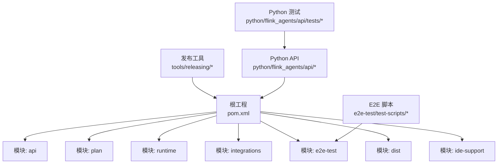
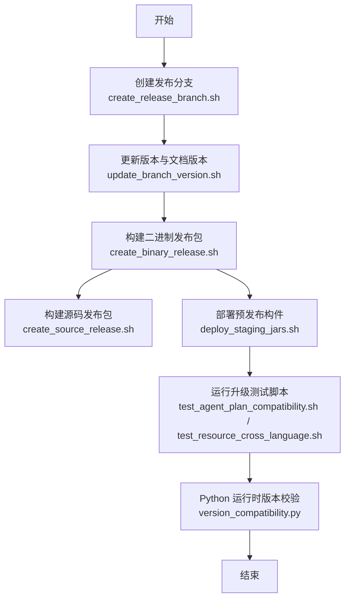
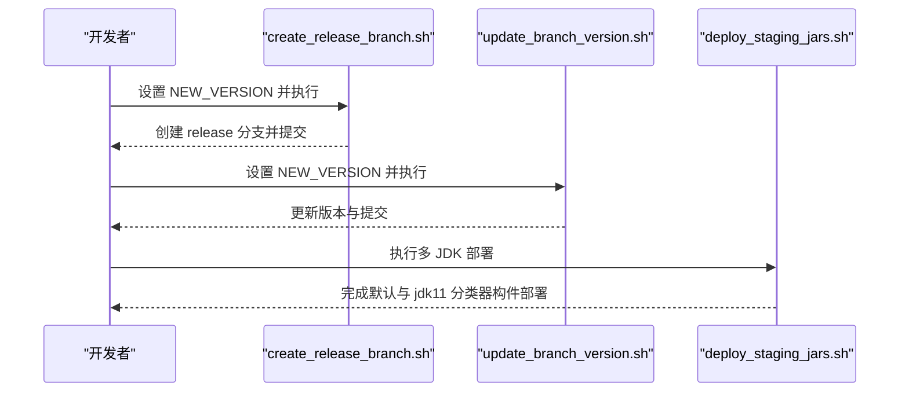
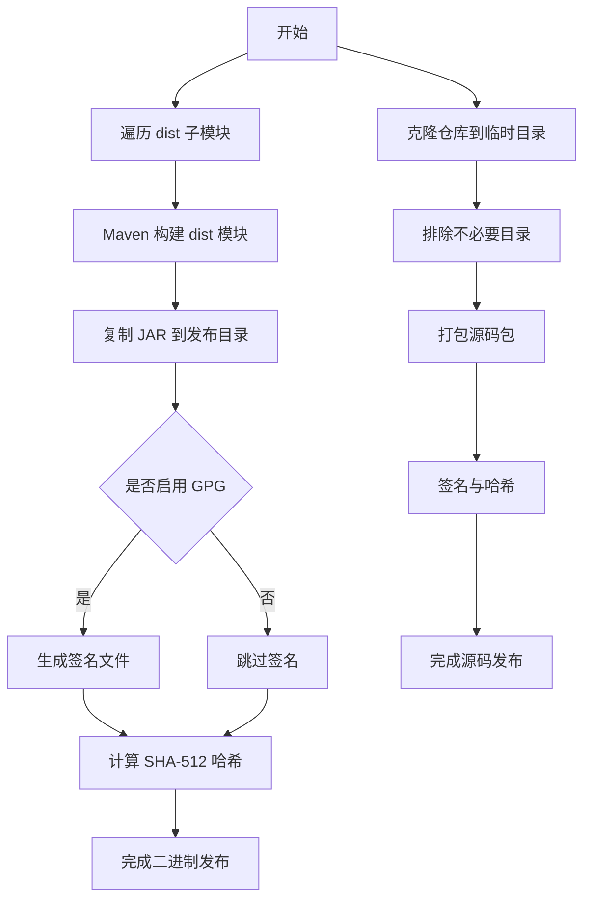
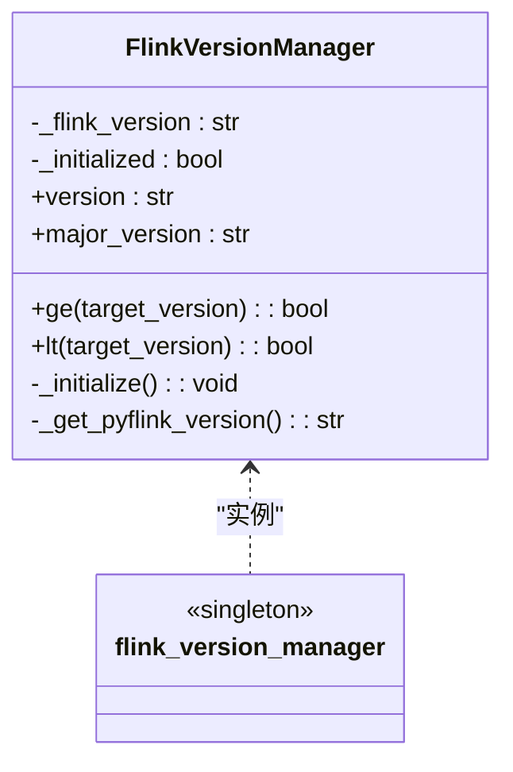
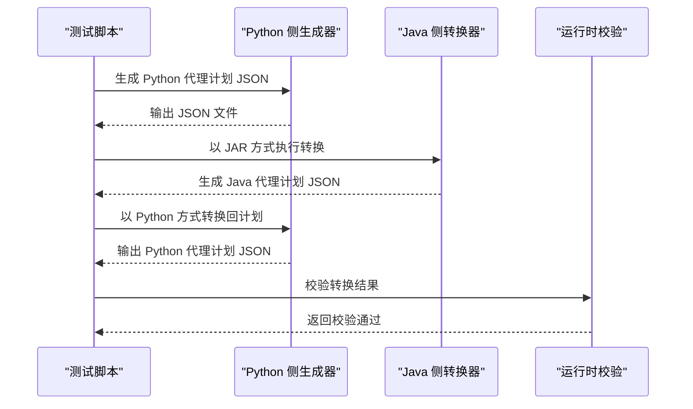
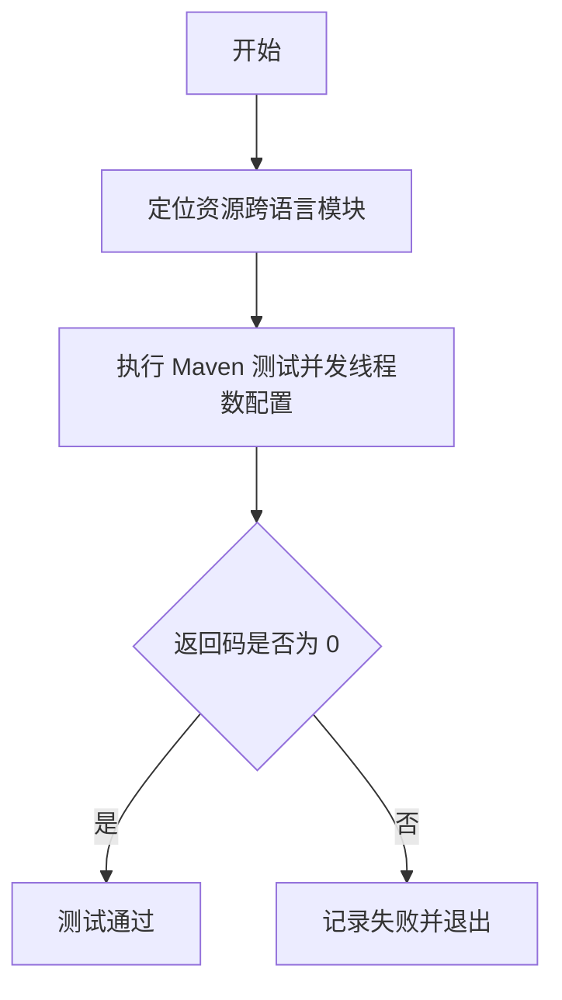
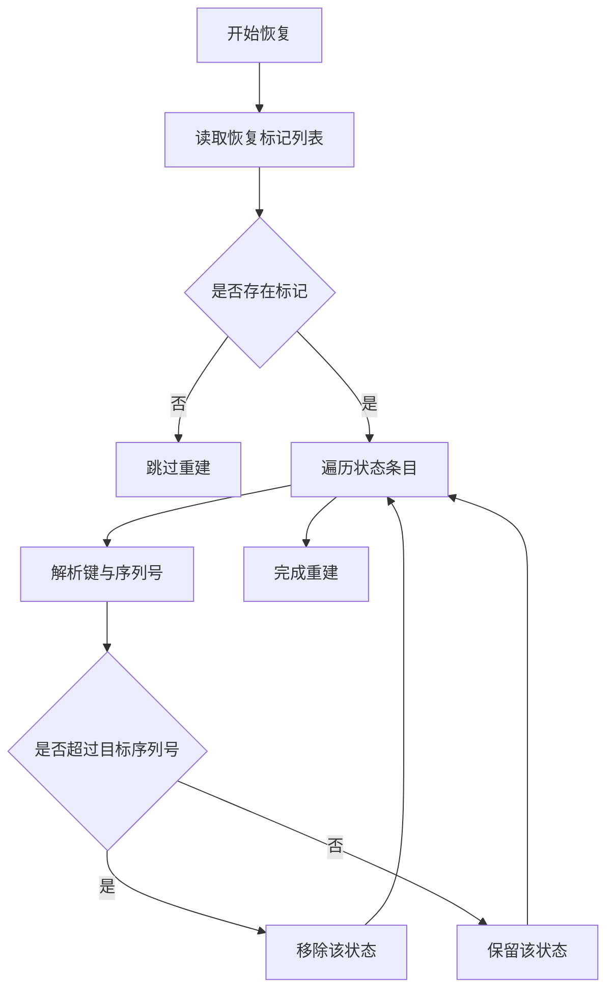
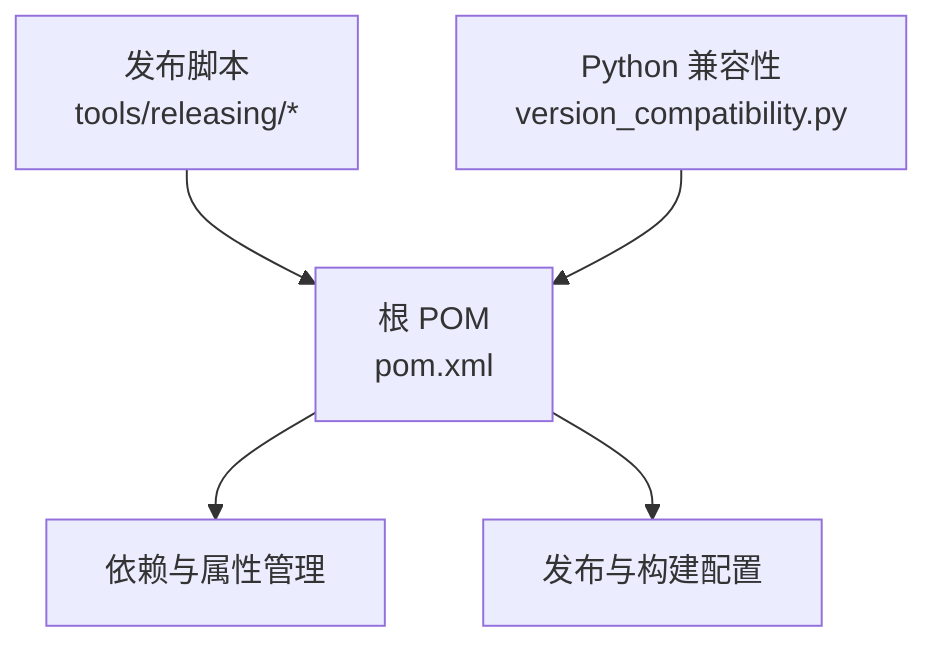

# 版本升级

<cite>
**本文引用的文件**
- [README.md](file://README.md)
- [pom.xml](file://pom.xml)
- [tools/releasing/create_release_branch.sh](file://tools/releasing/create_release_branch.sh)
- [tools/releasing/create_binary_release.sh](file://tools/releasing/create_binary_release.sh)
- [tools/releasing/create_source_release.sh](file://tools/releasing/create_source_release.sh)
- [tools/releasing/update_branch_version.sh](file://tools/releasing/update_branch_version.sh)
- [tools/releasing/deploy_staging_jars.sh](file://tools/releasing/deploy_staging_jars.sh)
- [python/flink_agents/api/version_compatibility.py](file://python/flink_agents/api/version_compatibility.py)
- [python/flink_agents/api/tests/test_version_compatibility.py](file://python/flink_agents/api/tests/test_version_compatibility.py)
- [e2e-test/test-scripts/test_agent_plan_compatibility.sh](file://e2e-test/test-scripts/test_agent_plan_compatibility.sh)
- [e2e-test/test-scripts/test_resource_cross_language.sh](file://e2e-test/test-scripts/test_resource_cross_language.sh)
- [runtime/src/main/java/org/apache/flink/agents/runtime/actionstate/ActionStateStore.java](file://runtime/src/main/java/org/apache/flink/agents/runtime/actionstate/ActionStateStore.java)
- [runtime/src/main/java/org/apache/flink/agents/runtime/actionstate/KafkaActionStateStore.java](file://runtime/src/main/java/org/apache/flink/agents/runtime/actionstate/KafkaActionStateStore.java)
- [runtime/src/main/java/org/apache/flink/agents/runtime/context/RunnerContextImpl.java](file://runtime/src/main/java/org/apache/flink/agents/runtime/context/RunnerContextImpl.java)
- [runtime/src/test/java/org/apache/flink/agents/runtime/RescalingTest.java](file://runtime/src/test/java/org/apache/flink/agents/runtime/RescalingTest.java)
- [api/src/main/java/org/apache/flink/agents/api/vectorstores/CollectionManageableVectorStore.java](file://api/src/main/java/org/apache/flink/agents/api/vectorstores/CollectionManageableVectorStore.java)
</cite>

## 目录
1. [简介](#简介)
2. [项目结构](#项目结构)
3. [核心组件](#核心组件)
4. [架构总览](#架构总览)
5. [详细组件分析](#详细组件分析)
6. [依赖关系分析](#依赖关系分析)
7. [性能考量](#性能考量)
8. [故障排查指南](#故障排查指南)
9. [结论](#结论)
10. [附录](#附录)

## 简介
本文件面向运维团队，提供 Apache Flink Agents 的版本升级指导，覆盖升级前准备、升级流程、回滚策略、向后兼容性、注意事项与升级测试验证等关键环节。文档基于仓库中的构建与发布脚本、版本兼容性工具以及端到端测试脚本进行梳理，确保升级过程安全可靠。

## 项目结构
仓库采用多模块聚合工程组织，核心模块包括 API、计划（plan）、运行时（runtime）、集成（integrations）、端到端测试（e2e-test）与打包分发（dist）。根 POM 统一管理版本与依赖，发布工具位于 tools/releasing 下，Python 端提供版本兼容性工具与测试用例。

图表来源
- [pom.xml](file://pom.xml#L58-L67)
- [tools/releasing/create_binary_release.sh](file://tools/releasing/create_binary_release.sh#L64-L73)
- [python/flink_agents/api/version_compatibility.py](file://python/flink_agents/api/version_compatibility.py#L1-L171)
- [e2e-test/test-scripts/test_agent_plan_compatibility.sh](file://e2e-test/test-scripts/test_agent_plan_compatibility.sh#L34-L74)

章节来源
- [pom.xml](file://pom.xml#L58-L67)
- [README.md](file://README.md#L1-L44)

## 核心组件
- 发布与版本管理：通过 release 分支与版本更新脚本维护多语言版本一致性，并生成二进制与源码发布包。
- 版本兼容性：Python 端提供 FlinkVersionManager，用于在运行时检测与比较 Flink 版本，保障跨语言资源与功能的兼容性。
- 升级测试：提供代理计划跨语言兼容性与资源跨语言连通性测试脚本，确保升级前后行为一致。

章节来源
- [tools/releasing/create_release_branch.sh](file://tools/releasing/create_release_branch.sh#L47-L71)
- [tools/releasing/update_branch_version.sh](file://tools/releasing/update_branch_version.sh#L46-L59)
- [python/flink_agents/api/version_compatibility.py](file://python/flink_agents/api/version_compatibility.py#L56-L167)
- [e2e-test/test-scripts/test_agent_plan_compatibility.sh](file://e2e-test/test-scripts/test_agent_plan_compatibility.sh#L36-L74)
- [e2e-test/test-scripts/test_resource_cross_language.sh](file://e2e-test/test-scripts/test_resource_cross_language.sh#L29-L39)

## 架构总览
下图展示从“版本分支创建”到“二进制与源码发布”的关键步骤，以及 Python 端版本兼容性工具在运行时的作用。

图表来源
- [tools/releasing/create_release_branch.sh](file://tools/releasing/create_release_branch.sh#L47-L71)
- [tools/releasing/update_branch_version.sh](file://tools/releasing/update_branch_version.sh#L46-L59)
- [tools/releasing/create_binary_release.sh](file://tools/releasing/create_binary_release.sh#L58-L94)
- [tools/releasing/create_source_release.sh](file://tools/releasing/create_source_release.sh#L56-L79)
- [tools/releasing/deploy_staging_jars.sh](file://tools/releasing/deploy_staging_jars.sh#L52-L72)
- [e2e-test/test-scripts/test_agent_plan_compatibility.sh](file://e2e-test/test-scripts/test_agent_plan_compatibility.sh#L36-L74)
- [e2e-test/test-scripts/test_resource_cross_language.sh](file://e2e-test/test-scripts/test_resource_cross_language.sh#L29-L39)
- [python/flink_agents/api/version_compatibility.py](file://python/flink_agents/api/version_compatibility.py#L56-L167)

## 详细组件分析

### 组件A：版本分支与版本更新流程
- 发布分支创建：根据新版本号创建 release 分支，更新所有 pom 与文档版本，并提交。
- 版本更新：统一更新 Java 与 Python 版本，清理 SNAPSHOT 后缀以便后续发布。
- 预发布部署：按 JDK 17 默认与 JDK 11 分类器分别部署构件，便于多 JDK 兼容。

图表来源
- [tools/releasing/create_release_branch.sh](file://tools/releasing/create_release_branch.sh#L47-L71)
- [tools/releasing/update_branch_version.sh](file://tools/releasing/update_branch_version.sh#L46-L59)
- [tools/releasing/deploy_staging_jars.sh](file://tools/releasing/deploy_staging_jars.sh#L52-L72)

章节来源
- [tools/releasing/create_release_branch.sh](file://tools/releasing/create_release_branch.sh#L26-L71)
- [tools/releasing/update_branch_version.sh](file://tools/releasing/update_branch_version.sh#L25-L59)
- [tools/releasing/deploy_staging_jars.sh](file://tools/releasing/deploy_staging_jars.sh#L49-L72)

### 组件B：二进制与源码发布流程
- 二进制发布：遍历 dist 子模块构建产物，复制并签名、计算哈希，形成可分发的 JAR 包。
- 源码发布：临时克隆仓库，排除无关目录，打包生成源码包并签名与哈希。

图表来源
- [tools/releasing/create_binary_release.sh](file://tools/releasing/create_binary_release.sh#L58-L94)
- [tools/releasing/create_source_release.sh](file://tools/releasing/create_source_release.sh#L60-L79)

章节来源
- [tools/releasing/create_binary_release.sh](file://tools/releasing/create_binary_release.sh#L58-L94)
- [tools/releasing/create_source_release.sh](file://tools/releasing/create_source_release.sh#L60-L79)

### 组件C：Python 版本兼容性工具
- 功能：解析并标准化版本字符串，缓存已查询的版本，提供大于等于/小于比较接口；支持处理 SNAPSHOT、rc、dev 等后缀。
- 使用场景：在运行时检测当前安装的 Flink 版本，决定是否启用特定功能或降级路径。

图表来源
- [python/flink_agents/api/version_compatibility.py](file://python/flink_agents/api/version_compatibility.py#L56-L167)

章节来源
- [python/flink_agents/api/version_compatibility.py](file://python/flink_agents/api/version_compatibility.py#L22-L53)
- [python/flink_agents/api/version_compatibility.py](file://python/flink_agents/api/version_compatibility.py#L76-L88)
- [python/flink_agents/api/version_compatibility.py](file://python/flink_agents/api/version_compatibility.py#L137-L166)
- [python/flink_agents/api/tests/test_version_compatibility.py](file://python/flink_agents/api/tests/test_version_compatibility.py#L26-L169)

### 组件D：代理计划跨语言兼容性测试
- 目标：验证 Java 与 Python 之间的代理计划 JSON 可互转且语义一致。
- 流程：生成 JSON → Java 侧转换 → Python 侧转换 → 校验通过。

图表来源
- [e2e-test/test-scripts/test_agent_plan_compatibility.sh](file://e2e-test/test-scripts/test_agent_plan_compatibility.sh#L36-L74)

章节来源
- [e2e-test/test-scripts/test_agent_plan_compatibility.sh](file://e2e-test/test-scripts/test_agent_plan_compatibility.sh#L36-L74)

### 组件E：资源跨语言连通性测试
- 目标：验证 Java 与 Python 资源（如聊天模型、嵌入模型、向量库）在端到端场景下的互通性。
- 流程：通过 Maven 执行资源跨语言模块的全部测试，确保升级后资源交互正常。

图表来源
- [e2e-test/test-scripts/test_resource_cross_language.sh](file://e2e-test/test-scripts/test_resource_cross_language.sh#L29-L39)

章节来源
- [e2e-test/test-scripts/test_resource_cross_language.sh](file://e2e-test/test-scripts/test_resource_cross_language.sh#L29-L39)

### 组件F：状态恢复与回滚相关机制
- 行为：运行时上下文在恢复过程中匹配调用结果或清理后续结果，避免不一致；状态存储支持重建与修剪，保证升级后的状态一致性。
- 关键点：当检测到分叉或序列号不一致时，清理更高序列号的状态，确保回放正确。

图表来源
- [runtime/src/main/java/org/apache/flink/agents/runtime/actionstate/KafkaActionStateStore.java](file://runtime/src/main/java/org/apache/flink/agents/runtime/actionstate/KafkaActionStateStore.java#L161-L199)
- [runtime/src/main/java/org/apache/flink/agents/runtime/context/RunnerContextImpl.java](file://runtime/src/main/java/org/apache/flink/agents/runtime/context/RunnerContextImpl.java#L516-L526)
- [runtime/src/main/java/org/apache/flink/agents/runtime/actionstate/ActionStateStore.java](file://runtime/src/main/java/org/apache/flink/agents/runtime/actionstate/ActionStateStore.java#L69-L92)

章节来源
- [runtime/src/main/java/org/apache/flink/agents/runtime/actionstate/KafkaActionStateStore.java](file://runtime/src/main/java/org/apache/flink/agents/runtime/actionstate/KafkaActionStateStore.java#L161-L199)
- [runtime/src/main/java/org/apache/flink/agents/runtime/context/RunnerContextImpl.java](file://runtime/src/main/java/org/apache/flink/agents/runtime/context/RunnerContextImpl.java#L516-L526)
- [runtime/src/main/java/org/apache/flink/agents/runtime/actionstate/ActionStateStore.java](file://runtime/src/main/java/org/apache/flink/agents/runtime/actionstate/ActionStateStore.java#L69-L92)

## 依赖关系分析
- 版本与依赖：根 POM 统一管理 Flink 版本、Jackson、JUnit、Mockito 等依赖，确保模块间版本一致。
- 多 JDK 支持：通过 profiles 控制 Java 版本与 Spotless 插件行为，发布阶段区分 JDK 17 默认与 JDK 11 分类器构件。
- 发布工具链：发布脚本与 Maven 插件协同工作，生成二进制与源码包，并进行签名与哈希校验。

图表来源
- [pom.xml](file://pom.xml#L37-L56)
- [pom.xml](file://pom.xml#L109-L131)
- [tools/releasing/create_binary_release.sh](file://tools/releasing/create_binary_release.sh#L75-L76)
- [python/flink_agents/api/version_compatibility.py](file://python/flink_agents/api/version_compatibility.py#L1-L171)

章节来源
- [pom.xml](file://pom.xml#L37-L56)
- [pom.xml](file://pom.xml#L109-L131)
- [tools/releasing/create_binary_release.sh](file://tools/releasing/create_binary_release.sh#L75-L76)

## 性能考量
- 构建与测试：使用 Maven 并行线程参数提升测试效率；运行时指标组提供直方图与计量器，便于监控吞吐与延迟。
- 状态恢复：状态重建与修剪逻辑避免冗余状态，减少内存占用并提高恢复速度。

章节来源
- [e2e-test/test-scripts/test_resource_cross_language.sh](file://e2e-test/test-scripts/test_resource_cross_language.sh#L33)
- [runtime/src/main/java/org/apache/flink/agents/runtime/metrics/FlinkAgentsMetricGroupImpl.java](file://runtime/src/main/java/org/apache/flink/agents/runtime/metrics/FlinkAgentsMetricGroupImpl.java#L90-L103)

## 故障排查指南
- 版本分支创建失败：确认在 tools 目录执行脚本，且设置 NEW_VERSION；检查权限与 Git 状态。
- 预发布部署异常：核对 Java 版本与 Maven 参数，确保已启用 release 与 docs-and-source profile。
- 二进制/源码包缺失：检查 dist 子模块是否包含有效 pom；确认临时克隆与排除规则。
- 回滚验证：若升级后出现状态不一致，检查状态重建日志与清理逻辑，确保序列号与键前缀匹配。

章节来源
- [tools/releasing/create_release_branch.sh](file://tools/releasing/create_release_branch.sh#L37-L41)
- [tools/releasing/deploy_staging_jars.sh](file://tools/releasing/deploy_staging_jars.sh#L52-L72)
- [tools/releasing/create_binary_release.sh](file://tools/releasing/create_binary_release.sh#L75-L94)
- [tools/releasing/create_source_release.sh](file://tools/releasing/create_source_release.sh#L60-L79)
- [runtime/src/main/java/org/apache/flink/agents/runtime/actionstate/KafkaActionStateStore.java](file://runtime/src/main/java/org/apache/flink/agents/runtime/actionstate/KafkaActionStateStore.java#L161-L199)

## 结论
通过规范化的发布脚本、版本兼容性工具与端到端测试，Apache Flink Agents 的版本升级具备清晰的流程与可靠的验证手段。建议在生产环境执行前，先在预生产环境完成分支创建、版本更新、二进制与源码发布、预发布部署与测试验证，最后再进行生产升级与回滚演练，确保升级过程可控、可回退、可验证。

## 附录

### 升级前准备清单
- 环境检查：确认 Java 与 Python 版本满足要求；确保 Maven、Git 可用。
- 数据备份：备份现有配置、状态存储与持久化数据。
- 兼容性验证：运行代理计划跨语言与资源跨语言测试脚本。
- 风险评估：评估升级对运行中作业的影响，制定回滚预案。

章节来源
- [README.md](file://README.md#L9-L28)
- [e2e-test/test-scripts/test_agent_plan_compatibility.sh](file://e2e-test/test-scripts/test_agent_plan_compatibility.sh#L36-L74)
- [e2e-test/test-scripts/test_resource_cross_language.sh](file://e2e-test/test-scripts/test_resource_cross_language.sh#L29-L39)

### 升级流程步骤
- 版本选择：确定目标版本号，参考发布脚本与文档版本配置。
- 升级包下载：从发布制品库获取二进制与源码包，校验签名与哈希。
- 升级执行：在非高峰时段停止服务，替换构件并重启。
- 升级验证：运行测试脚本与功能回归，监控指标与日志。

章节来源
- [tools/releasing/create_release_branch.sh](file://tools/releasing/create_release_branch.sh#L47-L71)
- [tools/releasing/create_binary_release.sh](file://tools/releasing/create_binary_release.sh#L75-L94)
- [tools/releasing/create_source_release.sh](file://tools/releasing/create_source_release.sh#L76-L79)

### 回滚策略
- 回滚准备：保留上一版本的二进制与配置，准备回滚脚本。
- 回滚执行：停止服务，回退构件与配置，启动服务。
- 回滚验证：运行测试脚本，检查状态重建与日志。

章节来源
- [runtime/src/main/java/org/apache/flink/agents/runtime/actionstate/KafkaActionStateStore.java](file://runtime/src/main/java/org/apache/flink/agents/runtime/actionstate/KafkaActionStateStore.java#L161-L199)
- [runtime/src/main/java/org/apache/flink/agents/runtime/context/RunnerContextImpl.java](file://runtime/src/main/java/org/apache/flink/agents/runtime/context/RunnerContextImpl.java#L516-L526)

### 向后兼容性检查
- API 兼容性：通过代理计划跨语言测试确保 JSON 序列化/反序列化一致。
- 配置兼容性：使用版本兼容性工具在运行时判断 Flink 版本，动态调整行为。
- 数据格式兼容性：检查向量库集合管理接口与长短期记忆的数据结构变化。

章节来源
- [e2e-test/test-scripts/test_agent_plan_compatibility.sh](file://e2e-test/test-scripts/test_agent_plan_compatibility.sh#L36-L74)
- [python/flink_agents/api/version_compatibility.py](file://python/flink_agents/api/version_compatibility.py#L56-L167)
- [api/src/main/java/org/apache/flink/agents/api/vectorstores/CollectionManageableVectorStore.java](file://api/src/main/java/org/apache/flink/agents/api/vectorstores/CollectionManageableVectorStore.java#L38-L67)

### 升级注意事项
- 停机时间估算：根据集群规模与状态重建复杂度评估停机窗口。
- 用户通知：提前公告升级计划与影响范围。
- 升级后监控：关注指标组与事件日志，及时发现异常。

章节来源
- [runtime/src/test/java/org/apache/flink/agents/runtime/RescalingTest.java](file://runtime/src/test/java/org/apache/flink/agents/runtime/RescalingTest.java#L127-L143)
- [runtime/src/main/java/org/apache/flink/agents/runtime/metrics/FlinkAgentsMetricGroupImpl.java](file://runtime/src/main/java/org/apache/flink/agents/runtime/metrics/FlinkAgentsMetricGroupImpl.java#L90-L103)

### 升级测试与验证流程
- 代理计划跨语言：生成 JSON → Java 转换 → Python 转换 → 校验。
- 资源跨语言：执行资源跨语言模块的全部测试。
- 版本兼容性：运行 Python 版本兼容性测试用例，覆盖边界与快照版本。

章节来源
- [e2e-test/test-scripts/test_agent_plan_compatibility.sh](file://e2e-test/test-scripts/test_agent_plan_compatibility.sh#L36-L74)
- [e2e-test/test-scripts/test_resource_cross_language.sh](file://e2e-test/test-scripts/test_resource_cross_language.sh#L29-L39)
- [python/flink_agents/api/tests/test_version_compatibility.py](file://python/flink_agents/api/tests/test_version_compatibility.py#L26-L169)