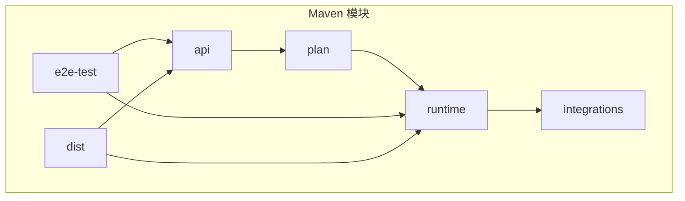
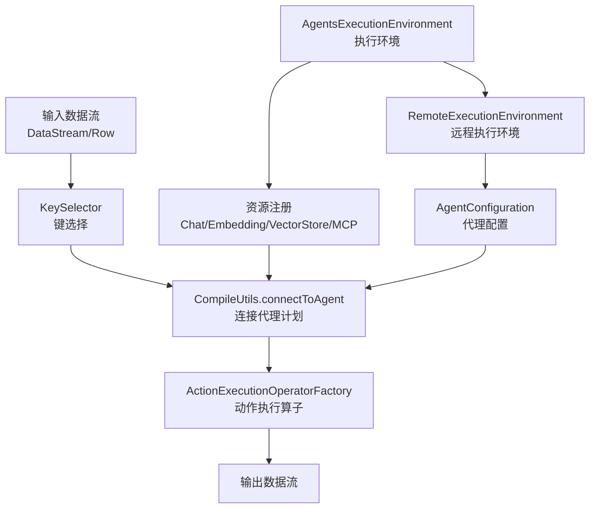
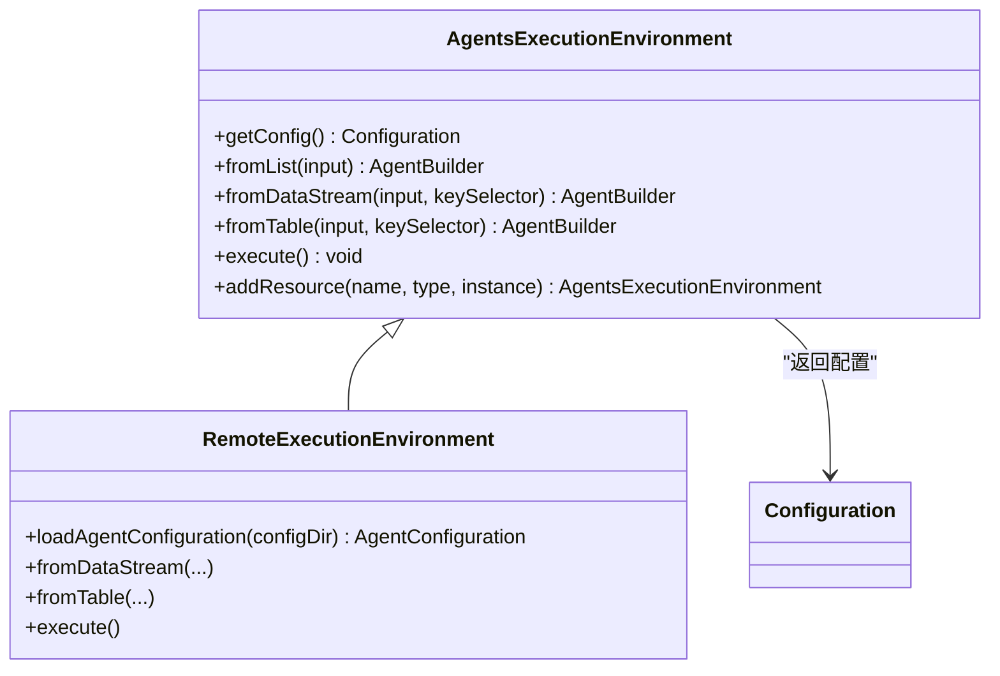
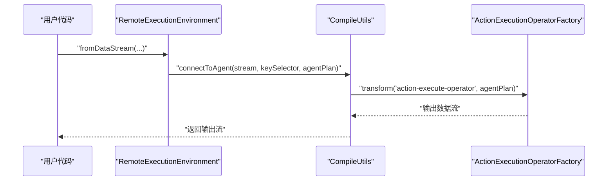
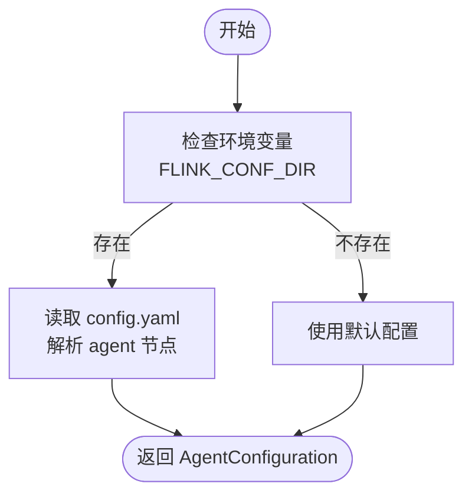
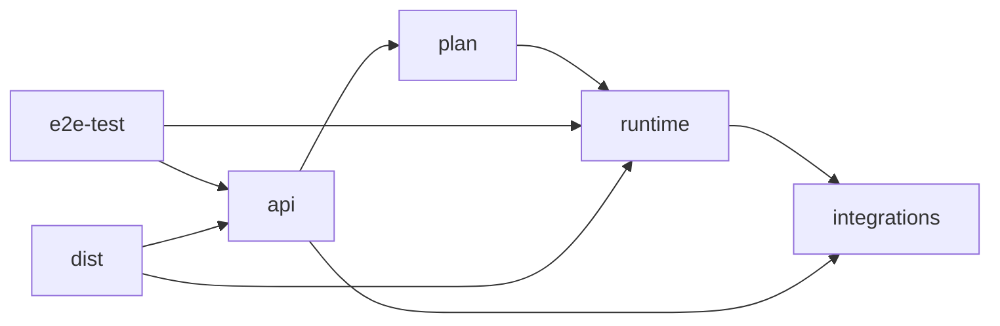

# 生产部署

<cite>
**本文引用的文件**
- [README.md](file://README.md)
- [pom.xml](file://pom.xml)
- [tools/build.sh](file://tools/build.sh)
- [tools/start_ollama_server.sh](file://tools/start_ollama_server.sh)
- [api/src/main/java/org/apache/flink/agents/api/AgentsExecutionEnvironment.java](file://api/src/main/java/org/apache/flink/agents/api/AgentsExecutionEnvironment.java)
- [api/src/main/java/org/apache/flink/agents/api/configuration/Configuration.java](file://api/src/main/java/org/apache/flink/agents/api/configuration/Configuration.java)
- [runtime/src/main/java/org/apache/flink/agents/runtime/env/RemoteExecutionEnvironment.java](file://runtime/src/main/java/org/apache/flink/agents/runtime/env/RemoteExecutionEnvironment.java)
- [runtime/src/main/java/org/apache/flink/agents/runtime/CompileUtils.java](file://runtime/src/main/java/org/apache/flink/agents/runtime/CompileUtils.java)
</cite>

## 目录
1. [简介](#简介)
2. [项目结构](#项目结构)
3. [核心组件](#核心组件)
4. [架构总览](#架构总览)
5. [详细组件分析](#详细组件分析)
6. [依赖关系分析](#依赖关系分析)
7. [性能考量](#性能考量)
8. [故障排查指南](#故障排查指南)
9. [结论](#结论)
10. [附录](#附录)

## 简介
本文件面向系统管理员与运维工程师，提供 Apache Flink Agents 在生产环境中的完整部署实施指导。内容涵盖：
- 集群部署配置：Flink 集群配置要点、资源分配与高可用性设置
- 容器化部署：Docker 镜像构建、Kubernetes 部署与 Helm Charts 使用建议
- 云平台部署：AWS、Azure、GCP 的部署最佳实践
- 分布式部署：网络、存储与安全配置
- 部署前后检查与验证流程
- 多数据中心与灾备部署配置指南

## 项目结构
Flink Agents 采用多模块 Maven 结构，核心模块包括 API、计划（Plan）、运行时（Runtime）、集成（Integrations）与端到端测试（E2E）。生产部署主要涉及运行时与集成模块，以及通过工具脚本进行构建与本地验证。

图表来源
- [pom.xml](file://pom.xml#L58-L67)

章节来源
- [pom.xml](file://pom.xml#L1-L319)

## 核心组件
- 执行环境抽象：AgentsExecutionEnvironment 提供本地与远程两种执行环境的统一入口，并支持从列表、DataStream、Table 输入数据流。
- 远程执行环境：RemoteExecutionEnvironment 将代理集成到 Flink 流式运行时，加载配置并连接到 Action 执行算子。
- 编译桥接：CompileUtils 负责将 DataStream/Row 与 Agent 计划对接，生成可执行的数据流管道。
- 配置接口：Configuration 提供读写配置的能力，用于在运行时注入参数。

章节来源
- [api/src/main/java/org/apache/flink/agents/api/AgentsExecutionEnvironment.java](file://api/src/main/java/org/apache/flink/agents/api/AgentsExecutionEnvironment.java#L43-L223)
- [runtime/src/main/java/org/apache/flink/agents/runtime/env/RemoteExecutionEnvironment.java](file://runtime/src/main/java/org/apache/flink/agents/runtime/env/RemoteExecutionEnvironment.java#L50-L217)
- [runtime/src/main/java/org/apache/flink/agents/runtime/CompileUtils.java](file://runtime/src/main/java/org/apache/flink/agents/runtime/CompileUtils.java#L32-L86)
- [api/src/main/java/org/apache/flink/agents/api/configuration/Configuration.java](file://api/src/main/java/org/apache/flink/agents/api/configuration/Configuration.java#L20-L25)

## 架构总览
下图展示了从输入数据流到代理执行再到输出的关键路径，以及配置加载与资源注册的交互关系。

图表来源
- [runtime/src/main/java/org/apache/flink/agents/runtime/CompileUtils.java](file://runtime/src/main/java/org/apache/flink/agents/runtime/CompileUtils.java#L44-L84)
- [runtime/src/main/java/org/apache/flink/agents/runtime/env/RemoteExecutionEnvironment.java](file://runtime/src/main/java/org/apache/flink/agents/runtime/env/RemoteExecutionEnvironment.java#L102-L117)
- [api/src/main/java/org/apache/flink/agents/api/AgentsExecutionEnvironment.java](file://api/src/main/java/org/apache/flink/agents/api/AgentsExecutionEnvironment.java#L207-L221)

## 详细组件分析

### 组件一：执行环境与配置加载
- 本地与远程执行环境的选择由工厂方法决定；远程环境会从 Flink 配置目录加载 YAML 配置并封装为 AgentConfiguration。
- 支持从列表、DataStream、Table 输入，其中远程环境不支持 fromList，需使用流式或表式输入。
- 资源注册通过 addResource 接口完成，支持可序列化资源与资源描述符。

图表来源
- [api/src/main/java/org/apache/flink/agents/api/AgentsExecutionEnvironment.java](file://api/src/main/java/org/apache/flink/agents/api/AgentsExecutionEnvironment.java#L43-L223)
- [runtime/src/main/java/org/apache/flink/agents/runtime/env/RemoteExecutionEnvironment.java](file://runtime/src/main/java/org/apache/flink/agents/runtime/env/RemoteExecutionEnvironment.java#L50-L117)
- [api/src/main/java/org/apache/flink/agents/api/configuration/Configuration.java](file://api/src/main/java/org/apache/flink/agents/api/configuration/Configuration.java#L20-L25)

章节来源
- [api/src/main/java/org/apache/flink/agents/api/AgentsExecutionEnvironment.java](file://api/src/main/java/org/apache/flink/agents/api/AgentsExecutionEnvironment.java#L68-L121)
- [runtime/src/main/java/org/apache/flink/agents/runtime/env/RemoteExecutionEnvironment.java](file://runtime/src/main/java/org/apache/flink/agents/runtime/env/RemoteExecutionEnvironment.java#L102-L117)
- [api/src/main/java/org/apache/flink/agents/api/configuration/Configuration.java](file://api/src/main/java/org/apache/flink/agents/api/configuration/Configuration.java#L20-L25)

### 组件二：数据流编译与连接
- CompileUtils 提供从 Java/Python 数据流到代理计划的桥接，根据输入类型（Java 对象或字节数组）选择不同的处理路径。
- 将 KeyedStream 与 ActionExecutionOperatorFactory 组合，形成最终的输出数据流，并保持与输入相同的并行度。

图表来源
- [runtime/src/main/java/org/apache/flink/agents/runtime/env/RemoteExecutionEnvironment.java](file://runtime/src/main/java/org/apache/flink/agents/runtime/env/RemoteExecutionEnvironment.java#L86-L94)
- [runtime/src/main/java/org/apache/flink/agents/runtime/CompileUtils.java](file://runtime/src/main/java/org/apache/flink/agents/runtime/CompileUtils.java#L44-L84)

章节来源
- [runtime/src/main/java/org/apache/flink/agents/runtime/CompileUtils.java](file://runtime/src/main/java/org/apache/flink/agents/runtime/CompileUtils.java#L32-L86)

### 组件三：配置加载流程
- 远程执行环境从 Flink 配置目录加载 YAML 文件，解析出 agent 节点并封装为 AgentConfiguration。
- 若未设置配置目录，则使用默认空配置。

图表来源
- [runtime/src/main/java/org/apache/flink/agents/runtime/env/RemoteExecutionEnvironment.java](file://runtime/src/main/java/org/apache/flink/agents/runtime/env/RemoteExecutionEnvironment.java#L102-L117)

章节来源
- [runtime/src/main/java/org/apache/flink/agents/runtime/env/RemoteExecutionEnvironment.java](file://runtime/src/main/java/org/apache/flink/agents/runtime/env/RemoteExecutionEnvironment.java#L102-L117)

## 依赖关系分析
- 版本与依赖管理：顶层 POM 统一管理 Flink、Jackson、JUnit、Mockito 等版本，确保跨模块一致性。
- 模块间耦合：API 模块定义接口与配置；Plan 模块负责代理计划序列化/反序列化；Runtime 模块实现与 Flink 运行时的桥接；Integrations 模块提供外部资源（如聊天模型、嵌入模型、向量库、MCP）的接入。

图表来源
- [pom.xml](file://pom.xml#L58-L67)

章节来源
- [pom.xml](file://pom.xml#L69-L107)

## 性能考量
- 并行度保持：编译桥接阶段将输出流的并行度与输入流保持一致，避免不必要的重分区。
- 键控处理：通过 KeySelector 对输入进行键控，确保状态与窗口操作的正确性与性能。
- 资源复用：在远程执行环境中集中注册资源，减少重复初始化成本。
- 序列化开销：Python 侧输入为字节数组，注意在代理计划中合理控制序列化与反序列化的频率。

章节来源
- [runtime/src/main/java/org/apache/flink/agents/runtime/CompileUtils.java](file://runtime/src/main/java/org/apache/flink/agents/runtime/CompileUtils.java#L72-L84)
- [api/src/main/java/org/apache/flink/agents/api/AgentsExecutionEnvironment.java](file://api/src/main/java/org/apache/flink/agents/api/AgentsExecutionEnvironment.java#L207-L221)

## 故障排查指南
- 远程执行环境不支持 fromList：请改用 fromDataStream 或 fromTable。
- 未设置 Flink 配置目录：若需要加载代理配置，请设置环境变量并提供 config.yaml。
- 资源类型不支持：仅支持可序列化资源与资源描述符，否则会抛出异常。
- 构建失败：确认已安装 Java 11、Maven、Python 3.10/3.11 与必要的系统工具。

章节来源
- [api/src/main/java/org/apache/flink/agents/api/AgentsExecutionEnvironment.java](file://api/src/main/java/org/apache/flink/agents/api/AgentsExecutionEnvironment.java#L80-L83)
- [runtime/src/main/java/org/apache/flink/agents/runtime/env/RemoteExecutionEnvironment.java](file://runtime/src/main/java/org/apache/flink/agents/runtime/env/RemoteExecutionEnvironment.java#L102-L117)
- [api/src/main/java/org/apache/flink/agents/api/AgentsExecutionEnvironment.java](file://api/src/main/java/org/apache/flink/agents/api/AgentsExecutionEnvironment.java#L214-L219)
- [README.md](file://README.md#L9-L28)

## 结论
本文基于代码库对 Flink Agents 的执行环境、配置加载与数据流桥接进行了系统梳理，并给出了生产部署的总体思路与实施要点。结合后续章节的“附录”部分，可进一步完善容器化与云平台部署细节。

## 附录

### A. 集群部署配置
- Flink 集群配置要点
  - 作业管理与任务管理：合理设置 TaskManager 数量与内存，确保与代理计划的并行度匹配。
  - 状态后端：推荐 RocksDB，启用增量检查点以降低开销。
  - 网络与内存：开启异步快照、调整网络缓冲区大小，优化背压。
- 资源分配
  - CPU/内存：按代理动作（LLM 推理、嵌入计算、向量检索）评估峰值资源需求。
  - 并行度：从输入到代理再到下游算子保持一致或可控倍数。
- 高可用性
  - 启用 Checkpoint 与 Savepoint，配置 HA 模式与元数据存储（ZooKeeper/JobManager HA）。
  - 多副本与滚动升级策略，保障服务连续性。

### B. 容器化部署方案
- Docker 镜像构建
  - 基于最小化基础镜像，安装运行时所需依赖（如 Python 运行时、系统库）。
  - 将构建产物（JAR/Wheel）复制至镜像内，暴露必要的端口与卷。
- Kubernetes 部署
  - 使用 Deployment/StatefulSet 部署 JobManager/TaskManager，配置资源请求与限制。
  - 通过 ConfigMap/Secret 注入 Flink 配置与密钥信息。
  - 使用 Headless Service 暴露服务，持久化状态目录。
- Helm Charts 使用
  - 将 Flink 集群与代理应用拆分为独立 Chart，通过 values 控制副本数、资源与存储。
  - 为每个组件定义健康检查与就绪探针，确保滚动更新过程中的稳定性。

### C. 云平台部署策略
- AWS
  - 使用 EKS 托管集群，结合 IAM 角色与 IRSA 访问 S3/Kafka 等服务。
  - 使用 EBS/GP3 提供持久化存储，配置自动快照与备份。
- Azure
  - 使用 AKS，结合托管身份访问 Key Vault 与 Blob 存储。
  - 使用 Azure NetApp Files 或 Disk Pool 提供高性能共享存储。
- GCP
  - 使用 GKE，结合 Workload Identity 访问 Cloud Storage/Secret Manager。
  - 使用 Persistent Disk SSD 或 Filestore 作为共享存储。

### D. 分布式部署的网络、存储与安全
- 网络
  - 代理调用外部模型服务（OpenAI/Azure AI/Ollama）时，确保 VPC/防火墙放行相应端口。
  - 使用私有 DNS 与内网负载均衡，降低公网暴露面。
- 存储
  - 状态后端与检查点存储使用对象存储（S3/GCS/ADLS），开启加密与版本控制。
  - 向量库（如 Elasticsearch/Chroma）建议独立集群，具备高可用与备份。
- 安全
  - 密钥与凭据通过 Secret/密钥管理服务注入，避免硬编码。
  - 启用 TLS 与 mTLS，限制网络访问范围，使用网络策略隔离命名空间。

### E. 部署前环境检查清单
- 基础设施
  - 集群节点满足最低 CPU/内存要求，网络连通性正常。
  - 对象存储与消息队列（如 Kafka）可用且权限正确。
- 运行时
  - Java 11 已安装，Maven 可用，Python 3.10/3.11 可用。
  - 本地拉起 Ollama 服务（可选）以验证本地资源集成。
- 配置
  - 准备 config.yaml 并放置于 Flink 配置目录，确保 agent 节点配置正确。
  - 资源注册（聊天模型、嵌入模型、向量库、MCP）已按需配置。

章节来源
- [tools/start_ollama_server.sh](file://tools/start_ollama_server.sh#L19-L28)
- [runtime/src/main/java/org/apache/flink/agents/runtime/env/RemoteExecutionEnvironment.java](file://runtime/src/main/java/org/apache/flink/agents/runtime/env/RemoteExecutionEnvironment.java#L57-L65)

### F. 部署后验证步骤
- 功能验证
  - 提交一个最小化作业，验证从 DataStream/Table 到代理再到输出的端到端链路。
  - 检查事件日志与指标，确认代理动作执行与资源调用正常。
- 性能验证
  - 在不同并行度下压测吞吐与延迟，观察背压与 GC 行为。
  - 对比增量检查点与全量检查点的恢复时间。
- 安全与合规
  - 校验密钥注入与访问控制策略生效。
  - 审计日志与合规报告导出验证。

### G. 多数据中心与灾备部署
- 多活部署
  - 在多个可用区/区域部署 Flink 集群与代理应用，使用全局负载均衡分发流量。
  - 状态后端与对象存储跨区域复制，确保数据一致性。
- 灾备切换
  - 定期创建 Savepoint，演练故障切换流程。
  - 通过自动化脚本与监控告警，快速定位并恢复异常节点。

### H. 构建与本地验证
- 构建命令
  - 全量构建：使用顶层脚本一键构建 Java 与 Python 产物，并将 JAR 复制到 Python 包中。
- 本地验证
  - 使用工具脚本启动本地推理服务（如 Ollama），验证资源跨语言集成。

章节来源
- [tools/build.sh](file://tools/build.sh#L42-L86)
- [README.md](file://README.md#L23-L30)